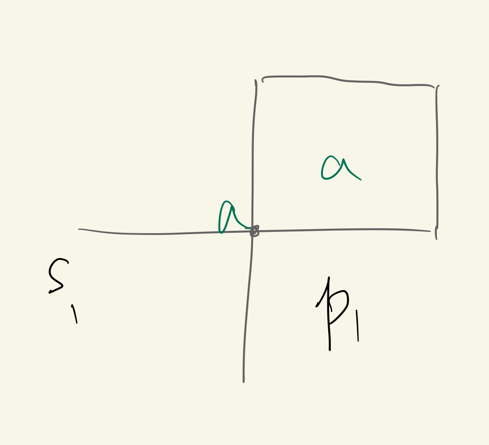
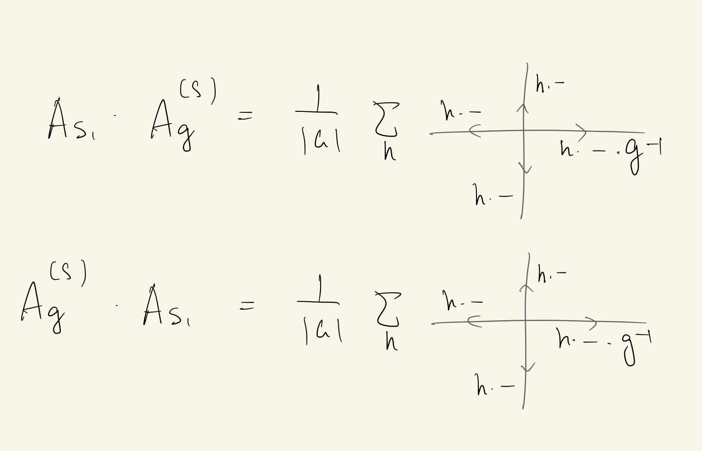

type:: paper_reading

- 
- # BlackBoxes
	-
- # Comment
	- Why classical memory are not prone to fault? #card
	  collapsed:: true
		- Classical errors are corrected on a **physical** (Hamiltonian) level, not by external operations.
			- For example, interactions between spins could flip back those with different directions.
		- Therefore, we want a model which also corrects errors on a physical level.
		- #+BEGIN_NOTE
		  The thinking is straightforward, but so stunning and powerful.
		  I should definitely learn to think starting from such a fundamental level.
		  #+END_NOTE
	- About LRE
		- ((661f3049-a76e-40a9-9d8f-2061f08d8133))
			- The answer is LRE, which is perceived so early by Kitaev...
		- There should be no local parameter, since a quantum code could not be sensitive to local operations and measurements.
- # Setup
	- Hamiltonians
		- Toric code
			- $$
			  A_s=\prod_{j \in \operatorname{star}(s)} \sigma_j^x \quad B_p=\prod_{j \in \operatorname{boundary}(p)} \sigma_j^z
			  $$
		- General quantum doubles
			- $$
			  H_0=\sum_s(1-A(s))+\sum_p(1-B(p))
			  $$
			- The convention is
			  $$
			  A(s)=N^{-1} \sum_{g \in G} A_g(s, p) \quad B(p)=B_1(s, p)
			  $$
				- $A$ multiplies by group elements and $B$ ensures zero-flux
	- Spaces
	  collapsed:: true
		- $\mathcal N$ is the whole Hilbert space.
		- $\mathcal{L}[n]=\mathcal{L}\left(x_1, \ldots, x_n\right)$ is the space of $n$-particle states
		- $\mathcal{L}(a,b)$ is the space of two-particle excitations.
			- Here $a=(s, p)$ and $b=\left(s^{\prime}, p^{\prime}\right)$ are the sites occupied by the particles.
				- Recall that a site is a combination of a vertex and an adjacent face.
				- The particles **could be vacuum**.
			- The projector onto $\mathcal{L}(a, b)$ can be written as $\prod_{r \neq s, s^{\prime}} A(r) \prod_{l \neq p, p^{\prime}} B(l)$.
	- Operators
		- $$
		  \begin{aligned}
		  & L_{+}^g|z\rangle=|g z\rangle \quad T_{+}^h|z\rangle=\delta_{h, z}|z\rangle \\
		  & L_{-}^g|z\rangle=\left|z g^{-1}\right\rangle \quad T_{-}^h|z\rangle=\delta_{h^{-1}, z}|z\rangle \\
		  &
		  \end{aligned}
		  $$
		- $\mathbf{L}(V)$ is the algebra of operators on space $V$
			-
		- $\mathcal{P}[n] \subseteq \mathbf{L}(\mathcal{L}[n])$ is the algebra of local operators on n-particle states
		  collapsed:: true
			- Is $\mathbf{L}(\mathcal{L}[n])$ really a linear space? #Blackbox
			  background-color:: red
				- Bowen told us that it might not be a linear space, only a convex set of density matrices.
				- Attempt
					- After purifying the density matrix on an annulus (i.e. plugging in the whole system), combination of density matrices -> Superposition of quantum states.
						- Perhaps only OK on a finite system.
			- $\mathcal C[n]$ is the center of $\mathcal{P}[n]$, which should correspond to the anyon type.
			- Q: Why don't we consider the center of $\mathbf{L}(\mathcal{L}[n])$, but the local operator algebra $\mathcal P[n]$? #card
				- The anyon type should be locally measurable (i.e. measurable by local operators).
				- Non-local operators are not well-defined in the thermodynamic limit.
					- Nonetheless, they are meaningful on closed manifolds as they concern GSD.
		- $\mathcal P(\mathcal L(a,b)$ is the algebra generated by local operators on $\mathcal L(a,b)$. [Ref](((661f7629-dfd0-42d0-a751-f25ba22e7f34)))
		  collapsed:: true
			- They should preserve the subspace $\mathcal{L}(a, b) \subseteq \mathcal{N}$ and its orthogonal complement.
			- Why should the orthogonal complement be also preserved?
			  background-color:: red
				- States in the orthogonal complement have excitations on sites other than $a$ and $b$.
			- Examples
				- The operators $A_g(a)$ and $B_h(a)$, where $a=(s, p)$
			-
		- $\mathcal{D}(a)$ is the **quantum double** algebra generated by $A_g(a)$ and $B_h(a)$.
			- Note that these operators are **not** the equivariantized terms $A_s$ and $B_p$ in the Hamiltonian.
			- See ((661f77f1-9a12-4ea2-b10e-12537e234ad1))
	- About the group
		- $$
		  \mathcal{H}=\mathbb{C}[G]
		  $$
		- $$N=|G|$$
- # ((64be93a5-ba14-4a9a-9be0-65d2e66d72f3))
  collapsed:: true
	- Proposition. The [[Toric Code]] model is stable under perturbation.
		- Consider a **local** perturbation $V$ to the Hamiltonian, i.e. each term contains only finitely many terms.
		- We can use the usual perturbation theory because the energy spectrum has a gap.
		- In the $m$-th order of the perturbation theory, the splitting is proportional to $$\left\langle\xi\left|V^m\right| \eta\right\rangle$$
		  or
		  $$\left\langle\xi\left|V^m\right| \xi\right\rangle-\left\langle\eta\left|V^m\right| \eta\right\rangle$$
		- However, both quantities are zero unless $V^m$ contains a product of $\sigma_j^z$ or $\sigma_j^x$ along a **non-contractible** loop or cut.
		- Hence, the splitting appears only in the $\lceil k / 2\rceil$-th or higher orders.
		- As far as all things (like the number of the relevant terms in $V^m$ ) scale correctly to the thermodynamic limit, the splitting vanishes as $\exp (-a k)$.
		-
- # ((64be93b2-e1d5-4724-9cb8-935061ce9364))
  collapsed:: true
	- #+BEGIN_NOTE
	  Important intuition: Excitations correspond to string operators.
	  #+END_NOTE
	- Physical intuition for robustness of GS
		- Anyons must be tunneled across the whole torus to act nontrivially on GS.
		- However, the tunning probability decays exponentially with the distance.
- id:: 655835ba-b063-4a17-82c1-368a3114298b
  #+BEGIN_Warning
  What to study after constructing the interesting model? What good questions are to be raised?
  #+END_Warning
	-
- # ((64be93c4-7c15-442d-97ad-c709819f9f80))
- # ((64be93cb-e185-4824-b9ea-9fbac5f70ed4))
	- ## Excitation properties
		- Results
			- The space $\mathcal{L}[n]=\mathcal{L}\left(x_1, \ldots, x_n\right)$ of $n$-particle states has dimensionality $N^{2(n-1)}$.
			- The space and the algebra split according to anyon types,
			  id:: 661f4196-2c7e-4ba0-a76f-2cb9b81e3562
			  $$
			  \mathcal{L}[n]=\bigoplus_{d_1, \ldots, d_n} \mathcal{L}_{d_1, \ldots, d_n} \quad \mathcal{P}[n]=\bigoplus_{d_1, \ldots, d_n} \mathcal{P}_{d_1, \ldots, d_n} \quad\left(\mathcal{P}_{d_1, \ldots, d_n} \subseteq \mathbf{L}\left(\mathcal{L}_{d_1, \ldots, d_n}\right)\right)
			  $$
				- $d_m$ is the type of the $m$-th particle.
				- The "classical" subalgebra $\mathcal{C}[n]$ is generated by the projectors onto $\mathcal{L}_{d_1, \ldots, d_n}$.
					- Obviously Schur's lemma: To commute with a whole irrep, the operator must be identity on the irrep.
			- Theorem. We have a factorization of the linear space into local sector and nonlocal sector
			  $$
			  \mathcal{L}_{d_1, \ldots, d_n}=\mathcal{K}_{d_1, \ldots, d_n} \otimes \mathcal{M}_{d_1, \ldots, d_n} \quad \mathcal{P}_{d_1, \ldots, d_n}=\mathbf{L}\left(\mathcal{K}_{d_1, \ldots, d_n}\right)
			  $$
				- $\mathcal{K}_{d_1, \ldots, d_n}$ is local DOF and $\mathcal{M}_{d_1,\ldots,d_{n}}$ is nonlocal!
				- More concretely, $\mathcal{M}_{d_1, \ldots, d_n}$ is not accessible by local measurements and insensitive to local perturbations.
			-
			-
- # ((64be93d2-eec2-45de-99ec-b959ce0d2e1c))
	- ## ((66223967-75d0-46c5-ba2f-1f05214f98db))
		- Theorem. The algebra of local operators preserving $\mathcal{L}(a, b)$ is generated by $A_g(a)$ and $B_h(a)$.
			- Prop. $A_g(a)$ commutes with all $A_s$ and $B_p$.
				- {:height 208, :width 205}
				- $A_g(a)$ and $A_s(a)$
					- The key is rearrangement lemma.
					- $$A_s=\frac 1 {|G|} \sum_{h \in G} A_h(s, p)$$
					- $$A_g A_s =\frac 1 {|G|} \sum_{h \in G} A_{gh} = A_s$$
					  and same for $A_s A_g$
					-
				- $A_g(a)$ and $A_{s1}$
					- {:height 215, :width 332}
				- $B_h$ and $A_s$
					- Recall that $A_g B_h=B_{g h g^{-1}} A_g$
					- $$A_s B_h=\frac 1 {|G|} \sum_{g \in G} A_g B_h \\
					  =\frac 1 {|G|} \sum_{g \in G} B_{ghg^{-1}} A_g 
					  $$
				- Obviously $B_h$ commutes with any $B_p$.
		- Later we will see that the action is exact (i.e. different operators act differently).
	- ## The quantum double algebra
	  id:: 661f77f1-9a12-4ea2-b10e-12537e234ad1
		- Basics
			- The generators are
			  $$D_{(h, g)}:=B_h A_a$$
			- Defining relations
				- $$
				  A_f A_g=A_{f g} \quad B_h B_i=\delta_{h, i} B_h \quad A_g B_h=B_{g h g^{-1}} A_g
				  $$
				- Note that $A_1$ is the identity element.
				- The operators $D_{(h, g)}$ form a linear basis of $\mathcal{D}$. #Blackbox
					- Both $A_e$ and $\sum_h B_h$ are identities.
					- Note that the products of more than three A or B could always be reduced to a product of two.
			- Multiplication rules
				- $$
				  D_{\left(h_1, g_1\right)} D_{\left(h_2, g_2\right)}=\delta_{h_1, g_1 h_2 g_1^{-1}} D_{\left(h_1, g_1 g_2\right)}
				  $$
				- It could be rewritten as
				  $$
				  D_{\boldsymbol{m}} D_{\boldsymbol{n}}=\Omega_{\boldsymbol{m} \boldsymbol{n}}^{\boldsymbol{k}} D_{\boldsymbol{k}} \quad \Omega_{\left(h_1, g_1\right)\left(h_2, g_2\right)}^{(h, g)}=\delta_{h_1, g_1 h_2 g_1^{-1}} \delta_{h, h_1} \delta_{g, g_1 g_2}
				  $$
			- Hermitian conjugation
				- $$
				  A_g^{\dagger}=A_{g^{-1}} \quad B_h^{\dagger}=B_h \quad D_{(h, g)}^{\dagger}=D_{\left(g^{-1} h g, g^{-1}\right)}
				  $$
		- Prop. We could decompose $\mathcal{D}(a)$ into irreps,
		  $$
		  \mathcal{D}(a)=\bigoplus_d \mathbf{L}\left(\mathcal{K}_d\right)
		  $$
			- We can interpret $d$ as particle's type.
			- Proof
				- $\mathcal{D}(a)$ is closed under Hermitian conjugation, therefore a finite-dimensional $C^*$-algebra
	- ## ((64be93db-3644-4d98-b85f-5cfe37f0a88d))
-