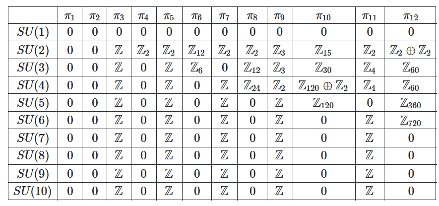

- 
- # Questions
- # Main Results
	- Classify Floquet systems from homotopy groups of the Floquet evolution operator and the effective Hamiltonian
	- Show the relation to chiral edge modes and pumping.
- # Setup
	- $$
	  U(T)=\mathcal{T} e^{-i \int_0^T H(t) d t}
	  $$
	- The system possesses discrete translational symmetry, thus we can always label instantaneous eigenstates with crystal momentum $k$.
	- Quasi-energy band structure $\left\{\varepsilon_{\mathbf{k}, \alpha}\right\}$, where $k$ is the crystal momentum and $\alpha$ is the band index.
- # ((6490005e-30b8-467a-9f40-945184dc7913))
	- We first consider 1D systems for simplicity.
	- Key idea: For an infinite periodic 1D system, the set of Floquet operators $\{U_k(T)\}$ defines a continuous map from the Brillouin zone to the unitary group, $S^1 \to U(m)$.
		- Note that $U(m) \simeq S^1 \times SU(m)$ while $SU(m)$ is simply connected, therefore we are only counting the determinant...
			- Would things be different for an infinite-dimensional Hilbert space?
		- Here the author takes $m$ lowest bands.
			- Note that each bands has a continuous energy spectrum (since the momentum is continuous).
		- Here is a table of homotopy groups:
		  
		- For $m \geq 2$,
		  $$
		  \pi_m(U(N))=\pi_m\left(S^1 \times S U(N)\right)=\pi_m\left(S^1\right) \oplus \pi_m(S U(N))=\pi_m(S U(N))
		  $$
	- $$
	  \nu_1=\frac{1}{2 \pi} \int_{-\pi}^\pi d k \operatorname{Tr}\left[U_k(T)^{-1} i \partial_k U_k(T)\right]
	  $$
	  is precisely the winding number of the determinant.
		- Key trick: 
		  $$\det e^{\ln U}=e^{\operatorname{tr} \ln U}$$
	-
-