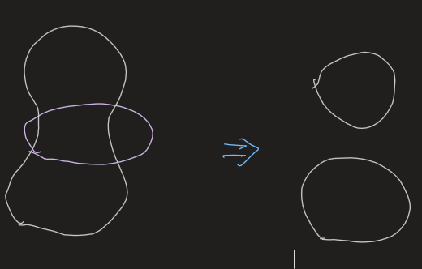
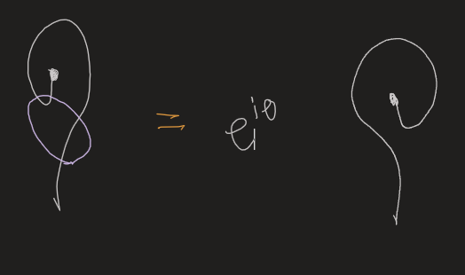

type:: paper_reading

- 
- [[To be recorded]]
- # Main Points
	- I.Orders and symmetries
		- [[Principle of Emergence]]
			- Same components, different organization
		- Clear some misnomers
			- [[Haldane Phase]]
			- [[Topological Insulators]] and [[Topological Superconductors]]
				- No topo order.
			- ((63bb85c6-0c63-4d5c-8d13-d49dac6ffcbc))
			-
	- II. New world of condensed matter physics
	- III. Topologically ordered phases
	  collapsed:: true
		- A.Chiral spin liquids and topological order
			- [[Spin Liquid]]
				- Spin liquid can leads to a so called spin-charge separation: an electron disintegrates into two quasiparticles – a **spinon**(spin-1/2 charge-0 ) and a **holon** (spin-0 charge-e).
				- Many believe they can explain high-Tc superconductivity.
					- Holons can condense.
				- However, ((63bb8741-a173-4b7b-ab9c-d74b055f554b))
				- [[Chiral Spin Liquid]]
					- There are deconfined spinons and holons.
					- However, ((63bbae75-1abe-41d3-b98f-c89924453c96))
						- ((63c14160-28c9-4f15-82dc-977a38e0993b))
			- Def of topo orders
				- Cannot be deformed into product states.
			- [[invertible]] topological orders #card
				- Some states don't have [[Topological excitation]], but with nonzero [[Chiral central charge]], thus **cannot** smoothly change to product states.
					- In other words, they're topo orders **without** topo excitations!
				- They're also called IQH states, Chern insulator, quantum anomalous Hall state, etc.
			- [[Quantum Liquid]]
				- ((63bb88a7-496e-45df-850f-d922549ce87a))
		- B. Quantum Hall states, abelian and nonabelian
			- [[Quantum Hall Effect]]
				- ((63bbaa7e-377b-4534-9977-d147d8f1dd76))
				- ((63bba996-3c33-4df4-82f6-739b4f33ad72))
					- Therefore, it cannot characterize topo orders.
				- There are also generalized Laughlin states ($\nu=\frac n m$) carrying **nonabelian** statistics.
					- Edge modes with **fractional** [[Chiral central charge]] indicates **nonabelian** statistics, since integer FQH states always have integer chiral central charge c.
					- There are string-like topo excitations, i.e. the $\frac{h c}{2 e}$ flux loop.
		- D. Superconducting states (with dynamical electromagnetism)
			- [[Superconductor]] are **not** symmetry breaking phases!
				- ((63bbadbf-aca5-43d3-96fd-dc8b75ecb94a))
		- F. Quantum liquids of non-oriented strings
		  id:: 439b4d01-7181-4a96-a2ff-3f02ac2fd59d
			- 1. Local “dancing” rules in string liquids
				- 'If you try too hard you get nothing.'
				- Two rules:
				  collapsed:: true
					- $Z_2$
						- ((63bcc020-586c-4188-a838-ff9662fd23ac))
					- Semion
						- ((63bcc02d-52b9-4eb9-a004-d87b87922212))
					- Note that general phases are **not allowed**.
						- A reconnection can either add or remove a loop. So reconnecting twice should be the identity operation.
							- 
				- DONE Calculate the spins and statistics by myself.
			- 2.Emergence of Fermi and fractional statistics #card
				- Spin
					- We consider a rotation (twist) by comparing ((63bcc1fa-40ee-453e-bba7-c91daefea9e7))
					  collapsed:: true
						- Note that they're **different**!
						  collapsed:: true
							- Don't be kidnapped by the intuitions in toric code, which happen to be $Z_2$ and carry extravagant properties.
							- Generally, a string coming out from the bottom is different from that coming out from the top.
					- If the string reconnection gives a phase $\theta$ (0 for Z2, $\pi$ for semion)
					  collapsed:: true
						- 
						- $$
						  R=\left(\begin{array}{ll}
						  0 & e^{i \theta} \\
						  1 & 0
						  \end{array}\right)
						  $$
						- Diagonalize: $\lambda^2=e^{i \theta}$
						  collapsed:: true
							- This equation **cannot** be directly solved in complex situation. We have a freedom of $\pm1$.
							  collapsed:: true
								- Be aware of the complex plane!
							- ^^We obtain two different statistics by superposing the string configurations!^^
							- $Z_2$ -> Eigenvalues $\pm1$
							- Semion -> Eigenvalues $\pm i$
						-
				- Spin-Statistics
				  collapsed:: true
					- ((63bccd71-dd02-48e0-8a98-037772c9bbd5))
						- From a to b we exchange the ends
						- From d to e we perform a $360^\circ$ rotation
					- He claims ((63bccdac-2e57-4e67-b8be-77f771a60218)), thus exchange <-> rotation. #Learning-TODO
						- Why?
				- More notes
					- $Z_2$ topo order has a bosonic quasiparticle and a fermionic one, but ((63bcce78-c61b-4fe7-9af0-f2609edc2690)).
						- Such quasi-particle content agrees exactly with the [[Z_2 gauge theory]] which also has three type of topological excitations, two bosons and one fermion.
				- Could even more exotic things emerge from a fermionic underlying system? #Possibility #Research
					- Even wilder: we can have a tower of emergent phenomena from the lattice model, but there are different towers...
			- [[Topological Degeneracy]]
				- Def
					- The ground state degeneracy of a gapped many-body system that is **robust against any local perturbations** (at the thermodynamic limit)
				-
				-
		- G.Table of some topological orders
	- IV. Nontrivial product states
		- A. [[Haldane Phase]] #card
			- First example: Spin-1/2 Heisenberg chain
				- $H=\sum_i \boldsymbol{S}_i \cdot \boldsymbol{S}_{i+1}$
				- Strange properties...
					- ((63be100d-b457-43e0-9e74-a509bf1a1717))
					- ((63be1023-5d6f-4c6a-819b-29a5ff766457))
					- ((63be1255-9fdc-42f8-8d67-287b2d7cec1f))
						- Why would we say 'a d.o.f. is spin-S/2'? How to quantify it? #Learning-TODO
						- People wonder whether there's a bulk topo order, since gapless edge modes in (2+1)D FQHE implied bulk orders. But it's **incorrect**.
							- In FQHE, it is a bulk property, ((63be12f5-1f74-4fb2-ab12-c335c45167a2)).
							- It is not the case for Haldane, where the boundary can be gapped (eg by a Zeeman field)
				- Haldane's wild conjecture
					- The spin chain is gapped if the spin is integer and gapless if half-integer.
						- Actually, ((63be16fc-5cb3-4e2f-a1cf-8b9871b3c3e4))]
							- So wild!
						- This is purely quantum effect displayed at a macroscopic scale! Why this could happen? #[[Thoughts/Math and Physics]]
				- Solution of the problem
					- TEFR approach ((63be14c2-b215-4684-b9b2-7761f006c987)) for XXZ chain $H=\sum_i J \boldsymbol{S}_i \cdot \boldsymbol{S}_{i+1}+U\left(S_i^z\right)^2$
						- A trivial tensor for $U>>J$, with ground state a product state
						- The fixed-point tensor has a 'corner-double-line' structure for $U<<J$
							- ((63be1596-f4bd-442a-bf9a-f4a636139773))
							- ((63bf6509-04f5-41e3-9acc-34b9f1cc7a8e))
								- ((63bf654e-d659-4c6d-ab4d-655033ae34fa))
				- However, non-topo doesn't mean trivial!
					- ((63be15ec-7e9a-4187-a1c8-7e845f7aca5c))
					- However, the structure is broken if the **symmetry** is broken.
				- Thus it is named a [[SPT]] state.
					- ((63be1664-75ab-4e78-99c1-240943a7ff8c)) #ToRead
					- ((63be166c-81fd-4635-bf4e-38aacc6a6176)) #ToRead
						- What's entanglement spectrum?
				-
			-
		- C.An Z2-SPT state in 2+1D
		  id:: 63bd25c7-512f-435c-9ce2-0852f5c02a07
			- ((63be23a3-08f8-43d6-a4f8-64e368098f43))
			- $\left|\Psi_0\right\rangle=\bigotimes_{\text {plaquette }} \frac{1}{\sqrt{2}}(|\uparrow \uparrow \uparrow \uparrow\rangle+|\downarrow \downarrow \downarrow \downarrow\rangle)$
				- A plaquette is connected by a red square.
				- Note the four spins are on four **different** sites.
			- Symmetry
				- $U_{C Z X}=U_X U_{C Z}$
					- $U_X=\sigma_1^x \sigma_2^x \sigma_3^x \sigma_4^x$
					- $U_{C Z}$, is a product of $C Z_{i j}$ that acts on the two spins at $i$ and $j: C Z_{i j}=-1$ when acts on $|\downarrow \downarrow\rangle$ and $C Z_{i j}=1$ otherwise.
					-
		- D. Probing SPT orders
		  id:: 63bd25c7-010b-44dd-a55b-58021693fc3c
			- Probing the boundary
				- ((63be24fa-04c9-4125-bb34-bccf66acb626))
			- Twist the symmetry
				- ((63be255f-d409-463d-9e41-b8ad2924a2c7))
					- Perform symmetry transformations on the cuts
					- Only the ends cost energy!
					- The ends are called **monodromy defects**
			- ((63be25d8-25f0-43e4-982b-6a74bac206d4))
				-
		- E.Table of some SPT states
	- V.Towards a classification of all gapped phases
-