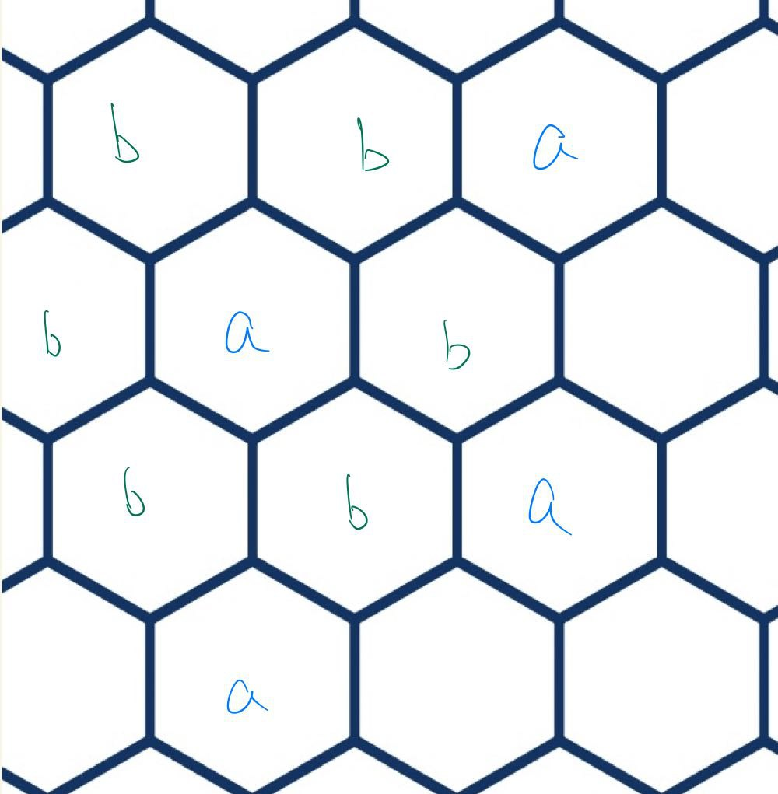

- 
	-
- # ((64c4125f-c029-4e98-8b13-26433ae5fd86))
  collapsed:: true
	- Note that LU time evolution and LU quantum circuit are ((64c41279-b345-4420-bcad-b90a726f1d4a)).
	- ## [[Wavefunction Renormalization]]
	  collapsed:: true
		- Idea
			- Use local unitaries to **remove local entanglement** and obtain a **fixed-point wavefunction**.
			- Note that the procedure is quite similar to tensor network renormalization geometrically... is there anything special?
			  collapsed:: true
		- ## Setup
			- Notations
				- Consider a state $|\Phi\rangle$.
				- Let $\rho_A$ be the reduced density matrix of $|\Phi\rangle$ in region $A$.
				- Let $\left|\psi_i\right\rangle, i=1, \ldots, D_A$ be a basis of the total Hilbert space $V_A$ in region A, where $D_A$ is the dimension of $V_A$. $\rho_A$ may act in a subspace of $V_A$.
				- **Support space**: An invariant subspace where the restriction of $\rho_A$ is invertible, i.e. 'excluding the zero space'.
				- The dimension $D_A^{s p}$ of $V_A^{s p}$ is called the **support dimension** of region $A$.
				- Now the Hilbert space $V_A$ in region A can be written as $V_A=V_A^{s p} \oplus$ $\bar{V}_A^{s p}$.
					- $\left|\tilde{\psi}_i\right\rangle, i=1, \ldots, D_A^{s p}$ is a basis of thesupport space $V_A^{s p}$
					- $\left|\tilde{\psi}_i\right\rangle, i=D_A^{s p}+$ $1, \ldots, D_A$ be a basis of $\bar{V}_A^{s p}$.
		- ## Examples of Fixed-Point Wavefunctions
			- Product state
				- This is a trivial example: No matter how many d.o.f. we add/remove, the system is always in product state.
			- [[Toric Code]] #card
			  card-last-interval:: 29.95
			  card-repeats:: 1
			  card-ease-factor:: 2.6
			  card-next-schedule:: 2023-08-30T10:20:27.790Z
			  card-last-reviewed:: 2023-07-31T12:20:27.791Z
			  card-last-score:: 5
				- ((64c42091-4178-4faf-922b-599aeb0aaa8c))
				  collapsed:: true
					- (a) Step 1. Reshape the lattice and add d.o.f. as product states
					  collapsed:: true
						- Here the new d.o.f. are still spin-1/2. They are all in the $|0\rangle$ state.
					- Step 2. Perform local unitaries.
					  collapsed:: true
						- 2.1: Make correct strings pass the extra links for each configuration.
						  collapsed:: true
							- To be specific, apply a $\sigma_x$ operator to the added spin if the up and left links carry an odd number of strings and do nothing otherwise.
							- This is a linear map defined by action on each configuration vector.
						- 2.2: Make the plaquettes into product states.
						  background-color:: yellow
						  collapsed:: true
							- #+BEGIN_TIP
							  This is the most mysterious step...
							  #+END_TIP
							- In each plaquette there are 2 configurations (differing by a plaquette loop) determined by the strings passing the extra links.
							- We map the **equal superposition of 2 configurations** to **same strings passing the extra links and no string on the plaquette**.
							-
							-
					- (c) Step 3. Remove product-state d.o.f.
					  collapsed:: true
						- Now the original plaquettes are in product states, thus can be removed.
				- Obviously the intuition of **string** plays a crucial role!
				- Obscure intuitions
					- Here the extra links serve as 'boundary' of the plaquettes 'bulks'.
					- Allowed configurations of a certain plaquette are completely determined by adjacent plaquettes.
						- Even stronger, we can extract 'characters' of adjacent plaquettes, i.e. the extra links (parity of strings)
							- We don't really need the stronger condition to perform wavefunction renormalization, however the form would appear simpler.
					- Locality plays an important role here.
						- Without locality, allowed configurations of a plaquette could depend on numerous plaquettes far away.
					- 'Transform into products states by LU' <-> 'Redundant local information'.
						- i.e. the d.o.f. in question are already determined by adjacent plaquettes, thus 'omittable'.
						- Note that *local information* corresponds to *SRE*.
				- Questions
					- Is step 2.2 legitimate, i.e. defines a unitary?
						- Yes.
							- Orthogonal states (different extra-link configurations) are still orthogonal after the transformation.
							- i.e. For an orthogonal set $\{u_i \otimes v_i\} \sub U \otimes V$, we define a map
							  $$T:u_i \otimes v_i \mapsto u_i \otimes e_0$$
							  which is perfectly legitimate since we are only working in a **subspace** (support space) of the whole space.
					- Why can't we map arbitrary states to product states in this way?
					- Systematic way to perform wavefunction RG?
					- Generalization to other graphs
					  collapsed:: true
						- Evidently we have a 2-coloring of plaquettes. What about other lattices?
						- Honeycomb
						  collapsed:: true
							- {:height 417, :width 323}
							- It is readily in the renormalizable form. Just collapse all a-plaquettes.
						- General analysis
							- Suppose there is an irregular graph with n plaquette, while i^{th} plaquette has m_{i} vertices.
							- We need at most add $m_i$ extra links connected to the plaquette, contributing to $\frac {m_i} 2$ new d.o.f. while eliminating $m_i$ old d.o.f.
							- Therefore the number of d.o.f. **decreases** at each round!
							- This again vaguely reminds of [[Thermodynamic Limit]], only in which we have a proper definition of locality and RG.
					- Generalization to other topological orders
					  collapsed:: true
						- The insight is still that 'the bulk is decided by the boundary'. [[Bulk-Boundary Correspondence]]
						- $Z_n$ quantum double
							- The thing is pretty much the same (if we take the dual to the conventional setup)
							- Vertex condition $$A_v=\delta g_1 ... g_N, e$$ -> Zero-flux
								- Therefore, 'sum of external vertices' (outer flow at a vertex) must be canceled by 'sum of inner vertices' (inner flow)
							- Plaquette condition $$B_p=\frac{1}{|G|} \sum_{g \in G} A_v^g$$
								- Therefore once the external conditions are fixed, we obtain that the plaquette configuration must be a **superposition of all allowed inner flows**
	- [[Gapped Quantum System]]
- # ((64c59d5c-9022-455b-9a87-188654f2cc66))
- # ((64c7eaf2-c7ef-4958-8031-f56be1ebcdf5))
	- ## [[Matrix Product States]]