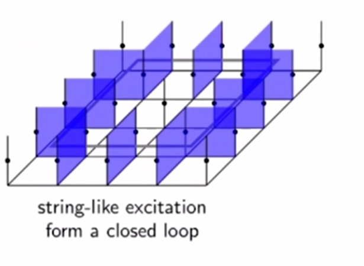
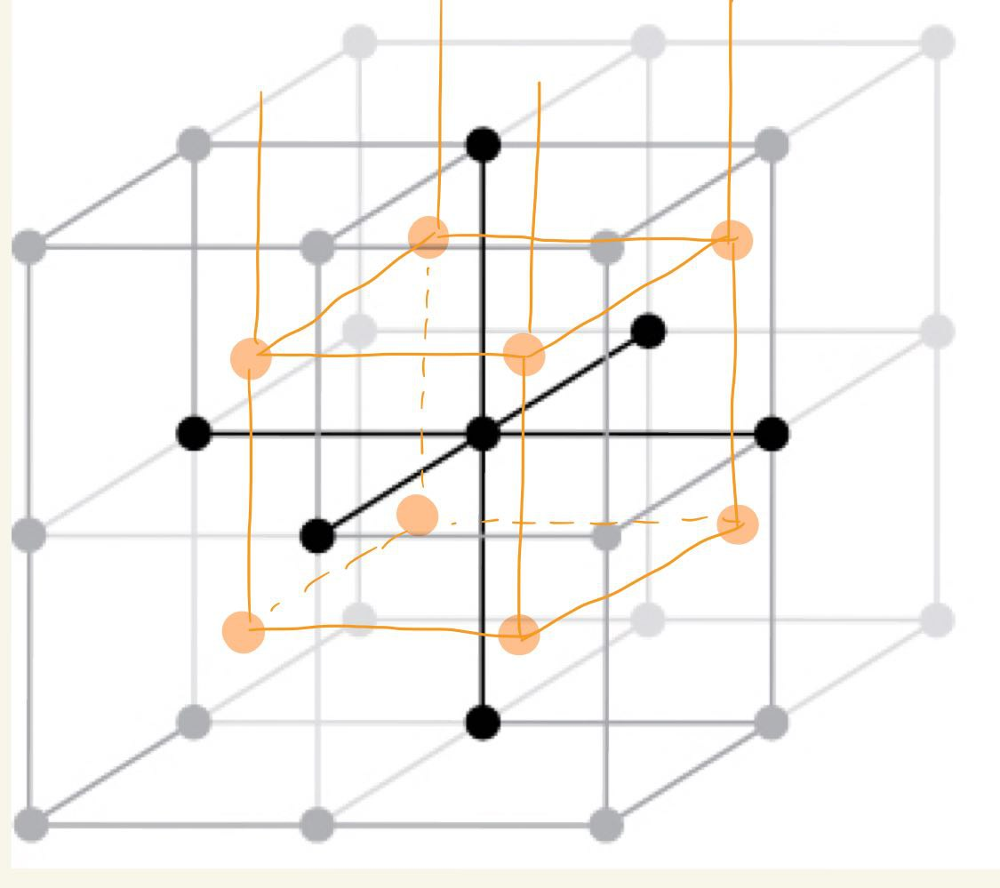
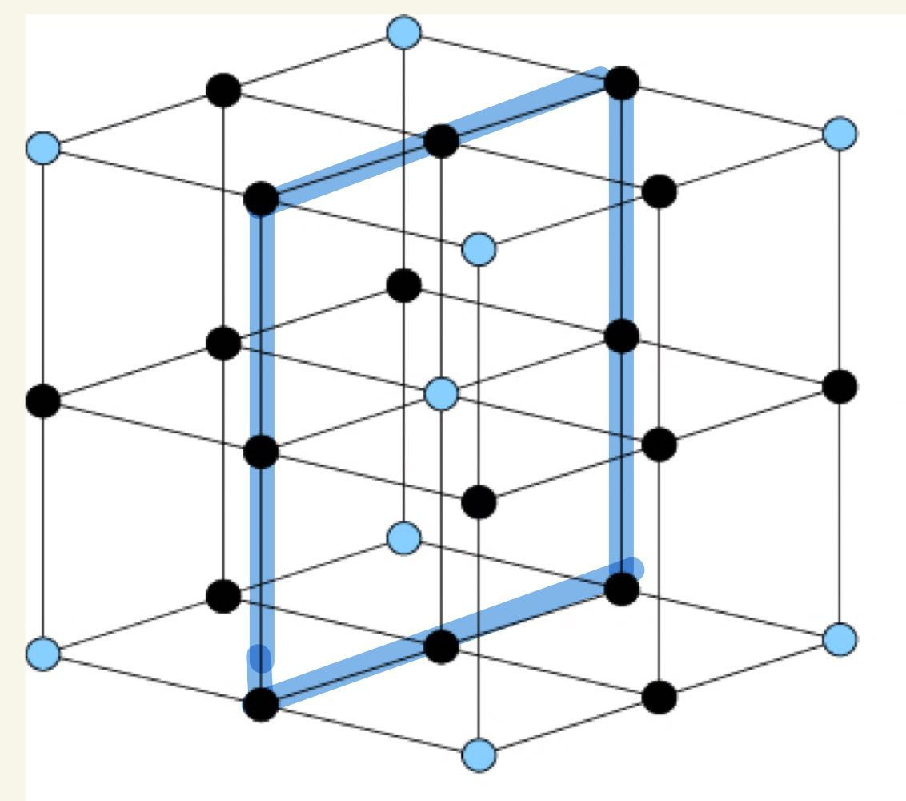

# Problems and Questions #card
card-last-interval:: 31.26
card-repeats:: 1
card-ease-factor:: 2.6
card-next-schedule:: 2023-09-09T18:45:30.200Z
card-last-reviewed:: 2023-08-09T12:45:30.201Z
card-last-score:: 5
	- What could be truly different from 2D?
		- The construction of closed membranes seem to be dual to that of closed loops.
			- The existence of string excitations is natural from the membrane point of view.
- # Examples
	- # 3D Toric Code
	  id:: 64ca5d6d-3d9c-4338-8264-4f9e70368e2c
	  collapsed:: true
		- Is the model dependent on details of the lattice?
		  id:: 64cfba22-8b55-47cc-aaed-b342f4030b8e
		  collapsed:: true
			- NO. The ground state is still superposition of closed-loop configurations.
		- ## Model
			- $H=-\sum_v A_v-\Sigma_p B_p$
				- $$\begin{array}{ll}
				  A_\nu:=\prod_{\partial v} \sigma_i^x \\
				  B_p:=\prod_{\partial p} \sigma_j^z
				  \end{array}$$
		- ## Counting ground states
			- Traditional way: Counting Constraints
				- Number of equations: $L^3$ vertices, $3L^3$ plaquettes
				- Constraints on equations
					- $\prod A_v=1$ gives 1 constraint.
					  logseq.order-list-type:: number
					- Around each cube, $\prod B_p=1$. However the product of all cubes includes each $B_p$ twice, which means the cube constraints aren't independent. Thus we need to subtract a constraint.
					  logseq.order-list-type:: number
					  Thus we have $L^3-1$ constraints.
					- On each X layer, $\prod B_p^{(X)}=1$. Similarly for Y and Z.
					  logseq.order-list-type:: number
					  However 2 and 3 isn't independent; the difference of two parallel layers is precisely a cube. 
					  Thus it actually gives 3 more constraints.
				- $GSD=2^{3L^3-[(3L^3+L^3)-1-(L^3-1)-3]}=8$
				-
				- Note that the process of counting constraints could be expressed as computing the rank of the stabilizer group on $Z_2$.
			- Topological way
			  collapsed:: true
				- The fundamental group of our $T^3$ seems to be $Z_2\times Z_2 \times Z_2$. So the degeneracy is 8.
		- ## Excitations
		  collapsed:: true
			- $A_v=-1$. The familiar 'excitations at the end of a string'. 0D.
			- $B_p=-1$. **Very interesting!**
			  collapsed:: true
				- Since there's a constraint that the product of all plaquettes around a cube is identity,
				  each unit cell must have an even number of plaquette flips.
				- **String-like excitation! 1-dimensional!**
				  collapsed:: true
					- 
				- *The structure is much more complicated then 2D TC, since strings may be knotted.
				  collapsed:: true
					- In other words, the excitations can have nontrivial **topology**.
					- Note that braiding is topology in the spacetime, while 3D TC can have nontrivial **spatial** topology.
		- ## Braiding
		  collapsed:: true
			- Familiar: Particle-Loop, Loop-Loop
			- Exercise. The braiding is homotopy invariant.
		- ## Duality #card
		  id:: 64cff5c3-0ed4-4429-9b13-06c34f8c7d42
		  card-last-interval:: 31.26
		  card-repeats:: 1
		  card-ease-factor:: 2.6
		  card-next-schedule:: 2023-09-09T18:47:45.692Z
		  card-last-reviewed:: 2023-08-09T12:47:45.693Z
		  card-last-score:: 5
			- {:height 213, :width 218}
			- ### Setup
				- DOF are spins put on plaquettes
				- Edge operator $A_e=\prod_{i \in \partial e}Z_i$, which punishes boundaries.
				- Cube operator $B_c=\prod_{i \in \partial c}X_i$, which guarantees homotopy equivalence.
			- ### Duality of Lattice
				- We make the following duality transformation: Cube <-> Vertex, Plaquette <-> Edge
				- Then my edge operators become plaquette operators and cube operators become vertex operators.
					- Note that there is still a bit difference, i.e. it is an X-basis while in the original 3D toric code Z-basis is used.
			- ### Wavefunction
				- Original: Close-loop configurations
				- Dual: Close-Membrane configurations
			- ### Excitations
				- Vertex excitation <-> Cube excitation
				- String excitation <-> String excitation (as the boundary of the membrane)
			- ### TEE
				- Still let's first consider the simplest case, a regular cubic region.
				  Note that the boundary plaquettes are taken as part of the region.
				- {:height 246, :width 195}
				- Boundary configuration
				  collapsed:: true
					- The ground states are closed membranes, thus the boundary configuration should be a closed loop.
					- Possible interior configurations are membranes (bulk of the boundary)
					-
					- In this case it is very simple. Select any reference configuration and all possible configurations could be obtained by homotopy (cube operators).
					- Thus all boundary configurations are of equal weight.
				- Non simply connected boundary and incontractible loops?
					- Intuitively, the boundary configuration must be contractible loops. Otherwise the membrane would have 'holes'.
				-
				- Conjecture. All allowed loops on the boundary could be obtained from the trivial loop by homotopy (mod Z_2 version). Moreover the weight of all configurations are equal.
					- Actually it is more like the Z_2 version homology, since the groups of 'boundary configurations' are manifestly abelian and defined mod 2.
				-
				- Then the number of allowed configurations is equal to the surface area **minus one**.
				  background-color:: red
					- Flipping all plaquettes produces the equivalent configuration.
					- Is it problematic?
				-
				- Duality with the original model
			-