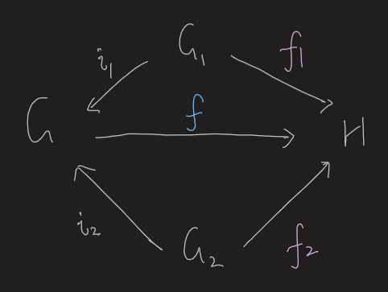
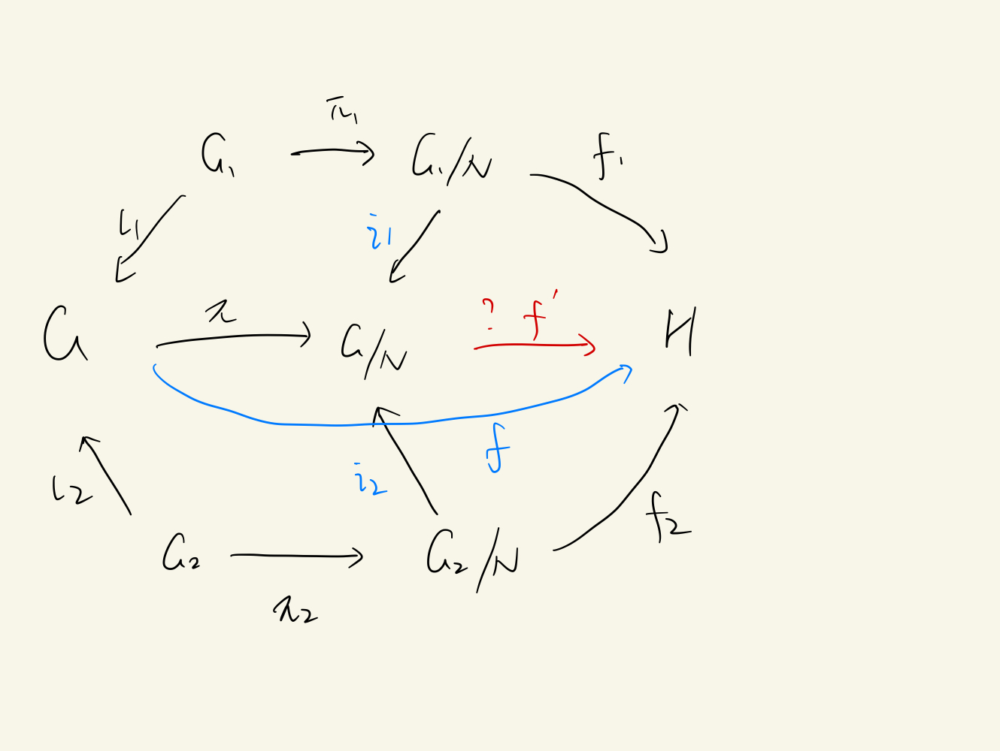

- [[References]]
	- 
- # Groups
	- Isomorphism Theorems #card
	  id:: 649e4af5-3e8a-4202-831b-2ad858b4b337
	  card-last-interval:: 31.26
	  card-repeats:: 1
	  card-ease-factor:: 2.36
	  card-next-schedule:: 2023-08-29T18:38:06.023Z
	  card-last-reviewed:: 2023-07-29T12:38:06.023Z
	  card-last-score:: 3
		- First:
		  $$
		  \widehat{f}: G / \operatorname{Ker} f \rightarrow \operatorname{Im} f
		  $$
		- Second:
		  $$
		  H /(H \cap N) \simeq H N / N
		  $$
		- Third:
		  $$
		  (G / M) /(N / M) \simeq G / N
		  $$
	- ## Free abelian group, free product and free group
	  id:: 63d60a1c-0e60-45af-8c23-f8c23c08600c
	  collapsed:: true
		- Defs
			- Suppose $G$ is an abelian group, and $\left\{G_\alpha\right\}_{\alpha \in J}$ is an indexed family of subgroups of $G$. We say that the groups $G_\alpha$ **generate** $G$ if every element $x$ of $G$ can be written as a **finite** sum of elements of the groups $G_\alpha$. 
			  It is a **direct sum** if the sum is unique.
			- Let $\left\{G_\alpha\right\}_{\alpha \in J}$ be an indexed family of **abelian** groups. Suppose that $G$ is an abelian group, and that $i_\alpha: G_\alpha \rightarrow G$ is a family of monomorphisms, such that $G$ is the direct sum of the groups $i_\alpha\left(G_\alpha\right)$. Then we say that $G$ is the **external direct sum** of the groups $G_\alpha$, relative to the monomorphisms $i_\alpha$.
			  collapsed:: true
				- A categorical-style def.
				- Obviously the sum could always **exists**; it is a tuple with coordinates in the respective $G_\alpha$. (Only finite coordinates can be nonzero)
				- Moreover it is **unique**. Another universal property.
			- [[Free Abelian Group]]
			  collapsed:: true
				- If $G$ is the direct sum of a collection of infinite cyclic subgroups $<a_i>$, then $G$ is said to be a free abelian group having the elements $\left\{a_\alpha\right\}$ as a **basis**.
				- A special case of [[Free Group]].
				- ((63d60be7-4847-414f-b5bc-114fe9bb9320)) (Extension condition for direct sums of abelian groups) Let $G$ be an abelian group; let $\left\{G_\alpha\right\}$ be a famly of subgroups of $G$. If $G$ is the direct sum of the groups $G_\alpha$, then $G$ satisfies the following condition:
				  collapsed:: true
				  Given any abelian group $H$ and any family of homomorphisms $h_\alpha: G_\alpha \rightarrow H$, there **exists a unique homomorphism** $h: G \rightarrow H$ whose restriction to $G_\alpha$ equals $h_\alpha$, for each $\alpha$.
				  Conversely, if the groups $G_{\alpha}$ **generate** $G$ and the extension condition holds, then $G$ is the direct sum of the groups $G_\alpha$.
					- The first part can be proven by direct construction.
					- It suffices to prove the linear independence for the second part.
			- [[Free Product of Groups]]
			  collapsed:: true
				- Reduced word
				  collapsed:: true
					- The sequence $\left(y_1, \ldots, y_m\right)$, where no group $G_\alpha$ contains both $y_i$ and $y_{i+1}$ and no element is the identity.
					- In short, a sequence cannot be further simplified.
				- Two equivalent definitions #card
				  card-last-interval:: 30
				  card-repeats:: 1
				  card-ease-factor:: 2.6
				  card-next-schedule:: 2023-05-05T00:37:18.223Z
				  card-last-reviewed:: 2023-04-05T00:37:18.223Z
				  card-last-score:: 5
					- Let $G$ be a group, let $\left\{G_\alpha\right\}_{\alpha \in J}$ be a family of subgroups of $G$ that generates $G$. We say that $G$ is **the free product** of the groups $G_\alpha$ if for each $x \in G$, there **exist a unique reduced word** in the groups $G_\alpha$ that represents $x$. In this case, we write
					  collapsed:: true
					  $$
					  G=\prod_{\alpha \in J}^* G_\alpha .
					  $$
					  or in the finite case, $G=G_1 * \cdots * G_n$.
						- Equivalently, $\left\{G_\alpha\right\}_{\alpha \in J}$ generate the group and linear independent (only obtain identity by multiplying identities)
						- Note that the $G_\alpha$ *don't commute*.
					-
					- Why doesn't the direct sum serve?
					  background-color:: red
						- The key point is that $f_1(g_1)$ and $f_2(g_2)$ may not commute, which can't be seen in the direct sum.
						- More formally, the direct sum requires $f_1(G_1)$ and $f_2(G_2)$ to commute, which might not necessarily be the case.
				- ((63d762a3-8318-440f-b53f-41feaca0d812)) (Extension condition for free products) Let $G$ be a group; let $\left\{G_\alpha\right\}$ be a family of subgroups of $G$. If $G$ is the free product of the groups $G_\alpha$, then $G$ satisfies the following condition:
				  Given any group $H$ and any family of homomorphisms $h_\alpha: G_\alpha \rightarrow H$, there **exists a unique homomorphism** $h: G \rightarrow H$ whose restriction to $G_\alpha$ equals $h_\alpha$, for each $\alpha$.
					- 
					- Note that when using the reverse of the lemma, we don't need to prove that h is unique; it is **automatically satisfied**.
			- Similarly, we may define the **external direct product**, which must exist.
			- [[Free Group]]
			  collapsed:: true
				- A free product of a set of infinite cyclic groups
				- i.e. No constraint at all!
				- ((63d8b862-853a-4f40-84a8-3399d286193e)) (Extension property for free groups) Let $G$ be a group; let $\left\{a_\alpha\right\}_{\alpha \in J}$ be a family of elements of $G$. If $G$ is a free group with system of free generators $\left\{a_\alpha\right\}$, then $G$ satisfies the following condition:
				  collapsed:: true
				  Given any group $H$ and any family $\left\{y_\alpha\right\}$ of elements of $H$, there is a unique homomorphism $h: G \rightarrow H$ such that $h\left(a_\alpha\right)=y_\alpha$ for each $\alpha$.
				  Conversely, if the extension condition holds, then $G$ is a free group with system of free generators $\left\{a_\alpha\right\}$.
					- First the $a_\alpha$ must have infinite orders.
					- Then we may invoke the extension property for free products.
			- Commutator
			  collapsed:: true
				- $[x, y]=x y x^{-1} y^{-1}$
				- Commutator subgroup is denoted $[G,G]$
			- [[Group Presentation]]
			  collapsed:: true
				- A **presentation** of $G$ consists of a family $\left\{a_\alpha\right\}$ of generators for $G$, along with a complete set $\left\{r_\beta\right\}$ of **relations** for $G$.
					- That is, the free group quotient (the least normal subgroup generated by) the relations.
					- If the famuly $\left\{a_\alpha\right\}$ is finite, then $G$ is finitely generated, of course. If both the families $\left\{a_\alpha\right\}$ and $\left\{r_\beta\right\}$ are finite, then $G$ is said to be **finitely presented**, and these families form what is called a finite presentation for $G$.
		- ((63d6160a-a7f7-427c-b3bf-a89cda400f12)) If $G$ is a free abelian group with basis $\left\{a_1, \ldots, a_n\right\}$, then $n$ is uniquely determined by $G$. #card
		  collapsed:: true
		  card-last-interval:: 31.26
		  card-repeats:: 1
		  card-ease-factor:: 2.6
		  card-next-schedule:: 2023-09-26T18:43:56.410Z
		  card-last-reviewed:: 2023-08-26T12:43:56.410Z
		  card-last-score:: 5
			- The rank of the free abelian group doesn't depend on the basis chosen.
			- Strange proof
			  collapsed:: true
				- For 2 bases $a_1,...,a_m$ and $b_1,...,b_n$, we may write $a_i=\sum P_{ji} b_j$ and $b_k=\sum Q_{lk} a_l$
				- Then we obtain $PQ=I_n, QP=I_m$
				- Now we may use linear algebra!
				  collapsed:: true
					- Actually we embedded $Z$ into $Q$ during this process.
					  collapsed:: true
						- ((63c1416f-d51b-4487-865b-f9d3cf9b5918))
			- Official proof
			  collapsed:: true
				- Proof. The group $G$ is isomorphic to the $n$-fold product $\mathbb{Z} \times \cdots \times \mathbb{Z}$; the subgroup $2 G$ corresponds to the product $(2 \mathbb{Z}) \times \cdots \times(2 \mathbb{Z})$. Then the quotient group $G / 2 G$ is in bijective correspondence with the set $(\mathbb{Z} / 2 \mathbb{Z}) \times \cdots \times(\mathbb{Z} / 2 \mathbb{Z})$, so that $G / 2 G$ has cardinality $2^n$. Thus $n$ is uniquely determined by $G$.
				- This proof makes use of the cardinality, which is a useful characteristic.
				  collapsed:: true
					- ((63c14160-28c9-4f15-82dc-977a38e0993b))
		- Rank of an abelian group #card
		  card-last-interval:: 30
		  card-repeats:: 2
		  card-ease-factor:: 2.7
		  card-next-schedule:: 2023-07-15T01:15:56.770Z
		  card-last-reviewed:: 2023-06-15T01:15:56.771Z
		  card-last-score:: 5
			- An abelian group $G$ has (possibly infinite) rank $r$ if there exists a **free** abelian subgroup $F$ of $G$ with
			  (i) $\operatorname{rank} F=r$;
			  (ii) $G / F$ is torsion.
			- In plain English, the number of **free** generators.
		- ((63d7642c-363d-44b6-970e-dd670e678218)). Let $G=G_1 * G_2$. Let $N_i$ be a normal subgroup of $G_i$, for $i=1,2$. If $N$ is the least normal subgroup of $G$ that contains $N_1$ and $N_2$, then $$G / N \cong\left(G_1 / N_1\right) *\left(G_2 / N_2\right)$$ #card
		  card-last-interval:: 42
		  card-repeats:: 2
		  card-ease-factor:: 2.7
		  card-next-schedule:: 2023-12-07T00:31:52.759Z
		  card-last-reviewed:: 2023-10-26T00:31:52.760Z
		  card-last-score:: 5
			- 'Least normal subgroup' means the intersection of all containing subgroups.
			- Categorical way
				- We still need to define the quotients categorically.
				- Another problem: How to use the universal property on the other side?
			- Conventional way
				- Intuition
					- $N$ is generated by $N_1 * N_2$ plus the orbits of inner automorphisms
					- On the other hand, let's consider the universal morphism (still use some categorical thoughts). What are in the kernel?
					- Must be identity after reduction, which is just $n \in N_1 * N_2$ plus an inner automorphism.
			- Official
				- It involves the **construction** of the inclusions $i_1$ and $i_2$.
					- In groups, construct morphisms which factor through something. #Strategy
				- 
				- $f'$ exists because $f$ must factor through $N$.
				- The uniqueness of $f'$ is guaranteed by that of $f$.
			-
		- Corollary. If $N$ is the least normal subgroup of $G_1 * G_2$ that contains $G_1$, then $$\left(G_1 * G_2\right) / N \cong G_2$$ #card
		  card-last-interval:: 26.06
		  card-repeats:: 1
		  card-ease-factor:: 2.6
		  card-next-schedule:: 2023-02-27T04:51:20.089Z
		  card-last-reviewed:: 2023-02-01T03:51:20.090Z
		  card-last-score:: 5
			- Just invoking the above theorem where $N_2=\{e\}$.
		- ((63d8b994-a24d-4c55-a175-51c32f4f9bd2)) If $G$ is a free group with free generators $a_\alpha$, then $G /[G, G]$ is a free abelian group with basis $\left[a_\alpha\right]$, where $\left[a_\alpha\right]$ denotes the coset of $a_\alpha$ in $G /[G, G]$. #card
		  card-last-interval:: 117.6
		  card-repeats:: 3
		  card-ease-factor:: 2.8
		  card-next-schedule:: 2023-12-20T02:56:40.342Z
		  card-last-reviewed:: 2023-08-24T12:56:40.342Z
		  card-last-score:: 5
			- Prove by the universal properties.
			- _1675148605297_0.png)
				- H is an abelian group.
				- $f$ must factor through $\pi$ since H is abelian.
		- Corollary. The rank of a free group doesn't depend on the basis chosen. #card
		  card-last-interval:: 84
		  card-repeats:: 3
		  card-ease-factor:: 2.8
		  card-next-schedule:: 2023-07-05T00:44:21.840Z
		  card-last-reviewed:: 2023-04-12T00:44:21.841Z
		  card-last-score:: 5
			- Exercise.
- [[Luroth Theorem]]
  collapsed:: true
	- Let $K$ be a field and $M$ be an intermediate field between $K$ and $K(X)$, for some indeterminate $X$. Then there exists a rational function $f(X) \in K(X)$ such that $M=K(f(X))$.
		- $K(X)$ is a transcendental extension.
		- In other words, every intermediate extension between $K$ and $K(X)$ is a simple extension.
- [[Field]]
  collapsed:: true
	- Resultant and Discriminant
		- [[Resultant]] of two polynomials
			- Def
				- $f(X)=a_m\left(X-\alpha_1\right) \cdots\left(X-\alpha_m\right), g(X)=b_n(X-\beta_1)...(X-\beta_n)$
				- $$\begin{aligned} \operatorname{Res}(f, g) & =a_m^n b_n^m \prod_{i, j}\left(\alpha_i-\beta_j\right) \\ & =a_m^n \prod_i g\left(\alpha_i\right)=(-1)^{m n} b_n^m \prod_j f\left(\beta_j\right)\end{aligned}$$
			- ((63c0a684-6cd0-4449-bb38-4278a8f304b2)) If $K$ is a field and $f, g \in K[X]$, then $\operatorname{Res}(f, g)=0$ if and only if $f$ and $g$ have a common root in $\bar{K}$.
		- [[Discriminant]] of a polynomial
			- Def
				- Let $f(X)=a_n\left(X-\alpha_1\right) \cdots\left(X-\alpha_n\right)$ be a polynomial of degree $n \geqq 1$ with coefficients in a field $K$ and not necessarily distinct roots $\alpha_1, \ldots, \alpha_n$ in $\bar{K}$. The discriminant of $f$ is
				  $$
				  \operatorname{Dis}(f)=a_n^{2 n-2} \Pi_{1 \leqq i<j \leqq n}\left(\alpha_i-\alpha_j\right)^2 .
				  $$
			- ((63c0a6c5-915b-4040-bad6-53634a83f21e)) Let $K$ be a field. A nonconstant polynomial $f \in K[X]$ is separable over $K$ if and only if $\operatorname{Dis}(f) \neq 0$.
		- Let $K$ be a field. If $f \in K[X]$ has degree $n \geqq 2$ and leading coefficient $a_n$, then $\operatorname{Res}\left(f, f^{\prime}\right)=(-1)^{n(n-1) / 2} a_n \operatorname{Dis}(f)$.
- [[Galois Theory]]
- # Rings
	- ## Division Ring
		- When $\mathbb k=\mathbb R$, there only three finite-dimensional division algebras. #card
		  card-last-interval:: 31.26
		  card-repeats:: 1
		  card-ease-factor:: 2.36
		  card-next-schedule:: 2023-07-06T06:33:21.452Z
		  card-last-reviewed:: 2023-06-05T00:33:21.453Z
		  card-last-score:: 3
			- They're $\mathbb R, \mathbb C, \mathbb H$.
			- $\mathbb H$ is the quarternion algebra.
		- For any algebraically-closed field, there is only one finite-dimensional division algebra. #card
		  card-last-interval:: 30
		  card-repeats:: 1
		  card-ease-factor:: 2.36
		  card-next-schedule:: 2023-06-07T00:22:38.362Z
		  card-last-reviewed:: 2023-05-08T00:22:38.363Z
		  card-last-score:: 3
			- Itself.