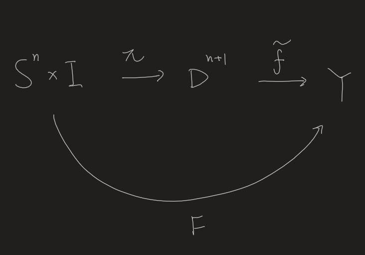
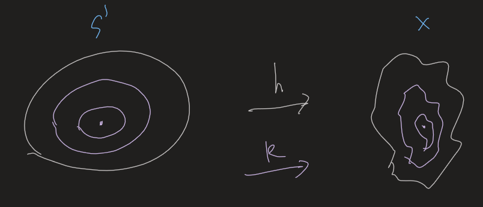

- Study obscure topological properties in an algebraic manner! #Thoughts
  id:: 638d57a7-30e1-4243-8ec8-babe77af9cf8
	- There seems to be something deeper inside. Galois theory -> Study field extensions by means of automorphism groups.
- # Intro of Rotman
  collapsed:: true
	- Mapping cylinder #card
	  collapsed:: true
		- Let $f: X \rightarrow Y$ be continuous and define
		  $$
		  M_f=((X \times \mathbf{I}) \sqcup Y) / \sim
		  $$
		  where $(x, t) \sim y$ if $y=f(x)$ and $t=1$.
		- ((642beb92-a7b0-4614-816f-5e3042f3e7db))
			- Gluing the bottom to the target!
	- Some cats
		- $\mathscr{C}=\mathrm{Top}^2$
			- Here obj $\mathscr{C}$ consists of all ordered pairs $(X, A)$, where $X$ is a topological space and $A$ is a subspace of $X$. A morphism $f:(X, A) \rightarrow$ $(Y, B)$ is an ordered pair $\left(f, f^{\prime}\right)$, where $f: X \rightarrow Y$ is continuous and $f i=j f^{\prime}$ (where $i$ and $j$ are inclusions),
		- $\mathscr{C}=\operatorname{Top}_*$
			- Here obj $\mathscr{C}$ consists of all ordered pairs $\left(X, x_0\right)$, where $X$ is a topological space and $x_0$ is a point of $X$.
			- $Top_*$ is a subcategory of Top ${ }^2$ (subspaces here are always one-point subspaces), and it is called the category of **pointed spaces**; $x_0$ is called the basepoint of $\left(X, x_0\right)$, and morphisms are called pointed maps (or basepoint preserving maps). The category ${Sets}_*$ of pointed sets is defined similarly.
	- ((64113a62-8e58-494b-bade-e5ec6dff42e1)) (Brouwer fixed-point theorem) If $f: D^n \rightarrow D^n$ is continuous, then $f$ has a fixed point. #card
	  card-last-interval:: 30
	  card-repeats:: 1
	  card-ease-factor:: 2.6
	  card-next-schedule:: 2023-05-07T00:43:56.884Z
	  card-last-reviewed:: 2023-04-07T00:43:56.885Z
	  card-last-score:: 5
	  collapsed:: true
		- First we shall prove that there's no retract from $D^{n+1}$ to $S_n$.
			- This cannot be easily done by conventional methods, but very simple using homology.
			- The power of the algebraic way!
		- Then we may start by assuming that there's no fixed points, then construct a retract by ((64113b44-ccd4-41d8-b489-12572e41a829)).
- # Affine Spaces
	- Def
		- Affine #card
		  collapsed:: true
			- A subset $A$ of Euclidean space is called affine if, for every pair of distinct points $x, x^{\prime} \in A$, the **line** determined by $x, x^{\prime}$ is contained in $A$.
			- Note that convex only requires the line segment, while affine requires the whole line.
		- Convex (Affine) hull of some $X\sub R^n$ #card
		  collapsed:: true
			- The intersection of all affine/convex sets containing $X$.
			- Theorem 2.1. If $\left\{X_j: j \in J\right\}$ is a family of convex (or affine) subsets of $\mathbf{R}^n$, then $\cap X_j$ is also convex (or affine).
		- Affine (Convex) combination #card
		  collapsed:: true
			- For a finite set of points $$p_0, p_1, \ldots, p_m$$, an affine combination is a single point
			  collapsed:: true
			  $$x=t_0 p_0+t_1 p_1+\cdots+t_m p_m$$
			  where $\sum_{i=0}^m t_i=1$.
				- What does $\sum_{i=0}^m t_i=1$ mean?
				  collapsed:: true
					- For 2 points this is the line crossing both points.
					- For 3 points (not on the same line) this is the plane determined by them.
					- For general cases this is the unique 'infinite simplex' by induction.
			- A convex combination is an affine combination for which $t_i \geq 0$ for all $i$.
			- ((642d7f26-c4a3-4172-a3bd-398cca94309e)). If $p_0, p_1, \ldots, p_m \in \mathbf{R}^n$, then $\left[p_0, p_1, \ldots, p_m\right]$, the convex (affine) set spanned by these points is the set of all convex (affine) combinations of $p_0, p_1, \ldots, p_m$.
		- Affine independent #card
		  collapsed:: true
			- An ordered set of points $\left\{p_0, p_1, \ldots, p_m\right\} \subset \mathbf{R}^n$ is affine independent if $\left\{p_1-p_0, p_2-p_0, \ldots, p_m-p_0\right\}$ is a linearly independent subset of the real vector space $\mathbf{R}^n$.
			- Prop. The definition is independent of the 'base point' $p_0$
			- Examples
			  collapsed:: true
				- A set $\left\{p_0, p_1\right\}$ is affine independent if $p_1-p_0 \neq 0$, that is, if $p_1 \neq p_0$
				- A set $\left\{p_0, p_1, p_2\right\}$ is affine independent if it is not collinear
				- A set $\left\{p_0, p_1, p_2, p_3\right\}$ is affine independent if it is not coplanar.
		- In General position
		  collapsed:: true
			- A set of points $\left\{a_1, a_2, \ldots, a_k\right\}$ in $\mathbf{R}^n$ is in general position if every $n+1$ of its points forms an affine independent set.
			- $n=1$: Any two points don't coincide.
			- $n=2$: Any three points aren't colinear.
		- Affine map #card
		  collapsed:: true
			- Let $\left\{p_0, p_1, \ldots, p_m\right\} \subset \mathbf{R}^n$ be affine independent and let $A$ denote the affine set it spans. An affine map $T: A \rightarrow \mathbf{R}^k$ (for some $k \geq 1$ ) is a function satisfying
			  $$
			  T\left(\sum t_j p_j\right)=\sum t_j T\left(p_j\right)
			  $$
			  whenever $\sum t_j=1$. The restriction of $T$ to $\left[p_0, p_1, \ldots, p_m\right]$ is also called an affine map.
			- Remarks
				- It preserves affine combinations.
				- The map can be determined by an affine independent subset ('basis'). As a special case, by the vertices of a simplex.
		- ### About Simplexes
			- Barycentric coordinate #card
			  collapsed:: true
				- Let $\left\{p_0, p_1, \ldots, p_m\right\}$ be an affine independent subset of $\mathbf{R}^n$, and let $A$ be the affine set spanned by this subset.
				- If $x \in A$, then the [theorem](((642d8032-73a8-473d-8bc5-9da77152a596))) gives a unique $(m+1)$-tuple $\left(t_0, t_1, \ldots, t_m\right)$ with $\sum t_i=1$ and $x=\sum_{i=0}^m t_i p_i$. 
				  The entries of this $(m+1)$-tuple are called the **barycentric coordinates** of $x$ (relative to the ordered set $\left.\left\{p_0, p_1, \ldots, p_m\right\}\right)$.
				- Intuitively, this means how to obtain a point in the 'affine simplex' by the vertices.
			- Barycenter #card
			  collapsed:: true
				- If $\left\{p_0, \ldots, p_m\right\}$ is affine independent, the barycenter of $\left[p_0, \ldots, p_m\right]$ is $(1 / m+1)\left(p_0+p_1+\cdots+p_m\right)$.
				- > Barycenter comes from the Greek *barys* meaning heavy; thus, barycenter is just "center of gravity"
			- m-simplex in $\mathbb R^n$ #card
			  collapsed:: true
				- Let $\left\{p_0, p_1, \ldots, p_m\right\}$ be an affine independent subset of $\mathbf{R}^n$. The **convex** set spanned by this set, denoted by $\left[p_0, p_1, \ldots, p_m\right]$, is called the (affine) $\boldsymbol{m}$-simplex with vertices $p_0, p_1, \ldots, p_m$.
				  collapsed:: true
					- 'Convex' means $t_i \geq 0$
				- Standard n-simplex
					- $$
					  \Delta^n=\left\{\left(x_1, x_2, \ldots, x_{n+1}\right) \in \mathbf{R}^{n+1}: \text { each } x_i \geq 0 \text { and } \sum x_i=1\right\}
					  $$
						- A (inclining) closed interval for n=1, a triangle (vertices being $(1,0,0),(0,1,0),(0,0,1)$)) for n=2, a tetrahedron (?) for n=3, ...
						- Obviously $\Delta^n \approx D^n$
			- Singular $n$-simplex #card
			  id:: 64462ceb-3ede-4222-851b-57c2b29616b0
				- ((64462d18-fd06-47e4-89b0-1b26cce381ab)) A (singular) $n$-simplex in $X$ is a continuous map $\sigma: \Delta^n \rightarrow X$, where $\Delta^n$ is the standard $n$-simplex.
				  id:: 64462cfd-824d-4ac1-a0c2-4317a0835f50
					- Note that two different maps which are homotopic are regarded as two **different** simplexes!
				- Seems a natural generalization of paths (a path is a singular 1-simplex).
					- It's an interesting question that which properties should be kept in a generalization.
					- Here the key seems **affine**.
			- $k$-face and boundary #card
			  card-last-interval:: 32.57
			  card-repeats:: 1
			  card-ease-factor:: 2.6
			  card-next-schedule:: 2023-05-28T00:52:14.479Z
			  card-last-reviewed:: 2023-04-25T11:52:14.479Z
			  card-last-score:: 5
				- Note that this is the unoriented form, which lacks some important sturctures.
				- A $\boldsymbol{k}$-face of $\left[p_0, p_1, \ldots, p_m\right]$ is a $k$-simplex spanned by $k+1$ of the vertices. 
				  In this terminology, the boundary is the union of all $(m-1)$-faces.
				- Boundary of a simplex
					- Let $\left[p_0, p_1, \ldots, p_m\right]$ be an $m$-simplex. The face opposite $p_i$ is
					  $$
					  \left[p_0, \ldots, \hat{p}_i, \ldots, p_m\right]=\left\{\sum t_j p_j: t_j \geq 0, \sum t_j=1 \text {, and } t_i=0\right\}
					  $$
					  (circumflex ^ means "delete").
					- The boundary of $\left[p_0, p_1, \ldots, p_m\right]$ is the union of its $(m-1)$-faces.
	- ## Basic Facts
	  collapsed:: true
		- ((642d8003-6824-4805-ba5e-7ce8cb5333e2)) The following conditions on an ordered set of points $\left\{p_0, p_1, \ldots, p_m\right\}$ in $\mathbf{R}^n$ are equivalent.
		  id:: 642d8032-73a8-473d-8bc5-9da77152a596
		  (i) $\left\{p_0, p_1, \ldots, p_m\right\}$ is affine independent;
		  (ii) if $\left\{s_0, s_1, \ldots, s_m\right\} \subset \mathbf{R}$ satisfies $\sum_{i=0}^m s_i p_i=0$ and $\sum_{i=0}^m s_i=0$, then $s_0=$ $s_1=\cdots=s_m=0$
		  (iii) each $x \in A$, the affine set spanned by $\left\{p_0, p_1, \ldots, p_m\right\}$, has a unique expression as an affine combination:
		  $$
		  x=\sum_{i=0}^m t_i p_i \quad \text { and } \quad \sum_{i=0}^m t_i=1
		  $$ #card
			- *To be completed*
		- ((642f6f75-ef56-46e8-9c59-b9d8a53c670f)) For every $k \geq 0$, euclidean space $\mathbf{R}^n$ contains $k$ points in general position. #card
			- This can be proved by induction.
			- Intuition
				- Consider adding a point to the existing $k$ points.
				- The new point should be affine independent with $n$ arbitrary existing points, i.e. outside the affine hull spanned by them.
				- So we need to prove the union of such affine hulls never cover the whole space.
				  This is obvious, since an affine hull is $n-1$-dimensional, which is measure zero in $\mathbb R^n$
		- ((642f75cf-4934-42ad-9567-a1cb71c1b3a8))  Let $S$ denote the $n$-simplex $\left[p_0, \ldots, p_n\right]$.
		  (i) If $u, v \in S$, then $\|u-v\| \leq \sup _i\left\|u-p_i\right\|$.
		  (ii) $\operatorname{diam} S=\sup _{i, j}\left\|p_i-p_j\right\|$.
		  (iii) If $b$ is the barycenter of $S$, then $\left\|b-p_i\right\| \leq(n / n+1)$ diam $S$. #card
			-
	- ## [[Topological Group]]
	  collapsed:: true
		- Defs
			- Topological Group
				- A topological group is a group $G$ whose underlying set is equipped with a topology such that:
				- (i) the multiplication map $\mu: G \times G \rightarrow G$, given by $(x, y) \mapsto x y$, is continuous if $G \times G$ has the product topology;
				- (ii) the inversion map $i: G \rightarrow G$, given by $x \mapsto x^{-1}$, is continuous.
			- H-space #card
				- A pointed topological space $\left(X, x_0\right)$ with a pointed map $m:\left(X \times X,\left(x_0, x_0\right)\right) \rightarrow\left(X, x_0\right)$ such that each of the (necessarily pointed) maps $m\left(x_0, -\right)$ and $m\left(-, x_0\right)$ on $\left(X, x_0\right)$ is homotopic to $1_X \operatorname{rel}\left\{x_0\right\}$. One calls $x_0$ a homotopy identity.
				- Intuitively, $m$ is the multiplication and $x_0$ is the identity.
				- Examples
					- Topological group: Multiplication as $m$ and identity as $x_0$
		- ((6438b025-e90b-490e-a4a5-ce7f210be871)) If $(X,x_0)$ is an H-space, then $\pi_1(X,x_0)$ is abelian. #card
			- #+BEGIN_NOTE
			  This proof is not hard, but conceptually confusing. How to understand it? Why couldn't I come up with it myself?
			  #+END_NOTE
			- Key idea
				- A path $f$ in $X$ can be both $m_*(e_{x_0},f)$ and $m_*(f,e_{x_0})$ (H-space).
				- Moreover, the induced map is a homomorphism.
				- Therefore $f * g= m_*(e_{x_0},f) * m_*(g, e_{x_0})=m_*(g,f)=...=m_*(f,g)$ (Different components commute), which manifests the result.
			- Remark
				- It is a necessary condition that the fundamental group is abelian for the space to be a topological group.
			-
				-
		-
- # Homotopy
  collapsed:: true
	- Some notations
		- If $f: \mathbf{I} \rightarrow X$ is a path from $x_0$ to $x_1$, call $x_0$ the origin of $f$ and write $x_0=\alpha(f)$; call $x_1$ the end of $f$ and write $x_1=\omega(f)$. A path $f$ in $X$ is closed at $x_0$ if $\alpha(f)=x_0=\omega(f)$
			- Observe that if $f$ and $g$ are paths with $f \simeq g$ rel \dot$\mathbf{I}$, then $\alpha(f)=\alpha(g)$ and $\omega(f)=\omega(g)$; therefore we may speak of the origin and end of a path class and write $\alpha[f]$ and $\omega[f]$.
		- If $p \in X$, then the constant function $i_p: \mathbf{I} \rightarrow X$ with $i_p(t)=p$ for all $t \in I$ is called the constant path at $p$.
		- If $f: I \rightarrow X$ is a path, its inverse path $f^{-1}: \mathbf{I} \rightarrow X$ is defined by $t \mapsto f(1-t)$.
	- Defs
		- Relative homotopy #card
			- For two continuous maps $f_0,f_1:X \to Y$ and $f_0|_A = f_1|_A$, if there is a continuous map $F: X \times \mathbf{I} \rightarrow Y$ with $F: f_0 \simeq f_1$ and
			  $$
			  F(a, t)=f_0(a)=f_1(a) \quad \text { for all } a \in A \text { and all } t \in \mathbf{I} .
			  $$
			  then 
			  $$f_0 \simeq f_1 \ \text{rel} \ A$$
		- Free Homotopy of maps
		  collapsed:: true
			- If $f$ and $f^{\prime}$ are continuous maps of the space $X$ into the space $Y$, we say that $f$ is homotopic to $f^{\prime}$ if there is a continuous map $F : X \times I \rightarrow Y$ such that
			  $$F(x, 0)=f(x) \quad \text { and } \quad F(x, 1)=f^{\prime}(x)$$
			  for each $x$. (Here $I=[0,1]$.) The map $F$ is called a homotopy between $f$ and $f^{\prime}$. If $f$ is homotopic to $f^{\prime}$, we write $f \simeq f^{\prime}$. If $f \simeq f^{\prime}$ and $f^{\prime}$ is a constant map, we say that $f$ is **nulhomotopic**.
			-
			- The maps don't have 'endpoints' as paths, so there's no extra condition of 'fixed endpoints'.
		- Homotopy of paths
			- With the extra requirement that the **endpoints are fixed.**
			- Two paths $f$ and $f^{\prime}$, mapping the interval $I=[0,1]$ into $X$, are said to be path homotopic if they have the same initial point $x_0$ and the same final point $x_1$, and if there is a continuous map $F: I \times I \rightarrow X$ such that
			- $$\begin{array}{lll}
			  F(s, 0)=f(s) & \text { and } & F(s, 1)=f^{\prime}(s), \\
			  F(0, t)=x_0 & \text { and } & F(1, t)=x_1,
			  \end{array}$$
			-
			- for each $s \in I$ and each $t \in I$. We call $F$ a path homotopy between $f$ and $f^{\prime}$ See Figure 51.1. If $f$ is path homotopic to $f^{\prime}$, we write $f \simeq_p f^{\prime}$.
			  id:: 63c14161-a2e6-4179-a53c-7bc62b6233d5
	- ## Basic facts
		- Lemma. The relations $\simeq$ and $\simeq p$ are equivalence relations.
			- Easy to verify identity, reflexivity and transitivity.
		- Lemma. If $f \simeq g$, then $f \circ h \simeq g \circ h$ #card
			-
	- Homotopy class
	-
	- ## Convexity, contractibility and cones
		- Defs
			- Convex #card
				- A subset $X$ of $\mathbf{R}^m$ is convex if, for each pair of points $x, y \in X$, the line segment joining $x$ and $y$ is contained in $X$. In other words, if $x, y \in X$, then $t x+(1-t) y \in X$ for all $t \in \mathbf{I}$.
			- Contractible #card
			  id:: 6427a15a-5b02-4445-a1b6-1aa2219b1b94
				- A space $X$ is contractible if $1_X$ is nullhomotopic.
			- Identification #card
				- A continuous surjection $f: X \rightarrow Y$ is an identification if a subset $U$ of $Y$ is open if and only if $f^{-1}(U)$ is open in $X$.
				- Equivalently, $f$ is a quotient map. There's even a corollary for this:
				- ((6427a61a-b555-44c4-8ba2-c37e4c6faa27)) Let $X$ and $Z$ be spaces, and let $h: X \rightarrow Z$ be an identification. Then the map $\varphi: X / \operatorname{ker} h \rightarrow Z$, defined by $[x] \mapsto h(x)$, is a homeomorphism.
			- Fiber #card
				- Let $f: X \rightarrow Y$ be a function and let $y \in Y$. Then $f^{-1}(y)$ is called the fiber over $y$.
				- 'Preimage of a single point'
			- Cone #card
			  card-last-interval:: 35.37
			  card-repeats:: 1
			  card-ease-factor:: 2.6
			  card-next-schedule:: 2023-05-15T19:25:00.185Z
			  card-last-reviewed:: 2023-04-10T11:25:00.185Z
			  card-last-score:: 5
				- If $X$ is a space, define an equivalence relation on $X \times \mathbf{I}$ by $(x, t) \sim$ $\left(x^{\prime}, t^{\prime}\right)$ if $t=t^{\prime}=1$.
					- Intuitively, identify all points at the top.
				- Denote the equivalence class of $(x, t)$ by $[x, t]$. The **cone** over $X$, denoted by $C X$, is the quotient space $X \times \mathbf{I} / \sim$.
		- ((6427a17b-2b44-4fbe-a61f-27a9b853464c)) Every convex set $X$ is contractible. #card
			- Just use the common trick of construction!
		- Theorem. Let $f: X \rightarrow Y$ be a continuous surjection. Then $f$ is an identification if and only if, for all spaces $Z$ and all functions $g: Y \rightarrow Z$, one has $g$ continuous if and only if $g f$ is continuous.
		  card-last-interval:: 31.26
		  card-repeats:: 1
		  card-ease-factor:: 2.6
		  card-next-schedule:: 2023-05-13T06:49:10.111Z
		  card-last-reviewed:: 2023-04-12T00:49:10.112Z
		  card-last-score:: 5
		  collapsed:: true
		  ((6427a564-e84e-4a24-b545-824c745dc62f)) #card
			- An easy exercise, but it's worthwhile to ponder the meaning in categories!
		- ((6427effd-8884-4ae1-9041-60e508559560)) For every space $X$, the cone $CX$ is contractible. #card
		  card-last-interval:: 25.01
		  card-repeats:: 1
		  card-ease-factor:: 2.6
		  card-next-schedule:: 2023-04-28T00:44:01.320Z
		  card-last-reviewed:: 2023-04-03T00:44:01.320Z
		  card-last-score:: 5
			- Geometrically, shrink (scale) the whole cone to the top point.
			- Exercise: Construct the map and show it is continuous.
		- ((6427f09b-7a0d-4fff-9b5a-17c5f0084aca)) A space $X$ has the same homotopy type as a point if and only if $X$ is contractible. #card
			- Verify the definition.
		- ((6427f13b-04bb-41d0-b06b-f35e68b40624)) If $Y$ is contractible, then any two maps $X \rightarrow Y$ are homotopic (indeed they are nullhomotopic). #card
			- Invoke the lemma that homotopy is preserved under composition.
			-
- # [[Singular Homology]]
- [[Retraction]]
	- Def
	  collapsed:: true
		- $A \subset X$, a **retraction** of $X$ onto $A$ is a continuous map $r: X \rightarrow A$ such that $r | _ A$ is the **identity** map of $A$. $A$ is a retract of $X$.
	- Examples
	  collapsed:: true
		- $r(x)=x /\|x\|$ retracts $\mathbb{R}^2-0$ onto $S^1$
	- ((638d5522-85b2-4c12-bca3-62846d934042)) If $A$ is a retract of $X$, then the homomorphism of fundamental groups induced by inclusion $j: A \rightarrow X$ is injective.
	  collapsed:: true
		- Intuition #card
		  card-last-interval:: 24
		  card-repeats:: 2
		  card-ease-factor:: 2.7
		  card-next-schedule:: 2023-01-30T06:04:06.831Z
		  card-last-reviewed:: 2023-01-06T06:04:06.832Z
		  card-last-score:: 5
		  collapsed:: true
			- X and A are 'homeomorphic in A'. Thus, homotopic in X <-> homotopic in A.
		-
		- If $r: X \rightarrow A$ is a retraction, then the composite map $r \circ j$ equals the identity map of $A$. It follows that $r_* \circ j_*$ is the identity map of $\pi_1(A, a)$, so that $j_*$ must be injective.
		  collapsed:: true
			- This is a general property of inclusions: {{cloze One-side invertible}}
	- Corollary. No retraction of $B^2$ into $S^1$. #card
	  card-last-interval:: 67.2
	  card-repeats:: 3
	  card-ease-factor:: 2.8
	  card-next-schedule:: 2023-05-16T04:41:24.688Z
	  card-last-reviewed:: 2023-03-10T00:41:24.689Z
	  card-last-score:: 5
	  collapsed:: true
		- $\pi_1(S^1)=\mathbb Z, \pi_1(B^2)=e$. No injection.
		- Another application of ((638d57a7-30e1-4243-8ec8-babe77af9cf8)).
		  id:: 63c14161-2eea-4c90-94d9-cb032f916f40
	- ((6422b6cc-a25b-4228-9495-394b752cebfe)) Let $f:S^n \to Y$ continuous. The following are equivalent:
	  card-last-interval:: 32.57
	  card-repeats:: 1
	  card-ease-factor:: 2.6
	  card-next-schedule:: 2023-05-16T00:44:18.288Z
	  card-last-reviewed:: 2023-04-13T11:44:18.288Z
	  card-last-score:: 5
	  (i) $f$ is nullhomotopic;
	  (ii) $f$ can be extended to a continuous map $D^{n+1} \rightarrow Y$;
	  (iii) if $x_0 \in S^n$ and $k: S^n \rightarrow Y$ is the constant map at $f\left(x_0\right)$, then there is a homotopy $F: f \simeq k$ with $F\left(x_0, t\right)=f\left(x_0\right)$ for all $t \in \mathbf{I}$. #card
		- This reveals the general thought of homotopy: We may know a lot about the topo space if we study continuous maps from $S^n$
		- Intuition
		  collapsed:: true
			- For $n=1$, the (parameterized) image forms an uncontractible loop.
			- For $n=2$, the image forms a closed surface.
				- On the contrary, an open disk could be contracted to a single point.
		- Proof
		  collapsed:: true
			- (i) -> (ii): We can extend the map to $D^{n+1}$ by $\tilde f(tx):=F(t,x)$
				- Well-defined since it is nullhomotopic
				- Continuity follows from the diagram:
				   {:height 338, :width 423}
					- Since $F$ is continuous and $\pi$ is an open map (as a quotient map), we can show $\tilde f$ is also continuous.
			- (ii) -> (iii): Geometrically this means shrinking the ball to the point $f(x_0)$
				- It can be constructed explicitly as $F(x,t):=g((1-t)x+tx_0)$, which is obviously a **scaling**.
			- (iii) -> (i): The homotopy is given in (iii).
		- As a special case, we might see Munkres for $n=1$:
		  collapsed:: true
			- Let $h: S^1 \rightarrow X$ be a continuous map. Then the following conditions are **equivalent**: $h$ is nulhomotopic; $h$ extends to a continuous map $k: B^2 \rightarrow X$; $h_*$ is the trivial homomorphism of fundamental groups.
			- Intuitions
			  card-last-interval:: 67.2
			  card-repeats:: 3
			  card-ease-factor:: 2.8
			  card-next-schedule:: 2023-04-24T15:39:27.657Z
			  card-last-reviewed:: 2023-02-16T11:39:27.657Z
			  card-last-score:: 5
				- (1) and (3) are directly seen to be equivalent, since nulhomotopic means that the image can be contracted to be a point. Thus the generator of $\pi_1(S^1)$ is mapped to the trivial element.
				- (2) to (1): In $B^2$, $S^1$ can be contracted to a point. Since [[Continuous]] maps preserve path homotopies, the image can also be contracted.
				- (1) to (2) is the most interesting part. We may construct maps which shrink $S^1$ and $h(S^1)$ to a point respectively, then establish a correspondence between them.
				  collapsed:: true
					- {:height 169, :width 372}
					- Or ((638d639f-33d9-4a25-b658-4f63d2ddb144))
					  id:: 63c14161-6c0b-4e20-8aed-7b1ef3003b03
				-
		- Note that this implies $S^n$ isn't ((6427a15a-5b02-4445-a1b6-1aa2219b1b94)) since there's no retraction from $D^{n+1}$ to $S^n$, but the latter fact is nontrivial.
	- ((6393ecbc-590b-426b-8528-d730e640b237)) The inclusion map $j : S^1 \rightarrow \mathbb{R}^2-\mathbf{0}$ is not nulhomotopic. #card
	  card-last-score:: 5
	  card-repeats:: 3
	  card-next-schedule:: 2023-05-27T09:35:29.691Z
	  card-last-interval:: 67.2
	  card-ease-factor:: 2.8
	  card-last-reviewed:: 2023-03-21T05:35:29.692Z
	  collapsed:: true
		- An exercise to express the intuition via the language of retractions.
		- Hint: Nul -> Trivial hom of $\pi_1$; Retraction -> Injective
- [[Covering space]]
- [[Fundamental Group]]
	- # The Categorical Viewpoint
		- ((64365386-b7d7-4fea-907a-9cbb6aa97a3a)) $\pi_1: \mathbf{Top_*}\to\mathbf{Grp}$ is a (covariant) functor. Moreover, if $h$, $k:\left(X, x_0\right) \rightarrow\left(Y, y_0\right)$ and $h \simeq k \operatorname{rel}\left\{x_0\right\}$, then $\pi_1(h)=\pi_1(k)$. #card
			- *To be completed
			- Notes
				- A path is a continuous map (morphism) from $(S^1,0)$ to $(X,x_0)$
				- $\mathbf{Top_*}$ denotes the cat of pointed topological spaces, i.e. a space with a specified base point $x_0$.
		- Question: If $X$ and $Y$ have the same homotopy type, do they have the same fundamental group?
			- ((643655e3-478a-4775-b749-9eaf6a46f752)) Assume that $F: \varphi_0 \simeq \varphi_1$ is a (free) homotopy, where $\varphi_i: X \rightarrow Y$ is continuous for $i=0,1$. Choose $x_0 \in X$ and let $\lambda$ denote the path $F\left(x_0, -\right)$ in $Y$ from $\varphi_0\left(x_0\right)$ to $\varphi_1\left(x_0\right)$. Then there is a commutative diagram
			  ((64365603-aaef-4a78-b05d-9008ac29663f))
			  where $\psi$ is the isomorphism $[g] \mapsto\left[\lambda * g * \lambda^{-1}\right]$.
				- The extra isomorphism $\psi$ is introduced to fix the base point.
				- We may prove the lemma by explicit construction: $\tilde F(t,s):=[\lambda(s) * F(f(t),s) * \lambda^{-1}(s)]$
					- Intuitively, act a *path inner automorphism* for each $s$ to fix the base point.
				- Note that $\lambda(t)$ is precisely $F(x_0,t)$. Therefore even if $\varphi_0(x_0)=\varphi_1(x_0)$, the base point can trace a nontrivial path and the induced homomorphisms are **not** equal.
			- ((64365ba8-1cae-4ec8-9537-2f2ad0a8e979)). Assume that $\varphi_i:\left(X, x_0\right) \rightarrow\left(Y, y_0\right)$, for $i=0,1$, are freely homotopic.
			  (i) $\varphi_{0 *}$ and $\varphi_{1 *}$ are conjugate; that is, there is $[\lambda] \in \pi_1\left(Y, y_0\right)$ with $\varphi_{0 *}[f]=$ $[\lambda] \varphi_{1 *}([f])[\lambda]^{-1}$ for every $[f] \in \pi_1\left(X, x_0\right)$.
			  (ii) If $\pi_1\left(Y, y_0\right)$ is abelian, then $\varphi_{0 *}=\varphi_{1 *}$. #card
				- Just using the above lemma.
				- Corollary. Spaces having the same homotopy type have the same fundamental group.
	- [[Simply connected]]
	- [[Deformation Retraction]] and [[Homotopy Equivalence]]
	- ((6393f3d8-803c-4134-af68-b91b9739c5e7)) Given a **nonvanishing** vector field on $B^2$, there exists a point of $S^1$ where the vector field points directly inward and a point of $S^1$ where it points directly outward. #card
	  collapsed:: true
		- Intuition
		  card-last-score:: 5
		  card-repeats:: 2
		  card-next-schedule:: 2023-03-19T00:25:55.604Z
		  card-last-interval:: 24
		  card-ease-factor:: 2.7
		  card-last-reviewed:: 2023-02-23T00:25:55.605Z
			- The vector field can't be 'rotating'
		- Key construction
			- We try to define a homotopy $F(x, t)=t x+(1-t) w(x)$ between $w=v|_{S^1}$ and the inclusion map $j: S^1 \rightarrow \mathbb{R}^2-\mathbf{0}$.
			  The traditional 'scaling construction'!
			- Note that $v$ is the vector field $v:B^2 \to \mathbb R^2$
			- Since $j$ isn't **null** but $w$ is, a contradiction arises.
		- Summary of proof
			- Prove by contradiction.
			- The homotopy is illegitimate only if $F(x,t) = 0$, i.e. $t x+(1-t) w(x)=0$ <-> the vector points directly outwards at x!
			  id:: 63c14161-a01a-4b97-876f-c426df2df736
	- ((6393f81a-de32-4d11-b971-629c48983742)) (Brouwer fixed-point theorem for the disc). If $f: B^2 \rightarrow B^2$ is continuous, then there exists a **fixed point** $x \in B^2$ such that $f(x)=x$. #card
	  collapsed:: true
		- A very interesting trick: Construct a vector field $v(x)=f(x)-x$ by embedding $B^2$ into $R^2$.
		- There should be something deeper inside this trick.
		- Embed the object (A topological object in this case) into something with better structures. #[[Thoughts/Math and Physics]]
		  id:: 63c14161-9b19-4985-b2d6-1b13391e194a
		- Extra structures may provide extra insights. The  properties of the object itself restricts the possible structures. #[[Thoughts/Math and Physics]]
		  collapsed:: true
			- Recall inner product in linear algebra.
		-
	-
	- ((63953b25-8709-4182-9cb5-87d46acf1a4f))
	- ((63953d32-29d5-4ffe-aec8-c9a40be4e936)) Let $A$ be a 3 by 3 matrix of positive real numbers. Then $A$ has a positive real eigenvalue. #card
	  card-last-interval:: 84
	  card-repeats:: 3
	  card-ease-factor:: 2.8
	  card-next-schedule:: 2023-07-09T00:45:32.776Z
	  card-last-reviewed:: 2023-04-16T00:45:32.777Z
	  card-last-score:: 5
	  collapsed:: true
		- Let K be the intersection of $S^2$ with the first octant $$\left\{\left(x_1, x_2, x_3\right) \mid x_1 \geq 0 \text { and } x_2 \geq 0 \text { and } x_3 \geq 0\right\}$$.
		- Obviously $K \cong B^2$.
		- Moreover, $f:x \mapsto T(x) /\|T(x)\|$ is a continuous map, so the fixed-point theorem applies.
		-
		- If the fixed-point theorem holds, we can easily generalize it to arbitrary dimensions.
	- We can even prove [[The Fundamental Theorem of Algebra]]! #card
	  card-last-interval:: 24
	  card-repeats:: 2
	  card-ease-factor:: 2.7
	  card-next-schedule:: 2023-02-26T12:19:40.674Z
	  card-last-reviewed:: 2023-02-02T12:19:40.674Z
	  card-last-score:: 5
	  collapsed:: true
		- *Review the thought in this card. No need to memorize all details.
		  collapsed:: true
			- Deformation provides much information. #[[Thoughts/Math and Physics]]
			  id:: 63c14161-1549-4b29-b6b3-84321340d574
		- We first deal with the special case that $x^n+a_{n-1} x^{n-1}+\cdots+a_1 x+a_0=0$ where $\left|a_{n-1}\right|+\cdots+\left|a_1\right|+\left|a_0\right|<1$. The general case can be obtained by 'rescaling' the variable.
		  collapsed:: true
			- Assume no root exists for the equation.
			- Then we may define a map $k: B^2 \rightarrow \mathbb{R}^2-0$ by $k(z)=z^n+a_{n-1} z^{n-1}+\cdots+a_1 z+a_0$.
			  collapsed:: true
				- The polynomial must be nonzero on all of $B^2$.
			- Let $h=k|_{S^1}$. h is null since it extends to k.
			- On the other hand, we may define a homotopy $F(z, t)=z^n+t\left(a_{n-1} z^{n-1}+\cdots+a_0\right)$, then h isn't null.
			  collapsed:: true
				- The condition $\left|a_{n-1}\right|+\cdots+\left|a_1\right|+\left|a_0\right|<1$ grants that the homotopy can be defined on $S^1$
			- **We obtain a contradiction.**
	- [[Lifting]]
	-
- [[The Separation Theorems]]
- [[Seifert-van Kampen Theorem]]
- Classification of Surfaces
  collapsed:: true
	- Defs
		- ((642578ff-9703-449c-b3df-41ffc344e641))
		- Polygonal region
		  collapsed:: true
			- Roughly speaking, we have a set of points $\{a_n\}$equaldistant to the center $c$. $P$ is the intersection of the closed half-planes created by the lines $a_{i-1}a_i$
		- Positive linear map between line segments
		  collapsed:: true
			- Preserving the orientations, i.e. is the homeomorphism $h$ that carries the point $x=(1-s) a+s b$ of $L$ to the point $h(x)=(1-s) c+s d$
		- Pasting the edges
		  collapsed:: true
			- ((63eed74a-00c4-4be3-9add-e89064a97dca)) Let $P$ be a polygonal region in the plane. A **labelling** of the edges of $P$ is a map from the set of edges of $P$ to a set $S$ called the set of labels.
			- Given an orientation of each edge of $P$, and given a labelling of the edges of $P$, we define an *equivalence relation* on the points of $P$:
			  collapsed:: true
				- Each point of Int $P$ is equivalent only to itself.
				- Given any two edges of $P$ that have the same label, let $h$ be the *positive linear map* of one onto the other, and define each point $x$ to be equivalent to the point $h(x)$.
			- The quotient space $X$ obtained from this equivalence relation is said to have been obtained by **pasting the edges** of $P$ together according to the given *orientations* and labelling.
			  collapsed:: true
				- Orientations matter!
			- Examples (to gain intuitions) #card
			  collapsed:: true
			  card-last-interval:: 30
			  card-repeats:: 2
			  card-ease-factor:: 2.7
			  card-next-schedule:: 2023-05-30T00:54:06.396Z
			  card-last-reviewed:: 2023-04-30T00:54:06.396Z
			  card-last-score:: 5
				- ((63eed83b-fcf4-4bd5-88f5-ef10ccafa501))
				  collapsed:: true
					- The unit ball
					- Note that $a$ is nothing special in the space $B^2$, not any kind of boundary. Only an ancillary device to visualize the generation of $B^2$ from polygons.
				- ((63eed843-b814-406c-901b-e7ebbaeda54d))
				  collapsed:: true
					- $S^2$
					- Note that $a$ and $b$ are nothing special in the space $S^2$, not any kind of boundaries. They're only ancillary devices to visualize the generation of $S^2$ from polygons.
			- Convenient notation: Labelling scheme
			  collapsed:: true
				- ((63eed911-bc13-4c34-8089-b7a5a155a035)) Let $P$ be a polygonal region with successive vertices $p_0, \ldots, p_n$, where $p_0=p_n$.
				- For each $k$, let $a_{i_k}$ be the label assigned to the edge $p_{k-1} p_k$, and let $\epsilon_k=+1$ or $-1$ according as the orientation assigned to this edge goes from $p_{k-1}$ to $p_k$ or the reverse. Then the number of edges of $P$, the orientations of the edges, and the labelling are completely specified by the symbol
				  $$
				  w=\left(a_{i_1}\right)^{\epsilon_1}\left(a_{i_2}\right)^{\epsilon_2} \cdots\left(a_{i_n}\right)^{\epsilon_n} .
				  $$
				- Examples
				  collapsed:: true
					- ((63eed843-b814-406c-901b-e7ebbaeda54d)) is $bb^{-1}aa^{-1}$
					- $RP^2$
					  collapsed:: true
						- First thought: Identifying $x$ and $-x$ on $S^1$
						- Expressed by polynomials and labelling schemes is $abab$
					- The [[Mobius Band]]
					  collapsed:: true
						- $abac$
					- Vaguely reminiscent to a freely generated group?
				-
		- n-fold torus #card
		  id:: 63f218b7-eddb-4fe3-bd5e-daff1b591487
		  card-last-interval:: 30
		  card-repeats:: 2
		  card-ease-factor:: 2.7
		  card-next-schedule:: 2023-05-13T11:45:04.428Z
		  card-last-reviewed:: 2023-04-13T11:45:04.428Z
		  card-last-score:: 5
		  collapsed:: true
			- Pasting a $4n$-sided polygon by $\left(a_1 b_1 a_1^{-1} b_1^{-1}\right)\left(a_2 b_2 a_2^{-1} b_2^{-1}\right) \cdots\left(a_n b_n a_n^{-1} b_n^{-1}\right)$
			- What does it mean?
				- Consider the $n=2$ case, _1676811151957_0.png)
					- Prop. All vertices are identified.
					- Therefore, the common part of the two tori is a **circle**.
					- ((63f21c79-2841-4abc-a109-c068df01ff2b))
				- General case: All vertices are identified, but the tori are not connected by a circle. Instead they're connected by an **n-pant**.
		- m-fold projective plane #card
		  id:: 63f21c4d-b959-43e5-889d-90abd29a1092
		  collapsed:: true
		  card-last-interval:: 23.96
		  card-repeats:: 1
		  card-ease-factor:: 2.6
		  card-next-schedule:: 2023-04-15T02:29:02.062Z
		  card-last-reviewed:: 2023-03-22T03:29:02.064Z
		  card-last-score:: 5
			- An $2m$-polygon pasted by $\left(a_1 a_1\right)\left(a_2 a_2\right) \cdots\left(a_m a_m\right)$.
				- Also a connected sum of $m$ projective planes.
			- $m=3$ example
				- _1676812325317_0.png){:height 688, :width 847}
				- Each component is a projective plane minus a circle.
		- First [[Homology Group]] #card
		  collapsed:: true
		  card-last-interval:: 24
		  card-repeats:: 1
		  card-ease-factor:: 2.6
		  card-next-schedule:: 2023-04-01T03:55:56.759Z
		  card-last-reviewed:: 2023-03-08T03:55:56.760Z
		  card-last-score:: 5
			- ((63f95d84-10e7-484d-8591-9e785fbbf5bb)) $H_1(X):=\pi_1\left(X, x_0\right) /\left[\pi_1\left(X, x_0\right), \pi_1\left(X, x_0\right)\right]$
		- Proper labelling scheme
		  collapsed:: true
			- Each label appears exactly twice.
		- Torus type and projective type
			- ((63fabe49-9a20-4104-a118-7a3cb4228e3c)) Let $w$ be a **proper** labelling scheme for a single polygonal region.
			- We say that $w$ is of **torus type** if each label in it appears once with exponent $+1$ and once with exponent $-1$. Otherwise, we say $w$ is of **projective type**.
	- Basic facts
	  collapsed:: true
		- ((63eedadc-dcd0-43a1-8515-5bb384b50e50)) Let $X$ be the space obtained from a finite collection of polygonal regions by pasting edges together according to some labelling scheme. Then $X$ is a compact Hausdorff space. #card
		  card-last-interval:: 26.06
		  card-repeats:: 1
		  card-ease-factor:: 2.6
		  card-next-schedule:: 2023-04-08T13:07:39.691Z
		  card-last-reviewed:: 2023-03-13T12:07:39.692Z
		  card-last-score:: 5
			- Compact is immediate, since $\pi$ is continuous.
			- Hausdorff can be shown using the metric and finiteness, but another more elegant way.
				- Exercise. A closed quotient map preserves normality.
		- ((63eee202-1568-4bf6-8431-b49a1be4497b)) Let $P$ be a polygonal region; let
		  $$
		  w=\left(a_{i_1}\right)^{\epsilon_1} \cdots\left(a_{i_n}\right)^{\epsilon_n}
		  $$
		  be a labelling scheme for the edges of $P$. Let $X$ be the resulting quotient space. 
		  If all the vertices of $P$ are pasted to a single point $x_0$, then $\pi_1\left(X, x_0\right)$ is isomorphic to the quotient of the free group on $k$ generators $\alpha_1, \ldots, \alpha_k$ by the least normal subgroup containing the element
		  $$
		  \left(\alpha_{i_1}\right)^{\epsilon 1} \cdots\left(\alpha_{i_n}\right)^{\epsilon_n} .
		  $$ #card
			- This is the case for the [[Torus]], the ((63f218b7-eddb-4fe3-bd5e-daff1b591487)), the ((63f21c4d-b959-43e5-889d-90abd29a1092)) and ((63e86249-c48a-4740-a36d-100aeb1da16c)) . Thus the striking resemblance.
			- The proof directly follows ((63db6326-2852-429b-acc7-21e25d249828)).
	- [[Homology]] of Surfaces
	  collapsed:: true
		- Though we've obtained fundamental groups of lots of surfaces, we may not immediately determine whether they're distinct or not.
			- There is no algorithm to determine whether two groups are isomorphic.
		- We may consider $\pi_1 /\left[\pi_1, \pi_1\right]$ , which is abelian, for some inspiration!
		-
		- Prop. The isomorphism between $\pi_1(X,a)$ and $\pi_1(X,b)$ induced by different paths are identical when projected to $H_1(X,a)$ and $H_1(X,b)$ #card
			- Consider two paths $\alpha$ and $\beta$, and the isomorphism induced by $\gamma:=\alpha \beta^{-1}$.
			- $f \mapsto \gamma f \gamma^{-1}$.
			- Obviously it is still $f$ in the abelianized quotient.
		- ((63f9607e-52d2-4362-81b9-9392cd5509e1)) Let $F$ be a group; let $N$ be a normal subgroup of $F$; let $G:=F/N$. The projection homomorphism
		  card-last-interval:: 30
		  card-repeats:: 2
		  card-ease-factor:: 2.7
		  card-next-schedule:: 2023-05-12T11:23:29.603Z
		  card-last-reviewed:: 2023-04-12T11:23:29.604Z
		  card-last-score:: 5
		  collapsed:: true
		  $$
		  p: F \rightarrow F /[F, F]
		  $$
		  induces an **isomorphism**
		  $$
		  \phi: G /[G, G] \rightarrow p(F) / p(N) .
		  $$ #card
			- Intuition
				- Elements in LHS are of the form $(x\cdot N) \cdot \{aba^{-1}b^{-1} \cdot N  \}_{ab}$
				- Elements in RHS are $(x\cdot [F,F]) \cdot (N \cdot [F,F])$
				- We may construct an explicit isomorphism and find out when would $x_1~x_2$ (which of course coincides for LHS and RHS), but this is ugly.
			- Official
				- ((63f96759-3738-48a8-8e1d-6fa03d6d2e5d))
		- ((63f967c8-2ec0-44a3-ad3f-4a9a9d1cc739)) Let $F$ be a free group with free generators $\alpha_1, \ldots, \alpha_n$; let $N$ be the least normal subgroup of $F$ containing the element $x$ of $F$; let $G=F / N$. 
		  collapsed:: true
		  Let $p:F \rightarrow F /[F, F]$ be projection. Then $G /[G, G]$ is **isomorphic** to the quotient of $F /[F, F]$ (which is **free abelian** with basis $p\left(\alpha_1\right), \ldots, p\left(\alpha_n\right)$) by the subgroup generated by $p(x)$. #card
			- We know that $G/[G,G]\cong p(F)/p(N)$. Moreover, $F/[F,F]$ is abelian with the same basis.
			-
		- ((63f96977-bed6-4449-ad50-8114274d72d9))  If $X$ is the ((63f218b7-eddb-4fe3-bd5e-daff1b591487)) then $H_1(X)$ is a free abelian group of rank $2 n$. #card
		  card-last-interval:: 24
		  card-repeats:: 1
		  card-ease-factor:: 2.6
		  card-next-schedule:: 2023-04-06T01:04:23.811Z
		  card-last-reviewed:: 2023-03-13T01:04:23.814Z
		  card-last-score:: 5
			- As an exercise of the above corollary!
		- ((63f96a7e-89f5-4b82-a31f-2c730b301a80)) If $X$ is the ((63f21c4d-b959-43e5-889d-90abd29a1092)) , then the [[Torsion Group]] $T(X)$ of $H_1(X)$ has order 2, and $H_1(X) / T(X)$ is a free abelian group of rank $m-1$. #card
		  card-last-interval:: 24
		  card-repeats:: 2
		  card-ease-factor:: 2.7
		  card-next-schedule:: 2023-04-07T11:55:36.298Z
		  card-last-reviewed:: 2023-03-14T11:55:36.298Z
		  card-last-score:: 5
			- Another easy exercise.
			- Recall a theorem that $\pi_1(X)=\pi_1(A)/\langle p(f_0)\rangle$.
			- Moreover, we can that $H_1(X) / T(X)$ is free.
				- Actually we may directly invoke the theorem for finitely-generated abelian groups.
			-
		- Thus we can conclude that $S^2,T_1,T_2,...; P_1,P_2,...$ are topologically distinct!
	- Cutting and Pasting
		- Cutting
		  collapsed:: true
			- ((63fab6e4-190d-40c1-981e-515a552a48ab))
		- Pasting
		  collapsed:: true
			- ((63fab713-7618-4b6c-96a6-693fd18fffe6))
		- Effect of cutting on a labelling scheme of a single polygon
			- Suppose $w=y_0y_1$, form $w_1=y_0 y_1$, where $y_0$ consists of the first $k$ terms of $w_1$ and $y_1$ consists of the remainder.
			- Let $c$ be a new label. Then $Q_1^{\prime}$ has the labelling scheme $y_0 c^{-1}$ and $Q_2$ has the labelling scheme $c y_1$.
	- ((63fab983-7e3c-40e1-aad1-2c7eb691fd73)) on labelling schemes
		- Setup
			- A labelling scheme $w_1, \ldots, w_m$ on m polygons, with the quotient space being $X$.
		- The strategy is again ((63fa1061-a719-42a4-8b01-2bd603e394fc))
		-
		- Cut
		- Paste
		- Relabel
		  collapsed:: true
			- Replace all occurrences of any given label by some othe label that does not appear elsewhere in the scheme.
			- Similarly, one can change the sign of the exponent of all occurrences of a given label $a$; this amounts to reversing the orientations of all the edges labelled $a$.
		- Permute
		  collapsed:: true
			- Replace any **one** of the schemes $w_i$ by a **cyclic** permutation of $w_i$.
			- Intuitively rotating the polygon.
			- Note that permutations of the symbols are trivial. We want to permute the geometrical object.
		- Flip
		  collapsed:: true
			- One can replace one scheme
			  $$
			  w_i=\left(a_{i_1}\right)^{\epsilon_1} \cdots\left(a_{i_n}\right)^{\epsilon_n}
			  $$
			  by its formal inverse
			  $$
			  w_i^{-1}=\left(a_{i_n}\right)^{-\epsilon_n} \cdots\left(a_{i_1}\right)^{-\epsilon_1} .
			  $$
			- Actually reversing the orientation of the polygon, which has no effect on the geometry.
		- Cancel and uncancel
			- Replace $w_i=y_0 a a^{-1} y_1$ by $y_0y_1$ provided that $a$ doesn't appear elsewhere.
				- Uncancel is the reverse operation.
			- Intuitively, $aa^{-1}$ is a cone (which is topologically trivial), with the bottom pasted to the polygon in question.
	- Exercise. The Klein bottle $a b a^{-1} b$ is homeomorphic to the 2-fold projective plane. #card
	  card-last-interval:: 25.01
	  card-repeats:: 1
	  card-ease-factor:: 2.6
	  card-next-schedule:: 2023-04-01T01:00:39.895Z
	  card-last-reviewed:: 2023-03-07T01:00:39.896Z
	  card-last-score:: 5
	  collapsed:: true
		- We define two labelling schemes to be equivalent if {{cloze one can be obtained from another by elementary operations above}}.
		- Try to find the operations by yourself!
	- Exercise. Can we simplify ((63e86249-c48a-4740-a36d-100aeb1da16c)) to a projective plane?
		- eg. 6-fold dunce cap: $aaaaaa \to aaac, c^{-1}aaa \to aaac,a^{-3}c \to cc$ **?**
		- Answer: {{cloze NO. Cancelling can only be applied to a label which doesn't appear elsewhere.}}
	- The Classification Theorem
		- Simplify the representation into some canonical form. #Strategy #card
		  card-last-interval:: 30.72
		  card-repeats:: 1
		  card-ease-factor:: 2.6
		  card-next-schedule:: 2023-04-05T04:20:16.557Z
		  card-last-reviewed:: 2023-03-05T11:20:16.557Z
		  card-last-score:: 5
		- Theorem. If $w$ is a scheme of projective type, then $w$ is equivalent to a scheme of the same length having the form
		  card-last-interval:: 21.86
		  card-repeats:: 1
		  card-ease-factor:: 2.6
		  card-next-schedule:: 2023-03-31T07:01:53.427Z
		  card-last-reviewed:: 2023-03-09T11:01:53.427Z
		  card-last-score:: 5
		  $$
		  \left(a_1 a_1\right)\left(a_2 a_2\right) \cdots\left(a_k a_k\right) w_1
		  $$
		  where $k \geq 1$ and $w_1$ is either empty or of torus type. #card
			- In plain English, the same edges can all be pushed to the front.
			- ((63ff1367-a528-454e-aee9-bb1d36897060)) Let $w$ be a proper scheme of the form
			  id:: 63fabdf6-dd04-4a9c-9d8f-a3635ac7b108
			  $$
			  w=\left[y_0\right] a\left[y_1\right] a\left[y_2\right],
			  $$
			  where some of the $y_i$ may be empty. Then one has the equivalence
			  $$
			  w \sim a a\left[y_0 y_1^{-1} y_2\right]
			  $$
				- An easy exercise. Just proceed concretely to avoid mistakes!
				- Note that there is one extra step. Not obtainable by just one cutting and pasting.
			- Now it suffices to apply the lemma repeatedly.
		- ((63ff145f-7f9e-4b11-8b84-ca36597daf79)) Let $w$ be a proper scheme of the form $w=w_0 w_1$, where $w_1$ is a scheme of torus type that does not contain two adjacent terms having the same label. Then $w$ is equivalent to a scheme of the form $w_0 w_2$, where $w_2$ has the same length as $w_1$ and has the form
		  card-last-interval:: 24
		  card-repeats:: 1
		  card-ease-factor:: 2.6
		  card-next-schedule:: 2023-04-07T00:56:29.783Z
		  card-last-reviewed:: 2023-03-14T00:56:29.784Z
		  card-last-score:: 5
		  $$
		  w_2=a b a^{-1} b^{-1} w_3
		  $$ #card
			- This is an elaborate proof, so ignore it for now.
		- ((63ff1cab-4221-49ab-9d57-42cf9aa3952d)) Let $w$ be a proper scheme of the form
		  $$
		  w=w_0(c c)\left(a b a^{-1} b^{-1}\right) w_1
		  $$
		  Then $w$ is equivalent to the scheme
		  $$
		  w^{\prime}=w_0(a a b b c c) w_1
		  $$ #card
			- In plain English, this means that a projective type must be torus-free.
			- Proof
				- Hint: Use the [lemma](((63fabdf6-dd04-4a9c-9d8f-a3635ac7b108))) forwards and backwards for several times.
		- ((63ff1f74-71d1-4d4e-b347-d0746b62e728)) (The classification theorem). Let $X$ be a surface formed by a proper scheme. Then $X$ is homeomorphic either to $S^2$, to the $n$-fold torus $T_n$, or to the $m$-fold projective plane $P_m$. #card
		  id:: 6401b892-1a98-4844-89b5-e95da63050da
		  card-last-interval:: 26.02
		  card-repeats:: 1
		  card-ease-factor:: 2.6
		  card-next-schedule:: 2023-04-16T01:34:37.879Z
		  card-last-reviewed:: 2023-03-21T01:34:37.880Z
		  card-last-score:: 5
			- Note this only works for pasting edges in pairs. Not for, eg. ((63e86249-c48a-4740-a36d-100aeb1da16c)).
			- Collecting the lemmas above!
		-
	- Construct Compact Surfaces
		- Now we'd like to know whether all compact surfaces can be tackled by the classification theorem.
		- [[Triangulation]]
		- ((6407fddd-bfbc-4b68-b54a-ae71c0566d35)) If $X$ is a compact triangulable surface, then $X$ is homeomorphic to a space obtained from a collection of disjoint triangular regions in the plane by pasting their edges together in pairs.
			- Plain English
				- Every triangulable surface falls in the scope of the classification theorem.
			- This is quite obvious. Only needing some work to show pathological cases can't be called surfaces.
		- Theorem. Each connected compact surface can be classified by the [classification theorem](((6401b892-1a98-4844-89b5-e95da63050da))). #card
		  card-last-interval:: 30
		  card-repeats:: 2
		  card-ease-factor:: 2.7
		  card-next-schedule:: 2023-05-25T11:49:52.642Z
		  card-last-reviewed:: 2023-04-25T11:49:52.643Z
		  card-last-score:: 5
			- First, ((6407fc4c-c8f0-405e-9919-d73a637dbe87)).
			- Second, the surface can be obtained by pasting the edges of a set of triangles **in pairs**.
				- We must prove that pasting several edges together isn't allowed.
			- Furthermore, connectedness means that it can be obtained by pasting a polygon (paste the triangles successively to obtain a polygon)
			-
			- Note that a polygon is **not** a surface. The boundary points don't have neighborhoods homeomorphic to an open disk.
		- Exercise. Does the classification theorem work for ((63e86249-c48a-4740-a36d-100aeb1da16c))? #card
		  card-last-interval:: 26.06
		  card-repeats:: 1
		  card-ease-factor:: 2.6
		  card-next-schedule:: 2023-04-08T12:53:45.802Z
		  card-last-reviewed:: 2023-03-13T11:53:45.803Z
		  card-last-score:: 5
			- **NO**. It is not a surface for $n>2$.
-