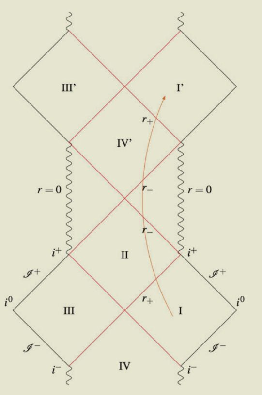
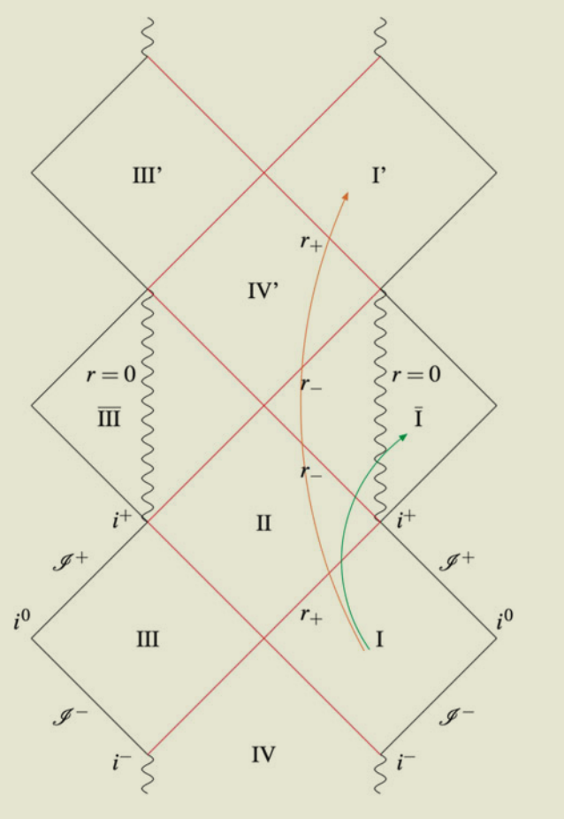

- Definition #card
  card-last-interval:: 31.26
  card-repeats:: 1
  card-ease-factor:: 2.6
  card-next-schedule:: 2023-08-29T18:27:40.614Z
  card-last-reviewed:: 2023-07-29T12:27:40.614Z
  card-last-score:: 5
	- A black hole in an asymptotically flat spacetime $M$ is the set of events that do not belong to the causal past of the future null infinity $J^{-}\left(\mathscr I^{+}\right)$, namely
	  $$
	  B=M-J^{-}\left(\mathscr I^{+}\right)\neq\varnothing.
	  $$
		- Intuitively: Nothing in the region can escape to infinity!
		- However, it is impossible to define blackholes in closed spacetimes (e.g. [[FLRW]] with $k=1$) since there is no 'infinity' to escape to.
	- The event horizon is the boundary of the region B.
- # RN (Reissner–Nordström) Blackholes
  collapsed:: true
	- Stationary, non-rotating, charged blackholes
	- Solution
		- $$ds^2=-\left(1-\frac{2M}{r}+\frac{Q^2}{r^2}\right)dt^2+\left(1-\frac{2M}{r}+\frac{Q^2}{r^2}\right)^{-1}dr^2+r^2d\Omega^2$$
			- Simple way: Replace $M$ in the Schwarzchild solution by $M-\frac {Q^2}{2r}$
	- Event horizon
		- $$r_{+}=M+\sqrt{M^2-Q^2}$$
		- Note that it is nontrivial to determine the existence of a horizon! Here it **happened to** correspond to the larger solution of $g_{rr}=0$
		- When $Q>M$: there's no horizon and the singularity is **naked**, thus unphysical!
	- Spacetime Diagram
		- 
		- The properties of region $I'$ is completely the same as region $I$. 
		  i.e. In a maximal extension of the spacetime, we'd have infinite copies of the original spacetime!
		- The orange line is the trajectory of a massive particle.
			- After going inside the horizon (crossing $r_+$), it can either go into the singularity or cross $r_-$ to the 'whitehole' region $IV'$.
				- It is different from ((6454f170-9fed-40e5-845e-c72df45c05ab)), where particles crossing the horizon are doomed to the singularity!
			-
- # Kerr Blackholes
  collapsed:: true
	- Stationary, rotating, uncharged blackholes
	- Solution
		- $$\begin{aligned}
		  d s^{2}& =-\left(1-\frac{2M r}{\Sigma}\right)d t^{2}-\frac{4a M r\sin^{2}\theta}{\Sigma}d t d\phi+\frac{\Sigma}{\Delta}d r^{2}+\Sigma d\theta^{2}  \\
		  &+\left(r^2+a^2+\frac{2a^2Mr\sin^2\theta}{\Sigma}\right)\sin^2\theta d\phi^2
		  \end{aligned}$$
			- $$\Sigma=r^2+a^2\cos^2\theta,\quad\Delta=r^2-2Mr+a^2,\quad a=J/M$$
			- Note that the singularity is only in the equatorial plane $\theta=\pi/2$, which is a rather strange behavior...
			-
	- Event Horizon
		- $$r_+=M+\sqrt{M^2-a^2}$$
		- For $a>M$ the singularity becomes **naked**.
	- Equatorial Geodesics
		- The strategy is similar: Find the conserved quantities and find an effective potential by requiring $g_{ab}u^a u^b=0 \text{ or } -1$.
			- See [Wald](((646053c7-eada-447f-b021-3640eba9d246))) for reference.
		- Conserved quantities
			- $$\begin{aligned}
			  &E=-u^{a}\xi_{a}=\left(1-\frac{2M r}{\Sigma}\right)i+\frac{2M a r\sin^{2}\theta}{\Sigma}\dot{\phi}\quad, \\
			  &L=u^{a}\psi_{a}=-\frac{2M a r\sin^{2}\theta}{\Sigma}\dot{t}+\frac{(r^{2}+a^{2})^{2}-\Delta a^{2}\sin^{2}\theta}{\Sigma}\sin^{2}\theta\dot{\phi}
			  \end{aligned}$$
		- Effective potential
			- $$V=-\kappa\frac{M}{r}+\frac{L^2}{2r^2}+\frac{1}{2}(\kappa-E^2)\bigg(1+\frac{a^2}{r^2}\bigg)-\frac{M}{r^3}(L-a E)^2$$
	- Spacetime Diagram
		- 
		- It is quite similar to the RN spacetime: Four regions and infinite copies.
		  The difference is that the singularity is a ring (only on the equatorial plane) and it is possible to extend the space time to $r<0$.
		- Moreover, particles may cross $r=0$ to the new region $\bar I$.