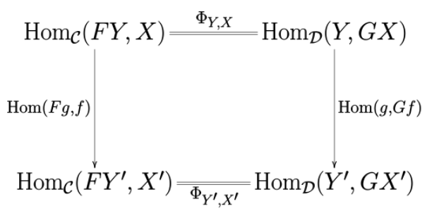
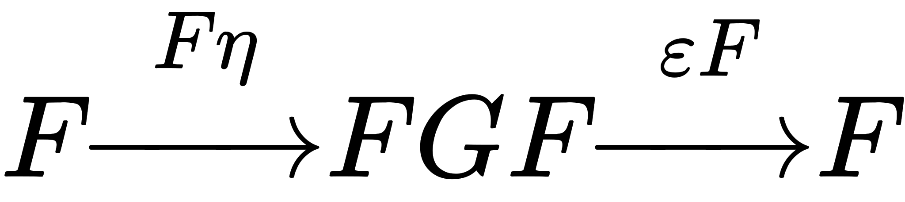
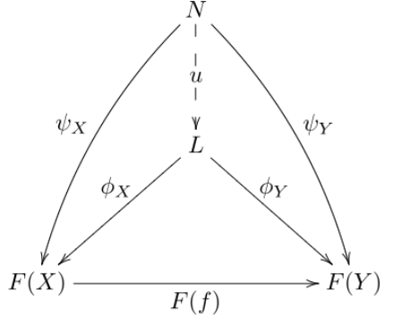
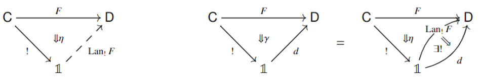
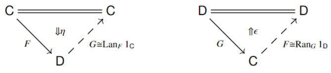

alias:: [[Category Theory]]

- [[References]]
	- ((63ba25c2-8eff-41fb-b08c-9098b6a3047c)) Invitation
	- Denis-Charles Cisinski. Higher Categories and Homotopical Algebra.
	- 
	- 
	- 
	- 
	-
- # Basics
  collapsed:: true
	- Notations
		- Functor category $Fun(C,D)$
		-
	- Definitions
		- Congruence #card
		  card-last-interval:: 24
		  card-repeats:: 1
		  card-ease-factor:: 2.36
		  card-next-schedule:: 2023-04-15T03:07:40.474Z
		  card-last-reviewed:: 2023-03-22T03:07:40.476Z
		  card-last-score:: 3
			- An equivalence relation on the class of all Homs $\cup_{A,B}Hom(A,B)$ in the cat, with the following conditions:
			- (i) $f \in \operatorname{Hom}(A, B)$ and $f \sim f^{\prime}$ implies $f^{\prime} \in \operatorname{Hom}(A, B)$
				- Necessary but insufficient.
			- (ii) $f \sim f^{\prime}, g \sim g^{\prime}$, and the composite $g \circ f$ exists imply that
			  $$
			  g \circ f \sim g^{\prime} \circ f^{\prime} .
			  $$
				- Transitive.
		- Idempotent #card
		  card-last-interval:: 201.84
		  card-repeats:: 4
		  card-ease-factor:: 2.9
		  card-next-schedule:: 2023-08-02T20:55:14.542Z
		  card-last-reviewed:: 2023-01-13T00:55:14.542Z
		  card-last-score:: 5
		  collapsed:: true
			- A morphism with $$e=e^2:=e \circ e$$
				- Motivated by projectors in $\mathrm{Set}$
			-
			- Split #card
			  card-last-interval:: 201.84
			  card-repeats:: 4
			  card-ease-factor:: 2.9
			  card-next-schedule:: 2023-10-01T08:08:48.299Z
			  card-last-reviewed:: 2023-03-13T12:08:48.299Z
			  card-last-score:: 5
				- An idempotent $e: x \rightarrow x$ splits if there exists an object $y \in \mathcal{C}$ equipped with two morphisms $r: x \rightarrow y, s: y \rightarrow x$ such that $r \circ s=\mathrm{id}_y$ and $s \circ r=e$.
					- Motivated by surjective maps (projections) in $\mathrm{Vec}$: We can project $V$ to $W$ and embed $W$ back to $V$.
				- The triple $(y, r, s)$ (or simply the object $y)$ is called an image of the idempotent $e$.
			- Idempotent complete
			  id:: 636ca217-d22e-42b8-984f-f4f35d530948
				- A category $\mathcal{C}$ where every idempotent in $\mathcal{C}$ splits.
		- Subobject #card
		  id:: 641a6a23-ca6b-4d29-b1dc-28dab3b2fb6a
			- A subobject is an isomorphism class of monomorphisms.
				- Note that $f: a \to x$ and $g: b \to x$ are called equivalent if there is an isomorphism $h: a \to b$ s.t. $f=g \circ h$
			- The motivation is to define the category version of subset.
			  However, we can't talk about 'elements of object' in a category, so we talk by embedding (monomorphism) instead.
				-
	- ## [[Functor]]s
	  collapsed:: true
		- ### Possible properties
		  collapsed:: true
			- Essentially surjective #card
			  card-last-interval:: 31.26
			  card-repeats:: 1
			  card-ease-factor:: 2.6
			  card-next-schedule:: 2023-05-16T06:57:19.632Z
			  card-last-reviewed:: 2023-04-15T00:57:19.632Z
			  card-last-score:: 5
				- For every object $d \in \mathrm{D}$ there is some $c \in \mathrm{C}$ such that $d$ is isomorphic to $F c$.
				- In other words, it is surjective in terms of isomorphism classes
					- In categories only isomorphism classes (rather than specific objects) account.
			- Full and Faithful #card
				- Full if for each $x, y \in \mathrm{C}$, the map $\mathrm{C}(x, y) \rightarrow \mathrm{D}(F x, F y)$ is surjective
				- Faithful if for each $x, y \in \mathrm{C}$, the map $\mathrm{C}(x, y) \rightarrow \mathrm{D}(F x, F y)$ is injective
		- Contravariant functor #card
		  collapsed:: true
			- Definition. If $\mathscr{A}$ and $\mathscr{C}$ are categories, a contravariant functor $S: \mathscr{A} \rightarrow \mathscr{C}$ is a function, that is,
			- (i) if $f: A \rightarrow A^{\prime}$ is a morphism in $\mathscr{A}$, then $S f: S A^{\prime} \rightarrow S A$ is a morphism in $\mathscr{C}$, such that:
			- (ii) if $f, g$ are morphisms in $\mathscr{A}$ for which $g \circ f$ is defined, then
			  background-color:: yellow
			  $$
			  S(g \circ f)=S(f) \circ S(g)
			  $$
				- This is what 'contravariant' means.
				- Usual functors are actually **covariant functors**.
			- (iii) $S\left(1_A\right)=1_{S A}$ for every $A \in \operatorname{obj} \mathscr{A}$.
		- Hom functor #card
		  collapsed:: true
			- Denoted by $Hom(X,-)$ or just $C(X,-)$
			- A functor from $\mathcal C$ to $\mathrm{Set}$ given by
			  $$Hom_C(X,-)(Y):=Hom_C(X,Y) \\ Hom_C(X,-)(g):=g \circ -$$
				- The second line needs some explanation: 
				  It means mapping a hom to a 'pushforward map', that is, mapping homs in $\mathrm{Hom}_{\mathcal{C}}(X,Y)$ to $\mathrm{Hom}_{\mathcal{C}}(X,Z)$ (suppose $\mathrm{Hom}_{\mathcal{C}}(Y,Z))$
		- Adjoint functor
		  collapsed:: true
			- Equivalent definitions #card
			  id:: 6416c1f0-2caa-46a8-85c7-b247488d0785
			  collapsed:: true
				- Version 1. A pair of functors $F:C \to D$ and $G:D \to C$ s.t. $\mathrm{Hom}_{\mathcal{C}}((-),G(-))$ and $\mathrm{Hom}_{\mathcal{D}}(F(-),(-))$ are naturally isomorphic.
					-
					- $\mathrm{Hom}_{\mathcal{C}}((-),G(-))$ is a functor $\bar C \times D \to \mathrm{Set}$.
					  The mapping of objects is evident, while the mapping of Homs are given by pushforwards 
					  $$
					  h \rightarrow f \circ h \circ F g
					  $$
					- See 
					  
				- Version 2. A pair of functors $F:C \to D$ and $G:D \to C$, with natural isomorphisms $id_C \overset{\eta}{\Rightarrow} GF$ (unit) and $FG \overset{\lambda}{\Rightarrow} id_D$ (counit) satifying the **zigzag equations**:
				  {:height 50, :width 162} is $id_F$ and
				  {:height 49, :width 180} is $id_G$
					- Note that they are **directly equal**, not linked by a natural isomorphism.
			- Proposition. The two definitions are equivalent. #card
				-
				-
			- Examples
				- Theorem. The free functor is the left adjoint of the forgetful functor. （自由是遗忘的左伴随） #card
					-
				- Theorem. (Frobenius Reciprocity) Consider $\mathrm{Rep}(G)$ and $\mathrm{Rep}(Z(x))$ for some $x \in G$. We have two functors: a forgetful functor $F$ and a functor $\mathrm{Ind}$ of induced representations. Then $F$ is both the left and right adjoint of $G$. #card
					- The induced representation is natural on the vector space graded by $G / Z(x)$, which is a set of cosets rather than a quotient group.
					-
					-
	- ## Natural Transformation
	  collapsed:: true
		- Def #card
		  card-last-score:: 5
		  card-repeats:: 3
		  card-next-schedule:: 2023-08-01T00:25:56.086Z
		  card-last-interval:: 84
		  card-ease-factor:: 2.8
		  card-last-reviewed:: 2023-05-09T00:25:56.086Z
		  collapsed:: true
			- A family $\{\alpha_x\}$ such that ((636ca3f1-0eb2-4ab9-b618-e430f99c3d90))
			- Natural isomorphism
				- Each $\alpha$ is an isomorphism
		- Vertical composition #card
		  card-last-interval:: 30
		  card-repeats:: 1
		  card-ease-factor:: 2.6
		  card-next-schedule:: 2023-06-04T00:32:07.180Z
		  card-last-reviewed:: 2023-05-05T00:32:07.181Z
		  card-last-score:: 5
			- Essentially, we have $F \overset{\alpha}{\Rightarrow} G$ and $G \overset{\beta}{\Rightarrow} H$. We would like to compose the two to have $F \overset{\beta \circ \alpha}{\Rightarrow} H$
			- ((6416ba90-2deb-428b-b6cf-fb6dedf75dd1))
				- The whole diagram commutes since each small square commutes.
		- Horizontal composition #card
		  collapsed:: true
		  card-last-interval:: 30
		  card-repeats:: 1
		  card-ease-factor:: 2.6
		  card-next-schedule:: 2023-05-05T00:42:45.930Z
		  card-last-reviewed:: 2023-04-05T00:42:45.931Z
		  card-last-score:: 5
			- We have two different paths from C to E by composing two pairs of functors.
			  We'd like two link the two routes by composing the natural transformations at each step.
				- ((6416bb24-d547-4c3d-b1f5-88eedd9b956c))
			- ((6416bb8b-f1b1-4df6-9e95-433f64466150))
				- Exercise. It is indeed a natural transformation.
				  collapsed:: true
					- The left square commutes by the functoriality of $H$.
					- The right square commutes trivially.
				- Exercise. The natural transformation is the same if we substitute the inner layer by $KFc$ and $KFc'$.
				  collapsed:: true
					- Easy to verify they're equal from the naturality of $\beta$.
				- That is, the two different ways to link the two paths are identical.
	- Equivalent categories #card
	  collapsed:: true
		- Let $\mathcal{C}, \mathcal{D}$ be categories. A functor $F: \mathcal{C} \rightarrow \mathcal{D}$ is called an equivalence if there exists a functor $G: \mathcal{D} \rightarrow \mathcal{C}$ such that $G \circ F$ is naturally isomorphic to id $\mathcal{C}$ and $F \circ G$ is naturally isomorphic to $\mathrm{id}_{\mathcal{D}}$. 
		  In this case $G$ is called the **quasi-inverse** of $F$.
		- Theorem. A functor $F: \mathcal{C} \rightarrow \mathcal{D}$ between two categories $\mathcal{C}, \mathcal{D}$ is an equivalence **if and only if** it is fully faithful and essentially surjective.
			- i.e. Isomorphism classes are bijective and so do the Homs.
	- Comma category #card
	  id:: 6417d04a-7bd7-4f24-8124-2ececcbcebbe
	  collapsed:: true
		- $(S/T)$ (or $S\downarrow T$) is defined for two functors $\mathcal{A} \stackrel{S}{\longrightarrow} \mathcal{C} \stackrel{T}{\longleftarrow} \mathcal{B}$
		- Objects
			- triples $(A,B,f)$ where $A \in \mathrm{Ob}(\mathcal{A}), B \in \mathrm{Ob}(\mathcal{B}), f: S A \rightarrow T B$
		- Morphisms
			- The morphisms from $(A, B, h)$ to $\left(A^{\prime}, B^{\prime}, h^{\prime}\right)$ are **pairs** $(f, g)$ where $f: A \rightarrow A^{\prime}$ and $g: B \rightarrow B^{\prime}$ are morphisms in $\mathcal{A}$ and $\mathcal{B}$ respectively, such that the following diagram commutes:
			- ((6417d364-50ec-428b-8802-491cc147e3d1))
		- The composition of homs are given by compositions in $\mathcal{A}$ and $\mathcal{B}$.
		-
		-
	- ## New cats from old ones
	  collapsed:: true
		- Quotient category #card
		  card-last-interval:: 30
		  card-repeats:: 1
		  card-ease-factor:: 2.6
		  card-next-schedule:: 2023-06-12T12:02:41.729Z
		  card-last-reviewed:: 2023-05-13T12:02:41.731Z
		  card-last-score:: 5
			- Let $\mathscr{C}$ be a category with congruence $\sim$, and let $[f]$ denote the equivalence class of a morphism $f$. 
			  Define the quotient category $\mathscr{C}^{\prime}$ as follows:
			  $$
			  \begin{aligned}
			  \operatorname{obj} \mathscr{C}^{\prime} & =\operatorname{obj} \mathscr{C} ; \\
			  \operatorname{Hom}_{\mathscr{E}^{\prime}}(A, B) & =\left\{[f]: f \in \operatorname{Hom}_{\mathscr{E}}(A, B)\right\} ; \\
			  {[g] \circ[f] } & =[g \circ f] .
			  \end{aligned}
			  $$
			- Homs are equivalence classes.
			- The most important example is the homotopy category (Exercise).
			-
		- [[Deligne tensor product]]
		- Reversing some spacetime direction of a [[Topological Order]]
		  collapsed:: true
			- [[Time-reversed category]], $$\bar{\mathcal C}$$
			  collapsed:: true
				- ((6374412e-afc1-4336-b9a7-512c8faf35f6))
				- ((63744224-6f7c-4ae0-9d8c-64f7d4af6968)), thus reversing the [[Braiding]].
				- ((63744151-8b20-457e-bad9-68a4b50f626a))
				- ((637441ed-94ab-42c2-b10d-2e7d41c4c047)) #TODO
			- [[Space-reversed category]]
			- ((63744374-4dd7-4462-add5-bf48376f25f7))
			  collapsed:: true
				- In other words, only flips in different directions.
		- Opposite category $C^{op}$
		  collapsed:: true
			- Essentially reversing all morphisms.
			- ((636ca0b0-663c-4a6d-a73d-132541c72d7d))
		- [[Cartesian product]] of categories
		  collapsed:: true
			- ((636ca0e8-2319-486b-99ab-44be23202cff))
		- Full subcategory
		  collapsed:: true
			- A subcategory D of C with $$\operatorname{Hom}_{\mathcal{D}}(x, y)=\operatorname{Hom}_{\mathcal{C}}(x, y) \text { for all } x, y \in \mathcal{D}$$
			-
		- [[Drinfeld center]]
- # Additional structures
  collapsed:: true
	- # C-linear category
		- ## Defs
		  collapsed:: true
			- ((641a5ef2-1a8b-4179-b19f-06af5390f5e8)) A $\mathbb k$-linear category is a cat such that 
			  (1) each hom set has a $\mathbb k$ vector space structure 
			  (2) the composition is $\mathbb k$-linear
				- ((636ca2f8-7130-45e2-abc4-1220ed351269))
			- Direct sum of objects
				- A direct sum of $x_1, \ldots, x_n$ is an object $x \in \mathcal{C}$ equipped with morphisms $l_i: x_i \rightarrow x$ and $\pi_i: x \rightarrow x_i$ for every $1 \leq i \leq n$, such that the following $\left(n^2+1\right)$ equations hold:
				  $$
				  \pi_i \circ \iota_j=\delta_{i j} \cdot \operatorname{id}_{x_j}(\text { for all } 1 \leq i, j \leq n), \quad \sum_{j=1}^n \iota_j \circ \pi_j=\mathrm{id}_x .
				  $$
			- Direct sum of categories
				- The underlying category of $\mathcal{C} \oplus \mathcal{D}$ is $\mathcal{C} \times \mathcal{D}$.
				- The $\mathbb{C}$-linear structure on a hom space $\operatorname{Hom}_{\mathcal{C} \oplus \mathcal{D}}\left((x, y),\left(x^{\prime}, y^{\prime}\right)\right)$ is given by the direct sum of vector spaces $\operatorname{Hom}_{\mathcal{C}}\left(x, x^{\prime}\right) \oplus \operatorname{Hom}_{\mathcal{D}}\left(y, y^{\prime}\right)$.
		- ## Properties
			- A direct sum is both a product and a coproduct. #card
			  card-last-interval:: 30
			  card-repeats:: 1
			  card-ease-factor:: 2.6
			  card-next-schedule:: 2023-05-15T00:53:50.607Z
			  card-last-reviewed:: 2023-04-15T00:53:50.608Z
			  card-last-score:: 5
				- Just verify the universal properties.
			- If the product and coproduct of $\{x_i\}_i$ are isomorphic in a $k$-linear cat, then it is the direct sum. #card
				- Note that this statement is nontrivial since the direct sum **might not exist** in a general $k$-linear category.
				-
		- [[Semisimplicity]]
	- [[Monoidal Structure]]
		- Braided Monoidal functor
			- Def
				- A monoidal functor with ((6376e81c-2e47-48db-8cd0-86df3405e14e))
				-
	- [[Dagger structure]] and Unitarity
	- [[Rigidity]] and [[Pivotal structure]]
	- [[Braiding]]
	- [[Ribbon]]
	- [[Central functor]]
	- Combination of structures
		- [[Unitary modular tensor category]]
- # [[Fusion category]]
- # Monad
  id:: 641813e5-e452-4c3b-aa79-fe4b3df4596f
  collapsed:: true
	- Exercise. Check the left dual of $G \in \mathrm{End}(C)$ is the right adjoint. #card
	-
- # Higher cats
  collapsed:: true
	- [[2-category]]
	- [[Morita equivalence]]
	- [[Muger center]]
		- [[Nondegenerate]]
- # Higher Algebras, Higher Modules and Centers
  id:: 6401b893-4fac-428b-81c2-677ffb42ac72
	- Remark: As we go higher and higher, the properties are better and better (monoidal, braided, symmetric, ...)
	- ## Intuitions
	  collapsed:: true
		- Consider 4 particles a,b,c,d in a 2D topo order.
			- We have 2 ways to fuse them: $(a\otimes b)\otimes (c \otimes d)$ and $(a \otimes c) \otimes (b \otimes d)$.
			- Formally, we have two different algebra homomorphisms (fusions), called horizontal and vertical respectively. Moreover, they should be compatible.
			- This motivates the $E_2$ algebra.
		- Similarly, we can take different slices in a 3D topo order.
			- The slices themselves are $E_2$ algebras, while there's a third fusion between the slices.
			- This motivates the $E_3$ algebra, i.e. 3 compatible fusions.
	- ## Definitions
	  collapsed:: true
		- Monoid #card
		  collapsed:: true
		  card-last-interval:: 30
		  card-repeats:: 1
		  card-ease-factor:: 2.6
		  card-next-schedule:: 2023-05-16T00:52:27.457Z
		  card-last-reviewed:: 2023-04-16T00:52:27.457Z
		  card-last-score:: 5
			- Also called semigroup.
			- Essentially, a group minus the inverses. Still has associativity and unit.
		- Algebra in a monoidal category $(C,\otimes,I,\alpha,\lambda,\rho)$ #card
			- A triple $(A, m: A \otimes A \to A, u: I \to A)$ where $A \in ob(C)$, $m,u \in \mathrm{Mor}(C)$
				- $m$ is called the multiplication.
				- $u$ carries information about the 'unit'
			- Consistency relations
				- Two different paths of multiplication from $(A \otimes A) \otimes A$ and $A \otimes (A \otimes A)$ to $A$ are equal.
				- $A \overset{\rho_A}{\to} A \otimes I \overset{\mathrm{id}_A \otimes n} {\to} A\otimes A \overset{m}{\to} A$ is equal to $\mathrm{id}_A$, and its dual version
		- Algebra homomorphism between algebras in $C$
			- $\phi: A \to B$ with two consistency relations
			  collapsed:: true
				- 'Map then multiply' is equal to 'multiply then map'
				- $\phi \circ u_A = u_B$, which means two creators are compatible.
		- Category of algebras in a monoidal category #card
		  collapsed:: true
		  card-last-interval:: 31.26
		  card-repeats:: 1
		  card-ease-factor:: 2.6
		  card-next-schedule:: 2023-05-15T17:37:58.991Z
		  card-last-reviewed:: 2023-04-14T11:37:58.991Z
		  card-last-score:: 5
			- Objects are algebras
			- Homs are homomorphisms
			-
	- ## Higher Algebras
	  collapsed:: true
		- How does the requirements of $E_0,E_1,E_2,E_3$ corresponds to physical intuitions? #card
		  collapsed:: true
			- $E_0$: {{cloze 0D, not any special structures}}
			- $E_1$: {{cloze anyons can fuse}}
			- $E_2$: {{cloze things have an extra dimension to braid}}
			- $E_3$: {{cloze only fermions and bosons}}
			- Higher dimensions: Seems our structure is not sufficient (cannot obtain any more structure). We need something more sophisticated, eg. 2-cat.
			  collapsed:: true
				- Maybe braidings in 1-cats are too strong and restrictive. We need something more.
				- Can we find some structure which can always be extended?
		- 'Take the algebra' is somwhat similar to 'adding a dimension' #card
		  card-last-interval:: 30
		  card-repeats:: 1
		  card-ease-factor:: 2.6
		  card-next-schedule:: 2023-06-03T12:46:06.173Z
		  card-last-reviewed:: 2023-05-04T12:46:06.175Z
		  card-last-score:: 5
		- Baez-Dolan conjecture. For a symmetric monoidal n-category $C$, the forgetful functor $E_{k+1}\mathrm{Alg}(C) \to E_k\mathrm{Alg}(C)$ is an equivalence for $k>n$. #card
		  collapsed:: true
			- Have been proven for a special case $n=2,C=\mathrm{Cat}$
			- [Higher Algebra] Corollary 5.1.1.7 claims to have proved this.
		- Defs
			- Cat of $E_0$ algebras, $E_0\mathrm{Alg}(C,J)$ #card
			  collapsed:: true
			  card-last-interval:: 30
			  card-repeats:: 1
			  card-ease-factor:: 2.6
			  card-next-schedule:: 2023-06-04T00:30:12.771Z
			  card-last-reviewed:: 2023-05-05T00:30:12.772Z
			  card-last-score:: 5
				- Let $(C,J)$ be a category with a distinguished object $J$.
				- An $E_0$-algebra in $(C,J)$ is a pair $(A,j_A)$ where $A\in C, j_A:J \to A$
					- Actually not an algebra, because there is no multiplication.
				- An $E_0$-algebra homomorphism from $(A,j_A)$ to $(B,j_B)$ is $\phi: A \to B$ such that the diagram commutes:
				  $J \overset{j_A}{\to} A \overset{\phi}{\to} B$ = $J \overset{j_B}{\to} B$
			- Cat of $E_1$ algebras, $E_1\mathrm{Alg}(C)$ #card
			  collapsed:: true
				- An $E_1$-algebra in $C$ is an algebra in $E_0\mathrm{Alg}(C)$
				- An $E_1$-algebra homomorphism is an algebra hom in $E_0\mathrm{Alg}(C)$
				- Condition: {{cloze C monoidal}}
			- Cat of $E_2$ algebras, $E_2 \mathrm{Alg} (B)$ #card
				- An $E_2$ algebra is an algebra in $E_1\mathrm{Alg}(B) \simeq \mathrm{Alg}(B)$
				- Condition: {{cloze C braided monoidal}}
			- Cat of $E_3$-algebras, $E_3\mathrm{Alg}(S)$ #card
				- An $E_3$-algebra is an algebra in $E_2\mathrm{Alg}(S)$
				- Condition for it to be monoidal: {{cloze C symmetric braided monoidal}}
			- Cat of $E_n$-algebras for $n \geq 3$ #card
			  collapsed:: true
			  card-last-interval:: 31.26
			  card-repeats:: 1
			  card-ease-factor:: 2.6
			  card-next-schedule:: 2023-05-27T06:21:07.577Z
			  card-last-reviewed:: 2023-04-26T00:21:07.577Z
			  card-last-score:: 5
				- All same as $E_3\mathrm{Alg}(S) \simeq \mathrm{CAlg}(S)$!
				- Only requiring $S$ is symmetric braided monoidal.
		- Theorems about $E_0$ to $E_3$
		  collapsed:: true
			- Lemma 1. Suppose $(C,\otimes,I)$ is a monoidal category. Then $E_0\mathrm{Alg}(C,I)$ is also a monoidal cat. #card
			  collapsed:: true
				- For simplicity we take $C$ to be strict.
				- First we should define the tensor (fusion) in $E_0\mathrm{Alg}(C,I)$
				  collapsed:: true
					- $(A,j_A)\otimes (B,j_B):=(A\otimes B, j_A \otimes j_B)$
					  collapsed:: true
						- Note that we take $I \otimes I$ to be identical to $I$.
				- Obviously the identity is $(I,\mathrm{id}_I )$
				- Finally find the associators and unitors.
			- Theorem 1. $E_1\mathrm{Alg}(C) \simeq \mathrm{Alg}(C)$ #card
			  collapsed:: true
				- *Complete the proof!*
				- Comment: This is quite interesting. Though $E_0\mathrm{Alg}(C)$ and $C$ are generally different, their cats of algebras are equivalent.
				- Essentially we invoke all definitions of $E_0\mathrm{Alg}$ and algebras to obtain the axioms of algebras in $C$.
			- Lemma 2. If $C$ is braided, then $E_1\mathrm{Alg}(C) \simeq \mathrm{Alg}(C)$ is a monoidal category.
			  collapsed:: true
				- *Still we take the cat to be strict for simplicity.*
				- Key point
				  collapsed:: true
					- When we try to define a fusion canonically, we should find a hom $m: A \otimes B \otimes A \otimes B \to A \otimes B$. This is done by braiding the inner B and A to obtain $A \otimes A \otimes B \otimes B$, then use $m_A$ and $m_B$.
					- The braiding grants a canonical way to form a fusion hom.
				- Verify the consistency relations
				  collapsed:: true
					- Fusion outcome really an algebra
					  collapsed:: true
						-
					- Associativity
					  collapsed:: true
						- We'll have many beautiful braiding diagrams to prove the associativity of the fusion!
					- Unitality
					  collapsed:: true
						- Still beautiful braiding diagrams.
				-
			- Theorem 3. There is a canonical equivalence $E_2\mathrm{Alg}(B) \simeq \mathrm{CAlg}(B)$ (the cat of commutative algebras in $B$) #card
			  collapsed:: true
			  card-last-interval:: 30
			  card-repeats:: 1
			  card-ease-factor:: 2.36
			  card-next-schedule:: 2023-06-21T00:50:07.286Z
			  card-last-reviewed:: 2023-05-22T00:50:07.288Z
			  card-last-score:: 3
				- Note: *commutative* means that **multiply = braid and multiply**
				- Note that we have **two** multiplications, one of $\mathrm{Alg}(B)$ and one of $\mathrm{Alg}(\mathrm{Alg}(B) )$
				- Check the consistency relations
				  collapsed:: true
					- Algebra homomorphisms
					- Consistency of algebras
			- Lemma 3. If $S$ is a symmetrical braided monoidal category, then $E_2\mathrm{Alg}(S)$ is a monoidal category. #card
			  collapsed:: true
				- Recall that 'symmetrical' means that all double braidings are trivial.
				- It can still be checked by beautiful braiding diagrams.
			- Theorem 3. $E_3\mathrm{Alg}(S) \simeq \mathrm{CAlg}(S)$ #card
		- Exercise. Verify that when $B=\mathrm{Set}$, $E_2\mathrm{Alg}(B)$ satisfies $(a \times_v b) \times_h (c \times_v d) \simeq (a \times_h c) \times_v (b \times_h d)$ #card
		- Prop. A braided monoidal category is an $E_2$-algebra in the 2-cat $\mathrm{Cat}$
			- My task is to explicitly construct the monoidal structure.
		-
	- ## Higher Modules
		- Remark: Modules can be regarded as representations of the algebras #card
		  card-last-interval:: 25.01
		  card-repeats:: 1
		  card-ease-factor:: 2.6
		  card-next-schedule:: 2023-04-20T07:52:48.215Z
		  card-last-reviewed:: 2023-03-26T07:52:48.215Z
		  card-last-score:: 5
			- Here's the categorified version.
		- ### Physical Intuition
			- Consider some topo order with a domain wall. It is a module in the sense that excitations on both sides can be moved inside and fuse.
		- ### Definitions
			- A left module $M$ over a monoidal category $C$ #card
				- C is a monoidal category, $A \in C$ is an algebra, $M$ is a left C-module cat, $\odot: C \times M \to M$.
				  A left module over $A$ in $M$ is a pair $(D\in M, \rho: A \odot D \to D)$ satisfying two consistency relations called associativity and unitality.
					- Essentially an action functor $\odot: C \otimes M \to M$, with some consistency relations
					- $A$ is the algebra providing actions and $D$ is the thing to be acted on.
			- Left $E_2$-module over $A$ in $S$ #card
				- A pair $(D \in E_2\mathrm{Alg}(S), \rho: A \odot D \to D)$
				- Consistency relations
					- Multiplication in $A$ and the action are compatible
				-
				- Note $A \in E_3\mathrm{Alg}(S)$
			- Left $E_1$-module over braided monoidal cat #card
				- Physically corresponds to {{cloze 1D boundary of 2D TO}}
				- A tuple $(M, \odot: B \times M \to M, \alpha^M, \lambda^M)$
					- $M$ itself is a monoidal category (degrade one step from braided monoidal)
					- $B$ a braided monoidal cat
					- $\odot$ is a monoidal functor
					- $\alpha^M,\lambda^M$ are monoidal natural isomorphisms
				- Consistency relations
					- Pentagon
					- Triangle
			- Left $E_2$ module over a symmetric braided monoidal cat #card
				- Physically corresponds to {{cloze 2D boundary of 3D TO}}
				- A tuple $(M, \odot: S \times M \to M, \alpha^M, \lambda^M)$
					- $M$ itself is a braided monoidal category (degrade one step from symmetric braided monoidal)
					- $B$ a symmetric braided monoidal cat
					- $\odot$ is a monoidal functor
					- $\alpha^M,\lambda^M$ are monoidal natural isomorphisms
				- Consistency relations
					- Pentagon
					- Triangle
				-
				-
			-
	- ## Examples
		- Algebra in $\mathcal C = (\mathrm{Set} , \times, \{*\})$, $\mathcal{C}=(\mathrm{Abel}, \times, \{e\} )$, $\mathcal{C}=(\mathrm{Vec}_\mathbb k,\otimes, \mathbb k)$
			- Setup
				- The fusion is direct product and the unit is the single-point set.
				- Exercise. The only possible associator is the trivial one.
			- Conclusion: It is a unital monoid, with the unit being $u(*)$!
			- Conclusion: A ring, with addition given by the group addition.
			- Conclusion: A $k$-algebra
		- Algebra in ($\mathrm{End}(\mathcal{B},\circ, \mathrm{id}_B  ))$ #card
			- A triple, $E: B \to B$, $m: E\circ E \to E$, $u: \mathrm{id}_B \to E$
			- It is precisely a ((641813e5-e452-4c3b-aa79-fe4b3df4596f)) on B!
		- For a category $C$ with a terminal object $T$, $\mathrm{Alg}(C)$ has a terminal object constructed from $T$ and an initial object constructed from $I$. #card
-
- # Limits and Colimits
  collapsed:: true
	- Cone #card
	  card-last-interval:: 32.57
	  card-repeats:: 1
	  card-ease-factor:: 2.6
	  card-next-schedule:: 2023-06-07T01:13:33.272Z
	  card-last-reviewed:: 2023-05-05T12:13:33.272Z
	  card-last-score:: 5
		- A cone over a functor $F:J\to C$ with **summit** $x$, $\Delta_x$, is a natural transformation $\lambda: x \Rightarrow F$ whose domain is the constant functor at $x$.
			- A constant functor maps every $j$ to $x$ and maps every hom to $id_x$.
		- The components $\left(\lambda_j: c \rightarrow F j\right)_{j \in \mathrm{J}}$ of the natural transformation are called the **legs** of the cone.
		- ((6417c7d7-9d66-45c8-b1ea-2d11deb1bff8))
			- This diagram only shows two legs, but actually each $j\in J$ has a leg. The whole diagram looks like a huge cone (with the top c and lots of legs pointing downwards)
	- Cocone
		- Reverse directions of all legs.
	- Limit #card
	  id:: 6417c847-2819-4ff7-998a-32cc39c403e2
	  collapsed:: true
		- *Wenwei Li presents another definition by ((6417d04a-7bd7-4f24-8124-2ececcbcebbe)). Check it.
		- The terminal cone with the **summit** called $\lim_F$.
		- Explicitly:
		  collapsed:: true
		  {:height 281, :width 347}
			- Here $L$ is $\lim_F$.
		- Note that the limit of a sequence in a topological space is a special case if we redefine the topology by filters.
		  collapsed:: true
			- See [Category-theoretic limit related to topological limit? - Mathematics Stack Exchange](https://math.stackexchange.com/questions/60590/category-theoretic-limit-related-to-topological-limit/62800#62800)
	- Colimit
	  id:: 6417c84a-35a1-4f83-ae94-e03a7f2c4fc4
		- The initial cocone with the summit called $\mathrm{colim}_F$.
	-
- # Representability and Yoneda Lemma
  collapsed:: true
	- Representable functor #card
	  card-last-interval:: 33.94
	  card-repeats:: 1
	  card-ease-factor:: 2.6
	  card-next-schedule:: 2023-05-14T23:36:20.657Z
	  card-last-reviewed:: 2023-04-11T01:36:20.658Z
	  card-last-score:: 5
		- Exist some x s.t. $\mathrm{Hom}_{\mathcal{C}}(X,-) \simeq F$ (naturally isomorphic)
		- Examples
			- The identity functor on $\mathrm{Set}$ is represented by $\{*\}$. #card
				- Intuitively, 'the set of maps from a single-point set to $S$' is equivalent to $S$ itself.
				- Exercise. Explicitly construct the natural isomorphism.
	- [[Yoneda Lemma]]
- # Kan Extension
  collapsed:: true
	- > All concepts are Kan extensions.
	- Idea
	  collapsed:: true
		- We want to address the approximation problem ((6417cf47-91da-4a70-9d80-c3a8b38344a2))
		  such that the upper route and lower route are naturally isomorphic.
		- Usually it is not exactly solvable. For example, we may have $K(c_1)=K(c_2)$ but $F(c_1) \neq F(c_2)$.
		- Kan extension aims to find a 'best approximation' to the solution.
			- The 'best approximation' is always done by universal property, which aims to preserve exactly enough information.
	- Def #card
	  collapsed:: true
	  card-last-interval:: 30
	  card-repeats:: 1
	  card-ease-factor:: 2.6
	  card-next-schedule:: 2023-05-05T00:27:20.071Z
	  card-last-reviewed:: 2023-04-05T00:27:20.071Z
	  card-last-score:: 5
		- Concisely, the initial object in the ((6417d04a-7bd7-4f24-8124-2ececcbcebbe)) $\tilde F/K^*$
			- Specifically, 
			  $$\mathrm{Fun}(\mathcal{D},\mathcal{E}) \stackrel{K^*}{\rightarrow} \mathrm{Fun}(\mathcal{C},\mathcal{E}) \stackrel{\tilde F}{\leftarrow}\{*\}  $$
			  where $K*:H\mapsto HK, \tilde F:\mathrm{id}_* \mapsto F$
				- Construct a functor from (or to) the trivial cat to fix some object (or functor, natural transformation, etc) #Strategy
			- Verify the rest as an exercise!
		- Explicitly: A pair $\left(\operatorname{Lan}_K F, \eta\right)$, where $\eta$ is a natural transformation from $F$ to $\mathrm{Lan}_K F \circ K$, such that: for any pair $L: \mathcal{D} \rightarrow \mathcal{E}$ and $\xi: F \rightarrow L K$, exist a unique natural transformation $\chi$ s.t.
		  ((6417fcc4-201f-41c7-8bd7-78752eb8850d))
			- Obviously some universal construction.
			- Note that different paths for the functors does **not** commute. It is the paths for **natural transformations** commute.
	- Construction by ((6417c84a-35a1-4f83-ae94-e03a7f2c4fc4))
	  collapsed:: true
		- ((64180626-c15e-44ef-b728-b8fddc2263d2)) Given functors $F: \mathrm{C} \rightarrow \mathrm{E}$ and $K: \mathrm{C} \rightarrow \mathrm{D}$, if for every $d \in \mathrm{D}$ the colimit
		  $$
		  \operatorname{Lan}_K F(d):=\operatorname{colim}\left(K \downarrow d \stackrel{\Pi^d}{\longrightarrow} \mathrm{C} \stackrel{F}{\rightarrow} \mathrm{E}\right)
		  $$
		  exists, then they define the left Kan extension $\operatorname{Lan}_K F: \mathrm{D} \rightarrow \mathrm{E}$, in which case the unit transformation $\eta$ : $F \Rightarrow \operatorname{Lan}_K F \cdot K$ can be extracted from the colimit cone. 
		  Dually, if for every $d \in \mathrm{D}$ the limit
		  $$
		  \operatorname{Ran}_K F(d):=\lim \left(d \downarrow K \stackrel{\Pi_d}{\rightarrow} \mathrm{C} \stackrel{F}{\rightarrow} \mathrm{E}\right)
		  $$
		  exists, then they define the right Kan extension $\operatorname{Ran}_K F: \mathrm{D} \rightarrow \mathrm{E}$, in which case the counit transformation $\epsilon: \operatorname{Ran}_K F \cdot K \Rightarrow F$ can be extracted from the limit cone. #card
			- Note that $\Pi^d$ is the forgetful functor that forgets the morphism in the comma category.
			- Step 1. Construct the map for Homs (since that for objects is known).
				-
			- Step 2. Construct the natural transformation $\eta$.
			-
			- Step 3. Verify the universality.
			-
	- ## Examples
		- Take $\mathcal{C}={*}$, $\mathrm{D}$ some strange cat, $\mathcal{E}=\mathrm{Set}$, $K:=\{*\mapsto x\}$, $F:=\{*\mapsto \{\cdot\}\}$. Then $(\mathrm{Hom}_{\mathcal{D}}(x,-),\{\cdot \mapsto \mathrm{id}_x\})$ is the left Kan-extension of $F$ along $K$. #card
		  collapsed:: true
		  card-last-interval:: 33.94
		  card-repeats:: 1
		  card-ease-factor:: 2.6
		  card-next-schedule:: 2023-05-17T09:49:12.651Z
		  card-last-reviewed:: 2023-04-13T11:49:12.651Z
		  card-last-score:: 5
			- See Goodnotes/Misc, p11 (Copy that diagram here!)
			- Hint: To define a natural transformation, we only need to define the set of Homs for each object.
			- Remark: {{cloze This is precisely [[Yoneda Lemma]] }}!
			- But how to understand the example intuitively?
		- ### Everything is Kan extensions
			- ((64180925-7584-4cba-83a2-b731525d514b)) ((Co)limits as Kan extensions). The left Kan extension of $F: \mathrm{C} \rightarrow \mathrm{D}$ along the unique functor $!: \mathrm{C} \rightarrow \mathbb{1}$ defines the colimit of $F$ in $\mathrm{D}$, each existing if and only if the other does.
			  Dually, the limit is defined by the right Kan extension. 
			  {:height 153, :width 912} #card
				-
			- ((64180e96-5979-463b-ade9-fc2e4c2edd44)) (Adjunctions are Kan extensions) If $F \dashv G$ is an adjunction with unit $\eta: 1 \Rightarrow G F$ and counit $\epsilon: F G \Rightarrow 1$, then $(G, \eta)$ is a left Kan extension of the identity functor along $F$ and $(F, \epsilon)$ is a right Kan extension of the identity functor along $G$. Moreover, the extension is absolute and pointwise.
			   #card
				-
				-
				-
				-
- # Examples
	- Representation category, $Rep(G)$
	  collapsed:: true
		- Definition
			- $ob(\operatorname{Rep}(G))=$ finite-dimensional $G$-representations (over $\mathbb{C}$ )
			- Homs: Given two finite-dimensional $G$-representations $(V, \rho)$ and $(W, \sigma)$, a morphism $f:(V, \rho) \rightarrow(W, \sigma)$ is a $\mathbb{C}$-linear map $f: V \rightarrow W$ satisfying $f \circ \rho(g)=\sigma(g) \circ f$ for all $g \in G$
			  id:: 6401b893-c43d-4ec7-a680-2489a4420d77
				- Morphism of Reps
			- The composition of morphisms is the usual composition of maps.
			- The identity morphism: Trivial Rep.
		- Possible [[Braiding]]s
			- Trivial
				- ((6371a32a-c4f5-4a03-8818-fee1cc406e72))
			- Fermion-parity, $$Rep(G,z)$$
				- Select some idempotent $$z\in G$$ and divide the vector space into 2 sectors
					- ((6371a387-c94a-48d1-a914-27aaaac3765d))
				- Define the parity according to the eigenvalue of $$\rho(z)$$
					- ((6371a394-fa3e-40b8-a95d-ca3756fe209c))
					- Since multiplication is associative, the braiding satisfy the hexagon equations.
				-
				- Similarly we may define $$\theta_{(V,\rho)}=\rho(z)$$ as a ribbon structure.
				-
	- Group-graded vector category, $Vec(G)$
	  id:: 636df91a-04a7-4d74-ab05-5c5939616e84
	  collapsed:: true
		- Definition
		  collapsed:: true
			- $ob(\operatorname{Vec}_G)=$ locally finite-dimensional G-graded vector spaces (over $\mathbb{C}$ ), i.e., a collection of finite-dimensional vector spaces $\left\{V_g \in \operatorname{Vec}\right\}_{g \in G}$. The direct sum $V:=\bigoplus_{g \in G} V_g$ is called the total space. By abuse of notation, we also use $V$ to denote this $G$-graded vector space.
			- **Hom:** Given two locally finite-dimensional $G$-graded vector spaces $V=\bigoplus_{g \in G} V_g$ and $W=\bigoplus_{g \in G} W_g$, a morphism from $V$ to $W$ is a collection of $\mathbb{C}$-linear maps $\left\{f_g: V_g \rightarrow W_g\right\}_{g \in G}$.
				- A hom for each space separately.
			- The composition of morphisms is given by the usual composition of maps in each degree $g \in G$.
			- The identity morphism $id_V$ on $V=\bigoplus_{g \in G} V_g$ is given by the usual identity map id $V_g$ on each degree $g \in G$.
		-
		-
		- Simple objects of $Vec_{\mathbb Z_2}$ : $(0,\mathbb C)$ and $(\mathbb C,0)$
		-
	- Modules over an algebra, $$\operatorname{LMod}_A(\operatorname{Vec})$$
	- Category associated to $$\mathfrak{sl_2}$$
	  collapsed:: true
		- See ((63759405-cb93-4086-954b-a1c7cff6925e))
			- ((63759549-ad49-406f-abb6-f76fc612e52e))
			- Also links to the [[Vertex operator algebra]]. See the references in Kong.
		- This gives the $$SU(2)_k$$ [[Topological Order]] .
			- k=3: The familiar [[Fibonacci anyons]]!
		- Seems to be links with the [[Quantum Group]]
		- Complete the details here: Fusion rules, braiding structures, quantum dimension. #TODO
		-
	- [[Tube Category]]
	- Homotopy category $\mathrm{hTop}$ #card
	  card-last-interval:: 30
	  card-repeats:: 1
	  card-ease-factor:: 2.6
	  card-next-schedule:: 2023-05-12T11:19:54.498Z
	  card-last-reviewed:: 2023-04-12T11:19:54.498Z
	  card-last-score:: 5
		- The quotient category defined by homotopies.
		- Exercise. Homotopy is a congruence on $\mathrm{Top}$
		-
- # Misc
  collapsed:: true
	- ## Thoughts
		- Try to unify all mathematics by pointing out what kind of questions should we study
			- Universal construction, extension, ...
		- Precise equivalence is often too strict a requirement. {{cloze Being isomorphic}} is usually enough, though it leaves for different structures.
		  id:: 6376e69f-4dbd-4465-b405-49950dce1124
	- ## Proof Tricks
		- Usually the proof would be completed precisely when all conditions are used.
			- eg. When proving adjoint functors are unique up to a canonical isomorphism: use naturality in **both** components