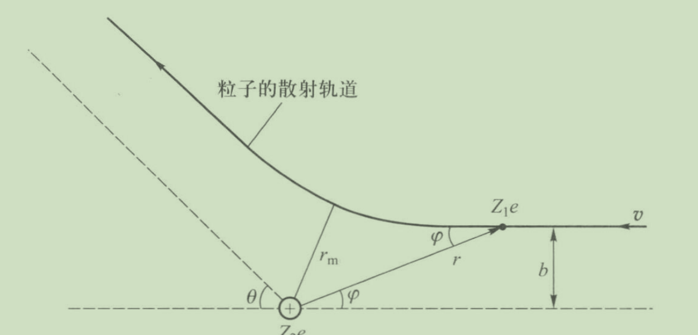

- Rutherford's atom model
  collapsed:: true
	- {:height 433, :width 532}
	- Proposition. Columb's scattering formula
	  $$
	  \begin{gathered}
	  b=\frac{a}{2} \cot \frac{\theta}{2} \\
	  a \equiv \frac{1}{4 \pi \varepsilon_0} \frac{Z_1 Z_2 e^2}{E}
	  \end{gathered}
	  $$
	- Proposition. Rutherford's scattering formula
	  $$
	  \sigma_C(\theta)=\left(\frac{1}{4 \pi \varepsilon_0} \frac{Z_1 Z_2 e^2}{4 E}\right)^2 \frac{1}{\sin ^4 \frac{\theta}{2}}
	  $$
		- $$
		  \sigma_{\mathrm{C}}(\theta) \equiv \frac{\mathrm{d} \sigma(\theta)}{\mathrm{d} \Omega} \equiv \frac{\mathrm{d} N^{\prime}}{N n t \mathrm{~d} \Omega}
		  $$
			- $n$ is the number density of the atom, $t$ is the thickness of the thin film.
		- Proposition.
		  $$
		  \mathrm{d} N^{\prime}=N \frac{a^2 \mathrm{d} \Omega}{16 A \sin ^4 \frac{\theta}{2}} n A t=n t N\left(\frac{1}{4 \pi \varepsilon_0} \frac{Z_1 Z_2 e^2}{4 E}\right)^2 \frac{\mathrm{d} \Omega}{\sin ^4 \frac{\theta}{2}}
		  $$
	-
	-
- Bohr's atom model
	- Notations
		- 原子光谱项T
			- $T_i=\frac 1 {\lambda_i}$, 其中$\lambda_i$是能级i跃迁到无穷远处放出光子的波长。
			- $$\frac{1}{\lambda}=T_2-T_1$$
			-
	- Rydberg's formula
		- $$
		  \sigma \equiv \frac{1}{\lambda}=R_{\mathrm{H}}\left[\frac{1}{n^2}-\frac{1}{n^{\prime 2}}\right]=T(n)-T\left(n^{\prime}\right)
		  $$
		- We can obtain later
		  $$
		  R=\frac{2 \pi^2 e^4 m_{\mathrm{e}}}{\left(4 \pi \varepsilon_0\right)^2 \cdot c h^3}
		  $$
	- Derivation
		- The central force is equal to the Coulomb force,
		  $$
		  \frac{1}{4 \pi \varepsilon_0} \frac{Ze^2}{r^2}=\frac{m_{\mathrm{e}} v^2}{r}
		  $$
		- Thus the total energy is
		  $$
		  E=-\frac{1}{2} \frac{Ze^2}{4 \pi \varepsilon_0 r}
		  $$
		- Quantization of angular momentum
			- $$
			  L=m_{\mathrm{e}} v r = \sqrt{\frac{m_{\mathrm{e}} e^2 r}{4 \pi \varepsilon_0}}
			  $$
			  is quantized to $n \hbar$.
			-
		- The levels are quantized to
		  $$
		  r_n=\frac{1}{4 \pi \varepsilon_0} \frac{e^2}{2 R h c} n^2
		  $$
	- Results
		- $$
		  r_n=\frac{n^2 \hbar^2}{Z k_{\mathrm{e}} e^2 m_{\mathrm{e}}}
		  $$
		- $$
		  E=-\frac{Z k_{\mathrm{e}} e^2}{2 r_n}=-\frac{Z^2\left(k_{\mathrm{e}} e^2\right)^2 m_{\mathrm{e}}}{2 \hbar^2 n^2} \approx \frac{-13.6 Z^2}{n^2} \mathrm{eV}
		  $$
	- Generalizations
		- Sommerfeld's elliptic orbit
			- Generalize a circular orbit to an elliptic orbit
			- Introduce relativistic corrections
	- Comments
		- Since the nuclear isn't infinitely heavy, we should use $m_\mu$ to substitute $m_e$.
		-