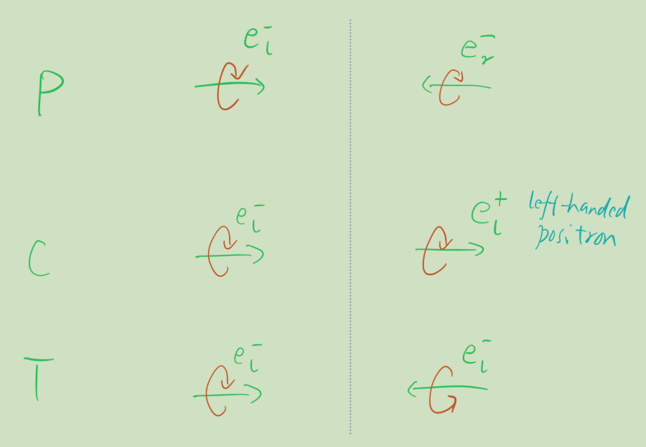

- Tricky points
	- ((6539de97-fcbc-4232-96ac-e224ac8216ec))
	- ((6538770b-6deb-4f32-957e-173bc46f265b))
-
- # CPT Symmetries
  collapsed:: true
	- Matrix forms
		- C is simply charge conjugation, no spatial action.
		- $$
		  \mathcal{P}^\mu{ }_\nu=\left(\begin{array}{llll}
		  1 & & & \\
		  & -1 & & \\
		  & & -1 & \\
		  & & & -1
		  \end{array}\right)
		  $$
		- $$
		  \mathcal{T}^\mu{ }_\nu=\left(\begin{array}{llll}
		  -1 & & & \\
		  & 1 & & \\
		  & & 1 & \\
		  & & & 1
		  \end{array}\right)
		  $$
	- Action on Weyl spinors (particles)
		- Note that these are based on 'physical intuitions'. The actions on fields are determined based on the actions.
		-
		- C only flips the charge, no action on momentum or spin.
		- P only flips momentum.
		- T flips both momentum and spin.
		-
		- Acting on $e_l^-$, we have
		  {:height 335, :width 433}
	- Action on fields
		- Complex scalar
			- $C: \quad \phi(x) \rightarrow \pm \phi^*(x)$,
			  $P: \quad \phi(x) \rightarrow \pm \phi(\mathcal{P} x)$,
			  $T: \quad \phi(x) \rightarrow \pm \phi(\mathcal{T} x)$,
		- Dirac fermion
			- $C: \quad \Psi(x) \rightarrow-i \gamma_2 \Psi^*(x)$
			  $P: \quad \Psi(x) \rightarrow \gamma_0 \Psi(\mathcal{P} x)$,
			  $T: \quad \Psi(x) \rightarrow \gamma_1 \gamma_3 \Psi(\mathcal{T} x)$.
		- Vector field
			- $C: \quad A^\mu(x) \rightarrow-A^\mu(x)$,
			  $P: \quad A^\mu(x) \rightarrow \mathcal{P}^\mu{ }_\nu A^\nu(\mathcal{P} x)$,
			  $T: \quad A^\mu(x) \rightarrow-\mathcal{T}^\mu{ }_\nu A^\nu(\mathcal{T} x)$,
- [[The Standard Model]]
-