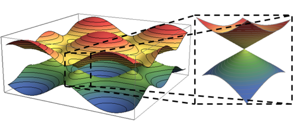

# Definition
	- The dispersion relation $E \propto (p-p_0)$ near the singular point $p_0$
	- 
- # Notes
	- The appearance could depend on the shape of the lattice.
		- For a hexagonal lattice, we have two sets of **inequivalent** sites.
		- Thus we need to perform Bogoliubov transformation to diagonalize the momentum-space modes.
		- We'd like to know the behavior of the spectrum near the singularity. After performing linear expansion and taking norm of the complex number, the quadratic form appears.
			- Similar to [[Kitaev Honeycomb]].
		- In 2D the linear expansion could not vanish identically (since the two basis vectors must be linear independent), but in 3D this is possible.
		  Thus a higher-dimensional singularity might appear.
- # Examples
	- ## 1D
		- Tight-Binding
	- ## 2D
		- Tight-binding model on ((64e25c74-5efe-4b19-888d-d81eabc1c273)) (Graphene)
			- Recall the solution of the hexagonal tight-binding model:
			  ((64e41128-6e00-4aa8-baae-ad44016e1821))
		- Similar to Kitaev honeycomb, there is a gapped phase and a gapless phase.
		-
		- At the boundary of two phases there are strong conic singularities.
		- In the gapless phase, Dirac cones would appear at the intersections of two bands.
			- Graphene corresponds to the point where $t_x=t_y=t_z$.
		-
		- Topological Insulator