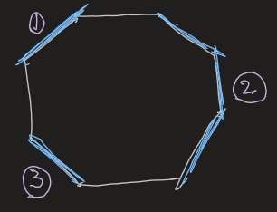

- # Model
	- We want a model such that ((63e8469b-9c89-4ae2-a224-ed6b71d1b33d))
		- $|\psi\rangle=\quad \sum(-1)^{\text {\#loops }} \mid$ loop config $\rangle$
		  all loop configs that
		  can be obtained from
		  a reference loop config
	- Construct the Hamiltonian
	  collapsed:: true
		- #+BEGIN_TIP
		  They're not pulled out of a hat; instead, they're constructed out of the graphical rules!
		  #+END_TIP
		- Vertex operator: Enforcing the rule of closed loops, thus $A_v=\prod_{\partial v} \sigma^z_i$
		- Plaquette operator: Flip the edges with a possible sign. $B_p=\prod_{\partial p}\sigma^x_i \cdot (-1)^{\text{\#Number of sections of blue edges}}$
			- 
				- $N=3$ here
			-
-
- # Comments
	- If we take the diagrammatical algebra naively, there is a certain complication that ((63e84a0a-17de-487e-9fe6-56d1a4166559)).
		- The solution is to break the symmetry of the plane and choose a special direction; only caps in the direction are given signs of $-1$.
		- This is actually a gauge change.
	- ((63d5dcab-2ded-4115-8afc-4beaee04fa6c))
		- ((63d5dcb4-0796-45c6-9e4b-b7cf1f27d4bb))
	- Doubled Semion Theory $=S U(2)_1 \times \overline{S U(2)_1}$
		- $I=\beta=\left(0_R, 0_L\right) ; \delta=\left(1_R, 0_L\right) ; \gamma=\left(0_R, 1_L\right) ; m=\alpha=\left(1_R, 1_L\right)$
		- ((63e84674-1f56-48e0-a54d-8585ffb076cc))