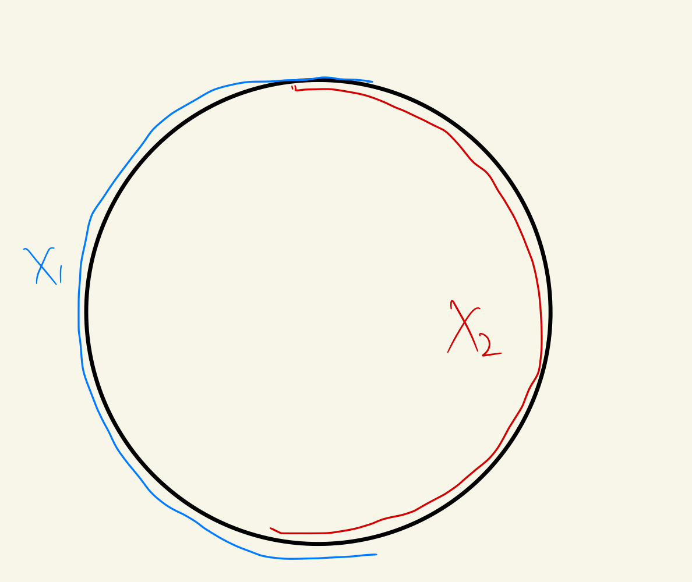

# Notations
	- If $A$ is a subspace of $X$, then $\bar{A}$ denotes its closure and $A^{\circ}$ denotes its interior.
-
- # Definitions
  card-last-interval:: 31.26
  card-repeats:: 1
  card-ease-factor:: 2.6
  card-next-schedule:: 2023-07-28T06:43:35.570Z
  card-last-reviewed:: 2023-06-27T00:43:35.570Z
  card-last-score:: 5
  collapsed:: true
	- Excision #card
	  collapsed:: true
		- Geometric intuition
			- ((6498e0fe-d925-45b8-8532-f90ed5c95f32)) means 'identifying a subspace as a single point'.
			- Therefore we expect that we could **remove some part of the subspace** without affecting the space after identification!
		- Version I
			- Assume that $U \subset A \subset X$ are subspaces with $\bar{U} \subset A^{\circ}$.
			- The inclusion $i:(X-U, A-U) \hookrightarrow(X, A)$ induces **isomorphisms**
			  $$
			  i_*: H_n(X-U, A-U) \stackrel{\sim}{\rightarrow} H_n(X, A)
			  $$
			  for all $n$.
		- Version II
			- Let $X_1$ and $X_2$ be subspaces of $X$ with $X=X_1^{\circ} \cup X_2^{\circ}$.
			- The inclusion $j:\left(X_1, X_1 \cap X_2\right) \hookrightarrow\left(X_1 \cup X_2, X_2\right)=\left(X, X_2\right)$ induces isomorphisms
			  $$
			  j_*: H_n\left(X_1, X_1 \cap X_2\right) \stackrel{\sim}{\rightarrow} {H_n}\left(X, X_2\right)
			  $$
			  for all $n$.
		- ((649940c8-ab08-4e88-ba1d-4dd7ac323e7f)) Version I of excision is equivalent to version II.
		  collapsed:: true
			- I -> II
			  collapsed:: true
				- Obviously we should take $U=X_2-X_1$, which is the part to be removed.
				  We should prove $\overline{(X_2 - X_1)} \sub X_2 ^ \circ$.
				- Proposition. $X-X_1^\circ$ contains $\overline{(X_2 - X_1)}$.
					- $\overline{(X_2 - X_1)}$ is the intersection of all closed sets containing $X_2-X_1$.
					- $X-X_1^\circ$ is a closed set containing $X_2-X_1$.
					- *When feeling stuck at simple topology, convert everything to basic set theory, e.g. 'intersection' ->* $x \in A, x \in B$
				- Proposition. $X-X_1^\circ \sub X_2^\circ$.
					- Directly follows $X=X_1^\circ \cup X_2^\circ$.
			- II -> I
				- Take $X_2=A,X_1=X-U$.
				  We should prove $X=X_1^{\circ} \cup X_2^{\circ}$.
				- Note that $(X-U)^\circ = X-\bar U$.
			-
	- Barycentric division #card
	  collapsed:: true
	  card-last-interval:: 31.26
	  card-repeats:: 1
	  card-ease-factor:: 2.6
	  card-next-schedule:: 2023-08-27T19:25:43.034Z
	  card-last-reviewed:: 2023-07-27T13:25:43.034Z
	  card-last-score:: 5
		- Idea
			- We wish to divide a simplex repeatedly to 'arbitrarily small'.
			- Then we could apply [[The Lebesgue number lemma]].
			- Note that it is not the only way, but the **inductive construction** is always the simplest! #Strategy
		- ((64ab1a09-5b3b-4278-9f5e-6b364634c78c)) The barycentric subdivision of an affine $n$-simplex $\Sigma^n$, denoted by $\operatorname{Sd} \Sigma^n$, is a family of affine $n$-simplexes defined inductively for $n \geq 0$ :
		  (i) $\operatorname{Sd} \Sigma^0=\Sigma^0$;
		  (ii) if $\varphi_0, \varphi_1, \ldots, \varphi_{n+1}$ are the $n$-faces of $\Sigma^{n+1}$ and if $b$ is the barycenter of $\Sigma^{n+1}$, then Sd $\Sigma^{n+1}$ consists of all the $(n+1)$-simplexes spanned by $b$ and $n$-simplexes in $\operatorname{Sd} \varphi_i, i=0, \ldots, n+1$.
		- ((64ab1a5b-d15c-449d-89ff-ae0c8100a239))
			-
	- Degree of a continuous map $f$ : $S^n \rightarrow S^n$ #card
	  card-last-interval:: 32.57
	  card-repeats:: 1
	  card-ease-factor:: 2.6
	  card-next-schedule:: 2023-09-12T01:25:10.313Z
	  card-last-reviewed:: 2023-08-10T12:25:10.313Z
	  card-last-score:: 5
		- Definition. A continuous map $f$ : $S^n \rightarrow S^n$ (where $n>0$ ) has degree $m$, denoted by $d(f)=m$, if $f_*: H_n\left(S^n\right) \rightarrow H_n\left(S^n\right)$ is multiplication by $m$.
- # Proof
  collapsed:: true
	- Lemma 6.11. Let $X_1$ and $X_2$ be subspaces of $X$. If the inclusion $S_*\left(X_1\right)+$ $S_*\left(X_2\right) \hookrightarrow S_*(X)$ induces isomorphisms in homology, then excision holds for the subspaces $X_1$ and $X_2$ of $X$. #card
	  card-last-interval:: 31.21
	  card-repeats:: 1
	  card-ease-factor:: 2.6
	  card-next-schedule:: 2023-08-13T18:38:22.677Z
	  card-last-reviewed:: 2023-07-13T13:38:22.678Z
	  card-last-score:: 5
		- How was the proof motivated?
		  background-color:: red
			- Seems the proof is directly motivated by the ((649e4af5-3e8a-4202-831b-2ad858b4b337)) and manipulating compositions of isomorphisms...
				- To be more specific, we notice we could invoke the second isomorphism theorem to deal with the quotient.
			- In other words, is the observation very important?
			  We couldn't proceed without the observation?
				- Indeed observations, especially very stupid ones, are very important. #[[Observations/Math and Physics]]
				  background-color:: yellow
				- In this case the observation is ((649e49f0-6cef-4631-bb01-027b94b5422c)), which is quite stupid.
		- *Remark: When dealing with groups, isomorphism theorems could be extremely useful.*
		- First construct an exact sequence:
		  collapsed:: true
		  $$
		  0 \rightarrow S_*\left(X_1\right)+S_*\left(X_2\right) \stackrel{i}{\rightarrow} S_*(X) \rightarrow S_*(X) /\left(S_*\left(X_1\right)+S_*\left(X_2\right)\right) \rightarrow 0
		  $$
			- Since $i$ is an isomorphism, the corresponding long exact sequence has every third term zero, i.e.
			  $$
			  H_n\left(S_*(X) /\left(S_*\left(X_1\right)+S_*\left(X_2\right)\right)\right)=0
			  $$
		- Then construct the second exact sequence, motivated by the third isomorphism theorem:
		  collapsed:: true
		  $$
		  0 \rightarrow \frac{S_*\left(X_1\right)+S_*\left(X_2\right)}{S_*\left(X_2\right)} \stackrel{j}{\rightarrow} \frac{S_*(X)}{S_*\left(X_2\right)} \rightarrow \frac{S_*(X)}{S_*\left(X_1\right)+S_*\left(X_2\right)} \rightarrow 0
		  $$
			- Consider the corresponding long exact sequence.
			- We know every third term is zero, thus $j$ induces isomorphisms.
		- Finally we make a beautiful construction:
		  ((649e4a3e-67e0-4327-9819-262437a3b1c8))
			- It's easy to verify $\mathcal l$ is an isomorphism since ((649e49f0-6cef-4631-bb01-027b94b5422c))
			- Since both $l$ is itself an isomorphism and $j$ induces isomorphisms between homology groups, it follows that $k$ induces isomorphisms between homology groups.
			  The proof finishes.
		-
	- The whole proof is quite lengthy, but the key ideas are quite simple (I could even come up with them myself!).
	  collapsed:: true
		- First, $\Delta^n$ is compact, therefore [[The Lebesgue number lemma]] says the 'minimum containing property' of the inverse images of $X_1^\circ \cap \sigma(\Delta^n)$ and $X_2^\circ \cap \sigma(\Delta^n)$.
		- Next we could use Barycentric division to divide the simplexes repeatedly, until each is smaller than the Lebesgue number and could be contained in a single piece.
		- Since the Barycentric division doesn't change the properties of boundaries (as the extra faces cancel each other), we're done.
- # Important Facts
	- Lemma (Barratt-Whitehead). Consider the commutative diagram
	  id:: 649955ae-5920-4aa5-8d1d-f5a3171d430c
	  card-last-interval:: 31.21
	  card-repeats:: 1
	  card-ease-factor:: 2.6
	  card-next-schedule:: 2023-08-13T18:42:15.696Z
	  card-last-reviewed:: 2023-07-13T13:42:15.697Z
	  card-last-score:: 5
	  collapsed:: true
	  ((649955c6-e5a3-4cad-9648-224497609a54))
	  in which every third vertical map $h_n$ is an **isomorphism**. Then there is an exact sequence
	  $$
	  \cdots \longrightarrow A_n \stackrel{\left(i_n, f_n\right)}{\longrightarrow} B_n \oplus A_n^{\prime} \stackrel{g_n-j_n}{\longrightarrow} B_n^{\prime} \stackrel{d_n h_n^{-1} q_n}{\longrightarrow} A_{n-1} \longrightarrow \cdots
	  $$ #card
		- The proof is a regular diagram chasing,
		  but I still don't understand how could they spot such theorems...
		- $\operatorname{Im}(i_n,f_n)$ and $\operatorname{Ker}(g_n-j_n)$
		  collapsed:: true
			- $\operatorname{Im}(i_n,f_n) \sub \operatorname{Ker}(g_n-j_n)$ is manifest from commutativity.
			- The reverse inclusion needs more manipulation.
			- To prove for $i_n$:
				- $\operatorname{Im}i_n=\operatorname{Ker}p_n$, thus we should prove $p_n(x)=0$
				- $$h_n p_n(x)=q_n g_n(x)=q_n j_n(y)=0$$
				  which finishes the proof.
			- To prove for $f_n$:
				- First note $j_n f_n(a)=g_n i_n(a)$, therefore
				  $$z \equiv f_n(a)-y \in \operatorname{Ker}j_n$$
				- We can further use commutativity on the left square to show that $z \in \operatorname{Im} f_n d_{n+1}$.
				- Therefore we can add $d_{n+1}(c)$ to compensate for $z$ without affecting $x$.
		- $\operatorname{Im}(g_n-j_n)$ and $\operatorname{Ker}(d_n h_n^{-1}q_n)$
		  collapsed:: true
			- $\operatorname{Im}(g_n-j_n) \sub \operatorname{Ker}(d_n h_n^{-1}q_n)$
				- First note that $\operatorname{Im}(g_n-j_n)=\operatorname{Im}g_n \oplus \operatorname{Im}j_n$ due to the structure of abelian groups, therefore we should actually prove $\operatorname{Im}g_n \sub \operatorname{Ker}(d_n h_n^{-1}q_n)$ and $\operatorname{Im}j_n \sub \operatorname{Ker}(d_n h_n^{-1}q_n)$.
				- This is manifest due to the complexness (not using exactness) of top and lower rows.
			- Reverse inclusion
				- $d_n h_n^{-1} q_n(x)=0$ <-> $q_n h_n^{-1}(x) \in \operatorname{Im}p_n$ <-> $q_n(x) \in  \operatorname{Im}(h_n p_n)$
				- For $q_n(x)=h_np_n(a)$:
				  $$x \in g_n(a)+ \operatorname{Ker}q_n=g_n(a)+ \operatorname{Im}j_n$$
				  which finishes the proof.
		- $\operatorname{Im}(d_n h_n^{-1}q_n)$ and $\operatorname{Ker}(i_{n-1},f_{n-1})$
			- $\operatorname{Im}(d_n h_n^{-1}q_n) \sub \operatorname{Ker}(i_{n-1},f_{n-1})$ is manifest.
			- The reverse inclusion:
				- First note that $\operatorname{Ker}i_{n-1}=\operatorname{Im}d_n$.
				- Now consider $\operatorname{Ker}f_{n-1}$.
				  $f_{n-1}d_n(x)=0$ <-> $\Delta_n h_n(x)=0$ <-> $h_n(x) \in \operatorname{Im}q_n$.
	- ((649b9b72-174d-40b4-bcff-9f48f3b1e56b)) (Mayer-Vietoris). If $X_1, X_2$ are subspaces of $X$ with $X=$ $X_1^{\circ} \cup X_2^{\circ}$, then there is an exact sequence
	  collapsed:: true
	  card-last-interval:: 31.26
	  card-repeats:: 1
	  card-ease-factor:: 2.6
	  card-next-schedule:: 2023-08-14T19:15:29.781Z
	  card-last-reviewed:: 2023-07-14T13:15:29.782Z
	  card-last-score:: 5
	  $$
	  \cdots \longrightarrow H_n\left(X_1 \cap X_2\right) \stackrel{\left(i_{1 *}, i_{2 *}\right)}{\longrightarrow} H_n\left(X_1\right) \oplus H_n\left(X_2\right) \stackrel{g_*-j_*}{\longrightarrow} H_n(X) \stackrel{D}{\longrightarrow} H_{n-1}\left(X_1 \cap X_2\right) \longrightarrow \cdots,
	  $$
	  with $i_1, i_2, g, j$ inclusions and $D=d h_*^{-1} q_*$, where $h, q$ are inclusions and $d$ is the connecting homomorphism of the pair $\left(X_1, X_1 \cap X_2\right)$. #card
		- The proof is not hard, just using excision, the above [lemma](((649955ae-5920-4aa5-8d1d-f5a3171d430c))) and [naturality of the connecting homomorphism](((647e8f80-4fe7-4abf-9afb-b68d9132f3db))) together.
		- However it's obvious the theorem is powerful.
		  It's the analog of the [[Seifert-van Kampen Theorem]], which allows to construct the group of the whole space from its 'parts'.
			- Seifert-van Kampen Theorem can be rephrased by the short exact sequence:
			  $$0 \rightarrow \pi_1(X_1 \cap X_2)  \stackrel{i}{\rightarrow} \pi_1(X_1) * \pi_1(X_2) \stackrel{p}{\rightarrow}  \pi_1(X) \stackrel{}{\rightarrow} 0$$
			- Strategy: ((649b9c9e-6796-4991-9241-b012ae76ccee))
		- Example. Homology groups of $S^1$
		  id:: 649b9cbd-4a34-42d6-bcc4-97f1a0f91445
			-
			- Divide $S^1$ into two subspaces:
			  {:height 232, :width 211}
				- Note that both are contractible, so
				  $H_n(X_1)=0$ for $n \geq 1$, $H_n(X_1)=\mathbb Z$ for $n = 0$
			- For $n>1$, we have the sequence
			  $$0 \rightarrow H_n(S^1) \rightarrow 0$$,
			  thus $H_n(S^1)=0$.
			- For $n=1$:
				- $$
				  0 \rightarrow H_1(S^1) \stackrel{D}{\longrightarrow} H_0\left(X_1 \cap X_2\right) \stackrel{\left(i_{1 *}, i_{2 *}\right)}{\longrightarrow} H_0\left(X_1\right) \oplus H_0\left(X_2\right) \stackrel{g_*-j_*}{\longrightarrow} H_0(X) \stackrel{D}{\longrightarrow} 0
				  $$
				- The sequence can be rewritten:
				  $$
				  0 \rightarrow H_1(S^1) \stackrel{D}{\longrightarrow} Z \oplus Z \stackrel{\left(i_{1 *}, i_{2 *}\right)}{\longrightarrow} Z \oplus Z \stackrel{g_*-j_*}{\longrightarrow} Z\stackrel{D}{\longrightarrow} 0
				  $$
				- $$
				  0 \rightarrow H_1(S^1) \stackrel{D}{\longrightarrow} Z \oplus Z \stackrel{\begin{array}{l}Im=Z\\Ker=Z\end{array}}{\longrightarrow} Z \oplus Z \stackrel{ \begin{array}{l}Im=Z\\Ker=Z\end{array}}{\longrightarrow }Z\stackrel{\begin{array}{l}Im=0\\Ker=Z\end{array}}{\longrightarrow} 0
				  $$
					- Note that we must examine the details of maps like $(i_{1*},i_{2*})$, since we cannot obtain $\operatorname{Ker}$ from $\operatorname{Im}$.
					  background-color:: red
					  For example, $Z / Z_n \simeq Z$ for arbitrary $n$.
				- Obviously $H_1(S^1)=\operatorname{Im}D=Z$.
			-
	- ((649cef7f-3587-45f0-af4b-ec8471ef0d5d)) (Mayer-Vietoris Theorem for Reduced Homology). If $X_1, X_2$ are subspaces of $X$ with $X=X_1^{\circ} \cup X_2^{\circ}$ and $X_1 \cap X_2 \neq \varnothing$, then there is an exact sequence
	  card-last-interval:: 29.95
	  card-repeats:: 1
	  card-ease-factor:: 2.6
	  card-next-schedule:: 2023-08-11T11:51:17.923Z
	  card-last-reviewed:: 2023-07-12T13:51:17.923Z
	  card-last-score:: 5
	  $$
	  \cdots \rightarrow \widetilde{H}_n\left(X_1 \cap X_2\right) \rightarrow \widetilde{H}_n\left(X_1\right) \oplus \widetilde{H}_n\left(X_2\right) \rightarrow \widetilde{H}_n(X) \rightarrow \widetilde{H}_{n-1}\left(X_1 \cap X_2\right) \rightarrow \cdots
	  $$
	  with induced maps as in Theorem 6.3. This sequence ends
	  $$
	  \cdots \rightarrow \widetilde{H}_0\left(X_1\right) \oplus \widetilde{H}_0\left(X_2\right) \rightarrow \widetilde{H}_0(X) \rightarrow 0
	  $$ #card
		- The key ideas are all the same: Use excision to obtain the isomorphisms, naturality of connecting homomorphisms, Barrett-Whitehead.
		- The only additional subtlety is at $n=0$, where we should verify the embedding map is indeed an isomorphism.
			- Note that $\tilde S_{-1}(X,A)=0$, thus $\tilde H_0(X,A)=H_0(X,A)$.
			-
		- i.e. **Reduced homology doesn't affect relative homology.**
- # Applications
  collapsed:: true
	- ((649cf085-8b8d-44f2-b4ef-e754b39ba39e)). (Homology of Spheres) Let $S^n$ be the $n$-sphere, where $n \geq 0$. Then
	  collapsed:: true
	  card-last-interval:: 31.26
	  card-repeats:: 1
	  card-ease-factor:: 2.6
	  card-next-schedule:: 2023-08-28T18:48:31.221Z
	  card-last-reviewed:: 2023-07-28T12:48:31.222Z
	  card-last-score:: 5
	  $$
	  \widetilde{H}_p\left(S^n\right)= \begin{cases}\mathbf{Z} & \text { if } p=n \\ 0 & \text { if } p \neq n\end{cases}
	  $$ #card
		- Intuition
			- On $S^n$ there is only one 'whole', i.e. the interior of the sphere.
		- $n=0$ is trivial.
		- $n \geq 1$:
		  collapsed:: true
			- Separate $S^n$ into two charts (as if giving it the simplest smooth structure).
			- $X_1$, $X_2$ are both contractible, while $X_1 \cap X_2 \simeq S^{n-1}$.
			  collapsed:: true
				- Note that for contractible spaces, $\tilde H_n(X)=0$.
			- Therefore we can rewrite the exact sequence
			  $$
			  \cdots \rightarrow \widetilde{H}_n\left(X_1 \cap X_2\right) \rightarrow \widetilde{H}_n\left(X_1\right) \oplus \widetilde{H}_n\left(X_2\right) \rightarrow \widetilde{H}_n(X) \rightarrow \widetilde{H}_{n-1}\left(X_1 \cap X_2\right) \rightarrow \cdots
			  $$into
			  $$
			  \cdots \rightarrow \widetilde{H}_p (S^{n-1}) \rightarrow 0 \rightarrow \widetilde{H}_p(S^n) \rightarrow \widetilde{H}_{p-1}(S^{n-1}) \rightarrow 0 \rightarrow \cdots
			  $$
			  which finishes the proof by induction.
		- #+BEGIN_NOTE
		  Again the value of the reduced homology is illustrated.
		  Without it we have to treat $n=0$ and $n \geq 1$ separately!
		  #+END_NOTE
		- Corollary. $S^n$ isn't contractible.
		- Corollary. $\mathbb R^m$ isn't homeomorphic to $\mathbb R^n$ when $m \neq n$.
		-
	- Lemma 6.21. Let $f, g: S^n \rightarrow S^n$ be continuous maps.
	  card-last-interval:: 31.26
	  card-repeats:: 1
	  card-ease-factor:: 2.6
	  card-next-schedule:: 2023-08-26T18:39:57.936Z
	  card-last-reviewed:: 2023-07-26T12:39:57.936Z
	  card-last-score:: 5
	  (i) $d(g \circ f)=d(g) d(f)$.
	  (ii) $d\left(1_{S^n}\right)=1$.
	  (iii) If $f$ is constant, then $d(f)=0$.
	  (iv) If $f \simeq g$, then $d(f)=d(g)$.
	  (v) If $f$ is a homotopy equivalence, then $d(f)= \pm 1$. #card
		- (i) and (ii) roughly states that 'd is a homomorphism'.
	- ((64aebc8f-0c64-4254-8e23-9ab108975547)). If $n \geq 1$, then the antipodal map $a^n: S^n \rightarrow S^n$ has degree $(-1)^{n+1}$. #card
	  id:: 64aebc70-fcef-45e1-b9d1-2f81749bb8c4
	  card-last-interval:: 31.26
	  card-repeats:: 1
	  card-ease-factor:: 2.36
	  card-next-schedule:: 2023-09-16T18:28:23.887Z
	  card-last-reviewed:: 2023-08-16T12:28:23.887Z
	  card-last-score:: 3
		- Definition. If $x=\left(x_1, \ldots, x_{n+1}\right) \in S^n$, its antipode is $-x=\left(-x_1, \ldots,-x_{n+1}\right)$. The antipodal map $a=a^n: S^n \rightarrow S^n$ is defined by $x \mapsto-x$.
		-