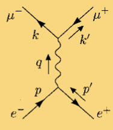

- [[Yukawa theory]]
	- ((6379dcb3-beeb-43b4-9493-b45ef5cd5a9e)) for fermions and scalar fields
	  Note that external vertices don't give propagators
		- **Be careful of the minuses signs from Dirac fields!**
			- We must always put $\psi$ to the left of $\bar\psi$ for contraction.
		- ((6371952e-6a1d-4710-922b-873f0ecb5a61))
- [[QED]]
	- The rules for [[Dirac Theory]] is the same as [[Yukawa theory]]
	- ((63690a30-2ec2-456c-8d26-36588ea1e151))
		- Note that different spins can contract at a vertice. i.e. The 4 spins can be arbitrary in 
			- ((636a2486-1a33-45bf-9f26-91aa8f415e4c)), but **not** in relativistic ones.
		- Explanations
			- The last two rules obviously come from contractions of photon fields.
			- ((636a070e-b5b1-45b9-97d6-bd27c976f7fe))
			-
		- Shall the momenta in the last two lines be reversed? #Inbox/Problem
		- Why the form of the photon propagator? It seems to include unphysical polarizations? #Inbox/Problem
		  id:: 63c14165-4924-45e7-8b59-17ba4ac6b993
			- For diagrams without loops it's easy to solve. Different polarizations are orthogonal, so the photons coming in and out a vertex must have the same polarization.
			- For loops it seems problematic.
		- Why can the gamma matrices between [[Dirac Theory]] operators be separated? #Inbox/Problem
			- ((636a07b6-4d1f-4b45-a296-0724e701e26c))
			  Possibly helpful.
			- Similarly: for the contraction of [[Dirac Theory]]s between inner vertices, the gamma-matrices appear between $\not p+m$
			-
			-
		- Try some diagrams as an example! eg. 1st-order expansion