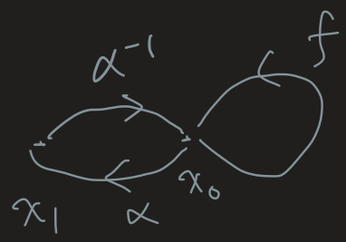
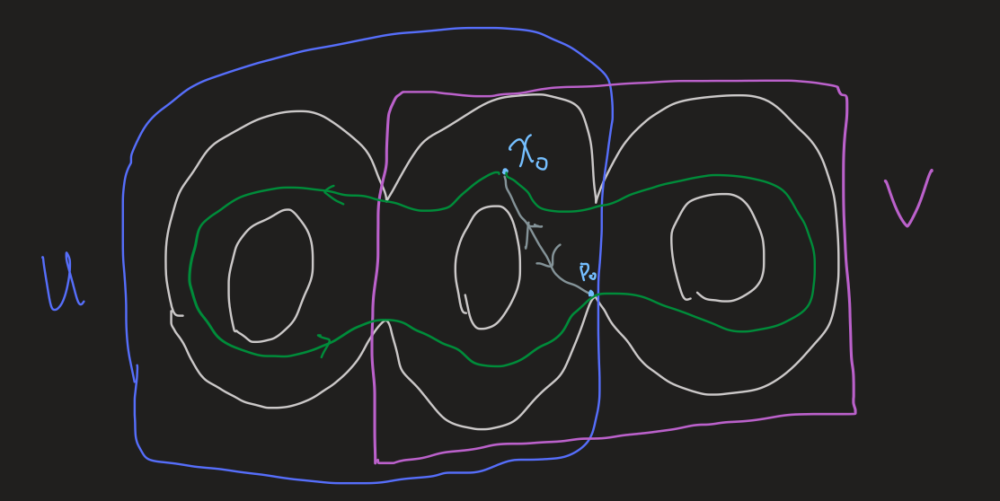

- Def
	- ((64360141-2ae9-4f2c-ab49-2795b00975ed)) If $f$ is a path in $X$ from $x_0$ to $x_1$, and if $g$ is a path in $X$ from $x_1$ to $x_2$, we define the product $f * g$ of $f$ and $g$ to be the path $h$ given by the equations
	  $$
	  h(s)= \begin{cases}f(2 s) & \text { for } s \in\left[0, \frac{1}{2}\right] \\ g(2 s-1) & \text { for } s \in\left[\frac{1}{2}, 1\right]\end{cases}
	  $$
		- Intuitively, pasting the two paths together
	- ((643600f7-e2b0-439a-9176-d82771ec332c)) Let $X$ be a space; let $x_0$ be a point of $X$. The set of path homotopy **classes** of loops based at $x_0$, with the operation $*$, is called the fundamental group of $X$ relative to the base point $x_0$. It is denoted by $\pi_1\left(X, x_0\right)$.
		- It's interesting that equivalence classes can be so useful.
		- Sometimes called first [[Homotopy group]]
- Summary #card
  card-last-interval:: 84
  card-repeats:: 3
  card-ease-factor:: 2.8
  card-next-schedule:: 2023-07-07T11:39:46.354Z
  card-last-reviewed:: 2023-04-14T11:39:46.355Z
  card-last-score:: 5
	- **Note:** This kind of cards enable me to have better sense of what I've learned.
	- Def
		- Equivalence classes of loops, equipped with a product
	- Applications
- Hat-map
  collapsed:: true
	- Theorem. The map $\hat \alpha$ is a group isomorphism. #card
	  card-last-score:: 5
	  card-repeats:: 2
	  card-next-schedule:: 2023-03-27T00:28:03.312Z
	  card-last-interval:: 24
	  card-ease-factor:: 2.46
	  card-last-reviewed:: 2023-03-03T00:28:03.312Z
		- ((643600b1-2ddd-4089-9501-4599bb8a9e15))
			- Let $\alpha$ be a path in $X$ from $x_0$ to $x_1$. We define a map
			  $$
			  \hat{\alpha}: \pi_1\left(X, x_0\right) \longrightarrow \pi_1\left(X, x_1\right)
			  $$
			  by the equation
			  $$
			  \hat{\alpha}([f])=[\bar{\alpha}] *[f] *[\alpha]
			  $$
			-
		- {:height 275, :width 382}
		- This hints that the fundamental group doesn't depend on the points (on the same path component of X).
		  Moreover, $$\pi_1(C,x_0)=\pi_1(X,x_0)$$
		- Different path components are actually different 'objects'.
		- ((6370ad13-5e39-4c81-b39b-544b7be66b09))
	-
	-
-
- The fundamental group is a [[Topological invariant]] #card
  card-last-interval:: 67.2
  card-repeats:: 3
  card-ease-factor:: 2.8
  card-next-schedule:: 2023-05-28T07:16:56.504Z
  card-last-reviewed:: 2023-03-22T03:16:56.509Z
  card-last-score:: 5
  collapsed:: true
	- Homomorphism induced by a continuous map
		- Definition. Let $h .\left(X, x_0\right) \rightarrow\left(Y, y_0\right)$ be a continuous map. Define
		  $$
		  h_* : \pi_1\left(X, x_0\right) \longrightarrow \pi_1\left(Y, y_0\right)
		  $$
		  by $h_*([f])=[h \circ f]$
		- Note that $$h_*$$ doesn't depend on the representation element. #Exercise
		- Moreover, $$h_*$$ is a group homomorphism. #Exercise
	- If h is a homeomorphism, then $$h_*$$ is a group isomorphism.
- $\pi_1\left(X \times Y, x_0 \times y_0\right)$ is isomorphic with $\pi_1\left(X, x_0\right) \times \pi_1\left(Y, y_0\right)$ #card
  card-last-interval:: 84
  card-repeats:: 3
  card-ease-factor:: 2.8
  card-next-schedule:: 2023-07-05T11:37:52.595Z
  card-last-reviewed:: 2023-04-12T11:37:52.595Z
  card-last-score:: 5
  collapsed:: true
	- This is very intuitive. Path in $X\times Y$ <-> product of path in $X$ and path in $Y$.
	- Corollary. Since $T^2=S^1 \times S^1$, $\pi_1(T^2)=\mathbb Z \times \mathbb Z$
-
	- ((63a7ba49-e539-495b-a981-0f27d65e5201)) Suppose $X=U \cup V$, where $U$ and $V$ are open sets of $X$. Suppose that $U \cap V$ is path connected, and that $x_0 \in U \cap V$. Let $i$ and $j$ be the inclusion mappings of $U$ and $V$, respectively, into $X$. Then the images of the induced homomorphisms $i_*: \pi_1\left(U, x_0\right) \rightarrow \pi_1\left(X, x_0\right) \quad \text { and } \quad j_*: \pi_1\left(V, x_0\right) \rightarrow \pi_1\left(X, x_0\right)$ **generate** $\pi_1\left(X, x_0\right)$. #card
	  id:: 63b186e0-b1f4-4b2d-9772-895775842ded
	  card-last-interval:: 26.06
	  card-repeats:: 1
	  card-ease-factor:: 2.6
	  card-next-schedule:: 2023-02-07T14:28:13.680Z
	  card-last-reviewed:: 2023-01-12T13:28:13.680Z
	  card-last-score:: 5
	  collapsed:: true
		- **This would be used to prove that** ((63a7be70-1a63-4e7e-932f-66d5791e4a09)).
		- Intuition
			- {:height 222, :width 426}
			- We may select a 'middle point' $p_0\in U \cap V$ and find a path connecting $x_0$ and $p_0$ (which must exist by assumption). Then the path is obtained by concatenating the U-part and the V-part.
			- For a loop going into U and V many times, we may cut it into many sections.
			- **It is correct! The official proof exactly expresses what I said!** Just more elegant and well-formulated.
		- Technical details
			- Step 1. We show there is a subdivision $a_0<a_1<\cdots<a_n$ of the unit interval such that $f\left(a_i\right) \in U \cap V$ and $f\left(\left[a_{i-1}, a_i\right]\right)$ is contained either in $U$ or in $V$, for each $i$.
				- To show the existence, use [[The Lebesgue number lemma]] to construct some closed intervals contained completely in U or V.
-
- Examples
	- The circle
		- $\pi_1(S^1)=\mathbb Z$ #card
		  card-last-interval:: 24
		  card-repeats:: 2
		  card-ease-factor:: 2.7
		  card-next-schedule:: 2023-03-29T11:16:58.383Z
		  card-last-reviewed:: 2023-03-05T11:16:58.384Z
		  card-last-score:: 5
			- By the [Theorem](((638c0f2d-33eb-4634-9467-e083bf50506d))), we may select a simply connected covering space. Here we choose R and covers $S^1$ in the usual way.
			- Let $e_0=0$. Now it's easy to see that the lifting correspondence $\phi$ is a group homomorphism.
	- $S^n$
		- If $n \geq 2$, the $n$-sphere $S^n$ is simply connected.
		  id:: 63a7be70-1a63-4e7e-932f-66d5791e4a09
			- The punctured sphere is homeomorphic to $\mathbb R^n$.
			- A sphere is the union of the north punctured sphere and the south.
				- They're both open.
				- The intersection is path-connected.
		-
	- [[Surface]]
		- Def
			- A 2-dimensional [[Manifold]].
	- The [[Projective Space]]
	  collapsed:: true
		- Theorem 60.3. The projective plane $P^2$ is a compact surface, and the quotient map $p: S^2 \rightarrow P^2$ is a covering map.
			- Corollary. $\pi_1\left(P^2, y\right)$ is a group of order 2 #card
			  card-last-interval:: 25.01
			  card-repeats:: 1
			  card-ease-factor:: 2.6
			  card-next-schedule:: 2023-01-21T06:18:48.949Z
			  card-last-reviewed:: 2022-12-27T06:18:48.949Z
			  card-last-score:: 5
				- ((638c0f2d-33eb-4634-9467-e083bf50506d))
				- $S^2$ is simply connected.
				-
				- This may be generalized to any $P^n$; the fundamental group is always $Z_2$.
	- The [[Double Torus]]
		- ((63a7c45c-fdbe-4da3-9b18-1ee279e2d9c4)) The fundamental group is nonabelian.
			- First note that it retracts to [[The Figure Eight]], which has a nonabelian fundamental group.