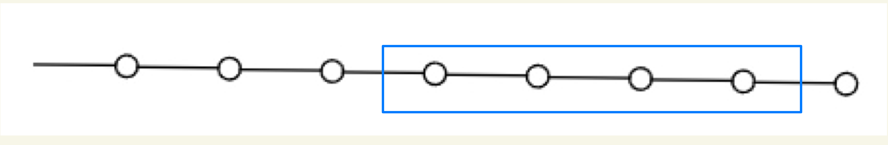

# Definitions
card-last-score:: 5
card-repeats:: 3
card-next-schedule:: 2023-04-23T05:57:22.315Z
card-last-interval:: 67.2
card-ease-factor:: 2.8
card-last-reviewed:: 2023-02-15T01:57:22.315Z
collapsed:: true
	- Gapped quantum systems #card
	  collapsed:: true
	  card-last-interval:: 35.37
	  card-repeats:: 1
	  card-ease-factor:: 2.6
	  card-next-schedule:: 2023-09-11T21:00:31.414Z
	  card-last-reviewed:: 2023-08-07T13:00:31.415Z
	  card-last-score:: 5
		- ((63719ab5-7a5c-4b72-a079-dcad37b6053a))
		- Question: There should be a sort of **arbitrariness** in choosing specific sizes and details of the lattices in the sequence.
			- Sometimes even the number of sites is even or odd is crucial.
			- This is unphysical.
		- How arbitrary should they be allowed to be?
	- Equivalence of gapped quantum systems #card
	  collapsed:: true
	  card-last-interval:: 42
	  card-repeats:: 2
	  card-ease-factor:: 2.7
	  card-next-schedule:: 2023-12-28T00:51:14.074Z
	  card-last-reviewed:: 2023-11-16T00:51:14.075Z
	  card-last-score:: 5
		- Two gapped quantum systems $\left\{H_{N_k}\right\}$ and $\left\{H_{N_k}^{\prime}\right\}$ are equivalent if the ground-state spaces of $H_{N_k}$ and $H_{N_k}^{\prime}$ are connected by LU transformations for all $N_k$.
		- The equivalence classes of the above equivalence relation are the **gapped quantum phases**.
		- ((64c54f5f-229e-4bc9-a068-01bbcb24978c))
			- Rather similar to a homomorphism between chain complexes if we have derivative operators...
	- Local Addition Transformation #card
	  collapsed:: true
	  card-last-interval:: 32.51
	  card-repeats:: 1
	  card-ease-factor:: 2.6
	  card-next-schedule:: 2023-09-06T01:11:31.098Z
	  card-last-reviewed:: 2023-08-04T13:11:31.098Z
	  card-last-score:: 5
		- Local addition of d.o.f. : Insert m d.o.f. into the system amd transform the Hamiltonian by 
		  $$H_N \mapsto H_N + \sum_{i=N+1}^{N+m}T_i$$
			- $T_i$ can be an arbitrary single-site Hermitian operator with an non-degenerate spectrum.
			- In the original definition we can only use
			  $$H_N \mapsto H_N + \sum_{i=N+1}^{N+m}Z_i$$
			  which I think puts too rigid a restriction on the spectrum.
			- Note that my definition isn't perfect, either.
	- Local Unitary Transformation (LU) #card
	  collapsed:: true
	  card-last-interval:: 31.26
	  card-repeats:: 1
	  card-ease-factor:: 2.6
	  card-next-schedule:: 2023-10-25T06:52:17.149Z
	  card-last-reviewed:: 2023-09-24T00:52:17.149Z
	  card-last-score:: 5
		- An LU transformation iss given by a finite number of layers (i.e. the number of layers is a constant **independent of  system size**) of piecewise local unitary transformations
		  collapsed:: true
		  $$
		  U_{c i r c}^M=U_{p w l}^{(1)} U_{p w l}^{(2)} \cdots U_{p w l}^{(M)}
		  $$
		  where each layer has a form
		  $$
		  U_{p w l}=\prod_i U^i .
		  $$
			- Here $\left\{U^i\right\}$ is a set of unitary operators that act on non-overlapping regions. The size of each region is less than a finite number $l$ independent of system size.
		- ((64c910db-c231-4d2e-8ff2-fb84e6555588))
		- Question: Could a GHZ state be made a product state with LU?
		  collapsed:: true
			- Intuitively NO. I don't know a rigorous proof, but I can provide an argument below.
			- We can mimic the WFR process of toric code:
			  
				- $|0000\rangle \mapsto |0000\rangle$, $|1111\rangle \mapsto |1000\rangle$
				- In this way three sites are made into product states, but the first site is still LRE.
				- In fact it is a fixed point of WFR.
		-
	- Generalized local unitary transformation (gLU) #card
	  id:: 64c419a3-89b0-4241-8437-9fad3d24822d
	  collapsed:: true
		- Intuition and insights
			- Keep the structure of LRE unchanged.
			- However there are several limitations.
			  background-color:: red
				- The structure of ribbon operators (no single excitation) would be destroyed.
				- The spectrum cannot be significantly modified, i.e. if initially the splitting of ground states $\delta>0$ it cannot tend to zero by gLU.
			- The novelty is that we can change local d.o.f. and even the lattice structure! Quite interesting...
				- Implying some 'global invariant', or some invariant defined on a neighborhood if we have a structure of a manifold?
		- Transformation of the State
			- The set of operations generated by local unitary transformations **plus** adding and removing d.o.f. in product states.
				- To be more specific, we can enlarge the Hilbert space or shrink it ($\rho_A|_{V_A^{sp}}$ is unchanged) and perform unitaries.
		- Transformation of the Hamiltonian
			- Local addition plus local unitaries
				- This is a bit suspicious, since we cannot modify the spectrum by local unitaries.
			-
		- ((64c41935-c220-4764-9b0d-c54ebd4b420b))
		  collapsed:: true
			- In the illustration, some d.o.f. are made into direct-product states by LU, thus safely removed.
			- Also we may apply the reverse process, i.e. add d.o.f. and perform LU.
	- Gapped quantum liquid #card
	  collapsed:: true
	  card-last-interval:: 32.57
	  card-repeats:: 1
	  card-ease-factor:: 2.6
	  card-next-schedule:: 2023-09-17T02:07:24.554Z
	  card-last-reviewed:: 2023-08-15T13:07:24.555Z
	  card-last-score:: 5
		- Intuition
			- This is a refined notion of gapped quantum phases.
			  Refinements are that adjacent
		- A gapped quantum liquid system is a gapped quantum system, described by the sequence $\left\{H_{N_k}\right\}$, with two additional properties:
		- (1) $0<c_1<\left(N_{k+1}-N_k\right) / N_k<c_2$ where $c_1$ and $c_2$ are constants that do not depend on the system size.
		  collapsed:: true
			- The condition wants to capture the intuition that 'adjacent terms do not differ too much'.
			- However, the inequality seems rather awkward, especially the magic numbers $c_1$ and $c_2$.
			  There ought be some expression more elegant and intrinsic
		- (2) the ground-state spaces of $H_{N_k}$ and $H_{N_{k+1}}$ are connected by a generalized local unitary (gLU) transformation **for any local addition**.
		  background-color:: yellow
		  collapsed:: true
			- The LRE properties are the same!
			- Note that the last requirements is rather stringent.
				- It plays an important role in the non-liquid example
				  ((64c559ee-1c24-4f6e-b678-94eacd996782))
				- Intuitively, when there is a domain wall ('inhomogeneity') in the system, the property would cause some interesting effects.
		- ((64c55051-36de-42d6-8795-5f37ef347db3))
	- Equivalence of gapped quantum liquids #card
	  collapsed:: true
	  card-last-interval:: 31.26
	  card-repeats:: 1
	  card-ease-factor:: 2.6
	  card-next-schedule:: 2023-12-02T07:01:17.736Z
	  card-last-reviewed:: 2023-11-01T01:01:17.737Z
	  card-last-score:: 5
		- LU and LA
			- Two gapped quantum liquid systems $\left\{H_{N_k}\right\}$ and $\left\{H_{N_k}^{\prime}\right\}$ are equivalent if the ground-state spaces of $H_{N_k}$ and $H_{N_k}^{\prime}$ are connected by LU transformations for all $N_k$, for a class of LA operations.
			- We don't know precisely which LA are allowed... And the formalism isn't very elegant. Maybe the $\mathbb C^\infty$ formalism?
		- Adiabatic transformation
			- This definition makes the role of topology exlicit.
		-
	- Stable gapped quantum system #card
	  collapsed:: true
	  card-last-interval:: 35.37
	  card-repeats:: 1
	  card-ease-factor:: 2.6
	  card-next-schedule:: 2023-09-11T21:00:15.712Z
	  card-last-reviewed:: 2023-08-07T13:00:15.712Z
	  card-last-score:: 5
		- If the ground-state degeneracy of a gapped quantum system is stable against any local perturbation (in the large $N_k$ limit), then the gapped quantum system is stable.
			- Here the physical intuitions of **perturbation** and **stability** come into play!
				- ((64c55bbd-1979-4b8c-98d2-d67b2ee19ca9))
		- Obviously there ought to be more equivalent definitions **from different viewpoints** (Hamiltonian, structure of entanglement, etc), which are unknown yet.
		- Notes
			- A symmetry breaking system is a gapped quantum liquid, but not stable.
			- A topo order with a single local non-abelian anyon is a stable gapped quantum system, but not a gapped quantum liquid ('inhomogeneous').
- # Corollaries
  collapsed:: true
	- The ground space of stable gapped quantum systems can be quantum error-correcting codes. #card
	  card-last-interval:: 31.26
	  card-repeats:: 1
	  card-ease-factor:: 2.6
	  card-next-schedule:: 2023-09-05T19:07:13.726Z
	  card-last-reviewed:: 2023-08-05T13:07:13.727Z
	  card-last-score:: 5
		- This is to say, for any orthonormal basis $\left\{\left|\Phi_i\right\rangle\right\}$ of the ground-state space, for any local operator $M$, we have
		  $$
		  \left\langle\Phi_i|M| \Phi_j\right\rangle=C_M \delta_{i j}
		  $$
- # Examples
  collapsed:: true
	- Gapped quantum liquid
		- $$H_{N_k}^{\text {trivial-liquid }}=-\sum_{i=1}^{N_k} Z_i$$
		- $$H_{N_k}^{\text {TC}}$$
			- ((64c55a1f-1ec2-4ccf-bb00-96691c4113b1))
			- This is problematic, since in TC we can't have a single excitation, while inserting sites allows single excitations (gLU doesn't alter this property).
	- Non-liquid #card
	  collapsed:: true
	  card-last-interval:: 32.57
	  card-repeats:: 1
	  card-ease-factor:: 2.36
	  card-next-schedule:: 2023-09-10T01:50:53.759Z
	  card-last-reviewed:: 2023-08-08T12:50:53.760Z
	  card-last-score:: 3
		- id:: 64c559ee-1c24-4f6e-b678-94eacd996782
		  collapsed:: true
		  $$
		  H_{N_k}^{\text {non-liquid }}=-\sum_{i=1}^{N_k-1} Z_i
		  $$
			- Why it isn't a liquid?
			  background-color:: pink
			  collapsed:: true
				- Physically, GSD is given by the single isolated qubit, which isn't a thermodynamic-limit property.
				- From the definition:
	- Unstable gapped quantum liquid
	  collapsed:: true
		- The 1D transverse Ising #card
		  card-last-interval:: 33.94
		  card-repeats:: 1
		  card-ease-factor:: 2.6
		  card-next-schedule:: 2023-11-20T22:47:30.700Z
		  card-last-reviewed:: 2023-10-18T00:47:30.700Z
		  card-last-score:: 5
			- $$
			  H_{N_k}^{\mathrm{tIsing}}(B)=-\sum_{i=1}^{N_k} Z_i Z_{i+1}-B \sum_{i=1}^{N_k} X_i
			  $$
			- The gapped ground states are non-degenerate for $B>1$.
			- For $0 \leq B<1$, the gapped ground states are twofold degenerate.
			  collapsed:: true
				- The degeneracy is **unstable** against perturbation that breaks the $\mathbb{Z}_2$ symmetry.
			- Different GSD must correspond to different phases, since they're gLU invariants!
			  background-color:: yellow
			- Consider the case $B=0$ to have lots of more accurate insights.
				- Ground states
					- The (symmetric) exact ground state $\left|\Psi_{N_k}^{+}(B)\right\rangle$ is an adiabatic continuation of the GHZ state
					  $$
					  \left|G H Z_{N_k}^{+}\right\rangle=\frac{1}{\sqrt{2}}\left(|0\rangle^{\otimes N_k}+|1\rangle^{\otimes N_k}\right),
					  $$
					- Another ground state is 
					  $$
					  \left|G H Z_{N_k}^{-}\right\rangle=\frac{1}{\sqrt{2}}\left(|0\rangle^{\otimes N_k}-|1\rangle^{\otimes N_k}\right) .
					  $$
					- However, if any perturbation **breaks the Z_{2} symmetry**, GSD would be broken!
				- [[Projects/Entanglement/Topological Phases]]
					- Note that the GHZ states are not quite long-range entangled. We have different ways to quantify.
					- Finite probability to convert to product state via measurement (under thermodynamic limit)
						- We can apply the single-site measurement $Z_i$. This suffices to select a single configuration (product state).
						- This is not true for, e.g. toric code.
					- Constant depth of entanglement entropy
- # Notes
	- LU seems to be a pretty good tool to capture LRE properties of a **state**.
	- However, gLU seems fall short of capturing properties of the Hamiltonian. It cannot change the spectrum. Most seriously, an added site allows a single excitation, while topological orders do not.
- # The Wavefunction Formalism
	- Could only ground-state wavefunctions grasp all properties of topological phases?
	  background-color:: red
	- Gapped quantum liquid phases
		- Two gapped quantum liquids, given by two sequences of ground-state spaces $\left\{\mathscr{V}_{N_k}\right\}$ and $\left\{\mathscr{V}_{N_k}^{\prime}\right\}$ (on graphs with no boundary), are equivalent if they can be connected via LU transformations.
		- The equivalence classes of gapped quantum liquids are gapped quantum liquid phases.