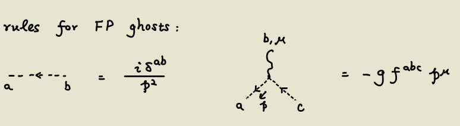

alias:: Gauge Theory

- [What is a gauge? | Teherence Tao](https://terrytao.wordpress.com/2008/09/27/what-is-a-gauge/)
- ((64565059-ba36-4bfd-8fa8-516fa601aab3))
- # Tricky Points
	- Symmetry factor $-1$ of a fermion loop
	- $i\lambda$ or $-i\lambda$? $i(Z-1)$ or $-i(Z-1)$? $ip$ or $-ip$?
		- Origin: We have $\exp{-iHT}$, which means $H_{int}$ becomes $-iH_{int}$.
		- However, $H_{int}=-L_{int}$, which means $L_{int}$ becomes $iL_{int}$.
		- Examples
			- $$-\frac \lambda {4!} \to -i\lambda$$
			- $$(Z_2-1)\bar \psi (i\not D) \psi \to i \not p$$
				- Note that we always draw fermion lines (rather than anti-fermion lines) in propagators, therefore $\not D$ should act on $\hat a e^{-ipx}$ rather then $\hat b^\dagger e^{ipx}$.
	- Power counting could only work for the $p$-independent divergence! $p^2$ terms cannot be obtained in this way; we must calculate the integral step-by-step.
- # Motivations
	- When we try to construct theories like $A^\mu A^\nu \partial_\mu A_\nu$ or $A^4$, we would encounter negative norms.
		- The problem is absent in QED because ((640458fa-7092-47a3-a5db-acb4759ce58a)).
		- This follows from [[Ward-Takahashi Identity]], which in turn follows from **gauge invariance**. #Learning-TODO/Course
		- Thus it's natural to consider other theories with some sorts of gauge invariance.
- # Setup
	- $$g=\exp{\{i\alpha^kT_k\}}$$
		- Here the generators are taken to be Hermitian, so $i$ is added in the factor.
	- $$\left[T^a, T^b\right]=i f^{a b c} T^c$$
		- Structure constants
		-
- # Elements of Lie Algebras
	- $\operatorname{tr}\left[t_r^a t_r^b\right] \equiv D^{a b}$
	- Prop. As long as the generator matrices are Hermitian, the matrix $D^{a b}$ is positive definite. Thus it can be diagonalized and made in the form $\operatorname{tr}\left[t_r^a t_r^b\right]=C(r) \delta^{a b}$ #card
	  card-last-interval:: 31.26
	  card-repeats:: 1
	  card-ease-factor:: 2.6
	  card-next-schedule:: 2023-07-02T07:41:00.085Z
	  card-last-reviewed:: 2023-06-01T01:41:00.087Z
	  card-last-score:: 5
		- Very simple exercise.
		- Abstraction leads to the underlying structure, which points to the path. #[[Thoughts/Math and Physics]]
	- Thus we can select a basis where $D^{ab}=C(r) \delta^{a b}$, then $f^{a b c}=-\frac{i}{C(r)} \operatorname{tr}\left\{\left[t_r^a, t_r^b\right] t_r^c\right\}$
		- It is completely antisymmetric.
	- ## Some reps
		- Fundamental representation for $SU(N)$ #card
		  card-last-interval:: 31.26
		  card-repeats:: 1
		  card-ease-factor:: 2.6
		  card-next-schedule:: 2023-07-02T07:48:04.810Z
		  card-last-reviewed:: 2023-06-01T01:48:04.811Z
		  card-last-score:: 5
			- The set of $N \times N$ unitary matrices with $\det(U)=1$.
			- It is complex, so there's a conjugate rep.
			- Prop. This rep is irreducible.
				-
		- Adjoint representation for any simple Lie Algebra
			- $\left(t_G^b\right)_{a c}=i f^{a b c}$
				- Prop. It is indeed a valid rep. #card
				  card-last-interval:: 30
				  card-repeats:: 2
				  card-ease-factor:: 2.7
				  card-next-schedule:: 2023-07-01T03:29:56.820Z
				  card-last-reviewed:: 2023-06-01T03:29:56.820Z
				  card-last-score:: 5
					- Just use the Jacobi identity to verify the commutation relations.
	- ## The Casimir Operator
		- Def. $T^2:=\sum_a T^a T^a$
			- Quadratic Casimir operator
				- $\sum_a T_r^a T_r^a=C_2(r) \cdot \mathbf{1}$, where r labels the irrep.
		- Prop. It commutes with all generators, thus proportional to identity. #card
		  card-last-interval:: 31.26
		  card-repeats:: 1
		  card-ease-factor:: 2.6
		  card-next-schedule:: 2023-05-05T09:39:51.891Z
		  card-last-reviewed:: 2023-04-04T03:39:51.891Z
		  card-last-score:: 5
			- $C:=\sum_a (T^a)^2$
			- $[C,T^b]=\sum_{ac}((f^{abc}T^c)T^a+T^a(f^{abc}T_c)$
			  Obviously it vanishes by anti-symmetricity.
			- Only holds in the preferred basis, where $f^{abc}$ is completely anti-symmetric.
		- For the adjoint representation, it is written as $f^{a c d} f^{b c d}=C_2(G) \delta^{a b}$
		- card-last-score:: 3
		  card-repeats:: 1
		  card-next-schedule:: 2023-04-27T01:13:50.246Z
		  card-last-interval:: 24
		  card-ease-factor:: 2.36
		  card-last-reviewed:: 2023-04-03T01:13:50.248Z
		- Note that the definition of tensor product representations is 
		  $$\begin{aligned} \rho_1 \otimes \rho_2: \mathfrak{g} & \rightarrow \mathfrak{g l}\left(V_1 \otimes V_2\right), \\ x & \mapsto\left(v_1 \otimes v_2 \mapsto\left(\rho_1(x)\right)\left(v_1\right) \otimes v_2+v_1 \otimes\left(\rho_2(x)\right)\left(v_2\right)\right)\end{aligned}$$
			- I can verify it by universal property of tensor products.
		- Prop. $d(r) C_2(r)=d(G) C(r)$, where $d(r)$ is the dimension of the irrep and $d(G)$ is the dimension of the Lie group. #card
		  card-last-interval:: 30
		  card-repeats:: 2
		  card-ease-factor:: 2.7
		  card-next-schedule:: 2023-07-01T01:59:31.598Z
		  card-last-reviewed:: 2023-06-01T01:59:31.598Z
		  card-last-score:: 5
			- Could be easily proved by taking trace of $\operatorname{tr}\left[T_r^a T_r^b\right]=C(r) \delta^{a b}$
		-
		-
- # General Construction
	- See [here](((64115d22-ffe4-4ee4-8a05-79bbe0f520f2))).
	- ## Def
		- Curvature $F^{\mu\nu}$ #card
			- $$[D_\mu,D_\nu]=(- ig) F_{\mu\nu}=(- i g)\left\{\partial_\mu A_\nu-\partial_\nu A_\mu -( i g )[A_\mu, A_\nu]\right\}$$
			- The last term arises from the fact that the theory is non-abelian.
		- Covariant derivative
			- $D_\mu=\partial_\mu-i g A_\mu$
	- ## Wilson Line
		- $$
		  U_P(z, y)=P\left\{\exp \left[i g \int_0^1 d s \frac{d x^\mu}{d s} A_\mu^a(x(s)) t^a\right]\right\}
		  $$
			- Exercise. Show that it indeed transforms as $U_P\left(z, y, A^V\right)=V(z) U_P(z, y, A) V^{\dagger}(y)$, where $A^V$ is the field after gauge transformation. #card
			  card-last-interval:: 30
			  card-repeats:: 1
			  card-ease-factor:: 2.6
			  card-next-schedule:: 2023-06-16T01:16:14.128Z
			  card-last-reviewed:: 2023-05-17T01:16:14.131Z
			  card-last-score:: 5
				- Hint: ((640ad127-cc23-464b-b796-fb5a07f8049a))
				-
		- Wilson loop #card
		  card-last-interval:: 27.15
		  card-repeats:: 1
		  card-ease-factor:: 2.6
		  card-next-schedule:: 2023-04-16T04:28:29.777Z
		  card-last-reviewed:: 2023-03-20T01:28:29.778Z
		  card-last-score:: 5
			- In the nonabelian case, $U(x,x)$ is not gauge-invariant.
			  So we define $\operatorname{tr} U_P(x, x)$ as the **Wilson loop**.
				-
		- Notes
			- $P$ is the path-ordering operator. It is introduced since different generators might be non-commutative.
				- Later matrices (greater values of the parameter) is on the left side.
			- The quantity is path-dependent (due to the prescence of curvature)
			- If $x=y$ it is called a Wilson loop in the abelian case.
				- Use [[Stokes Theorem]], 
				  $$
				  U_P(y, y):=\exp \left[-i e \oint_P d x^\mu A_\mu(x)\right]=\exp \left[-i \frac{e}{2} \int_{\Sigma} d \sigma^{\mu \nu} F_{\mu \nu}\right]
				  $$
					- That is, the total amount of holonomy is equal to the flux on the surface.
		-
	- ## Transformation Rules #card
		- Spinor field
			- $$\psi \to V(x)\psi$$
		- Wilson line
			- $$U(y,x)\to V(y)U(y,x)V^\dag(x)$$
		- Vector field (Connection)
			- $$A_{\mu } (x)\rightarrow V(x)\left( A_{\mu } (x)+\frac{i}{g} \partial _{\mu }\right) V^{\dagger } (x)$$
				- This can be derived from the transformation rule of the Wilson line.
			- For an infinitesimal gauge transformation:
			  $$
			  A_\mu^{a, \Lambda}(x)=A_\mu^a+f^{a b c} A_\mu^b \Lambda^c+\frac{1}{g} \partial_\mu \Lambda^a
			  $$
		- Covariant derivative
			- $D_\mu=\partial_\mu-i g A_\mu$
		- Expansion by generators
			- $A_\mu := A^a_\mu T_a$
		- Derive transformation rules from the Wilson line $U(y,x)\to V(y)U(y,x)V^\dag(x)$ #card
		  card-last-interval:: 30
		  card-repeats:: 1
		  card-ease-factor:: 2.6
		  card-next-schedule:: 2023-06-15T00:33:59.283Z
		  card-last-reviewed:: 2023-05-16T00:33:59.283Z
		  card-last-score:: 5
			- **Note that all can find analogy in electromagnetism, so check it when feeling unsure about the defs.**
			- The vector field can be derived from $$U_P(z, y)=P\left\{\exp \left[i g \int_0^1 d s \frac{d x^\mu}{d s} A_\mu^a(x(s)) t^a\right]\right\}$$
			- The covariant derivative can be derived by using $U$ as the connection
- # Quantization by Path Integral
	- Idea
		- For path integral of gauge theories, we need to integrate over many equivalent configurations (related by gauge transformations).
		- We hope to fix the gauge degrees of freedom and integrate over the physical ones.
	- Result #card
	  card-last-interval:: 31.26
	  card-repeats:: 1
	  card-ease-factor:: 2.6
	  card-next-schedule:: 2023-07-02T07:54:49.326Z
	  card-last-reviewed:: 2023-06-01T01:54:49.327Z
	  card-last-score:: 5
		- $$
		  Z=\int[D A]\left[D C_a\right]\left[D \bar{C}_a\right] e^{i S_{e f f}[A, C, \bar{C}]}
		  $$
		- $$
		  S_{\text {eff }}=S_{Y M}[A]-\frac{1}{2 \xi} \int d^4 x f_a^2(A)+\int d^4 x d^4 y \ \bar{C}_a(x)\left[\left.\frac{\delta f_a\left[A_\Lambda(x)\right]}{\delta \Lambda_b(y)}\right|_{\Lambda=0}\right] C_b(y)
		  $$
			- Usually $\frac{\delta f_a\left[A_\Lambda(x)\right]}{\delta \Lambda_b(y)}$ involves a delta function $\delta^4(x-y)$ to keep the theory local, i.e. gives a local Lagrangian.
		- In Lorenz gauge:
		  $$\begin{aligned}
		  \mathcal{L} & =\mathcal{L}_{YM} +\mathcal{L}_{gauge-fixing} +\mathcal{L}_{ghost}\\
		  \mathcal{L}_{g-f} \  & =-\frac{1}{2\zeta }\left( \partial ^{\mu } A_{\mu }^{a}\right)^{2}\\
		  \ \mathcal{L}_{ghost} & =\overline{c}^{a}\left( -\partial ^{2} \delta ^{ac} -g\partial ^{\mu } f^{abc} A_{\mu }^{b}\right) c^{c} \equiv \overline{c}^{a}\left( -\partial ^{\mu } D_{\mu }^{ac}\right) c^{c}
		  \end{aligned}$$
	- ## Fix the Gauge and Rewrite the Path Integral
		- Result:
		  $$
		  Z \equiv \int\left[D A_\mu\right] e^{i S[A]} \delta(f(A)) \operatorname{det}\left[\frac{\delta f\left(A_\Lambda\right)}{\delta \Lambda}\right]
		  $$
			- Note that under an infinitesimal gauge transformation,
			  $$
			  \begin{aligned}
			  & A_\mu^{a, \Lambda}(x)=A_\mu^a+f^{a b c} A_\mu^b \Lambda^c+\frac{1}{g} \partial_\mu \Lambda^a \\
			  & f_a\left[A^\Lambda_\mu(x)\right]=f_a\left[A_\mu(x)\right]+\left.\int d^4 y \frac{\delta f_a\left[A_\mu^{\Lambda}(x)\right]}{\delta \Lambda_b(y)}\right|_{\Lambda=0} \Lambda_b(y)
			  \end{aligned}
			  $$
		- Starting point: Consider the path integral
		  $$
		  Z=\int \prod_{a=1}^{\operatorname{dim} G}\left[D A_\mu^a(x)\right] e^{i S\left[A_\mu\right]}
		  $$
		- Gauge-fixing functions
			- To fix the gauge, we introduce a set of gauge-fixing functions
			  $$f_a(A), \quad a=1,...,\operatorname{dim} G$$
				- The gauge is expressed by $f_a(A)=0$
			- Gauge-fixing identity:
			  $$
			  1=\int[d \Lambda] \ \delta\left(f_a\left(A_{\Lambda}\right)\right) \operatorname{det}\left[\frac{\delta f_a\left(A_{\Lambda}(x)\right)}{\delta \Lambda_b(y)}\right]_{\Lambda=0}
			  $$
				- $$
				  [d \Lambda]=\prod_{a, x} d \Lambda_a(x)
				  $$
				  are the generators of gauge transformations (e.g. $\alpha$ in QED)
				- The determinant includes both colors and spacetime coordinates.
		- Plug the gauge-fixing identity into the path integral
			- $$
			  Z=\int[d \Lambda] \int[D A] e^{i S[A]} \delta\left(f\left(A_{\Lambda}\right)\right) \operatorname{det}\left[\frac{\delta f\left(A_{\Lambda}\right)}{\delta \Lambda}\right]
			  $$
			- Invoke the gauge symmetry:
			  $$
			  D [A]=D [A_\Lambda], \quad S[A]=S\left[A_\Lambda\right]
			  $$
			- Therefore the path-integral becomes
			  $$
			  \begin{aligned}
			  Z & =\int[d \Lambda] \int\left[D A_{\Lambda}\right] e^{i S\left[A_{\Lambda}\right]} \delta\left(f\left(A_{\Lambda}\right)\right) \operatorname{det}\left[\frac{\delta f\left(A_{\Lambda}\right)}{\delta \Lambda}\right] \\
			  & =\int[d \Lambda] \int[D A] e^{i S[A]} \delta(f(A)) \operatorname{det}\left[\frac{\delta f\left(A_{\Lambda}\right)}{\delta \Lambda}\right]
			  \end{aligned}
			  $$
			  the gauge part and the physical part are separated!
			- Now the gauge part is only a multiplicative scalar, so we can get rid of the integration $\int d[\Lambda]$
			-
		- Examples
			- Lorenz gauge
				- $$
				  f_a(A)=\partial^\mu A_\mu^a 
				  $$
				  corresponds to the gauge condition
				  $$(\partial^\mu A_\mu^a=0)$$
			- Axial gauge
				- $$f_a(A)=A^a_z$$
				- $$
				  f_a\left(A_{\Lambda}\right)=A_z^a+\frac{1}{g}\left(\partial_z \Lambda_a+g f_{a b c} A_z^b \Lambda^c\right)
				  $$
				- Therefore,
				  $$
				  \left.\frac{\delta f_a\left[A_{\Lambda}(x)\right]}{\delta \Lambda_b\left(y\right)}\right|_{\Lambda=0}=\frac{1}{g} \delta_{a b} 
				   \partial_z \delta^{(4)}\left(x-y\right)
				  $$
					- First note that we used the gauge condition $A_z=0$ to simplify the expression.
					- RHS actually means 'taking the derivative only when $x=y$'.
				- The determinant $\operatorname{det}\left[\frac{\delta f\left(A_\Lambda\right)}{\delta \Lambda}\right]$ is a constant, thus we can simplify the partition function
				  $$
				  Z \equiv \int\left[D A_\mu\right] e^{i S[A]} \delta(f(A)) \operatorname{det}\left[\frac{\delta f\left(A_\Lambda\right)}{\delta \Lambda}\right] \\ =|N|^2 \int\left[D A_\mu\right] e^{i S[A]} \prod_a \delta\left(A_z^a\right)
				  $$
		-
	- ## Necessary Tricks
		- ### Determinant Factor
			- Idea
				- Introduce a Grassmann field (ghost fields) to express the determinant.
			- Recall that
			  $$
			  \int\left[D \bar\psi_\alpha\right]\left[D {\psi}_\beta\right] e^{\bar\psi_\alpha M_{\alpha \beta} \psi_\beta}=\operatorname{det} M
			  $$
			  ref. Grassmann number
			- Therefore
			  $$
			  \operatorname{det}\left[\frac{\delta f_a\left(A_{\Lambda}(x)\right)}{\delta \Lambda_b(y)}\right]_{\Lambda=0}=\int\left[D C_a(x)\right]\left[D \bar{C}_a(x)\right] e^{\left.i \int d^4 x d^4 y \bar{C}_a(x) \frac{\delta f_a\left[A_{\Lambda}(x)\right]}{\delta \Lambda_b(y)}\right|_{\Lambda=0} C_b(y)}
			  $$
			- $C_a(x), \bar{C}_a(x), a=1, \cdots$, dim $G$ are real "fermionic fields with no spinor indices, called **ghost fields**.
		- ### Delta Function
			- Idea
				- Absorb the delta function into an extra field.
			- First note that
			  $$
			  \delta\left(f_a(A)\right) \longrightarrow \delta\left(f_a(A)-B_a(x)\right)
			  $$
			  doesn't change the partition function since it doesn't change the FP determinant.
			- Second, introduce a Gaussian integration over $B_a$:
			  $$
			  \begin{aligned}
			  & Z=\int \prod_a\left[D B_a(x)\right] e^{-i \int d^4 x \frac{1}{2 \zeta} B_a^2(x)} \\
			  & \times \int[D A] e^{i S[A]} \prod_a \delta\left(f_a(A)-B_a(x)\right)\left[\left.\frac{\delta f_a\left[A_{\Lambda}(x)\right]}{\delta \Lambda_b(y)}\right|_{\Lambda=0}\right]
			  \end{aligned}
			  $$
			- Then we obtain
			  $$\begin{aligned}
			  Z & =\int \prod _{a}[ DB_{a} (x)] e^{-i\int d^{4} x\frac{1}{2\zeta } B_{a}^{2} (x)}\int D[ A]e^{iS[A]}\prod _{a} \delta ( f_{a} (A)-B_{a} (x))\left[\left. \frac{\delta f_{a}[ A_{\Lambda } (x)]}{\delta \Lambda _{b} (y)}\right| _{\Lambda =0}\right]\\
			   & =\int D[ A]e^{-i\int d^{4} x\frac{1}{\xi } f_{a}^{2} (x)+iS[A]}\left[\left. \frac{\delta f_{a}[ A_{\Lambda } (x)]}{\delta \Lambda _{b} (y)}\right| _{\Lambda =0}\right]
			  \end{aligned}$$
			-
	- ## Examples
		- ### Lorenz Gauge
			- $$f_a(A^\mu)=\partial_\mu A^\mu$$
			- $$
			  \left.\frac{\delta f_a\left[A_{\Lambda}(x)\right]}{\delta \Lambda_b(y)}\right|_{\Lambda=0}=\frac{1}{g} \partial^\mu\left[\delta_{a b} \partial_\mu-g f^{a b c} A_\mu^c\right] \delta^{(4)}(x-y)
			  $$
				- $$
				  A_\mu^{a, \Lambda}(x)=A_\mu^a+f^{a b c} A_\mu^b \Lambda^c+\frac{1}{g} \partial_\mu \Lambda^a
				  $$
				  Ref. Gauge/General Construction/Transformation Rules
			- Therefore
			  \begin{aligned}
			  \mathcal{L} & =\mathcal{L}_{YM} +\mathcal{L}_{gauge-fixing} +\mathcal{L}_{ghost}\\
			  \mathcal{L}_{g-f} \  & =-\frac{1}{2\zeta }\left( \partial ^{\mu } A_{\mu }^{a}\right)^{2}\\
			  \ \mathcal{L}_{ghost} & =\overline{c}^{a}\left( -\partial ^{2} \delta ^{ac} -g\partial ^{\mu } f^{abc} A_{\mu }^{b}\right) c^{c} =\overline{c}^{a}\left( -\partial ^{\mu } D_{\mu }^{ac}\right) c^{c}
			  \end{aligned}
			- Feynman rules
				- The gauge field propagators
				  $$
				  \left\langle A_\mu^a(x) A_\nu^b(y)\right\rangle=\int \frac{d^4 k}{(2 \pi)^4} \frac{-i}{k^2+i \varepsilon}\left[g_{\mu \nu}-(1-\zeta) \frac{k_\mu k_\nu}{k^2}\right] \delta^{a b} e^{-i k \cdot(x-y)}
				  $$
					- Perfectly analogous to photon fields.
				- Ghost Fields:
				  {:height 159, :width 508}
		- ### Axial Gauge
- # Examples
	- Reconstruct [[QED]] from a viewpoint of gauge invariance
		- It is striking that the covariant derivative, the field $A^\mu$ and subsequently the interaction term could emerge from such a simple principle!
		-
		- Recall that 
		  $\begin{aligned} \mathcal{L}_{\text {QED }} & =\mathcal{L}_{\text {Dirac }}+\mathcal{L}_{\text {Maxwell }}+\mathcal{L}_{\text {int }} \\ & =\bar{\psi}(i \not \partial-m) \psi-\frac{1}{4} F_{\mu \nu} F^{\mu \nu}-e \bar{\psi} \gamma^\mu \psi A_\mu\end{aligned}$
		- It is invariant under a **global** gauge transformation $\psi(x) \rightarrow e^{i \alpha} \psi(x)$, but **not** under a **local** gauge transformation $\psi(x) \rightarrow e^{i \alpha(x)} \psi(x)$.
			- Obviously the problem is that the derivative isn't covariant. $$\partial_\mu \psi(x) \rightarrow \partial_\mu\left[e^{i \alpha(x)} \psi(x)\right]=e^{i \alpha(x)}\left[i \partial_\mu \alpha(x)\right] \psi(x)+e^{i \alpha(x)} \partial_\mu \psi(x)$$
		- We need a ((640439cc-078f-40ee-9eee-b9677c4ca2d2)) to write useful derivative terms.
			- In differential geometry, 'covariant' means independent of the specific coordinate system. 
			  Similarly, here it means independent of the specific gauge choice.
			- The transformation law shall be $D_\mu \psi(x) \rightarrow e^{i \alpha(x)} D_\mu \psi(x)$.
		- It can be easily constructed if we have a ((640439c2-364e-4189-bae8-743a984441f4)).
			- That is, some $U(y, x)$ transforming as $U(y, x) \longrightarrow e^{i \alpha(y)} U(y, x) e^{-i \alpha(x)}$
				- Exercise. Examine this transformation law indeed produces a covariant derivative. #card
				  card-last-interval:: 31.26
				  card-repeats:: 1
				  card-ease-factor:: 2.6
				  card-next-schedule:: 2023-07-02T07:47:00.040Z
				  card-last-reviewed:: 2023-06-01T01:47:00.041Z
				  card-last-score:: 5
		- A natural choice is to take the integral curve of $A_\mu$.
			- $U(y, x)=\exp \left[-i e \int_\gamma A_\mu(x) d x^\mu\right]$
			  id:: 6404430c-1c1c-40a7-a9f6-977362c15589
				- Obviously $A_\mu$ must also transform.
				- Exercise. Prove the law of transformation of $A_\mu$. #card
					- Hint: Examine the infinitesimal behavior.
			- This also absorbs the interaction term into the derivative!
		- Conclusion
			- $\mathcal L=-\frac{1}{4} F^{\mu \nu} F_{\mu \nu}+\bar{\psi}\left(i \gamma^\mu D_\mu-m\right) \psi$
			- $D^\mu=\partial_\mu+i e A_\mu$
		- Comments
			- $\left[D_\mu, D_\nu\right]=ieF_{\mu\nu}$ is precisely the ((640439ca-6d19-4064-9b93-f90d6ed0948e))!
			- Generally ((6404430c-1c1c-40a7-a9f6-977362c15589)) may not be path-independent. This is directly related to [[Berry Phase]].
			- Moreover, $A_\mu A^\mu$ **cannot** appear without breaking the gauge invariance.
			- In principle there can also be $\varepsilon^{\alpha \beta \mu \nu} F_{\alpha \beta} F_{\mu \nu},\left(F_{\mu \nu} F^{\mu \nu}\right)^2$, etc. But they violate symmetries like $P$ or $T$, or not renormalizable.
			  id:: 64045b5c-6fea-4ab6-8155-7c5cce369a40
	- [[Strong Interaction]]
	- Doubled Dirac theory with $SU(2)$ gauge group
		- # Setup
			- The field is a doublet of dirac spinors $\psi=\left(\begin{array}{l}\psi_1(x) \\ \psi_2(x)\end{array}\right)$
			- The gauge group is $SU(2)$, with the transformation analogous to a 2-component spinor, $\psi \rightarrow \exp \left(i \alpha^i(x) \frac{\sigma^i}{2}\right) \psi \equiv V(x)\psi$
				- Note that each 'component' here is a spinor!
		- # Construction of important quantities
			- Peskin, ((640fe071-b87c-4027-a3f7-0a0c906b8659))
			- ## Parallel transport $U(y,x)$ and Covariant derivative
				- We would like to have $U(y, x) \rightarrow V(y) U(y, x) V^{\dagger}(x)$ (1)
				- Consider the generating vector field $A_\mu$ and an infinitesimal transport:
				  $$U(x+\epsilon n, x)=1+i g\ \epsilon n^\mu A_\mu^i \frac{\sigma_i}{2}+\mathcal{O}\left(\epsilon^2\right)$$
					- $i$ is to ensure Hermicity
					- $\sigma_i$ are generators
				- $$
				  D_\mu=\partial_\mu-i g A_\mu^i \frac{\sigma^i}{2}
				  $$
			- ## Connection $A_\mu$
				- Plug in the transformation rule (1), we have 
				  $$
				  A_\mu^i(x) \frac{\sigma^i}{2} \rightarrow V(x)\left(A_\mu^i(x) \frac{\sigma^i}{2}+\frac{i}{g} \partial_\mu\right) V^{\dagger}(x)
				  $$
					- In principle this is a transformation on $A^i_\mu$, but there is no simple way of writing it.
			- ## Curvature $F_{\mu\nu}$
				- Note that $[D_\mu,D_\nu]$ is a **tensor** rather than a differential operator.
				- By some simple calculation, 
				  $$
				  \begin{gathered}
				  {\left[D_\mu, D_\nu\right]=-i g F_{\mu \nu}^i \frac{\sigma^i}{2},} \\
				  F_{\mu \nu}^i \frac{\sigma^i}{2}=\partial_\mu A_\nu^i \frac{\sigma^i}{2}-\partial_\nu A_\mu^i \frac{\sigma^i}{2}-i g\left[A_\mu^i \frac{\sigma^i}{2}, A_\nu^j \frac{\sigma^j}{2}\right]
				  \end{gathered}
				  $$
					- Plug in the commutation relations of Pauli matrices, $$F_{\mu \nu}^i=\partial_\mu A_\nu^i-\partial_\nu A_\mu^i+g \epsilon^{i j k} A_\mu^j A_\nu^k$$
					- Transformation rule #card
					  card-last-interval:: 31.26
					  card-repeats:: 1
					  card-ease-factor:: 2.36
					  card-next-schedule:: 2023-07-02T07:50:36.376Z
					  card-last-reviewed:: 2023-06-01T01:50:36.377Z
					  card-last-score:: 3
						- Here's a simple way: Since we know $D_\mu D_\nu \psi$ (thus also $[D_\mu D_\nu]\psi)$ transforms by multiplying $V$ and $[D_\mu D_\nu]$ is a tensor, it must transform by $[D_\mu D_\nu] \to V[D_\mu D_\nu]V^\dag$
						- Actually this is the most 'fundamental' way, since covariant derivatives are **defined** out of transformations of spinor fields.
		- # Lagrangian
			- ## Possible terms
				- $\bar\psi \psi, \bar\psi D_\mu \psi$ are covariant.
				- $F_{\mu \nu}$ is **not** covariant, but we can produce a covariant quantity by taking the trace: 
				  $$
				  \mathcal{L}=-\frac{1}{2} \operatorname{tr}\left[\left(F_{\mu \nu}^i \frac{\sigma^i}{2}\right)^2\right]=-\frac{1}{4}\left(F_{\mu \nu}^i F^{\mu\nu}_i\right)
				  $$
					- The second equality follows from $tr(\sigma_i \sigma_j)= 2\delta_{ij}$
			- Yang-Mills Lagrangian #card
				- $$
				  \mathcal{L}=\bar{\psi}(i \not D) \psi-\frac{1}{4}\left(F_{\mu \nu}^i\right)^2-m \bar{\psi} \psi
				  $$
					- Is $\bar \psi$ acting $\gamma_0$ on two components separately, or exchanging the two components? #Learning-TODO
					  background-color:: red
			- ## EOM #card
			  card-last-interval:: 30
			  card-repeats:: 1
			  card-ease-factor:: 2.6
			  card-next-schedule:: 2023-06-07T00:32:11.064Z
			  card-last-reviewed:: 2023-05-08T00:32:11.064Z
			  card-last-score:: 5
				- Dirac fields
					-
				- Vector field
					- $$
					  \partial^\mu F_{\mu \nu}^i+g \epsilon^{i j k} A^{j \mu} F_{\mu \nu}^k=-g \bar{\psi} \gamma_\nu \frac{\sigma^i}{2} \psi
					  $$
					- Don't miss the second term arising from being non-abelian!
					  background-color:: yellow
- # Misc
	- Note that we can freely discard total derivatives when we calculate $\mathcal H$.
		- Integrating over the whole manifold, total derivatives must vanish.