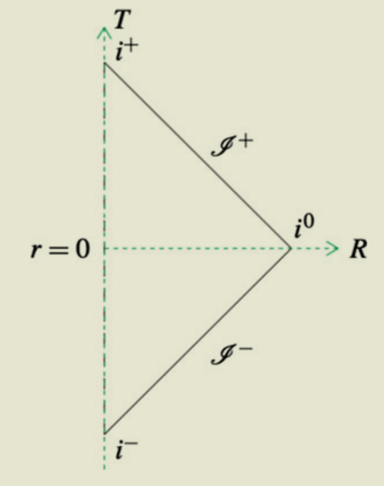
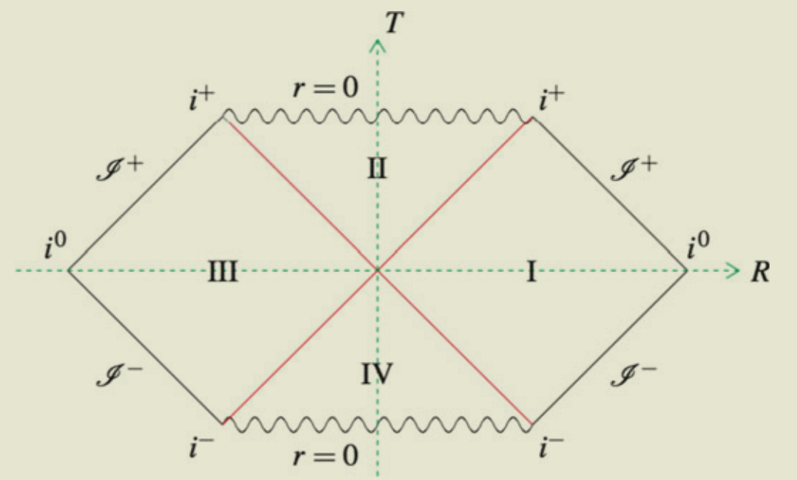

alias:: GR

- # Tricks and Cautions
  card-last-interval:: 31.26
  card-repeats:: 1
  card-ease-factor:: 2.6
  card-next-schedule:: 2023-08-28T18:51:23.399Z
  card-last-reviewed:: 2023-07-28T12:51:23.399Z
  card-last-score:: 5
  collapsed:: true
	- $g^{ab}$ is the **inverse** of $g_{ab}$.
	  When writing in the form of $d s^2=-d \tau^2+a^2(\tau)\left(d x^2+d y^2+d z^2\right)$, it is $g_{ab}$, **not** $g^{ab}$!
		- This is particularly important when calculating the Christoffel symbols, which involves lots of $g_{ab}$!
		- I made lots of mistakes here when trying to obtain the Friedman equations...
	- Christoffel symbols: Positive or minus?
		- $\nabla_a t^b=\partial_a t^b+\Gamma_{a c}^b t^c$
			- Quick memorization: Covariant at LHS, partial and Christoffel symbols at RHS.
			- **PLUS** for vectors and **MINUS** for dual vectors.
	- In coordinate transformations, only quantities in the same coordinate system could contract!
		- e.g. when $x^\mu \to x'^\mu$, how does the metric $g_{\mu\nu}$ transform?
			- $$
			  g_{\mu \nu} \rightarrow g_{\mu \nu}^{\prime}=\frac{\partial x^\alpha}{\partial x^{\prime \mu}} \frac{\partial x^\beta}{\partial x^{\prime \nu}} g_{\alpha \beta}
			  $$
		-
	- The 2nd and 3rd Friedmann equations are independent of $k$, so we can obtain them by setting $k=0$.
- # Principles
  collapsed:: true
	- General Covariance #card
	  card-last-interval:: 31.26
	  card-repeats:: 1
	  card-ease-factor:: 2.6
	  card-next-schedule:: 2023-07-21T06:49:09.857Z
	  card-last-reviewed:: 2023-06-20T00:49:09.858Z
	  card-last-score:: 5
		- The metric (and its derivatives) is the only quantity pertaining to space that can appear in the laws of physics.
		- Specifically, there are no preferred vector fields or preferred bases of vector fields pertaining only to the structure of spacetime which appear in any law of physics.
			- As a consequence, the (undifferentiated) Christoffel symbol cannot appear in physical laws since it implies a preferred frame.
		- Rephrased, laws of physics are the same in all reference frames (with only the metric dependent on the frame)
		- See ((64267a67-8dfa-44a6-a52c-4f86ebc81214))
	- Special Covariance #card
	  card-last-interval:: 31.26
	  card-repeats:: 1
	  card-ease-factor:: 2.6
	  card-next-schedule:: 2023-05-06T17:28:22.039Z
	  card-last-reviewed:: 2023-04-05T11:28:22.039Z
	  card-last-score:: 5
		- All physical measurements are equally possible in different inertial frames and all physical laws are the same.
- # Special Relativity
  collapsed:: true
	- [[Lorentz Transformation]]
		- $$
		  \left\|\Lambda_x{ }^\mu{ }_\nu\right\|=\left(\begin{array}{cccc}
		  \gamma & -\gamma & 0 & 0 \\
		  -\gamma \beta & \gamma & 0 & 0 \\
		  0 & 0 & 1 & 0 \\
		  0 & 0 & 0 & 1
		  \end{array}\right)
		  $$
		- A quick way to rederive it: Take $\tilde t=ict$, then the metric becomes Euclidean.
		  We can first write down a rotation in the Euclidean space, then insert $i$ back.
- # Elements of Differential Geometry
  collapsed:: true
	- Christoffel symbol #card
	  card-last-interval:: 29.95
	  card-repeats:: 1
	  card-ease-factor:: 2.6
	  card-next-schedule:: 2023-08-11T11:51:24.773Z
	  card-last-reviewed:: 2023-07-12T13:51:24.773Z
	  card-last-score:: 5
	  id:: 654072b3-9f3f-49b5-afb1-2046a138b115
		- $$\Gamma_{a b}^c=\frac{1}{2} g^{c d}\left\{\partial_a g_{b d}+\partial_b g_{a d}-\partial_d g_{a b}\right\}$$
		- Quick memorization: Two plus and a minus, raised by a metric, symmetric positive at the two lower indices
	- Geodesic equation #card
	  id:: 64268b1f-18f1-4eb8-a851-d33728ebfa9c
	  card-last-interval:: 42
	  card-repeats:: 2
	  card-ease-factor:: 2.7
	  card-next-schedule:: 2024-01-21T01:04:49.153Z
	  card-last-reviewed:: 2023-12-10T01:04:49.154Z
	  card-last-score:: 5
	  collapsed:: true
		- Covariant form:
		  $$
		  u^a \nabla_a u^b=0
		  $$
			- The tangent vector is parallel transported!
			- Actually the most general form is
			  $$
			  u^a \nabla_a u^b=\alpha u^b
			  $$
			  but we may show the curve can always be reparametrized by an affine parameter to make $\alpha=0$.
			- Note that the affine parameter is a **canonical** choice, which also has a great physical meaning!
		- Written in coordinates:
		  $$
		  \frac{d^2 x^\mu}{d \tau^2}+ \Gamma_{\sigma \nu}^\mu \frac{d x^\sigma}{d \tau} \frac{d x^\nu}{d \tau}=0
		  $$
			- Note that this only holds for an affine parameter. For a different parameter $\lambda'$ we have instead $\left(\ddot{x}^\mu+\Gamma_{v \rho}^\mu \dot{x}^\nu \dot{x}^\rho\right)\left(\frac{d \lambda^{\prime}}{d \lambda}\right)^2=-\dot{x}^\mu \frac{d^2 \lambda^{\prime}}{d \lambda^2}$. (Exercise)
		- Can be derived from minimizing $S=\frac{1}{2} m \int_{\gamma} g_{ab}(x) \dot{x}^a \dot{x}^b d t$ and writing down the EL equation
	- Derivative operator
	  collapsed:: true
		- Def
		  collapsed:: true
			- 1. Linearity: For all $A, B \in \mathscr{T}(k, l)$ and $\alpha, \beta \in R$,
			  $$
			  \begin{aligned}
			  \nabla_c\left(\alpha A^{a_1 \cdots a_{k_k} \cdots b_l}+\right. & \left.\beta B^{a_1 \cdots a_{k_1} \cdots b_1 \cdots b_l}\right) \\
			  & =\alpha \nabla_c A^{a_1 \cdots a_{k^{\prime}} \cdots b_l}+\beta \nabla_c B^{a_1 \cdots a_{k_k}} b_1 \cdots b_l
			  \end{aligned}
			  $$
			- 2. Leibnitz rule: For all $A \in \mathscr{T}(k, l), B \in \mathscr{T}\left(k^{\prime}, l^{\prime}\right)$,
			  $$
			  
			  \nabla_e\left[A^{a_1 \cdots a_{k_k} \cdots b_l} B^{c_1 \cdots c_{k^{\prime}}} d_1 \cdots d_{l^{\prime}}\right] =\left[\nabla_e A^{a_1 \cdots a_{k^{\prime}}} b_{b_1 \cdots b_l}\right] B^{c_1 \cdots c_{k^{\prime}} d_1 \cdots d_l} +A^{a_1 \cdots a_{k_k} \cdots b_l}\left[\nabla_e B^{c_1 \cdots c_{k^{\prime}}} d_1 \cdots d_l\right]
			  
			  $$
			- 3. Commutativity with contraction: For all $A \in \mathscr{T}(k, l)$,
			  $$\nabla _{d}\left( A^{a_{1} \cdots c}{}_{a_{k_{1}} \cdots c\cdots b_{l}}\right) =\nabla _{d} A^{a_{1} \cdots c}{}_{a_{k_{1}} \cdots c\cdots b_{l}}$$
			- 4. Consistency with the notion of tangent vectors as directional derivatives on scalar fields: For all $f \in \mathscr{F}$ and all $t^a \in V_p$
			  $$
			  t(f)=t^a \nabla_a f .
			  $$
			- 5. Torsion free: For all $f \in \mathscr{F}$,
			  $$
			  \nabla_a \nabla_b f=\nabla_b \nabla_a f .
			  $$
		- How could they possibly differ?
		  collapsed:: true
			- There must be a tensor $C$ s.t. 
			  collapsed:: true
			  $$\nabla_a \omega_b=\tilde{\nabla}_a \omega_b-C_{a b}^c \omega_c$$
				- Exercise. $\nabla_a t^b=\tilde{\nabla}_a t^b+C_{a c}^b t^c$ #card
				  card-last-interval:: 30
				  card-repeats:: 2
				  card-ease-factor:: 2.7
				  card-next-schedule:: 2023-07-03T01:10:05.253Z
				  card-last-reviewed:: 2023-06-03T01:10:05.254Z
				  card-last-score:: 5
					- Different derivative operators must agree on scalar fields.
			- Note that we must use the trick: If $\omega_b^{\prime}-\omega_b$ vanishes at $p$ we can find smooth functions, $f_{(\alpha)}$, which vanish at $p$ and smooth dual vector fields, $\mu_b^{(\alpha)}$, such that
			  $$
			  \omega_b^{\prime}-\omega_b=\sum_{\alpha=1}^n f_{(\alpha)} \mu_b^{(\alpha)}
			  $$
			  and invoke the fact that all derivative operators agree on scalar fields
		- Covariant derivative #card
		  card-last-interval:: 42
		  card-repeats:: 2
		  card-ease-factor:: 2.7
		  card-next-schedule:: 2023-10-01T12:55:30.904Z
		  card-last-reviewed:: 2023-08-20T12:55:30.905Z
		  card-last-score:: 5
			- We hope that $\nabla_a g_{bc}=0$. Moreover, it only differs from the partial derivative by a tensor denoted as $\Gamma$
			- From $\nabla_a t^b=\partial_a t^b+\Gamma_{a c}^b t^c$, we can derive $$\Gamma_{a b}^c=\frac{1}{2} g^{c d}\left\{\partial_a g_{b d}+\partial_b g_{a d}-\partial_d g_{a b}\right\}$$
			  collapsed:: true
				- Put $a,b,c$ at the derivative index respectively
				- Invoke symmetricity at the lower indices of $\Gamma_{a b}^c$ (Exercise: Derive it from the property that the derivative operators are torsion-free)
				- Sum two then minus one
		- Parallel Transport #card
		  collapsed:: true
		  card-last-interval:: 42
		  card-repeats:: 2
		  card-ease-factor:: 2.7
		  card-next-schedule:: 2023-09-13T12:57:00.126Z
		  card-last-reviewed:: 2023-08-02T12:57:00.126Z
		  card-last-score:: 5
			- We say a vector field $v^b$ is parallel transported along $t^a$ if
			  $$
			  t^a \nabla_a v^b=0
			  $$
			- Note that it is curve-dependent, so we can only say that vectors on the same curve are parallel.
			  In general we **cannot** say two vectors at different points are parallel or not.
	- Riemann curvature tensor
		- Def #card
		  card-last-score:: 5
		  card-repeats:: 3
		  card-next-schedule:: 2023-11-28T02:50:35.466Z
		  card-last-interval:: 117.6
		  card-ease-factor:: 2.8
		  card-last-reviewed:: 2023-08-02T12:50:35.467Z
		  collapsed:: true
			- collapsed:: true
			  $$
			  \nabla_a \nabla_b \omega_c-\nabla_b \nabla_a \omega_c:=R_{a b c}{ }^d \omega_d
			  $$
				- Exercise: Show that LHS could indeed be expressed by a tensor, i.e. only depending on the value of $\omega_c$ at a **single point**
			- Ricci tensor
				- $$
				  R_{a c}:=R_{a b c}{}^b
				  $$
			- Scalar curvature
				- $$R := R_a{}^a$$
		- In terms of Christoffel symbols
		  collapsed:: true
			- $$
			  R_{\ v \rho \sigma}^{\mu}=\frac{\partial \Gamma_{v \sigma}^\mu}{\partial x^\rho}-\frac{\partial \Gamma_{\nu \rho}^\mu}{\partial x^\sigma}+\Gamma_{v \sigma}^\lambda \Gamma_{\rho \lambda}^\mu-\Gamma_{\nu \rho}^\lambda \Gamma_{\sigma \lambda}^\mu
			  $$
			- $$
			  R_{\mu \nu}=R_{\mu \lambda \nu}^\lambda=\frac{\partial \Gamma_{\mu \nu}^\lambda}{\partial x^\lambda}-\frac{\partial \Gamma_{\mu \lambda}^\lambda}{\partial x^\nu}+\Gamma_{\mu \nu}^\kappa \Gamma_{\kappa \lambda}^\lambda-\Gamma_{\mu \lambda}^\kappa \Gamma_{\nu \kappa}^\lambda
			  $$
		- Properties #card
		  card-last-interval:: 107.52
		  card-repeats:: 3
		  card-ease-factor:: 2.56
		  card-next-schedule:: 2024-02-21T15:28:07.366Z
		  card-last-reviewed:: 2023-11-06T03:28:07.366Z
		  card-last-score:: 5
		  collapsed:: true
			- 1. $R_{a b c}{ }^d=-R_{b a c}{ }^d$.
			- 2. 
			  $$
			  R_{a b c d}=-R_{a b d c}
			  $$
			- 3. (First Bianchi Identity) $R_{[a b c]}{}^d=0$.
			- 4. The (second) Bianchi identity:
			  $$
			  \nabla_{[a} R_{b c] d}{}^e=0
			  $$
			- Note that they can all be proved in the dirty way, i.e. comparing to partial derivatives and writing Christoffel symbols
			  collapsed:: true
				- This is actually rather reasonable, since 'manifold' means a structure of $\mathbb R^n$ and partial derivatives commute.
		- Corollary. $\nabla_\mu G^{\mu \nu}=0$ #card
		  collapsed:: true
		  card-last-interval:: 31.26
		  card-repeats:: 1
		  card-ease-factor:: 2.36
		  card-next-schedule:: 2023-12-11T06:35:03.847Z
		  card-last-reviewed:: 2023-11-10T00:35:03.847Z
		  card-last-score:: 3
			- Note that $G^{ab}=R^{ab}-\frac 1 2 Rg^{ab}$
			- First invoke the (second) Bianchi identity:
			  $$
			  \nabla_{[a} R_{b c] d}{}^e=0
			  $$
			- First contract $a$ and $e$, then contract $b$ and $d$.
			- Note that $R_{abcd}$ is anti-symmetric both in $ab$ and in $cd$.
	-
	- ## Pushforward and Pullback
	  collapsed:: true
		- Motivation
			- From the categorical view, it's natural to examine the induced maps.
			- From the geometrical view, $(\phi_*)_x$ is the **best linear approximation** (i.e. Jacobian) of $\phi$ at $x$.
		- Def #card
		  card-last-interval:: 31.26
		  card-repeats:: 1
		  card-ease-factor:: 2.36
		  card-next-schedule:: 2023-10-23T06:53:53.584Z
		  card-last-reviewed:: 2023-09-22T00:53:53.585Z
		  card-last-score:: 3
			- Let $M$ and $N$ be manifolds (not necessarily of the same dimension) and let $\phi: M \rightarrow N$ be a $C^{\infty}$ map.
			- First, $(\phi^*f)(x):=f(\phi(x))$, which is the case for $(0,0)$ tensors.
			- For $(1,0)$ tensors (vectors) we have $\phi_*(v)(f):=v(\phi^*f)==v(f\circ \phi)$
				- $f$ is a scalar field on $N$, $f \circ \phi$ is a scalar field on $M$, i.e. $f\circ \phi: M \to \mathbb R$
			- For $(0,1)$ tensors (1-forms) we define $\phi^*\omega(v):=\omega(\phi_*v)$
			-
			- For all $(k,0)$ and $(0,l)$ tensors we have
			  $$
			  \left(\phi_* T\right)_{a_1 \cdots a_l}\left(v_1\right)^{a_1} \cdots\left(v_l\right)^{a_l}=T_{a_1 \cdots a_l}\left(\phi^* v_1\right)^{a_1} \cdots\left(\phi^* v_l\right)^{a_l}
			  $$
			  $$
			  \left(\phi^* T\right)^{b_1 \cdots b_k}\left(\mu_1\right)_{b_1} \cdots\left(\mu_k\right)_{b_k}=T^{b_1 \cdots b_k}\left(\phi_* \mu_1\right)_{b_1} \cdots\left(\phi_* \mu_k\right)_{b_k}
			  $$
			  since tensors are defined as multi-linear forms.
			-
			- Generally we **do not** know how to do for mixed tensors.
			  However, if $\phi$ is a diffeomorphism, we can use $\phi^{-1}$ to define pushforward and pullback for mixed tensors (exercise).
		- ### Link with Symmetry
			- Isometry #card
			  card-last-interval:: 31.26
			  card-repeats:: 1
			  card-ease-factor:: 2.6
			  card-next-schedule:: 2023-07-28T06:44:00.215Z
			  card-last-reviewed:: 2023-06-27T00:44:00.216Z
			  card-last-score:: 5
				- If $\phi: M \rightarrow M$ is a diffeomorphism, $T$ is a tensor field on $M$ and $\phi^* T=T$, $\phi$ is a symmetry transformation for the tensor field $T$.
				- In the case of the metric $g_{a b}$, a symmetry transformation, or a diffeomorphism $\phi$ such that $\left(\phi^* g\right)_{a b}=g_{a b}$, is called an isometry.
				- Notes
					- Explicitly, 'symmetry' means 'operations which leave the field invariant'.
					- Isometries are the gauge freedoms of general relativity.
	- ## Lie Derivative
		- Def #card
		  card-last-interval:: 33.94
		  card-repeats:: 1
		  card-ease-factor:: 2.6
		  card-next-schedule:: 2023-09-12T10:55:14.745Z
		  card-last-reviewed:: 2023-08-09T12:55:14.745Z
		  card-last-score:: 5
			- $$
			  \mathcal L_v T^{a_1 \cdots a_{k}}_{b_1 \cdots b_l}=\lim _{t \rightarrow 0}\left\{\frac{\phi_{-t}^* T^{a_1 \cdots a_{k}}_{b_1 \cdots b_l}-T^{a_1 \cdots a_k}_{b_1 \cdots b_l}}{t}\right\}
			  $$
			  where $\phi(t)$ is the 1-parameter family of diffeomorphisms generated by the integral curves of $v^a$.
			- Exercise. It indeed satisfies linearity, the Leibniz law and $\mathcal L_v f=v(f)$
		- Now we try to determine its behavior in coordinate systems.
			- Proposition. $$\mathcal L_v w^a=[v, w]^a$$ #card
			  card-last-interval:: 31.26
			  card-repeats:: 1
			  card-ease-factor:: 2.6
			  card-next-schedule:: 2023-08-29T18:44:45.720Z
			  card-last-reviewed:: 2023-07-29T12:44:45.720Z
			  card-last-score:: 5
				- Note that $[v,w](f):=v(w(f))-w(v(f))$
				- In the coordinate where $v^a=e_1^a$, $\mathcal L_v T^{a_1 \cdots a_{k}}_{b_1 \cdots b_l}=\frac {\partial} {\partial x_1} T^{a_1 \cdots a_{k}}_{b_1 \cdots b_l}$. It's easy to verify the equality in this coordinate.
				- Since both sides are tensorial, this tensorial equation holds.
				-
		- Subsequently, all behaviors are determined by the Leibniz rule!
		  collapsed:: true
			- For example,
			  $$
			  \mathcal L_v\left(\mu_a w^a\right)=w^a \mathcal L_v \mu_a+\mu_a[v, w]^a
			  $$
			  $$
			  \begin{aligned}
			  \mathcal L_v g_{a b} & =v^c \nabla_c g_{a b}+g_{c b} \nabla_a v^c+g_{a c} \nabla_b v^c \\
			  & =\nabla_a v_b+\nabla_b v_a
			  \end{aligned}
			  $$
			- Note that $v(f)=v^a \nabla_a f$, so Leibniz rule also applies.
		-
	- ## Killing Vector
	  id:: 6433cc8f-9fd7-4848-a229-d5b4372356d2
	  collapsed:: true
		- Def #card
		  card-last-interval:: 42
		  card-repeats:: 2
		  card-ease-factor:: 2.7
		  card-next-schedule:: 2023-09-07T13:27:16.193Z
		  card-last-reviewed:: 2023-07-27T13:27:16.194Z
		  card-last-score:: 5
			- A vector field $\xi^a$ which generates an 1-para family of isometries, i.e. $\mathcal L_\xi g_{ab}=0$
			- Exercise. The above definition is equivalent to $\nabla_a \xi_b+\nabla_b \xi_a=0$.
				- Note that $\mathcal L_v u^a = v^b \nabla_b u^a - u^b \nabla_b v^a$
		- ((6433cd3d-fc1f-48f5-966e-e2f1fd234ef2)) Let $\xi^a$ be a Killing vector field and let $\gamma$ be a geodesic with tangent $u^a$. Then $\xi_a u^a$ is constant along $\gamma$. #card
		  id:: 6433ccd0-93c5-4ea3-965d-4aba75f860ac
		  card-last-interval:: 31.26
		  card-repeats:: 1
		  card-ease-factor:: 2.6
		  card-next-schedule:: 2023-07-09T08:13:28.599Z
		  card-last-reviewed:: 2023-06-08T02:13:28.599Z
		  card-last-score:: 5
			- A simple exercise to recall the ((64268b1f-18f1-4eb8-a851-d33728ebfa9c)) and the Killing equation.
			- Physically, this means that every 1-para family of isometries gives rise to a conserved quantity.
		- Degrees of freedom
			- See [Wald](((6433ce90-e3c9-4031-95f6-d7b06c8ac6fc)))
			- Note that
			  $$
			  \nabla_a \nabla_b \xi_c=-R_{b c a}{ }^d \xi_d
			  $$
			  so $\xi^a$ is completely determined by its value and first-order derivative at some point (as boundary conditions).
				- Immediately we see that there are at most $n+n(n-1) / 2=n(n+1) / 2$ linear independent Killing fields. #card
				  card-last-interval:: 117.6
				  card-repeats:: 3
				  card-ease-factor:: 2.8
				  card-next-schedule:: 2024-03-15T14:38:41.795Z
				  card-last-reviewed:: 2023-11-19T00:38:41.796Z
				  card-last-score:: 5
					- *Reminder.
					- $n(n-1)/2$ arises from $\nabla_a \xi_b+\nabla_b \xi_a=0$, i.e. antisymmetricity.
- # Tricks in Calculation
	- Local flatness
	  collapsed:: true
		- The goal is to find a coordinate where
		  $$
		  g_{\alpha^{\prime} \beta^{\prime}}(P)=\eta_{\alpha^{\prime} \beta^{\prime}}, \quad \Gamma_{\beta^{\prime} \gamma^{\prime}}^{\alpha^{\prime}}(P)=0
		  $$
		- The first can be achieved since $g_{ab}$ is symmetric, thus diagonalizable.
		- It can be shown that 
		  $$
		  x^\mu \rightarrow x^{\prime \mu}=x^\mu+\frac{1}{2} \Gamma_{\rho \sigma}^\mu(0) x^\rho x^\sigma
		  $$
		  satisfies the second condition.
			- It is easy to remember: 
			  $$\frac{\partial ^{2} x^{\prime \mu }}{\partial x^{\rho } \partial x^{\sigma }} =\Gamma ^{\mu }{}_{\rho \sigma }$$
		- Problem: Try to calculate the transformation law of $\partial_c g_{ab}$ and find $$\frac{\partial ^{2} x^{\prime \mu }}{\partial x^{\rho } \partial x^{\sigma }}$$ to make $\tilde \partial_c \tilde g_{ab}=0$.
			- Are there enough d.o.f. ?
				- Answer: $T_{(ab)c}$ isn't completely symmetric even if it is symmetric under exchanging b and c.
			- Note: To obtain the transformation rule of $g_{ab}$, first derive the rule of $w_a$. Higher-rank tensors follow.
- # Einstein Equation
  collapsed:: true
	- $$
	  G_{a b} \equiv R_{a b}-\frac{1}{2} R g_{a b}=8 \pi T_{a b}
	  $$
		- Exercise. There's an equivalent form $R_{a b}=8 \pi\left(T_{a b}-\frac{1}{2} g_{a b} T\right)$. #card
		  card-last-interval:: 42
		  card-repeats:: 2
		  card-ease-factor:: 2.7
		  card-next-schedule:: 2023-12-01T00:56:19.374Z
		  card-last-reviewed:: 2023-10-20T00:56:19.375Z
		  card-last-score:: 5
			- The two forms can derive each other by taking trace.
	- ## Lagrangian Formulation
	  collapsed:: true
		- The total action is a sum of gravitational term and matter term, $S=S_{G}+S_M$
		- $$S_{G}=\frac{c^3}{16 \pi G} \int R \sqrt{-g} \ d^4 x$$
		  $$S_{\mathrm{M}}=\frac{1}{c} \int \mathscr{L}_{\mathrm{M}} \sqrt{-g} d^4 x$$
			- Exercise. The variation indeed gives the correct EOM. #card
			  card-last-interval:: 32.57
			  card-repeats:: 1
			  card-ease-factor:: 2.6
			  card-next-schedule:: 2023-09-13T01:52:50.511Z
			  card-last-reviewed:: 2023-08-11T12:52:50.511Z
			  card-last-score:: 5
				- Useful relations
					- Palatini identity
					  $$
					  \delta R_{\mu \nu}=\nabla_\rho\left(\delta \Gamma_{\mu \nu}^\rho\right)-\nabla_\nu\left(\delta \Gamma_{\mu \rho}^\rho\right)
					  $$
					- id:: 642a29c9-fa99-45de-bd78-1947029aaeb0
					  $$
					  \frac{\partial g}{\partial g_{\mu \nu}}=\tilde{g}_{\mu \nu}=g g^{\mu \nu}
					  $$
						- This is an elementary result in (matrix-wise) linear algebra.
					- $$
					  \begin{aligned}
					  \nabla_\mu A^\mu & =\frac{\partial A^\mu}{\partial x^\mu}+\Gamma_{\sigma \mu}^\mu A^\sigma=\frac{\partial A^\mu}{\partial x^\mu}+A^\sigma \frac{\partial}{\partial x^\sigma} \ln \sqrt{-g} \\
					  & =\frac{1}{\sqrt{-g}} \frac{\partial}{\partial x^\mu}\left(A^\mu \sqrt{-g}\right) .
					  \end{aligned}
					  $$
						- In other words, the covariant divergence is also a coordinate divergence, which **vanishes** upon integrating over the manifold.
						- The would be used to show that $\delta R_{\mu\nu} g^{\mu \nu}$ is a total derivative and vanishes.
				- Note that $g_{ab}\delta g^{ab}=-g^{ab} \delta g_{ab}$
					- The indices **cannot** be raised and lowered arbitrarily in variations!
- # The Schwarzchild Solution
  id:: 6454f170-9fed-40e5-845e-c72df45c05ab
  collapsed:: true
	- $$
	  d s^2=-\left(1-\frac{2 M}{r}\right) d t^2+\left(1-\frac{2 M}{r}\right)^{-1} d r^2+r^2 d \Omega^2
	  $$
		- For easy referencing
	- It is the solution of the external gravitational field of a static and spherically symmetric body.
	  But what is exactly static and spherically symmetric?
	- ## Def
	  collapsed:: true
		- Stationary #card
		  card-last-interval:: 31.26
		  card-repeats:: 1
		  card-ease-factor:: 2.6
		  card-next-schedule:: 2023-08-14T19:12:45.606Z
		  card-last-reviewed:: 2023-07-14T13:12:45.607Z
		  card-last-score:: 5
			- There exists a timelike ((6433cc8f-9fd7-4848-a229-d5b4372356d2)) field.
			- Intuitively, this means that the spacetime has some sort of time-translation symmetry.
		- Static #card
			- The spacetime is stationary and there exists a (spacelike) hypersurface $\Sigma$ which is orthogonal to the orbits of the isometry.
			- By Frobenius's theorem (see appendix B) this is equivalent to the requirement that the timelike Killing vector field $\xi^a$ satisfy
			  $$
			  \xi_{[a} \nabla_b \xi_{c]}=0
			  $$
			- Question: What does it mean that a spacetime is stationary but not static?
				- The timelike Killing vector field is 'rotating'?
		- Spherically symmetric
			- A spacetime is said to be spherically symmetric if its isometry group contains a subgroup isomorphic to the group $S O(3)$, and the orbits of this subgroup (i.e., the collection of points resulting from the action of the subgroup on a given point) are two-dimensional spheres.
			- The $S O(3)$ isometries may then be interpreted physically as rotations.
	- ## Basic facts
	  collapsed:: true
		- If a spacetime is static, then we can push $\Sigma$ to $\Sigma_t$ by the induced diffeomorphism of the Killing field.
			- Therefore there's an orthogonal hypersurface everywhere.
			- Moreover, we may install a coordinate such that 
			  $$
			  d s^2=-V^2\left(x^1, x^2, x^3\right) d t^2+\sum_{\mu, \nu=1}^3 h_{\mu \nu}\left(x^1, x^2, x^3\right) d x^\mu d x^\nu
			  $$
				- Note that if the spacetime is only stationary but not static, we would have cross terms $dtdx^a$.
		- For a spherically symmetric spacetime, the induced metric on each orbit 2-sphere must be uniform (since by definition the rotation is an isometry).
			- However, in a curved space, a sphere need not have a center (e.g., the manifold structure could be, say, $\mathbb{R} \times S^2$, rather than $\mathbb{R}^3$ ); and even if it does, $r$ need not bear any relation to the distance to the center.
		- If a spacetime is both static and spherically symmetric, and if the static Killing field $\xi^a$ is unique (as we shall assume), then $\xi^a$ must be orthogonal to the orbit 2-spheres.
			- Namely, if $\xi^a$ is unique, it must be invariant under all the rotational isometries (since isometries can compose).
			- However, this requires its projection onto any orbit sphere to vanish, since a nonvanishing vector field on a sphere cannot be invariant under all rotations.
		- We may install a convenient coordinate
		  $$
		  d s^2=-f(r) d t^2+h(r) d r^2+r^2\left(d \theta^2+\sin ^2 \theta d \phi^2\right)
		  $$
		   in the spacetime.
			- First, being static grants the existence of hypersurfaces $\Sigma_t$. Moreover the orbit 2-spheres are within the hypersurfaces.
			- Different 2-spheres can be linked by geodesics orthogonal to the 2-spheres. The affine parameter is called $r$.
				- Geodesics are always valid, but the radius may not be!
			- However this coordinate can break down, when $\nabla_a r=0$ or $\xi^a=0$ or $\xi^a$ is colinear with $\nabla_a r$.
			  background-color:: red
		- id:: 64377e9f-224e-4111-b5a5-be9afb161ede
		-
	- ## The Solution
	  collapsed:: true
		- Solve $$d s^2=-f(r) d t^2+h(r) d r^2+r^2\left(d \theta^2+\sin ^2 \theta d \phi^2\right)$$ by brute force, we obtain
		  $$
		  d s^2=-\left(1+\frac{C}{r}\right) d t^2+\left(1+\frac{C}{r}\right)^{-1} d r^2+r^2 d \Omega^2
		  $$
			- Obviously this is asymptotically flat.
		- Comparing with the Newtonian solution (in a proper gauge) we obtain $M=-C/2$, thus
		  $$
		  d s^2=-\left(1-\frac{2 M}{r}\right) d t^2+\left(1-\frac{2 M}{r}\right)^{-1} d r^2+r^2 d \Omega^2
		  $$
		-
	- ## Birkhoff's Theorem
	  collapsed:: true
		- Statement
			- The only spherically symmetric solution of the vacuum Einstein equations is the Schwarzschild metric.
			- That is, static or asymptotic flatness need not be assumed a priori.
		- Generalization
			- Any spherically symmetric and asymptotically flat solution of the Einstein/Maxwell field equations (with no cosmological constant), must be static, so the exterior geometry of a spherically symmetric charged star must be given by the Reissner–Nordström electrovacuum.
		- Proof
			- Bambi started by writing the metric as $d s^2=-f(t, r) c^2 d t^2+g(t, r) d r^2+r^2\left(d \theta^2+\sin ^2 \theta d \phi^2\right)$ and did a brute-force calculation to plug in the Einstein field equation.
				- However it is somewhat unrigorous, since the form of the metric asserts something more than spherical symmetry.
			- It can be proven in a mathematically elegant and rigorous way as [willemvanoosterhout_bscthesis_2019.pdf (wordpress.com)](https://annegretburtscher.files.wordpress.com/2019/11/willemvanoosterhout_bscthesis_2019.pdf)
	- ## Geodesics and Motions
		- It will be used a lot that ((6433ccd0-93c5-4ea3-965d-4aba75f860ac))
		- ### Gravitational Redshift #card
		  collapsed:: true
		  card-last-interval:: 42
		  card-repeats:: 2
		  card-ease-factor:: 2.7
		  card-next-schedule:: 2023-09-25T13:05:33.304Z
		  card-last-reviewed:: 2023-08-14T13:05:33.305Z
		  card-last-score:: 5
			- Statement of the problem
				- Light emitted by one static observer is received by another one. How does the frequency differ?
			- Setup
				- The 4-velocities $u^a$ of the observers are tangent to the Killing field $\xi^a$
					- The Killing field (time-translation symmetry) provides a canonical choice of observers.
					- Note that $u^a:=\frac{dx^a}{d\tau}$, so it is properly normalized.
				- The frequency measured at $P_1$ is
				  $$
				  \omega_1=-\left.\left(k_a u_1^a\right)\right|_{P_1}
				  $$
					- Each observer has his locally Minkowski frame, where $k^a=(E_p,\vec p)$
				- Light goes along a Schwarzschild geodesic.
			- Solution
				- Note that $\xi^a k_a$ remains a constant, $u^a$ is proportional to $\xi^a$ and $u^a u_a=-1$, so we only need to calculate how $\xi^a \xi_a$ changes.
				- Therefore
				  $$
				  \frac{\omega_1}{\omega_2}=\frac{\left.\left(-\xi^b \xi_b\right)^{1 / 2}\right|_{P_2}}{\left.\left(-\xi^b \xi_b\right)^{1 / 2}\right|_{P_1}}=\frac{\left(1-2 M / r_2\right)^{1 / 2}}{\left(1-2 M / r_1\right)^{1 / 2}}
				  $$
					- This is reasonable since light has redshift when it climbs up the gravitation.
					- Note that in the coordinate $\partial_t g_{ab}=0$, thus $\xi^a \propto e^a_t$.
					  $\xi^a$ is **not** uniquely fixed, but $u^a=\xi^a / \|\xi^a\|$ is.
				- What's the microscopic mechanism? How to describe the microscopic behavior of light in gravity?
				  background-color:: red
					- It's expected that the redshift is an overall effect, leaving out the details.
		- ### Deriving the Trajectory
			- Summary #card
			  card-last-interval:: 30
			  card-repeats:: 1
			  card-ease-factor:: 2.6
			  card-next-schedule:: 2023-06-03T00:39:26.175Z
			  card-last-reviewed:: 2023-05-04T00:39:26.176Z
			  card-last-score:: 5
				- First simplify the problem by fixing the geodesic on the equatorial plane $\theta=\pi/2$.
					- Note that the metric has a symmetry $\theta \to \pi - \theta$, thus a geodesic shouldn't break the sym.
				- The idea is to avoid writing down the geodesic equation explicitly, but use the fact that $\xi^a u_a$ are conserved.
					- The geodesic equation is present in the latter fact, but in a much more elegant form.
				- That is, we write down the conserved quantities $E:=-\xi^a u_a$ and $L=\psi^a u_a$, then plug into
				  $$-\kappa=g_{ab} u^a u^b$$ 
				  ($\kappa=0$ for null and $\kappa=1$ for timelike);
					- $\xi^a$ is the timelike Killing field and $\psi^a$ is the rotation wrt the $\phi$ axis.
					- Again, Killing fields are 'symmetries of motion', which give rise to conserved quantities; conserved quantities are extremely useful!
				- After some very simple manipulations, we arrive at
				  $$
				  \frac{1}{2} \dot{r}^2+\frac{1}{2}\left(1-\frac{2 M}{r}\right)\left(\frac{L^2}{r^2}+\kappa\right)=\frac{1}{2} E^2
				  $$
				  which can be regarded as a nonrelativistic effective potential
				  $$
				  V_{\text{eff}}=\frac{1}{2} \kappa-\kappa \frac{M}{r}+\frac{L^2}{2 r^2}-\frac{M L^2}{r^3}
				  $$
					- The first term is constant; the second and third terms are Newtonian; the last term is the relativistic effect.
			- Physical Interpretations
				- Orbits
				  collapsed:: true
					- The circular orbits correspond to the extremas of the effective potential.
						- For photons there are no minima, thus no stable orbits.
					- The elliptical orbits correspond to an oscillation near minima of $V_{\text{eff}}$.
					- ((6451c6c6-0c91-4f31-9c71-9833bed15002))
					- When $L$ or $E$ is too small, there is no minimum and the particle (or photon) is doomed to crash into the planet!
						- ((6451c710-66ce-4a83-a5d6-69f4d2fd64bc))
				- Free falling of particles
					- For an observer at infinity, any particle would needs infinite time (coordinate time) to fall to the event horizon ($r=r_s$)!
					- However, the proper time of the particle is **finite**.
				- Precession
					- Simply put, the radial period isn't equal to the angular period, thus the orbit isn't closed.
					- Illustration in a simple case
						- Consider an oscillation near the stable orbits, which is similar to a harmonic oscillator.
						- We can obtain $\omega_r$ and $\omega_\phi$, then the precession rate is $\omega_p=\omega_\phi-\omega_r$.
				- Deflection of light
					- Consider a photon coming from $r=\infty$ and going to $r=\infty$ again.
					  Calculate $\Delta\phi$ in the process; the deflection angle is $\pi-\Delta\phi$.
					-
			-
	- ## Kruskal Extension
	  id:: 64586978-ccc6-4f29-ac28-b6b26a5aea8d
	  collapsed:: true
		- The strategy is classical:
		  Examine the $r-t$ surface; find null geodesics and establish 'normal coordinates'; find affine parameters and extend.
		- Result
			- Metric:
			  \begin{equation*}
			  ds^{2} =\frac{32M^{3} e^{-r/2M}}{r}\left( -d\tilde{t}^{2} +d\tilde{r}^{2}\right) +r^{2}\left( d\theta ^{2} +\sin^{2} \theta d\phi ^{2}\right)
			  \end{equation*}
			- Relations between coordinates:
			  \begin{gather*}
			  \left(\frac{r}{2M} -1\right) e^{r/2M} =\tilde{r}^{2} -\tilde{t}^{2}\\
			  \frac{t}{2M} =\ln\left(\frac{\tilde{t} +\tilde{r}}{\tilde{r} -\tilde{t}}\right) =2\tanh^{-1} (\tilde{t} /\tilde{r} )
			  \end{gather*}
		- See [Wald](((64586a3e-a531-406b-9161-8d2e5fdbf004))) for reference.
			- Note that I've rewritten Wald in Bambi's notation, i.e. $T \to \tilde t, R \to \tilde r$
	- ## Interior Solution
	  collapsed:: true
		- Motivation: We're interested in what happens inside a massive body.
		- Setup
			- Model the matter as perfect fluid,
			  $$
			  T_{a b}=\rho u_a u_b+P\left(g_{a b}+u_a u_b\right)
			  $$
				- Note that in order to be compatible with the time-translating symmetry, 
				  $$
				  u^a=-\left(e_0\right)^a=-f^{1 / 2}(d t)^a
				  $$
		- Writing down the equations
			- $$
			  d s^2=-f(r) d t^2+h(r) d r^2+r^2\left(d \theta^2+\sin ^2 \theta d \phi^2\right)
			  $$
			- $$
			  \begin{aligned}
			  8 \pi T_{00}=8 \pi \rho=G_{00}= & R_{00}+\frac{1}{2}\left(R_0^0+R_1{ }^1+R_2{ }^2+R_3{ }^3\right) \\
			  = & \left(r h^2\right)^{-1} h^{\prime}+r^{-2}\left(1-h^{-1}\right), \\
			  8 \pi T_{11}=8 \pi P=G_{11}= & R_{11}-\frac{1}{2}\left(R_0^0+R_1{ }^1+R_2{ }^2+R_3{ }^3\right) \\
			  = & (r f h)^{-1} f^{\prime}-r^{-2}\left(1-h^{-1}\right), \\
			  8 \pi T_{22}=8 \pi P=G_{22}= & \frac{1}{2}(f h)^{-1 / 2} \frac{d}{d r}\left[(f h)^{-1 / 2} f^{\prime}\right] \\
			  & +\frac{1}{2}(r f h)^{-1} f^{\prime}-\frac{1}{2}\left(r h^2\right)^{-1} h^{\prime} .
			  \end{aligned}
			  $$
		- Solutions
			- $$
			  \begin{gathered}
			  h(r)=\left[1-\frac{2 m(r)}{r}\right]^{-1} \\
			  m(r)=4 \pi \int_0^r \rho\left(r^{\prime}\right) r^{\prime 2} d r^{\prime}
			  \end{gathered}
			  $$
				- It seems like the Newtonian gravitational field in a ball, but the volume element is **different** since $h(r) \neq 1$.
			- Let $f=e^{2\phi}$, we find
			  $$
			  \frac{d \phi}{d r}=\frac{m(r)+4 \pi r^3 P}{r[r-2 m(r)]}
			  $$
				- Note that $P$ still depends on $r$, so we have to use the last equation.
			- $$
			  \frac{d P}{d r}=-(P+\rho) \frac{m(r)+4 \pi r^3 P}{r[r-2 m(r)]}
			  $$
			- Summing those up, we obtain
			  $$
			  d s^2=-e^{2 \phi} d t^2+\left(1-\frac{2 m(r)}{r}\right)^{-1} d r^2+r^2 d \Omega^2
			  $$
		- Remarks
			- For the solution to be non-singular, we must have $r > 2m(r)$.
			- The pressure needed in general relativity to obtain equilibrium is always larger than in Newtonian graviry.
				- $$
				  P(r)=\rho_0\left[\frac{(1-2 M / R)^{1 / 2}-\left(1-2 M r^2 / R^3\right)^{1 / 2}}{\left(1-2 M r^2 / R^3\right)^{1 / 2}-3(1-2 M / R)^{1 / 2}}\right]
				  $$
				  (Wald ((6437aad2-3d97-4484-9f01-ccf5d4d0b667)))
					- The boundary condition is $\rho=P=0$ at $r=R$.
				- Thus when $R=9M/4$ the pressure needed at $r=0$ becomes **infinite**.
					- The existence of such upper bound is quite interesting: It strongly suggests that heavy stars might undergo a gravitational collapse. #card
					  card-last-interval:: 31.26
					  card-repeats:: 1
					  card-ease-factor:: 2.6
					  card-next-schedule:: 2023-06-02T17:18:21.669Z
					  card-last-reviewed:: 2023-05-02T11:18:21.669Z
					  card-last-score:: 5
						- *Reminder.
						- Would QG prevent a total collapse?
				- The upper bound can be derived by other ways, eg. non-singularity of the metric and $\xi^a$ being timelike.
			-
- # [[Cosmology]]
- # Dealing with Singularities
  collapsed:: true
	- Two possibilities
		- Real singularity of spacetime
			- Should be reachable by geodesics at **finite** affine parameters.
			  background-color:: yellow
				- This is an requirement from the physical side, but it's crucial!
				- Can we consider the union of all points finitely reachable by geodesics?
			- Usually with diverging curvature scalars
		- Non-singular spacetime, just bad behaviors of coordinates
			- This is usually shown by explicitly constructing the coordinate transformation
	- ## Strategy #card
	  card-last-interval:: 31.26
	  card-repeats:: 1
	  card-ease-factor:: 2.6
	  card-next-schedule:: 2023-07-17T07:03:46.139Z
	  card-last-reviewed:: 2023-06-16T01:03:46.140Z
	  card-last-score:: 5
		- *In general there's no known simple strategy. But this does exist in 2D.
		- Step 1. Find two families of null geodesics (incoming and outgoing)
			- Note that in 2D, geodesics within a family can't cross (since there's only one null tangent in 2D).
			- What makes this work?
			  background-color:: pink
				- Exploiting the mathematical structure of the metric: Null space. It is a **canonical** choice for the construction of a preferred vector field (coordinate).
				- Also we may consider the eigensystem, but this seemed to be less useful.
		- Step 2. Construct a coordinate, with component 1,2 **constant** along each geodesic in family 1,2 separately.
			- A geodesic is geometrical, but the length along a geodesic is not.
		- Step 3. Find affine parameters and re-parameterize. Coordinate singularities would disappear in the new coordinate.
			- Affine parameters represent the 'physical length'.
		- Step 4. Perform the extension.
	- ## Examples
		- $$
		  d s^2=-\frac{1}{t^4} d t^2+d x^2
		  $$
			- [ref](((64586a65-4715-465e-8561-8b0c5237f695)))
			- Seemingly singular at $t=0$.
			- Perform $t':=1/t$, we obtain
			  $$
			  d s^2=-\left(d t^{\prime}\right)^2+d x^2
			  $$
			  which is flat.
			- Moreover, $t \to 0$ corresponds to $t' \to \infty$, showing that it could **never** be reached by an observer (i.e. not at a finite affine parameter of the geodesic).
		- $$
		  d s^2=-x^2 d t^2+d x^2
		  $$
			- [ref](((64586b43-dd3c-4922-9763-a440d5bdbde3)))
			- Seemingly singular at $x=0$, where the metric becomes degenerate.
			- However, proceed by our classical strategy, we see it is actually flat!
		- ((64586978-ccc6-4f29-ac28-b6b26a5aea8d))
	-
- # Spacetime Diagrams
	- ## Penrose Diagram #card
	  card-last-interval:: 31.26
	  card-repeats:: 1
	  card-ease-factor:: 2.6
	  card-next-schedule:: 2024-01-23T12:52:25.176Z
	  card-last-reviewed:: 2023-12-23T06:52:25.176Z
	  card-last-score:: 5
		- Idea
			- Use a conformal transformation (usually involving $\tan$) to bring the points at infinity to finite points. Then the spacetime diagram becomes intuitive.
			- We'd better keep null geodesics going along $\pm \frac \pi 4$, so we can easily observe the behavior of geodesics.
		- Examples
			- Minkowski spacetime
			  collapsed:: true
				- Transformation
					- $$
					  \begin{aligned}
					  t & =\frac{1}{2} \tan \frac{T+R}{2}+\frac{1}{2} \tan \frac{T-R}{2} \\
					  r & =\frac{1}{2} \tan \frac{T+R}{2}-\frac{1}{2} \tan \frac{T-R}{2}
					  \end{aligned}
					  $$
					- $$
					  \begin{aligned}
					  d s^2= & \left(4 \cos ^2 \frac{T+R}{2} \cos ^2 \frac{T-R}{2}\right)^{-1}\left(-d T^2+d R^2\right) \\
					  & +r^2 d \theta^2+r^2 \sin ^2 \theta d \phi^2
					  \end{aligned}
					  $$
						- Null geodesics still going along 45deg!
				- Diagram
					- {:height 670, :width 477}
					- Future time-like infinity $i^{+}:$the region toward which time-like geodesics extend. It corresponds to the points at $t \rightarrow \infty$ with finite $r$.
					- Past time-like infinity $i^{-}:$the region from which time-like geodesics come. It corresponds to the points at $t \rightarrow-\infty$ with finite $r$.
					- Spatial infinity $i^0$ : the region toward which space-like slices extend. It corresponds to the points at $r \rightarrow \infty$ with finite $t$.
					- Future null infinity $\mathscr{I}^{+}:$the region toward which outgoing null geodesics extend. It corresponds to the points at $t+r \rightarrow \infty$ with finite $t-r$.
					- Past null infinity $\mathscr{I}^{-}$: the region from which ingoing null geodesics come. It corresponds to the points at $t-r \rightarrow-\infty$ with finite $t+r$.
			- ((6454f170-9fed-40e5-845e-c72df45c05ab))
			  card-last-interval:: 32.57
			  card-repeats:: 1
			  card-ease-factor:: 2.6
			  card-next-schedule:: 2023-07-27T14:04:38.960Z
			  card-last-reviewed:: 2023-06-25T01:04:38.960Z
			  card-last-score:: 5
				- Transformation
					- \begin{aligned}
					  & \tilde{t}=\frac{1}{2} \tan \frac{T+R}{2}+\frac{1}{2} \tan \frac{T-R}{2} \\
					  & \tilde{r}=\frac{1}{2} \tan \frac{T+R}{2}-\frac{1}{2} \tan \frac{T-R}{2}
					  \end{aligned}
					- $$
					  \begin{aligned}
					  d s^2= & \frac{32 G_{\mathrm{N}}^3 M^3}{r} e^{-r /\left(2 G_{\mathrm{N}} M\right)}\left(4 \cos ^2 \frac{T+R}{2} \cos ^2 \frac{T-R}{2}\right)^{-1}\left(-d T^2+d R^2\right) \\
					  & +r^2 d \theta^2+r^2 \sin ^2 \theta d \phi^2
					  \end{aligned}
					  $$
				- Diagram
					- {:height 439, :width 638}
					- The curly lines correspond to the singularity
					- The red lines correspond to the event horizon (Exercise: verify that $r=2M$ corresponds to $T=\pm R$)
					- Null geodesics are going from small $T$ to large $T$, in angle $\pi /4$.
						- If they come from region IV to region I, then they can reach the null infinity $\mathscr I^+$.
						- If they come from $\mathscr I^-$, then they will go into region II and finally fall into the singularity.
					- Matters in region II can never escape. Even null geodesics are bound to fall into the singularity, let alone timelike ones.
- # [[Blackhole]]
- # Weak-Gravity limit
  collapsed:: true
	- ## Linearized Gravity
	  id:: 6454f170-654e-4dc5-9f18-846a64c1cefc
		- Summary
		  collapsed:: true
			- ((6472aded-8d6f-454c-862a-392f170303c9))
			- Solutions
				- For each direction, there are two polarizations.
			- Observational effect
				- Gravitational waves would cause no acceleration (of point particles).
				- However, there would be change in proper distance, thus lead to change in propagation time and interference of light.
		- Formulation
		  collapsed:: true
			- Write $g_{a b}=\eta_{a b}+\gamma_{a b}$ and expand all quantities to first order of $\gamma_{ab}$, which is taken as a small perturbation.
				- Note that $\gamma_{ab}$ is **not tensorial**. It is only covariant under Lorentz transformations (where $\eta_{ab}$ is kept invariant).
				- Bambi writes $\gamma_{\mu\nu}$ as $h_{\mu\nu}$.
			- Def. Trace-reversed perturbation,
			  $$\bar{\gamma}_{a b}=\gamma_{a b}-\frac{1}{2} \eta_{a b} \gamma$$
		- Fix the gauge
		  collapsed:: true
			- Def. Traceless-transverse harmonic gauge
			  id:: 6472aded-8d6f-454c-862a-392f170303c9
				- id:: 6472ae05-9f94-4ffa-8452-03ec73562bd0
				  $$
				  \partial^\mu \tilde{h}_{\mu \nu}=0
				  $$
				  (Harmonic)
					- $$
					  \square_\eta \tilde{h}_{\mu \nu}=-\frac{16 \pi G_{\mathrm{N}}}{c^4} T_{\mu \nu}
					  $$
				- id:: 6472ae2c-2dbb-4e90-a384-91bc341d8ab9
				  $$
				  h_{0 \mu}=0, \quad h=0
				  $$
				  (TT)
					- Note that $\tilde h_{\mu\nu}=h_{\mu\nu}$ in this gauge.
				- #+BEGIN_NOTE
				  Harmonicity could be achieved with the presence of matter, but TT gauge could only be chosen in vacuum where $T_{ab}=0$.
				  #+END_NOTE
			- In this gauge the Einstein equation becomes
			  $$
			  \square_\eta \tilde{h}_{\mu \nu}=0
			  $$
			- Bambi's coordinate way
				- Harmonic gauge
				  collapsed:: true
					- Consider a coordinate transformation
					  $$
					  x^\mu \rightarrow x^{\prime \mu}=x^\mu+\xi^\mu
					  $$
					  where $\xi$ is of the same order of $h$.
					- $h_{\mu\nu}$ transforms as
					  $$
					  h_{\mu v}^{\prime}=h_{\mu \nu}-\partial_\mu \xi_v-\partial_\nu \xi_\mu
					  $$
					  and
					  $$
					  \tilde{h}_{\mu \nu}^{\prime}=h_{\mu \nu}^{\prime}-\frac{1}{2} \eta_{\mu \nu} h^{\prime}=\tilde{h}_{\mu \nu}-\partial_\mu \xi_v-\partial_\nu \xi_\mu+\eta_{\mu \nu} \partial^\sigma \xi_\sigma
					  $$
					- Therefore
					  $$
					  \partial^\mu \tilde{h}_{\mu \nu}^{\prime}=\partial^\mu \tilde{h}_{\mu \nu}-\square_\eta \xi_v
					  $$
					- We just need to solve the Poisson equations
					  $$
					  \square_\eta \xi_v=\partial^\mu \tilde{h}_{\mu v}
					  $$
					  to obtained the desired transformation!
				- TT gauge
				  collapsed:: true
					- There are still some degrees of freedom in the gauge, namely the homogeneous solutions
					  $$
					  \square_\eta \xi_v=0
					  $$
					  could be freely added.
					- We can make use of the freedom to set
					  $$
					  h_{0 \mu}=0, \quad h=0
					  $$
			- Wald's abstract way
			  collapsed:: true
				- Consider the perturbation $\gamma_{ab}$ as the derivative $\frac {dg_{ab}(\lambda)}{d\lambda}|_{\lambda=0}$ and a family of diffeomorphisms $\phi_\lambda$. Then $\gamma_{a b}=d g_{a b} /\left.d \lambda\right|_{\lambda=0}$ and $\gamma_{a b}^{\prime}=d\left(\phi_\lambda^* g_{a b}\right) /\left.d \lambda\right|_{\lambda=0}$, which shall represent the same physical spacetime.
					- Prove that $\gamma_{a b}^{\prime}=\gamma_{a b}-\mathcal L_v g_{a b}$, where $v$ is the generating vector field of $\phi_\lambda$. This is the gauge freedom of the perturbation.
				- The final result is $\partial^c \partial_c \bar{\gamma}_{a b}=-16 \pi T_{a b}$
					- Note that we can obtain $\gamma_{ab}$ back by taking trace.
				-
			-
		- Solve the equation
		  collapsed:: true
			- Let's consider plane-wave solutions,
			  $$
			  h_{i j}^{\mathrm{TT}}=\varepsilon_{i j} e^{i k^\mu x_\mu}
			  $$
				- Harmonic -> $k^\mu h_{\mu\nu}=0$
				- TT -> Only spatial components could be nonzero and the trace must be zero.
			- Consider a wave propagating in the $z$ direction, $k^\mu=(0,0,0,1)$:
			  there could only be two modes, namely
			  $$
			  \begin{aligned}
			  \varepsilon_{i j}^{+}=\left(\begin{array}{ccc}
			  1 & 0 & 0 \\
			  0 & -1 & 0 \\
			  0 & 0 & 0
			  \end{array}\right) & \text { (plus mode }) \\
			  \varepsilon_{i j}^{\times}=\left(\begin{array}{ccc}
			  0 & 1 & 0 \\
			  1 & 0 & 0 \\
			  0 & 0 & 0
			  \end{array}\right) & (\text { cross mode })
			  \end{aligned}
			  $$
				- $$
				  h_{\mu \nu}^{\mathrm{TT}}=\left(\begin{array}{cccc}
				  0 & 0 & 0 & 0 \\
				  0 & h_{+} & h_{\times} & 0 \\
				  0 & h_{\times} & -h_{+} & 0 \\
				  0 & 0 & 0 & 0
				  \end{array}\right) \cos [\omega(t-z / c)]
				  $$
		- Observational effects
			- No acceleration
				- $\Gamma_{00}^i=0$, which means that $\ddot{x}^i=0$.
			- Change of proper distance
				- Since $h_{xx} \neq h_{yy}$, we can observe a change in proper distances, which enables interference of light1
	- ## Restore Newtonian gravity
	  collapsed:: true
		- Summary #card
		  card-last-interval:: 42
		  card-repeats:: 2
		  card-ease-factor:: 2.7
		  card-next-schedule:: 2023-09-25T13:07:40.214Z
		  card-last-reviewed:: 2023-08-14T13:07:40.214Z
		  card-last-score:: 5
		  collapsed:: true
			- *Simplified way
			  collapsed:: true
				- Derive $h_{t t}=-\frac{2 \Phi}{c^2}$ from the geodesic equation, which should recover EOM in Newtonian gravity
				- Plug the above expression to the Einstein equation and recover the Poisson equation.
			- Metric side
			  collapsed:: true
				- Same as before: $g_{a b}=\eta_{a b}+\gamma_{a b}$, fix the gauge to obtain $\partial^c \partial_c \bar{\gamma}_{a b}=-16 \pi T_{a b}$, where $\bar{\gamma}_{a b}=\gamma_{a b}-\frac{1}{2} \eta_{a b} \gamma$.
			- Matter side
			  collapsed:: true
				- Find a suitable coordinate where $T_{a b} \approx \rho t_a t_b$, where $t$ is the time direction of the coordinate (almost inertial)
				- The equation becomes $\nabla^2 \bar{\gamma}_{00}=-16 \pi \rho$, where $\phi \equiv-\frac{1}{4} \bar{\gamma}_{00}$ satisfies Poisson's equation,
				  collapsed:: true
				  $$
				  \nabla^2 \phi=4 \pi \rho
				  $$
					- Just the Newtonian gravity!
			- The final task is to verify the geodesic equation.
			  collapsed:: true
				- For slow motions, we may approximate $d x^\alpha / d \tau \approx (1,0,0,0)$, thus the geodesic equation writes
				  $$\frac{d^2 x^\mu}{d t^2}=-\Gamma^\mu{ }_{00}$$
				- Plug in the expression of Christoffel symbols, we obtain
				  $$\Gamma_{00}^\mu=-\frac{1}{2} \frac{\partial \gamma_{00}}{\partial x^\mu}=\frac{\partial \phi}{\partial x^\mu}$$
				-
			-
			- Again, the great tool of physicists -- perturbation theory!
	- ## Gravitational Wave
		- First note that much has already been done in the section of linearized gravity: Select the harmonic TT gauge to simplify the equation, obtain two polarizations.
		- Next we attack the following question:
		  How does a time-varying source emit gravitational waves?
		- The formal solution to the equation in the harmonic gauge 
		  $$
		  \square_\eta \tilde{h}_{\mu \nu}=-{16 \pi } T_{\mu \nu}
		  $$
		  is
		  $$
		  \tilde{h}_{\mu \nu}(t, \mathbf{x})=4 \int d^3 \mathbf{x}^{\prime} \frac{T_{\mu \nu}\left(t-\left|\mathbf{x}-\mathbf{x}^{\prime}\right| / c, \mathbf{x}^{\prime}\right)}{\left|\mathbf{x}-\mathbf{x}^{\prime}\right|}
		  $$
			- The result could be obtained by a Fourier transformation to obtain the Green function.
		- ### The Quadruple Formula
			- When we are very far from the source, we can approximate it by taking the distance as a constant:
			  id:: 6473160b-0530-4c13-a2f7-9d101039ee0c
			  $$
			  \tilde{h}^{\mu v}(t, \mathbf{x})=\frac{4 G_{\mathrm{N}}}{c^4 r} \int d^3 \mathbf{x}^{\prime} T^{\mu v}\left(t-r / c, \mathbf{x}^{\prime}\right)
			  $$
				- Note that the gravitational wave is proportional to $r^{-1}$.
				  On the contrary, the electromagnetic wave is proportional $r^{-2}$.
			- Def. Quadruple Moment:
			  $$
			  Q^{i j}(t)=\frac{1}{c^2} \int_V T^{00}(t, \mathbf{x}) x^i x^j d^3 \mathbf{x}
			  $$
			- The formula:
			  $$
			  \begin{aligned}
			  \tilde{h}_{\mu 0} & =0 \\
			  \tilde{h}_{i j} & =\frac{2 G_{\mathrm{N}}}{c^4 r} \ddot{Q}_{i j}(t-r / c)
			  \end{aligned}
			  $$
				- In plain English: The gravitational wave only concerns the spatial part, which is only determined by the second time-derivative of the quadruple moment!
				- Proof
				  collapsed:: true
					- Starting point: $\partial_\mu T^{\mu \nu}=0$
						- Note that it should in principle be $\nabla_\mu$ rather than $\partial_\mu$, but since $T^{\mu\nu}$ is of the same order of $h_{\mu\nu}$, we could ignore the difference.
					- Step 1. Consider 0th-order moment
						- $$
						  \partial_0 T^{0 v}=-\partial_k T^{k v}
						  $$
						- Integrate over the whole space and RHS vanishes, we obtain
						  id:: 6473181d-1e80-4494-a113-acacb1239370
						  $$
						  \int_V T^{0 v} d^3 \mathbf{x}=\text { constant }
						  $$
						- Therefore $\tilde{h}^{0 v}$ is constant too. 
						  id:: 6473184f-b3ae-4940-9423-87d49abdadf5
						  Since here we are interested in gravitational waves, namely in the time-dependent part of the gravitational field, we can put $\tilde{h}^{0 v}=0$.
					- Step 2. Consider $\nu=i$ and 1st-order moment
						- $$
						  \partial_0 T^{0 i}=-\partial_k T^{k i}
						  $$
						- id:: 64731890-b1ef-402c-9dbe-e95f7ffcee76
						  $$
						  \begin{aligned}
						  \frac{1}{c} \frac{\partial}{\partial t} \int_V T^{i 0} x^j d^3 \mathbf{x} & =-\int_V \frac{\partial T^{i k}}{\partial x^k} x^j d^3 \mathbf{x} \\
						  & =-\int_V \frac{\partial}{\partial x^k}\left(T^{i k} x^j\right) d^3 \mathbf{x}+\int_V T^{i k} \frac{\partial x^j}{\partial x^k} d^3 \mathbf{x} \\
						  & =\int_V T^{i j} d^3 \mathbf{x} .
						  \end{aligned}
						  $$
						- Symmetrize over i and j:
						  $$
						  \frac{1}{c} \frac{\partial}{\partial t} \int_V\left(T^{i 0} x^j+T^{j 0} x^i\right) d^3 \mathbf{x}=2 \int_V T^{i j} d^3 \mathbf{x}
						  $$
					- Step 3. Consider $\nu=0$ and 2nd-order moment
						- $$
						  \partial_0 T^{00}=-\partial_k T^{k 0}
						  $$
						- $$
						  \begin{aligned}
						  \frac{1}{c} \frac{\partial}{\partial t} \int_V T^{00} x^i x^j d^3 \mathbf{x} & =-\int_V \frac{\partial T^{k 0}}{\partial x^k} x^i x^j d^3 \mathbf{x} \\
						  & =-\int_V \frac{\partial}{\partial x^k}\left(T^{k 0} x^i x^j\right) d^3 \mathbf{x}+\int_V\left(T^{k 0} \frac{\partial x^i}{\partial x^k} x^j+T^{k 0} x^i \frac{\partial x^j}{\partial x^k}\right) d^3 \mathbf{x} \\
						  & =\int_V\left(T^{i 0} x^j+T^{j 0} x^i\right) d^3 \mathbf{x} .
						  \end{aligned}
						  $$
						- We recognize the familiar form in the last line, so we take time derivative to both sides:
						  $$
						  \begin{aligned}
						  \frac{1}{c^2} \frac{\partial^2}{\partial^2 t} \int_V T^{00} x^i x^j d^3 \mathbf{x} & =\frac{1}{c} \frac{\partial}{\partial t} \int_V\left(T^{i 0} x^j+T^{j 0} x^i\right) d^3 \mathbf{x}\\
						  & =2 \int_V T^{i j} d^3 \mathbf{x}  \quad \text{(Step 2)} .
						  \end{aligned}
						  $$
					-
			- Switch to TT gauge
				- We are concerned about gravitational waves in the vacuum region, so we can still switch to the TT gauge.
				  This would be done by a traceless-transverse projector, which projects out both the transverse part and the trace part.
				- Def
					- $$
					  P_{i j}=\delta_{i j}-n_i n_j
					  $$
						- Project to the plane orthogonal to the wavevector $n_i$.
					- $$
					  P_{i j k l}=P_{i k} P_{j l}-\frac{1}{2} P_{i j} P_{k l}
					  $$
						- The first part projects out orthogonal components.
						- The second part projects out the trace in the plane.
					- $$
					  h_{i j}^{\mathrm{TT}}=P_{i j k l} \tilde{h}_{k l} \\
					  \tilde{Q}_{i j}=Q_{i j}-\frac{1}{3} \delta_{i j} Q, \quad Q_{i j}^{\mathrm{TT}}=P_{i j k l} \tilde{Q}_{k l}=P_{i j k l} Q_{k l}
					  $$
				- Therefore we can rewrite the equation as
				  $$
				  \begin{aligned}
				  h_{\mu 0}^{\mathrm{TT}} & =0 \\
				  h_{i j}^{\mathrm{TT}} & =\frac{2 G_{\mathrm{N}}}{c^4 r} \ddot{Q}_{i j}^{\mathrm{TT}}(t-r / c)
				  \end{aligned}
				  $$
				- Note that $Q_{ij}^{TT}$ is also traceless.
				  This explains that spherically-symmetric collapses would not emit gravitational waves.
		- ### Energy of Gravitational Waves
			- ((64734e5e-dc0d-4108-84c5-427bdde9c399))
- # Theories in Curved Spacetime
  collapsed:: true
	- Principle of minimal substitution
		- Substitute $\eta_{ab}$ by $g_{ab}$ and substitute partial derivatives by covariant derivatives.
			- See [Wald](((6428f77e-b46f-426d-b11d-1b15a9e38ab1))) for reference.
		- However, the rule isn't free from ambiguity and different ways of substitution may be possible.
	- ## Electromagnetism
		- $$
		  \begin{gathered}
		  \nabla^a F_{a b}=-4 \pi j_b \\
		  \nabla_{[a} F_{b c]}=0
		  \end{gathered}
		  $$
		- Ricci tensor would naturally emerge in EOM of $A^\mu$ (In Lorentz gauge). See [Wald](((6428f95a-63d8-4f02-8ef3-864bb4438d87))).
			- This suggests the substitution isn't unique. If we minimally 'GRize' the EOM of $A^\mu$ we'd obtain a different form.
	- ## [[Klein-Gordon Theory]]
		- The most natural is
		  $$
		  \nabla^a \nabla_a \phi-m^2 \phi=0
		  $$
		- However, we may equally write
		  $$
		  \nabla^a \nabla_a \phi-m^2 \phi-\alpha R \phi=0
		  $$
		-
- # Physical Interpretations
	- Is gravity still a force? How to define the gravity of the earth? #card
	  collapsed:: true
	  card-last-interval:: 42
	  card-repeats:: 2
	  card-ease-factor:: 2.7
	  card-next-schedule:: 2024-01-24T00:50:47.002Z
	  card-last-reviewed:: 2023-12-13T00:50:47.003Z
	  card-last-score:: 5
		- First, **what is a force**?
			- If a particle accelerates with respect to an inertial observer, we claim that a force $F:=ma$ is acting on the particle.
			- However, in GR there's no notion of inertial observers (or natural reference frames).
		- In GR we only have geodesics; 'force' relies on the reference frame.
		  collapsed:: true
		  Thus we can't talk about absolute gravitational force since there's no natural reference frame.
			- However, we can always talk about tidal forces (relative acceleration of two observers).
		- The earth is a special case: We have the earth as a natural reference frame, or we have a natural notion of time-translation symmetry (standing on the surface of the earth)
	- Calculate time measured by an observer #card
	  card-last-interval:: 42
	  card-repeats:: 2
	  card-ease-factor:: 2.7
	  card-next-schedule:: 2023-08-09T00:50:42.494Z
	  card-last-reviewed:: 2023-06-28T00:50:42.495Z
	  card-last-score:: 5
	  collapsed:: true
		- What is an observer?
			- A trajectory in the spacetime, with a locally Minkowski reference frame
		- What is the time he measured?
			- Difference of proper time (i.e. time in the observer's frame)
		- Special case: Static observer
		  collapsed:: true
			- Take $g_{ab}=\eta_{ab}$ at infinity (no gravity at infinity)
			- $d\tau^2=-g_{tt}dt^2$
			  collapsed:: true
				- Generally $|g_{tt}|<1$, so time measured by the observer would be slower than the coordinate time, i.e. time felt at infinity.
			- Example. Schwarzschild solution
			  collapsed:: true
				- $$
				  d \tau=\sqrt{1-\frac{2 G_{\mathrm{N}} M}{c^2 r}} d t<d t
				  $$
	- ## Examples
	  collapsed:: true
		- Time difference between GPS satellites and receivers #card
		  card-last-interval:: 30
		  card-repeats:: 1
		  card-ease-factor:: 2.6
		  card-next-schedule:: 2023-05-26T03:35:26.841Z
		  card-last-reviewed:: 2023-04-26T03:35:26.842Z
		  card-last-score:: 5
		  collapsed:: true
			- The most difficult thing here may be finding an appropriate definition of 'time', which is not easy in GR.
			  collapsed:: true
				- Proper time is always well-defined, but useless for comparing different observers.
				- Coordinate time isn't covariant.
				- However here we have a special coordinate, namely the earth's coordinate, which corresponds to a timelike Killing vector (generating time-translation symmetry).
			- Outline
			  collapsed:: true
				- Take the same **coordinate time** and calculate the difference in proper times (which is measured)
				  collapsed:: true
					- We don't need to go to the respective frames. Just calculate $g_{ab}dx^a dx^b$.
				- As a weak-gravity approximation, use the Newtonian solution and calculate special- and general-relativity effects separately.