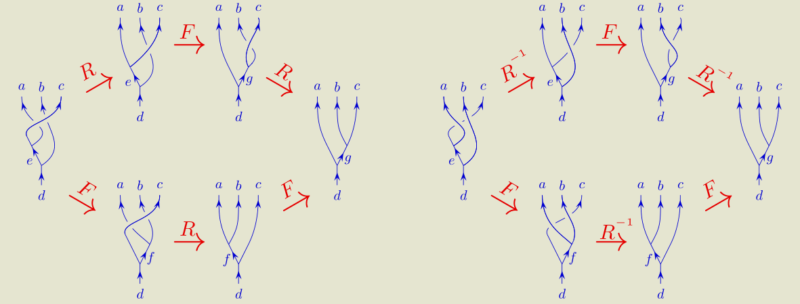

- 
- $\begin{aligned} R_e^{c a}\left[F_d^{a c b}\right]_{e g} R_g^{c b} & =\sum_f\left[F_d^{c a b}\right]_{e f} R_d^{c f}\left[F_d^{a b c}\right]_{f g} \\ {\left[R_e^{a c}\right]^{-1}\left[F_d^{a c b}\right]_{e g}\left[R_g^{b c}\right]^{-1} } & =\sum_f\left[F_d^{c a b}\right]_{e f}\left[R_d^{f c}\right]^{-1}\left[F_d^{a b c}\right]_{f g}\end{aligned}$
-