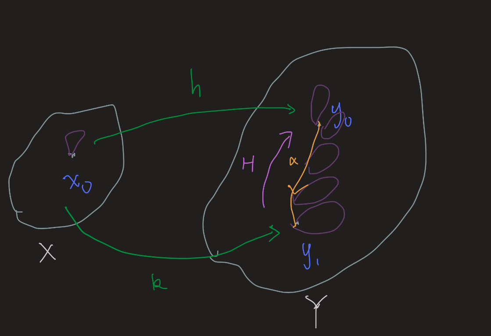

- Def #card
  card-last-interval:: 30
  card-repeats:: 2
  card-ease-factor:: 2.7
  card-next-schedule:: 2023-06-01T11:28:42.976Z
  card-last-reviewed:: 2023-05-02T11:28:42.977Z
  card-last-score:: 5
	- Let $f: X \rightarrow Y$ and $g: Y \rightarrow X$ be continuous maps. Suppose $g \circ f \simeq 1_X$ and $f \circ g \simeq 1_Y$. Then the **maps** $f$ and $g$ are called **homotopy equivalences**.
	- In other words, homotopy equivalences are isomorphisms in $\mathrm{hTop}$
	- Example
		- Inclusion j and deformation retraction r
- Let $h, k: X \rightarrow Y$ be continuous maps; let $h\left(x_0\right)=y_0$ and $k\left(x_0\right)=y_1$. If $h$ and $k$ are **homotopic**, there is a path $\alpha$ in $Y$ from $y_0$ to $y_1$ such that $k_*=\hat{\alpha} \circ h_*$. Indeed, if $H: X \times I \rightarrow Y$ is the homotopy between $h$ and $k$, then $\alpha$ is the path $\alpha(t)=H\left(x_0, t\right)$ #card
  collapsed:: true
  card-last-interval:: 117.6
  card-repeats:: 3
  card-ease-factor:: 2.8
  card-next-schedule:: 2023-12-04T02:49:36.923Z
  card-last-reviewed:: 2023-08-08T12:49:36.924Z
  card-last-score:: 5
	- **No need to fix any point in the homotopy; homotopic paths always give the same homomorphism between fundamental groups!**
	- ((63a66686-57f7-43bd-8883-017b1642e7f1))
	- We may construct a path homotopy $G: I\times I \to Y$ by $G(s,t)=(\alpha_t * F(f(s),t) * \alpha_t^{-1})(s)$, where $\alpha_t(s)=H(x_0,st)$
		- $\alpha_t$ is 'the path $\alpha$ truncated at length t'
		- 
		-
- ((63a67422-9e04-4af9-8bae-e9bc5903ed6a)) Let $f: X \rightarrow Y$ be continuous; let $f\left(x_0\right)=y_0$. If $f$ is a **homotopy equivalence** then
  card-last-interval:: 30
  card-repeats:: 2
  card-ease-factor:: 2.7
  card-next-schedule:: 2023-05-04T03:41:23.853Z
  card-last-reviewed:: 2023-04-04T03:41:23.854Z
  card-last-score:: 5
  $$
  f_*: \pi_1\left(X, x_0\right) \longrightarrow \pi_1\left(Y, y_0\right)
  $$
  is an **isomorphism**. #card
	- Intuition
		- Homotopy equivalence preserve all info related to paths.
	- Proof
		- Suppose $f\circ g \cong id_Y$, $g \circ f \cong id_X$
		- Now we have explicit inverses to the star maps (up to different base points)!
- ((63a67588-b6c3-48ab-97fb-5f38f7401e4a)) Two spaces $X$ and $Y$ have the **same homotopy type** if and only if they are **homeomorphic to deformation retracts of a single space** $Z$.
-