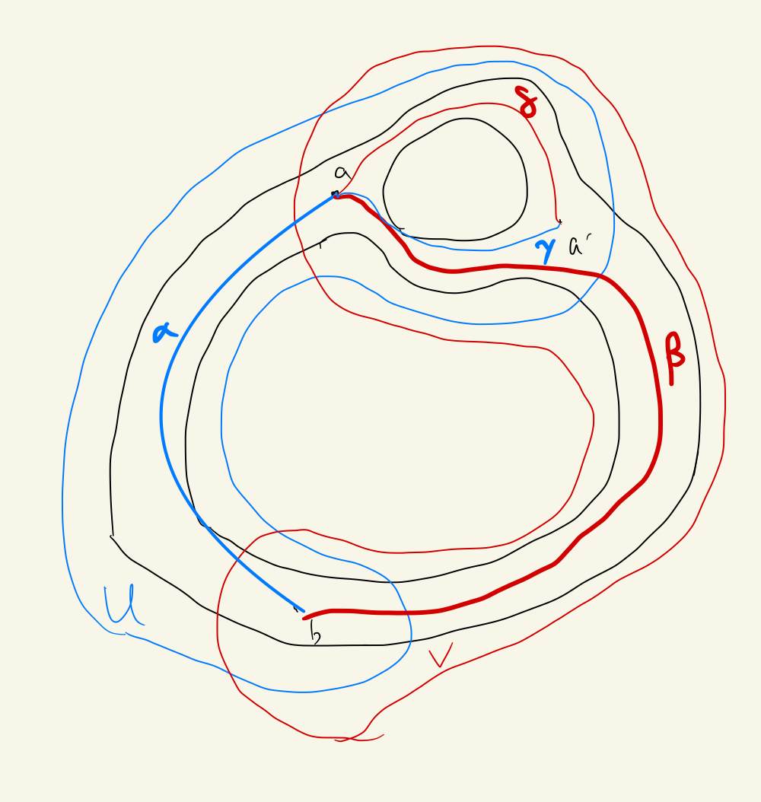
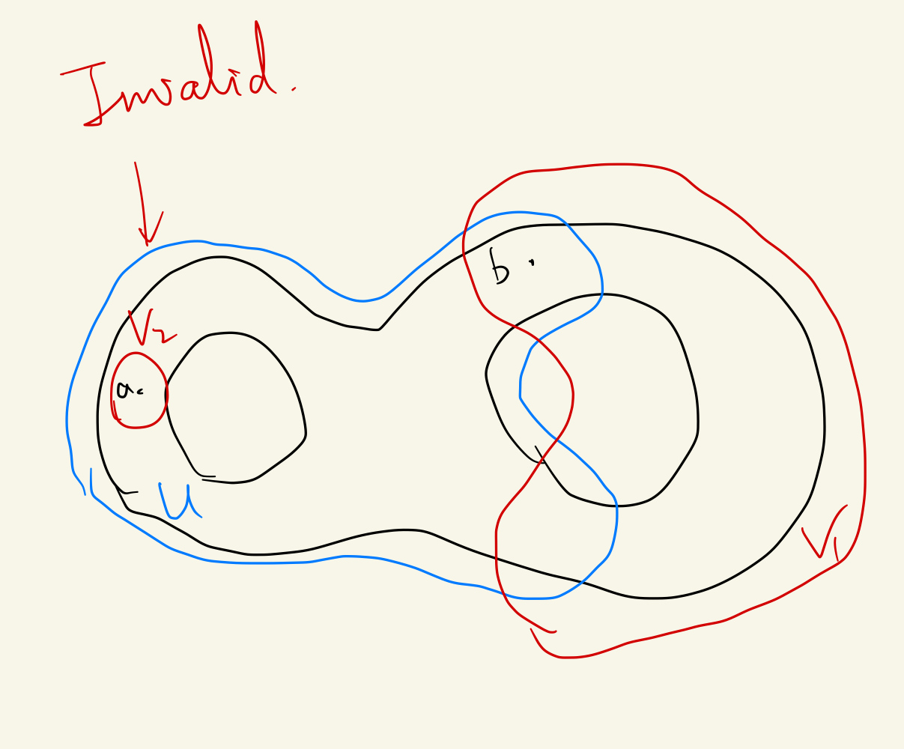

- ((63bbc3d9-da3a-4571-86da-58b279d881a0)) Let $X$ be the union of two open sets $U$ and $V$, such that $U \cap V$ can be written as the union of two **disjoint** open sets $A$ and $B$. Assume that there is a path $\alpha$ in $U$ from a point $a$ of $A$ to a point $b$ of $B$, and that there is a path $\beta$ in $V$ from $b$ to $a$. Let $f$ be the loop $f=\alpha * \beta$.
  id:: 63bbc3cd-2356-45f1-819c-e950c33d75aa
  card-last-interval:: 25.01
  card-repeats:: 1
  card-ease-factor:: 2.6
  card-next-schedule:: 2023-02-06T00:23:54.650Z
  card-last-reviewed:: 2023-01-12T00:23:54.651Z
  card-last-score:: 5
  (a) The path-homotopy class $[f]$ generates an **infinite cyclic subgroup** of $\pi_1(X, a)$.
  *(b) If $\pi_1(X, a)$ is itself infinite cyclic, it is generated by $[f] .^{\dagger}$
  (c) Assume there is a path $\gamma$ in $U$ from $a$ to the point $a^{\prime}$ of $A$, and that there is a path $\delta$ in $V$ from $a^{\prime}$ to $a$. Let $g$ be the loop $g=\gamma * \delta$. Then the subgroups $<[f]>$ and $<[g]>$ of $\pi_1(X, a)$ satisfy $<[f]> \cap <[g]> = \{e\}$ #card
	- Intuition
		- Pictures
			- 
			- 
				- We can't find a path in V, because they are not in the same path component.
		- (a) It certainly generates a cyclic group, only to prove it's inf.
	- Proof
		- First we may make several simplifications.
			- Take the situation where U and V are path connected.
				- If not, just take the path component.
		- Official
			- Idea: Find an appropriate covering space. Then use the lifting correspondence to find the order of the fundamental group.
				- ((638c0f2d-33eb-4634-9467-e083bf50506d))
			- Construct a subspace of $X\times \mathbb Z$
				- Union $U \times(2 n) \quad$ and $\quad V \times(2 n+1)$
				- Identify $x \times(2 n)$ and $x \times(2 n-1) \quad$ for $x \in A$, $x \times(2 n)$ and $x \times(2 n+1) \quad$ for $x \in B$
				- Denote the space by E.
			- Then prove it is covering
- ((63bbcc50-fdce-4a0d-aa5b-94592f62dcac)) Let $D$ be an arc in $S^2$. Then $D$ does not separate $S^2$. #card
  collapsed:: true
  card-last-interval:: 24
  card-repeats:: 1
  card-ease-factor:: 2.6
  card-next-schedule:: 2023-02-18T01:10:14.069Z
  card-last-reviewed:: 2023-01-25T01:10:14.070Z
  card-last-score:: 5
	- First proof
		- Use the ((63bbcfcf-7da8-4aa7-887c-c2b566e5ebfa))
			- Let $a$ and $b$ be points of $S^2$. Let $A$ be a compact space, and let $f: A \rightarrow S^2-a-b$ be a continuous injective map. If $f$ is **nulhomotopic**, then $a$ and $b$ lie in the **same component** of $S^2-f(A)$.
		- Obviously an arc is nulhomotopic.
	- Second proof
		- This proof is quite interesting. Let me record it.
			- The essential thought is dividing the arc infinitely, then invoke the [[Nested Sequence Property]]. #Strategy
		- As usual, we split the arc into **equal parts** $D_1$ and $D_2$ which intersect at a point $d$. **Suppose** there are two points $a,b$ cannot be connected.
		- Let $X=S^2-d$, $U=S^2-D_1$, $V=S^2-D_2$.
			- $X=U\cup V$; $U\cap V=S^2-D$.
		- By the above theorem, if a and b can be connected both in U and V, then we can find an infinite cyclic subgroup of $\pi_1(X)$, which derives a **contradiction**.
		- However, if U isn't path-connected... then we may repeat the above operations to split $D_1$ into 2 parts.
		- The process can be infinitely repeated, and we obtain a **Nested Sequence**, with the final point x.
		- Then we derive a contradiction, since $S^2-x$ is path connected (and some other obvious things).
- Statement of the theorem
	- Let $C$ be a simple closed curve in $S^2$. Then $C$ separates $S^2$ into precisely two components $W_1$ and $W_2$. Each of the sets $W_1$ and $W_2$ has $C$ as its boundary; that is, $C=\bar{W}_i-W_i$ for $i=1,2$. #card
		- The first part is proven in [[Jordan Separation Theorem]].
		- Now we attack the second part, i.e. precisely 2 components.
			- As usual, write $C$ as the union of two arcs $C_1$ and $C_2$ that intersect in a two-point set $\{p, q\}$.
			- Let $X$ be the space $S^2-p-q$, which has the fundamental group $\mathbb Z$ .Let $U$ and $V$ be the open sets $U=S^2-C_1 \text { and } V=S^2-C_2.$ Then $X=U \cup V$, and $U \cap V=S^2-C$.
			- Suppose $U \cap V$ has more than 2 components.
				- Let $A_1$ and $A_2$ be two of the components of $U \cap V$, and let $B$ be the union of the others.
				- Let $a \in A_1$, $a^{\prime} \in A_2$ and $b \in B$. Since arcs don't separate $S^2$, we can find paths connecting any two of them.
				- Now it's time to apply the strange [theorem](((63bbc3cd-2356-45f1-819c-e950c33d75aa)))
					- Essentially, we can form different nontrivial loops from $a$ to $a'$ and from $a$ to $b$.
					- However, $<[f]> \cap <[g]> = \{e\}$ contradicts with $\pi_1(X)=\mathbb Z$
		- Third part: The common boundary.
			- Locally connected -> The path components are open. Thus $\bar{W}_1-W_1$ and $\bar{W}_2-W_2$ must be contained in $C$.
			- To prove the reverse inclusion, we show that if $x$ is a point of $C$, every neighborhood $U$ of $x$ intersects the closed set $\bar{W}_1-W_1$.
				- For some $U(x)$, we may break $C$ into $C_1$ and $C_2$ s.t. $C_1 \sub U$.
				- Select $a\in W_1, b\in W_2$. Since arcs don't separate $S^2$, we can find a path $\alpha$ connecting them.
				- Prop. $\alpha$ intersects $\bar W_1 - W_1$.
					- Otherwise $\alpha(I)$ would be a connected set lying in the union of the disjoint open sets $W_1$ and $S^2-\bar{W}_1$, and intersecting each of them.
				- Since $\bar W_1 - W_1$ is contained in $C_1$, it follows that the intersection point is contained in $C_1$.
- Generalized version
	- Let $C_1$ and $C_2$ be closed connected subsets of $S^2$ whose intersection consists of two points. If neither $C_1$ nor $C_2$ separates $S^2$, then $C_1 \cup C_2$ separates $S^2$ into precisely two components.
	  id:: 63bbddf3-847f-49e2-ac2a-90935bf64b53
		- Prove it as an exercise!
-