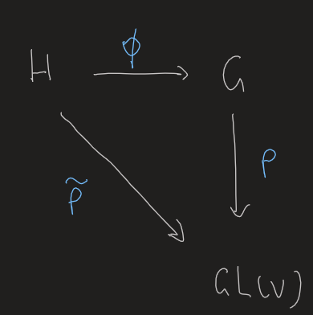

- Def
	- A group that is also a finite-dimensional smooth [[Manifold]], such that the multiplication and inversion are both smooth.
	- We may further require that the manifold is **closed**, which gives many good properties.
	- Matrix Lie group
		- ((6381bb48-3345-4b06-bbe2-aac3d6c38dde))
		- ((6381bb1b-bd7f-4e67-8380-1a111a50408c)). However, most Lie groups we consider do have this property.
		- A general Lie group might not be a matrix Lie group. But we hardly need to consider such exotic groups :p
	-
		-
- Basic Theory
	- Mainly Chapter 2 of Hall.
	- Defs
		- Identity component
		  id:: 6381bc92-5f90-4322-9a1b-0cbbf9128acc
			- The path component with the identity
		- Lie group homomorphism #card
		  card-last-interval:: 67.2
		  card-repeats:: 3
		  card-ease-factor:: 2.8
		  card-next-schedule:: 2023-05-17T05:18:50.520Z
		  card-last-reviewed:: 2023-03-11T01:18:50.521Z
		  card-last-score:: 5
		  id:: 6382c5bc-957b-4756-8adc-146cca7d1a16
			- ((6381bdc6-e0b4-4d4d-91e3-aeb15dce7e60))
			  To be an isomorphism, the inverse map must also be continuous.
				- But the map shall be smooth for manifolds?
					- For most homomorphisms we see, it is satisfied.
				- Could we deduce smoothness from continuity?
					- The group multiplication is smooth.
			- All structures must correspond.
			-
	- Connectedness
	  collapsed:: true
		- In Lie groups, [[Connected]] is equivalent to [[Path Connected]]
		- The ((6381bc92-5f90-4322-9a1b-0cbbf9128acc)) is a normal subgroup. #card
		  card-last-interval:: 30
		  card-repeats:: 2
		  card-ease-factor:: 2.7
		  card-next-schedule:: 2023-06-03T12:49:15.148Z
		  card-last-reviewed:: 2023-05-04T12:49:15.148Z
		  card-last-score:: 5
			- A simple exercise. Directly construct the path.
		- $SU(2)$ is [[Simply connected]]. #card
		  card-last-interval:: 24
		  card-repeats:: 2
		  card-ease-factor:: 2.7
		  card-next-schedule:: 2023-03-05T11:20:00.269Z
		  card-last-reviewed:: 2023-02-09T11:20:00.269Z
		  card-last-score:: 5
			- We may construct a homeomorphism to $S^3$ by 
			  $$
			  A=\left(\begin{array}{cc}
			  \alpha & -\bar{\beta} \\
			  \beta & \bar{\alpha}
			  \end{array}\right)
			  $$
				- $\alpha$ and $\beta$ are arbitrary complex numbers satisfying $|\alpha|^2+|\beta|^2=1$
		- ((639330f5-2eca-4f75-93cf-3fd1f6f9fe12)) There is a continuous bijection between $\mathrm{SO}(3)$ and $\mathbb{R} P^3$, thus $SO(3)$ isn't simply connected. #card
		  card-last-score:: 5
		  card-repeats:: 4
		  card-next-schedule:: 2024-01-11T07:47:02.251Z
		  card-last-interval:: 252.3
		  card-ease-factor:: 2.9
		  card-last-reviewed:: 2023-05-04T00:47:02.251Z
			- Note that $\mathbb{R} P^3$ is obtained by identifying points in $\mathbb R^4$.
			- Intuition
				- A rotation always has a principle axis. Thus the topological structure of $SO(3)$ is analogous to a 'direction' and an 'angle'.
				- The latter is isomorphic to $S_1$.
	- [[Norms of Matrices]]
	  collapsed:: true
		- Hilbert–Schmidt norm, or Frobenius norm
			- $\|X\|=\left(\sum_{j, k=1}^n\left|X_{j k}\right|^2\right)^{1 / 2}$
			- See X as an $n^2$-dimensional vector.
			- Properties
				- $\left\|(A-I)^m\right\| \leq\|(A-I)\|^m$
	- [[Matrix Exponential]]
	- [[Matrix Logarithm]]
	  collapsed:: true
		- We hope to define something as an inverse of the matrix exponential.
		  However, a bit knowledge in [[Complex Analysis]] would show that it is impossible to have a global one.
	-
- Exapmles
  collapsed:: true
	- General Linear Group, $GL(n,\mathbb C)$
	- Special Unitary Group
		- ((6381bed0-deb1-4cab-94d7-e1e4837c83e8))
		-
	- Heisenberg group
	  id:: 63e884c8-ec49-498f-8b3c-1decb6106562
		- Matrices of the form $\left(\begin{array}{lll}1 & a & b \\ 0 & 1 & c \\ 0 & 0 & 1\end{array}\right)$
	- A nonmatrix Lie group
	  id:: 63e8847a-9140-4cd5-a6e3-a3baa7222645
		- Def
			- $G=\mathbb{R} \times \mathbb{R} \times S^1$
			- $\left(x_1, y_1, u_1\right) \cdot\left(x_2, y_2, u_2\right)=\left(x_1+x_2, y_1+y_2, e^{2\pi i x_1 y_2} u_1 u_2\right)$
			- Of course it is a group and the multiplication is smooth.
		- Theorem. It is not isomorphic to any matrix Lie group. #card
		  card-last-interval:: 29.48
		  card-repeats:: 1
		  card-ease-factor:: 2.6
		  card-next-schedule:: 2023-03-21T23:05:57.636Z
		  card-last-reviewed:: 2023-02-20T12:05:57.636Z
		  card-last-score:: 5
			- Consider a homomorphism from the ((63e884c8-ec49-498f-8b3c-1decb6106562)), $\Phi\left(\begin{array}{lll}1 & a & b \\ 0 & 1 & c \\ 0 & 0 & 1\end{array}\right)=\left(a, c, e^{2 \pi i b}\right)$
				- $N:=\operatorname{Ker}\Phi=\left\{\left(\begin{array}{lll}1 & 0 & n \\ 0 & 1 & 0 \\ 0 & 0 & 1\end{array}\right) \mid n \in \mathbb{Z}\right\}$
			- For some rep of $G$, it naturally induces a rep of $H$ by 
			- ((63e88de6-862b-46b6-8689-bbd85d966509)). Let $\Pi$ be any finite-dimensional representation of $H$. If ker $\Pi \supset$ $N$, then 
			  $$\operatorname{ker} \Pi \supset Z(H)=\left\{\left(\begin{array}{lll}
			  1 & 0 & b \\
			  0 & 1 & 0 \\
			  0 & 0 & 1
			  \end{array}\right) \mid b \in \mathbb{R}\right\}$$
				- Lemma 4.38. If $X$ is a nilpotent matrix and $e^{t X}=I$ for some nonzero $t$, then $X=0$.
					- Simple way: Jordan standard form.
						- All eigenvalues are 0.
						- Only to consider the blocks where all up-diagonal terms are 1.
						- Consider the second-lowest line. Only first-order term has the nonzero up-diagonal term. So $e^tX=I$ leads to a contradiction.
					- Official proof: Rather interesting.
						- Since $X$ is nilpotent, the power series for $e^{t X}$ terminates after a finite number of terms. Thus, each entry of $e^{t X}$ depends **polynomially** on $t$; that is, there exist polynomials $p_{j k}(t)$ such that $\left(e^{t X}\right)_{j k}=p_{j k}(t)$.
						- If $e^{t X}=I$ for some nonzero $t$, then $e^{n t X}=I$ for all $n \in \mathbb{Z}$, showing that $p_{j k}(n t)=\delta_{j k}$ for all $n$. **However, a polynomial that takes on a certain value infinitely many times must be constant**. Thus, actually, $e^{t X}=I$ for all $t$.
				- Then consider the associated rep for $\mathfrak h$.
			- Thus the rep of $G$ cannot be faithful.
	-