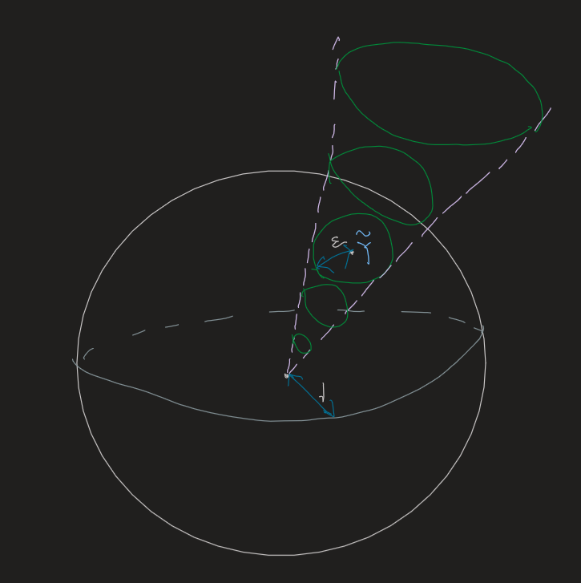

- [[References]]
	- 
- [[Lie Group]]
- [[Lie Algebra]]
- Common [[Strategy]]
	- Lie groups don't have natural addition and subtraction structures.
	  Usually we obtain subtraction by {{cloze differentiation}}.
		- The trick is used in proving ((6382ce57-6b73-4815-b142-0f889766fa01)) preserves bracket.
- # Basic Theory
	- The [[Exponential Map]]
		- Note that the exponential map may not be injective (eg, $SU(2)$ ) or surjective (disconnected Lie group). However, it is a [[Local Homeomorphism]].
		- ((6382db2f-701a-41e5-8169-70d9167b1c9f)) For $0<\varepsilon<\log 2$, $U_{\varepsilon}:=\left\{X \in M_n(\mathbb{C}) \mid\|X\|<\varepsilon\right\}$ and $V_{\varepsilon}:=\exp \left(U_{\varepsilon}\right)$. Suppose $G \subset \mathrm{GL}(n ; \mathbb{C})$ is a matrix Lie group with Lie algebra $\mathfrak{g}$. Then there exists $\varepsilon \in(0, \log 2)$ such that for all $A \in V_{\varepsilon}, A$ is in $G$ **if and only if** $\log A$ is in $\mathfrak{g}$. #card
		  card-last-interval:: 33.35
		  card-repeats:: 1
		  card-ease-factor:: 2.6
		  card-next-schedule:: 2023-03-02T19:59:54.263Z
		  card-last-reviewed:: 2023-01-28T11:59:54.263Z
		  card-last-score:: 5
		  collapsed:: true
			- **My proof is problematic. The best way to deal with it is to write out every implicit assumption and check whether they're correct.**
			- Plain English version
				- Exist a neighborhood of the identity in G, small enough to let it be a homeomorphism with $\mathfrak g$.
				- Note that injectivity is guaranteed by ((63c14167-8540-43ba-9aa0-4d1c2bc7cf64))
			- Lemma. Suppose $B_m$ are elements of $G$ and that $B_m \rightarrow I$. Let $Y_m=\log B_m$, which is defined for all sufficiently large $m$. Suppose that $Y_m$ is nonzero for all $m$ and that $Y_m /\left\|Y_m\right\| \rightarrow Y \in M_n(\mathbb{C})$. Then $Y$ is in $\mathfrak{g}$. #card
			  card-last-interval:: 30
			  card-repeats:: 2
			  card-ease-factor:: 2.7
			  card-next-schedule:: 2023-05-06T00:41:45.131Z
			  card-last-reviewed:: 2023-04-06T00:41:45.133Z
			  card-last-score:: 5
			  collapsed:: true
				- Idea
					- Lie groups are **closed**, so a sequence must converge to something inside.
					- Quantities can be approximated by something small enough multiplies integers. #Strategy
				- Partial solutions
					- Since exp is continuous, $e^{t Y_m / \|Y_m\|} \to e^{tY}$
					- If we can show $\log A \in \mathfrak g$, then we have a sequence of group elements on LHS. So RHS must also be in the group.
					  collapsed:: true
						- It seems too good to be true.
				- Official solution
					- $\log A \in \mathfrak g$ is **wrong** in general.
					- But since $B_m \rightarrow I$, we have $\left\|Y_m\right\| \rightarrow 0$. Thus, we can find integers $k_m$ such that $k_m\left\|Y_m\right\| \rightarrow t$
					- $$
					  e^{k_m Y_m}=\exp \left[\left(k_m\left\|Y_m\right\|\right) \frac{Y_m}{\left\|Y_m\right\|}\right] \rightarrow e^{t Y}
					  $$
						- Note that we do not need to show $e^{t Y_m / \|Y_m\|} \in \mathfrak g$.
							- We need a sequence tending to $e^tY$, but still some freedom :)
						- The point is we construct another sequence as an approximation, so that we only need to deal with **integers**.
			- My wong solution
				- Note that $Y\in \mathfrak g \Leftrightarrow cY \in \mathfrak g$. Moreover, since taking norm is continuous, $\|Y\|=1$
				- We shall construct a sequence $B_m \to I$ s.t. $\frac{\log B_m}{\left\|\log B_m\right\|} \rightarrow \frac{\log A}{\|\log A\|}:=\tilde Y$
					- Reminiscent of the projective space? lol
				- Equivalently, $\forall \epsilon>0$, $\exist B_m$ s.t. $\|\frac{\log B_m}{\left\|\log B_m\right\|} - \frac{\log A}{\|\log A\|}\|<\epsilon$ (While $B_m$ tends to the identity)
					- 
						- $\log B_m$ is on the 'projective cone'
						- Indeed it can be arbitrarily close to the origin (so that $B_m \to I$) for arbitrarily small $\epsilon$.
					-
				- $G$ forms a manifold -> Locally connected -> The identity component is open.
					- That is, we can find an open ball contained in the identity component.
					- **Problem**: The identity component is open in G, not necessarily open in $M_n(C)$.
						- Another point of view: Only certain directions (spanned by the Lie algebra) are allowed at the origin. Therefore we cannot find an open ball.
			- Wrong attempts
				- We cannot write A as $e^X$, since it is what we are going to prove.
			- Full proof
				- First, $\log A \in \mathfrak g \Rightarrow A \in G$ from ((63c14167-8540-43ba-9aa0-4d1c2bc7cf64)). We just need to prove the other direction.
				- We need to prove that for some $\varepsilon$, if $A \in V_{\varepsilon} \cap G$, then $\log A \in \mathfrak{g}$. If not, we could find a sequence $A_m$ in $G$ such that $A_m \rightarrow I$ as $m \rightarrow \infty$ and for all $m, \log A_m \notin \mathfrak{g}$.
					- 'Exist a neighborhood' allows us to hypothesize there isn't a neighborhood, then **construct a sequence converging to the point** to derive a contradiction. #Strategy
					  id:: 63c39f45-34ad-4185-8953-e3fd376bdf66
						- This is the **power of locality**!
				- Decompose $M_n(\mathbb C)$ into $\mathfrak g$ and its orthogonal complement $D$.
					- Consider the map $\Phi: M_n(\mathbb{C}) \rightarrow M_n(\mathbb{C})$ given by
					  $$
					  \Phi(Z)=e^X e^Y
					  $$
					  where $Z=X+Y$ with $X \in \mathfrak{g}$ and $Y \in D$.
					- Proposition. $\Phi$ has a local inverse near the identity.
				- What's the thought behind the proof?
				  background-color:: yellow
					- I can understand all technical constructions. But why do we have a decomposition? Why do we construct a local inverse? Why we prove the above lemma?
				- Using the local inverse of the map $\Phi$, we can write $A_m$ (for all sufficiently large $m$ ) as
				  $$
				  A_m=e^{X_m} e^{Y_m}, \quad X_m \in \mathfrak{g}, Y_m \in D
				  $$
				  with $X_m$ and $Y_m$ tending to zero as $m$ tends to infinity. We must have $Y_m \neq 0$, since otherwise we would have $\log A_m=X_m \in \mathfrak{g}$.
				- Since $e^{X_m}$ and $A_m$ are in $G$, we see that
				  $$
				  B_m:=e^{-X_m} A_m=e^{Y_m} \in G
				  $$
				- Since the unit sphere is compact -> limit point compact, we can choose a subsequence s.t. $Y_m /\left\|Y_m\right\|$ converges to some $Y \in D$.
					- By the above lemma, $Y \in g$, which is a contradiction!
				-
				-
		- Corollary. Exp and Log are homeomorphisms on the sets.
		- Corollary. Let $G$ be a matrix Lie group with Lie algebra $\mathfrak{g}$ and let $k$ be the dimension of $\mathfrak{g}$ as a real vector space. Then $G$ is a **smooth embedded submanifold** of $M_n(\mathbb{C})$ of dimension $k$ and hence a Lie group. #card
		  card-last-interval:: 24
		  card-repeats:: 1
		  card-ease-factor:: 2.6
		  card-next-schedule:: 2023-02-26T12:14:49.094Z
		  card-last-reviewed:: 2023-02-02T12:14:49.094Z
		  card-last-score:: 5
		  collapsed:: true
			- First note that we may take any point homeomorphically to the identity by the map $g^{-1}$ (continuity is granted by the def of Lie groups).
				- Therefore any point has a neighborhood which is homeomorphic to ...
			- Also note that the matrix Lie algebra is a submanifold, while Exp is a homeomorphism.
		- ((63c3a497-cfe2-4196-937a-e539d56c9667)) If $G$ is a connected matrix Lie group, every element $A$ of $G$ can be written in the form
		  card-last-interval:: 36.21
		  card-repeats:: 1
		  card-ease-factor:: 2.6
		  card-next-schedule:: 2023-03-05T17:01:02.468Z
		  card-last-reviewed:: 2023-01-28T12:01:02.469Z
		  card-last-score:: 5
		  $$
		  A=e^{X_1} e^{X_2} \cdots e^{X_m}
		  $$
		  for some $X_1, X_2, \ldots, X_m$ in $\mathfrak{g}$. #card
			- Lemma. Suppose $A:[a, b] \rightarrow \mathrm{GL}(n ; \mathbb{C})$ is a continuous map. Then for all $\varepsilon>0$ there exists $\delta>0$ such that if $s, t \in[a, b]$ satisfy $|s-t|<\delta$, then
			  $$
			  \left\|A(s) A(t)^{-1}-I\right\|<\varepsilon .
			  $$
			- This means we can achieve the destination step by step, with step length $\delta$.
				- Connected -> Exist a path to $A$
				- Within the step exp is a homeomorphism
		- Corollary. Let $G$ and $H$ be matrix Lie groups with Lie algebras $\mathfrak{g}$ and $\mathfrak{h}$, respectively, and assume $G$ is **connected**. Suppose $\Phi_1$ and $\Phi_2$ are Lie group homomorphisms of $G$ into $H$ and that $\phi_1$ and $\phi_2$ be the associated Lie algebra homomorphisms of $\mathfrak{g}$ into $\mathfrak{h}$. Then if $\phi_1=\phi_2$, we have $\Phi_1=\Phi_2$. #card
			- Exercise.
		- Corollary. If $G$ is a **connected** matrix Lie group and the Lie algebra $\mathfrak{g}$ of $G$ is commutative, then $G$ is commutative. #card
		  card-last-interval:: 24
		  card-repeats:: 1
		  card-ease-factor:: 2.6
		  card-next-schedule:: 2023-03-04T11:20:49.447Z
		  card-last-reviewed:: 2023-02-08T11:20:49.447Z
		  card-last-score:: 5
			- Exercise.
			- Hint: {{cloze ((6381c0a3-1e80-48b1-ba45-9844cd8aabd7))}}
		- Corollary. If $G \subset M_n(\mathbb{C})$ is a matrix Lie group, the identity component $G_0$ of $G$ is a closed subgroup of $\mathrm{GL}(N ; \mathbb{C})$ and thus a matrix Lie group. Furthermore, the Lie algebra of $G_0$ is the same as the Lie algebra of $G$. #card
		  card-last-interval:: 24
		  card-repeats:: 2
		  card-ease-factor:: 2.7
		  card-next-schedule:: 2023-03-03T00:38:44.832Z
		  card-last-reviewed:: 2023-02-07T00:38:44.832Z
		  card-last-score:: 5
			- Plain English version
				- The Lie algebra only generates the identity component.
			- Proof
				- 1. G closed in $X$, $G_0$ closed in G -> $G_0$ closed in X
				- 2. For $X\in G$, $e^{tX} \in G$.
	- ((6382c5bc-957b-4756-8adc-146cca7d1a16)) naturally induces ((6382c5bc-c2fb-4256-b0c1-e00aa69f4db0)) #card
	  card-last-interval:: 24
	  card-repeats:: 2
	  card-ease-factor:: 2.7
	  card-next-schedule:: 2023-02-24T13:13:33.022Z
	  card-last-reviewed:: 2023-01-31T13:13:33.022Z
	  card-last-score:: 5
	  id:: 6382ce57-6b73-4815-b142-0f889766fa01
	  collapsed:: true
		- ((6382d05c-e2da-47c8-a350-d5ef5f8128b9)). Let $G$ and $H$ be matrix Lie groups, with Lie algebras $\mathfrak{g}$ and $\mathfrak{h}$, respectively. Suppose that $\Phi: G \rightarrow H$ is a Lie group homomorphism. Then there exists a unique Lie algebra homomorphism $\phi: \mathfrak{g} \rightarrow \mathfrak{h}$ such that
		  $$
		  \Phi\left(e^X\right)=e^{\phi(X)}
		  $$
		- Explicitly, $\phi(X)=\left.\frac{d}{d t} \Phi\left(e^{t X}\right)\right|_{t=0}$
			- Just the tangent vector to the map.
		- The map $\phi$ has following properties
		  collapsed:: true
			- $\phi\left(A X A^{-1}\right)=\Phi(A) \phi(X) \Phi(A)^{-1}$, for all $X \in \mathfrak{g}, A \in G$.
		- Rephrase in plain English:
		  $\phi$ just maps the tangent space around.
		- Implications
			- Representations of Lie groups naturally induces reps of Lie algebras, but generally **not vice versa**.
		- Proof
		  collapsed:: true
			- Existence
			  collapsed:: true
				- Linearity
				  collapsed:: true
					- Roughly, expand to 1st-order.
				- Preserve bracket
				  collapsed:: true
					- Essentially just use $\left.\frac{d}{d t}\left(e^{t X} Y e^{-t X}\right)\right|_{t=0}=XY-YX$
			- Uniqueness is obvious from definition: It must have the form.
- [[BCH Formula]]
	-
	-