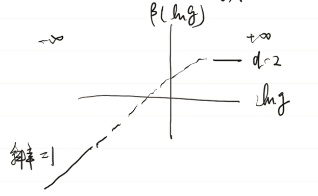

- Summary
	- Two limits to be examined frequently: metallic and localized.
- ## Model and Picture
	- Model: ((64238eab-5e73-4970-9129-9cbcc7e974fb)) with impurities
		- $$H=-t \sum_{ij} (c_i^\dagger c_j + h.c.)+\sum_i \varepsilon_i c_i^\dagger c_i$$
		- $\varepsilon_i$ are static random variables conforming to a certain distribution,
		  with $\langle \varepsilon_i \rangle=0,\langle \varepsilon_i^2 \rangle=W^2$
	- Two limits
		- When $W \ll t$, disorder is negligible, thus no localization.
		- When $W \gg t$, the system is dominated by disorder, there's much localization!
	- Self-averaging Assumption
		- For a system with disorder and an observable $\hat O$,
		  $\langle \hat O \rangle$ at thermodynamic limit = $\langle \hat O \rangle$ by disorder average
		- This means that we can obtain physical predictions by averaging over the disorder!
- ## Weak Localization
	- What's weak localization?
		- Localization at low density of disorder
	- Characteristic scale
		- Def
			- $$\gamma := \frac 1 {\pi k_F l}$$
		- When $\gamma \ll 1$, the distance between electrons are much larger than the wavelength ($\frac 1 {k_F}$),
		  thus the classical limits holds!
	- To show that something uncommon is present, we calculate the first-order quantum correction to the conductance and obtain an unphysical result.
		- Compare classical and quantum transition probability
			- Classical: Sum up probabilities.
			  $$P_{a \to b}=\sum_i P^i_{a \to b}$$
			- Quantum: Sum up amplitudes.
			  $$P_{a \to b}=|\sum_i A_i|^2$$
			- #+BEGIN_NOTE
			  Usually the cross-terms cancel and the quantum picture goes back to the classical picture.
			  However, the cross terms sometimes play a huge role, which we're interested in here.
			  #+END_NOTE
		- Situation with large quantum corrections
			- The particle traces a loop in the space of states, i.e. the probability is $P_{a \to a}$
				- The point is that the path can be **reversed**, then TRS comes into play.
			- The system has time-reversal symmetry
			- Here the quantum probability 
			  $$|A_i+A_{\bar i}|=4|A_i|^2=4P_i$$
			  which is significantly different from the classical one.
		- *Detailed calculation is omitted here. Could refer to Philip Phillips or the handwritten notes.
		- ### Conclusion
			- The perturbative calculation of the conductance **diverges** when $T \to 0$ and $d=1,2$, which is a hint of localization.
- ## Thouless Number and [[RG]]
	- Thouless Number
		- Def. 
		  $$g(L):=\frac{2\hbar}{e^2} G(L) \equiv \frac{2\hbar}{e^2} \frac 1 R$$
			- Intuitively, a dimensionless 'conductance'!
			- Generally we want a quantity independent of the system size (like $\sigma$).
			  But here $g(L)$, depending on the size $L$, turns out to be more convenient in RG, which concerns **how the properties change with the system size**.
		- It can be related to a microscopic definition $\frac{\Delta E}{dE/dN}$, which can be argued from the limits of metals and localized states.
	- RG method #card
		- *Reminder card. No need to recall the details; just appreciate the thought.*
		- Quantity to be concerned:
		  $$\beta(\ln g):=\lim_{L \to \infty} \frac {d \ln g(L)}{d \ln L}$$
			- This is the **relevance** of $g(L)$.
			  If $\beta > 1$ the system would flow to a conductor (metal-like); if $\beta < 1$ it flows to an insulator (localization-like)
		- Two limits
			- Metallic
				- $\sigma \to \sigma_0$, $g(L) \sim \sigma_0 L^{d-2}$
				- $\beta \to d-2$
			- Localized
				- $g \sim e^{-L / \xi}$ (corresponding to the decay of the wavefunction)
				- $\beta \sim -L/ \xi \to -\infty$
		- **Assumption**
			- $\beta(\ln g)$ is monotone in $\ln g$
				- Mr. Qi gave a diagram:
				  {:height 274, :width 335}
				- This is still a bit problematic for me.
				  background-color:: red
					- $\ln g$ is a **function** of $L$, not a scalar. So is $\beta$ a functional?
					- Then what does 'monotone' mean? We could say 'a function is monotone in a variable', but what is 'a functional is monotone in a function'?
				- $\ln g$ in the diagram should actually mean 'the asymptotic behavior of $\ln g$, or 'how close a system is to a metal'.
		- Conclusion
			- When $d=3$: $\beta=1$ when $\ln g \to \infty$. So there is a critical point of localization.
				- The parameter of criticality is 'how metallic it is'.
			- When $d=1,2$: $\beta$ always smaller than zero, thus always localized?
				- Actually this is not the case; we haven't seen localization in 1D or 2D electron systems.
					- Mr. Qi said this is due to interaction and decoherence, but I'm suspicious.
					- I think it is more likely that the behavior of $\beta$ cannot be described by a single parameter (such as $\ln g$).
			-
			-
-