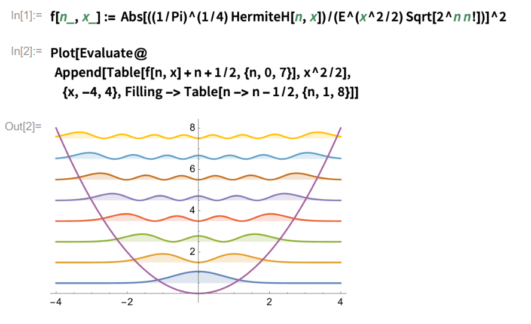
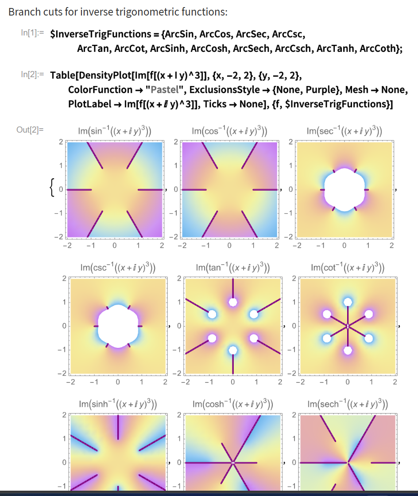

alias:: MMA

- #+BEGIN_TIP
  The advantage of MMA is massive built-in functions and flexible syntax, which allows writing simple code in a short time.
  If you want to write a large bulk of high-performance code, it's better to turn to other languages.
  #+END_TIP
- # Tutorials
  collapsed:: true
	- [Project Euler (1–10) | Stone Zeng’s Site (stone-zeng.site)](https://stone-zeng.site/2020-08-07-euler-1-10)
- # Philosophy #card
  card-last-interval:: 28.47
  card-repeats:: 1
  card-ease-factor:: 2.6
  card-next-schedule:: 2024-02-01T12:16:27.072Z
  card-last-reviewed:: 2024-01-04T01:16:27.072Z
  card-last-score:: 5
	- Everything is an expression.
	  collapsed:: true
		- First, we have **atom expressions** including numbers, strings, symbols, etc.
		- Functions like `f[x1,x2,x3]` are also expressions.
		  `f` is called the **head** of the expression.
		- Then `Apply` (or `@@`) is just 'adding a head to a headless list'.
	- Calculation is rewriting.
	  collapsed:: true
		- Calculation is done by matching and replacing **symbols**, regardless of 'intrinsic mathematical meaning'.
		-
- # Basic Syntax
	- Comment
	  collapsed:: true
		- Use `(*` and `*)` to enclose comments.
	- Combine multiple expressions into one #card
	  card-last-interval:: 31.26
	  card-repeats:: 1
	  card-ease-factor:: 2.6
	  card-next-schedule:: 2024-04-19T07:16:00.061Z
	  card-last-reviewed:: 2024-03-19T01:16:00.061Z
	  card-last-score:: 5
	  collapsed:: true
		- Use `;`
		- Example. `If[x>50, AppendTo[arr,a]; n=n+1]`
			- If x>50, then the combined expression `AppendTo[arr,a]; n=n+1` would be executed.
	- Prefix and postfix #card
	  card-last-interval:: 42
	  card-repeats:: 2
	  card-ease-factor:: 2.7
	  card-next-schedule:: 2024-05-03T01:20:57.944Z
	  card-last-reviewed:: 2024-03-22T01:20:57.945Z
	  card-last-score:: 5
	  collapsed:: true
		- `f[x] == f @ x == x // f`
		- For example, we can write `Eigenvalues[x] // N // Sort`
		- #+BEGIN_TIP
		  This avoids nesting a hundred brackets.
		  #+END_TIP
	- `@`, `@@`, `/@`, `@@@` #card
	  card-last-interval:: 31.26
	  card-repeats:: 1
	  card-ease-factor:: 2.6
	  card-next-schedule:: 2024-03-02T12:36:58.652Z
	  card-last-reviewed:: 2024-01-31T06:36:58.653Z
	  card-last-score:: 5
	  collapsed:: true
		- Prefix
		- 换头(`Apply`)
		- apply to every element (`Map`)
		- Map+Apply (`MapApply`)
		- See ((6576b18e-05b7-414b-bec2-4fb3d8161be2))
	- `./`, `:>`, `/;` and `?`, #card
	  card-last-interval:: 31.26
	  card-repeats:: 1
	  card-ease-factor:: 2.6
	  card-next-schedule:: 2024-01-25T06:38:53.911Z
	  card-last-reviewed:: 2023-12-25T00:38:53.911Z
	  card-last-score:: 5
		- Rule, RuleDelayed, Condition
		- See ((657e47c7-66ce-4f78-ba70-b3920f4feeeb))
	- Array element #card
	  card-last-interval:: 31.26
	  card-repeats:: 1
	  card-ease-factor:: 2.6
	  card-next-schedule:: 2024-01-25T06:30:28.081Z
	  card-last-reviewed:: 2023-12-25T00:30:28.082Z
	  card-last-score:: 5
		- `arr[[i]]`
		- Note that we need a **double** bracket.
	- Association (dictionary) `<|a -> x, b -> y, c -> z|>`
	- `;` to suppress the printing of an expression.
	-
	-
- # Core Language
  collapsed:: true
	- List vs sequence
		- Roughly speaking, a list is an array and a sequence is the set of elements in the array without brackets on both sides.
	- ## Pattern Matching
	  id:: 657e47c7-66ce-4f78-ba70-b3920f4feeeb
		- Notes #card
		  card-last-interval:: 31.26
		  card-repeats:: 1
		  card-ease-factor:: 2.6
		  card-next-schedule:: 2024-01-22T07:17:18.858Z
		  card-last-reviewed:: 2023-12-22T01:17:18.859Z
		  card-last-score:: 5
			- Matching is always done on the level of **symbols** (based on the built-in function `FullForm`) rather than math.
			  collapsed:: true
				- For example, `x^_` doesn't match `x` though mathematically `x=x^1`.
			- Matching is based on **FullForm**.
			  collapsed:: true
				- `1/x` would be matched by `a_^n_`, but not `a_ /b_` 
				  id:: 6581a195-40f1-4e16-b242-1b3df6f73873
				  collapsed:: true
					- The full form of `1/x` is `Power[x,-1]`.
					- The full form the second pattern is `Times[a_,Power[b_,-1]]`. Note that `2/x` would match `a_/b_`!
			- Commutativity and associativity
				- For example, `Plus` is both `Flat` and `Orderless`, thus mathematica would try equivalent forms.
				- ((65865017-99b4-4155-942a-33f0c0603773))
		- Patterns
			- Blank pattern `_`
				- `_` matches any expression.
				  collapsed:: true
					- `MatchQ[a/b, _/_]`
				- `_h` matches any expression **with head h**.
			- Sequences: `__` and `___`
				-
		- ## Naming and reusing of pattern objects
		  collapsed:: true
			- `sym:obj` or `Pattern[sym,obj]`
			- The form `s_` is equivalent to `s:_.` Similarly, `s_h` is equivalent to `s:_h`.
			- Examples
			  collapsed:: true
				- `{1, x, x^2, x^3} /. x^n_ -> r[n]`
				- `{f[h[4], h[4]], f[h[4], h[5]]} /. f[x : h[_], x_] -> r[x]`
				  collapsed:: true
					- `f[x : h[_], x_]` forces the first parameter and the second parameter of `f` to be identical, both in the form `h[_]`.
		- Basic usages of`./` #card
		  card-last-interval:: 32.57
		  card-repeats:: 1
		  card-ease-factor:: 2.36
		  card-next-schedule:: 2024-04-24T13:55:36.543Z
		  card-last-reviewed:: 2024-03-23T00:55:36.544Z
		  card-last-score:: 3
			- Replace a variable with a value / list
				- `{x, x^2, y, z} /. x -> 1` gives `{1, 1, y, z}`
				- `{x, x^2, y, z} /. x -> {a, b}` gives `{{a,b}, {a^2,b^2}, {y,z}}`
			- Replace a function
				- `Sin[x] /. Sin -> Cos` gives `Cos[x]`
			- Replace matching part with a pattern, like regex
				- `1 + x^2 + x^4 /. x^p_ :> f[p]` gives {1 + f[2] + f[4]}
					- Here `x^p_` is a rule
			- Apply a set of rules separately
				- `x /. {{x -> 1}, {x -> 3}, {x -> 7}}` gives `{1,3,7}`
			-
		- Condition `/;` and PatternTest `?`
		  collapsed:: true
			- PatternTest `?` is simpler.
			  collapsed:: true
				- `Cases[{1, 2, 3, 4, 5}, _?OddQ]` picks out all odd numbers.
			- Condition `/;` is more flexible and powerful.
			  collapsed:: true
				- `{6, -7, 3, 2, -1, -2} /. (x_ /; x < 0) -> w` replaces `x` by `w` if `x` is negative.
		- Functions
		  collapsed:: true
			- `Case` lists all matched patterns.
			  collapsed:: true
				- `Cases[{1, 1, f[a], 2, 3, y, f[8], 9, f[10]}, Except[_Integer]]` gives `{f[a], y, f[8], f[10]}`
				-
			- `Deletecases` deletes matched patterns.
			  collapsed:: true
				- `DeleteCases[{1, 1, x, 2, 3, y, 9, y}, _Integer]`
		- RuleDelayed `:>` #card
			- Example 1
				- ```
				  n = 1; 
				  {x, x, a, b, x, x, c, d} /. x :> n++ 
				  ```
					- This outputs {1, 2, a, b, 3, 4, c, d}, which runs `++` every time the rule is applied.
				- ```
				  n = 1; 
				  {x, x, a, b, x, x, c, d} /. x -> n++
				  ```
					- This outputs {1, 1, a, b, 1, 1, c, d}, which only runs `++` after applying the rules to all matching cases.
			- Example 2
				- ```
				  {x, x, x} /. x :> RandomReal[]
				  {x, x, x} /. x -> RandomReal[]
				  ```
				- The first line outputs three different random numbers
				- The second only runs `RandomReal[]` once, so it outputs the same number three times.
			- Example 3
				- `{1, 2, 3, 4, 5, 6, 12, 14, 16} /. x_ :> x^2 /; EvenQ[x] && x > 10` correctly square all even numbers greater than 10.
					- Note that it is equivalent to `{1, 2, 3, 4, 5, 6, 12, 14, 16} /. (x_ /; EvenQ[x] && x > 10 ) -> x^2 `
				- However, `{1, 2, 3, 4, 5, 6, 12, 14, 16} /. x_ -> x^2 /; EvenQ[x] && x > 10` outputs something like
				  {1, 4, 9, 16, 25, 36, 144, 196, 256} /; EvenQ[{1, 2, 3, 4, 5, 6, 12, 14, 16}] && {1, 2, 3, 4, 5, 6, 12, 14, 16} > 10
					- It seems that the condition has only been evaluated once.
				- #+BEGIN_TIP
				  This is bad style. We'd better write `{1, 2, 3, 4, 12, 14, 16} /. (x_ /; EvenQ[x] && x > 10 ) -> x^2`, i.e. enclose the conditional rule with a bracket.
				  #+END_TIP
	- ## Functions and Functional Programming
	  collapsed:: true
		- Functions and lists
		  id:: 6576b18e-05b7-414b-bec2-4fb3d8161be2
		  collapsed:: true
			- Map vs Apply vs Scan
				- `Map` wraps (sub)expressions in a given Head, and returns the modified input
				- `Apply` replaces Heads in (sub)expressions, and returns the modified input
					- `f @@ {x,y,z}` gives `f[x,y,z]`
				- `Scan` "visits" (sub)expressions, evaluates each of them, and returns `Null`
					- In `Scan[Print["Hey! I'm ", #] &, {a, b, c}]` we need Print to output something.
					- `f[x_]:=x^2; Scan[f, {1,2,3}]` returns nothing.
			- Evaluate f on each element of a list
				- `f /@ {a,b,c}` gives `{f[a], f[b], f[c]}`
			- 换头术
				- Both `f @@ {x,y,z}` and `f @@ g[x,y,z]` gives `f[x,y,z]`.
				- Note that in the previous case of usage, we actually replaces the Head `List` by `f`.
			- Keep the index of arguments in the list
				- `MapIndexed[f, {a, b, c, d}]` gives {{f[a, 1]}, {f[b, 2]}, {f[c, 3]}, {f[d, 4]}}
			- MapThread
				- `MapThread[f, {{a, b, c}, {x, y, z}}]` gives {f[a, x], f[b, y], f[c, z]}
		- Attributes of functions
		  id:: 65865017-99b4-4155-942a-33f0c0603773
		  collapsed:: true
			- #+BEGIN_TIP
			  They are mostly useful in pattern matching, since Mathematica would try to match equivalent forms.
			  #+END_TIP
			- Orderless (Commutativity)
			- Flat (Associativity)
				- `SetAttributes[f,Flat]; f[x, f[y, z]] == f[f[x, y], z] == f[x, y, z]` gives True.
			- OneIdentity
				- Indicate `f[x]=x`
				- `Plus` has this attribute.
		- Function of functions
			- `f = Function[x,Function[y, x + y]]`
				- `f[x]` returns a function that adds `x` to its argument.
		- Iteratively apply functions
			- `Nest[]`
			- `NestWhile[]` and `NestWhileList[]`
				- Iterate with condition
				- `NestWhile[#^2 &, 2, (# < 10^10) &]`
				- `NestWhileList[]` would generate a list of internal results
			- `FixPoint[]`
		- `Fold[]`
			- Apply iteratively with elements in the list as arguments in each layer
			- `Fold[f, x, {a, b, c, d}]` gives f[f[f[f[x, a], b], c], d]
	- ## Module and Local Variables
	  collapsed:: true
		- By default, variables in Mathematica are global, which can cause confusions.
		-
		- `Module[{x,y,...}, expr]`
			- The first argument is a list of **local** variables.
			- The second argument is the expression to be evaluated in the module.
			-
			- Example. `q[n_] :=Module[{x}, Integrate[f[x] x^n, {x, 0, 1}]]`
				- Common usage: Define a dummy variable
		- `With[{x=x0,y=y0,...}, expr]`
			- The first argument is a list of **local constants**.
		- Context
			- Similar to namespaces in C++.
	- ## Value assignment
		- Functions
		  collapsed:: true
			- `clear` **vs** `remove`
				- Clear the value **vs** remove the symbol completely
			-
		- Upvalue and Downvalue #card
		  collapsed:: true
			- Idea
				- Value assignment (including delayed ones) are actually **global rules**. Rules are associated with specific **symbols**.
				- Thus we have two choices: Associate the rule with the head (Downvalue) or the argument (Upvalue).
				-
				-
				- 重载常见运算时，用upvalue效率更高、更自然（将重载运算视为与自定义类型相联系，而不是与plus相联系；因此使用plus的其他定义时，不需要检查此条规则）。
			- Usage
				- When reloading common operations (e.g. plus), upvalue would be more efficient than downvalue since the rule would only be checked when adding two self-defined types.
				- `f[x_] + f[y_] ^:= f[x+y]`
				- `f[g[x_]] ^:= fg[x]`
		- Delayed or not?
			-
		- Trick: Store obtained values for future use #card
		  card-last-interval:: 31.26
		  card-repeats:: 1
		  card-ease-factor:: 2.6
		  card-next-schedule:: 2024-04-15T06:43:15.859Z
		  card-last-reviewed:: 2024-03-15T00:43:15.859Z
		  card-last-score:: 5
			- `g[0] = 1; g[1] = 1; g[n_] := g[n] = g[n - 1] + g[n - 2];`
- # Visualization and Demonstration #card
  card-last-interval:: 31.26
  card-repeats:: 1
  card-ease-factor:: 2.36
  card-next-schedule:: 2024-01-26T07:10:42.076Z
  card-last-reviewed:: 2023-12-26T01:10:42.077Z
  card-last-score:: 3
  collapsed:: true
	- ## Plot
		- Plot a single function
			- `Plot[f, {x, x_min, x_max}]`
		- Plot multiple functions
			- `Plot[{f1, f2, f3}, {x, x_min, x_max}]`
		- Further possibilities
			- Plot legends
			- Label each curve
			- Fill below a curve / between two curves
		- GraphPlot
		  collapsed:: true
			- Plot networks
			- {:height 303, :width 385}
		- PolarPlot
		- ### 3D
			- `Plot3D[f, {x, x_min, x_max}, {y, y_min, y_max}]`
			- Density plot
			- SliceContourPlot
			  collapsed:: true
				- Take slices and plot contours.
			- Sphericalplot
		- ### Vector
			- VectorPlot
			- StreamPlot
	- `Animate[]`
	  collapsed:: true
		- Make a GIF by changing parameters with time.
	- `Manipulate[]`
	  collapsed:: true
		- Allows adjusting parameter in the plot.
- # Multi-File and External Programs
  collapsed:: true
	- id:: 6588ec88-f902-4712-9b28-4b1d2c7feaa7
	  #+BEGIN_NOTE
	  External program is to make use of existing libraries, e.g. OpenSSL.
	  If you just want to execute a piece of code faster, use `Compile` (and possibly compile to C and parallelize).
	  #+END_NOTE
	- `<<` reads a file, evaluates all expressions and return the last one.
	- `ExternalFunction[language, code]`
		- Language could be Python, Julia, NodeJS, Ruby, etc.
		- `code` is a **string** of code to be evaluated.
		- Example. `abs=ExternalFunction["Python","abs"]`
	- ## CLink
		- Connect Mathematica with C/C++
		- `ForeignFunctionLoad[]`
			- Loads external function from DLL
		- **wscc** could compile C code into functions that Mathematica coud `Install` and call.
- # Benchmark and Optimization
  collapsed:: true
	- {{embed ((6588ec88-f902-4712-9b28-4b1d2c7feaa7))}}
	- ## Benchmark
	  collapsed:: true
		- Time
			- `Timing[]` counts the time the CPU used, without counting Internet query time, pause time, etc.
			- `RepeatedTiming[]` evaluates the expr many times and takes the average.
			- `AbsoluteTiming[]` counts the real-time elapsed to evaluate the expr.
		- Memory
			- `ByteCount[expr]` calculates memory used by expr.
			- `MemoryInUse[]`
	- ## Compile and Parallelize: Usage and Options #card
		- `Compile[{{x1,t1}, {x2,t2}, ...}, expr]`
			- Returns a compiled function to evaluate expr, with arguments `x1` of type `t1`, `x2` of type `t2`, ...
			- Options
				- `Parallelization -> True` creates **parallel** code.
				- `CompilationTarget -> C` first creates C code, then compiles the **C code** to an external library, which is much faster than WVM.
					- Note: A tested workflow is to download **winlibs** of MinGW64 and use
					  ```
					  $CCompiler =
					      {"Compiler" -> CCompilerDriver`GenericCCompiler`GenericCCompiler,
					       "CompilerInstallation" -> "Location\\winlibs-11.0.1\\mingw64\\bin",
					       "CompilerName" -> "gcc.exe"}
					  ```
					- Actually we need only **gcc**. Therefore, in principle we can use the same settings in MMA and a different way (than winlibs) to obtain gcc.
			- Example. `cf = Compile[{{x, _Real}}, Sin[x] + x^2 - 1/(1 + x)]`
				- `cf` is a compiled function, takes an argument `x` of Real type.
		- `Parallelize[expr]`
			- Evaluate `expr` in parallel
	- Performance Tips #card
	  collapsed:: true
		- **Pure function** is faster than pattern matching.
			- Example. 
			  ```
			  vec = RandomReal[{-100, 100}, 10^6];
			  
			  f1 = #^2 + 1 &;
			  f2[x_] := x^2 + 1;
			  
			  Timing[# /@ vec][[1]] & /@ {f1, f2}
			  ```
				- The pure function takes about 0.16s, while the pattern-matching takes about 0.7s.
		- Use built-in functions rather than writing my own.
			- `Sum`, `Total`, etc.
		- Use tables rather than loops.
			- Tables run on internal loops, which is significantly than user-written loops.
- # Useful Functions
	- Substitutions of `for` and `if`
	  collapsed:: true
		- Nestwhile
		- `Select[list, criterion]`
		  collapsed:: true
			- Pick out all elements `x` in `list `for which `criterion[x]` is true.
	- ## Random
	  collapsed:: true
		- Note: Generating a random array is much faster than generating the elements one-by-one.
		- `RandomReal[{x_min,x_max}]`
		  collapsed:: true
			- Note that the input should be a list.
		- RandomInteger
	- ## Sow and Reap
	  collapsed:: true
		- Basically, `Sow` marks expressions with tags while executing the parent function.
		  Then `Reap` retrieves all sown values.
		- Examples
		  collapsed:: true
			- `Reap[Sow[#,Mod[#^2,9]] & /@ Range[20]]` gives `{{1,2,3,4,5,6,7,8,9,10,11,12,13,14,15,16,17,18,19,20},{{1,8,10,17,19},{2,7,11,16,20},{3,6,9,12,15,18},{4,5,13,14}}}`
			  collapsed:: true
				- `[[2]]` is the desired classification by `Mod[x^2,9]`.
			-
		- Notes
		  collapsed:: true
			- The first element of the returned list is always a list of all sown elements.
			  We should take the element `[[2]]`.
- # Interesting Examples
  collapsed:: true
	- {:height 293, :width 395}
	  collapsed:: true
		- `f` generates the wavefunction of the nth level
		- `Evaluate` causes an expression to be evaluated even if it appears as an argument of a function specified to be unevaluated.
		- `@` is the prefix
		- `Append` adds an elements to a list.
		  collapsed:: true
			- Here the appended element is $x^2/2$, the potential.
		- `Table` generates a list by applying the expr in the first argument to the following list (or iterator). Similar to `/@`.
		-
	- {:height 744, :width 534}
	  collapsed:: true
		- `$` isn't a special symbol in Mathematica. Just a convention to define global variables.
		-