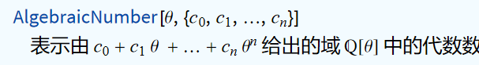

alias:: MMA

- # Tutorials
	- [Project Euler (1–10) | Stone Zeng’s Site (stone-zeng.site)](https://stone-zeng.site/2020-08-07-euler-1-10)
- # Philosophy #card
	- Everything is an expression.
		- First, we have **atom expressions** including numbers, strings, symbols, etc.
		- Functions like `f[x1,x2,x3]` are also expressions.
		  `f` is called the **head** of the expression.
		- Then `Apply` (or `@@`) is just 'adding a head to a headless list'.
	- Calculation is rewriting.
		- Calculation is done by matching and replacing **symbols**, regardless of 'intrinsic mathematical meaning'.
		-
	- List vs sequence
		- Roughly speaking, a list is an array and a sequence is the set of elements in the array without brackets on both sides.
- # Basic Syntax
	- Comment
		- Use `(*` and `*)` to enclose comments.
	- Combine multiple expressions into one #card
	  collapsed:: true
		- Use `;`
		- Example. `If[x>50, AppendTo[arr,a]; n=n+1]`
			- If x>50, then the combined expression `AppendTo[arr,a]; n=n+1` would be executed.
	- Prefix and postfix #card
	  collapsed:: true
		- `f[x] == f @ x == x // f`
		- For example, we can write `Eigenvalues[x] // N // Sort`
		- #+BEGIN_TIP
		  This avoids nesting a hundred brackets.
		  #+END_TIP
	- Functions and lists #card
		- Evaluate f on each element of a list
			- `f /@ {a,b,c}` gives `{f[a], f[b], f[c]}`
		- Use a list as arguments of a function
			- `f @@ {x,y,z}` gives `f[x,y,z]`
	- RuleDelayed `:>` #card
		- Example 1
			- ```
			  n = 1; 
			  {x, x, a, b, x, x, c, d} /. x :> n++ 
			  ```
				- This outputs {1, 2, a, b, 3, 4, c, d}, which runs `++` every time the rule is applied.
			- ```
			  n = 1; 
			  {x, x, a, b, x, x, c, d} /. x -> n++
			  ```
				- This outputs {1, 1, a, b, 1, 1, c, d}, which only runs `++` after applying the rules to all matching cases.
		- Example 2
			- ```
			  {x, x, x} /. x :> RandomReal[]
			  {x, x, x} /. x -> RandomReal[]
			  ```
			- The first line outputs three different random numbers
			- The second only runs `RandomReal[]` once, so it outputs the same number three times.
		- Example 3
			- `{1, 2, 3, 4, 5, 6, 12, 14, 16} /. x_ :> x^2 /; EvenQ[x] && x > 10` correctly square all even numbers greater than 10.
				- Note that it is equivalent to `{1, 2, 3, 4, 5, 6, 12, 14, 16} /. (x_ /; EvenQ[x] && x > 10 ) -> x^2 `
			- However, `{1, 2, 3, 4, 5, 6, 12, 14, 16} /. x_ -> x^2 /; EvenQ[x] && x > 10` outputs something like
			  {1, 4, 9, 16, 25, 36, 144, 196, 256} /; EvenQ[{1, 2, 3, 4, 5, 6, 12, 14, 16}] && {1, 2, 3, 4, 5, 6, 12, 14, 16} > 10
				- It seems that the condition has only been evaluated once.
			- #+BEGIN_TIP
			  This is bad style. We'd better write `{1, 2, 3, 4, 12, 14, 16} /. (x_ /; EvenQ[x] && x > 10 ) -> x^2`, i.e. enclose the conditional rule with a bracket.
			  #+END_TIP
	- Replacement with a rule `./` #card
	  collapsed:: true
		- Replace a variable with a value / list
			- `{x, x^2, y, z} /. x -> 1` gives `{1, 1, y, z}`
			- `{x, x^2, y, z} /. x -> {a, b}` gives `{{a,b}, {a^2,b^2}, {y,z}}`
		- Replace a function
			- `Sin[x] /. Sin -> Cos` gives `Cos[x]`
		- Replace matching part with a pattern, like regex
			- `1 + x^2 + x^4 /. x^p_ :> f[p]` gives {1 + f[2] + f[4]}
				- Here `x^p_` is a rule
		- Apply a set of rules separately
			- `x /. {{x -> 1}, {x -> 3}, {x -> 7}}` gives `{1,3,7}`
		-
	- Array element #card
		- `arr[[i]]`
		- Note that we need a **double** bracket.
	-
- # Pattern Matching
	- Notes #card
	  card-last-interval:: 31.26
	  card-repeats:: 1
	  card-ease-factor:: 2.6
	  card-next-schedule:: 2024-01-22T07:17:18.858Z
	  card-last-reviewed:: 2023-12-22T01:17:18.859Z
	  card-last-score:: 5
	  collapsed:: true
		- Matching is always done on the level of **symbols** (based on the built-in function `FullForm`) rather than math.
			- For example, `x^_` doesn't match `x` though mathematically `x=x^1`.
		- Matching is based on **FullForm**.
			- `1/x` would be matched by `a_^n_`, but not `a_ /b_` 
			  id:: 6581a195-40f1-4e16-b242-1b3df6f73873
				- The full form of `1/x` is `Power[x,-1]`.
				- The full form the second pattern is `Times[a_,Power[b_,-1]]`. Note that `2/x` would match `a_/b_`!
		- Commutativity and associativity
			- For example, `Plus` is both `Flat` and `Orderless`, thus mathematica would try equivalent forms.
	- Patterns
	  collapsed:: true
		- Blank pattern `_`
			- `_` matches any expression.
				- `MatchQ[a/b, _/_]`
			- `_h` matches any expression **with head h**.
	- ## Naming and reusing of pattern objects
	  collapsed:: true
		- `sym:obj` or `Pattern[sym,obj]`
		- The form `s_` is equivalent to `s:_.` Similarly, `s_h` is equivalent to `s:_h`.
		- Examples
			- `{1, x, x^2, x^3} /. x^n_ -> r[n]`
			- `{f[h[4], h[4]], f[h[4], h[5]]} /. f[x : h[_], x_] -> r[x]`
				- `f[x : h[_], x_]` forces the first parameter and the second parameter of `f` to be identical, both in the form `h[_]`.
	- Condition `/;` and PatternTest `?` #card
		- PatternTest `?` is simpler.
			- `Cases[{1, 2, 3, 4, 5}, _?OddQ]` picks out all odd numbers.
		- Condition `/;` is more flexible and powerful.
			- `{6, -7, 3, 2, -1, -2} /. (x_ /; x < 0) -> w` replaces `x` by `w` if `x` is negative.
	- Functions
	  collapsed:: true
		- `Case` lists all matched patterns.
			- `Cases[{1, 1, f[a], 2, 3, y, f[8], 9, f[10]}, Except[_Integer]]` gives `{f[a], y, f[8], f[10]}`
			-
		- `Deletecases` deletes matched patterns.
			- `DeleteCases[{1, 1, x, 2, 3, y, 9, y}, _Integer]`
- # Useful Functions
	- Substitutions of `for` and `if`
		- Nestwhile
		- `Select[list, criterion]`
			- Pick out all elements `x` in `list `for which `criterion[x]` is true.
	- ## Random
	  collapsed:: true
		- Note: Generating a random array is much faster than generating the elements one-by-one.
		- `RandomReal[{x_min,x_max}]`
			- Note that the input should be a list.
		- RandomInteger
	- ## Sow and Reap
	  collapsed:: true
		- Basically, `Sow` marks expressions with tags while executing the parent function.
		  Then `Reap` retrieves all sown values.
		- Examples
			- `Reap[Sow[#,Mod[#^2,9]] & /@ Range[20]]` gives `{{1,2,3,4,5,6,7,8,9,10,11,12,13,14,15,16,17,18,19,20},{{1,8,10,17,19},{2,7,11,16,20},{3,6,9,12,15,18},{4,5,13,14}}}`
				- `[[2]]` is the desired classification by `Mod[x^2,9]`.
			-
		- Notes
			- The first element of the returned list is always a list of all sown elements.
			  We should take the element `[[2]]`.
- # Visualization and Demonstration #card
	- ## Plot
	  collapsed:: true
		- Plot a single function
		  collapsed:: true
			- `Plot[f, {x, x_min, x_max}]`
		- Plot multiple functions
		  collapsed:: true
			- `Plot[{f1, f2, f3}, {x, x_min, x_max}]`
		- Further possibilities
		  collapsed:: true
			- Plot legends
			- Label each curve
			- Fill below a curve / between two curves
		- GraphPlot
		  collapsed:: true
			- Plot networks
			- {:height 303, :width 385}
		- PolarPlot
		- ### 3D
		  collapsed:: true
			- `Plot[f, {x, x_min, x_max}, {y, y_min, y_max}]`
			- Further possibilities
			  collapsed:: true
				- Density plot
				- SliceContourPlot: Take slices and plot contours.
				- Sphericalplot
		- ### Vector
			- VectorPlot
			- StreamPlot
	- `Animate[]`
		- Make a GIF by changing parameters with time.
	- `Manipulate[]`
		- Allows adjusting parameter in the plot.
- # Tricks
	- Suppress output of a line by `;`
- # Interesting Examples
  collapsed:: true
	- {:height 293, :width 395}
	  collapsed:: true
		- `f` generates the wavefunction of the nth level
		- `Evaluate` causes an expression to be evaluated even if it appears as an argument of a function specified to be unevaluated.
		- `@` is the prefix
		- `Append` adds an elements to a list.
			- Here the appended element is $x^2/2$, the potential.
		- `Table` generates a list by applying the expr in the first argument to the following list (or iterator). Similar to `/@`.
		-
	- {:height 744, :width 534}
		- `$` isn't a special symbol in Mathematica. Just a convention to define global variables.
		-
- # Algebraic Number Theory
  collapsed:: true
	- Ref. MMA/guide/AlgebraicNumberTheory
	- ## Useful functions
		- Represent algebraic numbers
			- AlgebraicNumber
				- 
				- Theta can be represented by the function `Root`
				- eg. `AlgebraicNumber[Root[#^3 + # + 1 &, 3], {1, 2, 1}]`
			- ToNumberField
				- Putting different algebraic numbers in a common extension could accelerate computation.
		- Characters
			- AlgebraicNumberNorm
			- AlgebraicNumberTrace
			- AlgebracNumberDenominator
			- NumberFieldDiscriminant
			-