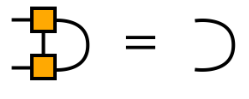

- 
	- A good review
- # Setup
	- Orthogonality conditions
	  collapsed:: true
		- Left-orthogonal
			- $$
			  \sum_s A^{s \dagger} A^s=1
			  $$
			-
		- Right-orthogonal
			- $$
			  \sum_s B^s B^{s \dagger}=1
			  $$
			- 
	- The canonical form, or the $\Gamma\Lambda$ notation
		- $$
		  |\psi\rangle=\sum_{\sigma_1, \ldots, \sigma_L} \Gamma^{\sigma_1} \Lambda^{[1]} \Gamma^{\sigma_2} \Lambda^{[2]} \Gamma^{\sigma_3} \Lambda^{[3]} \ldots \Gamma^{\sigma_{L-1}} \Lambda^{[L-1]} \Gamma^{\sigma_L}\left|\sigma_1, \ldots, \sigma_L\right\rangle
		  $$
			- ((65162fcb-b5f4-4d8e-9538-589a13f1261c))
			- $\Gamma$ holds the physical index
			- $\Lambda$ is diagonal and only has inner indices
			-
		- The benefit is that the Schmidt decomposition is explicit in the form.
		- To obtain the $\Gamma \Lambda$ form, we could either use SVD or use QR decomposition.
		-
- # Idea
  collapsed:: true
	- We optimize local tensors one by one.
	- After several rounds we expect to find an accurate tensor network.
- # The Algorithm
  collapsed:: true
	- ## Summary
		- 
		- 
	- ## Step 0. Setup
		- Set all matrices in right-orthogonal form (except the leftest one, which is to be optimized)
	- ## Step 1. Local Optimization
	  collapsed:: true
		- First contract the whole environment and only leave the tensor to be optimized.
			- 
		- Find the locally optimal matrix (by gradient descent, iterative algorithms, etc.), i.e. the largest eigenvalue of $-H$
		-
		- Perform SVD to decompose a left-orthogonal matrix
			- 
			- 
		-
	- ## Step 2. Perform local optimization one-by-one for each site
	- ## Step 3. Repeat step 1 and 2 multiple times (sweeps)
- # iDMRG
	- [[2008_McCulloch_Infinite size density matrix renormalization]]
	- ## Another Simpler Formulation
		- Start from a chain of 2 sites
			- $$
			  \sum_{\sigma_1^A \sigma_1^B} \Psi^{\sigma_1^A \sigma_1^B}\left|\sigma_1^A\right\rangle\left|\sigma_1^B\right\rangle
			  $$
			- Perform SVD and truncation:
			  $$
			  \left|\psi_1\right\rangle=\sum_{\sigma_1^A \sigma_1^B} A^{[1] \sigma_1^A} \Lambda^{[1]} B^{[1] \sigma_1^B}\left|\sigma_1^A \sigma_1^B\right\rangle
			  $$
		- Step 1. Insert two sites and replace the last $\Gamma$ and minimize energy
			- $$
			  \left|\psi_2\right\rangle=\sum_{\sigma_1^A \sigma_2^A \sigma_2^B \sigma_1^B} A^{[1] \sigma_1^A} \Psi_2^{\sigma_2^A \sigma_2^B} B^{[1] \sigma_1^B}\left|\sigma_1^A \sigma_2^A \sigma_2^B \sigma_1^B\right\rangle
			  $$
				- With some prediction of the inserted state, the optimization process can be dramatically accelerated:
					- The hypothesis is that the new state should be close to the last optimized unit cell.
					- Start from 
					  $$
					  \left|\psi_{\ell}\right\rangle=\sum_{\boldsymbol{\sigma}} A^{[1] \sigma_1^A} \ldots A^{[\ell-1] \sigma_{\ell-1}^A}\left(A^{[\ell] \sigma_{\ell}^A} \Lambda^{[\ell]} B^{[\ell] \sigma_{\ell}^B}\left[\Lambda^{[\ell-1]}\right]^{-1}\right) \Lambda^{[\ell-1]} B^{[\ell-1] \sigma_{\ell-1}^B} \ldots B^{[1] \sigma_1^B}|\sigma\rangle
					  $$
					- The state after inserting two sites is guessed to be
					- $$
					  \begin{aligned}
					  & \left|\psi_{\ell+1}^{\text {guess }}\right\rangle=\sum_{\boldsymbol{\sigma}} A^{[1] \sigma_1^A} \ldots A^{[\ell-1] \sigma_{\ell-1}^A} \times \\
					  & \left(A^{[\ell] \sigma_{\ell}^A} \Lambda^{[\ell]} B^{[\ell] \sigma_{\ell+1}^A\left[\Lambda^{[\ell-1]}\right]^{-1}}\right)\left(A^{[\ell] \sigma_{\ell+1}^B} \Lambda^{[\ell]} B^{[\ell] \sigma_{\ell}^B}\left[\Lambda^{[\ell-1]}\right]^{-1}\right) \times \\
					  & \Lambda^{[\ell-1]} B^{[\ell-1] \sigma_{\ell-1}^B} \ldots B^{[1] \sigma_1^B}|\sigma\rangle
					  \end{aligned}
					  $$
					- In this ansatz, we can now identify a guess for $\Psi \sigma_{t+1}^A \sigma_{t+1}^B$ as
					  $$
					  \Psi_{\text {guess }}^{\sigma_{\ell+1}^A \sigma_{\ell+1}^B}=\Lambda^{[\ell]} B^{[\ell] \sigma_{\ell+1}^A}\left[\Lambda^{[\ell-1]}\right]^{-1} A^{[\ell] \sigma_{\ell+1}^B} \Lambda^{[\ell]}
					  $$
		- Step 2. Perform SVD
			- $$
			  \left|\psi_2\right\rangle=\sum_{\sigma_1^A \sigma_2^A \sigma_2^B \sigma_1^B} A^{[1] \sigma_1^A} A^{[2] \sigma_2^A} \Lambda^{[2]} B^{[2] \sigma_2^B} B^{[1] \sigma_1^B}\left|\sigma_1^A \sigma_2^A \sigma_2^B \sigma_1^B\right\rangle .
			  $$
			- This guarantees $A,B$ obtained at each site are left/right orthogonal.
		- Step 3. Repeat until convergence