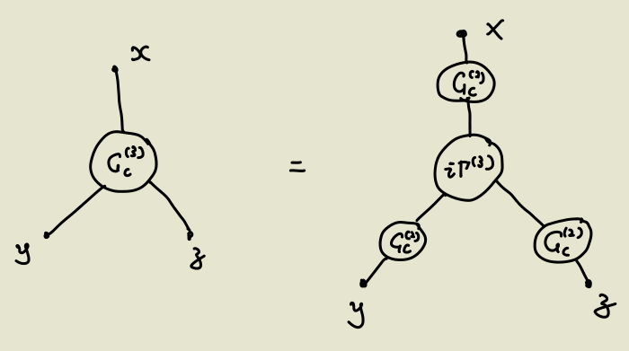

- # Def
	- Feynman Kernel
		- $$K( q'' ,t'';q' ,t') :=_{H}\left< q'',t''|q^{\prime } ,t^{\prime }\right> _{H} =_{s}\left< q''( t'')\left| e^{-iH\left( t^{\prime \prime } -t^{\prime }\right)}\right| q^{\prime }\left( t^{\prime }\right)\right> _{s}$$
		-
	-
- # QM Version
  collapsed:: true
	- Start by 
	  $$K( q'' ,t'';q' ,t') :=_{H}\left< q'',t''|q^{\prime } ,t^{\prime }\right> _{H} =_{s}\left< q''( t'')\left| e^{-iH\left( t^{\prime \prime } -t^{\prime }\right)}\right| q^{\prime }\left( t^{\prime }\right)\right> _{s}$$ 
	  and insert many interim positions $| r_i \rangle \langle r_i|$
	- $$
	  \begin{aligned}
	  K\left(\mathbf{r}_i, t_i, \mathbf{r}_{i-1}, t_{i-1}\right) & =\left\langle\mathbf{r}_i\left|\hat{U}\left(t_i, t_{i-1}\right)\right| \mathbf{r}_{i-1}\right\rangle=\left\langle\mathbf{r}_i\left|e^{-i \epsilon \hat{H} / \hbar}\right| \mathbf{r}_{i-1}\right\rangle \\
	  & =\left\langle\mathbf{r}_i\left|e^{-i \epsilon\left[\hat{\mathbf{p}}^2 / 2 m+V(\hat{\mathbf{r}})\right] / \hbar}\right| \mathbf{r}_{i-1}\right\rangle \\
	  & =e^{-i \epsilon V\left(\mathbf{r}_i\right) / \hbar} \underbrace{\left\langle\mathbf{r}_i\left|e^{-i \epsilon \hat{\mathbf{p}}^2 / 2 m \hbar}\right| \mathbf{r}_{i-1}\right\rangle}_{\text {free particle propagator }} \\
	  & =e^{-i \epsilon V\left(\mathbf{r}_i\right) / \hbar}\left(\frac{m}{2 \pi \hbar i \epsilon}\right)^{\frac{3}{2}} e^{i \epsilon m \mathbf{v}_i^2 / 2 \hbar} \\
	  & =\left(\frac{m}{2 \pi \hbar i \epsilon}\right)^{\frac{3}{2}} e^{\frac{i}{\hbar} \epsilon\left[\frac{1}{2} m \mathbf{v}_i^2-V\left(\mathbf{r}_i\right)\right]} \\
	  & =\left(\frac{m}{2 \pi \hbar i \epsilon}\right)^{\frac{3}{2}} e^{\frac{i}{\hbar} \int_{t_i}^{t_{i+1}} \mathscr{L}(\mathbf{r}, \mathbf{r}, t) d t} \\
	  & =\left(\frac{m}{2 \pi \hbar i \epsilon}\right)^{\frac{3}{2}} e^{\frac{i}{\hbar} S\left(t_{i+1}, t_i\right)}
	  \end{aligned}
	  $$
		- Exercise. Calculate the free-particle propagator. #card
		  card-last-interval:: 32.51
		  card-repeats:: 1
		  card-ease-factor:: 2.6
		  card-next-schedule:: 2023-05-06T23:33:23.468Z
		  card-last-reviewed:: 2023-04-04T11:33:23.468Z
		  card-last-score:: 5
	- Thus 
	  $$
	  K\left(\mathbf{r}^{\prime}, t^{\prime}, \mathbf{r}, t\right)=\mathscr{C} \int \mathscr{D}[\mathbf{r}(t)] e^{\frac{i}{\hbar} S[\mathbf{r}(t)]}
	  $$
	-
-
- Ref
  collapsed:: true
	- Peskin [9.2](((642bc322-b8dc-4d82-ade0-a452daad6a1d)))
- # Fundamental formula #card
  collapsed:: true
	- collapsed:: true
	  $$
	  \left\langle\phi_b(\mathbf{x})\left|e^{-i H T}\right| \phi_a(\mathbf{x})\right\rangle=\int \mathcal{D} \phi \exp \left[i \int_0^T d^4 x \mathcal{L}[\phi]\right]
	  $$
	  with constraints $\phi_a(\mathbf{x})$ at $x^0=0$ and $\phi_b(\mathbf{x})$ at $x^0=T$
		- Note that $\mathcal L[\phi]$ is the Lagrangian of a **classical** field, while $|\phi_a(x)\rangle$ (actually $\phi_a(x)|0\rangle$) is a **quantum state**.
		- Therefore, the constraints actually mean that there's a certain quantum-classical correspondence.
		  collapsed:: true
			- Compare to QM: The quantum state $|x\rangle$ corresponds to a particle at position $x$.
	- How is it consistent with the Hamiltonian formulation?
	  background-color:: red
- # Formula for Correlation Functions #card
  card-last-score:: 5
  card-repeats:: 1
  card-next-schedule:: 2023-05-07T11:19:51.760Z
  card-last-interval:: 30
  card-ease-factor:: 2.6
  card-last-reviewed:: 2023-04-07T11:19:51.763Z
  collapsed:: true
	- collapsed:: true
	  $$
	  \left\langle\Omega\left|T \phi_H\left(x_1\right) \phi_H\left(x_2\right)\right| \Omega\right\rangle=\lim _{T \rightarrow \infty(1-i c)} \frac{\int \mathcal{D} [\phi] \phi\left(x_1\right) \phi\left(x_2\right) \exp \left[i \int_{-T}^T d^4 x \mathcal{L}\right]}{\int \mathcal{D} [\phi] \exp \left[i \int_{-T}^T d^4 x \mathcal{L}\right]}
	  $$
		- This is quite similar to Gellmann-Low, but fundamentally different since here's a functional integration.
	- Proof
	  collapsed:: true
		- Observation: The pair of constraints in integration corresponds to the initial and final states.
		  Thus we break the integration into $\int \mathcal{D} \phi(x)=\int \mathcal{D} \phi_1(\mathbf{x}) \int \mathcal{D} \phi_2(\mathbf{x}) \int_{\substack{\phi\left(x_1^0, \mathbf{x}\right)=\phi_1(\mathbf{x}) \\ \phi\left(x_2^0, \mathbf{x}\right)=\phi_2(\mathbf{x})}} \mathcal{D} \phi(x)$
	- Note
	  collapsed:: true
		- This formula actually holds for arbitrary correlation functions, not just 2-point.
- # Obtain [[Feynman rules]]
  collapsed:: true
	- Example: Calculate $\int \mathcal{D} \phi e^{i S_0}$ and $\int \mathcal{D} \phi e^{i S_0} \phi\left(x_1\right) \phi\left(x_2\right)$ for the [[Klein-Gordon Theory]]
	  collapsed:: true
		- See [Peskin](((642bcdd1-ada5-4c3a-8ad9-6365a54ee3d4)))
		- Standard Technique #card
		  card-last-interval:: 30
		  card-repeats:: 1
		  card-ease-factor:: 2.6
		  card-next-schedule:: 2023-05-25T11:46:53.667Z
		  card-last-reviewed:: 2023-04-25T11:46:53.668Z
		  card-last-score:: 5
		  collapsed:: true
			- Method 1: Discretize the spacetime and do Fourier transformation, then different momenta decouple.
			  collapsed:: true
				- For the correlation function, we obtain things like
				  collapsed:: true
				  $$
				  \begin{aligned}
				  & \frac{1}{V^2} \sum_{m, l} e^{-i\left(k_m \cdot x_1+k_l \cdot x_2\right)}\left(\prod_{k_n^0>0} \int d \operatorname{Re} \phi_n d \operatorname{Im} \phi_n\right) \\
				  & \times\left(\operatorname{Re} \phi_m+i \operatorname{Im} \phi_m\right)\left(\operatorname{Re} \phi_l+i \operatorname{Im} \phi_l\right) \\
				  & \times \exp \left[-\frac{i}{V} \sum_{k_n^0>0}\left(m^2-k_n^2\right)\left[\left(\operatorname{Re} \phi_n\right)^2+\left(\operatorname{Im} \phi_n\right)^2\right]\right] \\
				  &
				  \end{aligned}
				  $$
					- For $m \neq l$ the integration vanishes since the integrand is odd. Only $m = \pm l$ terms are nonzero.
					  This is momentum conservation!
					- For higher-order correlations, the momenta pair up to obtain even terms.
					  This is Wick's theorem!
			- Method 2: Use the generating functional.
- # [[Generating Functional]]
  collapsed:: true
	- ### Idea #card
	  card-last-interval:: 32.57
	  card-repeats:: 1
	  card-ease-factor:: 2.6
	  card-next-schedule:: 2023-06-06T01:54:22.106Z
	  card-last-reviewed:: 2023-05-04T12:54:22.106Z
	  card-last-score:: 5
	  collapsed:: true
		- Set 
		  $$Z[J] \equiv \int \mathcal{D} \phi \exp \left[i \int d^4 x[\mathcal{L}+J(x) \phi(x)]\right]$$
		  Each derivative $-i \frac{\delta}{\delta J\left(x_0\right)}$ multiplies $\phi(x_0)$ to the integrand.
	- ### Basics
	  collapsed:: true
		- Rules for Functional Derivatives
		  collapsed:: true
			- $$
			  \frac{\delta}{\delta J(x)} J(y)=\delta^{(4)}(x-y)
			  $$
			-
		- Examples
		  collapsed:: true
			- $$
			  \left\langle 0\left|T \phi\left(x_1\right) \phi\left(x_2\right)\right| 0\right\rangle=\left.\frac{1}{Z_0}\left(-i \frac{\delta}{\delta J\left(x_1\right)}\right)\left(-i \frac{\delta}{\delta J\left(x_2\right)}\right) Z[J]\right|_{J=0}
			  $$
	- ### Evaluate $Z[J]$
		- Complete the square by 
		  $$
		  \phi^{\prime}(x) \equiv \phi(x)-i \int d^4 y D_F(x-y) J(y)
		  $$
		- $$
		  \begin{aligned}
		  \int d^4 x\left[\mathcal{L}_0(\phi)+J \phi\right]= & \int d^4 x\left[\frac{1}{2} \phi^{\prime}\left(-\partial^2-m^2+i \epsilon\right) \phi^{\prime}\right] \\
		  & -\int d^4 x d^4 y \frac{1}{2} J(x)\left[-i D_F(x-y)\right] J(y)
		  \end{aligned}
		  $$
		- $$Z[J]=Z[0]\exp\left\{- \frac{1}{2}\int d^4 x d^4 y J(x)\left[ D_F(x-y)\right] J(y)\right\}$$
	- ### Obtain Green Functions
	  collapsed:: true
		- Obviously [[Wick's Theorem]] kicks in: the derivatives $-i \frac{\delta}{\delta J\left(z\right)}$ must pair up to eliminate $J(z)$ and obtain $D_F(z_1-z_2)$.
		- Correlations of odd numbers of points must be zero.
	- ### Generating functional for connected Green functions, $W[J]$, and Effective action $\Gamma[\phi]$
	  collapsed:: true
		- Def
		  collapsed:: true
			- $$
			  Z[J]=e^{i W[J]}
			  $$
			  $W[J]$ is the generating functional for **connected** Green functions.
			- collapsed:: true
			  $$\phi_c (x):=\frac{\delta W[J]}{\delta J(x)}$$
				- This is $\left\langle \Omega|\phi(x)|\Omega\right\rangle$.
			- collapsed:: true
			  $$\Gamma [\phi ]\equiv W[ J_{\phi }] -\int d^{4} xJ_{\phi } (x)\phi (x)$$
				- The Legendre transformation of the connected generating functional.
		- **Basic facts**
		  collapsed:: true
			- $$\frac{\delta \Gamma [ \phi _{c}]}{\delta \phi _{c} (x)} =\int d^{4} y\frac{\delta W[J]}{\delta J(y)}\frac{\delta J(y)}{\delta \phi _{c} (x)} -\int d^{4} y\frac{\delta J(y)}{\delta \phi _{c} (x)} \phi _{c} (y)-J(x)=-J(x)$$
			- Generate connected Green functions
				- $$\frac{1}{iZ}\frac{\delta }{\delta J(x)} Z[ J]| _{J=0} =\left(\frac{1}{iZ}\frac{\delta }{\delta J(x)} iW[J]\right) e^{iW[J]}| _{J=0} =\frac{1}{i}\frac{\delta }{\delta J(x)} iW[J]| _{J=0}$$
				- $$\begin{aligned}
				  \frac{\delta ^{2} W[ J]}{\delta J( x) \delta J( y)} & =\frac{\delta }{\delta J( y)}\left[\frac{1}{iZ}\frac{\delta }{\delta J(x)} Z[ J]\right]\\
				   & =\frac{1}{iZ}\frac{\delta ^{2}}{\delta J(x)\delta J( y)} Z[ J] -\frac{1}{iZ^{2}}\left(\frac{\delta Z[ J]}{\delta J(x)}\right)\left(\frac{\delta Z[ J]}{\delta J(y)}\right)\\
				   & =i\left\langle \phi ( x) \phi ( y)\right\rangle  -i< \phi ( x)> < \phi ( y)> 
				  \end{aligned}$$
				- And similar for higher-order correlations.
			- Chain rule
			  id:: 643a0c20-abdd-4e44-ab3b-990b76db2ad2
				- $$\begin{aligned}
				  \frac{\delta }{\delta J(z)} & =\int d^{4} w\frac{\delta \phi _{c} (w)}{\delta J(z)}\frac{\delta }{\delta \phi _{c} (w)}\\
				   & =i\int d^{4} w\frac{i\delta ^{2} W[J]}{i\delta J(z)i\delta J(w)}\frac{\delta }{\delta \phi _{c} (w)}
				  \end{aligned}$$
			- Derivative of the inverse matrix
				- \begin{aligned}
				  d(A^{-1} A) & =0\\
				  d(A^{-1} )A+Ad(A^{-1} ) & =0\\
				  d(A^{-1} ) & =-A^{-1} d( A) A^{-1}
				  \end{aligned}
			-
		- Effective action and 2-point Green function
			- $$\begin{aligned}
			  -\frac{\delta }{\delta J(y)}\frac{\delta \Gamma [ \phi _{c}]}{\delta \phi _{c} (x)} & =\delta ^{(4)} (x-y)\\
			  -\frac{\delta }{\delta J(y)}\frac{\delta \Gamma [ \phi _{c}]}{\delta \phi _{c} (x)} & =-\int d^{4} z\frac{\delta \phi _{c} (z)}{\delta J(y)}\frac{\delta ^{2} \Gamma [ \phi _{c}]}{\delta \phi _{c} (z)\delta \phi _{c} (x)}\\
			   & =-\int d^{4} z\frac{\delta ^{2} W[J]}{\delta J(y)\delta J(z)}\frac{\delta ^{2} \Gamma [ \phi _{c}]}{\delta \phi _{c} (z)\delta \phi _{c} (x)}
			  \end{aligned}$$
			- Write in matrix forms this is
			  $$\left[\frac{\delta ^{2} W[J]}{\delta J\delta J}\right]\left[\frac{\delta ^{2} \Gamma [ \phi _{c}]}{\delta \phi _{c} \delta \phi _{c}}\right] =-\mathbb{1}$$
			- Note that $\frac{i\delta ^{2} W}{i\delta J( y) i\delta J( z)} =G_{con}( y,z)$, so we readily obtain that 
			  \begin{equation*}
			  \frac{\delta ^{2} \Gamma [ \phi _{c}]}{\delta \phi _{c} (z)\delta \phi _{c} (x)} =i[ G_{con}]^{-1}( x,z)
			  \end{equation*}
			-
		- Effective action and 4-point Green function
			- Summary
				- Start from the 2-point formula
				  $$\begin{equation*}
				  \frac{\delta ^{2} \Gamma [ \phi _{c}]}{\delta \phi _{c} (z)\delta \phi _{c} (x)} =i[ G_{con}]^{-1}( x,z)
				  \end{equation*}$$
				  and apply $\frac \delta {\delta \phi_c}$ successively to both sides.
				- Use ((643a0c20-abdd-4e44-ab3b-990b76db2ad2)) to transform derivatives against $\phi_c$ into Green functions.
			- 4-pt Green func:
			  \begin{equation*}
			  \begin{aligned}
			  G_{4} & =\frac{i\delta ^{4} W[ J]}{i\delta J_{x} i\delta J_{y} i\delta J_{z} i\delta J_{w}}\\
			   & =i\frac{\delta ^{2}}{\delta J_{x} \delta J_{y}}\left[\frac{\delta ^{2} \Gamma [ \phi _{c}]}{\delta \phi _{c} \delta \phi _{c}}\right]_{zw}^{-1}
			  \end{aligned}
			  \end{equation*}
			- \begin{aligned}
			  \frac{\delta }{\delta J(y)}\left[\frac{\delta ^{2} \Gamma [ \phi _{c}]}{\delta \phi _{c} \delta \phi _{c}}\right]_{zw}^{-1} & =i\int d^{4} u\ D(y,u)\frac{\delta }{\delta \phi _{c} (u)}\left[\frac{\delta ^{2} \Gamma [ \phi _{c}]}{\delta \phi _{c} \delta \phi _{c}}\right]_{zw}^{-1}\\
			   & =i\int d^{4} u\ D(y,u)\left[\frac{\delta ^{2} \Gamma [ \phi _{c}]}{\delta \phi _{c} \delta \phi _{c}}\right]_{zp}^{-1}\left[\frac{\delta ^{3} \Gamma [ \phi _{c}]}{\delta \phi _{c} \delta \phi _{c} \delta \phi _{c}}\right]_{pqu}\left[\frac{\delta ^{2} \Gamma [ \phi _{c}]}{\delta \phi _{c} \delta \phi _{c}}\right]_{qw}^{-1}\\
			   & =i\int d^{4} u\ d^{4} p\ d^{4} q\ D(y,u)D( z,p) D( q,w)\left[\frac{\delta ^{3} \Gamma [ \phi _{c}]}{\delta \phi _{c} \delta \phi _{c} \delta \phi _{c}}\right]_{pqu}
			  \end{aligned}
				- The first step uses the chain rule
				- The second step uses derivative of the inverse matrix.
				- {:height 284, :width 515}
			- \begin{aligned}
			  \frac{\delta }{\delta J( x)}\left\{\frac{\delta }{\delta J(y)}\left[\frac{\delta ^{2} \Gamma [ \phi _{c}]}{\delta \phi _{c} \delta \phi _{c}}\right]_{zw}^{-1}\right\} & =i\int d^{4} vD(x,v)\frac{\delta }{\delta \phi _{c} (v)}\left\{\frac{\delta }{\delta J(y)}\left[\frac{\delta ^{2} \Gamma [ \phi _{c}]}{\delta \phi _{c} \delta \phi _{c}}\right]_{zw}^{-1}\right\}\\
			   & =i\int d^{4} vD(x,v)\frac{\delta }{\delta \phi _{c} (v)} i\int d^{4} u\ D(y,u)\left[\frac{\delta ^{2} \Gamma [ \phi _{c}]}{\delta \phi _{c} \delta \phi _{c}}\right]_{zp}^{-1}\left[\frac{\delta ^{3} \Gamma [ \phi _{c}]}{\delta \phi _{c} \delta \phi _{c} \delta \phi _{c}}\right]_{pqu}\left[\frac{\delta ^{2} \Gamma [ \phi _{c}]}{\delta \phi _{c} \delta \phi _{c}}\right]_{qw}^{-1}\\
			   & =-\int d^{4} vd^{4} u\ D(y,u)D(x,v)\frac{\delta }{\delta \phi _{c} (v)}\left\{\left[\frac{\delta ^{2} \Gamma [ \phi _{c}]}{\delta \phi _{c} \delta \phi _{c}}\right]_{zp}^{-1}\left[\frac{\delta ^{3} \Gamma [ \phi _{c}]}{\delta \phi _{c} \delta \phi _{c} \delta \phi _{c}}\right]_{pqu}\left[\frac{\delta ^{2} \Gamma [ \phi _{c}]}{\delta \phi _{c} \delta \phi _{c}}\right]_{qw}^{-1}\right\}\\
			   & 
			  \end{aligned}
				- The process is completely anologous so we omit it here.
				-
				-
- # $T^*$ product
  collapsed:: true
	- Motivation
	  collapsed:: true
		- First, we want a covariant formalism. Time-ordered product is not.
		- Furthermore, we don't know how to calculate correlation functions involving $\partial_\mu \phi$ if we start from the Hamiltonian version of path integral.
	- Def
	  collapsed:: true
		- $$
		  \left\langle\Omega\left|T^*\left\{\partial_\mu \phi(x) \cdots\right\}\right| \Omega\right\rangle \equiv \partial_\mu^x\langle\Omega|T\{\phi(x) \cdots\}| \Omega\rangle
		  $$
	- Usage
	  collapsed:: true
		- In path integrals we only evaluate $T^*$-ordered correlation functions.
		- $$
		  \begin{aligned}
		  & \left\langle\Omega\left|T^*\left\{O\left(x_a\right) O\left(x_b\right) \ldots\right\}\right| \Omega\right\rangle \\
		  & =\frac{\int[D \phi] e^{i \int d^4 x \mathcal{L}} O(x_a) O\left(x_b\right) \ldots}{\int[D \phi] e^{i S}} \\
		  &
		  \end{aligned}
		  $$
- # Quantizing [[Dirac Theory]]
  collapsed:: true
	- To quantize spinor fields with anti-commutation relations, we need [[Grassmann Number]].
	- ## Defs
		- Grassmann field
			- A function from the spacetime to a Grassmann algebra.
				- Note that it is a classical field.
			- We can define a Grassmann field $\psi(x)$ in terms of any set of orthonormal basis functions:
			  $$
			  \psi(x)=\sum_i \psi_i \phi_i(x)
			  $$
		- Coherent fermion state
			- $$|\zeta \rangle \equiv \exp\left\{-\sum _{n} \xi _{n} \psi _{n}^{\dagger }\right\} |0\rangle $$
			  where $|0\rangle$ satisfies $\psi_n|0\rangle=0$
	- ## Basic Facts
	  collapsed:: true
		- The coherent fermion state is eigen to all field operators with
		  collapsed:: true
		  $$\psi _{n} |\zeta \rangle =\zeta _{n} |\zeta \rangle $$ #card
			- $$\begin{aligned}
			  ( \psi _{n} -\zeta _{n}) |\zeta \rangle  & =( \psi _{n} -\zeta _{n})\exp\left\{-\sum _{n} \xi _{n} \psi _{n}^{\dagger }\right\} |0\rangle \\
			   & =( \psi _{n} -\zeta _{n})\exp\left\{-\xi _{n} \psi _{n}^{\dagger }\right\}\exp\left\{-\sum _{m\neq n} \xi _{m} \psi _{m}^{\dagger }\right\} |0\rangle \\
			   & =( \psi _{n} -\xi _{n})\left( 1-\xi _{n} \psi _{n}^{\dagger }\right)\exp\left\{-\sum _{m\neq n} \xi _{m} \psi _{m}^{\dagger }\right\} |0\rangle \\
			   & =\left( \psi _{n} -\xi _{n} -\psi _{n} \xi _{n} \psi _{n}^{\dagger }\right)\exp\left\{-\sum _{m\neq n} \xi _{m} \psi _{m}^{\dagger }\right\} |0\rangle \\
			   & =\left( \psi _{n} -\xi _{n} +\xi _{n} \psi _{n} \psi _{n}^{\dagger }\right)\exp\left\{-\sum _{m\neq n} \xi _{m} \psi _{m}^{\dagger }\right\} |0\rangle 
			  \end{aligned}$$
			- In the last line, the first term vanishes, while the second and the third term cancel.
			- Note that a Grassmann number **anti-commutes** with a field operator.
		- Completeness relation
		  $$1=\int \prod _{n} d\zeta _{n}^{*} d\zeta _{n} \ |\zeta \rangle e^{-\sum _{n} \zeta _{n}^{*} \zeta _{n}} \langle \zeta |$$
			- We should first show 
			  $$
			  \langle\zeta \mid \eta\rangle=e^{\sum_n \zeta_n^* \eta_n}
			  $$
			- What's next?
			  background-color:: red
		- Fundamental formula #card
			- $$\left\langle 0\left|T \psi\left(x_1\right) \bar{\psi}\left(x_2\right)\right| 0\right\rangle=\frac{\int \mathcal{D} \bar{\psi} \mathcal{D} \psi \exp \left[i \int d^4 x \bar{\psi}(i \not \partial-m) \psi\right] \psi\left(x_1\right) \bar{\psi}\left(x_2\right)}{\int \mathcal{D} \bar{\psi} \mathcal{D} \psi \exp \left[i \int d^4 x \bar{\psi}(i \not \partial-m) \psi\right]}$$
			- Very similar to the bosonic case.
			  However, the integral is over Grassmann variables.
		-
	- ## Generating Functional
		- $$Z[\eta ,\overline{\eta } ]\equiv \int D[\psi ,\overline{\psi } ]e^{i\int d^{4} x[\mathcal{L} +\overline{\eta } (x)\psi (x)+\overline{\psi } (x)\eta (x)]}$$
		- Prop.
		  $$
		  \frac{1}{i} \frac{\delta}{\delta \eta(x)} \leftrightarrow \bar{\psi}(x) \quad-\frac{1}{i} \frac{\delta}{\delta \bar{\eta}(x)} \leftrightarrow \psi(x)
		  $$
			- Note that the second equation comes from the anti-commutation.
		- Evaluate the generating functional
			- Complete the square by $\psi (x)=\psi ^{\prime } (x)-(i\not{\partial } -m+i\varepsilon )^{-1} \eta (x)$, we find
			  \begin{aligned}
			  Z[ \eta ,\overline{\eta }] & =\int D\left[ \psi ^{\prime } ,\overline{\psi }^{\prime }\right]\exp\left[ i\int d^{4} x\left(\overline{\psi }^{\prime } (i\not{\partial } -m+i\varepsilon )\psi ^{\prime } -\overline{\eta } (i\not{\partial } -m+i\varepsilon )^{-1} \eta \right)\right]\\
			   & =\operatorname{det} [i(i\not{\partial } -m+i\varepsilon )]e^{-i\int d^{4} x\overline{\eta } (i\not{\partial } -m+i\varepsilon )^{-1} \eta } .
			  \end{aligned}
			- As usual, the inverse of $(i\not{\partial } -m+i\varepsilon )$ is the propagator for the Dirac field,
			  $$
			  \tilde{\Delta}_F(p)=\frac{i(\not p+m)}{p^2-m^2+i \varepsilon}
			  $$
- # Path Integral and Symmetry
  id:: 643a4aa5-1492-482b-a7cb-4e4bae282468
	- Comment
		- If the integral is invariant under some transformation, then we can obtain nontrivial relations.
	- Summary #card
		- The central formula is 
		  \begin{equation*}
		  \begin{aligned}
		  \int \prod _{n} D[ \phi _{n}] \ \int d^{4} x\left[\sum _{n}\frac{\delta F_{n}}{\delta \phi _{n}( x)} +\sum _{n} i\left(\frac{\delta S[ \phi ]}{\delta \phi _{n} (x)} +J_{n}\right) F_{n}[ \phi ;x]\right] \cdot \exp\left\{iS[ \phi ] +i\int d^{4} x\sum _{n} J_{n} \phi _{n}\right\} & =0
		  \end{aligned}
		  \end{equation*}
			- The infinitesimal transformation under consideration is
			  $$\begin{equation*}
			  \phi _{n} (x)\rightarrow \phi _{n}^{\prime } (x)=\phi _{n} (x)+\varepsilon F_{n}[ \phi ;x]
			  \end{equation*}$$
		- Take $F_{n}$ independent of $\phi$, the equation is zero for arbitrary $F$ implies that the 'coefficients' are zero.
		  Then the formula can be interpreted as a relation between Green functions.
		  Example.$\frac{\lambda }{4!} \phi ^{4}$ theory, $n=1$ :
		  \begin{equation*}
		  \left< \Omega \left| T\left\{\left[ -\left( \partial ^{2} +m^{2}\right) \phi (x)-\frac{\lambda }{3!} \phi ^{3} (x)\right] \phi (y)\right\}\right| \Omega \right> =i\delta ^{(4)} (x-y)
		  \end{equation*}
		-
	- ## Deriving the Central Formula
		- Start by 
		  \begin{equation*}
		  Z[ J_{n}] =\int \prod _{n} D[ \phi _{n}] \ \exp\left( iS[ \phi ] +i\int d^{4} x\ \sum _{n} J_{n} \phi _{n}\right)
		  \end{equation*}
		- Consider some infinitesimal symmetry transformation:
		  \begin{equation*}
		  \phi _{n} (x)\rightarrow \phi _{n}^{\prime } (x)=\phi _{n} (x)+\varepsilon F_{n}[ \phi ;x]
		  \end{equation*}
		- The integral becomes
		  collapsed:: true
		  \begin{equation*}
		  \begin{aligned}
		  Z'[ J_{n}] & =\int \prod _{n} D[ \phi '_{n}] \ \exp\left( iS[ \phi '] +i\int d^{4} x\sum _{n} J_{n} \phi _{n}^{\prime }\right)\\
		   & =\int \prod _{n} D[ \phi _{n}] \ \left| \operatorname{det}\frac{\partial \phi _{m}^{\prime } (y)}{\partial \phi _{n} (x)}\right| \exp\left\{iS[ \phi ] +i\int d^{4} x\sum _{n} J_{n} \phi _{n}\right. \\
		   & \left. +\int d^{4} x\left[ i\frac{\delta S[ \phi ]}{\delta \phi _{n} (x)} \delta \phi _{n} (x)+i\sum _{n} J_{n} (x)\delta \phi _{n} (x)\right] +o\left( \varepsilon ^{2}\right)\right\}
		  \end{aligned}
		  \end{equation*}
			- Note that the determinant is taken both in $x,y$ and $m,n$ since 
			  \begin{equation*}
			  \prod _{n} D[ \phi _{n}] =\prod _{n}\prod _{x} D[ \phi _{n}( x)]
			  \end{equation*}
		- Trick: $\det(\exp A) =\exp(\mathrm{tr} A)$
			- \begin{equation*}
			  \begin{aligned}
			  \left| \operatorname{det}\frac{\partial \phi _{m}^{\prime } (y)}{\partial \phi _{n} (x)}\right|  & =\exp\left\{\mathrm{tr}\left[\ln\left( 1+\epsilon \frac{\delta F_{m}[ \phi ';y]}{\delta \phi _{n}( x)}\right)\right]\right\}\\
			   & =1+\epsilon \int d^{4} x\sum _{n}\frac{\delta F_{n}[ \phi ';x]}{\delta \phi _{n}( x)}
			  \end{aligned}
			  \end{equation*}
		- Collecting things above:
		  collapsed:: true
		  \begin{equation*}
		  \begin{aligned}
		  Z'[ J_{n}] & =\int \prod _{n} D[ \phi _{n}] \ \left\{1+\epsilon \int d^{4} x\sum _{n}\frac{\delta F_{n}[ \phi ';x]}{\delta \phi _{n}( x)}\right\}\exp\left\{iS[ \phi ] +i\int d^{4} x\sum _{n} J_{n} \phi _{n}\right\}\\
		   & \left\{1+i\varepsilon \int d^{4} x\sum _{n}\left[\frac{\delta S[ \phi ]}{\delta \phi _{n} (x)} +J_{n} (x)\right] F_{n}[ \phi ;x]\right\} +o\left( \varepsilon ^{2}\right)\\
		   & =\int \prod _{n} D[ \phi _{n}] \ \left\{1+\epsilon \int d^{4} x\left[\sum _{n}\frac{\delta F_{n}[ \phi ';x]}{\delta \phi _{n}( x)} +i\sum _{n}\left(\frac{\delta S[ \phi ]}{\delta \phi _{n} (x)} +J_{n} (x)\right) F_{n}[ \phi ;x]\right]\right\}\\
		   & \exp\left\{iS[ \phi ] +i\int d^{4} x\sum _{n} J_{n} \phi _{n}\right\}
		  \end{aligned}
		  \end{equation*}
			- The first step also involves expanding the exponential to first order.
			- The second step collects two terms involving $\varepsilon$ and keep things to first order.
		- If the transformation is a symmetry then $Z'[ J_{n}] =Z[ J_{n}]$, therefore 
		  \begin{equation*}
		  \begin{aligned}
		  \int \prod _{n} D[ \phi _{n}] \ \int d^{4} x\left[\sum _{n}\frac{\delta F_{n}}{\delta \phi _{n}( x)} +\sum _{n} i\left(\frac{\delta S[ \phi ]}{\delta \phi _{n} (x)} +J_{n}\right) F_{n}[ \phi ;x]\right] \cdot \exp\left\{iS[ \phi ] +i\int d^{4} x\sum _{n} J_{n} \phi _{n}\right\} & =0
		  \end{aligned}
		  \end{equation*}
	- ## EOM of Green functions
	  collapsed:: true
		- Take $F_{n}$ independent of $\phi$ (note that it is a shift of integration variables, so necessarily a symmetry):
		  \begin{equation*}
		  \begin{aligned}
		  \int \prod _{n} D[ \phi _{n}] \ \int d^{4} x\sum _{n}\left(\frac{\delta S[ \phi ]}{\delta \phi _{n} (x)} +J_{n}\right) F_{n}( x) & \cdot \exp\left\{iS[ \phi ] +i\int d^{4} x\sum _{n} J_{n} \phi _{n}\right\}
		  \end{aligned} =0
		  \end{equation*}
		- Since $F_{n}( x)$ can be arbitrary, it must be that the coefficients are zero.
		  \begin{equation*}
		  \begin{aligned}
		  \int \prod _{n} D[ \phi _{n}] \ \left(\frac{\delta S[ \phi ]}{\delta \phi _{n} (x)} +J_{n}\right) & \cdot \exp\left\{iS[ \phi ] +i\int d^{4} x\sum _{n} J_{n} \phi _{n}\right\}
		  \end{aligned} =0
		  \end{equation*}
		- Now take $\frac{1}{i}\frac{\delta }{\delta J_{n_{1}}( x_{1})} \cdots \frac{1}{i}\frac{\delta }{\delta J_{n_{N}}( x_{N})}$ then set $J_{n_{i}} =0$. Each derivative could either act on $\left(\frac{\delta S[ \phi ]}{\delta \phi _{n} (x)} +J_{n}\right)$ or $\exp\left\{iS[ \phi ] +i\int d^{4} x\sum _{n} J_{n} \phi _{n}\right\}$, thus
		  \begin{equation*}
		  \begin{aligned}
		  \left< \Omega \left| T^{*}\left\{\frac{\delta S}{\delta \phi _{n} (x)} \phi _{n_{1}}( x_{1}) \cdots \phi _{n_{N}}( x_{N})\right\}\right| \Omega \right>  & \\
		  =\sum _{i=1}^{N}( +i)\delta ^{(4)}( x-x_{i}) \delta _{nn_{i}} & < \Omega | T\{\phi _{n_{1}}( x_{1}) \cdots \hat{\phi }_{n_{i}}( x_{i}) \cdots \phi _{n_{N}}( x_{N})\}| \Omega > 
		  \end{aligned}
		  \end{equation*}
			- $\hat{\phi }_{n_{i}}( x_{i})$ denotes that $\phi _{n_{i}}( x_{i})$ is excluded.
			- This is an **exact** relation of the correlation functions, precisely the ((643b575b-60bc-471d-8fbb-af246b26575a))!
		- Example.$\frac{\lambda }{4!} \phi ^{4}$ theory, $n=1$ :
		  \begin{equation*}
		  \left< \Omega \left| T\left\{\left[ -\left( \partial ^{2} +m^{2}\right) \phi (x)-\frac{\lambda }{3!} \phi ^{3} (x)\right] \phi (y)\right\}\right| \Omega \right> =i\delta ^{(4)} (x-y)
		  \end{equation*}
	- ## Internal Symmetries
		- Summary #card
		  card-last-interval:: 32.57
		  card-repeats:: 1
		  card-ease-factor:: 2.6
		  card-next-schedule:: 2023-06-05T14:01:00.034Z
		  card-last-reviewed:: 2023-05-04T01:01:00.035Z
		  card-last-score:: 5
			- Def. The symmetry only acts on the fields in a manner independent of the spacetime.
			  eg. gauge symmetry
			- We can obtain the Ward identities
			  \begin{equation*}
			  \sum _{k=1}^{m}\left< \Omega\left| T\left\{\phi _{n_{1}}( x_{1}) \cdots \phi _{n_{k-1}}( x_{k-1}) F_{n_{k}}^{a}[ \phi _{m}( x_{k})] \phi _{n_{k+1}}( x_{k+1}) \cdots \phi _{n_{m}}( x_{m})\right\}\right| \Omega\right> =0
			  \end{equation*}
			  by applying derivatives to
			  $$\begin{aligned}
			  \int \prod _{n} D[\phi _{n} ]\ \int d^{4} x\sum _{n} J_{n} F_{n} [\phi ;x]\cdot \exp\left\{iS[\phi ]+i\int d^{4} x\sum _{n} J_{n} \phi _{n}\right\} & =0
			  \end{aligned}$$
				- eg. Gauge symmetry of the complex scalar field:
				  $$\begin{aligned}
				  \left< \Omega\left| T\left\{( i\phi ( x_{1})) \phi ( x_{2}) \phi ^{\dagger }( x_{3})\right\}\right| \Omega\right> +\left< \Omega\left| T\left\{\phi ( x_{1})( i\phi ( x_{2})) \phi ^{\dagger }( x_{3})\right\}\right| \Omega\right>  & \\
				  +\left< \Omega\left| T\left\{\phi ( x_{1}) \phi ( x_{2})\left( -i\phi ^{\dagger }( x_{3})\right)\right\}\right| \Omega\right>  & =0
				  \end{aligned}$$
				  In fact, any expectation of odd numbers of such fields are zero due to charge conservation.
			- Also a stronger result of Ward identity for non-anomalous local symmetries
			  \begin{equation*}
			  \begin{aligned}
			   & \partial _{x}^{\mu }\left< \Omega|T\left\{j_{\mu }^a[ \phi _{n}( x)] \phi _{n_{1}}( x_{1}) \cdots \phi _{n_{m}}( x_{m})\right\} |\Omega\right> \\
			   & =(-i)\sum _{k=1}^{m} \delta ^{(4)}( x-x_{k})\left< \Omega\left| T\left\{\phi _{n_{1}}( x_{1}) \cdots \phi _{n_{k-1}}( x_{k-1}) F_{n_{k}}^{a}[ \phi _{m}( x_{k})] \phi _{n_{k+1}}( x_{k+1}) \dotsc \phi _{n_{m}}( x_{m})\right\}\right| \Omega\right> 
			  \end{aligned}
			  \end{equation*}
				- The point is to construct a conserved current $j^a_\mu$, then since $\theta^a(x)$ are arbitrary the 'coefficients' must vanish.
		- ### Main Derivation
		  collapsed:: true
			- Consider
			  \begin{equation*}
			  \phi _{n}^{\prime } (x)=D_{nm} (\theta )\phi _{m} (x)
			  \end{equation*}
			  which has no dependence on the spacetime. Only a 'rotation' of the fields.
			- We may write the transformation by the generators:
			  \begin{equation*}
			  \phi _{n}^{\prime } (x)=\phi _{n} (x)+\varepsilon \theta ^{a} f_{n}^{a}[ \phi _{m}]
			  \end{equation*}
			  *For a moment assume $\theta ^{a}$ doesn't depend on $x$.
			- Note that a symmetry is defined as leaving the action invariant.
			  \begin{equation*}
			  0=\frac{\partial }{\partial \theta ^{a}} S[ \phi _{n}] =\frac{\partial }{\partial \theta ^{a}} S\left[ \phi _{n} +\varepsilon \theta ^{b} f_{n}^{b}[ \phi _{m};x]\right] =\int d^{4} x\frac{\delta S}{\delta \phi _{n} (x)} \varepsilon f_{n}^{a}[ \phi _{m};x]
			  \end{equation*}
			- Thus the central formula
			  \begin{equation*}
			  \begin{aligned}
			  \int \prod _{n} D[\phi _{n} ]\ \int d^{4} x\left[\sum _{n}\frac{\delta F_{n}}{\delta \phi _{n} (x)} +\sum _{n} i\left(\frac{\delta S[\phi ]}{\delta \phi _{n} (x)} +J_{n}\right) F_{n} [\phi ;x]\right] \cdot \exp\left\{iS[\phi ]+i\int d^{4} x\sum _{n} J_{n} \phi _{n}\right\} & =0
			  \end{aligned}
			  \end{equation*}
			  Simplifies to
			  \begin{equation*}
			  \begin{aligned}
			  \int \prod _{n} D[\phi _{n} ]\ \int d^{4} x\left[\sum _{n}\frac{\delta F_{n}}{\delta \phi _{n} (x)} +\sum _{n} iJ_{n} F_{n} [\phi ;x]\right] \cdot \exp\left\{iS[\phi ]+i\int d^{4} x\sum _{n} J_{n} \phi _{n}\right\} & =0
			  \end{aligned}
			  \end{equation*}
			  since $F_{n}$ is a linear combination of $f_{n}^{a}$.
			- *When the symmetry isn't anomalous, we may further simplify it to
			  $$\begin{aligned}
			  \int \prod _{n} D[\phi _{n} ]\ \int d^{4} x\sum _{n} J_{n} F_{n} [\phi ;x]\cdot \exp\left\{iS[\phi ]+i\int d^{4} x\sum _{n} J_{n} \phi _{n}\right\} & =0
			  \end{aligned}$$
			- Taking $\frac{1}{i}\frac{\delta }{\delta J_{n_{1}}( x_{1})} \cdots \frac{1}{i}\frac{\delta }{\delta J_{n_{N}}( x_{N})}$ and setting $J_{n} =0$ generates the Ward Identities:
			  \begin{equation*}
			  \sum _{k=1}^{m}\left< \Omega\left| T\left\{\phi _{n_{1}}( x_{1}) \cdots \phi _{n_{k-1}}( x_{k-1}) f_{n_{k}}^{a}[ \phi _{m}( x_{k})] \phi _{n_{k+1}}( x_{k+1}) \cdots \phi _{n_{m}}( x_{m})\right\}\right| \Omega\right> 
			  \end{equation*}
				- There must be one derivative acting on $\sum _{n} J_{n} F_{n} [\phi ;x]$ to obtain a nonzero result.
				- If the symmetry is anomalous, then we obtain an anomalous Ward identity by keeping $\sum _{n}\frac{\delta F_{n}}{\delta \phi _{n}( x)}$
		- ### A Stronger [[Ward-Takahashi Identity]]
		  id:: 643b4dad-f227-4b85-852e-832af5f2db1e
		  collapsed:: true
			- In general the action won't be invariant under the local transformation $\theta^a=\theta^a(x)$, but when it is we may extract some more useful information.
			- Proposition.
			  \begin{equation*}
			  \int d^{4} x\frac{\delta S}{\delta \phi _{n} (x)} F_{n}^{a}[ \phi ;x] \theta ^{a} (x)=-\int d^{4} x\left[ \partial ^{\mu } j_{\mu }^{a} (x)\right] \theta ^{a} (x)
			  \end{equation*}
			  where
			  \begin{equation*}
			  j^{\mu ,a} (x)=\frac{\partial \mathcal{L}}{\partial ( \partial _{\mu } \phi _{n} (x))} f_{n}^{a}[ \phi (x)] -K^{\mu ,a} (x)
			  \end{equation*}
				- Proof
					- Use the proposition
					  $$
					  \frac{\delta}{\delta \varphi(x)}\left(\int d^4 x\mathcal{L}\right)=\frac{\partial \mathcal{L}}{\partial \varphi}-\partial_\mu\left(\frac{\partial \mathcal{L}}{\partial\left(\partial_\mu \varphi\right)}\right)
					  $$
						- See [here](((643b4ac6-657b-468b-b31e-6c7106b9db20))) for proof.
					- \begin{equation*}
					  \begin{aligned}
					  \frac{\delta S}{\delta \phi _{n} (x)} F_{n}^{a}[ \phi ;x] & =\left[\frac{\partial \mathcal{L}}{\partial \varphi } -\partial _{\mu }\left(\frac{\partial \mathcal{L}}{\partial ( \partial _{\mu } \varphi )}\right)\right] F_{n}^{a}[ \phi ;x]\\
					   & =\frac{\partial \mathcal{L}}{\partial \varphi } F_{n}^{a}[ \phi ;x] -\partial _{\mu }\left[\frac{\partial \mathcal{L}}{\partial ( \partial _{\mu } \varphi )} F_{n}^{a}[ \phi ;x]\right] +\left(\frac{\partial \mathcal{L}}{\partial ( \partial _{\mu } \varphi )}\right) \partial _{\mu } F_{n}^{a}[ \phi ;x]\\
					   & =-\partial _{\mu }\left[\frac{\partial \mathcal{L}}{\partial ( \partial _{\mu } \varphi )} F_{n}^{a}[ \phi ;x]\right] +\frac{\partial }{\partial \theta ^{a}}\mathcal{L}\left[ \phi +\theta ^{a} F_{n}^{a}[ \phi ]\right]
					  \end{aligned}
					  \end{equation*}
					- Since the symmetry is not anomalous, the action is invariant (up to a total divergence), thus 
					  \begin{equation*}
					  \begin{aligned}
					  \frac{\partial }{\partial \theta ^{a}}\mathcal{L}\left[ \phi +\theta ^{a} F_{n}^{a}[ \phi ]\right] & =\partial _{\mu } K^{\mu a}\\
					  j^{\mu ,a} (x) & =\frac{\partial \mathcal{L}}{\partial ( \partial _{\mu } \phi _{n} (x))} F_{n}^{a}[ \phi (x)] -K^{\mu a} (x)
					  \end{aligned}
					  \end{equation*}
					  which finishes the proof.
					- This is similar to Peskin Section 9.6.2
			-
			- Plug into the central formula
			  \begin{equation*}
			  \begin{aligned}
			  \int \prod _{n} D[ \phi _{n}] \ \int d^{4} x\left[\sum _{n}\frac{\delta F_{n}}{\delta \phi _{n}( x)} +\sum _{n} i\left(\frac{\delta S[ \phi ]}{\delta \phi _{n} (x)} +J_{n}\right) F_{n}[ \phi ;x]\right] \cdot \exp\left\{iS[ \phi ] +i\int d^{4} x\sum _{n} J_{n} \phi _{n}\right\} & =0
			  \end{aligned}
			  \end{equation*}
			  and assume the symmetry isn't anomalous, we obtain
			  \begin{aligned}
			  \int \prod _{n} D[\phi _{n} ]\ \int d^{4} x\left[\sum _{n} iJ_{n} f_{n}^{a} [\phi ;x]\theta ^{a} (x)-\left[ \partial ^{\mu } j_{\mu }^{a} (x)\right] \theta ^{a} (x)\right] \cdot \exp\left\{iS[\phi ]+i\int d^{4} x\sum _{n} J_{n} \phi _{n}\right\} & =0
			  \end{aligned}
			- Since $\theta ^{a}(x)$ are arbitrary, we obtain
			  \begin{equation*}
			  \int \prod _{n} D[\phi _{n} ]\ \left[\sum _{n} iJ_{n} f_{n}^{a} [\phi ;x]-\partial ^{\mu } j_{\mu }^{a} (x)\right] \cdot \exp\left\{iS[\phi ]+i\int d^{4} x\sum _{n} J_{n} \phi _{n}\right\}=0
			  \end{equation*}
			- Applying $\frac{1}{i}\frac{\delta }{\delta J_{n_{1}}( x_{1})} \cdots \frac{1}{i}\frac{\delta }{\delta J_{n_{N}}( x_{N})}$ would generate the stronger Ward identities
			  \begin{equation*}
			  \begin{aligned}
			   & \partial _{x}^{\mu }\left< \Omega|T\left\{j_{\mu }^{\alpha }[ \phi _{n}( x)] \phi _{n_{1}}( x_{1}) \cdots \phi _{n_{m}}( x_{m})\right\} |\Omega\right> \\
			   & =(-i)\sum _{k=1}^{m} \delta ^{(4)}( x-x_{k})\left< \Omega\left| T\left\{\phi _{n_{1}}( x_{1}) \cdots \phi _{n_{k-1}}( x_{k-1}) F_{n_{k}}^{a}[ \phi _{m}( x_{k})] \phi _{n_{k+1}}( x_{k+1}) \dotsc \phi _{n_{m}}( x_{m})\right\}\right| \Omega\right> 
			  \end{aligned}
			  \end{equation*}
				- The left hand corresponds to $\partial^\mu j^a_\mu$ term and the right hand corresponds to the $iJ_n f^a_n$ term.
			-
		- Example: $U( 1)$ symmetry for a complex scalar field.
		  collapsed:: true
			- Only one parameter $\theta$.
				- \begin{gather*}
				  \begin{aligned}
				  \phi \rightarrow e^{i\theta } \phi  & \\
				  \phi ^{\dagger }\rightarrow e^{-i\theta } \phi ^{\dagger } & 
				  \end{aligned}\\
				  \begin{aligned}
				   & f_{1} =i\phi \\
				   & f_{2} =-i\phi ^{\dagger }
				  \end{aligned}
				  \end{gather*}
				  Obviously the symmetry isn't anomalous.
			- $N=1$:
			  \begin{equation*}
			  \left< \Omega\left| T\left\{( i\phi ( x_{1})) \phi ^{\dagger }( x_{2})\right\}\right| \Omega\right> +\left< \Omega\left| T\left\{\phi ( x_{1}) \ \left( -i\phi ^{\dagger }( x_{2})\right)\right\}\right| \Omega\right> =0
			  \end{equation*}
			  which is trivial.
			- $N=2$:
			  \begin{equation*}
			  \begin{aligned}
			  \left< \Omega\left| T\left\{( i\phi ( x_{1})) \phi ( x_{2}) \phi ^{\dagger }( x_{3})\right\}\right| \Omega\right> +\left< \Omega\left| T\left\{\phi ( x_{1})( i\phi ( x_{2})) \phi ^{\dagger }( x_{3})\right\}\right| \Omega\right>  & \\
			  +\left< \Omega\left| T\left\{\phi ( x_{1}) \phi ( x_{2})\left( -i\phi ^{\dagger }( x_{3})\right)\right\}\right| \Omega\right>  & =0
			  \end{aligned}
			  \end{equation*}
			- Similarly, all correlations with an unequal number of $\phi $ and $\phi ^{\dagger }$ vanish, which is a direct result of the gauge invariance.
- # Examples
  collapsed:: true
	- The [[Complex Scalar Field]]
	  collapsed:: true
		- $$
		  Z_0\left[J_1, J_2\right]= \int[D \phi(x)]\left[D \phi^*(x)\right] e^{i \int d^4 x\left(L_0+J_1 \phi+J_2 \phi^*\right)}
		  $$
		- Invoke
		  $$
		  \phi=\frac 1 {\sqrt{2}} \left(\phi_1+i \phi_2\right)
		  $$
		  it's easy to evaluate $Z$ as scalar fields.
		- $$
		  Z_0\left[J, J^*\right]=e^{-\int d^4 x d^4 y} J(x) D_F(x-y) J^*(y)
		  $$
		- Thus we see the Feynman rules are
		  $$
		  \begin{aligned}
		  \text{Contract} \quad \phi(x) \phi(y) & =\langle 0|T\{\phi(x) \phi(y)\}| 0\rangle=0 \\
		  \text{Contract} \quad \phi^*(x) \phi^*(y) & =0 \\
		  \text{Contract} \quad \phi(x) \phi^*(y) &=\left\langle 0\left|T\left\{\phi(x) \phi^*(y)\right\}\right| 0\right\rangle=D_F(x-y)
		  \end{aligned}
		  $$
		-
	- Massive Vector Field
		- As usual,
		  $$< \Omega| T\{O_{a}( x_{a}) O_{b}( x_{b}) \cdots \}| \Omega> = \frac 1 Z \int D\left[ A^{\mu }\right] e^{i\int d^{4} x\mathcal{L}}\{O_{a}( x_{a}) O_{b}( x_{b}) \cdots \}$$
		- The generating functional is 
		  $$
		  Z_0[J]=\exp \left[-\frac{1}{2} \int d^4 x d^4 y J_\mu(x) \Delta_F^{\mu \nu}(x-y) J_\nu(y)\right]
		  $$
		- The propagator in momentum space is
		  $$\tilde{\Delta }_{F}^{\mu \nu } (p)=\frac{i}{p^{2} -m^{2} +i\varepsilon }\left( -g^{\mu \nu } +\frac{p^{\mu } p^{\nu }}{m^{2}}\right)$$
			- Note that the propagator satisfies 
			  $$
			  \left[-g_{\mu \nu}\left(\partial^2+m^2-i \varepsilon\right)+\partial_\mu \partial_\nu\right] i \Delta_F^{\nu \rho}(x-y)=\delta^{(4)}(x-y) \delta_\mu^\rho
			  $$
			  which can be solved by Fourier transformation.
		-