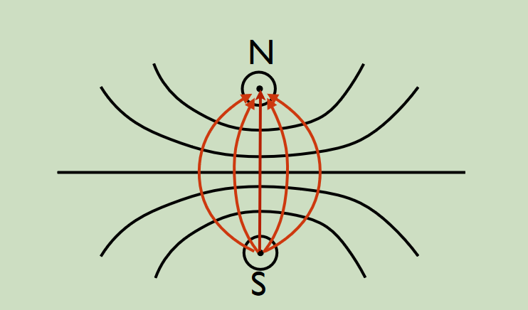

# Spacetime Foliation
	- Actually we only know perform quantization on time slices and find some way (better a symmetry) to connect different slices.
		- This breaks Lorentz invariance.
	- In Euclidian QFT, we have a natural selection of time slices.
		- The operator (vector flow) to connect different slices is generated by the Hamiltonian.
	- In CFT, we usually select the foliation to be $S^{D-1}$ (radial quantization) or orthogonal to the $K_1 + P_1$ flow (N-S quantization).
		- {:height 304, :width 431}
- [[Canonical Quantization]]
	- Usually the canonical coordinates satisfy $\left\{\psi^a, \pi_b\right\}_P=\delta_b^a ;\left\{\psi^a, \psi^a\right\}_P=\left\{\pi_a, \pi_a\right\}_P=0$
		- The Poisson bracket is defined as $\{A, B\}_p=\frac{\delta A}{\delta \psi^a} \frac{\delta B}{\delta \pi_a}-\frac{\delta A}{\delta \pi_a} \frac{\delta B}{\delta \psi^a}$
	- We just require $\{\ ,\ \}_p \rightarrow \frac{1}{i}[\ ,\ ]$.
	- *Theories with constraints
		- If the constraints satisfy $\left\{x_N, x_M\right\}_P=0$, then it can still be done.
- [[Dirac Bracket]]
	- When constraints are present and $C_{N M} \equiv\left\{x_N, x_M\right\}_P \quad \operatorname{det} C \neq 0$, canonical quantization cannot be done.
	- Def
		- $\{A, B\}_D \equiv\{A, B\}_P-\left\{A, X_N\right\}_P\left(C^{-1}\right)^{N M}\left\{X_M, B\right\}_P$
		- Then the quantization can be done as $\{\ ,\ \}_D \rightarrow \frac{1}{i}[\ ,\ ]$.
		-
-