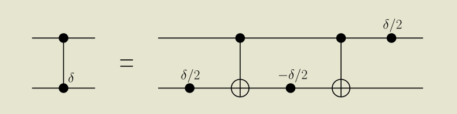
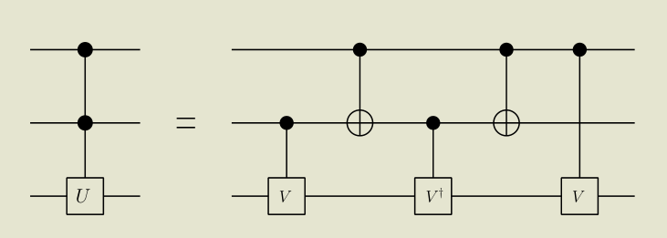
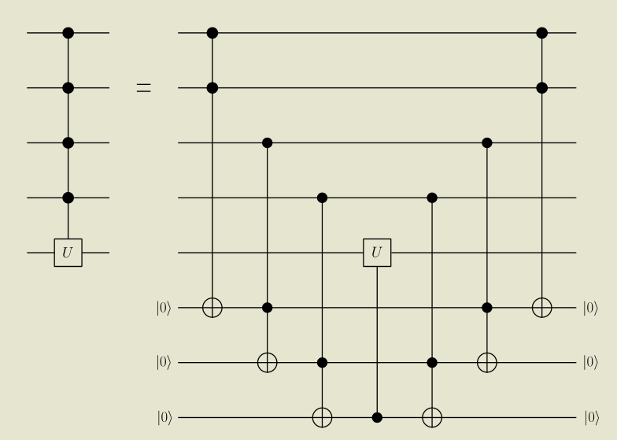

- # [[Bloch Sphere]] and Bloch Ball
	- Summary: Density matrix in terms of coordinates, rotation of the ball, expectation values #card
	  card-last-interval:: 84
	  card-repeats:: 3
	  card-ease-factor:: 2.8
	  card-next-schedule:: 2023-07-05T11:37:27.858Z
	  card-last-reviewed:: 2023-04-12T11:37:27.858Z
	  card-last-score:: 5
		- $Tr \rho=1$ ⇒ $a=1/2$ ⇒ $\rho=\frac{1}{2}\left(I+x \sigma_x+y \sigma_y+z \sigma_z\right)$
			- The range of the coordinates could be obtained by nonnegativity.
		- Rotation
			- $$R_n(\theta)=e^{-i\frac \theta 2 \vec \sigma\cdot \vec n}$$
		- Expectation
			- $$\begin{aligned}
			  &\left\langle\psi\left|\sigma_x\right| \psi\right\rangle=\left\langle\psi\left|\left[\begin{array}{ll}
			  0 & 1 \\
			  1 & 0
			  \end{array}\right]\right| \psi\right\rangle=\sin \theta \cos \phi=x \\
			  &\left\langle\psi\left|\sigma_y\right| \psi\right\rangle=\left\langle\psi\left|\left[\begin{array}{rr}
			  0 & -i \\
			  i & 0
			  \end{array}\right]\right| \psi\right\rangle=\sin \theta \sin \phi=y, \\
			  &\left\langle\psi\left|\sigma_z\right| \psi\right\rangle=\left\langle\psi\left|\left[\begin{array}{rr}
			  1 & 0 \\
			  0 & -1
			  \end{array}\right]\right| \psi\right\rangle=\cos \theta=z .
			  \end{aligned}$$
	- Pure case
		- 1 qubit: 3 Real parameters (2x2-1=4)
		- Explicitly: $|\psi\rangle=\cos \frac{\theta}{2}|0\rangle+e^{i \phi} \sin \frac{\theta}{2}|1\rangle$. Directly correspond to polar coordinates.
		-
		- **The correspondence is 1-to-1**. When $\theta \neq \pi$ it's obvious; when $\theta=\pi$ there's only one point, so phi is unimportant.
	-
	- Mixed case #card
	  card-last-interval:: 24
	  card-repeats:: 2
	  card-ease-factor:: 2.7
	  card-next-schedule:: 2023-04-13T01:21:18.473Z
	  card-last-reviewed:: 2023-03-20T01:21:18.473Z
	  card-last-score:: 5
		- General density matrix $\rho=a I+b \sigma_x+c \sigma_y+d \sigma_z$
			- Note the Pauli's and I constitute a basis. Hermitian ⇒ the coefficients are real.
		-
		- $Tr \rho=1$ ⇒ $a=1/2$ ⇒ $\rho=\frac{1}{2}\left(I+x \sigma_x+y \sigma_y+z \sigma_z\right)$
		- Positive definite ⇒ All eigenvalues larger than 0.
			- $\operatorname{det} \rho=\frac{1}{4}\left(1-|\boldsymbol{r}|^2\right), \text { with } \boldsymbol{r} \equiv(x, y, z)$. Which means $\|r\| \leq 1$.
		-
		- **Conclusion:** A general density matrix 1-1 correspond to points on Bloch ball.
		- Note: I can also start from pure states and prove the linearity of coordinate dependence on the density matrix.
	-
	- Rotation of the ball
		- Prove use commutation relations of [[Pauli matrices]] , which is just the CR of rotations.
		- $$R_n(\theta)=e^{-i\frac \theta 2 \vec \sigma\cdot \vec n}$$^^**Don't forget the minus!!!**^^
		- Equivalently, $R_{\hat{n}}(\phi)=\cos \frac{\phi}{2} {I}-i \sin \frac{\phi}{2} \sigma_{\hat{n}}$
		  This can be proven by ODE.
		-
		- Important examples.
		  $$
		  U_1=\frac{1}{\sqrt{ 2} }\left[\begin{array}{rr}
		  1 & 1 \\
		  -1 & 1
		  \end{array}\right]\\
		   U_2=\frac{1}{\sqrt{ 2} }\left[\begin{array}{ll}
		  1 & i \\
		  i & 1
		  \end{array}\right]
		  $$
		- Q: How to derive them?
			- Maybe by directly writing out the eigenstates and find what matrix can transform one set to another.
		-
	-
	- Expectations and coordinates
		- $$\begin{aligned}
		  &\left\langle\psi\left|\sigma_x\right| \psi\right\rangle=\left\langle\psi\left|\left[\begin{array}{ll}
		  0 & 1 \\
		  1 & 0
		  \end{array}\right]\right| \psi\right\rangle=\sin \theta \cos \phi=x \\
		  &\left\langle\psi\left|\sigma_y\right| \psi\right\rangle=\left\langle\psi\left|\left[\begin{array}{rr}
		  0 & -i \\
		  i & 0
		  \end{array}\right]\right| \psi\right\rangle=\sin \theta \sin \phi=y, \\
		  &\left\langle\psi\left|\sigma_z\right| \psi\right\rangle=\left\langle\psi\left|\left[\begin{array}{rr}
		  1 & 0 \\
		  0 & -1
		  \end{array}\right]\right| \psi\right\rangle=\cos \theta=z .
		  \end{aligned}$$
		-
		- Seems it can be best proven by writing out $|\psi\rangle=\cos \frac{\theta}{2}|0\rangle+e^{i \phi} \sin \frac{\theta}{2}|1\rangle$.
-
- # Common gates
	- 1-qubit
		- Hadamard
			- $$H=\frac{1}{\sqrt{ } 2}\left[\begin{array}{rr}
			  1 & 1 \\
			  1 & -1
			  \end{array}\right]$$
			- $H=\frac{1}{\sqrt{2 } }\left(\sigma_z+\sigma_x\right)$
			- Bell Basis
				- $H|0\rangle=\frac{1}{\sqrt{ } 2}(|0\rangle+|1\rangle) \equiv|+\rangle, \quad H|1\rangle=\frac{1}{\sqrt{ } 2}(|0\rangle-|1\rangle) \equiv|-\rangle$
				- Eigenstates of $\sigma_x$
				- Note
					- Bit flip becomes phase flip in Bell basis.
					  id:: 63bab430-6e29-491b-9ae5-d02bed06e35d
			-
		- Phase-Shift
		  $$R_z(\delta)=\left[\begin{array}{cc}
		  1 & 0 \\
		  0 & e^{i \delta}
		  \end{array}\right]$$
		- Theorem. Any unitary operation on a single qubit can be constructed using only Hadamard and phase-shift gates.
			- Phase shift is rotation wrt z axis. Hadamard takes computational basis to Bell basis, i.e. z-axis to x-axis.
			- In the view of basis transformation, Hadamard transforms phase-shift to rotation in x. 
			  Two axes is enough.
	- Multi-qubit
		- CNOT
			- Thm. All 4 generalized CNOT can be obtained from {CNOT + 1-qubit gates} ↓
				- We can use the 'triple swap' trick to exchange 2 cubits.
		- Construct common gates from CNOT
			- SWAP
				- 
				- The classical trick in OI of 'swapping 2 numbers without a tmp variable'
			- CPHASE
				- 
				- The phase gates always add a **global **phase to a single state. What we need are relative phases between states.
				- The phase gate on the first qubit doesn't affect the phase differences of different states with different x_2, but compensates for states with different x_1.
		- Toffoli
			- C^2-NOT
-
- # Universality
	- Theorem. Controlled-U can be constructed by CNOT and 1-qubit gates
		- Point: construct A,B,C  s.t.  $A B C=I \quad \text { and } \quad e^{i\delta} A \sigma_x B \sigma_x C=U$ 
		  CNOT is just controlled-$\sigma_x$
		-
		- First decompose by Euler angles, $U=\Phi(\delta) R_z(\alpha) R_y(\theta) R_z(\beta)$
		- Then construct $A=R_z(\alpha) R_y\left(\frac{\theta}{2}\right), \quad B=R_y\left(-\frac{\theta}{2}\right) R_z\left(-\frac{\alpha+\beta}{2}\right), \quad C=R_z\left(\frac{\beta-\alpha}{2}\right)$
		-
		- What's the thought of the construction?
			- Different $\sigma$ anticommute. Thus if we insert two sigma_x, the angles of B would be negated.
			- Detail: The inner rotation need to be cancelled first. Then the first and the last can compose.
	-
	- Theorem. $C^2-U$ can be constructed by CNOT and 1-qubit gates.
		-  
		  Where $V^2=U$
		- Specifically, Toffoli can be achieved.
	-
	- $C^k-U$ can  be constructed by Toffoli and U, with ancillary qubits.
		- 
		- Thought: Only when all the control qubits are 1 can we flip the ancillary qubits one-by-one.
	-
	- Theorem. 1-qubit gates plus CNOT is universal
		- Scheme for proof #card
		  card-last-interval:: 24
		  card-repeats:: 2
		  card-ease-factor:: 2.7
		  card-next-schedule:: 2023-04-07T11:57:43.217Z
		  card-last-reviewed:: 2023-03-14T11:57:43.217Z
		  card-last-score:: 5
			- Obtain arbitrary 2-qubit gates by CNOT
			- Gray code (Which only requires generalized C^k-NOT) to move any 2 qubits adjacent
			- Invoke (without proof) decomposition into 2-qubit gates
	- ## Approximation of Gates
		- Theorem. General gates $U\in U(2^n)$ needs $O(n^2\ 4^n)$ 1-qubit gates and CNOT to construct.
			- We can see from the number of real parameters that the scale must be exponential.
		-
		- Measure of distance
			- $$
			  d(U, V)=\sqrt{1-\left|\operatorname{tr}\left(U V^{\dagger}\right)\right| / 2}
			  $$
				- This measure is phase-invariant
		-
		- Theorem. (Kitaev-Solovay) #card
		  card-last-interval:: 30.72
		  card-repeats:: 1
		  card-ease-factor:: 2.6
		  card-next-schedule:: 2023-04-05T04:18:54.648Z
		  card-last-reviewed:: 2023-03-05T11:18:54.649Z
		  card-last-score:: 5
			- (1) Let $\mathcal{G}$ be a finite set in $\mathrm{SU}(2)$ containing its own inverses (so $g \in \mathcal{G}$ implies $g^{-1} \in \mathcal{G}$ ) and such that the group $\langle\mathcal{G}\rangle$ they generate is **dense** in $\mathrm{SU}(2)$
			  Then there is a **constant** $c$ such that for any $U \in \mathrm{SU}(2)$, the length of gates from $\mathcal{G}$ needed to approximate $U$ within error of $\varepsilon$ is $$O\left(\log ^c(1 / \varepsilon)\right)$$
				- That is, 1-qubit gates can be approximate by $\|S-U\| \leq \varepsilon$
			- (2) **n-qubit** gates consists of m CNOT and 1-qubit gates can be approximated by length of  $$O\left(m\log ^c(m / \varepsilon)\right)$$
			-
			- Corollary. Plug in $m\sim n^2\ 4^n$, arbitrary n-qubit gates needs $O\left(n^2\ 4^n\log ^c(n^2\ 4^n / \varepsilon)\right)$ gates to approximate.
		-
		- How the errors accumulate by step? #card
		  card-last-interval:: 23.96
		  card-repeats:: 1
		  card-ease-factor:: 2.6
		  card-next-schedule:: 2023-03-02T23:37:47.630Z
		  card-last-reviewed:: 2023-02-07T00:37:47.631Z
		  card-last-score:: 5
			- Suppose $U_i$ is the target gate, $V_i$ is the approximated gate.
			   $\left\|V_i-U_i\right\|_{\text {sup }}<\epsilon$. Then $\left|E_i\right\rangle=\left(V_i-U_i\right)\left|\psi_{i-1}\right\rangle$, $||E_i||<\epsilon$.
			- For a sequence $V=V_1V_2...V_n$, 
			  $$\begin{aligned}
			  \left|\tilde{\psi}_1\right\rangle &=\left|\psi_1\right\rangle+\left|E_1\right\rangle \\
			  \left|\tilde{\psi}_2\right\rangle &=V_2\left|\tilde{\psi}_1\right\rangle=\left|\psi_2\right\rangle+\left|E_2\right\rangle+V_2\left|E_1\right\rangle
			  \\...
			  \\\left|\tilde{\psi}_n\right\rangle&=\left|\psi_n\right\rangle+\left|E_n\right\rangle+V_n\left|E_{n-1}\right\rangle+V_n V_{n-1}\left|E_{n-2}\right\rangle+\cdots+V_n V_{n-1} \ldots V_2\left|E_1\right\rangle
			  \end{aligned}$$
			- So $\||\tilde{\psi}_n\rangle-\left|\psi_n\right\rangle\|\leq\|\left|E_n\right\rangle\|+\|\left|E_{n-1}\right\rangle\|+\cdots+\|\left|E_1\right\rangle \|=n\varepsilon$
			   (Triangle inequality; $V_i$ is unitary.)
			-
-