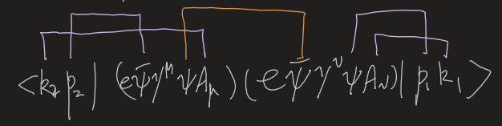
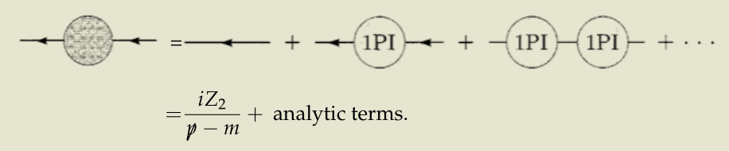
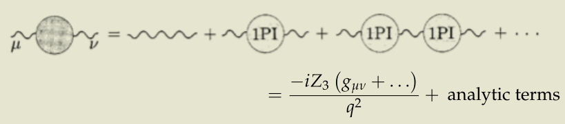

alias:: QED

- # Setup
	- $$
	  \begin{aligned}
	  \mathcal{L}_{\text {QED }} & =\mathcal{L}_{\text {Dirac }}+\mathcal{L}_{\text {Maxwell }}+\mathcal{L}_{\text {int }} \\
	  & =\bar{\psi}(i \not \partial-m) \psi-\frac{1}{4} F_{\mu \nu} F^{\mu \nu}-e \bar{\psi} \gamma^\mu \psi A_\mu
	  \end{aligned}
	  $$
- # [[Quantization]] of EM field
	- Overall scheme
		- First write down the Lagrangian and discover some problems
		- Then introduce a Lagrange multiplier $\frac{1}{2 \xi}\left(\partial_\mu A^\mu\right)^2$ to fix the gauge
		- Quantize as usual, then eliminate unphysical states (i.e. plug in the gauge condition)
	- Classical case
	  collapsed:: true
		- $\mathcal{L}_{\text {EM }}=-\frac{1}{4} F_{\mu \nu} F^{\mu v} \quad F_{\mu \nu}=\partial_\mu A_v-\partial_v A_\mu$
			- EOM: $\partial_\mu F^{\mu v}=\partial^2 A^v-\partial^v\left(\partial_\mu A^\mu\right)=0$
		- This is problematic.
			- Gauge isn't fixed
			- $\pi^0=0$, i.e. $\pi^0=\frac{\partial \mathcal{L}}{\partial \dot{A}_0}=0$
			- The propagator can't be solved
				- $\partial^2 A_v-\partial_v\left(\partial_\mu A^\mu\right)=(g_{\alpha\nu}\partial_\mu\partial^\mu-\partial_\nu\partial_\alpha)A^\alpha$
				- In momentum space: $(-g_{\alpha \nu} p^2+p_\nu p_\alpha)A^\alpha$
				- Unfortunately the expression **isn't invertible**!
				  In other words, the operator $g_{\alpha\nu}\partial_\mu\partial^\mu-\partial_\nu\partial_\alpha$ isn't invertible.
	- Solution1. Add a multiplier to enforce Lorenz Gauge $\partial_\mu A^\mu=0$
	  collapsed:: true
		- $\mathcal{L}_{\xi}=\mathcal{L}_{\text {EM}}-\frac{1}{2 \xi}\left(\partial_\mu A^\mu\right)^2$
		- EOM: $\partial^2 A^v-\left(1-\frac{1}{\xi}\right) \partial^v \partial_\mu A^\mu=0$
		-
		- We may set $\xi=1$ to eliminate the extra term and get $\mathcal{L}_{\xi}=-\frac{1}{2} \partial_\mu A_v \partial^\mu A^v$
			- Problem: Is this legitimate?
				- Specifically, the Lagrangian is a functional to be maximized. The quantities inside are functionals, not common variables.
				  Also, when we use Lagrangian multipliers in calculus, the value of the multiplier can be **SOLVED **rather than designated.
			- A: In this case it seems to be.
				- The EOM of $\xi$ produces $\partial_\mu A^\mu=0$.
				- EOM of $A^\mu$: $\partial_\mu\left(\frac{\partial \mathcal{L}}{\partial\left(\partial_\mu \phi_a\right)}\right)-\frac{\partial \mathcal{L}}{\partial \phi_a}=0$ .
				  The extra term $-\frac{1}{2 \xi}\left(\partial_\mu A^\mu\right)^2$ produces no extra term for $\frac{\partial \mathcal{L}}{\partial \phi_a}$ ; for $\partial_\mu\left(\frac{\partial \mathcal{L}}{\partial\left(\partial_\mu \phi_a\right)}\right)$, it produces $-\frac 1 \xi \partial^\mu(\partial_\alpha A^\alpha)$
				- In the presence the EOM of $\xi$, we can discard the extra term in the EOM of $A^\mu$. 
				  The **set **of EOM is equivalent to the undiscarded one.
		-
		- Thus $\pi^\mu=\frac{\partial \mathcal{L}}{\partial\left(\partial_0 A^\mu\right)}=-\dot{A}^\mu$.
		- Then we do the usual CCR and mode expansion
			- $$\begin{aligned}
			  &A_\mu(x)=\int \frac{d^3 p}{(2 \pi)^3} \frac{1}{\sqrt{2 E_p}} \sum_{\lambda=0}^3 \epsilon_\mu^\lambda(p)\left(a_p^\lambda e^{-i p \cdot x}+a_p^{\lambda \dagger} e^{i p \cdot x}\right) \\
			  &\pi_\mu(x)=\int \frac{d^3 p}{(2 \pi)^3}(+i) \sqrt{\frac{E_p}{2}} \sum_{\lambda=0}^3 \epsilon_\mu^\lambda(p)\left(a_p^\lambda e^{-i p \cdot x}-a_p^{\lambda \dagger} e^{i p \cdot x}\right)
			  \end{aligned}$$
			- Enforce the constraint $\partial_\mu A^\mu=0$: only 3 modes are left. 
			  $$\zeta_T=\left(\begin{array}{c}
			  0 \\
			  \zeta^1 \\
			  \zeta^2 \\
			  0
			  \end{array}\right)(2\ transverse\ modes),\quad \zeta_S=c\left(\begin{array}{l}
			  1 \\
			  0 \\
			  0 \\
			  1
			  \end{array}\right)$$
			- $\zeta_S$ is unphysical. Two points of view
			    1. We may use the remaining gauge freedom.
			    2. The mode has zero norm.
			-
	- Final Result
		- $$\begin{aligned}
		  &A_\mu(x)=\int \frac{d^3 p}{(2 \pi)^3} \frac{1}{\sqrt{2 E_p}} \sum_{\lambda=1}^2 \epsilon_\mu^\lambda(p)\left(a_p^\lambda e^{-i p \cdot x}+a_p^{\lambda \dagger} e^{i p \cdot x}\right) \\
		  &\pi_\mu(x)=\int \frac{d^3 p}{(2 \pi)^3}(+i) \sqrt{\frac{E_p}{2}} \sum_{\lambda=1}^2 \epsilon_\mu^\lambda(p)\left(a_p^\lambda e^{-i p \cdot x}-a_p^{\lambda \dagger} e^{i p \cdot x}\right)
		  \end{aligned}$$
- From [[Yukawa theory]] to QED #card
  card-last-interval:: 10
  card-repeats:: 2
  card-ease-factor:: 2.7
  card-next-schedule:: 2022-12-16T07:44:12.953Z
  card-last-reviewed:: 2022-12-06T07:44:12.953Z
  card-last-score:: 5
	- $H_{\mathrm{int}}=\int d^3 x\ e \bar{\psi} \gamma^\mu \psi A_\mu$
		- So elegant! $\gamma^\mu$ marries $A_\mu$
		- Would different choice of gamma affect physics? eg. Weyl or Majarona? #Inbox/Problem
	- ((636909d9-c786-4017-88e5-4c0d88ed061e))
	- See [[Feynman rules]]
- # Elementary processes
  collapsed:: true
	- Summary #card
	  card-last-interval:: 25.01
	  card-repeats:: 1
	  card-ease-factor:: 2.6
	  card-next-schedule:: 2023-02-06T13:25:31.902Z
	  card-last-reviewed:: 2023-01-12T13:25:31.902Z
	  card-last-score:: 5
		- Write out the diagrams by Feynman rules
			- Be careful of the **minus** signs from exchanging fermionic fields!
		- Calculate $|M|^2$ by spin sums and trace tricks (explicitly write out the indices)
			- The order of matrix multiplication is only a notation of how the indices contract.
			  Explicitly write them out is a good way.
	- ## $e^+e^-\to\mu^+\mu^-$
	  collapsed:: true
		- ((636a08cd-dc0b-497c-84e8-1209396c615e))
		-
		- ### Simplifications
			- Ignore electron mass (but not muon mass)
			- Average over initial polarizations and sum over final polarizations
		- ((63690855-079b-41b7-95c3-4e8e1dd1b950))
			- The expression isn't difficult. But to find $|\mathcal{M}|^2$, we need to **find its complex conjugation**
		- ### Perform the spin sum
		  collapsed:: true
			- ((636a0a09-665c-450a-81b8-fc919bb5d8e5)). Thus we can use spin sums to simplify the expression.
				- Actually **sum** over outgoing spins and **average** over incoming spins
			- Conjugation of bi-spinor products ((636a0984-d932-4dd2-a89e-963d90acda08))
			- ((636a4a63-f308-41ef-96ff-d1d2aaefe3d4)) and obtain the lovely traces
				- ((636a0aa2-99ca-44c2-80cf-e497cb4a1354))((636a0ab1-74ca-4f2b-b875-c0045fad2016))
		- Continue to evaluate the probability
		  collapsed:: true
			- ((636a0d35-79e4-45a4-b9a7-7cd329e624ee))
			  ((636a0d4c-c42b-434b-bb47-95702c4eef39))
				- Note $\not p$ is actually $p_\alpha \gamma^\alpha$
			- Plug the above expression in:
			  ((636a0e49-de93-4428-ae7d-ac04fa1beecb))
			- Select [[Center-of-mass]] frame:
			-
		- Final result:
			- ((636a0ea3-dbd5-40f4-bf1b-0fe2940a0762))
			  With ((636a0eb0-2a64-48c7-89eb-ee8b61d66889))
	- Note: The 'phase-space dependence' originates from ((636a108d-1c99-463c-bd06-6105cdf58bbd)), where we don't care about the momenta of the particles coming out, only direction.
	- ## [[Compton scattering]]
		- Key points #card
		  card-last-score:: 5
		  card-repeats:: 3
		  card-next-schedule:: 2023-04-06T04:54:13.715Z
		  card-last-interval:: 67.2
		  card-ease-factor:: 2.8
		  card-last-reviewed:: 2023-01-29T00:54:13.717Z
		  collapsed:: true
			- Draw **two** diagrams
				- Reminder: The lines can cross!
				- The better strategy should be first draw the vertices (including internal ones), then find out all possible ways of connecting them.
			- Simplifications
				- Use some basic relations ((6379e1d5-cde6-45c1-9024-4b12b6a35650)) to simplify the denominator
				- Use ((6379e3b6-ac3e-4770-a535-ccfaeb1e3f28)) to simplify the numerator.
			- Perform spin sums
				- Nothing special here.
		- Two diagrams
		  collapsed:: true
			- ((6379d890-1f5b-4f30-9855-5dbd1a1b68be))
				- Can we have antifermions, instead of fermions, in the inner line? #card
				  card-last-interval:: 169.81
				  card-repeats:: 4
				  card-ease-factor:: 2.66
				  card-next-schedule:: 2023-07-13T20:14:34.765Z
				  card-last-reviewed:: 2023-01-25T01:14:34.765Z
				  card-last-score:: 5
					- I think they're actually equivalent. The inner line is the contraction of two field operators.
					- 
		- Invoking the Feynman rules, we can write down the total M matrix 
		  $i \mathcal{M}=\bar{u}\left(p^{\prime}\right)\left(-i e \gamma^\mu\right) \epsilon_\mu^*\left(k^{\prime}\right) \frac{i(\not p+\not k+m)}{(p+k)^2-m^2}\left(-i e \gamma^\nu\right) \epsilon_\nu(k) u(p)$
		  $+\bar{u}\left(p^{\prime}\right)\left(-i e \gamma^\nu\right) \epsilon_\nu(k) \frac{i\left(\not p-\not k^{\prime}+m\right)}{\left(p-k^{\prime}\right)^2-m^2}\left(-i e \gamma^\mu\right) \epsilon_\mu^*\left(k^{\prime}\right) u(p)\\=-i e^2 \epsilon_\mu^*\left(k^{\prime}\right) \epsilon_\nu(k) \bar{u}\left(p^{\prime}\right)\left[\frac{\gamma^\mu(\not p+\not k+m) \gamma^\nu}{(p+k)^2-m^2}+\frac{\gamma^\nu\left(\not p-\not k^{\prime}+m\right) \gamma^\mu}{\left(p-k^{\prime}\right)^2-m^2}\right] u(p)$
		- ### Simplifications
			- $(p+k)^2-m^2=2 p \cdot k \quad$ and $\quad\left(p-k^{\prime}\right)^2-m^2=-2 p \cdot k^{\prime}$ 
			  To simplify the denominators.
				- Note the external photons are on-shell. For off-shell internal photons this can't apply.
			- $\begin{aligned}(\not p+m) \gamma^\nu u(p) &=\left(2 p^\nu-\gamma^\nu \not p+\gamma^\nu m\right) u(p) \\ &=2 p^\nu u(p)-\gamma^\nu(\not p-m) u(p) \\ &=2 p^\nu u(p) \end{aligned}$
			  to simplify the numerators.
				- Simply invoke ((6385f0a2-e52f-444e-b94f-41d91b3b69c4)) for the last equality.
		- ((6379e410-066b-4ee4-a4e2-ac831ae0bcbf))
		- Now we need to sum the polarizations over the photons and the electrons.
			- The sum for the spins is familiar.
			- The trick for photons #card
			  card-last-interval:: 67.2
			  card-repeats:: 3
			  card-ease-factor:: 2.8
			  card-next-schedule:: 2023-03-19T04:56:44.002Z
			  card-last-reviewed:: 2023-01-11T00:56:44.002Z
			  card-last-score:: 5
				- $\sum_{\text {polarizations }} \epsilon_\mu^* \epsilon_\nu \longrightarrow-g_{\mu \nu}$
				  Don't forget the minus.
				- This isn't an actual equality, but it works in calculating the scatterings.
				- Proof
					- $\sum_\epsilon\left|\epsilon_\mu^*(k) \mathcal{M}^\mu(k)\right|^2=\sum_\epsilon \epsilon_\mu^* \epsilon_\nu \mathcal{M}^\mu(k) \mathcal{M}^{\nu *}(k)$
					- Select k in z direction for simplicity  $\epsilon_1^\mu=(0,1,0,0) ; \quad \epsilon_2^\mu=(0,0,1,0)$. 
					  We obtain $\sum_\epsilon\left|\epsilon_\mu^*(k) \mathcal{M}^\mu(k)\right|^2=\left|\mathcal{M}^1(k)\right|^2+\left|\mathcal{M}^2(k)\right|^2$
					- By [[Ward-Takahashi Identity]], $\mathcal{M}^0=\mathcal{M}^3$
					- Thus 
					  $\begin{aligned} \sum_\epsilon \epsilon_\mu^* \epsilon_\nu \mathcal{M}^\mu(k) \mathcal{M}^{\nu *}(k) &=\left|\mathcal{M}^1\right|^2+\left|\mathcal{M}^2\right|^2 \\ &=\left|\mathcal{M}^1\right|^2+\left|\mathcal{M}^2\right|^2+\left|\mathcal{M}^3\right|^2-\left|\mathcal{M}^0\right|^2 \\ &=-g_{\mu \nu} \mathcal{M}^\mu(k) \mathcal{M}^{\nu *}(k) \end{aligned}$
					-
		- The rest is just squaring M and performing the spin sums.
			- Note that you may find extra $\gamma^0$ in $(\gamma^\mu)^\dag=\gamma^0\gamma^\mu\gamma^0$
			- The extra gammas are absorbed in $\bar u(p)=u^\dag(p)\gamma^0$
			-
		- Final result
			- ((637ae60f-71b1-4bbd-bfba-96333ac6ecc9))
- # Radiative Corrections
  id:: 638d5442-2da2-466c-8e73-91b7fff0a3a3
	- [[Electron Vertex Function]]
	- [[Bremsstrahlung]]
	- Compare ((f148e065-772b-439d-8fb3-cb4024bdd0d6)) and ((74b31acc-246f-48b4-99c9-63059f858425)), we find that the divergent parts cancel!
	  collapsed:: true
		- Note that they cancel for arbitrary q (See Satoshi's Homework6, Problem 1). Peskin just shows a special case.
	- Defs
	  collapsed:: true
		- Field-strength renormalizations #card
		  card-last-interval:: 252.3
		  card-repeats:: 4
		  card-ease-factor:: 2.9
		  card-next-schedule:: 2024-01-07T08:01:16.275Z
		  card-last-reviewed:: 2023-04-30T01:01:16.275Z
		  card-last-score:: 5
			- 
				- Note that $m$ is the physical mass, not bare mass.
				- No effect on the coupling constant $e$. Correct electron mass.
			- 
		- Renormalized fields and charge
			- $A^\mu=Z_3^{\frac{1}{2}} A_r^\mu, \quad \psi=Z_2^{\frac{1}{2}} \psi_r, \quad Z_2 Z_3^{\frac{1}{2}} e_0=e^{\prime}=Z_1 e$
			-
	- [[Field-Strength Renormalization]] #[[To be recorded]]
	- [[Electric Charge Renormalization]]
	-
	-
- Obtain macroscopic results from QED
  collapsed:: true
	- Use Born's approximation to link to [[Quantum Mechanics]]
		- Add a [[Classical]] external field ((637c75c9-97e2-45d5-8b25-33c61663e7d0))
		- Lande g-factor
		  id:: 637c804b-50a9-466d-b43a-e89fdce7ac75
			- ((637c8054-2570-47cb-b075-f0dc3f8279a6))
			- The second term is the anomalous magnetic moment.
		- See Peskin P210
	-
- [[Ward-Takahashi Identity]]
	-