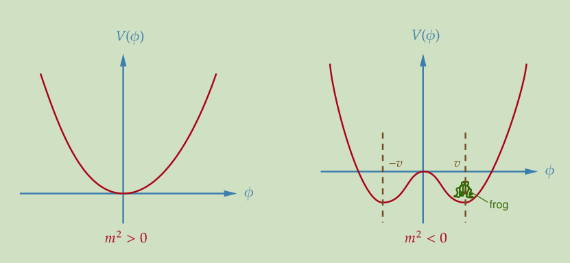
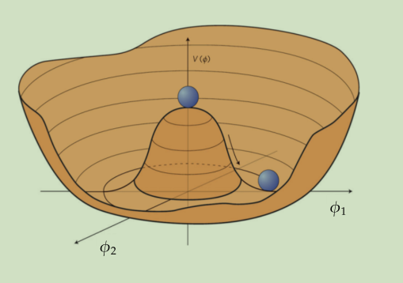

alias:: [[QFT]]

-
- # Setup and Notations
  collapsed:: true
	- $|\Omega\rangle$ is the interactive vacuum, while $|0\rangle$ is the free vacuum.
	- $G\left(x_1, \cdots, x_n\right)=\left\langle\Omega\left|T\left\{\phi\left(x_1\right) \cdots \phi\left(x_n\right)\right\}\right| \Omega\right\rangle$
	-
	- ## Assumptions about the Hilbert Space #card
	  collapsed:: true
	  card-last-interval:: 31.26
	  card-repeats:: 1
	  card-ease-factor:: 2.6
	  card-next-schedule:: 2023-05-26T07:00:49.798Z
	  card-last-reviewed:: 2023-04-25T01:00:49.799Z
	  card-last-score:: 5
		- #+BEGIN_NOTE
		  Not a rigorous structure, but seems natural in perturbation theories.
		  #+END_NOTE
		- A unique ground state $|\Omega\rangle$ with momentum $q_{\nu a c}^\mu=0$
			- Note we don't consider GSD or spontaneous symmetry breaking here.
		- A continuum of single-particle states $|p\rangle$ eigen to the Hamiltonian, with $p^2=m^2\geq 0$
		  id:: 63fc166f-9a06-42b7-a7e3-947eff93ae12
			- 'Continuum' means that any 3-momenta is allowed.
		- The spectra is a continuum for $p^2 \gtrsim 4 m^2$
			- These correspond to multi-particle states. Interaction between them leads to the continuum.
			- However the spectrum is **not** strictly greater than $4m^2$, since attracting interaction lowers the energy.
		-
		- Other ones
			- A theory is an irreducible representation of the operator algebra. Equivalently, we can always relate two states in the Hilbert space by some operator.
			  id:: 63fc4f1b-f3c8-4e99-a31f-add4fe16f8ec
				- For a single theory, we can relates 1-particle states by boosts.
				  id:: 63fc5025-5650-4054-ba3a-0520194bfb13
			- There shall be a basis of states corresponding to the classical field configurations, which would be used in [[Path Integral]].
	- [[Classical Field Theory]]
	  collapsed:: true
		- Noether's theorem #card
		  card-last-interval:: 24
		  card-repeats:: 2
		  card-ease-factor:: 2.7
		  card-next-schedule:: 2023-03-26T14:12:47.860Z
		  card-last-reviewed:: 2023-03-02T14:12:47.861Z
		  card-last-score:: 5
		  id:: 63e86248-d68b-4d57-bed2-c7a0d75b3be7
			- $$\begin{aligned}
			  \partial _{\mu } j^{\mu } (x) & =0,\ \ \text{ for } \ \ j^{\mu } (x)=\frac{\partial \mathcal{L}}{\partial (\partial _{\mu } \phi )}\frac{\delta \phi }{\delta \alpha } -\mathcal{J}^{\mu }
			  \end{aligned}$$
			- Points: EOM, construct full derivative
			-
			- Proof
				- Consider a Lagrangian with sym. $\alpha$
				- L must be inv. under different $\alpha$, up to a 4-divergence $\partial_\mu \mathcal{J}^{\mu }$:
				  $$\begin{aligned}
				  \frac{\delta \mathcal{L}}{\delta \alpha } & =\frac{\partial \mathcal{L}}{\partial \phi }\frac{\delta \phi }{\delta \alpha } +\left(\frac{\partial \mathcal{L}}{\partial (\partial _{\mu } \phi )}\right) \partial _{\mu } (\frac{\delta \phi }{\delta \alpha } )\\
				   & =\partial _{\mu }\left(\frac{\partial \mathcal{L}}{\partial (\partial _{\mu } \phi )}\frac{\delta \phi }{\delta \alpha }\right) +\alpha \left[\frac{\partial \mathcal{L}}{\partial \phi } -\partial _{\mu }\left(\frac{\partial \mathcal{L}}{\partial (\partial _{\mu } \phi )}\right)\right]\frac{\delta \phi }{\delta \alpha }
				  \end{aligned}$$
				- Substitute EOM: We're done.
			- Example
				- [[Energy-Momentum Tensor]]
			- Ref. Peskin, ((63805db9-661f-470f-9403-3ff9ae8aa7dd))
- # Causality and Propagators
  collapsed:: true
	- $\langle 0|[\phi(x), \phi(y)]| 0\rangle=0$ for spacelike separation, which preserves [[Causality]].
		- Use some invariance/symmetry to simplify the problem. ([[Lorentz invariance]] in this case) #Techniques
	-
	- [[Propagator]], or time-ordered product
		- $$\langle 0|\phi(x) \phi(y)| 0\rangle=\int \frac{d^3 p}{(2\pi)^3} \cdot \frac{1}{2 E_p} \cdot e^{-i p(x-y)}:=D(x-y)$$
		- [[Feynman Propagator]]
		  id:: 129a2538-6668-4ae1-a5cc-a7cf58e6122b
			- Def
				- $D_{F}( x_{1} ,x_{2}) =\langle 0| T\{\phi _{0}( x_{1}) \phi _{0}( x_{2})\}| 0\rangle =\int \frac{d^{4} k}{(2\pi )^{4}}\frac{i}{k^{2} -m^{2} +i\varepsilon } e^{ik( x_{1} -x_{2})}$
				- Points: Exponential term from $a_p e^{ipx}$; denominator produces singularities.
			-
			- Core point: $$\frac{e^{-iE_{k} \tau } \theta (\tau )+e^{iE _{k} \tau } \theta (-\tau )}{2E_k}=\lim _{\varepsilon \rightarrow 0}\int _{-\infty }^{\infty }\frac{dp_0}{2\pi}\frac{i }{p_0 ^{2} -E _{k}^{2} +i\varepsilon } e^{-ip_0 \tau }$$ 
			  'Phase multiples Heaviside'
			- Note tha $D_F$ is the [[Green Function]] of KG operator, i.e. 
			  $$\left(\partial^\mu \partial_\mu+m^2\right) D_F(x-y)=-i \delta^4(x-y)$$
		- Dirac Propagator
			- Def
				- $$\begin{aligned}
				  &S_F(x-y)=\int \frac{d^4 p}{(2 \pi)^4} \frac{i(\not p+m)}{p^2-m^2+i \epsilon} e^{-i p \cdot(x-y)}\\
				  &=\left\{\begin{aligned}
				  \langle 0|\psi(x) \bar{\psi}(y)| 0\rangle & \text { for } x^0>y^0 \text { (close contour below) } \\
				  -\langle 0|\bar{\psi}(y) \psi(x)| 0\rangle & \text { for } x^0<y^0 \text { (close contour above) }
				  \end{aligned}\right.\\
				  &\equiv\langle 0|T \psi(x) \bar{\psi}(y)| 0\rangle
				  \end{aligned}$$
			- This is $-(i\gamma^\mu p_\mu+m)D_F(x-y)$.
				- With the 'dirac operator' $i\gamma^\mu p_\mu-m$ acting on it, we obtain $(\square+m^2)D_F(x-y)\cdot \mathbb1_4$.
				- The same idea as obtaining KG eq. from Dirac eq.
			-
			- Exercise. The [[Time-ordered product]] gives the correct propagator
				- Tip: Modify $$\frac{e^{-iE_{k} \tau } \theta (\tau )+e^{iE _{k} \tau } \theta (-\tau )}{2E_k}=\lim _{\varepsilon \rightarrow 0}\int _{-\infty }^{\infty }\frac{dp_0}{2\pi}\frac{i }{p_0 ^{2} -E _{k}^{2} +i\varepsilon } e^{-ip_0 \tau }$$
				- Use Lorentz invariance (or change of integration variables)
			-
			- Take care of the minus sign! (Compare ((129a2538-6668-4ae1-a5cc-a7cf58e6122b)) )
	-
- # Specific Theories
  collapsed:: true
	- [[Klein-Gordon Theory]]
	- [[Yukawa Theory]]
	- [[Quantum Electrodynamics]]
	- [[Proca Theory]]
	-
- # [[Interaction, Feynman diagrams and S-matrix]]
- # [[Renormalization]]
- # [[Path Integral]]
- # [[Spontaneous Symmetry Breaking]]
	- ## Example 1. Real scalar field with $Z_2$ symmetry
	  collapsed:: true
		- $$
		  \mathcal{L}=\frac{1}{2} \partial_\mu \phi \partial^\mu \phi-\frac{1}{2} m^2 \phi^2-\frac{\lambda}{4 !} \phi^4 .
		  $$
		- Consider
		  $$
		  V(\phi)=\frac{1}{2} m^2 \phi^2+\frac{\lambda}{4 !} \phi^4
		  $$
		- ### Classical level
			- When $m^2<0$, we have two local minima for $V(\phi)$:
			  {:height 213, :width 445}
			- Denoting the minimum as $\phi=v$, we could rewrite the field around the minimum as $\phi(x)=v+\sigma(x)$.
				- $\sigma_x$ is the **physical field**.
			- Then 
			  $$
			  \mathcal{L}=\frac{1}{2} \partial_\mu \sigma \partial^\mu \sigma-V(\sigma), \quad V(\sigma)=\frac{\lambda v^2}{6} \sigma^2+\frac{\lambda v}{6} \sigma^3+\frac{\lambda}{4 !} \sigma^4+\text { constant } 
			  $$
			  which now has positive mass!
		- ### Quantum level
			- For a single-particle system, we have a nonzero probability for tunneling, thus we may jump to another minimum.
			- However, in QFT we have infinitely many DOF, thus the energy barrier is infinitely high.
			  (Just a physical argument, not so rigorous)
			-
			- On the other hand, if the potential is tilted and the energy is smaller for the other potential, then a jump may happen.
				- To be specific, a 'bubble' of another minimum may appear in a finite region. If the bubble is large enough, then the force created by the energy difference could exceed the force from the surface energy, thus the vacuum may indeed decay.
	- ## Example 2. Complex scalar field
	  collapsed:: true
		- $$
		  \mathcal{L}=\partial_\mu \phi^* \partial^\mu \phi-V(\phi), \quad V(\phi)=m^2 \phi^* \phi+\frac{\lambda}{4}\left(\phi^* \phi\right)^2
		  $$
		- When $m^2<0$, the potential has the shape of a 'Mexican hat' with a circle of continuous minima:
		  {:height 318, :width 441}
		- Select $\theta=0$ and expand the field around the minimum, we have:
		  $$
		  \phi(x)=\frac{1}{\sqrt{2}}\left(v+\tilde{\phi}_1(x)+i \phi_2(x)\right)
		  $$
		- Then
		  $$
		  \mathcal{L}=\frac{1}{2} \partial_\mu \tilde{\phi}_1 \partial^\mu \tilde{\phi}_1+\frac{1}{2} \partial_\mu \phi_2 \partial^\mu \phi_2-V\left(\tilde{\phi}_1, \phi_2\right)
		  $$
		  with
		  $$
		  V\left(\tilde{\phi}_1, \phi_2\right)=\frac{\lambda v^2}{4} \tilde{\phi}_1^2+\frac{\lambda v}{4} \tilde{\phi}_1\left(\tilde{\phi}_1^2+\phi_2^2\right)+\frac{\lambda}{16}\left(\tilde{\phi}_1^2+\phi_2^2\right)^2+\text { constant } .
		  $$
			- $\tilde \phi_1$ is massive.
			- $\phi_2$ is massless, which is exactly the **Goldstone boson**. [[Goldstone Theorem]]
			-
			-
	- [[Higgs Mechanism]]
	  collapsed:: true
		- $U(1)$ case
		  collapsed:: true
			- Consider scalar QED,
			  $$
			  \mathcal{L}=-\frac{1}{4} F_{\mu \nu} F^{\mu \nu}+\left(D_\mu \phi\right)^* D^\mu \phi-V(\phi), \quad V=m^2 \phi^* \phi+\frac{\lambda}{4}\left(\phi^* \phi\right)^2
			  $$
			- Now we assume $m^2<0$ and $\lambda>0$. The minimum of the potential occurs at $\phi=v e^{i \theta}$, without loss of generality we choose the vacuum at $\langle\phi\rangle=$ $\frac{v}{\sqrt{2}}=\sqrt{-\frac{2 m^2}{\lambda}}$ and expand the $\phi$ field as
			  $$
			  \phi(x)=\frac{1}{\sqrt{2}}\left(v+\phi_1(x)+i \phi_2(x)\right)
			  $$
			- Expand the Lagrangian and use a gauge transformation to remove the mixing term:
			  $$
			  A_\mu^{\prime}=A_\mu+\frac{1}{g v} \partial_\mu \phi_2
			  $$
				- $$
				  \frac{1}{2} \partial_\mu \phi_2 \partial^\mu \phi_2+g v A_\mu \partial^\mu \phi_2+\frac{1}{2} g^2 v^2 A_\mu A^\mu \quad \rightarrow \quad \frac{1}{2} g^2 v^2 A_\mu^{\prime} A^{\prime \mu}
				  $$
			- #+BEGIN_TIP
			  The kinetic term of $\phi_2$ is removed, while $A'_\mu$ now have a mass term!
			  #+END_TIP
			- DOF counting
				- -1 scalar DOF ($\phi_2$)
				- +1 vector DOF (due to mass field)
		- $SU(N)$ case
			- First consider a theory with **global** $SU(N)$ symmetry,
			  $$
			  \mathcal{L}=\partial_\mu \Phi^{\dagger} \partial^\mu \Phi-m^2 \Phi^{\dagger} \Phi-\frac{\lambda}{4}\left(\Phi^{\dagger} \Phi\right)^2, \quad \Phi=\left(\begin{array}{c}
			  \phi_1 \\
			  \phi_2 \\
			  \vdots \\
			  \phi_N
			  \end{array}\right)
			  $$
				- When $m^2<0$ and $\lambda>0$, the minimum of the potential is at
				  $$
				  \Phi^{\dagger} \Phi=-\frac{2 m^2}{\lambda} \equiv \frac{v^2}{2} .
				  $$
				  thus we may select the minimum to be at $\theta=0$,
				  $$
				  \langle\Phi\rangle=\left(\begin{array}{c}
				  \frac{v}{\sqrt{2}} \\
				  0 \\
				  \vdots \\
				  0
				  \end{array}\right)
				  $$
				- #+BEGIN_IMPORTANT
				  Important difference: $SU(N)$ is broken down to $SU(N-1)$, not completely broken!
				  #+END_IMPORTANT
				- We may select a convenient set of generators:
					- Unbroken ones
					  $$
					  Y_a=\left(\begin{array}{c|ccc}
					  0 & 0 & \cdots & 0 \\
					  \hline 0 & & & \\
					  \vdots & & t_a & \\
					  0 & & &
					  \end{array}\right)
					  $$
						- $(N-1)^2-1=N^2-2N$ in total
					- Broken ones
					  $$
					  X_a=
					  \begin{aligned}
					  & \frac{1}{2}\left(\begin{array}{c|cccc}
					  0 & -i & 0 & \cdots & 0 \\
					  \hline i & & & & \\
					  0 & & & & \\
					  \vdots & & & & \\
					  0 & & & &
					  \end{array}\right), \quad \frac{1}{2}\left(\begin{array}{c|cccc}
					  0 & 0 & -i & \cdots & 0 \\
					  \hline 0 & & & & \\
					  i & & & & \\
					  \vdots & & & & \\
					  0 & & & &
					  \end{array}\right), \\
					  & \sqrt{\frac{N-1}{2 N}}\left(\begin{array}{c|ccc}
					  1 & 0 & \cdots & 0 \\
					  \hline 0 & & \\
					  \vdots & -\frac{1}{N-1} \mathbb{1}_{N-1} \\
					  0 & &
					  \end{array}\right), \\
					  &
					  \end{aligned}
					  $$
						- $2N-1$ in total.
					- Note that the normalization is such that $\operatorname{Tr}\left[T_a T_b\right]=\frac{1}{2} \delta_{a b}$, which guarantees that the fields are canonically normalized.
					  id:: 6539de97-fcbc-4232-96ac-e224ac8216ec
				- Nonlinear parameterization:
				  $$
				  \Phi(x)=e^{i \pi_a(x) X_a}\left(\begin{array}{c}
				  \frac{v+\sigma(x)}{\sqrt{2}} \\
				  0 \\
				  \vdots \\
				  0
				  \end{array}\right)
				  $$
					- Analogous to the $U(1)$ case, we parameterize the field by a 'radius part' $\sigma$ and an 'angular part' $\pi$
					- Similarly, $\sigma$ would be massive and $\pi$ would be massless.
					- *In the unitary gauge, we simply set $\pi=0$. But here it is a global symmetry, so we're unable to do so.
				-
			- Now consider the $SU(N)$ **gauge** symmetry.
				- $$
				  \partial_\mu \Phi^{\dagger} \partial^\mu \Phi \rightarrow\left(D_\mu \Phi\right)^{\dagger} D^\mu \Phi, \quad \text { where } \quad D^\mu \equiv \partial^\mu+i g A_a^\mu T_a
				  $$
				- We may select the unitary gauge and remove $\pi$.
				  Similarly, some gauge fields $A^a_\mu$ would become massive.
				-
				- Masses of gauge fields
					- We may explicitly separate them into the broken part and the unbroken part:
					  $$
					  D^\mu \Phi=\partial^\mu \Phi+i g A_a^\mu T_a \Phi=\partial_\mu \Phi+i g\left(B_a^\mu X_a+C_a^\mu Y_a\right) \Phi
					  $$
					- After symmetry breaking, we rewrite $\Phi=\langle \Phi \rangle + v + i\pi$.
					  Therefore the mass comes from the $ig\langle \Phi \rangle A^\mu$ term.
					-
					- Proposition. From $Y_a\langle\Phi\rangle=0$ we can immediately deduce that $C_a^\mu$ are massless.
						- The corresponding terms in $D^\mu \Phi$ are $i g C_a^\mu Y_a \langle \Phi \rangle=0$.
					- Theorem. 
					  $$
					  \begin{aligned}
					  m_{B_0}^2 & =\frac{N-1}{2 N} g^2 v^2 \\
					  m_{B_1}^2 & =m_{B_2}^2=\cdots=m_{B_{2 N-2}}^2=\frac{1}{4} g^2 v^2
					  \end{aligned}
					  $$
						- Consider the corresponding terms in the Lagrangian:
						  $$
						  \begin{aligned}
						  D^\mu \Phi & \supset i g B_a^\mu X_a\langle\Phi\rangle \\
						  & =i \frac{g v}{\sqrt{2}}\left[\sqrt{\frac{N-1}{2 N}}\left(\begin{array}{c}
						  B_0^\mu \\
						  0 \\
						  \vdots \\
						  0
						  \end{array}\right)+\frac{1}{2}\left(\begin{array}{c}
						  0 \\
						  B_1^\mu+i B_2^\mu \\
						  B_3^\mu+i B_4^\mu \\
						  \vdots \\
						  B_{2 N-3}^\mu+i B_{2 N-2}^\mu
						  \end{array}\right)\right]
						  \end{aligned}
						  $$
						- Therefore the mass terms are
						  $$
						  \left(D_\mu \Phi\right)^{\dagger} D^\mu \Phi \supset \frac{g^2 v^2}{2}\left[\frac{N-1}{2 N} B_{0, \mu} B_0^\mu+\frac{1}{4}\left(B_{2, \mu} B_2^\mu+\ldots+B_{2 N-2, \mu} B_{2 N-2}^\mu\right)\right]
						  $$
						- Note that the fields are already canonically normalized, i.e. the kinetic terms are $\frac{1}{2} \partial_\mu B_\nu \partial^\mu B^\nu$, thus no further re-defining is needed.
					- Note that we should compare to $$\mathcal{L}=\frac{1}{2} \partial_\mu \phi \partial^\mu \phi-\frac 1 2 m^2 \phi^2 $$. Be aware of the factor $2$.
					  background-color:: red
					  id:: 6538770b-6deb-4f32-957e-173bc46f265b
		-
		-
		-