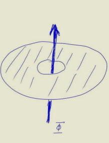

alias:: QHE

-
- # The Integer QHE
	- ## Setup
	  collapsed:: true
		- The electrons are confined to an (effectively) two-dimensional system, with an external magnetic field perpendicular to the plane.
		- Def
		  collapsed:: true
			- Hall resistance
			  collapsed:: true
				- $$R_H:=V_H/I$$
				- Note that $V_H$ is perpendicular to $I$.
			- Filling ratio
			  collapsed:: true
				- $$
				  \nu=\frac{n \phi_0}{B}
				  $$
				- $$\phi_0=h/e$$
				  is the flux quantum.
				- $n$ is the electron density.
			- Magnetic length
			  collapsed:: true
				- $$
				  \ell=\sqrt{\hbar /(e B)}
				  $$
			- Cyclotron frequency
			  collapsed:: true
				- $$
				  \omega_c=e B / m
				  $$
				- Classically this is the frequency the electron revolves.
			- Landau levels
			  collapsed:: true
				- $$
				  E_n=\hbar \omega_c\left(n+\frac{1}{2}\right)
				  $$
	- ## Phenomenology
	  collapsed:: true
		- ((645afabc-4fea-4341-9218-7446866e3e62))
		  collapsed:: true
			- The upgoing curve is the Hall voltage.
			  collapsed:: true
				- The plateaus have precisely the value 
				  $$
				  V_H=\frac{1}{i} \frac{h}{e^2} I
				  $$
				  where $i$ takes value in integers.
			- The oscillating curve is the longitudinal voltage.
			  collapsed:: true
				- There are **zeroes**.
			- Moreover, the plateaus and the zeroes appear at the same points of external fields!
			  collapsed:: true
				- Specifically, the points are such that the the filling ratio is roughly equal to $i$.
	- ## Solution
		- Just choosing a gauge and solve the Schrodinger equation with an uniform external magnetic field!
		  collapsed:: true
			- The field is chosen to point in $z$ direction.
		- ### Landau Gauge
		  collapsed:: true
			- [Ref. Topobook](((645afdcc-eea6-418b-a854-2b41ce795cc3)))
			- Gauge condition
			  collapsed:: true
				- $$
				  \mathbf{A}=B x \hat{y}
				  $$
			- By translation invariance in $y$ direction, we may write 
			  collapsed:: true
			  $$
			  \psi(x, y)=\phi_{k_y}(x) e^{i k_y y}
			  $$
				- In a finite-size system, we have
				  $$
				  k_y=\frac{2 \pi n}{L_y}
				  $$
			- Thus the Schrodinger equation becomes 
			  $$
			  \left(\frac{p_x^2}{2 m}+\frac{1}{2} m \omega_c^2\left(k_y \ell^2+x\right)^2\right) \phi_{k_y}(x)=E \phi_{k_y}(x)
			  $$,
			  which is the familiar **harmonic oscillator**!
			- We can obtain quantized Landau levels from the oscillator.
		- ### Symmetric Gauge
		  collapsed:: true
			- Gauge condition
			  collapsed:: true
				- $A_x=-\frac 1 2 By, A_y=-\frac 1 2 Bx$
			- Define the covariant partial derivatives
			  $$D_x:=\partial_x-\frac{ie}{\hbar c}A_x=\partial_x+\frac{i}{2l_0^2}y$$
			  $$D_y:=\partial_y+\frac{ie}{\hbar c}A_y=\partial_y-\frac{i}{2l_0^2}x$$
			- Make analogy to complex variables:
			  $$D^-:=D_x+iD_y\\
			  D^+:=D_x-iD_y$$
			- The Hamiltonian may be written as 
			  $$H=-\frac {\hbar^2}{4m}(D^+D^-+D^-D^+)$$
			- Moreover, 
			  collapsed:: true
			  $$[D^-,D^+]=-\frac 2 {l_0^2}$$
			  so they can be easily interpreted as creation and annihilation operators!
				- $$\hat a=\frac {il_0}{\sqrt 2}D^- \\
				  \hat a^\dagger=\frac {il_0}{\sqrt 2}D^+$$
				- Note that which is creator and which is annihilator must be decided by which one has an eigenstate $|0\rangle$ with a zero eigenvalue.
			-
	- ## Laughlin's Quantization Argument
	  collapsed:: true
		- Motivating problem: The real systems are quite messy. The shape of the sample isn't well defined; we have leads in the sample; there's temperature; ...
		  **Why is the Hall conductance so precisely quantized?**
		- Theorem. (Byers-Yang)
		  The spectrum of the system remains unchanged when an integer multiple of the flux quantum is added to a hole in the system. #card
			- {:height 238, :width 164}
			- It seems the presence of the **hole** (not single connected) is important.
			  How to understand this?
			  Moreover, can we consider a loop in the configuration space, with the parameter being the flux?
			- Proof. Make use of multi-valued gauge transformations (A stroke of genius! And potential deep structures...)
				- Note the gauge transformation acts as 
				  $$
				  \begin{aligned}
				  \mathbf{A}^{\prime}(\mathbf{r}) & =\mathbf{A}(\mathbf{r})+(\hbar / e) \nabla \chi(\mathbf{r}) \\
				  \Psi^{\prime}\left(\mathbf{r}_1, \ldots \mathbf{r}_N\right) & =\left[\prod_{j=1}^N e^{i \chi\left(\mathbf{r}_j\right)}\right] \Psi\left(\mathbf{r}_1, \ldots \mathbf{r}_N\right)
				  \end{aligned}
				  $$
				- Consider the gauge transformation
				  $$
				  \chi(\mathbf{r})=m \theta(\mathbf{r}), m \in \mathbb Z
				  $$
				- Obviously one more flux quantum is added to the hole!
	- ## Edge States
		- Classical Picture
			- At the edge of the material, there is an electric field $E_{edge}$ pointing inside (to hold the electrons in the bulk).
				- Recall $W_{min}$ in the photoelectric effect.
			- Therefore there'll be Hall current proportional to $E_{edge} \times B$!
		- Quantum Picture
			- At the edge of the material, there is a potential $V$, increasing when the electron gets closer to the edge.
			- Note that in Landau gauge, the center of the oscillator is
			  $$x_0=k_y\ell^2$$
			- Thus the electrons would prefer a smaller $k_y$ to avoid adding $V(x_0)$.
				- To be specific, they would first fill some higher Landau levels with smaller $k_y$ before filling the lower Landau levels with higher $k_y$.
			- This only happens near the edge, so we obtain **chiral currents**!
	- ## The role of Disorder
		- In short, disorder cause the degenerate eigenspaces to 'spread out' a bit (obtain some finite width) and some states get localized.
		- Therefore, for chemical potentials going between the localized states, though the electron density is increasing, the Hall conductance isn't. 
		  Thus the plateau!