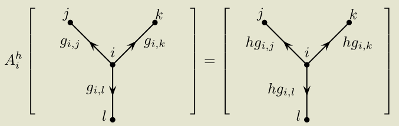
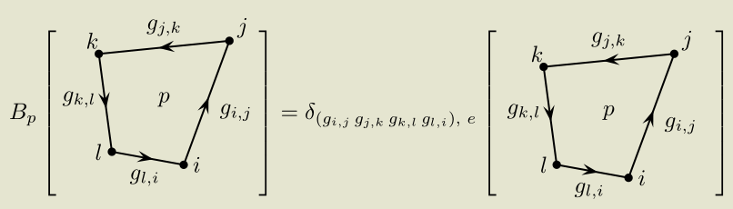
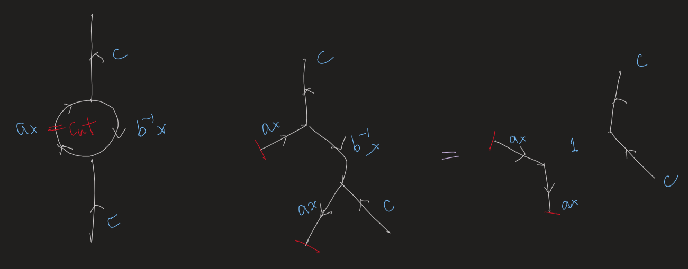

- # Model
	- Group G.
	- There is a degree of freedom on each edge labeled by a group element.
	  collapsed:: true
		- Note that we may **reverse the orientation** by substituting $g$ by $g^{-1}$
	- ## Lattice
		- $A_v=\frac{1}{|G|} \sum_{g \in G} A_v^g$
		  collapsed:: true
			- 
			  outgoing orientation.
			- Note that different edges may be **entangled**.
		- $B_p=\delta g_1 ... g_N, e$
		  collapsed:: true
			- 
			  orientation in the most natural way.
			- **The order of the multiplication is important. Group elements of adjacent edges must be adjacent in the expression.**
			  collapsed:: true
				- Generally the group is nonabelian.
			- 'Flux free' condition
		- $H=-\sum_{v } A_v-\sum_{p } B_p$
	- ## Continuum
	  collapsed:: true
		- The edges are dual to themselves, so no need to worry.
		- Dancing rules
			- Isotopy
			- Adding or removing contractible loops
				- ((63c35e83-e9eb-4022-8ba1-d78433fb3a41))
			- F-move
				- ((63c35db9-7581-4bb9-b557-8a4f428fb71e))
					- The move can be better memorized on the dual lattice, where the total charge of a vertex is zero.
				- Note that it is the trivial one. Other nontrivial ones are also possible; they're called [[Twisted Quantum Double]].
				- It's the third move in toric code, with $ab=ca=e$. So the inner vertex is vacuum.
		- Corollary
		  collapsed:: true
			- ((63c36205-6142-426d-b135-78ed41fc12f2))
				- Note that 
					- Cut some threads open to invoke the moves! #Strategy
				- i.e. An internal loop is also contractible.
			- ((63c35e34-0bb7-4b7e-80ff-9801ce4c1143)) #Learning-TODO
				- The first step uses F-move.
				- The second step invokes the above corollary.
				- $\times$ in the middle means that we **cannot** remove the loop by rule 2, but should merge it with the edges.
				- Therefore, ((63c366db-187f-4c87-b7ff-e47dc4bde837))
					- ((63c366e4-dfa4-4466-a587-8b6f8d1e7512))
- # Properties
	- $A_v^2=A_v, \quad B_p^2=B_p$
		- **Projectors**. The eigenvalues can only be 0 or 1.
	- $\left[A_v, A_v'\right]=\left[B_p, B_{p^{\prime}}\right]=\left[A_v, B_p\right]=0$
		- Simultaneously diagonalizable.
	- The ground state is topological, i.e. independent of the details of the lattice.
		- Proof strategy: Find a set of **generating moves** and prove the model is invariant under them.
		- ((63c35d0a-d99c-40d3-9a33-0e1ab6b67f35))
			- The internal vertex is fixed. No extra d.o.f.
		- ((63c35d32-495b-46d6-b8a8-ca80a077ee6b))
		-
- # Solution by Diagrams
	- ## GSD on a torus #card
	  card-last-interval:: 24
	  card-repeats:: 1
	  card-ease-factor:: 2.6
	  card-next-schedule:: 2023-03-01T00:20:56.187Z
	  card-last-reviewed:: 2023-02-05T00:20:56.187Z
	  card-last-score:: 5
		- Idea: Since it is topological (independent of the details), we may examine a minimal lattice.
			- Note that the analysis is given on the dual lattice.
			- **It seems more complicated on the original lattice. Or did I make mistakes?**
		- ((63c3b5c4-31cd-4d46-ac19-ea191ea27c71))
			- One plaquette, two edges.
		- Vertex condition -> $ab=ba$
			- We should insist that **incoming is positive** on all vertices.
		- Plaquette condition -> $\left|\Psi_{b, a}\right\rangle \propto \hat{P}_\beta|b, a\rangle \propto \sum_{h \in G}\left|h b h^{-1}, h a h^{-1}\right\rangle$
		- **Conclusion**
			- The ground states are $\sum_{h \in G}\left|h b h^{-1}, h a h^{-1}\right\rangle$ with $ab=ba$
		- Prop. $G S D_{\text {torus }}=\sum_A \# \operatorname{irrep}\left(Z^A\right)$.
			- Here $Z^A$ is actually $Z(a)$ for some $a\in A$. The groups are identical for different representatives (up to isomorphism).
			- Corollary. For $G$ abelian, $G S D_{\text {torus }}=|G|^2$
		- Another counting
			- ground state degeneracy of Kitaev model on torus
			  $$
			  \begin{aligned}
			  & =\text { number of orbits } \\
			  & =\frac{1}{|G|}\left(\begin{array}{c}
			  \text { Number of triples } a, b, h \\
			  \text { that all commute with each other }
			  \end{array}\right)
			  \end{aligned}
			  $$
				- This makes use of the [[Burnside Lemma]] of group actions.
			- Exercise. This is equal to $\sum_A \# \operatorname{irrep}\left(Z^A\right)$.
				- Still use the view of group actions.
	- ## Anyon types
	  card-last-score:: 5
	  card-repeats:: 2
	  card-next-schedule:: 2023-02-03T01:15:20.610Z
	  card-last-interval:: 24
	  card-ease-factor:: 2.7
	  card-last-reviewed:: 2023-01-10T01:15:20.611Z
		- Generally, $\text{\# anyon types} = GSD_{torus}$
		- Abelian
			- $|G|$ G-charges, $|G|$-fluxes.
			- $|G|^2$ anyon types $=G S D_{\text {torus }}$
		- Non-abelian
			- Fluxes (string ends) labeled by **conjugacy classes** $A$
				- Action of $A^v_h$ takes $g_1...g_n$ to $hg_1...g_nh^{-1}$
				- $A^v$ is the equal sum of all 'inner automorphisms'
			- Charges labeled by **irreps** of $Z^A$
			- Thus each anyon labeled by a **pair** $(A, \mu)$.
	- ## Explicit construction by [[Tube Algebra]] #card
	  card-last-interval:: 24
	  card-repeats:: 2
	  card-ease-factor:: 2.7
	  card-next-schedule:: 2023-03-27T00:39:19.680Z
	  card-last-reviewed:: 2023-03-03T00:39:19.680Z
	  card-last-score:: 5
		- ((63d722e4-a906-4ca8-9314-c4ea20559097))
			- Recall that we detected anyons in toric code on a disk
			- Exercise: The two basis indeed have the same dimensions.
				- Hint: For a group action G on X, $|G|=|Orbit(x)|\cdot |Z(x)|$
		- ### Work out the multiplication rules of the annuli
			- Multiplication is done by gluing annuli together
			- ((63d7236d-d676-49da-9017-e5b6a419220a))
		- ### Pull the projectors out of a hat?
			- ((63d0992e-6662-4705-8dae-d4df96d24470))
				- At least irreps appeared in the formula...
			- Try to explain it by myself.
				- We have a Hilbert space. We want to find subspaces satisfying certain properties. What are they?
				- In toric code we know the types of excitations **a priori**, so we may comfortably construct the projectors.
		- ### Anyon basis
			- General principle: Gluing the inner and outer edge of the annulus to obtain a torus.
			- ((63d7281d-1155-4a5f-9a69-0ff87597b1ad))
				- Obviously it's the character.
				- By some simple calculation, $|[C, R]\rangle=\frac{1}{\left|Z\left(h_C\right)\right| \sqrt{|G|}} \sum_{z \in Z\left(h_C\right)} \sum_{p \in G} \chi^R(z)\left|C, z ; p=p^{\prime}\right\rangle$
		- ### S and T matrix
			- Recall the principle as an exercise!
		- ### String operators to move the defects
			- *Simon didn't explain why; seems to pull them out of another hat.
			- Plaquette: $\hat{F}_p^g( path )=\delta_{g, x_1 x_2 x_3 \ldots x_N}$
			- Vertex: $\hat{F}_v^h( path)$= pull $h$ string along path and fuse into edge
				- ((63d72ea6-1d09-4480-876f-e8e54ee2f18f))
			- It's easy to verify they commute with everything except at the endpoints.
			- Moreover. we can use a similar strategy to obtain 
			  $$
			  \hat{F}_{p, n, p^{\prime}, n^{\prime}}^{[R, C]}(\text {path}) \sim \sum_{z \in Z\left(h_c\right)} \rho_{n^{\prime}, n}^R(z) \hat{F}^{g, h}(\text {path})
			  $$
		- ### From a gauge theory perspective.
			- Flux <-> [[Holonomy]]. **Invariant** under gauge transformations where $h \rightarrow g h g^{-1}$, thus the notion of conjugacy classes.
			- Charges shall be invariant under the actions of fluxes. 'Invariant' is expressed by centralizers.
- # Comments
	- Quantum double [[Category]]
		- See ((63744ba1-f824-4527-870b-0bd482b3bacc))
	- The quantum double is a [[Lattice Gauge Theory]] with gauge group G. #card
		- Analogy to the conventional gauge theories
			- Conventional
				- Wilson lines are the fundamental quantities
				- They are covariant under gauge transformations
					- $\tilde{W}_C(x, y) \rightarrow U(x)^{-1} \tilde{W}_C(x, y) U(y)$
			- Quantum double
				- The space is discretized, so the fundamental quantities are the group elements on the edges
				- Gauge transformation $g_{i j} \rightarrow u_i g_{i, j} u_j^{-1}$
					- The two connected edges
				- Gauge invariance is **energetically favored** rather than intrinsic.
					- That is, excitations may break the invariance.
		- Reconstructing the Hamiltonian
			- Flux-free
				- $B_p=\delta_{g_1...g_n,e}$
			- Favor gauge invariance
				- Explicitly sum the gauge transformations to obtain invariance, $A_v=\sum_h A_v(h)$
				-
- Explore the example of $Z_n$ quantum double. #Learning-TODO [#A]
	- Ground states, excitations, fusion rules, braidings, S and T matrices.
	- Is the presentation on Topobook (Z_n toric code) equivalent to Z_n quantum double?