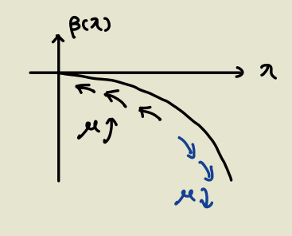

alias:: RG

- # Thought
	- Consider how the properties change **asymptotically** with the size (or some characteristic scale).
		- The reason for considering the asymptotic behavior is we almost only see things at the [[Thermodynamic limit]].
	- Consequently, lots of details can be discarded; we grasp the most salient behavior.
		- Though sometimes details matter a lot, but that's another thing! All methods fail at some time.
- # QFT
	- ## Idea
	  collapsed:: true
		- Find out how $\lambda$ runs with the scale factor $\mu$ (in a scale-dependent RN scheme, e.g. MS).
		- The starting point is that the bare quantities and physical observables are independent of $\mu$.
	- ## Example: Necessity of RG
	  collapsed:: true
		- Problem: Consider $\phi \phi \to \phi \phi$ scattering in $\phi^4$ theory at high energies.
		- Recall the results of renormalization:
		  $$\begin{aligned}
		  (\sqrt{Z} )^{4}\tilde{G}_{amp}^{(4)}\Bigl|_{s=4m^{2} ,\ t=u=0} :=-i\lambda \\
		  Z_{\lambda } -1=\frac{\lambda }{32\pi ^{2}}\left[\frac{3}{\varepsilon } -3\ln\frac{m^{2}}{\mu ^{2}} -A\left( 4m^{2}\right)\right]
		  \end{aligned}$$
		- Then
		  $$
		  \begin{equation*}
		  \begin{aligned}
		  iT_{\phi \phi \rightarrow \phi \phi } =-i\lambda \left\{1+\frac{\lambda }{32\pi ^{2}} [A(s)+A(t)+A(u)]+o\left( \lambda ^{2}\right)\right\}\\
		  \underset{s,|t|,|u|\gg m^{2}}{\longrightarrow } -i\lambda \left\{1+\frac{\lambda }{32\pi ^{2}}\left[\ln\frac{-s}{m^{2}} +\ln\frac{-t}{m^{2}} +\ln\frac{-u}{m^{2}}\right] +\cdots \right\}
		  \end{aligned}
		  \end{equation*}
		  $$
		  which would be **greater than 1** when $s,|t|,|u| \gg m^2$!
		- ### Origin of the problem:
		  The perturbation expansion breaks down when $\lambda \ln \frac s {m^2} \sim 1$, even when $\lambda$ is small!
	- Solution to the above problem:
	  Select a scale-dependent RN scheme. First expand the solution at $\mu \sim m$, then evolve $\lambda$ to $\mu \sim \sqrt{s}$!
	- ## RG equations #card
		- Coupling $\mu$
			- $$\ln\frac{\mu_{2}^{2}}{\mu_{1}^{2}}=\int_{\lambda(\mu_{1})}^{\lambda(\mu_{2})}\frac{d\lambda(\mu)}{\beta(\lambda)}$$
				- $$\beta(\lambda):=\mu^{2}\frac{d}{d(\mu^{2})}\lambda(\mu)=-\varepsilon\lambda(\mu)-\frac{1}{Z_{\lambda}^{\overline{{{MS}}}}}\left(\mu^2\frac{d}{d\mu^{2}}Z_{\lambda}^{\overline{{{MS}}}}\right)\lambda(\mu).$$
			- Derivation
			  collapsed:: true
				- Start from 
				  $$\lambda _{0} =Z_{\lambda }^{\overline{MS}}\tilde{\mu }^{2\varepsilon } \lambda (\mu )$$
				  where LHS is independent of $\mu$.
				- Define the **beta function**:
				  $$\begin{aligned}
				  \mu ^{2}\frac{d}{d\mu ^{2}} \lambda (\mu ) & :=\beta ( \lambda )\\
				   & =\mu ^{2}\frac{d}{d\mu ^{2}}\left[{\tilde{\mu }}^{-2\varepsilon }\left( Z_{\lambda }^{\overline{MS}}\right)^{-1}\right] \lambda _{0}\\
				   & =-\varepsilon \lambda (\mu )-\frac{1}{Z_{\lambda }^{\overline{\overline{MS}}}}\left( \mu ^{2}\frac{d}{d\mu ^{2}} Z_{\lambda }^{\overline{MS}}\right) \lambda (\mu )
				  \end{aligned}$$
		- Mass $m$
		  collapsed:: true
			- $$m_0=Z_m m(\mu)$$
			- Define the **gamma function**:
			  $$
			  \mu^2 \frac{d}{d \mu^2} m(\mu)=\mu^2 \frac{d}{d \mu^2}\left(Z_m^{-1}\right) m_0=\left(-\frac{1}{Z_m} \mu^2 \frac{d}{d \mu^2} Z_m\right) m(\mu) := \gamma(m) \cdot m(\mu)
			  $$
		- Green functions
			- Summary
				- The dependence on $\mu$ would introduce an **anamolous dimension** as a correction to the scaling behavior of Green functions!
			- Starting point:
			  $$
			  \tilde{G}^{(n)}\left(a p_i ; m, \lambda ; \mu\right)=a^{d_G} \tilde{G}^{(n)}\left(p_i ; \frac{m}{a}, \lambda ; \frac{\mu}{a}\right)
			  $$
			- The bare Green function is independent of $\mu$, thus 
			  $$
			  \mu^2 \frac{d}{d \mu^2}\left[Z_\phi^{n / 2} \tilde{G}^{(n)}\left(p_i ; m(\mu), \lambda(\mu) ; \mu\right)\right]=0
			  $$
				- $$
				  \begin{aligned}
				  & \left(\mu^2 \frac{\partial}{\partial \mu^2}+\mu^2 \frac{\partial \lambda}{\partial \mu^2} \frac{\partial}{\partial \lambda}+\mu^2 \frac{\partial m}{\partial \mu^2} \frac{\partial}{\partial m}+\frac{n}{2} \frac{\mu^2}{Z_\phi} \frac{\partial Z_\phi}{\partial \mu^2}\right) \tilde{G}^{(n)}\left(p_i; m(\mu), \lambda(\mu) ; \mu\right) \\
				  & \equiv \left[\mu^2 \frac{\partial}{\partial \mu^2}+\beta(\lambda) \frac{\partial}{\partial \lambda}+\gamma_m(\lambda) m \frac{\partial}{\partial m}+\frac{n}{2} \gamma_\phi(\lambda)\right] \tilde{G}^{(n)}\left(p_i ; m(\mu), \lambda(\mu) ; \mu\right) \\
				  & =0
				  \end{aligned}
				  $$
				- The first three terms are results of derivatives of $\mu$, while the third term isn't,
			- Then
			  $$
			  \begin{aligned}
			  & {\left[\mu^2 \frac{d}{d \mu^2}+\frac{n}{2} \gamma_\phi(\lambda(\mu))\right] F(\mu)=0} \\
			  & F(\mu)=F\left(\mu_0\right) \exp \left[-\frac{n}{2} \int_{\mu_0^2}^{\mu^2} \frac{d \nu^2}{\nu^2} \gamma_\phi(\lambda(\nu))\right]
			  \end{aligned}
			  $$
				- $F(\mu)$ is the shorthand for the Green function as a function of $\mu$.
			- Therefore,
			  $$\begin{aligned}
			  \hat{G}^{(n)}( ap _{i} ;m(\mu ),\lambda (\mu );\mu ) = & a^{d_{G}}\exp\left[\int _{1}^{a}\frac{da^{\prime }}{a^{\prime }} n\gamma _{\phi }\left( \lambda \left( a^{\prime } \mu \right)\right)\right] \times \tilde{G}^{(n)}\left( p_{i} ;\frac{m(a\mu )}{a} ,\lambda (a\mu );\mu \right)
			  \end{aligned}$$
				- Note that we chose $\mu = a\mu_0$ and renamed $\mu_0$ to $\mu$.
				- The exponential is a **correction** to the scaling behavior (mass dimension)!
			- Example. Near a nontrivial fixed point
				- We can approximate $\lambda(a'\mu)=\lambda_*$.
				- \begin{aligned}
				  \exp\left[\int _{1}^{a}\frac{da^{\prime }}{a^{\prime }} 2\gamma _{\phi }\left( \lambda \left( a^{\prime } \mu \right)\right)\right] & \approx \exp\left( 2\gamma _{\phi }( \lambda _{*})\int _{1}^{a}\frac{da^{\prime }}{a^{\prime }}\right)\\
				   & =\left(\frac{p^{2}}{p_{0}^{2}}\right)^{\gamma _{\phi }( \lambda _{*})}\\
				  \tilde{G}^{(2)}\left( p^{2} ;m(\mu ),\lambda (\mu );\mu \right) & \varpropto \frac{1}{\left( p^{2}\right)^{1-\gamma _{\phi }( \lambda _{*})}}
				  \end{aligned}
				- We can clearly see the correction to the mass dimension, $-\gamma_\phi(\lambda_*)$!
	- ## Fixed Points
	  collapsed:: true
		- Def
			- The point where $\beta=0$, i.e. the coupling constant stops flowing.
		- Trivial UV fixed point
		  collapsed:: true
			- Example.
			  $$
			  \begin{aligned}
			  & \beta(\lambda)=\beta_0 \lambda^2+\cdots \quad \text { but } \beta_0<0 \\
			  & \lambda\left(\mu_2\right)=\frac{\lambda\left(\mu_1\right)}{1+\left(-\beta_0\right) \lambda\left(\mu_1\right) \ln \frac{\mu_2^2}{\mu_1^2}}
			  \end{aligned}
			  $$
			- {:height 243, :width 279}
			- The behavior is just the opposite of the IR fixed point:
			  $\lambda \to 0$ for $\mu \to \infty$,
			  $\lambda$ diverges near some $\mu \to \Lambda_{IR}$
				- This happens in QCD, where the low-energy region has strong couplings!
		- Trivial IR fixed point
		  collapsed:: true
			- Example. $\phi^4$ theory
				- $$
				  Z_\lambda=1+\frac{3 \lambda}{32 \pi^2 \varepsilon}
				  $$
				- It's easy to see the first-order dependence of $\beta$ on $\lambda$ vanishes.
				  Therefore we may write 
				  $$\beta=\beta_0\lambda^2+o(\lambda^2)$$
				- Result:
				  $$
				  \lambda\left(\mu_2\right)=\frac{\lambda\left(\mu_1\right)}{1-\beta_0 \lambda\left(\mu_1\right) \ln \frac{\mu_2^2}{\mu_1^2}}
				  $$
				- When $\mu \to 0$, $\lambda(\mu)$ also tends to 0.
				- Note that when $\mu \to \Lambda_{LD}$, $\lambda(\mu) \to \infty$, 
				  which means the perturbation theory breaks down near the scale!
		- Nontrivial fixed point
		- Stability
			- Same as statistical mechanics.
	- ## Dimensionful Couplings and Relevance
	  collapsed:: true
		- Idea
			- The asymptotic behavior of a coupling is decided by its mass dimension.
		- Example. 
		  $$
		  \mathcal{L} =\frac{1}{2} \partial^\mu \phi \partial_\mu \phi-\frac{1}{2} m^2(\mu) \phi^2-\frac{\lambda_4(\mu)}{4 !} \phi^4-\frac{\lambda_6(\mu)}{6 !} \phi^6+\cdots
		  $$
		- Use the scale parameter to make the couplings dimensionless:
		  $$
		  \hat{\lambda}_2=\frac{m^2(\mu)}{\mu^2}, \hat{\lambda}_4=\lambda_4(\mu), \hat{\lambda}_6=\lambda_6(\mu) \mu^2 \text { etc. }
		  $$
		- Behaviors in RG:
		  $$
		  \mu^2 \frac{d}{d \mu^2} \hat{\lambda}_i \equiv \beta_i\left(\hat{\lambda}_j\right)=-\frac{\Delta_i}{2} \hat{\lambda}_i
		  $$
			- Here we ignore the running of $\lambda(\mu)$.
			- We've proven before that the mass dimension of a coupling is precisely $\Delta_i$.
		- Assuming that the theory is still valid at a very high energy scale $\Lambda$, we obtain
		  $$
		  \hat{\lambda}_i(\mu)=\hat{\lambda}_i(\Lambda) \times\left(\frac{\mu}{\Lambda}\right)^{-\Delta_i}
		  $$
			- Non-renormalizable couplings ($\Delta_i<0$) becomes **irrelevant**!
			- $\Delta_i>0$ is called **relevant**.
		-