- ((63902f14-d931-401b-a27f-5d9f95c9791c))
	- For example, physical mass of electrons are not the bare mass.
- # Why it works?
	- Mathematically it is extremely problematic.
		- For example, in field-strength renormalization we first group 1PI diagrams, then sum them up as a geometric series.
			- However, changing the order of summation and integration requires **absolute convergence**. Here the sum doesn't converge absolutely -- it diverges!
		- However, the bunch of seeming total nonsense works (partially)! There must be things deeper behind.
- # Principles and the Paradigm #card
  card-last-interval:: 31.26
  card-repeats:: 1
  card-ease-factor:: 2.6
  card-next-schedule:: 2023-06-26T06:20:56.367Z
  card-last-reviewed:: 2023-05-26T00:20:56.368Z
  card-last-score:: 5
	- ## Empirical Knowledge
		- We can't probe physics at arbitrarily high $E$.
			- Therefore, integrating to $k \to \infty$ is a huge **extrapolation**. (It's miraculous this doesn't fail completely).
			- We can't even be sure that the theory is local or Lorentz covariant at high $E$.
			- #+BEGIN_IMPORTANT
			  Humankind is limited.
			  But this is also a gift and a spectacle; such fragile creatures can try to probe greater and greater structures as $E \to \infty$!
			  #+END_IMPORTANT
			- But can't we?
				- We can't know the full details, but is it possible to test a few **principles** (e.g. Lorentz covariance)?
				- Also, divergence is the prescence of high-energy physics. #[[Thoughts/Math and Physics]]
					- To be more accurate, theoretically there are divergences, but experimentally nothing is divergent. Therefore some mechanism must protect the observables from diverging.
		- Observations at $E \lesssim E_{\max }$ shouldn't depend esssentially on high energies.
		  id:: 6447451d-a5e6-4238-b04e-d4ea94425152
			- Intuitively plausible.
				- Mr. Shao argued it from the uncertainty principle (we can't determine arbitrarily small details with finite energy), which seems not so convincing.
			- **Corollary**. Physical quantities should be independent of regularization.
	- **Conjecture**. We can replace the [[Bare]] quantities by physical quantities ($m_0$ by $m$, $e_0$ by $e$, ...) in the Lagrangian and obtain testable predictions.
		- This is highly nontrivial!
			- In principle the form of the Lagrangian should also change.
		- To be more specific, this is achieved by adding counterterms to cancel the divergences.
			- Note that we can only calculate the loop diagrams by **physical** (renormalized) quantities.
			  The bare quantities is regarded invariant but always unknown.
	- However, what does high $E$ mean?
		- In QM we always have **eigen energy** and **expectation value**. Which is the $E$ here?
- # Schemes of Regularization
	- [[Dimensional Regularization]]
	- [[Cutoff]] Regularization
- # Schemes of Renormalization
	- Note that n-pt functions can have different
	- ## Scheme 1: Cancel the Divergences via Physical Quantities #card
	  card-last-interval:: 33.94
	  card-repeats:: 1
	  card-ease-factor:: 2.6
	  card-next-schedule:: 2023-07-05T01:29:06.940Z
	  card-last-reviewed:: 2023-06-01T03:29:06.941Z
	  card-last-score:: 5
		- Idea
			- Physical quantities like $m,\lambda$ can be determined experimentally.
			- Thus we first express $m,\lambda$ as a function of $m_0,\lambda_0$ and vice versa.
			  The expression must be formally divergent.
			- When we wish to calculate some observable $A$, $A(m_0,\lambda_0)$ is formally divergent,
			  but $A(m_0(m,\lambda),\lambda_0(m,\lambda))$ is **not**.
		- (1) Compute $m,\lambda,Z$ as functions of $m_0,\lambda_0$ to the required order.
			- There are bound to be divergences.
		- (2) Determine $m$ and $\lambda$ at a reference point (e.g. the threshold), where they can be measured **experimentally**.
			- Reinforcements ready!
		- (3) Compute the bare Green function $G_n^{(0)}$ ;
		  express $\lambda_0,m_0$ by $\lambda,m$ and multiply it by $(\sqrt Z)^{-n}$
			- In expressing $\lambda_0,m_0$ by $\lambda,m$ we let the divergences cancel.
		- Finally we obtain the renormalized Green function, which we expect be **divergence-free** and **regularization-independent**.
		-
	- ## Scheme 2: Cancel the Divergent Diagrams by Counter-terms #card
		- Idea
			- Rewrite the Lagrangian as a physical part and a counter-term part.
			  The counter terms are regarded as extra interaction vertices.
			- The latter part produce diagrams which cancel the divergent diagrams of the physical part.
			  Thus we may only consider tree-level diagrams of the physical part.
		- (1) Write $\phi_0=\sqrt{Z} \phi, m_0^2=m^2+\delta m^2, \lambda_0=Z_\lambda \lambda \tilde{\mu}^{2 \varepsilon}$ where $Z, \delta m^2, Z_\lambda$ are to be determined.
		- (2) Rearrange the Lagrangian into a 'physical part' and a 'counter part':
		  $$\begin{aligned}
		  \mathcal{L} = & \frac{1}{2}\left( \partial ^{\mu } \phi _{0} \partial _{\mu } \phi _{0} -m_{0}^{2} \phi _{0}^{2}\right) -\frac{\lambda _{0}}{4!} \phi _{0}^{4}\\
		  = & \frac{1}{2} Z\partial ^{\mu } \phi \partial _{\mu } \phi -\frac{1}{2} Z\left( m^{2} +\delta m^{2}\right) \phi ^{2} -Z_{\lambda } Z^{2}\tilde{\mu }^{2\varepsilon }\frac{\lambda }{4!} \phi ^{4}\\
		  = & \left\{\frac{1}{2} \partial ^{\mu } \phi \partial _{\mu } \phi -\frac{1}{2} m^{2} \phi ^{2} -\frac{\lambda \tilde{\mu }^{2\varepsilon }}{4!} \phi ^{4}\right\} \ \text{(Physical)} \ +\\
		   & \left\{\frac{1}{2} (Z-1)\partial ^{\mu } \phi \partial _{\mu } \phi -\frac{1}{2}\left[ (Z-1)m^{2} +Z\delta {m}^{2}\right] \phi ^{2} -\left( Z_{\lambda } Z^{2} -1\right)\frac{\lambda \tilde{\mu }^{2\varepsilon }}{4!} \phi ^{4}\right\} \ \text{(Counter)}
		  \end{aligned}$$
			- The counter term is to cancel all effects of renormalization and keep the formalism simple and elegant.
			- Note that $\frac 1 2 (Z-1)\partial ^{\mu } \phi \partial _{\mu } \phi$ would produce a vertex of $-\frac 1 2 (Z-1) p^2$ (instead of $-\frac 1 2 \frac i {p^2-m^2}$, the form of a propagator)
		- (3) Determine the counter terms order by order from the requirement that
		  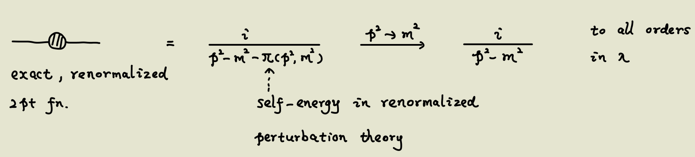
		  Which translates into
		  $$\left.\Pi\left(p^2, m^2\right)\right|_{p^2=m^2}=\left.0 , \quad \frac{d \Pi}{d p^2}\right|_{p^2=m^2}=0$$
			- Which means the **physical propagator** is simple and elegant.
			- Note that it is not guaranteed that there is a solution which works at all order.
			  background-color:: yellow
			  In fact the existence is itself extremely nontrivial.
		- *Illustration of how to determine the counterterms
			- 1-loop order:
				- 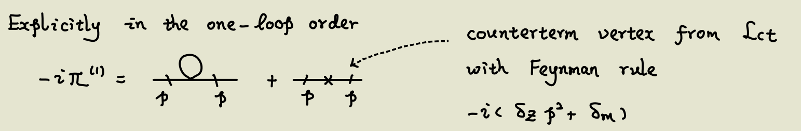{:height 178, :width 1035}
				- $$\begin{aligned}
				  \overset{\text{Cutoff Regularization}}{=} & \frac{-i\lambda }{32\pi ^{2}}\left[ \Lambda ^{2} -m^{2}\ln\frac{\Lambda ^{2}}{m^{2}} +o\left(\frac{m^{4}}{\Lambda ^{2}}\right)\right] -i\left( \delta _{z} p^{2} +\delta _{m}\right)\\
				  \stackrel{p^{2}\rightarrow m^{2}}{\Longrightarrow } & \left\{\begin{array}{ l }
				  \delta _{Z} m^{2} +\delta \left( m^{2}\right) =-\frac{\lambda }{32\pi ^{2}}\left[ \Lambda ^{2} -m^{2}\ln\frac{\Lambda ^{2}}{m^{2}} +o\left(\frac{m^{4}}{\Lambda ^{2}}\right)\right]\\
				  \delta _{Z} =0
				  \end{array}\right. \\
				  \Longrightarrow  & \delta \left( m^{2}\right) =-\frac{\lambda }{32\pi ^{2}}\left[ \Lambda ^{2} -m^{2}\ln\frac{\Lambda ^{2}}{m^{2}} +0\left(\frac{m^{4}}{\Lambda ^{2}}\right)\right]
				  \end{aligned}$$
			- 2-loop order
				- 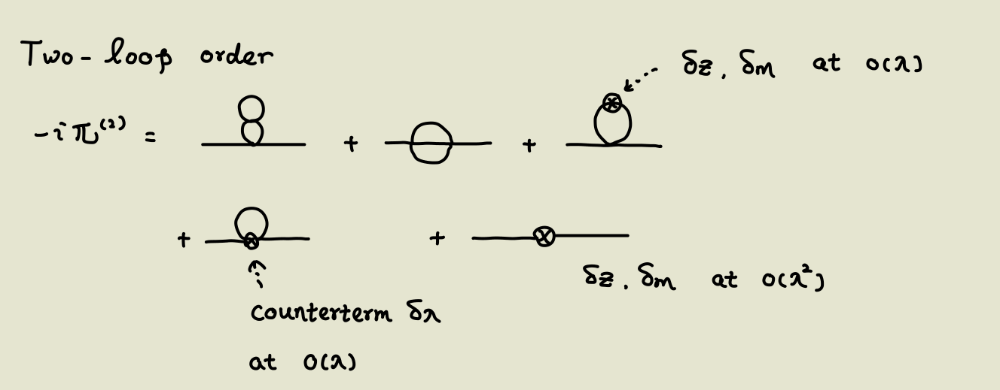{:height 350, :width 863}
	- ## Scheme 3: Modified Minimal Subtraction $\overline{MS}$
		- Idea
			- This is similar to scheme 2. But we change the requirement here:
			  In scheme 2 we require the counterterms make $\Pi=0$ and $\frac {d\Pi}{dp^2}=0$ at $p^2=m^2$.
			  Here we only require the counterterms to cancel the divergences.
		- Example in $\phi^4$ theory
			- $$\begin{aligned}
			  -i\Pi  = & \frac{-i\lambda }{32\pi ^{2}}\left( -m^{2}\right)\left(\frac{1}{\varepsilon } -\ln\frac{m^{2}}{\mu ^{2}} +1\right) -i\left( \delta _{Z} p^{2} +\delta _{m}\right)\\
			  \text{ on-shell:} \ \delta _{m} = & \frac{\lambda }{32\pi ^{2}} m^{2}\left(\frac{1}{\varepsilon } -\ln\frac{m^{2}}{\mu ^{2}} +1\right) \ \ \text{so that } \Pi | _{p^{2} =m^{2}} =0\\
			  \overline{MS} \ \ :\ \ \delta _{m} = & \frac{\lambda }{32\pi ^{2}} m^{2}\frac{1}{\varepsilon } \ \text{Only cancelling the divergence}
			  \end{aligned}$$
			- Thus we can compare the physical mass (on-shell mass) and the MS mass:
			  $$\begin{aligned}
			  m_{0}^{2} = & m_{\text{phys }}^{2} +\delta m_{\text{phys }}^{2} =m_{\text{phys }}^{2}\left[ 1+\frac{\lambda }{32\pi ^{2}}\left(\frac{1}{\varepsilon } -\ln\frac{m_{\text{phys }}^{2}}{\mu ^{2}} +1\right)\right]\\
			  = & \overline{m}^{2} (\mu )+\delta \overline{m}^{2} (\mu )=\overline{m}^{2} (\mu )\left[ 1+\frac{\lambda }{32\pi ^{2}}\left(\frac{1}{\varepsilon }\right) +\cdots \right]\\
			  m_{\text{phys }}^{2} = & \overline{m}^{2} (\mu )\left[ 1+\frac{\lambda }{32\pi ^{2}}\left(\ln\frac{\overline{m}^{2} (\mu )}{\mu ^{2}} +1\right) +o\left( \lambda ^{2}\right)\right]
			  \end{aligned}$$
			- We see that the mass in the MS scheme is dependent on the scale factor $\mu$. This is a common feature for quantities in the scale-dependent renormalization schemes.
			  background-color:: yellow
		- Note
			- **We do not need to calculate the precise values of the diagrams to obtain the leading divergence!**
			  Only a power counting is needed.
			- Example. $\phi^4$ theory
				-
	- ## Scheme 4: On-Shell Renormalization
	  id:: 646583f6-fc6a-48ee-bd91-b8dcc742e15f
		- Idea
			- We want the propagator to be in the desired form when $p^2 \to m^2$.
		- The bare propagator:
		  $$S_0^{(2)}(p)=\int d^4 x e^{i p \cdot x}\left\langle\Omega\left|T\left\{\psi_0(x) \bar{\psi}_0(0)\right\}\right| \Omega\right\rangle \\
		  \overset{p^2 \to m^2}{\to} Z_2 \frac{i(\not p+m)}{p^2-m^2+i \varepsilon}+\text { non-singular. }$$
			- Note that fields in the first line are bare fields, but mass in the second line is the **physical** mass.
			- The physical meaning: At low energies ($p^2 - m^2$ not large), the propagator is the physical propagator.
				- Note that the propagator is not only defined for on-shell momenta.
		- The renormalized propagator:
		  $$S^{(2)}(p)=\frac{i}{p-m-\Sigma(p, m)} \quad \stackrel{p^2 \rightarrow m^2}{\longrightarrow} \frac{i}{\not p-m+i \varepsilon}$$
			-
- # Renormalized Perturbation Theory
	- Idea #card
	  card-last-interval:: 31.26
	  card-repeats:: 1
	  card-ease-factor:: 2.6
	  card-next-schedule:: 2023-07-02T07:56:39.213Z
	  card-last-reviewed:: 2023-06-01T01:56:39.213Z
	  card-last-score:: 5
		- The 'real world of QFT' is quite messy. We must consider lots of renormalizations; what's worse, we don't know how to obtain a divergence-free result.
		- We have different schemes.
			- Do two things to obtain an elegant formalism:
			  1. Redefine the field and constants to account for all renormalization
			  2. Let the divergences cancel by comparing different kinematics (momenta)
			- Separate bare quantities into a physical term and a counter term. All divergences are cancelled by the counter terms!
		- #+BEGIN_CAUTION
		  It's like I suddenly find that the simple world in QFT1, where the propagator is a simple $\frac i {p^2-m^2+i\varepsilon}$ and we don't have to worry about loops or divergences, is supported by a dark and complicated 'real world'...
		  #+END_CAUTION
	- Renormalized Field
		- Starting point:
		  $$
		  \int d^4 x e^{i p \cdot x}\left\langle\Omega\left|T\left\{\phi_0(x) \phi_0(0)\right\}\right| \Omega\right\rangle \stackrel{p^2 \rightarrow m^2}{\longrightarrow} \frac{i Z}{p^2-m^2+i \varepsilon}+\cdots
		  $$
			- We want to get rid of the awkward factor of $Z$, which is even divergent.
		- Def. $\phi_0=\sqrt{Z} \phi$
			- $\phi_0$ is the bare field and $\phi$ is the renormalized one
			- Correspondingly, the **renormalized Green function** writes
			  $$G^{(n)}( x_{1} \cdots x_{n}) =(\sqrt{Z} )^{-n} G_{0}^{(n)}( x_{1} \cdots x_{n}) \equiv (\sqrt{Z} )^{-n} \left\langle \Omega| T\{\phi _{0}( x_{1}) \cdots \phi _{0}( x_{n})\}|\Omega \right\rangle $$
			  where all factors of $Z$ are killed.
			-
- # Systematic Analysis
	- Summary #card
	  card-last-interval:: 28.74
	  card-repeats:: 1
	  card-ease-factor:: 2.6
	  card-next-schedule:: 2023-06-16T17:51:06.797Z
	  card-last-reviewed:: 2023-05-19T00:51:06.797Z
	  card-last-score:: 5
		- Starting point: How to characterize renormalizability?
		- Idea: Determine convergence by the power of momenta in the integrand
			- Note that the integrand is always a fraction of polynomials in $p$, whose UV convergence can be determined by the power analysis.
		- Detailed analysis
			- Divergent subdiagrams:
			- Multi-loop diagrams:
		- Final theorem of renormalizability:
		  (a) $\Delta_i \geqslant 0$ for all vertices
		  (b) $\mathcal{L}$ contains all vertices compatible with the symmetries of the (regularized) theory. (The regularization may break a symmetry Then it is no longer a symmetry of $\mathcal{L}$)
	- ## Starting point
		- Question: Is all theories renormalizable? If not, how to characterize renormalizability?
		  background-color:: red
		- Intuitively, we only have a finite number of parameters (mass, coupling constant, etc). Can we cancel divergences in **all** diagrams by the finite parameters?
	- ## Setup
		- Notations
			- $\gamma$ : 1PI Feynmann diagram
			- $L$ : number of loops
			- $I_{f}$ : number of internal lines (propagators) of field of type $f$
			- $E_{f}$: number of external lines (propagators) of field of type $f$
			- $s_f$: The propagator of field $f$ is asymptotically $1/(k^2)^{1-s_f}$
				- e.g. $s_f=0$ for scalar fields, $s_f=1/2$ for Dirac fields.
			- $V_{i}$ : number of vertices of type $i$
			- $a_{i}$ : number of derivatives on fields in vertex of type $i$
			- $n_{if}$: number of fields of type $f$ in vertex of type $i$
			- $d$ : Spacetime dimension
			-
		- Definitions
			- Degree of divergence, $D(\gamma)$
				- {Maximal power of momenta in the numerator, including the integration measure} - {maximal power of momenta in the denominator}
				- Example. 
				  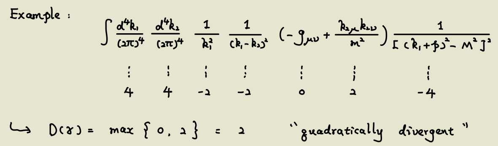{:height 307, :width 957}
	- ## Simplifications
		- Note that lines connecting 1PI diagrams cannot contain loops, so we may just analyze 1PI diagrams.
			- Analogous to 'analyze path-connected spaces'.
	- ## Counting the divergences
		- Idea
			- Count the total powers of momenta (numerator - denominator).
			  If the power is greater than zero, then the diagram surely diverges.
		- Proposition. If $D(\gamma) \geq 0$, then the diagram must be divergent.
			- If $D(\gamma)=0$, the integration behaves like $\int \frac {dx}{x}$, which is **logarithmically divergent**.
		- Proposition. $D(\gamma)=\sum_f I_f\left(2 s_f-2\right)+\sum_i V_i a_i+d L$
			- The first term is the momenta from the propagators.
			- The second term is the momenta from the vertices.
				- Note that here we assumed there's no momenta contribution if there's no derivative.
			- The third term counts the contribution from the integration measure.
				- Each independent loop gives rise to a free momentum to be integrated over.
		- ### Simplify the expression by graph theory
			- Proposition. For connected diagrams, $L=\sum_f I_f-\sum_i V_i+1$.
				- This is Euler's formula, $V-E+F=2$.
				- Note that $L=F-1$, since the face $\mathbb R^2-\gamma$ isn't a loop.
			- Proposition. $2I_f+E_f=\sum_i V_i n_{if}$
	- ## Divergence of Subdiagrams
		- The above counting still has a flaw:
		  A subdiagram can still be divergent even if $D(\gamma)<0$.
			- Example.
			  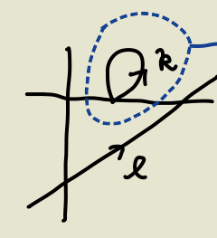
		- **Nevertheless, the problem can be fixed.**
			- In the above example:
			  We have a counterterm $\delta_m$ for the divergent subdiagram, thus we can use the following diagram to cancel the divergence:
			  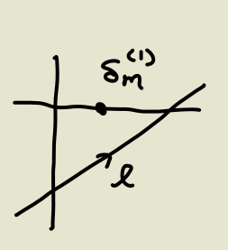
			- More generally, we can always divide the diagram to find the divergent subdiagram with $D(\eta) \geq 0$
				- Theorem (Weinberg). A diagram is convergent iff all subdiagrams $\eta$ satisfy $D(\eta)<0$.
					- This ensures we can always find $\eta$ if there's divergence in the whole diagram.
	- ## Divergence of multi-loop diagrams
		- Example in $\phi^4$ theory
			- 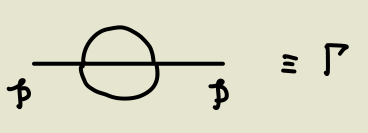
			- Compute by dimensional regularization: 
			  $$
			  \Gamma=\lambda^2 \times\left\{\rho^2[\cdots]-m^2\left[\frac{a}{\varepsilon^2}+\frac{2 a}{\varepsilon} \ln \frac{\mu^2}{p^2}+\frac{b}{\varepsilon}+\text { finite }\right]\right\}
			  $$
			- **Problem**
				- It's impossible to cancel the divergence by $\delta_m$ or $\delta\lambda$, since they cannot produce the desired momentum-dependence of $\ln (p^2)$
			- **Solution?**
				- We can also construct loop diagrams from the counterterms!
				- This diagram would produce the desired divergence-cancelling:
				  
	- Theorem.
	  $$\begin{aligned}
	  D(\gamma ) & = d-\sum _{f} E_{f}\left(\frac{d}{2} -1+s_{f}\right) -\sum _{i} V_{i} \Delta _{i}\\
	   & \text{ with } \Delta _{i} \equiv d-a_{i} -\sum _{f} n_{if}\left(\frac{d}{2} -1+s_{f}\right)
	  \end{aligned}$$
		- This can be proven by plugging in the above propositions.
		- But its meaning is quite deep. 
		  If $D(\gamma)$ decreases with the number of external lines and vertices, as the theorem suggests, then we only have **finite** diagrams with $D(\gamma) \geq 0$.
			- Example. Scalar field theory:
			- $$\begin{array}{ c c c }
			   \begin{array}{l}
			  Corresponding\\
			  Parameters
			  \end{array} &  \begin{array}{l}
			  Green\\
			  Functions
			  \end{array} &  \begin{array}{l}
			  Maximal\\
			  value\ of\ D( \gamma )
			  \end{array}\\
			  \delta m^{2} ,\ \ Z & \phi \phi  & 2\\
			  \delta _{\lambda _{3}} & \phi \phi \phi  & 1\\
			  \delta _{\lambda _{4}} & \phi \phi \phi \phi  & 0
			  \end{array}$$
			- All higher-order diagrams have $D(\gamma)<0$!
		- Proposition. For an interaction vertex of type $i$, $[g_i]=\Delta_i$ #card
		  id:: 64584d97-557f-41f3-84d3-5a851bb4c2c9
		  card-last-interval:: 30
		  card-repeats:: 1
		  card-ease-factor:: 2.6
		  card-next-schedule:: 2023-06-12T01:04:17.678Z
		  card-last-reviewed:: 2023-05-13T01:04:17.678Z
		  card-last-score:: 5
			- Starting points
				- $S=\int d^dx \mathcal L$ is dimensionless.
				- $$G_F(k):=\int d^dx e^{-ikx} \langle \phi_f(x) \phi_f(0) \rangle \sim \frac 1 {(k^2)^{1-s_f}}$$
	-
	- ## The Renormalizability Theorem
		- Definition. Renormalizable #card
		  card-last-interval:: 33.94
		  card-repeats:: 1
		  card-ease-factor:: 2.6
		  card-next-schedule:: 2023-06-26T22:09:43.262Z
		  card-last-reviewed:: 2023-05-24T00:09:43.262Z
		  card-last-score:: 5
			- All physical quantities can be rendered finite by a reparameterization of fields, masses and couplings.
			- An interaction is **super-renormalizable** if $\Delta_i >0$.
		- Theorem. Conditions for renormalizability:
		  (a) $\Delta_i \geqslant 0$ for all vertices
		  (b) $\mathcal{L}$ contains all vertices compatible with the symmetries of the (regularized) theory. (The regularization may break a symmetry Then it is no longer a symmetry of $\mathcal{L}$)
			- The first guarantees that we won't obtain new divergences by adding vertices (going to higher orders)
			- The second could be motivated by the following case:
				- Consider the double-scalar theory
				  $$
				  \mathcal{L}=\sum_{i=1,2} \frac{1}{2}\left(\partial^\mu \phi_i \partial_\mu \phi_i-m_i^2 \phi_i^2\right)-\frac{\lambda}{4 !} \phi_1^2 \phi_2^2
				  $$
				- The $\phi_1\phi_1 \to \phi_1\phi_1$ scattering:
				  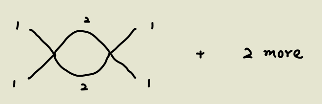
				- We must have a $\lambda_1 \phi_1^4$ term to cancel the divergence here! Thus we shall assume the term was present in the original Lagrangian and can be reparameterized.
- # Effective QFT
	- Two motivations
		- (a) Is a non-renormalizable theory (i.e. containing some $\Delta_i<0$) completely unpredictive and useless?
		- (b) Can we integrate out some heavy degrees of freedom to obtain a simpler effective theory?
	- Example 1. A non-renormalizable theory
		- $$
		  \mathcal{L}=\frac{1}{2}\left(\partial^\mu \phi \partial_\mu \phi-m^2 \phi^2\right)-\frac{\lambda_4}{4 !} \phi^4-\frac{\lambda_6}{6 !} \phi^6
		  $$
		- $[\lambda_6]=-2$, which means $\Delta_6=-2$ by the [theorem](((64584d97-557f-41f3-84d3-5a851bb4c2c9))). Thus the theory is non-renormalizable, i.e. we'd need infinite counter terms to cancel the divergences.
		- However, if we consider a scattering process with all momenta (including the internal ones!) is smaller than some energy scale $E$, then the theory may still make sense.
			- Equivalent to a cutoff!
		- Specifically, the higher the power of the interaction, the more it is suppressed, thus we may ignore interactions higher than a certain power..
	- Example 2. Integrate out the heavy d.o.f.
		- $$
		  \mathcal{L}=\partial_\mu \phi^{\dagger} \partial^\mu \phi-m^2 \phi^{\dagger} \phi+\frac{1}{2} \partial_\mu \rho \partial^\mu \rho-\frac{1}{2} M^2 \rho^2-\frac{k_3}{3 !} \rho^3-g \rho \phi^{\dagger} \phi
		  $$
			- Note that it is **super-renormalizable**.
		- Now consider some process where $p_i,p_j,m \ll M$, i.e. The $\rho$ particle is very heavy.
			- Thought: The $\rho$ particles cannot be produced, only act as internal lines.
			  we can find an effective Lagrangian $\mathcal L_{eff}$ s.t.
			  $$T_{\beta \alpha }\big |_{ computed\ with\ \mathcal{L}} =T_{\beta \alpha }\big |_{ computed\ with\ \mathcal{L}_{eff}} +o((\frac{E}{M})^a)$$
			-
			- The process of determining the coupling constant is called **matching**.
				- The idea is comparing the scattering processes of the effective theory and the original theory.
				  By requiring that the amplitudes are identical, we can fix the effective coupling constants.
				- $\phi^4$ term:
				  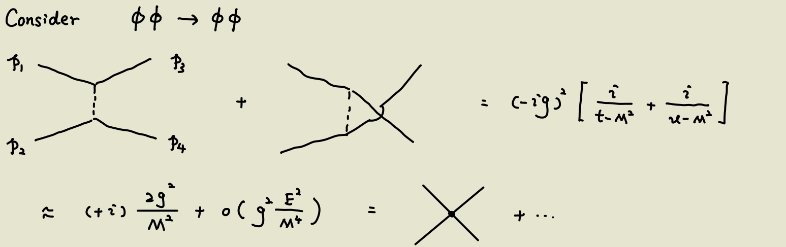{:height 314, :width 869}
				- $\phi^6$ term:
				  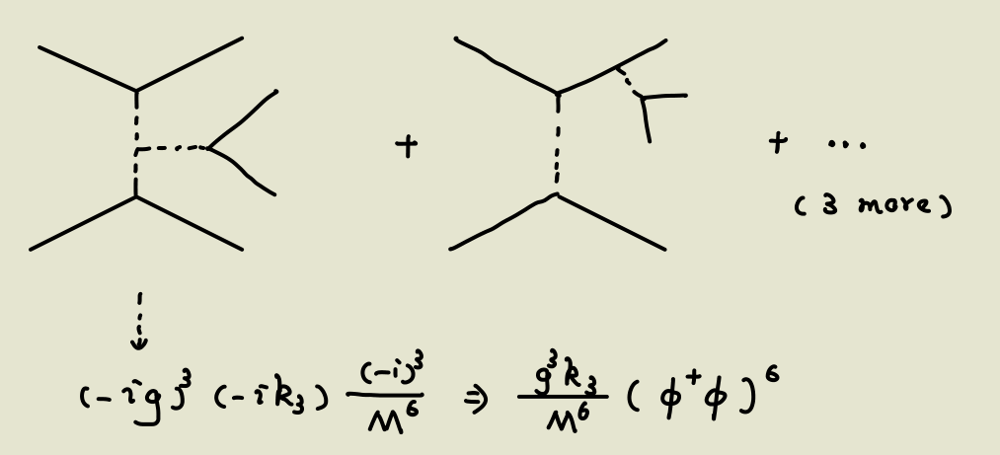{:height 347, :width 712}
				- And so on and so on.
			-
			-
			-
- # [[Renormalization Group]]
- # Thoughts
	- ## Flaws of Perturbation Theory?
		- From the viewpoint of exact diagonalization
			- The behaviors of low energy levels are completely determined by their energies and evolve according to $e^{iE_n t}$.
			- High energies shall not have any influences on the low energy levels!
		- However, if we want to calculate the transition amplitude perturbatively, we must sum over **all** energy levels (if we want to go beyond the first order).
			- See ((644730bc-03b5-48b5-a75e-c31bdf1e5919))
			- This can be explained in another viewpoint: We're in the **wrong basis**.
				- We've selected the eigenstates of the unperturbed Hamiltonian, which in general is a superposition of the eigenstates of the full Hamiltonian, with possibly eigenstates of arbitrarily high energies.
			-
	- ## Divergence, Cutoff and New Physics
		- Fluid mechanics
			- Microscopic degrees of freedom (motion of the atoms) behave as macroscopic degrees of freedom (transportation, sound waves) after renormalization.
			- When the scale is too small, macroscopic fluid mechanics breaks down. 
			  It implies the existence of finer structures at the atomic level.
		- [[QFT]]
			- ((63902fd3-2777-45da-a15d-df163f153399))
			- It is a miracle that the [[Photon]] has zero mass!
- # Examples
	- $\phi \phi \to \phi \phi$ at 1-loop for $\phi^4$ theory
		- Draw the diagrams:
		  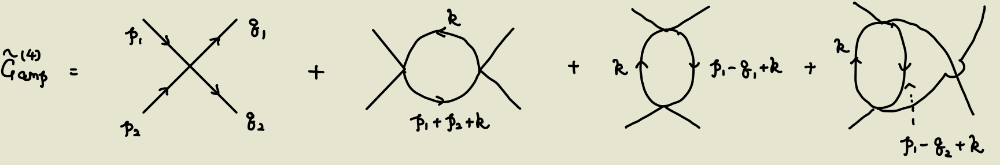
		- The amplitude can be calculated by dimensional regularization:
		  $$iT=(\sqrt{Z} )^{4}\tilde{G}_{amp}^{(4)}( q_{1} q_{2} ,p_{1} p_{2})$$
		  $$
		  \tilde{G}_{a m p}^{(4)}=-i \lambda_0\left\{1-\frac{\lambda_0 \tilde{\mu}^{-2 \varepsilon}}{32 \pi^2}\left[\frac{3}{\varepsilon}-3 \ln \frac{m_0^2}{\mu^2}-A(s)-A(t)-A(u)\right]+o\left(\lambda_0^2\right)\right\}
		  $$
			- $\tilde \mu$ is introduced to keep the mass dimension to zero (at $d=4-2\varepsilon$)
			- $\sqrt Z$ appears since the renormalized field $\phi =\frac 1 {\sqrt Z} \phi_0$. Here the internal fields are renormalized ones (the propagators are $\frac i {p^2-m^2+i\varepsilon}$), but the external fields are **not**.
			- $s,t,u$ are the ((64238e6c-1aa2-4233-b9ab-a0b3e391eda2))
		- The amplitude is **divergent** at $d=4$. But we can still make some sense out of this. #card
		  card-last-interval:: 32.57
		  card-repeats:: 1
		  card-ease-factor:: 2.6
		  card-next-schedule:: 2023-06-06T01:52:08.575Z
		  card-last-reviewed:: 2023-05-04T12:52:08.576Z
		  card-last-score:: 5
			- Idea: We can measure $\lambda$ at some reference scattering process (e.g. at the shreshold, i.e. $s=4m^2,u=t=0$).
			  Then we can compare different momenta to **cancel the divergence**.
				- In other words, experimental data could also be a valuable input -- to fix a 'reference' not available from first principles! #[[Thoughts/Math and Physics]]
				- This works since the UV divergence arises from the loop momenta and is independent of external momenta.
			- Specifically:
				- The effective coupling $\lambda$ at the threshold satisfies
				  $$
				  \left.(\sqrt{Z})^4 \tilde{G}_{a m p}^{(4)}\right|_{s=4 m^2, u=t=0} \equiv-i \lambda \tilde{\mu}^{2 \varepsilon}
				  $$
				  which can be measured experimentally.
				- With cut-off regularization, we can write down
				  $$
				  \lambda=\lambda_0\left\{1-\frac{\lambda_0}{32 \pi^2}\left[3 \ln \frac{\Lambda^2}{m_0^2}-3-A\left(4 m^2\right)\right]+\cdots\right\}
				  $$
				- Then we express the amplitudes at other kinematics by $\lambda$:
				  $$\begin{aligned}
				  (\sqrt{Z} )^{4}\tilde{G}_{amp}^{(4)} = & -i\lambda \tilde{\mu }^{2\varepsilon }\left\{1+\frac{\lambda }{32\pi ^{2}}\left[\frac{3}{\varepsilon } -3\ln\frac{m_{0}^{2}}{\mu ^{2}} -A\left( 4m^{2}\right)\right] +o\left( \lambda ^{2}\right)\right\}\\
				   & \times \left\{1-\frac{\lambda }{32\pi ^{2}}\left[\frac{3}{\varepsilon } -3\ln\frac{m_{0}^{2}}{\mu ^{2}} -A(s)-A(t)-A(u)\right] +o\left( \lambda ^{2}\right)\right\}\\
				  = & -i\lambda \left\{1+\frac{\lambda }{32\pi ^{2}}\left[ A(s)+A(t)+A(u)-A\left( 4m^{2}\right)\right] +o\left( \lambda ^{2}\right)\right\}
				  \end{aligned}$$
				  which is free from divergence and $Z$!
				-
		-
	- Renormalization of [[QED]]
		- Setup
			- $$
			  \mathcal{L}=-\frac{1}{4} F_{\mu \nu} F^{\mu \nu}-\frac{1}{2 \xi}\left(\partial^\mu A_\mu\right)^2+\tilde{\psi}\left(i \gamma^\mu D_\mu-m\right) \psi
			  $$
				- The second term is the gauge-fixing term.
				- Correspondingly, the photon propagator becomes $\frac{i}{k^2+i \varepsilon}\left[-g_{\mu \nu}+(1-\xi) \frac{k_{\mu k}}{k^2}\right]$
			- $$\begin{aligned}
			  & A_0^\mu(x)=\sqrt{Z_3} A^\mu(x), \quad \psi_0(x)=\sqrt{Z_2} \psi(x) \\
			  & e_0=Z_e e , \zeta_0=Z_\zeta \zeta , m_0=Z_m m 
			  \end{aligned}$$
		- Overview
			- The strategy is to examine certain loop diagrams and obtain the counterterms.
				- Moreover, the diagrams to investigate have clear physical meanings.
				  For example, the electron vertex function renormalizes $e$ (the coupling constant); electron and phonon propagators renormalize the fields and masses respectively.
			- Note that not all interactions with $[O_i] \leq 4$ are included, since some are forbidden by the gauge symmetry.
				- e.g. $A_\mu A^\mu, \quad\left(\partial_\mu A_\nu\right) A^\mu A^\nu, \quad A^\mu A^\nu A_\mu A_\nu$
		- Field and mass renormalization
			- Use ((646583f6-fc6a-48ee-bd91-b8dcc742e15f))
			- The analysis is similar to Peskin Chapter 7:
			  First give a general analysis about 1PI diagrams (geometric series), then calculate the 1-loop diagram.
			- For photons:
				- $\begin{aligned} G^{(2)}(k) & =\frac{i}{k^2+i \varepsilon}\left[\left(-g_{\mu \nu}+\frac{k_\mu k_\nu}{k^2}\right) \frac{1}{1-\pi\left(k^2\right)}-\zeta \frac{k_\mu k_\nu}{k^2}\right] \\ & \overset{!}{\underset{k^2 \rightarrow 0}{\longrightarrow}} \frac{i}{k^2+i \varepsilon}\left[-g_{\mu \nu}+(1-\zeta) \frac{k_\mu k_\nu}{k^2}\right]+\text { non-singular }\end{aligned}$
					- The analysis can be found [here](((6454f15c-e712-4319-b778-d214749416af))).
					- The key point is to observe a projector and construct a geometric sequence of **scalars**.
				- Compare to the desired form of the propagator, we find
				  $$Z_3=[1-\pi_0(k^2=0)]^{-1}$$
		- Electric charge renormalization
			- Overview
				- Examine the diagram
				  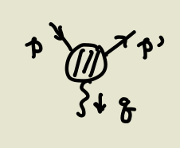{:height 148, :width 188}
				  and require it to be $(2\pi)^4 \delta^4(\sum p) (-i e) \bar{u}\left(\beta^{\prime}, s^{\prime}\right) \gamma^\mu u(\beta, s) \varepsilon_\mu(q, \lambda)$ in the limit $q \to 0$.
			- Again similar to the analysis in Peskin Chap.7, we find it to be
			  $$(2\pi )^{4} \delta ^{(4)}\left( p^{\prime } +q-p\right)\sqrt{Z_{3}} Z_{2}( -ie_{0})\overline{u}\left( p^{\prime } ,s^{\prime }\right) \Gamma _{0}^{\mu }\left( p,p^{\prime }\right) u(p,s)\varepsilon _{\mu }^{*} (q,\lambda )$$
			- We've analyzed the vertex function before and found it to be
			  $$
			  \Gamma_0^\mu\left(p^{\prime}, p\right)=\gamma^\mu F_1^0\left(q^2, m\right)+\frac{i \sigma^{\mu \nu}\left(p'-p\right)_\nu}{2 m} F_2^0\left(q^2, m\right)
			  $$
			- The second form factor vanishes for $q \to 0$, therefore by requiring $F_1^{(physical)}(q^2=0,m^2)=1$, we find
			  $$
			  \frac{1}{Z_e}=\sqrt{Z_3} Z_2 F_1^0\left(q^2=0, m\right)
			  $$
		- An extra relation from gauge invariance
			- Recall that we can obtain 
			  \begin{equation*}
			  \begin{aligned}
			   & \partial _{x}^{\mu }\left< \Omega|T\left\{j_{\mu }^{\alpha }[ \phi _{n}( x)] \phi _{n_{1}}( x_{1}) \cdots \phi _{n_{m}}( x_{m})\right\} |\Omega\right> \\
			   & =(-i)\sum _{k=1}^{m} \delta ^{(4)}( x-x_{k})\left< \Omega\left| T\left\{\phi _{n_{1}}( x_{1}) \cdots \phi _{n_{k-1}}( x_{k-1}) F_{n_{k}}^{a}[ \phi _{m}( x_{k})] \phi _{n_{k+1}}( x_{k+1}) \dotsc \phi _{n_{m}}( x_{m})\right\}\right| \Omega\right> 
			  \end{aligned}
			  \end{equation*}
			  by gauge invariance.
			- Here we consider the 2-point function:
			  $$\partial _{\mu }^{(x)}\left< \Omega\left| T\left\{j_{0}^{\mu } (x)\psi _{0\alpha }( z_{1})\overline{\psi }_{\circ \beta }( z_{2})\right\}\right| \Omega\right> =\delta ^{(4)}( x-z_{1})< \Omega| T\{\psi _{0\alpha }( z_{1})\overline{\psi }_{0\beta }( z_{2})\}| \Omega) -\delta ^{(x)}( x-z_{2})< \Omega| T\{\psi _{0\alpha }( z_{1})\overline{\psi }_{0\beta }( z_{2})\}| \Omega\rangle  $$
			- After Fourier transformation:
				- $$LHS=(2\pi )^{4} \delta ^{(4)}\left( q+p^{\prime } -p\right) (-iq_{\mu } )S_{0\alpha \alpha ^{\prime }}\left( p^{\prime }\right)\hat{\Gamma }_{0\alpha ^{\prime } \beta ^{\prime }}\left( p^{\prime } ,p\right) S_{0\beta ^{\prime } \beta } (p)$$
					- 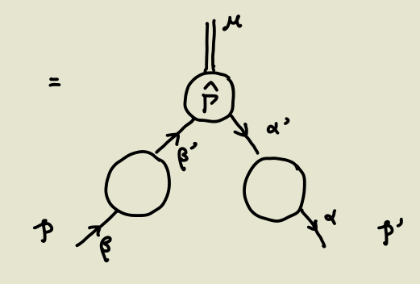{:height 239, :width 312}
					- Here the double line means that a momentum is multiplied.
					- Note that the index $\mu$ is actually summed over all 4 values, which is the same as the case
					  $$J=e\bar\psi \gamma^\mu A_\mu \psi$$
				- $$RHS=(2\pi )^{4} \delta ^{(4)}\left( q+p^{\prime } -p\right) (-1)\left[ S_{0\alpha \beta } (p)-S_{0\alpha \beta }\left( p^{\prime }\right)\right]$$
			- Compare LHS and RHS, we find an extra relation:
			  $$iq_\mu S_0(p') \Gamma^\mu(p',p) S_0(p)=[S_0(p)-S_0(p')]$$
			- Take the limit $q \to 0$ and use $S_0=Z_2 S$, this is equivalent to
			  $$
			  \left.\Gamma_0^\mu\left(p, p^{\prime}\right)\right|_{p^{\prime} \rightarrow p}=i \frac{\partial}{\partial p_\mu} S_0^{-1}(p)
			  $$
	- [[Field-Strength Renormalization]]
	- [[Electric Charge Renormalization]]
	- [[QCD]]
		- Setup
			- \begin{aligned}
			   & A_{\mu 0}^{a} (x)=\sqrt{Z_{3}} A_{\mu }^{a} (x),\ \ \psi _{i0} (x)=\sqrt{Z_{2}} \psi _{i} (x),\quad c^{a} =Z_{3c} c_{0}^{a}\\
			   & g_{0} =Z_{g} g,m_{0} =Z_{m} m\\
			  \mathcal{L}_{\text{int }} & =g_{0}\overline{\psi }_{0} A_{0} \psi _{0}\\
			   & =Z_{1} \cdot g\tilde{\mu }^{\varepsilon }\overline{\psi } A\psi 
			  \end{aligned}
		- Notes
			- The definition of $Z_1$ isn't independent from others.
				- We can find $Z_1=\frac{Z_g}{Z_2 \sqrt{Z_3}}$
		- Summarize all counterterms:
		  $$
		  \begin{aligned}
		  & \delta_1 \equiv Z_1-1=\frac{1}{2 \varepsilon} \frac{g^2}{16 \pi^2}\left[-2 C_F-2 C_A+2(1-\zeta) C_F+\frac{1}{2}(1-\zeta) C_A\right] \\
		  & \delta_2 \equiv Z_2-1=\frac{1}{2 \varepsilon} \frac{g^2}{16 \pi^2}\left[-2 C_F+2(1-\zeta) C_F\right] \\
		  & \delta_m \equiv Z_m-1=\frac{1}{2 \varepsilon} \frac{g^2}{16 \pi^2}\left[-6 C_F\right] \\
		  & \delta_3 \equiv Z_3-1=\frac{1}{2 \varepsilon} \frac{g^2}{16 \pi^2}\left[\frac{10}{3} C_A-\frac{8}{3} T_F n_f+(1-\zeta) C_A\right] \\
		  & \delta_{3 C} \equiv Z_{3 C}-1=\frac{1}{2 \varepsilon} \frac{9^2}{16 \pi^2}\left[C_A+\frac{1}{2}(1-\zeta) C_A\right] \\
		  & \delta_{A^3}=Z_{A^3}-1=\frac{1}{2 \varepsilon} \frac{g^2}{16 \pi^2}\left[\frac{4}{3} C_A-\frac{8}{3} n_f T_F+\frac{3}{2}(1-\zeta) C_A\right] \\
		  & \delta_{A^4}=Z_{A^4}-1=\frac{1}{2 \varepsilon} \frac{g^2}{16 \pi^2}\left[-\frac{2}{3} C_A-\frac{8}{3} n_f T_F+2(1-\zeta) C_A\right] \\
		  & \delta_{1 C}=Z_{1 C}-1=\frac{1}{2 \varepsilon} \frac{g^2}{16 \pi^2}\left[-C_A+(1-\zeta) C_A\right]
		  \end{aligned}
		  $$