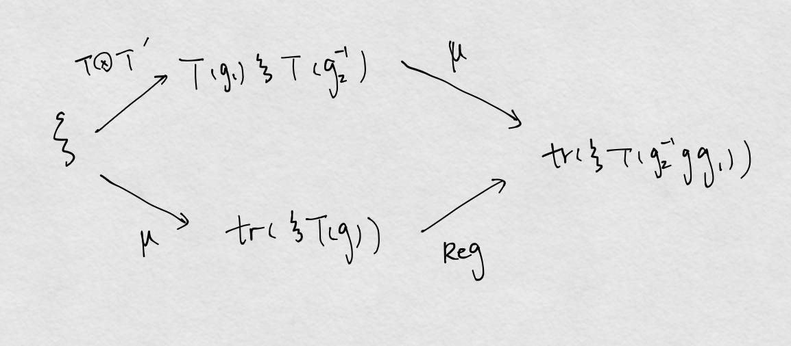

# Basic Facts
	- Theorem. If $V=U\oplus W$, then  $T_{W}$ and $T_{V/U}$ are isomorphic. #card
	  card-last-interval:: 32.57
	  card-repeats:: 1
	  card-ease-factor:: 2.6
	  card-next-schedule:: 2023-08-31T11:34:37.911Z
	  card-last-reviewed:: 2023-07-29T22:34:37.911Z
	  card-last-score:: 5
		- We can select vectors of W as representatives.
		- Can be used on "The remaining part of the sum"
	- ## Decomposition into Minimal invariant subspaces
		- Theorem. Let $T:G\rightarrow \mathrm{GL} (V)$ be a linear representation. Let $V=V_{1} +V_{2} +\dotsc +V_{m}$ be a decomposition of the space $V$ into a (**not necessarily direct**) sum of minimal invariant subspace. 
		  card-last-interval:: 107.52
		  card-repeats:: 3
		  card-ease-factor:: 2.56
		  card-next-schedule:: 2023-11-14T10:39:04.667Z
		  card-last-reviewed:: 2023-07-29T22:39:04.667Z
		  card-last-score:: 3
		  Then for every invariant subspace $U$ there exist indices $i_{1} ,\dotsc ,i_{p}$ such that $V=U\oplus V_{i_{1}} \oplus \dotsc \oplus V_{i_{p}}$  #card
			- Note
				- Plainly, 'Minimal invariant subspaces' -> Completely reducible.
				- This doesn't need the group to be finite.
			- Classical trick: Maximal linear independent list $\{U,V_{i1},...V_{ip}\}$
				- We show this must span V by intersecting with any "Min invsp outside":
				  collapsed:: true
					- Min ⇒ the intersection must be 0 or full space.
			-
		- Theorem. Suppose the representation $T:G\rightarrow \mathrm{GL} (V)$ is isomorphic to a sum of irreducible representations $T_{i} :G\rightarrow \operatorname{GL}( V_{i}) ,i=1,\dotsc ,m$. 
		  collapsed:: true
		  card-last-interval:: 24
		  card-repeats:: 2
		  card-ease-factor:: 2.7
		  card-next-schedule:: 2023-04-08T00:35:31.397Z
		  card-last-reviewed:: 2023-03-15T00:35:31.397Z
		  card-last-score:: 5
		  Then every subrepresentation of $T$ ,as well as every quotient representation of $T$ is isomorphic to a sum of some of the representations $T_{i}$ #card
			- ((64c66f21-d71f-4cf2-a4d8-44d974454f65))
			- Consider a subrep $T_U$: $$T_U\simeq T_{V/({V_{i_{1}} \oplus \dotsc \oplus V_{i_{p}}})}\simeq T_{sum\ of\ the\ remaining\ V_j }$$
			- Isomorphism is the best we can obtain, without more conditions.
				- i.e. Decomposition isn't unique.
			-
			- Corollary. Let $T:G\rightarrow \mathrm{GL} (V)$ be a linear representation. Let $V_{1} ,\dotsc ,V_{m}$ be minimal invariant subspaces such that the representations $T_{i} =T_{V_{i}}$ are **pairwise nonisomorphic**(New condition). Then $V_{1} ,\dotsc ,V_{m}$ are linearly independent.
			  id:: 4b39adbd-96d1-4605-8870-8ce25437e6f7
		- Theorem. Let $T$ be a linear representation. If $$T\simeq T_{1} +\dotsc +T_{m} \simeq S_{1} +\dotsc +S_{p}$$ where $T_{i}$ and $S_{j}$ are irreducible representations, then $m=p$ and, for a suitable labeling, $T_{i} \simeq S_{i}$. #card
		  card-last-interval:: 117.6
		  card-repeats:: 3
		  card-ease-factor:: 2.8
		  card-next-schedule:: 2024-02-15T14:29:23.926Z
		  card-last-reviewed:: 2023-10-21T00:29:23.927Z
		  card-last-score:: 5
		  collapsed:: true
			- By induction.
				- There can be two strategies: 
				  One is to substitute some $S_i$ by $T_m$ (which is guaranteed by the 'maximally linear independent set' trick); 
				  the other is to construct projection operators, which must be zero or isomorphisms.
				-
			- Note that the decomposition of representations is only unique up to isomorphism.
				- For example, we may decompose $\mathbb R^2$ into $x \oplus y$ and $\frac \pi 4 \oplus \frac {3\pi} 4$
	-
	- ## Inner product and reducibility
	  collapsed:: true
		- Proposition. Every orthogonal or unitary representation is completely reducible. #card
		  card-last-interval:: 26.06
		  card-repeats:: 1
		  card-ease-factor:: 2.6
		  card-next-schedule:: 2023-04-11T02:43:45.748Z
		  card-last-reviewed:: 2023-03-16T01:43:45.748Z
		  card-last-score:: 5
			- U inv ⇒ Complement of U inv.
		- Theorem. Every real (complex) linear representation of a finite group is isomorphic to an orthogonal (unitary) representation. #card
		  card-last-interval:: 24
		  card-repeats:: 1
		  card-ease-factor:: 2.6
		  card-next-schedule:: 2023-03-29T00:57:10.930Z
		  card-last-reviewed:: 2023-03-05T00:57:10.931Z
		  card-last-score:: 5
		  collapsed:: true
			- ((64b53e14-4877-4132-8efd-8eda1934a887))
			-
			- Given any inner product $f_0(\cdot,\cdot)$, define $f(u,v)=\sum_{g}f_0(T(g)u,T(g)v)$
				- This is quite natural. We just rephrased 'unitary' into an 'invariant inner product'.
		- Theorem. Every real (complex) linear representation of a compact topological group is orthogonal (respectively, unitary). #card
		  card-last-interval:: 42
		  card-repeats:: 2
		  card-ease-factor:: 2.46
		  card-next-schedule:: 2023-09-23T13:20:48.031Z
		  card-last-reviewed:: 2023-08-12T13:20:48.031Z
		  card-last-score:: 3
			- The point is an invariant integration on the group manifold.
			- From the point of view of the theory of (continuous) linear representations, compact topological groups are similar to discrete ones. #[[System/Math and Physics]]
		- Lemma. Let $f$ and $f_{0}$ be two inner products in the complex vector space $V$. Then there exists a linear operator $\sigma$ such that $f(x,y)=f_{0} (\sigma x,y)$  for all $x,y\in V$.
		- Theorem. Let $T:G\rightarrow \operatorname{GL} (V)$ be an irreducible unitary representation. Then the $T$-invariant inner product in $V$ is unique up to a constant factor.  #card
		  collapsed:: true
		  card-last-interval:: 117.6
		  card-repeats:: 3
		  card-ease-factor:: 2.8
		  card-next-schedule:: 2023-12-17T03:10:25.507Z
		  card-last-reviewed:: 2023-08-21T13:10:25.508Z
		  card-last-score:: 5
			- Lemma. Let $f$ and $f_{0}$ be two inner products in the complex vector space V. Then there exists a linear operator $\sigma$ such that $f(x,y)=f_{0} (\sigma x,y)$  for all x,y\in V.
			- $\sigma$ is a self-intertwining map. (Exercise)
			-
			- This allows some construction of inner products.  #Remark
		-
	-
	- ## Complexification
	  collapsed:: true
		-
		- Two finite-dimensional real representations are isomorphic if and only if their [[Complexification]] are isomorphic. #card
		  card-last-interval:: 24
		  card-repeats:: 1
		  card-ease-factor:: 2.6
		  card-next-schedule:: 2023-03-20T01:48:58.817Z
		  card-last-reviewed:: 2023-02-24T01:48:58.818Z
		  card-last-score:: 5
		  collapsed:: true
			- p⇒q is obvious.
			- q⇒p: The matrix equation is $T_{1C}S=ST_{2C}$, which is linear.
			  We can take complex conjugate of both sides, then $S^*$ is also a solution.
			  Then $(S+S^*)$, which is real, is also a solution.
		-
		- Theorem 6. Let $T:G\rightarrow \operatorname{GL} (V)$ be an [[Irreducible]] real linear representation. Then the [[Complexification]] $T_{\mathbf{C}}$ is ^^either irreducible, or the sum of two irreducible representations^^. 
		  card-last-interval:: 24
		  card-repeats:: 1
		  card-ease-factor:: 2.6
		  card-next-schedule:: 2023-04-07T00:59:10.976Z
		  card-last-reviewed:: 2023-03-14T00:59:10.976Z
		  card-last-score:: 5
		  collapsed:: true
		  In the second case $V_{\mathbf{C}}$ decomposes into the direct sum of two complex-conjugate minimal invariant subspaces. #card
			- Obviously, for any $W\sub V$, $V=W+\overline{W}$
			- $u+iv \in W$ ⇒ $u-iv\in \overline{W}$ . Given $u \ and\ iv$ , since T is irreducible, the whole space can be covered.
			-
			- Consider a [[Minimal invariant subspace]] W:
			- $W\cap \overline{W}=0\ or\ W$
	-
	- ## Lift and factoring of representation
	  card-last-interval:: 23.96
	  card-repeats:: 1
	  card-ease-factor:: 2.6
	  card-next-schedule:: 2023-04-04T00:12:43.175Z
	  card-last-reviewed:: 2023-03-11T01:12:43.176Z
	  card-last-score:: 5
		- Def
			- For a rep. of quotient group $G/N$, $S:G/N\rightarrow \operatorname{GL} (V)$  and $p:G\rightarrow G/N$:
			  $$(S\circ p)(h)=e \text{ for all } h\in N$$ is a lift of S.
		-
		- Proposition. every linear representation $T$ of $G$ whose kernel contains $N$ can be **factored** through $p$, i.e., $T=S\circ p$
			- We thus establish a one-to-one correspondence between the **linear representations of the quotient group** and those **linear representations of** $G$ whose kernel contains $N$.
				- Can be used to simplify some problems.
	-
	- ## On tensor products of reps
	  collapsed:: true
		- Theorem. The tensor product of two irreducible complex representations $T:G\rightarrow \operatorname{GL} (V)$ and $S:H\rightarrow \operatorname{GL} (U)$ of the groups $G$ and $H$ 
		  card-last-interval:: 30
		  card-repeats:: 2
		  card-ease-factor:: 2.7
		  card-next-schedule:: 2023-06-05T11:57:25.705Z
		  card-last-reviewed:: 2023-05-06T11:57:25.708Z
		  card-last-score:: 5
		  is an **irreducible** representation of $G\times H$.  #card
			- Lemma. Let $T$ be an complex irreducible representation of the group $G$ in the space $V$, and let $I$ be the trivial representation of $G$ in the space $U$. Then every minimal subspace $W\subset V\otimes U$ invariant under the product representation $TI$ has the form $V\otimes u_{0}$, where $u_{0} \in U$.
			  card-last-score:: 5
			  card-repeats:: 1
			  card-next-schedule:: 2023-04-08T11:55:28.429Z
			  card-last-interval:: 25.01
			  id:: 4746422f-8ebd-4b6e-b09a-a6d71742468b
			  card-ease-factor:: 2.6
			  card-last-reviewed:: 2023-03-14T11:55:28.430Z
				-
				- Construct "coordinate functions" $\sigma_i:W\rightarrow V\otimes f_i$
				-
				- $\sigma_i$ is a Morphism between $TI\big|_W$and  $TI\big|_{V \otimes f_i}$ , while $TI\big|_{V \otimes f_i}$ can be identified with T!
				  collapsed:: true
					- Try to identify some reps, to make use of [[Schur's Lemma]]  #Remark
				- By Schur's: All $\sigma_i$ are proportional, $\sigma_i=c_i\sigma_0$
				- $w=c_1\sigma_0(w)\otimes f_1+...+c_n\sigma_0(w)\otimes f_n=\sigma_0(w)\otimes (c_1f_1+...+c_nf_n)$
			-
			- Consider W inv under $T\otimes S$:
			- W must be inv under $TI$ and $IS$.
			-
			- Split W into min invsp. of $TI4 and $IS$ separately:
			- $W=(V\otimes u_1)\oplus...\oplus(V\otimes u_m)=(v_1\otimes U)\oplus...\oplus(v_n\otimes U)$
			- Obviously $W=V\otimes U$
	-
	-
	- ## About Matrix Elements
		- Def
			- The functions $T_{ij} \in \mathbf{C} [G]$
			- $M(T)$ is the linear span of the matrix elements of $T$ (relative to some basis).
		- Proposition.  $M(T)$ is basis independent and invariant under translations.  #card
		  card-last-interval:: 30
		  card-repeats:: 2
		  card-ease-factor:: 2.7
		  card-next-schedule:: 2023-06-11T00:28:07.457Z
		  card-last-reviewed:: 2023-05-12T00:28:07.458Z
		  card-last-score:: 5
			- Just prove: One set can be expressed by linear combinations of another, and vice versa. #Techniques
			-
			- Basis independent: $T_{ij}$ under any basis can be expressed as linear combinations of another basis.
			- Invariance: Similar.
		-
		- We can express any f in $M(T)$ invariantly:
			- $f=\sum_{i, j} c_{i j} T_{i j} \in \mathbf{C}[G] \quad\left(c_{i j} \in \mathbf{C}\right)$
		- Write in matrix form, $[c_{ji}]=\xi$ :
		  $$\begin{aligned}
		  \mu :\mathrm{L} (V)&\rightarrow \mathbf{C} [G]\\
		  \mu(\xi )(g)&=\operatorname{tr} \xi T(g)\ \ (\xi \in \mathrm{L} (V))
		  \end{aligned}$$
			- Prop. $\mu$ is an **isomorphism** of $T\otimes T^{\prime }$ and the ((1e9f6e33-36ec-4362-9505-3b42540bb3a7)) $\operatorname{Reg}_{M(T)}$ #card
			  collapsed:: true
			  card-last-interval:: 31.26
			  card-repeats:: 1
			  card-ease-factor:: 2.6
			  card-next-schedule:: 2023-10-25T06:44:28.137Z
			  card-last-reviewed:: 2023-09-24T00:44:28.138Z
			  card-last-score:: 5
				- Prop1. $\mu$ is a morphism
					- Use matrix: $f\left( g_{2}^{-1} gg_{1}\right) =\operatorname{tr} \xi T\left( g_{2}^{-1} gg_{1}\right) =\operatorname{tr} \xi T( g_{2})^{-1} T(g)T( g_{1})$ $=\operatorname{tr}\left( T( g_{1}) \xi T( g_{2})^{-1}\right) T(g)=\operatorname{tr} \eta T(q)$
					- $$\eta =T( g_{1}) \xi T( g_{2})^{-1} =\left( T\otimes T^{\prime }\right)( g_{1} ,g_{2}) \xi$$
						- $(T\otimes T')(g_1,g_2)(X)=T(g_1)XT(g_2^{-1})$
					- So $\mu \circ (T\otimes T')=Reg\circ \mu$
				- 
					- Graph is good!
					- Here we identified $L(V)$ and $V\otimes V'$
					- Not enough. We still need to prove it's bijective.
				-
				- Note that $T\otimes T^{\prime }$ is irreducible.
				- Therefore, $Ker\ \mu \subset L(V)$ is either 0 or $L(V)$
				- $Im\ \mu=M(T)$ , therefore $Ker\ \mu=0$
				-
				- The same man in different mirrors by isomorphisms. #[[System/Math and Physics]]
			-
			- Corollary 1. $\operatorname{dim}\mathrm{M} (T)=n^{2}$, where  $n=\operatorname{dim} V$. #card
			  card-last-interval:: 24
			  card-repeats:: 1
			  card-ease-factor:: 2.6
			  card-next-schedule:: 2023-04-01T03:54:17.672Z
			  card-last-reviewed:: 2023-03-08T03:54:17.672Z
			  card-last-score:: 5
			- Corollary 2. The map $\mu$ establishes an isomorphism of $IT^{\prime }$ and $L_{\mathrm{M} (T)}$ as well as→$TI^{\prime }$ and $R_{\mathrm{M} (T)}$.
			- Corollary 3. $L_{\mathrm{M} (T)} \simeq nT^{\prime }$ and  $R_{\mathrm{M} (T)} \simeq nT$. 
			  id:: caeeba62-511c-4014-abcc-0317e98b10e8
				- $IT'\simeq nT^{\prime }$
			- Corollary 4. Let $T_{1}$ and $T_{2}$ be nonisomorphic irreducible complex representations of the group $G$. 
			  id:: 0e1d7f6e-d7fc-4bb8-bc17-e7506829c273
			  card-last-interval:: 117.6
			  card-repeats:: 3
			  card-ease-factor:: 2.8
			  card-next-schedule:: 2023-11-28T02:56:46.741Z
			  card-last-reviewed:: 2023-08-02T12:56:46.741Z
			  card-last-score:: 5
			  Then $\operatorname{Reg}_{\mathrm{M}( T_{1})}$ and $\operatorname{Reg}_{\mathrm{M}( T_{2})}$ are not isomorphic. #card
				- Proof by restricting the action.
				- If $\operatorname{Reg}_{\mathrm{M}( T_{2})}\simeq \operatorname{Reg}_{\mathrm{M}( T_{1})}$ , then $\operatorname{L}_{\mathrm{M}( T_{1})}\simeq \operatorname{L}_{\mathrm{M}( T_{2})}$
				- By [Corollary 3](((caeeba62-511c-4014-abcc-0317e98b10e8))) , which is a contradiction.
				-
				- Corollary.  Let $T_{1}$ and $T_{2}$ be nonisomorphic irreducible complex representations of the group $G$, 
				  then $T_1\otimes T_1'$ isn't isomorphic to $T_2\otimes T_2'$ .
			- Corollary 5. Let $T_{1} ,\dotsc ,T_{q}$ be pairwise nonisomorphic irreducible complex representations of the group $G$. 
			  card-last-interval:: 30
			  card-repeats:: 1
			  card-ease-factor:: 2.6
			  card-next-schedule:: 2023-06-09T00:22:25.093Z
			  card-last-reviewed:: 2023-05-10T00:22:25.093Z
			  card-last-score:: 5
			  Then the subspaces $\mathrm{M}( T_{1}) ,\dotsc ,\mathrm{M}( T_{q})$ of $\mathbf{C} [G]$ are linearly independent.  #card
				- By [Corollary 4](((0e1d7f6e-d7fc-4bb8-bc17-e7506829c273))), $\mathrm{M}( T_{1}) ,\dotsc ,\mathrm{M}( T_{q})$ are invariant and pairwise nonisomorphic.
				-
				- Invoke the common trick: 
				  Select a  __maximal LI list__ ,  and  __intersect with the remainers__ .
				-
				- ((4b39adbd-96d1-4605-8870-8ce25437e6f7))
			- Theorem. $\mathbf{C} [G]=\mathrm{M}( T_{1}) \oplus \dotsc \oplus \mathrm{M}( T_{q})$ #card
			  card-last-interval:: 107.52
			  card-repeats:: 3
			  card-ease-factor:: 2.56
			  card-next-schedule:: 2023-12-10T01:06:40.101Z
			  card-last-reviewed:: 2023-08-24T13:06:40.101Z
			  card-last-score:: 5
				- Key points in this proof
					- A higher view point: Study matrix elements as the function space
					-
				- Linear independence
					- They're pairwise nonisomorphic.
				- Spanning
					- ((63860946-8380-45c7-b564-1c08f9e7cc70))
					- Select a basis $\{f_j\}$ of  $\mathbf{C} [G]$.
					- $f_j(g)=R(g)f_j(e)=\sum_iR_{ij}(g)f_i(e)$, therefore $f_j=\sum_if_i(e)R_{ij}$.
					  View $f_i(e)$ as coefficients: Any $f_j$ can be generated by $\{R_{ij}\}$!
					- Since each irrep is a subrep of R, $\{R_{ij}\}\sub span\{M(T_k)\}$, thus $\{M(T_k)\}$ is spanning.
				- **Q.E.D.**
			- Corollary. $n_{1}^{2} +\dotsc +n_{q}^{2} =|G|$.
			- Corollary. $L\simeq R\simeq \sum n_{k} T_{k}$
			-
			- Theorem.  The characters of the irreducible representations constitute a **basis** for the space of ((c444aad8-769e-4048-b5d7-6a01a193068c)) #card
			  card-last-interval:: 31.26
			  card-repeats:: 1
			  card-ease-factor:: 2.6
			  card-next-schedule:: 2023-05-14T17:40:21.589Z
			  card-last-reviewed:: 2023-04-13T11:40:21.589Z
			  card-last-score:: 5
				- Central ⇔ $Reg(g,g)f=f$
				- Since $M(T_k)$ are inv under Reg: we can find the basis vectors in the $M(T_k)$
				-
				- To prove: in $M(T_k)$, only $\chi_{T_k}$ is central.
				- ${(Reg(g,g)f)(x)=Tr(\xi T(gxg^{-1})) }\overset{Cycle\ perm\ of\ trace }{=}Tr((T(g^{-1})\xi T(g)T(x))$
				- Therefore, $\xi=T(g^{-1})\xi T(g)$
				-
				- By Schur's Lemma, $\xi=\lambda I$
			- Corollary.  Number of irreducible representations = Number of conjugacy classes (Equals number of central functions)
			- Corollary. The traces of irreducible representations are distinct.
		-
		-
	-
-