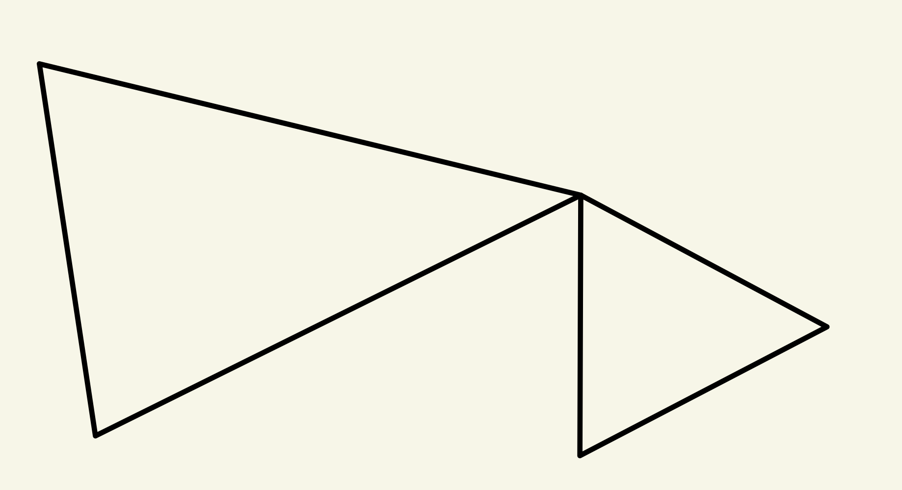

- In contrast to the singular theory, a $q$-simplex will once again be an honest space (and not a continuous map with domain $\Delta^q$ ).
	- A map contains much more information than a simple domain, e.g. orientation, boundary, etc.
- # Definitions
	- ((64b4848d-32de-4083-a028-c5424818237d))
	- Simplicial complex #card
		- A finite collection of simplexes in some **Euclidean space** such that:
		- (i) if $s \in K$, then every face of $s$ also belongs to $K$;
			- We can always talk about boundaries and faces of any simplex.
		- (ii) if $s, t \in K$, then $s \cap t$ is either empty or a common face of $s$ and of $t$.
			- The sub-simplexes are always properly glued together, no 'mismatchings'.
		-
		- #+BEGIN_WARNING
		  Note this definition has an intrinsic weakness of viewing spaces as embedded in $\mathbb R^n$.
		  #+END_WARNING
		-
	- Underlying space $|K|$ of a simplicial complex $K$
	  collapsed:: true
		- If $K$ is a simplicial complex, its underlying space $|K|$ is the subspace (of the ambient euclidean space)
		  $$
		  |K|=\bigcup_{s \in K} s,
		  $$
		  the union of all the simplexes in $K$.
		- Proposition. $|K|$ is compact.
	- ((653a1102-9da2-4249-b0f3-31d698402124)) Polyhedron and Triangulation #card
	  collapsed:: true
		- A topological space $X$ is a **polyhedron** if there exists a simplicial complex $K$ and a homemorphism $h:|K| \rightarrow X$.
		- The ordered pair $(K, h)$ is called a **triangulation** of $X$.
		-
		- In plane English, $X$ is (homeomorphic to) some simplexes glued together.
		-
		- Examples
			- If $K$ is the family of all proper faces of an $n$-simplex $s$, then there is a triangulation $(K, h)$ of $S^{n-1}$. Denote this simplicial complex $K$ by $\dot{s}$. (Note that $|K|$ is the boundary $\dot{s} \approx S^{n-1}$, so that our two dot notations are compatible.)
			- A polyhedron that is not conventionally called so:
			  
				- Obviously it would not be called a manifold.
			- [[Torus]]
				- ((653a12a9-ada3-4cc1-9347-5dd5c2566ac2))
				- Inserting the diagonal $bd$ isn't a valid triangulation since the two triangles share the same vertices.
				  Recall that a simplicial complex is a collection of simplexes, which are solely determined by the vertices, in an Euclidean space.
	- ((653a14d2-9671-4f8f-a5aa-900e9a0b06ac)) The star of a vertex #card
	  collapsed:: true
		- Let $K$ be a simplicial complex and let $p \in \operatorname{Vert}(K)$. The star of $p$, denoted by $\operatorname{st}(p)$, is defined by
		  $$
		  \operatorname{st}(p)=\bigcup_{\substack{s \in K \\ p \in \operatorname{Vert}(s)}} s^{\circ} \subset|K|
		  $$
		- ((653a152e-159e-4b81-bf91-17675bf94100))
		- In plain English, the region spanned by the collection of all points with distance $1$.
	- Dimension of a simplicial complex
		- $$
		  \operatorname{dim} K=\sup _{s \in K}\{\operatorname{dim} s\}
		  $$
- Theorem (Invariance of Dimension). If $K$ and $L$ are simplicial complexes and if there exists a homeomorphism $f:|K| \rightarrow|L|$, then $\operatorname{dim} K=\operatorname{dim} L$. #card
  collapsed:: true
	- A technical exercise. The proof doesn't contain much general insight, but mostly playing with some specific properties.
	-
	- Remark. It follows that one can define the dimension of a polyhedron $X$ as the common dimension of the simplicial complexes involved in triangulations of $X$.
	-
	- Proof. Assume, on the contrary, that $m=\operatorname{dim} K>\operatorname{dim} L=n$ (replacing $f$ by $f^{-1}$ handles the reverse inequality).
	- Take an $m$-simplex $\sigma$ in $K$, and let $\sigma^{\circ}=\sigma-\dot{\sigma}$ be its interior. Now $\sigma^{\circ}$ is an open set in $|K|$, by Exercise 7.4(ii).
	- Since $f$ is a homeomorphism, $f\left(\sigma^{\circ}\right)$ is open in $|L|$. There thus exists some $p$ simplex $\tau$ in $L$ (of course, $p \leq n<m$ ) with $f\left(\sigma^{\circ}\right) \cap \tau^{\circ}=W$, a nonempty open set in $|L|$.
	- Choose a homeomorphism $\varphi: \Delta^m \rightarrow \sigma$ with $\varphi\left(\dot{\Delta}^m\right)=\dot{\sigma}$; then $U$, defined by $U=\varphi^{-1} f^{-1}(W)$, is an open subset of $\left(\Delta^m\right)^{\circ}$.
	- Since $p<m$, there exists an imbedding $g: \Delta^p \rightarrow\left(\Delta^m\right)^{\circ}$ such that im $g$ contains no nonempty open subsets of $\left(\Delta^m\right)^{\circ}$.
	- Both $U$ and $g(W)$ are homeomorphic subsets of $\left(\Delta^m\right)^{\circ}$; as $U$ is open and $g(W)$ is not, which is a contradiction.
- # Simplicial Approximation
	- #+BEGIN_NOTE
	  If we want a category whose objects are simplicial complexes, what are the morphisms?
	  #+END_NOTE
		- Obviously, the morphisms should preserve the simplicial properties.
	- ((653a1b1d-23b1-4b10-b964-05804ab0b2cc)) Simplicial map #card
		- Let $K$ and $L$ be simplicial complexes.
		- A simplicial map $\varphi: K \rightarrow L$ is a function $\varphi: \operatorname{Vert}(K) \rightarrow \operatorname{Vert}(L)$ such that whenever $\left\{p_0, p_1, \ldots, p_q\right\}$ spans a simplex of $K$, then $\left\{\varphi\left(p_0\right), \varphi\left(p_1\right), \ldots, \varphi\left(p_q\right)\right\}$ spans a simplex of $L$.
		- The map do not need to be injective.
	- Theorem. If $\mathscr{K}$ consists of all simplicial complexes and all simplicial maps (with usual composition), then $\mathscr{K}$ is a category, and underlying defines a functor | $\mid: \mathscr{K} \rightarrow$ Top.