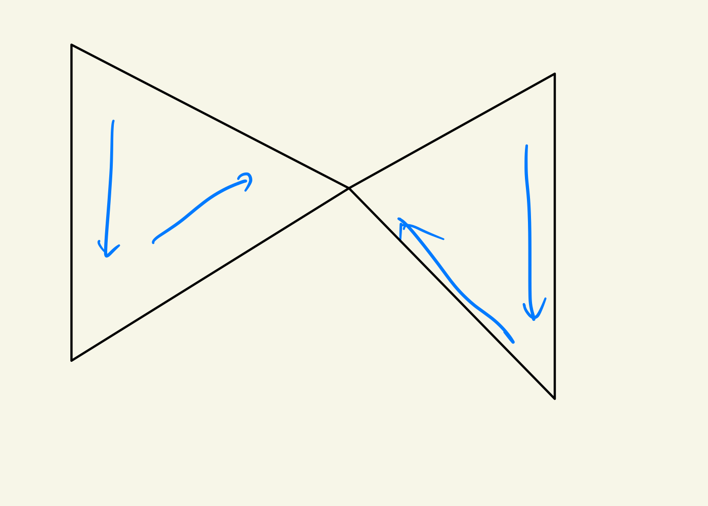
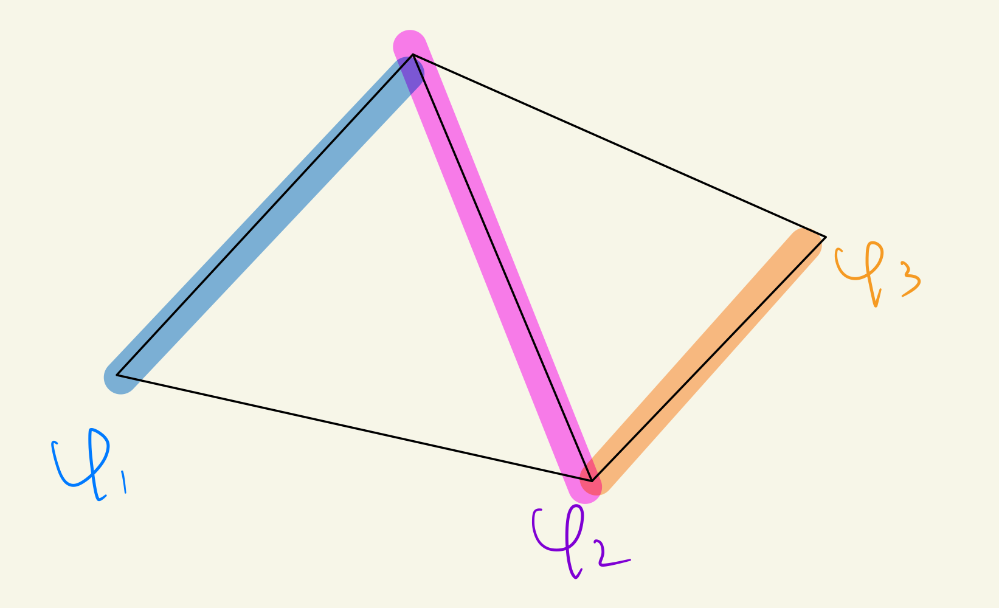

# Definitions #card
card-last-score:: 5
card-repeats:: 1
card-next-schedule:: 2023-12-05T06:54:34.893Z
card-last-interval:: 31.26
card-ease-factor:: 2.6
card-last-reviewed:: 2023-11-04T00:54:34.893Z
	- ((654492a5-485c-46cd-ba7e-744404547c08)) Oriented Simplicial Complex
	  collapsed:: true
		- A simplicial complex $K$ with a partial order, such that the restriction to vertices of any simplex is a linear order.
		- Why not a full order on the whole complex?
		  background-color:: red
			- For simplexes with common faces, their ordering must be compatible, but the orders may not naturally merge.
			- In short, 'partial order' means $a<b>c$ or $a>b<c$.
			- For example,
			  {:height 261, :width 455}
				- The two orderings are compatible, but they do not merge.
	- $C_q(K)$
		- An abelian group with the following presentation:
			- Generators
				- All $(q+1)$-tuples $\left(p_0, \ldots, p_q\right)$ with $p_i \in \operatorname{Vert}(K)$ such that $\left\{p_0, \ldots, p_q\right\}$ spans a simplex in $K$.
			- Relations
				- (i) $\left(p_0, \ldots, p_q\right)=0$ if some vertex is repeated;
				- (ii) $\left(p_0, \ldots, p_q\right)=(\operatorname{sgn} \pi)\left(p_{\pi 0}, p_{\pi 1}, \ldots, p_{\pi q}\right)$, where $\pi$ is a permutation of $\{0,1, \ldots, q\}$.
		- Intuitively, it is the 'free group generated by oriented simplexes'. The second relation is essentially defining equivalence of orientations.
	- Boundary map
	  collapsed:: true
		- $$
		  \partial_q: C_q(K) \rightarrow C_{q-1}(K), \\
		  \partial_q\left(\left\langle p_0, \ldots, p_q\right\rangle\right)=\sum_{i=0}^q(-1)^i\left\langle p_0, \ldots, \hat{p}_i, \ldots, p_q\right\rangle
		  $$
		  (where $\hat{p}_i$ means delete the vertex $p_i$ ) and extending by linearity.
	- Cycle, boundary and homology groups
	  collapsed:: true
		- $Z_q(K)=\operatorname{ker} \partial_q$, $B_q(K)=\operatorname{im} \partial_{q+1}$, $H_q(K)=Z_q(K) / B_q(K)$.
		-
	- Associated map of simplicial map
		- Motivated by functoriality
		- Let $K$ and $L$ be oriented simplicial complexes. If $\varphi: K \rightarrow L$ is a simplicial map, define $\varphi_{\#}: C_q(K) \rightarrow C_q(L)$, for each $q \geq 0$, by
		  $$
		  \varphi_{\#}\left(\left\langle p_0, \ldots, p_a\right\rangle\right)=\left\langle\varphi\left(p_0\right), \ldots, \varphi\left(p_a\right)\right\rangle .
		  $$
	- Relative homology group
	  collapsed:: true
		- If $L$ is a subcomplex of an oriented simplicial complex $K$ (with the inherited ordering), then the $q$ th relative simplicial homology group is
		  $$
		  H_q(K, L)=H_q\left(C_*(K) / C_*(L)\right) .
		  $$
	- [Euler-Poincare Characteristic](((65449fbd-691c-4c46-b321-9ac7fd2bd3c6)))
	  id:: 65449ee4-4fd8-4434-9901-7b28ee9a9cf9
	- ## Reduced Homoloty
	  collapsed:: true
		- Augmented complex
			- If $K$ is an oriented simplicial complex, define $C_{-1}(K)$ to be the infinite cyclic group generated by the symbol $a$, define $\tilde{\partial}_0: C_0(K) \rightarrow C_{-1}(K)$ by $\sum m_p\langle p\rangle \mapsto\left(\sum m_p\right)a$, and define the augmented complex
			  $$
			  \tilde{C}_*(K)=0 \rightarrow C_m(K) \stackrel{\partial_m}{\rightarrow} C_{m-1}(K) \rightarrow \cdots \rightarrow C_1(K) \stackrel{\partial_1}{\rightarrow} C_0(K) \stackrel{\tilde{\partial}_0}{\rightarrow} C_{-1}(K) \rightarrow 0
			  $$
		- Reduced simplicial homology group
			- $$
			  \tilde{H}_q(K)=H_q\left(\widetilde{C}_*(K)\right)
			  $$
- # Setting up the homology and verifying axioms #card
  card-last-interval:: 31.26
  card-repeats:: 1
  card-ease-factor:: 2.36
  card-next-schedule:: 2023-12-15T06:43:26.076Z
  card-last-reviewed:: 2023-11-14T00:43:26.077Z
  card-last-score:: 3
  collapsed:: true
	- Don't forget to check the functoriality!
	-
	- ### Basic Facts
		- Lemma. Let $K$ be an oriented simplicial complex of dimension $m$.
		  (i) $C_q(K)$ is a free abelian group with basis all symbols $\left\langle p_0, \ldots, p_q\right\rangle$, where $\left\{p_0, \ldots, p_q\right\}$ spans a q-simplex in $K$ and $p_0<p_1<\cdots<p_q$. Moreover, $\left\langle p_{\pi 0}, \ldots, p_{\pi q}\right\rangle=(\operatorname{sgn} \pi)\left\langle p_0, \ldots, p_q\right\rangle$.
		  (ii) $C_q(K)=0$ for all $q>m$.
		- Theorem. $C_*(K) := \{C_q(K),\partial_q\}$ is a chain complex.
			- Same argument as before.
		- Lemma. If $\varphi: K \rightarrow L$ is a simplicial map, then $\varphi_{\#}: C_*(K) \rightarrow C_*(L)$ is a chain map; that is, $\varphi_{\#} \partial=\partial \varphi_{\#}$.
	- Theorem. For each $q \geq 0, H_q: \mathscr{K} \rightarrow \mathbf{A b}$ is a functor.
	- The dimensional axiom holds trivially.
	- ((65459d61-e66d-4c7c-8baa-f513b497e4c1)) (Excision). If $K_1$ and $K_2$ are subcomplexes of a simplicial complex $K$ with $K_1 \cup K_2=K$, then the inclusion $\left(K_1, K_1 \cap K_2\right) \hookrightarrow\left(K, K_2\right)$ induces isomorphisms, for all $q \geq 0$,
	  $$
	  H_q\left(K_1, K_1 \cap K_2\right) \stackrel{\sim}{\rightarrow} H_q\left(K, K_2\right) .
	  $$
		- The verification is much simpler than that of singular homology, since $K_1 \cup K_2=K$ means that all simplexes of $K$ are contained in $K_1$ or $K_2$.
		- #+BEGIN_NOTE
		  Historically, the version for simplicial homology appeared first. It is understandable that people can observe the fact! Not pulled out of a hat!
		  #+END_NOTE
	- Theorem. (Mayer-Vietoris) If $K_1$ and $K_2$ are subcomplexes of a simplicial complex $K$ with $K_1 \cup K_2=K$, then there is an exact sequence
	  $$
	  \cdots \rightarrow H_{q+1}(K) \rightarrow H_q\left(K_1 \cap K_2\right) \rightarrow H_q\left(K_1\right) \oplus H_q\left(K_2\right) \rightarrow H_q(K) \rightarrow H_{q-1}\left(K_1 \cap K_2\right) \rightarrow \cdots
	  $$
		- Just invoke ((649955ae-5920-4aa5-8d1d-f5a3171d430c)).
		- The difficulty is in understanding the lemma.
- # Euler-Poincare Characteristic #card
  id:: 65449fbc-6522-4b43-bfcc-1527128a2908
  card-last-interval:: 31.26
  card-repeats:: 1
  card-ease-factor:: 2.6
  card-next-schedule:: 2024-04-19T07:15:28.622Z
  card-last-reviewed:: 2024-03-19T01:15:28.623Z
  card-last-score:: 5
  collapsed:: true
	- How could I invent it were I Poincare?
	- Definition
	  id:: 65449fbd-691c-4c46-b321-9ac7fd2bd3c6
		- Let $K$ be a simplicial complex of dimension $m$. For each $q \geq 0$, let $\alpha_q$ be the number of $q$-simplexes in $K$.
		- The Euler-Poincaré characteristic of $K$, denoted by $\chi(K)$, is defined by
		  $$
		  \chi(K)=\sum_{q=0}^m(-1)^q \alpha_q .
		  $$
	- Theorem. If $K$ is an oriented simplicial complex of dimension $m$, then
	  $$
	  \chi(K)=\sum_{q=0}^m(-1)^q \operatorname{rank} H_q(K)
	  $$
		- We immediately see it is a very weak invariant, but nonetheless useful since it can be directly read off from the triangulation without any further calculation.
		- Observations
			- About rank
				- Rank has two distinct meanings. The first is the min. number of generators, while the second is the number of generators of the free-abelian part.
				- Let me take the second, since it satisfies $\operatorname{rank}(G/H)=\operatorname{rank}G-\operatorname{rank}H$.
				-
		- Key points
			- $$
			  \operatorname{rank} H_q(K)=\operatorname{rank} Z_q(K)-\operatorname{rank} B_q(K)
			  $$
			- $$
			  \alpha_q=\operatorname{rank} C_q(K)=\operatorname{rank} Z_q(K)+\operatorname{rank} B_{q-1}(K)
			  $$
		- Actually this result holds for **any** chain complex with each term free abelian.
- # Promote the functor to Polyhedra
  collapsed:: true
	- Possible problems
		- Prove the invariance under equivalent triangulations.
		- We only have simplicial maps in the category of simplicial complexes, $\mathscr{K}$, while we have continuous maps between polyhedra.
			- Obviously we need simplicial approximations.
		- Then we need to prove the invariance under equivalent simplicial approximations.
	- ### Compare $H_q(K)$ and $H_q(\operatorname{Sd} K)$
		- Proposition. Let $K$ be a (finite) oriented simplicial complex of dimension $m$.
		  (i) $H_q(K)$ is f.g. (finitely generated) for every $q \geq 0$.
		  (ii) $H_q(K)=0$ for all $q>m$.
		  (iii) $H_m(K)$ is free abelian, possibly zero.
			- (i) is trivial.
			- (ii) Since $C_q(K)$=0.
			- (iii) The boundary is zero and the cycle part is necessarily free abelian.
				- More generally, ((65449dd9-071b-49c1-ac36-ba6a250956cc))
- # Equivalence with singular homology #card
	- ((65459f47-ac98-40a4-a2ce-280815a295c1))
	  collapsed:: true
		- If we could prove equivalence with singular homology, then it is trivial that simplicial homology doesn't depend on the triangulation chosen.
	- Takeaway message
		- First show their equivalence on some simple objects (simplexes and faces)
		- The change of homology groups during gluing simplexes could be tracked by Mayer-Vietoris, which holds for both simplicial and singular homology.
	- Preparations
		- ((65460340-5044-49c4-9074-f56ef78fa13c)). Let $K$ be the simplicial complex consisting of all the faces of an $n$-simplex whose vertex set is linearly ordered (so that $|K| \approx \Delta^n$ ). Then
		  collapsed:: true
		  $$
		  \tilde{H}_q(K)=0 \quad \text { for all } q \geq 0
		  $$
			- An very interesting technical exercise.
			-
			- The key is to find the **contracting homotopy**, i.e. $\left\{h_q: C_q(K) \rightarrow C_{q+1}(K), \text { all } q \geq-1\right\}$ such that
			  collapsed:: true
			  $$\partial_{q+1} h_q+h_{q-1} \partial_q=1_q$$
				- Why is it important?
				  collapsed:: true
					- It is the necessary and sufficient condition that $H_n=0$.
					- ((654603c4-b600-4a67-9708-3275bdf5a61c))
			- We can select an arbitrary vertex and use the cone construction.
			  collapsed:: true
				- I ignored this method because this could make some simplexes degenerate. But actually this doesn't matter! I need to think one step further...
				  background-color:: red
			-
		- Corollary. Let $K$ consist of all the faces of an oriented $n$-simplex (so that $\operatorname{Vert}(K)$ is linearly ordered), and let $L$ be the subcomplex of all the proper faces (so that $|L| \approx S^{n-1}$ ). Then
		  collapsed:: true
		  $$
		  \widetilde{H}_q(L)= \begin{cases}0 & \text { if } q \neq n-1 \\ \mathbf{Z} & \text { if } q=n-1\end{cases}
		  $$
			- Another interesting technical exercise.
			-
			- Method 1. Induction and Excision
			- Method 2. Commutative diagram
			  collapsed:: true
				- ((654604a2-4b95-4eb1-8cb3-663504697e1d))
				- This used the previous corollary and exploited the **relation** to this one.
		-
		- Difficulty: Excision in singular homology requires $X = X_1^\circ \cup X_2^\circ$, while this doesn't hold in general for a simplicial complex and two subcomplexes. Thus we should make some minor modifications.
		- Lemma. Let $K$ be a finite simplicial complex, and let $s$ be a simplex of highest dimension; define $K_1=K-\{s\}$ and $K_2=\{s$ and all its proper faces $\}$. Then there is an exact Mayer-Vietoris sequence in singular homology
		  collapsed:: true
		  $$
		  \cdots \rightarrow H_q\left(\left|K_1\right| \cap\left|K_2\right|\right) \rightarrow H_q\left(\left|K_1\right|\right) \oplus H_q\left(\left|K_2\right|\right) \rightarrow H_q(|K|) \rightarrow H_{q-1}\left(\left|K_1\right| \cap\left|K_2\right|\right) \rightarrow \cdots
		  $$
			- The key construction is $V=|s|-\{x\}$, which is open, thus allowing excision; $|K_1| \cap |K_2|$ is a deformation retract of $V$.
			  collapsed:: true
				- It is the common 'punctured ball ~ sphere' construction.
			- What's the idea behind the construction?
			  background-color:: yellow
			  collapsed:: true
				- Restore the degenerate case to a normal case up to a weak equivalence.
				- Minimize the use of messy geometric arguments. Use topological arguments and equivalence relations instead.
			- Let $X_1=\left|K_1\right| \cup V, X_2 = |K_2|$. Excision works now.
			- ((6548a788-ff4d-4f67-adaa-429548fba19f))
			  collapsed:: true
				- The five lemma shows that the inclusion is an isomorphism
				  $$
				  H_q\left(\left|K_2\right|,\left|K_1\right| \cap\left|K_2\right|\right) \cong H_q\left(\left|K_2\right|, V\right)
				  $$
				-
			-
		- Lemma 7.21 ((6548aa4d-72eb-4513-9e36-7ddbc22ddc08)) where the horizontal maps are connecting homomorphisms and the horizontal maps are the embeddings in the previous lemma.
		  collapsed:: true
			- Definition. 
			  $$
			  j^K: \tilde{C}_*(K) \rightarrow \tilde{S}_*(|K|)
			  $$
			- Property. For every simplicial map $\varphi: K \to K'$, we have the naturality condition
			  ((6548aa88-490f-4af0-90d4-fad2d8cfdd8e))
			- Lots of routine verifications...
			- The problem is, how did mathematicians come up with such properties requiring lengthy verifications?
			  background-color:: red
	- **Main Theorem**. For every oriented finite simplicial complex $K$, the chain map $j: \widetilde{C}_*(K) \rightarrow \widetilde{S}_*(|K|)$ (of Lemma 7.21) induces isomorphisms for all $q \geq 0$,
	  $$
	  \widetilde{H}_q(K) \cong \tilde{H}_q(|K|)
	  $$
		- These all seem rather natural -- I've improved!
		  background-color:: yellow
			- But the underlying thought is still fascinating. The five lemma is an essential step, which seems completely algebraic rather than geometric. Why?
			- ((654991d3-5f8c-4985-9ade-ed226450dfe7))...
				- First attempts to prove the independence of triangulation were aimed at the polyhedron itself.
				- For many years, people tried to prove the **Hauptvermutung** (principle conjecture): 
				  if $(K, h)$ and $(L, g)$ are triangulations of a polyhedron $X$, then there are subdivisions (not necessarily barycentric) $K^{\prime}$ of $K$ and $L^{\prime}$ of $L$ with $K^{\prime} \cong L^{\prime}$. Were this true, there would be an easy proof of the topological invariance of $H_*(K)$.
				- The Hauptvermutung was proved for $n=3$ by Moise (in the 1950s), but in 1961 Milnor constructed **counterexamples** to it for every $n \geq 6$.
				- So the theorem had to be cracked 'from outside'.
		- We proceed by gradually gluing simplexes to the existing complex.
		- To prove that the homology groups remains isomorphic after gluing a new simplex, we use the five lemma.
			- ((654990cc-f96d-4962-949a-564aaefb1dca))
			- Note that $K_2$ is a simplex, thus $\tilde H_q(K)=\tilde H_q(|K|)=0$.
		- The key step is to prove $j_*:H_{q-1}\left(K_1 \cap K_2 \right) \to H_{q-1}\left(\left|K_1\right| \cap\left|K_2\right|\right)$ is an isomorphism.
			- My original viewpoint was problematic.
			  background-color:: red
				- I wish to each time glue a simplex plus all its proper faces.
				- But then $|K_1| \cup |K_2|$ might not be all proper faces of the simplex glued, thus excision might not hold.
			- The correct way is to induct on the number of simplexes and each time only glue a 'bulk' of a highest-dimensional simplex, thus excision still works.
				- In other words, we start from an 0D simplicial complex and gradually add dimension by gluing more and more 'bulk'.
	- Corollary. The simplicial homology groups of a polyhedron doesn't depend on the choice of the triangulation.
		-
- # Calculations
  collapsed:: true
	- ## Existence of an Algorithm
		- Facts about f.g. abelian groups
		  collapsed:: true
			- ((654de393-55f2-4ab9-bc4f-21aa39b58a59))
			- ((654de5ae-2d0a-4eb3-933a-8770ccd3baf2)). Normal form
				- A normal form is an $m \times n$ matrix $N$ over $\mathbf{Z}$ such that
				  $$
				  N=\left[\begin{array}{ll}
				  \Delta & 0 \\
				  0 & 0
				  \end{array}\right],
				  $$
				  where $\Delta$ is a diagonal matrix, say, $\Delta=\operatorname{diag}\left\{b_1, b_2, \ldots, b_k\right\}$, with $b_1\left|b_2\right| \cdots \mid b_k$.
				- Since f.g. abelian groups are completely determined by generators, any homomorphism is completely determined by the matrix.
			- Theorem (Smith Normal Form). Every rectangular matrix $D$ over $\mathbf{Z}$ can be transformed, using elementary row and column operations, into a normal form; moreover, this normal form is independent of the elementary operations and is thus uniquely determined by $D$.
				- The usual proof is itself an algorithm.
		- Theorem. For any oriented simplicial complex $K$, there is an algorithm to compute $H_q(K)$ for all $q \geq 0$.
		  collapsed:: true
			- In short, since $C_q(K)$ are finitely generated, we could express $\partial_q$ by matrices with coefficients over $\mathbb Z$, which can be made into the normal form.
				- $Z_q(K)$ corresponds to the zero blocks.
				- It's easy to see that the nonzero diagonal elements are torsion coefficients (if some are 1 then they vanish in $Z_q/B_q$)
			- However, this method isn't practical. It used to show the existence of an algorithm, thus the problem must be computable.
			  background-color:: red
	- ## Simplifications
		- Idea: Reduce the number of generators (simplexes)
		- ((654debb0-2d03-454f-9c40-ef5f16ca0906)) A subcomplex $E_*^{\prime}$ of a chain complex $E_*$ is **adequate** if, for all $q \geq 0$ :
		  (i) if $z \in Z_q$, then there exists $z^{\prime} \in Z_q^{\prime}$ with $z-z^{\prime} \in B_q$;
		  (ii) if $z^{\prime} \in Z_q^{\prime}$ and $z^{\prime}=\partial c$ for some $c \in E_{q+1}$, then there exists $c^{\prime} \in E_{q+1}^{\prime}$ with $z^{\prime}=\partial c^{\prime}$.
		- Lemma. If $E'_*$ is an adequate subcomplex of $E_*$, then $H_n(E'_*) \simeq H_n(E_*)$
			- Just verify $i_*$ is an isomorphism.
		- The following of the section are techniques to remove simplexes and find adequate subcomplex.
- # Fundamental groups of Polyhedra
  collapsed:: true
	- Essentially, the fundamental group could be calculated via 'edge paths'.
		- Homotopy is defined by elementary moves.
	-
	- ((654dec9d-f70b-4f37-9ffd-c1ad81fa1dea)). Edge
		- An edge$e=(p, q)$ in a simplicial complex $K$ is an ordered pair of (not necessarily distinct) vertices lying in a simplex of $K$
		- $p$ is called the origin of $e$ and $q$ is called the end of $e$.
	- Definition. Edge path
		- An edge path $\alpha$ (of length $n$ ) in $K$ is a finite sequence of edges,
		  $$
		  \alpha=e_1 e_2 \cdots e_n
		  $$
		- We call origin $e_1$ the origin of $\alpha$, denoting it by $o(\alpha)$, and we call end $e_n$ the end of $\alpha$, denoting it by $\mathrm{e}(\alpha)$.
	- Theorem 7.36. If $K$ is a connected simplicial complex with basepoint $p$, then $\pi(K, p) \cong \pi_1(|K|, p)$
- # Misc
  collapsed:: true
	- ((654992c6-5f01-452c-a508-0f6c1da8cac0)) Substitution for homotopy: Contiguity
	  collapsed:: true
		- Let $\varphi, \psi: K \rightarrow L$ be simplicial maps.
		- $\varphi$ is contiguous to $\psi$, denoted by $\varphi \sim \psi$, if, for each simplex $s=\left\{p_0, \ldots, p_q\right\}$ of $K$, there exists a simplex $s^{\prime}$ of $L$, with both $\left\{\varphi p_0, \ldots, \varphi p_q\right\}$ and $\left\{\psi p_0, \ldots, \psi p_q\right\}$ faces of $s^{\prime}$.
		- Intuitively, $\varphi$ differs from $\psi$ 'not so much' in the sense that images of simplexes are always within a same simplex.
		-
		- Proposition. If $\varphi, \psi: K \rightarrow L$ are contiguous, then $|\varphi| \simeq|\psi|$.
			- Just construct a homotopy $F: |K| \times I \to |L|$ by
			  $$F(x,t)=t \varphi(x) + (1-t)\psi(x)$$
			- The map is always valid, since $\{\varphi p_0, ..., \varphi p_q, \psi p_0, ..., \psi p_q\}$ belong to the same simplex, any linear combination of them are within the simplex.
		- Proposition. The relation isn't transitive.
			- Consider $K={x_1,x_2}$, $L$ as shown in the figure.
			- {:height 283, :width 410}
		-
	- Definition. Wedge of two pointed spaces
	  collapsed:: true
		- Let $\left(X, x_0\right)$ and $\left(Y, y_0\right)$ be pointed spaces. Their wedge $X \vee Y$ is the quotient space of their disjoint union, $X \coprod Y$ in which the basepoints are identified.
		- ((6549fbd7-9558-4665-86c7-668ff9a820dc))
	- Definition. A **cover** of a simplicial complex $K$ is a family of subcomplexes $\mathscr{L}=\left\{L_\alpha: \alpha \in A\right\}$ with $K=\bigcup L_\alpha$.
	  collapsed:: true
		- Note that the cover could be infinite.
	- Definition. The nerve of a cover
	  collapsed:: true
		- Let $\mathscr{L}=\left\{L_\alpha: \alpha \in A\right\}$ be a cover of a simplicial complex $K$.
		- The **nerve** of $\mathscr{L}$, denoted by $N(\mathscr{L})$, is the simplicial complex having vertices $\operatorname{Vert}(N(\mathscr{L}))=A$ and with $\left\{\alpha_0, \ldots, \alpha_q\right\}$ a simplex if $\bigcap L_{\alpha_i} \neq \varnothing$.
		- See [the example](((65446ba5-7599-490c-926c-da790cf3475f))).
	- Theorem (Leray). Assume that $\mathscr{L}=\left\{L_\alpha: \alpha \in A\right\}$ is a cover of a simplicial complex $K$ such that each $L_\alpha$ and every finite intersection $L_{\alpha_1} \cap L_{\alpha_2} \cap \cdots \cap L_{\alpha_q}$ is acyclic. Then
	  collapsed:: true
	  $$
	  H_q(K) \cong H_q(N(\mathscr{L}))
	  $$
	  for all $q \geq 0$.
		- The proof needs induction on $|A|$, which is extremely suspicious; what if $A$ is uncountable?
		  background-color:: red
		-