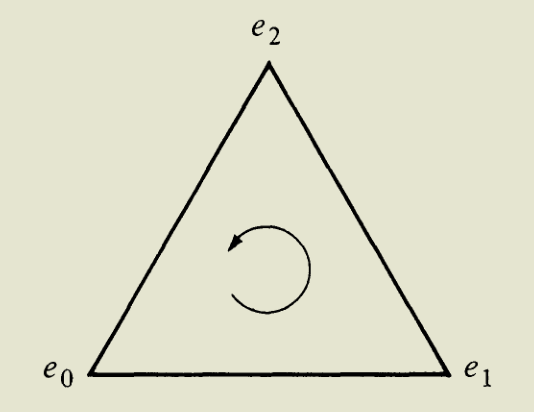
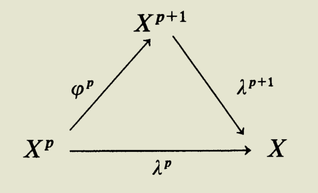

- Idea #card
  card-last-interval:: 32.57
  card-repeats:: 1
  card-ease-factor:: 2.6
  card-next-schedule:: 2023-07-27T14:02:55.685Z
  card-last-reviewed:: 2023-06-25T01:02:55.685Z
  card-last-score:: 5
	- [[Green's Theorem]] tells us that we can determine the behavior of the bulk by its boundary.
	  We'd like to generalize this into topology.
	- Furthermore, a 'hole' in a space is implied by the existence of some **cycle** which is not a **boundary**.
		- The intuition comes from $S^1$ in $\mathbb R^2-0$.
		- However, note that a single point is a cycle but not a boundary.
- # Defs
  collapsed:: true
	- ## About Orientations
	  collapsed:: true
		- Def. Orientation #card
		  id:: 642578ff-9703-449c-b3df-41ffc344e641
		  collapsed:: true
			- An orientation of $\Delta^n=\left[e_0, e_1, \ldots, e_n\right]$ is a linear ordering of its **vertices**.
			  collapsed:: true
				- For a line segment, it is an ordering of the two endpoints.
			- Two orientations of $\Delta^n$ are the same if, as permutations of $\left\{e_0, e_1, \ldots, e_n\right\}$, they have the same **parity** (i.e., both are even or both are odd); otherwise the orientations are opposite.
			  collapsed:: true
				- Note that simplex can only have two different orientations.
			- It's amazing that such a simple definition grasps our intuition of orientation (or 'inside' and 'outside')!
			  collapsed:: true
				- Moreover, similar ideas appear in the definition of differential forms.
		- Induced orientation
		  id:: 6438bf08-5df7-4653-a22c-f97564f2812d
		  collapsed:: true
			- Given an orientation of $\Delta^n$, there is an induced orientation of its faces defined by orienting the $i$ th face in the sense $(-1)^i\left[e_0, \ldots, \hat{e}_i, \ldots, e_n\right]$
		- Example. Verify the induced orientation of $\Delta^2$, $[e_0,e_1,e_2]$, is compatible with the original one.
		  collapsed:: true
		  {:height 336, :width 409}
			- The boundary of $\Delta^2$ is
			  $$
			  \left[e_1, e_2\right] \cup\left[e_0, e_2\right] \cup\left[e_0, e_1\right]=\left[\hat{e}_0, e_1, e_2\right] \cup\left[e_0, \hat{e}_1, e_2\right] \cup\left[e_0, e_1, \hat{e}_2\right] .
			  $$
			  The oriented boundary of $\Delta^2$ is
			  $$
			  \left[\hat{e}_0, e_1, e_2\right] \cup-\left[e_0, \hat{e}_1, e_2\right] \cup\left[e_0, e_1, \hat{e}_2\right]=\left[e_1, e_2\right] \cup\left[e_2, e_0\right] \cup\left[e_0, e_1\right] .
			  $$
			- More generally, the boundary of $\Delta^n=\left[e_0, \ldots, e_n\right]$ is $\bigcup_{i=0}^n\left[e_0, \ldots, \hat{e}_i, \ldots, e_n\right]$ and the oriented boundary of $\Delta^n$ is $\bigcup_{i=0}^n(-1)^i\left[e_0, \ldots, \hat{e}_i, \ldots, e_n\right]$.
			-
			-
	- (Singular) $n$-chain #card
	  card-last-interval:: 30
	  card-repeats:: 1
	  card-ease-factor:: 2.6
	  card-next-schedule:: 2023-06-09T00:22:44.916Z
	  card-last-reviewed:: 2023-05-10T00:22:44.916Z
	  card-last-score:: 5
		- Let $X$ be a topological space. For each $n \geq 0$, define $S_n(X)$ as the **free abelian group** with basis all ((64462ceb-3ede-4222-851b-57c2b29616b0)) in $X$; define $S_{-1}(X)=0$.
		  id:: 64462e13-2a8c-4f01-b999-632c7b8b0110
		  collapsed:: true
			- Often it seems that free (abelian) groups are structureless since they're free. How things are different here?
			  background-color:: pink
			- all singular $n$-simplexes in
		- The elements of $S_n(X)$ are called (singular) $n$-chains in $X$.
	- Boundary of a simplex #card
		- If $\sigma: \Delta^n \rightarrow X$ is continuous and $n>0$, then its boundary is
		  $$
		  \partial_n \sigma=\sum_{i=0}^n(-1)^i \sigma \varepsilon_i^n \in S_{n-1}(X)
		  $$
		  if $n=0$, define $\partial_0 \sigma=0$.
			- $\varepsilon_i^n$ is the $i$**th face map**.
			- $(-1)^i$ keeps the ((6438bf08-5df7-4653-a22c-f97564f2812d))
		- The intuition is that the oriented boundary of a singular $n$-simplex $\sigma: \Delta^n \rightarrow X$ ought to be $\sum_{i=0}^n(-1)^i\left(\sigma \mid\left[e_0, \ldots, \hat{e}_i, \ldots, e_n\right]\right)$.
		  collapsed:: true
			- It's easy to verify the intuition for a triangle: The 'boundary' is the faces with one lower dimension, together with orientations (arrows for 1-simplexes).
			  _1682322105461_0.png){:height 204, :width 570}
		- Notes
		  collapsed:: true
			- $\partial_n \sigma$ is a **map** from $\Delta^{n-1}$ to $X$. Note that simplexes (as paths) are defined by maps.
			- A technical point arises: we prefer that this be a singular $(n-1)$-chain. However, the domain of $\sigma \mid\left[e_0, \ldots, \hat{e}_i, \ldots, e_n\right]$ is **not** the standard $(n-1)$-simplex $\Delta^{n-1}$.
			- The point is remedied by the $i$th face map $\varepsilon_i^n$ which takes the vertices $\left\{e_0, \ldots, e_{n-1}\right\}$ to the vertices $\left\{e_0, \ldots, \hat{e}_i, \ldots, e_n\right\}$, preserving the displayed orderings:
			  collapsed:: true
			  $$
			  \begin{aligned}
			  & \varepsilon_i^n:\left(t_0, \ldots, t_{n-1}\right) \mapsto\left(t_0, \ldots, t_{i-1}, 0, t_i, \ldots, t_{n-1}\right)
			  \end{aligned}
			  $$
				- Intuitively, embed the standard $n-1$ simplex into the $n$ simplex.
	- Boundary operator $\partial_n$ #card
	  card-last-interval:: 31.26
	  card-repeats:: 1
	  card-ease-factor:: 2.6
	  card-next-schedule:: 2023-07-18T07:23:13.154Z
	  card-last-reviewed:: 2023-06-17T01:23:13.154Z
	  card-last-score:: 5
		- The unique homomorphism $\partial_n: S_n(X) \rightarrow S_{n-1}(X)$ determined by
		  collapsed:: true
		  $$\partial_n \sigma=\sum_{i=0}^n(-1)^i \sigma \varepsilon_i$$
			- The behavior on a basis is enough to determine the hom.
			- 'Freedom is the left adjoint of forgetfulness'.
		- Example. $\partial_1: S_1(X) \to S_0(X)$
		  collapsed:: true
			- $S_1(X)$ is the free abelian group with basis all paths $\sigma: I \rightarrow X$
			- $S_0(X)$ is the free abelian group with basis $X$.
			- (i) $\partial_1: S_1(X) \rightarrow S_0(X)$ satisfies $\partial_1 \sigma=\sigma(1)-$ $\sigma(0)$ for every path $\sigma$ in $X$.
			- (ii) If $x_1, x_0 \in X$, show that $x_1-x_0 \in \operatorname{im} \partial_1$ if and only if $x_0, x_1$ lie in the same path component of $X$.
			  Fits our intuition of 'boundary'!
			- (iii) If $\sigma$ is a path in $X$, then $\sigma \in \operatorname{ker} \partial_1$ if and only if $\sigma$ is a closed path. Exhibit a nonzero element of $\operatorname{ker} \partial_1$ that is not a closed path.
			  Fits our intuition of 'closed' (boundaryless)!
	- Singular complex $S_*(X)$
	  id:: 6454f1b7-f979-485a-aafb-fa39fd34e0af
	  collapsed:: true
		- A **sequence** of free abelian groups and homomorphisms
		  $$
		  \cdots \longrightarrow S_n(X) \stackrel{\partial_n}{\longrightarrow} S_{n-1}(X) \longrightarrow \cdots \longrightarrow S_1(X) \stackrel{\partial_1}{\longrightarrow} S_0(X) \stackrel{\partial_0}{\longrightarrow} 0
		  $$
	- (Singular) $n$-cycles and $n$-boundaries #card
	  collapsed:: true
		- The group of (singular) $n$-cycles in $X$, denoted by $Z_n(X)$, is $\text{Ker }\partial_n$.
		  collapsed:: true
			- 'Cycle' seems to mean 'boundaryless'.
			- '$Z$' is from the German **Zykel**.
		- The group of (singular) $n$-boundaries in $X$, denoted by $B_n(X)$, is $\text{Im }\partial_{n+1}$.
		  collapsed:: true
			- This is rather obvious: Boundary of something of higher dimension.
			- '$B$' is surely from **Boundary**.
	- Homology group #card
	  collapsed:: true
	  card-last-interval:: 31.21
	  card-repeats:: 1
	  card-ease-factor:: 2.6
	  card-next-schedule:: 2023-07-20T06:07:37.780Z
	  card-last-reviewed:: 2023-06-19T01:07:37.781Z
	  card-last-score:: 5
		- For each $n \geq 0$, the $n$th (singular) homology group of a space $X$ is
		  $$
		  H_n(X)={Z_n(X)}/{B_n(X)} \equiv {\operatorname{Ker} \partial_n}/{\operatorname{Im} \partial_{n+1}} .
		  $$
			- The spirit of Green's theorem: Holes <-> Cycles that are not boundaries.
			- Note that the group is **abelian** so everything is normal.
			- Proposition. $B_n(X) \in Z_n(X) \in S_n(X)$.
			  collapsed:: true
				- A simple exercise to recall the definitions and $\partial_n \partial_{n+1}=0$.
		- Strikingly simple in form, but daunting in its depth and implications!
		  background-color:: yellow
			- To study a space $X$, we invent strange things called 'simplexes' which is defined by a continuous map from $\Delta^n$ to $X$.
				- It's strange at first sight that we define structures by maps rather than 'things in $X$', but this somehow echoes the spirit of category theory.
			- Then we manage to shape our intuition into the boundary operator.
			- The most bizarre things is introducing a structure of **free** abelian groups generated by simplexes.
			  At first sight freely generated groups seem structureless, but the kernels and images of $\partial$ is not.
				- Actually it is the complex which is rich in structure!
	- Betti number #card
		- The $n$-th Betti number of $X$ is $\operatorname{rank}H_n(X)$.
	- Acyclic #card
	  collapsed:: true
		- A space $X$ is called acyclic if $H_n(X)=0$ for all $n \geq 1$.
		- The dimension axiom shows that every 1-point space is acyclic.
	- Support #card
	  collapsed:: true
		- If $\zeta=\sum m_i \sigma_i \in S_n(X)$, with all $m_i \neq 0$ and all $\sigma_i$ distinct, then the support of $\zeta$, denoted by $\mathrm{supp} \ \zeta$, is $\bigcup \sigma_i\left(\Delta^n\right)$.
		- Note that $\mathrm{supp} \ \zeta$ is compact since it is a finite union of compact subsets.
	- The cone construction #card
	  id:: 6461ca0c-d0bf-40d1-bc3f-5ce24fd244b9
	  card-last-interval:: 30
	  card-repeats:: 1
	  card-ease-factor:: 2.6
	  card-next-schedule:: 2023-06-15T00:29:37.625Z
	  card-last-reviewed:: 2023-05-16T00:29:37.625Z
	  card-last-score:: 5
	  collapsed:: true
		- The 'cone map' $c_n:S_n (X) \to S_{n+1} (X)$ for a convex subset of $\mathbb R^n$ by its action on the generators:
		  $$
		  (c_n( \sigma))\left(t_0, t_1, \ldots, t_{n+1}\right)= \begin{cases}b & \text { if } t_0=1 \\ t_0 b+\left(1-t_0\right) \sigma\left(\frac{t_1}{1-t_0}, \ldots, \frac{t_{n+1}}{1-t_0}\right) & \text { if } t_0 \neq 1\end{cases}
		  $$
			- Intuitively, construct a cone using $b$ as the 'top' and $\sigma$ as the 'bottom'.
			- Note that the 'scaling construction' requires a structure of $\mathbb R$ ... or something similar?
		- Proposition. $\partial_{n+1} c_n(\sigma)=\sigma-c_{n-1} \partial_n(\sigma)$
			- Verify by the definition of the boundary operator. A small exercise!
			- Geometric intuition:
			  ((6461a7c8-3e70-4218-8989-a2b1fa67accf))
			  the 'side faces' of the cone is produced by cones over the boundary.
- # Basic Facts
	- ((644638a3-9be7-46f8-8abb-f6c3ae2849af)) For all $n \geq 0$, we have $\partial_n \partial_{n+1}=0$. #card
	  collapsed:: true
	  card-last-interval:: 31.26
	  card-repeats:: 1
	  card-ease-factor:: 2.6
	  card-next-schedule:: 2023-07-28T06:42:49.588Z
	  card-last-reviewed:: 2023-06-27T00:42:49.589Z
	  card-last-score:: 5
		- First we explicitly write down 
		  $$\partial_n \partial_{n+1} \sigma=\sum_{j, k}(-1)^{j+k} \sigma \varepsilon_j^{n+1} \varepsilon_k^n$$
		- Lemma 4.5. If $k<j$, the face maps satisfy
		  collapsed:: true
		  $$
		  \varepsilon_j^{n+1} \varepsilon_k^n=\varepsilon_k^{n+1} \varepsilon_{j-1}^n: \Delta^{n-1} \rightarrow \Delta^{n+1} .
		  $$
			- Just write down the coordinates explicitly.
		- Therefore we can pair up the sums and cancel:
		  $$\begin{aligned}
		  \partial _{n} \partial _{n+1} \sigma  & =\sum _{j,k} (-1)^{j+k} \sigma \varepsilon _{j}^{n+1} \varepsilon _{k}^{n}\\
		   & =\sum _{k< j} \sigma \left[ (-1)^{j+k} \varepsilon _{j}^{n+1} \varepsilon _{k}^{n} +( -1)^{j+k-1} \varepsilon _{k}^{n+1} \varepsilon _{j-1}^{n}\right]\\
		  &= 0
		  \end{aligned}$$
		- How was this theorem first invented? It's simple to verify, but hard to observe...
		  background-color:: red
		  collapsed:: true
			- It reminds of the Poincare lemma.
			- Also similar to the geometrical intuition that 'a boundary is boundaryless'.
	- ((644a25af-79a6-4b3c-9ac7-e319e6a3b251)) For each $n \geq 0, H_n: \mathbf{Top}\rightarrow \mathbf{A b}$ is a functor. #card
	  card-last-interval:: 42
	  card-repeats:: 2
	  card-ease-factor:: 2.7
	  card-next-schedule:: 2023-07-31T01:03:36.447Z
	  card-last-reviewed:: 2023-06-19T01:03:36.447Z
	  card-last-score:: 5
	  collapsed:: true
		- '当你学了范畴后，看什么都是范畴'。
		- We should determine two things:
		  1. For $f \in \mathrm{Hom}_{\mathbf{Top}}(X,Y)$, how to define $H_n(f)$?
		  2. Does $H_n(f \circ g) = H_n(f) \circ H_n(g)$?
		- First question:
		  collapsed:: true
			- Obviously $f$ induces a homomorphism $f_\#: S_n(X) \to S_n(Y)$ by 
			  collapsed:: true
			  $$
			  f_{\#}\left(\sum m_\sigma \sigma\right)=\sum m_\sigma(f \circ \sigma)
			  $$
				- Note that $f \circ \sigma$ is also a simplex.
			- Key observation:
			  $$\partial_n f_{\#}=f_{\#} \partial_n$$
			  thus $f_{\#}$ both preserves cycles and chains.
			- The desired $H_n(f)$ is defined by $H_n(f): g+B_n(X) \mapsto f_{\#}(g)+B_n(Y)$.
			  Since $f_{\#}$ preserves cycles and chains, the codomain is correct and the map is independent of the representative.
		- Second question:
		  collapsed:: true
			- Equivalently, does $f_{\#} \circ g_{\#}=(f \circ g)_{\#}$?
			- Obviously, yes.
	- Corollary. If $X$ and $Y$ are homeomorphic, then $H_n(X) \cong H_n(Y)$ for all $n \geq 0$.
	  collapsed:: true
		- Since $f_{\#}$ can be inverted.
		- But to put it in another way -- the homology group is a topological invariant. We've found yet another one!
	- ((6451ce0c-d570-4606-b1f1-8982fc66eead)) (Dimension Axiom). If $X$ is a one-point space, then $H_n(X)=0$ for all $n>0$. #card
	  id:: 6454f1b7-5d36-4a76-b56c-aa3dc7b2515d
	  collapsed:: true
		- An easy exercise to recall the definitions.
		  Discuss $n$ even and odd separately.
	- Lemma 4.15. Let $A$ be a subspace of $X$ with inclusion $j: A \hookrightarrow X$. Then $j_{\#}: S_n(A) \rightarrow S_n(X)$ is an injection for every $n \geq 0$.
	- ((6455b888-36b0-487b-b550-448faf23952c)). Let $X=\bigcup _{p=1}^{\infty } X^{p}$ with $X^{p} \subset X^{p+1}$ for all $p$ (call the inclusion maps $\lambda ^{p} :X^{p} \hookrightarrow X$ and $\left. \varphi ^{p} :X^{p} \hookrightarrow X^{p+1}\right)$. If every compact subspace $A$ of $X$ is contained in some $X^{p}$, then cls $\zeta \in H_{n} (X)$ is zero if and only if there exist $p$ and $\operatorname{cls} \zeta ^{\prime } \in H_{n}\left( X^{p}\right)$ with
	  collapsed:: true
	  \begin{equation*}
	  \lambda _{*}^{p}\operatorname{cls} \zeta ^{\prime } =\operatorname{cls} \zeta \quad \text{ and } \quad \varphi _{*}^{p}\operatorname{cls} \zeta ^{\prime } =0\text{. }
	  \end{equation*}
		- Note that
		  {:height 238, :width 327}
	- ((6471627c-36a0-4abb-ad61-cda6a9bb6eb1)). A **polygon** in a space $X$ is a 1-chain $\pi=\sum_{i=0}^k \sigma_i$, where $\sigma_i\left(e_1\right)=$ $\sigma_{i+1}\left(e_0\right)$ for all $i$. 
	  Then a 1-chain $\gamma=\sum m_i \sigma_i \in S_1(X)$ is a cycle if and only if $\gamma$ is homologous to a linear combination of polygons. #card
		- q -> p is obvious, since each polygon is a cycle.
		- p -> q: By direct construction. We can start from a point and find out the next 'edge' successively.
- # Trying to Calculate the Homology Groups
  collapsed:: true
	- Theorem. If $\left\{X_\lambda: \lambda \in \Lambda\right\}$ is the set of path components of $X$, then, for every $n \geq 0$,
	  $$
	  H_n(X) \cong \sum_\lambda H_n\left(X_\lambda\right) .
	  $$ #card
		- This fits our intuition.
		- The key is that $\Delta^n$ is path-connected, thus a simplex is also path-connected, i.e. within a single path component.
	- ((6451d268-21db-4ea0-979a-dc3a55766d0b))
	  collapsed:: true
	  card-last-interval:: 42
	  card-repeats:: 2
	  card-ease-factor:: 2.7
	  card-next-schedule:: 2023-08-06T01:01:48.009Z
	  card-last-reviewed:: 2023-06-25T01:01:48.009Z
	  card-last-score:: 5
	  (i) For any space $X$, the group $H_0(X)$ is free abelian of rank $=\operatorname{card} \Lambda$, where $\left\{X_\lambda: \lambda \in \Lambda\right\}$ is the family of path components.
	  (ii) If $X$ and $Y$ are path connected spaces and $f: X \rightarrow Y$ is continuous, then $f_*: H_0(X) \rightarrow H_0(Y)$ takes a generator of $H_0(X)$ to a generator of $H_0(Y)$. #card
		- Proof
			- (i) First consider a path-connected space. The general result follows.
				- $S_0(X) \cong \text{FreeAb}(X)$, since each point of $X$ can be the image of some map from $\{*\}$ to $X$.
				- $B_0(X)=\mathrm{Im} \ \partial_1= \langle \{x-y|x,y \text{ are in the same path component}\} \rangle$
					- Note that for a path $f$, $\partial_1(f)=f(1)-f(0)$.
					  But $S_1(X)$ is freely **generated** by the paths, thus $B_0(X)$ shall be freely **generated** by $\{x-y\}$.
					- Put in plain English, this is the subgroup that the coefficients of the generators **sum to zero**.
				- $Z_0(X)=\mathrm{Ker} \ \partial_0=S_0(X)$
				- Thus $Z_0(X)/B_0(X) \cong Z$, the group of 'sum of coefficients'.
			- (ii)
	- Theorem. If $X$ is a space with $H_n(A)=0$ for every compact subspace of $X$ and $n>0$, then $H_n(X)=0$. #card
	  collapsed:: true
	  card-last-interval:: 31.26
	  card-repeats:: 1
	  card-ease-factor:: 2.6
	  card-next-schedule:: 2023-07-28T06:58:53.436Z
	  card-last-reviewed:: 2023-06-27T00:58:53.437Z
	  card-last-score:: 5
		- *Note that this is a card combining two theorems, which has the advantage of illustrating the usage.*
		- ((645372b1-03c6-414f-a6d5-be8fcb51e8ac)) (Compact Supports). If cls $\zeta \in H_n(X)$, then there is a compact subspace $A$ of $X$ with $\operatorname{cls} \zeta \in \operatorname{Im} j_*$, where $j: A \hookrightarrow X$ is the inclusion.
			- The idea is to use the topological properties of $\Delta^n$. Here we use compactness.
			- This is equivalent to that the support space of $\zeta$ can be included in a compact subset $A$.
				- $j_*$ is the induced map of homology groups. Note that $j_*(B_n(A)) \sub B_n(X)$.
				- $\zeta$ is a finite formal sum of some simplexes.
			- However, $\operatorname{supp} \zeta$ itself is compact since *a finite union of compact subsets is compact*.
		- Therefore consider $x \in H_n(X)$. $x \in j_*(H_n(A))$, but $H_n(A)=0$, so $x=0$.
- # The Homotopy Axiom
	- We are concerned with the problem:
	  When does $H_n(f)=H_n(g)$
	  Does it hold when $f$ and $g$ are homotopic?
	- ((6455bc34-9cfb-4aff-9eda-66b2797bb373)). If $X$ is a bounded convex subspace of euclidean space, then $H_n(X)=0$ for all $n \geq 1$. #card
	  collapsed:: true
		- Remark
			- For $n=0$ and $X \neq \empty$, we know $H_0(X) \simeq \Z$ since convex implies path-connectedness.
		- Geometric intuition
			- Consider an 1-cycle in $D^2$. 
			  We want to 'fill the interior' of the cycle to obtain its bulk. But how to define the 'filling'?
		- Proof
			- Key idea: ((6461ca0c-d0bf-40d1-bc3f-5ce24fd244b9))
				- It is an elegant solution for 'filling the interior'!
				- The unwanted faces of the cones would cancel if $\sigma$ is a cycle.
				- The insight is that dealing with each simplex **separately** would be much easier than dealing with the chain as a whole.
			- Use the proposition $\partial_{n+1} c_n(\sigma)=\sigma-c_{n-1} \partial_n(\sigma)$, we easily see that $c_n(\sigma)$ is precisely the desired bulk!
	- ((64677c74-e1cc-4cb6-8792-ba9c791213f7)) (Homotopy Axiom). If $f, g: X \rightarrow Y$ are homotopic, then $H_n(f)=H_n(g)$ for all $n \geq 0$. #card
	  id:: 6498e102-758e-44db-bbcb-a7c679b43a90
		- Notes
			- This is a standard construction called *the method of acyclic models*!
		- Lemma 1. Assume that $f, g: X \rightarrow Y$ are continuous maps and that there are homomorphisms $P_n: S_n(X) \rightarrow S_{n+1}(Y)$ with
		  id:: 64645091-3e12-430a-aeb4-5ec910663e10
		  $$
		  f_{\#}-g_{\#}=\partial_{n+1}^{\prime} P_n+P_{n-1} \partial_n .
		  $$
		  then $H_n(f)=H_n(g)$ for all $n \geq 0$.
			- In cases where $X,Y$ are convex subsets of $\mathbb R^n$, $P_n=c'_n \circ (f_\#-g_\#)$ serves.
			- Therefore, the lemma says something similar to convexity.
		- Lemma 2. Let $X$ be a space and, for $i=0,1$, let $\lambda_i^X: X \rightarrow X \times \mathbf{I}$ be defined by $x \mapsto(x, i)$. If $H_n\left(\lambda_0^X\right)=H_n\left(\lambda_1^X\right): H_n(X) \rightarrow H_n(X \times \mathbf{I})$, then $H_n(f)=H_n(g)$ whenever $f$ and $g: X \rightarrow Y$ are homotopic. #card
		  card-last-interval:: 32.57
		  card-repeats:: 1
		  card-ease-factor:: 2.6
		  card-next-schedule:: 2023-06-22T14:04:06.283Z
		  card-last-reviewed:: 2023-05-21T01:04:06.284Z
		  card-last-score:: 5
			- An interesting exercise -- mainly a conceptual challenge rather than a technical one!
				- This is the merit of formality: We can view path and homotopy as maps and operate on them formally!
			- Question: Where is the condition $f \simeq g$ used?
				- For $F:X \times I \to Y$, $F_\#$ is a legitimate homomorphism $H_n(X \times I) \to H_n(Y)$ only when $F$ is continuous.
		- By lemma 1, we need to show $H_n\left(\lambda_0^X\right)=H_n\left(\lambda_1^X\right): H_n(X) \rightarrow H_n(X \times \mathbf{I})$.
			- Intuitively this is obvious:
			  _1684503924712_0.png){:height 232, :width 159}
			  we just need to fill the 'body' of the upper and lower face.
			- However, the precise filling map is hard to construct.
			- Actually we can't directly construct one for $X \times I$, but we should construct
			  $$\beta_{n+1}=\sum_{i=0}^n(-1)^i\left[a_0, \ldots, a_i, b_i, b_{i+1}, \ldots, b_n\right]$$
			  as a simplex in $\Delta^n \times I$.
			- Exercise. Compare to 
			  $$
			  P_n^X(\sigma)=(\sigma \times 1)_{\#}\left(\beta_{n+1}\right)
			  $$
			  and discuss: how is the problem 'can't directly construct' resolved?
		- By lemma 2, we need to find a map $P_n: S_n(X) \rightarrow S_{n+1}(X \times I)$ with
		  $$
		  (\lambda_0^X)_{\#}-(\lambda_1^X)_{\#}=\partial_{n+1}^{\prime} P_n+P_{n-1} \partial_n .
		  $$
		- Our strategy would be induction.
			- The inductive hypothesis should be strengthened by a **naturality condition**:
			  ((64677ebd-5c56-4ade-a1bc-cea658778ec7))
		- $n=0$:
			- Necessarily $P_{n-1}=0$.
			- We need to find $P_0$ such that $(\lambda_0^X)_{\#}-(\lambda_1^X)_{\#}=\partial_{n+1}^{\prime} P_0$.
				- Note that $\Delta_0$ is a single point.
			- Directly plug in a simplex $\sigma$, we find that $P_0(\sigma): t \mapsto (\sigma(e),t)$ serves.
		- Now lets use induction for some $n$:
			- We'd like to find some $P_n$ s.t.
			  $$
			  (\lambda_0^X)_{\#}-(\lambda_1^X)_{\#}=\partial_{n+1}^{\prime} P_n+P_{n-1} \partial_n .
			  $$
			- First, note that
			  $$
			  \begin{aligned}
			  \partial_n\left(\lambda_{1 \#}^{X}-\lambda_{0 \#}^{X}-P_{n-1}^{X} \partial_n\right) & =\lambda_{1 \#}^{X} \partial_n-\lambda_{0 \#}^{X} \partial_n-\partial_n P_{n-1}^{X} \partial_n  \\
			  & =\lambda_{1 \#}^{X} \partial_n-\lambda_{0 \#}^{X} \partial_n-\left(\lambda_{1 \#}^{X}-\lambda_{0 \#}^{X}-P_{n-2}^{X} \partial_{n-1}\right) \partial_n \quad \text{(by induction)}
			  \\
			  & =0 \quad(\text { since } \partial \partial=0)
			  \end{aligned}
			  $$
			  which means it is a boundary.
			- Here is the stroke of genius:
			  We take the simplex to be the identity map $\delta: \Delta^n \rightarrow \Delta^n$ and the space to be $\Delta^n$.
			- Now since $H_n(\Delta^n \times I)=0$, a cycle must also be a boundary.
			  Thus we can find $\beta_{n+1} \in S_{n+1}\left(\Delta^n \times \mathrm{I}\right)$ with 
			  $$
			  \partial_{n+1} \beta_{n+1}=\left(\lambda_{1 \#}^{\Delta}-\lambda_{0 \#}^{\Delta}-P_{n-1}^{\Delta} \partial_n\right)(\delta) .
			  $$
			- Define $P_n^X: S_n(X) \rightarrow S_{n+1}(X \times \mathrm{I})$ by
			  $$
			  P_n^X(\sigma)=(\sigma \times 1)_{\#}\left(\beta_{n+1}\right)
			  $$
			  and we're done.
				- Just check the two conditions to be satisfied!
	- Corollary. If $X$ is contractible, then $H_n(X)=0$ for all $n>0$. #card
	  card-last-interval:: 31.26
	  card-repeats:: 1
	  card-ease-factor:: 2.6
	  card-next-schedule:: 2023-07-07T07:41:36.766Z
	  card-last-reviewed:: 2023-06-06T01:41:36.766Z
	  card-last-score:: 5
- # The Hurewicz Theorem
  collapsed:: true
	- Theorem. The Hurewicz map is a homomorphism. #card
	  collapsed:: true
		- The goal is to prove that $\varphi([f * g])=\varphi([f])+\varphi([g])$, i.e.
		  $$\operatorname{cls} (f*g)\eta=\operatorname{cls} f\eta+\operatorname{cls} g\eta$$
		- Which means I shall prove
		  $$(f*g)\eta-f\eta-g\eta$$
		  is a boundary.
		- The geometric construction is follows:
		  _1684844301594_0.png){:height 379, :width 433}
			- Key idea: $\pi_\# \partial=\partial \pi_\#$, thus we can use the space $I \times I$, which has better properties.
			- First we construct a chain $\sigma \in S_2(I \times I)$ illustrated as in the figure.
			- Consider $\pi:(x,t) \mapsto x$.
			  Easy to see $\pi_\# \partial_2 \sigma = (f*g)\eta-f\eta-g\eta$.
				- The left and right sides cancel.
				- Two blue arrows on the upper sides are just $f\eta$ and $g\eta$.
			- Then by the key idea, RHS is a boundary!
			-
	- ((646cb116-3fcc-4afe-9117-7e4157dc1689))  (Hurewicz Theorem). If $X$ is path connected, then the Hurewicz map $\varphi: \pi_1\left(X, x_0\right) \rightarrow H_1(X)$ is a surjection with kernel $\pi_1\left(X, x_0\right)^{\prime}$, the commutator subgroup of $\pi_1\left(X, x_0\right)$. Hence
	  card-last-interval:: 27.32
	  card-repeats:: 1
	  card-ease-factor:: 2.6
	  card-next-schedule:: 2023-07-12T08:15:12.784Z
	  card-last-reviewed:: 2023-06-15T01:15:12.784Z
	  card-last-score:: 5
	  $$
	  \pi_1\left(X\right) / \pi_1\left(X\right)^{\prime} \cong H_1(X)
	  $$ #card
		- *Could be generalized to higher homotopy and homology groups, which would lead to new insights!
		- Surjectivity
			- Could be explicitly constructed by 'joining' the simplexes like line segments to form a closed path.
		- Kernel
			- Step 1. $\pi_1' \sub \operatorname{ker}\varphi$
				- It's rather simple, since $H_1(X)$ is abelian and every $H=G'$ is the smallest subgroup s.t. $G/H$ is abelian.
			- Step 2. $\operatorname{ker}\varphi \sub \pi_1'$
				- To be understood
				  background-color:: red