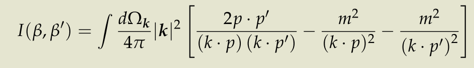
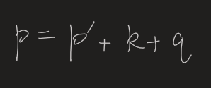
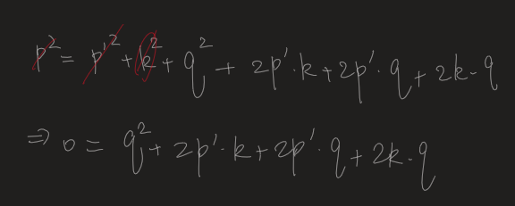
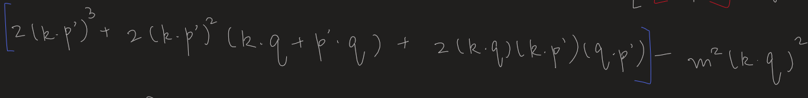
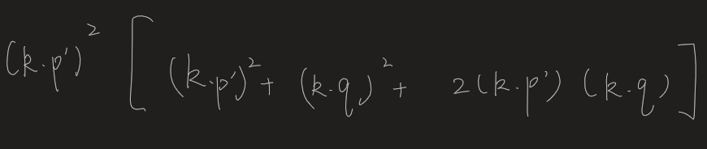

- [[Topology Sketch]]
- QFT HW6
	- 1
		- 
		- 
			- A1. Substitute every p by p'
		- 
		  id:: 638f0552-9c63-43a3-93e4-6f0b72205aab
		-
		- Possible simplifications
			- $k<<p$
			- The magnitude, and thus the energy, of k are fixed. Only integrate over the solid angle.
				- Thus we can separate $k_0$.
				- This is still a 2D integration. Of course we shall reduce one variable.
			- Lorentz invariance -> Select a convenient frame eg. Center-of-mass.
			  background-color:: red
			  collapsed:: true
				- More generally, any spatial momenta can be made zero. 4-momenta, however, transforms covariantly.
				- * Here the frame seems to be fixed; we have to integrate over k.
		- Process
			- Numerator
				- 
			- Denominator
				- 