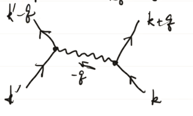
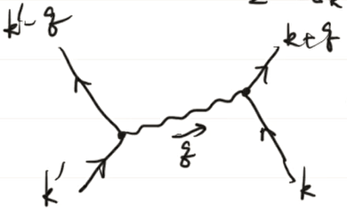

type:: [[Course]]

-
-
- # Problem-Solving Tricks
  collapsed:: true
	- Diagonalizing tight-binding model
	  collapsed:: true
		- Perform a FT to the momentum space
		  collapsed:: true
			- Note that the momenta is a continuum, not discreet.
			- Normalization can be determined by taking $k=0$.
		-
- # Slater Determinant
  collapsed:: true
	- Summary #card
	  card-last-interval:: 30
	  card-repeats:: 1
	  card-ease-factor:: 2.36
	  card-next-schedule:: 2023-06-26T01:03:53.757Z
	  card-last-reviewed:: 2023-05-27T01:03:53.757Z
	  card-last-score:: 3
	  collapsed:: true
		- We want to calculate the wavefunction of a certain fermionic state, say $\prod_{\lambda_\alpha<0} c_\alpha^{\dag}|0\rangle$
		- collapsed:: true
		  $$
		  \begin{aligned}
		  & \left\langle\vec{r}_1, \cdots, \vec{r}_N \mid G S\right\rangle=\left\langle 0\left|\hat\psi\left(\vec{r}_1\right) \cdots \hat{\psi}\left(\vec{r}_N\right) \prod_{\lambda_\alpha<0} c_\alpha^{\dag}\right| 0\right\rangle \\
		  = & \sum\langle 0| c_{\alpha_1} \phi_{\alpha_1}\left(\vec{r}_1\right) \cdots c_{\alpha_N} \phi_{\alpha_N}\left(\vec{r}_N\right) \prod_{\lambda_\alpha<0}c_\alpha^\dag|0\rangle
		  \end{aligned}
		  $$
			- $\langle 0|\hat\psi\left(\vec{r}_1\right) \cdots \hat{\psi}\left(\vec{r}_N\right)$ contains symmetrization, while the definition of wavefunctions do not.
			  However, since the fermionic state is itself anti-symmetrical, it makes no difference.
			- The second line is expanding the field operators in the $\alpha$ representation.
		- Obviously the result is a sum of different permutations with signs.
		  collapsed:: true
			- $$
			  \begin{aligned}
			  \left\langle\vec{r}_1, \cdots, \vec{r}_N \mid G S\right\rangle & =\sum_{\left\{\alpha_1 \cdots \alpha_N\right\}}\operatorname{sgn}\left(\alpha_1, \cdots \alpha_N\right) \phi_{\alpha_1}\left(\vec{r}_1\right) \cdots \phi_{\alpha_N}\left(r_N\right) \\
			  & =\operatorname{Det}\left[\phi_{\alpha_i}\left(\vec{r}_j\right)\right]_{ij}
			  \end{aligned}
			  $$
- # Electron Gas
  collapsed:: true
	- id:: 64238eab-5e73-4970-9129-9cbcc7e974fb
	  collapsed:: true
	- ## [[Bloch Theorem]] and Bloch Wavefunction
	- ## Wannier Wavefunction
	  collapsed:: true
		- Idea
		  collapsed:: true
			- Apply Fourier transformation to the Bloch wavevector.
		- Def #card
		  card-last-interval:: 31.26
		  card-repeats:: 1
		  card-ease-factor:: 2.6
		  card-next-schedule:: 2023-06-30T18:35:21.478Z
		  card-last-reviewed:: 2023-05-30T12:35:21.478Z
		  card-last-score:: 5
		  collapsed:: true
			- $$
			  W_{n i}(\vec{r}):=\frac{1}{\sqrt{N}} \cdot \frac{1}{\sqrt{N}} \sum_k \psi_{n k}(\vec{r}) e^{-i \vec{k} \cdot \vec{r}_i}
			  $$
			- $i=(i_1,i_2,i_3)$ is a tuple of integer, $r_i=i_1 \vec{a}_1+i_2 \vec{a}_2+i_3 \vec{a}_3$ is a lattice vector.
			- The extra $\frac 1 {\sqrt N}$ prefactor is to cancel the effect of system size.
		- Properties
		  collapsed:: true
			- The wavefunctions only depend on $r-r_i$, that is, $W_{n i}(\vec{r})=W_n\left(\vec{r}-\vec{r}_i\right)$
			  collapsed:: true
				- Since there's a factor $e^{ikr}$ in $\psi_k(r)$.
				- Moreover, $u_k(r)$ is periodical on the lattice vectors.
		- Fock operators
		  collapsed:: true
			- $$
			  \hat{c}_{n i}:=\frac{1}{\sqrt{V_0}} \int d^3 \vec{r} \hat{\psi}(\vec{r}) W_{n i}^*(\vec{r})
			  $$
			- Obviously they're the Fourier transform of the Block Fock operators.
- # Linear Response
  collapsed:: true
	- Defs and Setup
	  collapsed:: true
		- Linear response function $\chi(t,t')$
		  card-last-interval:: 30
		  card-repeats:: 1
		  card-ease-factor:: 2.6
		  card-next-schedule:: 2023-06-29T02:59:33.860Z
		  card-last-reviewed:: 2023-05-30T02:59:33.861Z
		  card-last-score:: 5
			- $\hat H=\hat H_0-h(t)\hat A$
			- $\langle\hat{B}\rangle(t)=y(t)$ satisfies $y(t)=\int_{-\infty}^t d t^{\prime} \chi\left(t, t^{\prime}\right) h\left(t^{\prime}\right)$
		- Correlation
			- $S_{B A}\left(t, t^{\prime}\right):=\left\langle\hat{B}(t) \hat{A}\left(t^{\prime}\right)\right\rangle$
	- Introduce ((645712fb-6e94-424c-a970-bb124f0c8e65))
	  collapsed:: true
		- Leave the background part on the observable and the perturbation part to the density matrix (state).
		  collapsed:: true
			- $$
			  \frac{d \rho_I}{d t}=\frac{i}{\hbar} h(t)\left[\hat{A}_I, \hat{\rho}_I\right]
			  $$
		- Approximation
		  collapsed:: true
			- $h(t) \ll 1 . \Rightarrow \rho_I$ varies very slowly!
			- Thus we may approximate $\left[\hat{A}_I, \hat{\rho}_I(t)\right]$ by $\left[\hat{A}_I, \hat{\rho}_I(0)\right]$
			  collapsed:: true
				- $$\hat{\rho }_{I} (t)=\hat{\rho }_{0} +\int _{-\infty }^{t} dt^{\prime }\frac{i}{\hbar } h\left( t^{\prime }\right)\left[\hat{A}_{I}\left( t^{\prime }\right) ,\hat{\rho }_{0}\right]$$
			- collapsed:: true
			  $$y(t)=y(0)+\int _{-\infty }^{t} dt^{\prime }\frac{i}{\hbar } h\left( t^{\prime }\right)\operatorname{tr}\left\{\hat{B}_{I} (t)\left[\hat{A}_{I}\left( t^{\prime }\right) ,\hat{\rho }_{0}\right]\right\}$$
				- We may apply cyclic permutation to the expression inside the trace to obtain 
				  $y(t)=y(0)+\int_{-\infty}^{t^{\prime}} d t^{\prime} h\left(t^{\prime}\right) \ \frac{i}{\hbar}\left\langle\left[\hat{B}_I(t), \hat{A}_I\left(t^{\prime}\right)\right]\right\rangle_{\rho_0}$
				-
		- Conclusion
		  collapsed:: true
			- The response function is 
			  card-last-score:: 5
			  card-repeats:: 2
			  card-next-schedule:: 2023-06-30T18:35:26.189Z
			  card-last-interval:: 31.26
			  id:: 6410762b-de4a-479c-961f-baa5532f6a5d
			  card-ease-factor:: 2.6
			  card-last-reviewed:: 2023-05-30T12:35:26.189Z
			  collapsed:: true
			  $$\chi(t,t')= \frac{i}{\hbar}\left\langle\left[\hat{B}_I(t), \hat{A}_I\left(t^{\prime}\right)\right]\right\rangle_{\rho_0}$$ #card
				- Interaction picture to separate $H_0$ and $A$
				- Key idea: Slow-varying approximation
				  collapsed:: true
					- Approximate $\left[\hat{A}_I, \hat{\rho}_I(t)\right]$ by $\left[\hat{A}_I, \hat{\rho}_I(0)\right]$
				- The remainder is purely routine: Write down the integral and use the cyclic symmetry of trace.
	- {{embed ((6401b89c-e517-4e8f-ad4e-f98d5b166921))}}
- # Thomas-Fermi Screening #card
  collapsed:: true
	- ## Idea
		- In a Fermi liquid, some positive external charge would attract electrons to gather near it, thus weakens the external field.
		  collapsed:: true
			- The actual field is solved by consistency equations.
		- This can be generalized to the case of some dynamical external field.
	- ## Setup
		- External field $V_{ext}(r,t)$, effective field $V_{\text {eff }}=V_{\text {ext }}+\delta V$
		  collapsed:: true
			- For an external charge it is $\operatorname{V_{ext}}(\vec{r})=-e \frac{Q}{r}$
		- $\delta n(\vec{r}):=n(\vec{r})-n_0(\vec{r})$
	- Key technique
		- Random Phase Approximation (RPA)
		  card-last-score:: 5
		  card-repeats:: 2
		  card-next-schedule:: 2023-06-29T11:59:54.142Z
		  card-last-interval:: 30
		  id:: 64118d95-90c5-42ef-afcf-2df672505b13
		  card-ease-factor:: 2.46
		  card-last-reviewed:: 2023-05-30T11:59:54.142Z
		  collapsed:: true
			- 1. The behavior is similar to free fermi gas
			  2. The effect on number density is local
	- ## Static
		- The final result is 
		  card-last-interval:: 42
		  card-repeats:: 2
		  card-ease-factor:: 2.7
		  card-next-schedule:: 2023-09-20T12:54:49.377Z
		  card-last-reviewed:: 2023-08-09T12:54:49.378Z
		  card-last-score:: 5
		  collapsed:: true
		  $$
		  \tilde{V}_{\text {eff }}(\vec{k})=-\frac{4 \pi Q e}{k^2+4 \pi e^2 N_0}
		  $$
			- Use ((64118d95-90c5-42ef-afcf-2df672505b13)),
			  $$
			  n_0=\sum_{k \sigma} \frac{1}{1+e^{\left.\beta ( \varepsilon_k+\mu\right)}} \quad n(\vec{r})=\sum_{k \sigma} \frac{1}{1+e^{\beta\left[\varepsilon_k(\vec{r})-\mu\right]}}
			  $$
			- Therefore 
			  collapsed:: true
			  $$\begin{aligned}
			  \delta n(r ) & =\frac{\partial n}{\partial V_{\text{eff }} (r)}\operatorname{V_{eff}} (r)=-\frac{\partial n}{\partial \mu } V_{\text{eff}} (r)\\
			   & =-N_0 V_{\text{eff}} (r)
			  \end{aligned}$$
				- $N_0$ is the number density at the fermi surface
			- Plug in $-\Delta \phi=4 \pi[Q \delta(\vec{r})-e \cdot \delta n(\vec{r})]$ and perform Fourier transformation, we could obtain the desired result,
			-
			- Exercise. Obtain the Yukawa potential from the result.
	- ## Dynamic
		- Setup
		  collapsed:: true
			- collapsed:: true
			  $$
			  \hat{H}=\hat{H}_0+\hat{H}^{\prime} . \quad \hat{H}^{\prime}=\int d \vec{r} \ \hat{n}(\vec{r}, t) \cdot V_{\text {ext }}(\vec{r}, t)
			  $$
				- $\hat n$ is the number density, not a unit vector.
			- $$\langle \delta \hat{n} (r,t)\rangle =\int _{-\infty }^{t} dt^{\prime } \chi ^{\text{ret }}\left( r-r',t-t^{\prime }\right) V_{\text{ext }} (r' ,t')$$
		- Prop. 
		  card-last-interval:: 31.26
		  card-repeats:: 1
		  card-ease-factor:: 2.6
		  card-next-schedule:: 2023-06-30T18:18:39.031Z
		  card-last-reviewed:: 2023-05-30T12:18:39.032Z
		  card-last-score:: 5
		  collapsed:: true
		  $$
		  \langle \delta \hat{n} (\vec{k} ,\omega )\rangle =\chi_{0}^{\text{ret }} (\vec{k} ,\omega )V_{\text{ext }} (\vec{k} ,\omega )
		  $$
			- Note that $\chi=0$ for $t<0$, thus it is exactly convolution.
			  collapsed:: true
				- ((6475b336-a3fd-41da-9367-98fabdf02e78))
			- It's just routine calculation to verify this result.
		- Solve consistency equations
			- Consistency equations:
			  $$\begin{align*}
			  \langle \delta \hat{n} (\vec{k} ,\omega )\rangle  & =\chi _{0}^{\text{ret }} (\vec{k} ,\omega )V_{\text{ext }} (\vec{k} ,\omega )\\
			  -\Delta \phi  & =-4\pi e\cdot \delta n
			  \end{align*}$$
			- Perform Fourier transformation:
			  $$\begin{aligned}
			  k^{2}\left[\tilde{V}_{\text{ext }} (k)+\delta \tilde{V} (k)\right] & =4\pi e^{2} \cdot \delta \tilde{n} (k,\omega )\\
			   & =4\pi e^{2} [\tilde{\chi } (k,\omega )]^{-1}\tilde{V}_{\text{ext }} (k,\omega )
			  \end{aligned}$$
			- On the other hand,
			  $$\begin{aligned}
			  \langle \delta _{n} (\vec{k} ,\omega )\rangle  & =\chi ^{0} (k,\omega )V_{\text{eff }} (k,\omega )
			  \end{aligned}$$
			- Comparing the above formulae, we obtain the final result:
			  $$\begin{aligned}
			  \left( \chi ^{0}\right)^{-1} & =\chi ^{-1} +\frac{4\pi e^{2}}{k^{2}}
			  \end{aligned}$$
		-
	- ## Solve for the Response
		- Calculate the ((642f7907-397a-4fd1-b504-e0060ac5a8be))
		  collapsed:: true
			- Result:
			  $$
			  \chi^0_{n n}({q}, \omega)=2 \sum_k\left[\frac{f\left(\xi_k\right)-f\left(\xi_{k+q}\right)}{\omega+\xi_k-\xi_{k+q}+i \varepsilon}\right]
			  $$
			- $$\begin{align*}
			  \chi ^{0}{}_{nn}( r-r',\tau -\tau ') & :=-T< \delta \hat{n}( r,\tau ) \delta \hat{n}( r',\tau ')> \\
			  \text{Plug in} \ \delta n=n-< n>  & =-T< \hat{n}( r,\tau )\hat{n}( r',\tau ')> +T< \hat{n}( r,\tau )> < \hat{n}( r',\tau ')> \\
			  \text{Expand by field operators} & =\sum _{\sigma _{1} \sigma _{2}} -T\left\{\left< \psi _{\sigma _{1}}^{\dagger } (r,\tau )\psi _{\sigma _{1}} (r,\tau )\psi _{\sigma _{2}}^{\dagger } (r',\tau ')\psi _{\sigma _{2}} (r',\tau ')\right> \right\}\\
			   & +T\left\{\left< \psi _{\sigma _{1}}^{\dagger } (r,\tau )\psi _{\sigma _{1}} (r,\tau )\right> \left< \psi _{\sigma _{2}}^{\dagger } (r',\tau ')\psi _{\sigma _{2}} (r',\tau ')\right> \right\}
			  \end{align*}$$
			- Note that the first term has two contractions, but the first contraction cancels with the second term, thus we obtain
			  $$\begin{aligned}
			  \chi ^{0}{}_{nn}( r-r',\tau -\tau ') & =-\sum _{\sigma _{1} \sigma _{2}}( -1) T\left\{\left< \psi _{\sigma _{1}}^{\dagger } (r,\tau )\psi _{\sigma _{2}} (r',\tau ')\right> \left< \psi _{\sigma _{2}}^{\dagger } (r',\tau ')\psi _{\sigma _{1}} (r,\tau )\right> \right\}\\
			   & =\sum _{\sigma } G_{\sigma }^{R}( r-r',\tau -\tau ') G_{\sigma }^{R}( r'-r,\tau '-\tau )
			  \end{aligned}$$
			- Perform Fourier transformation: Note that the product of two functions becomes a convolution.
			  collapsed:: true
				- $$\begin{aligned}
				  \chi ^{0}{}_{nn}( q,\omega _{n}) & =\sum _{\sigma }\sum _{k}\frac{1}{\beta }\sum _{v_{n}} G_{\sigma }( q,v_{n}) G_{\sigma }( k+q,\omega _{n} +v_{n})\\
				  \omega _{n} & =\frac{2\pi n}{\beta } ,\quad v_{n} =\frac{\pi }{\beta } (2n+1)
				  \end{aligned}$$
			- For free fermions,
			  $$
			  G^R(\vec{k}, \omega)=\int d \omega^{\prime} \frac{A\left(\vec{k}, \omega^{\prime}\right)}{\omega-\omega^{\prime}+i\epsilon}=\frac{1}{\omega-\xi_k+i\epsilon}
			  $$
			- Plug into the expression of $\chi^0$ and perform analytical continuation:
			  collapsed:: true
			  $$\begin{aligned}
			  \chi ^{0}{}_{nn}( q,i\omega _{n}) & =2\sum _{k}\frac{1}{\beta }\sum _{v_{n}}\frac{1}{iv_{n} -\xi _{k}}\frac{1}{i\omega _{n} +iv_{n} -\xi _{k+q}}\\
			   & =2\sum _{k} (-1)\oint _{c}\frac{dz}{2\lambda i} f(z)\frac{1}{z-\xi _{k}}\frac{1}{z+i\omega _{n} -\xi _{k+q}}
			  \end{aligned}$$
				- Here a traditional trick is in effect:
				- First, express the summation by a contour integration.
				  collapsed:: true
					- Consider the fermionic weight function, 
					  $$f(E)=\frac 1 {e^{\beta E}+1}$$.
					- The poles are $z=i\frac \pi \beta (2n+1)$ and each pole has a residue $-\frac 1 \beta$.
					- Therefore
					  $$\frac 1 \beta \sum_{\nu_n} F(i \nu_n)=\oint f(z)F(z)$$
				- Second, the contour can be deformed to simplify the integration to the residue over two poles.
				  collapsed:: true
					- _1685437460588_0.png)
					- The outer contour gives zero since the integrand decays $\sim z^{-2}$.
			- Therefore
			  collapsed:: true
			  $$\begin{aligned}
			  \chi ^{0}{}_{nn}( q,i\omega _{n}) & =2\sum _{k}\left[\frac{f( \xi _{k})}{\xi _{k} +i\omega _{n} -\xi _{k+q}} +\frac{f( \xi _{k+q} -i\omega _{n})}{\xi _{k+q} -i\omega _{n} -\xi _{k}}\right]\\
			   & =2\sum _{k}\left[\frac{f( \xi _{k})}{\xi _{k} +i\omega _{n} -\xi _{k+q}} +\frac{f( \xi _{k+q})}{\xi _{k+q} -i\omega _{n} -\xi _{k}}\right]
			  \end{aligned}$$
				- Note that $\omega_n=\frac {2\pi}\beta n$, therefore $i\omega_n$ could be disposed.
			-
			- To obtain the correct correlation function, we just replace $i\omega_n$ by $\omega+i\varepsilon$!
		- Two Limits
		  collapsed:: true
			- Static limit
			  collapsed:: true
			  $$\omega=0, q \to 0$$
				- Plug into
				  collapsed:: true
				  $$
				  \chi^0_{n n}({q}, \omega)=2 \sum_k\left[\frac{f\left(\xi_k\right)-f\left(\xi_{k+q}\right)}{\omega+\xi_k-\xi_{k+q}+i \varepsilon}\right]
				  $$
					- \begin{align*}
					  \chi _{nn}^{0} (q,\omega ) & =2\sum _{k}\left[\frac{f( \xi _{k}) -f( \xi _{k+q})}{\omega +\xi _{k} -\xi _{k+q} +i\varepsilon }\right]\\
					   & =2\sum _{k}\frac{df( \xi )}{d\xi }\\
					   & =-2\sum _{k}\frac{df( \xi )}{d\mu } =N_{0}
					  \end{align*}
				- Therefore we can obtain
				  $$\chi _{nn}^{ret} (q\rightarrow 0,\omega \rightarrow 0)=-\frac{N_{0}}{1+\frac{4\pi e^{2}}{q^{2}} N_{0}}$$
				- Compare $\chi^{ret}$ and $\chi^0$, we can obtain the relation between $V_{ext}$ and $V_{eff}$, i.e. the dielectric coefficient.
			- High-frequency limit
			  collapsed:: true
			  $$\omega \to \infty$$
				- Expand the expression into powers of $1/ \omega$:
				  $$
				  \chi_{nn}^{0, \text { ret }}(\vec{q}, \omega)=2 \sum_k \frac{f\left(\xi_k\right)-f\left(\xi_{k+q}\right)}{\omega+\xi_k-\xi_{k+q}} \Rightarrow 2 \sum_k\left[f\left(\xi_k\right)-f\left(\xi_{k+q}\right)\right]\left[\frac{1}{\omega}-\frac{\xi_k-\xi_{k+q}}{\omega^2}+o\left(\frac{1}{\omega^2}\right)\right]
				  $$
				- The $1/\omega$ order contribution is zero.
				- The $(1/\omega)^2$ order contribution is
				  collapsed:: true
				  $$\begin{aligned}
				   & -\frac{2}{\omega ^{2}}\sum _{k}[ f( \xi _{k}) -f( \xi _{k+q})][ \xi _{k} -\xi _{k+q}]\\
				  = & -\frac{2}{\omega ^{2}}\sum _{k} f( \xi _{k})( 2\xi _{k} -\xi _{k+q} -\xi _{k-q})\\
				  = & -\frac{2}{\omega ^{2}} \cdot \left( -\frac{q^{2}}{m}\right) \cdot \frac{n}{2}\\
				  = & \frac{n_{e} q^{2}}{m\omega ^{2}}
				  \end{aligned}$$
					- Note that here we take $\xi_k=\frac {k^2}{2m}$.
				- By the second-order contribution we obtain 
				  $$\varepsilon_k \sim 1- \frac{\omega^2}{\omega_p^2}$$
				  which is the high-freq polarzation behavior.
				- At $\omega=\omega_p$ the Green function has a pole, which indicates the existence of some quasiparticle (plasmon)!
	-
- # Local Magnetic Moment
  collapsed:: true
	- Summary #card
	  card-last-interval:: 31.26
	  card-repeats:: 1
	  card-ease-factor:: 2.6
	  card-next-schedule:: 2023-06-06T18:07:45.793Z
	  card-last-reviewed:: 2023-05-06T12:07:45.794Z
	  card-last-score:: 5
	  collapsed:: true
		- 'Local' means at the site of impurity, while the magnetic moment is displayed by symmetry breaking at the site.
		- Single-impurity Anderson Model
		  $$H= \sum_{k \sigma} E_k c^\dag_{k \sigma} c_{k \sigma} + \sum_\sigma E_d c^\dag_{d \sigma} c_{d \sigma} + \sum_{k \sigma}\left(V_{k d} c_{k \sigma}^{\dag} c_{d \sigma}+(c.c.)\right)+U n_{d \uparrow} n_{d \downarrow} .$$
		- Mean-field approximation
		  $$H=\sum _{k\sigma } E_{k} c_{k\sigma }^{\dagger } c_{k\sigma } +\sum _{\sigma } E_{d} c_{d\sigma }^{\dagger } c_{d\sigma } +\sum _{k\sigma }\left( V_{kd} c_{k\sigma }^{\dagger } c_{d\sigma } +(h.c.)\right) + \\Un_{d\uparrow }< n_{d\downarrow }> + U< n_{d\uparrow }> n_{d\downarrow }$$
		-
	- ## Model: Single-impurity Anderson Model
	  collapsed:: true
		- 'Single impurity' corresponds to the second term, which is the orbital electrons at a single site.
		- collapsed:: true
		  $$H= \sum_{k \sigma} E_k c^\dag_{k \sigma} c_{k \sigma} + \sum_\sigma E_d c^\dag_{d \sigma} c_{d \sigma} + \sum_{k \sigma}\left(V_{k d} c_{k \sigma}^{\dag} c_{d \sigma}+(c.c.)\right)+U n_{d \uparrow} n_{d \downarrow} .$$
			- First term: Electrons moving freely in the solid. Could occupy different momenta.
			- Second term: Localized electrons at the impurity site.
			- Third term: Hopping between moving electrons and localized ones. We may assume $V_{kd}$ is real.
			  collapsed:: true
				- '轨道杂化'
			- Last term: Columb interaction within the same orbit.
		- Notes on the properties
		  collapsed:: true
			- If we ignore the interaction (hopping) term, the local magnetic moment depends on the position of the Fermi surface.
			  collapsed:: true
				- If surface above $E_d$ but below $E_d + U$, then the orbit would be occupied by a single electron, thus producing a magnetic moment.
			- However, the interaction term would lead to hybridization (杂化) of different states
		- Two limits of the Single-impurity model #card
		  card-last-interval:: 30
		  card-repeats:: 1
		  card-ease-factor:: 2.6
		  card-next-schedule:: 2023-06-29T03:28:09.147Z
		  card-last-reviewed:: 2023-05-30T03:28:09.148Z
		  card-last-score:: 5
		  collapsed:: true
			- Notation: $\Delta$ is the 'hybridization energy', which means that the energy of the impurity site is made into a band by the hybridization terms.
			- collapsed:: true
			  $$
			  U \gg \left|E_d\right| \gg \Delta
			  $$
				- Weak hybridization.
				- Note that when $V=0$, $n_{d\uparrow}$ and $n_{d\downarrow}$ commutes with $H$, thus there is the well-defined notion of occupation numbers (i.e. the eigenstates have definite occupation numbers).
				- The last term (Coulumb repulsion) tends to inhibit double occupation at the site of impurity -> occupation number = 1 -> Local magnetic moment!
			- collapsed:: true
			  $$
			  U \gg \Delta \gg |E_d|
			  $$
				- Strong hybridization. 
				  collapsed:: true
				  We can't talk about a well-defined local orbit; rather, the electron is mixed into the Fermi sea.
					- In other words, the eigenstates no longer have definite occupation numbers, but strongly entangled with free electrons!
				- Therefore the local moment tends to be washed out by hybridization.
				-
		-
	- ## [[Mean-Field Approximation]]
	  collapsed:: true
		- collapsed:: true
		  $$\begin{aligned}
		  H_{MF} & =\sum _{k\sigma } E_{k} c_{k\sigma }^{\dagger } c_{k\sigma } +\sum _{\sigma } E_{d} c_{d\sigma }^{\dagger } c_{d\sigma } +\sum _{k\sigma }\left( V_{kd} c_{k\sigma }^{\dagger } c_{d\sigma } +(h.c.)\right) +Un_{d\uparrow }< n_{d\downarrow }> +U< n_{d\uparrow }> n_{d\downarrow }\\
		   & =\sum _{k\sigma } E_{k} c_{k\sigma }^{\dagger } c_{k\sigma } +\sum _{\sigma } E_{d\sigma } c_{d\sigma }^{\dagger } c_{d\sigma } +\sum _{k\sigma }\left( V_{kd} c_{k\sigma }^{\dagger } c_{d\sigma } +(h.c.)\right)
		  \end{aligned}$$
		  where $E_{d\sigma } =E_{d} +U< n_{d,-\sigma }>$.
			- Obtained by ignoring 2nd variation
			- The consistency relation can be obtained by solving $\langle n_{d\uparrow } \rangle$ and  $\langle n_{d\downarrow } \rangle$
		- In principle, the bilinear form above can be diagonalized by Bogoliubov transformations. But the brute-force calculation is quite arduous.
		  collapsed:: true
			- Note that the simplest way is $\left[ H_{\mathrm{HF}}^{\mathrm{A}} ,a_{n\sigma }^{\dagger }\right] =\epsilon _{n\sigma } a_{n\sigma }^{\dagger }$. Moreover, we don't need to calculate every single commutator; since each exchange either gives -1 or +1, we only need to examine which gives +1 and thus non-commutative. [Exercise]
		- After diagonalization:
		  collapsed:: true
			- $$\hat{H}_{MF} =\sum _{n\sigma } \varepsilon_{n\sigma } c_{n\sigma }^{\dagger } c_{n\sigma }$$
	- ## Obtain [[Green Function]]
	  collapsed:: true
		- #+BEGIN_NOTE
		  We often want Green function rather than the spectrum.
		  #+END_NOTE
		- Calculate the ((642f7907-397a-4fd1-b504-e0060ac5a8be)):
		  collapsed:: true
			- $$G_{dd,\sigma }( \omega _{n}) =-\int _{0}^{\beta } d\tau e^{i\omega _{n} \tau } T\left\{\left< c_{d\sigma } (\tau )c_{d\sigma }^{\dagger } (0)\right> \right\}$$
			- It is hard to calculate directly. But we may first calculate the MGF in the energy representation, then apply a basis transformation.
			  collapsed:: true
				- As a standard result for free fermions, 
				  collapsed:: true
				  $$G_{m\sigma }( w_{n}) =\frac{1}{iw_{n} -\epsilon _{m}}$$
					- Note that here $\omega \to iw_n$
			- We may define a matrix to compactly represent the basis transformation.
			  collapsed:: true
				- $$\hat{G}_{\sigma }( \omega _{n}) =\sum _{n\sigma }\frac{1}{i\omega _{n} -\varepsilon _{n}} |n\sigma \rangle \langle n\sigma |$$
				- Then
				  $$G_{dd,\sigma }( \omega _{n}) =< d\sigma |\hat{G}_{\sigma }( w_{n}) |d\sigma > $$
			- Plug into $( iw_{n} -\hat{h}_{MF})\hat{G}_{\sigma } =\mathbb{1}$:
			  collapsed:: true
				- \begin{aligned}
				  \langle d\sigma |( iw_{n} -\hat{h}_{MF})\hat{G}_{\sigma } |k\sigma \rangle =0:\\
				  ( i\omega _{n} -E_{d\sigma })< d\sigma | \hat{G}( \omega _{n})| \vec{k} \sigma > -V_{kd}< k\sigma | \hat{G}( \omega _{n})| k\sigma > =0.\\
				  ( i\omega _{n} -E_{d\sigma }) G_{d;k\sigma }( \omega _{n}) -V_{kd} G_{k\sigma }( \omega _{n}) =0\\
				   \\\\
				  \langle \vec{k} \sigma |( iw_{n} -\hat{h}_{MF})\hat{G}_{\sigma } |d\sigma \rangle =0:\\
				  ( i\omega _{n} -\epsilon _{k})< \vec{k} \sigma | \hat{C}_{(}( \omega _{n})| d\sigma > -V_{kd}< d\sigma | \hat{G}( \omega _{n})| d\sigma > =0\text{. }\\
				  ( iw_{n} -\epsilon _{k}) G_{k;d\sigma }( w_{n}) -V_{kd} G_{dd,\sigma }( w_{n}) =0.\\
				   \\\\
				  \langle d\sigma |( iw_{n} -\hat{h}_{MF})\hat{G}_{\sigma } |d\sigma \rangle =1:\\
				  ( iw_{n} -E_{d\sigma })< d\sigma | \hat{G}( \omega _{n})| d\sigma > -\sum_k V_{kd}< k\sigma |\hat{G}( \omega _{n}) |d\sigma > =1.\\
				  ( iw_{n} -E_{d\sigma }) G_{dd,\sigma }( w_{n}) - \sum_k V_{kd} G_{k;d\sigma }( w_{n}) =1
				  \end{aligned}
				-
				- We want to solve $G_{dd,\sigma}$ from the above equations.
				  collapsed:: true
					- Use (5), we see that $V_{kd}G_{dd,\sigma}/( iw_{n} -\epsilon _{k})= G_{k;d\sigma }( w_{n})$
					- Plug into the last equation we see $(i\omega_n-E_{d\sigma})G_{dd,\sigma}-\sum_k V_{kd}^2 G_{dd,\sigma}/(i\omega_n-\varepsilon_k)=1$, which allows for solving the desired Green function.
					-
			- Finally
			  $$G_{dd,\sigma }( \omega _{n}) =\frac{1}{i\omega _{n} -E _{d\sigma } -\sum _{k}\frac{V_{kd}^{2}}{i\omega _{n} -\epsilon _{k}}}$$
			  and we may obtain the retarded Green function by analytical continuation $\displaystyle \omega _{n}\rightarrow i( \omega +\epsilon )$
			  \begin{equation*}
			  \left[ G_{dd,\sigma }^{\operatorname{ret}} (\omega )\right]^{-1} =\omega -E_{d\sigma } -\sum _{k}\frac{V_{kd}^{2}}{\omega -\epsilon _{k} +i0^{+}}
			  \end{equation*}
			-
		-
	- ## Self-Energy Correction
	  collapsed:: true
		- collapsed:: true
		  $$\begin{equation*}
		  \Sigma _{d\sigma }^{ret}( \omega ) :=\sum _{k}\frac{V_{kd}^{2}}{\omega -\epsilon _{k} +i0^{+}}
		  \end{equation*}$$
			- This is motivated by 
			  \begin{equation*}
			  \left[ G_{dd,\sigma }^{\operatorname{ret}} (\omega )\right]^{-1} =\omega -E_{d\sigma } -\sum _{k}\frac{V_{kd}^{2}}{\omega -\epsilon _{k} +i0^{+}}
			  \end{equation*}
		- Take real and imaginary parts and the Cauchy principle value:
		  collapsed:: true
		  \begin{gather*}
		  Re\ \Sigma _{d\sigma }^{ret}( \omega ) =\frac{1}{V}\int \frac{d^{3} k}{( 2\pi )^{3}}\frac{V_{kd}^{2}}{\omega -\epsilon _{k} +i0^{+}}\mathbf{P}\left(\frac{V_{kd}^{2}}{\omega -\epsilon _{k}}\right)\\
		  Im\ \Sigma _{d\sigma }^{ret}( \omega ) =\sum _{k} -\pi \delta ( \omega -E_{k}) V_{kd}^{2} =-\pi \left< V_{kd}^{2}\right> _{FS} N( \omega ) \\
		  \\
		  \end{gather*}
			- FS means Fermi surface
		- Then 
		  \begin{equation*}
		  \operatorname{G}_{d\sigma }^{\operatorname{ret}} (\omega )=\frac{1}{\omega -E_{d\sigma } -\operatorname{Re} \Sigma (\omega )-i\operatorname{Im} \Sigma (\omega )}
		  \end{equation*}
		  Compare with the free fermions, we see that the real part shifts the **peak** of the spectrum function and the imaginary part controls the **width** of the peak.
		- Two approximations:
		  collapsed:: true
			- $\displaystyle \Sigma ( \omega )\rightarrow \Sigma ( E_{d\sigma } +Re\ \Sigma )$
			- $\displaystyle Re\ \Sigma \ \rightarrow \ 0$ (Since we can't accurately determine $\displaystyle E_{d\sigma }$ from the first place, it is meaningless to keep a high accuracy of the shift)
			- Therefore, we are actually considering 
			  \begin{equation*}
			  Im\ \Sigma _{d\sigma }^{ret}( \omega ) =-\pi \left< V_{kd}^{2}\right> _{FS} N( E_{d\sigma }) :=-\Delta 
			  \end{equation*}
			  which is consistent with our estimation by Fermi's golden rule (up to a factor of $\displaystyle \pi $)
		- Then 
		  \begin{equation*}
		  G_{dd\sigma }( \omega ) =\frac{1}{\omega -E_{d\sigma } +i\Delta }
		  \end{equation*}
		  Moreover, 
		  \begin{equation*}
		  \rho _{d\sigma } (\omega )=A_{d\sigma } (\omega ):=-\frac{1}{\pi } Im\ G_{dd\sigma }^{ret} (\omega )=\frac{1}{\pi }\frac{\Delta }{(\omega -E_{d\sigma } )^{2} +\Delta ^{2}}
		  \end{equation*}
	- ## Consistency Equation
	  collapsed:: true
		- Idea: First calculate in energy eigenbasis, then use basis transformation.
		  \begin{equation*}
		  \begin{aligned}
		  \langle n_{d\sigma } \rangle  & =\left< c_{d\sigma }^{\dagger } c_{d\sigma } \right\rangle \\
		   & =\sum _{nm}\left< c_{n\sigma }^{\dagger } c_{m\sigma }\right> \langle d\sigma |n\sigma \rangle \langle m\sigma |d\sigma \rangle .\\
		   & =\sum _{n}\left< c_{n\sigma }^{\dagger } c_{n\sigma }\right> \Bigl| \langle d\sigma |n\sigma \rangle \Bigl|^{2}\\
		   & =\sum _{n} f( E_{n\sigma })\Bigl| \langle d\sigma |n\sigma \rangle \Bigl|^{2}
		  \end{aligned}
		  \end{equation*}
		  f is the Fermi-Dirac distribution.
		- Recall that 
		  collapsed:: true
		  \begin{equation*}
		  A_{d\sigma } (\omega )=\sum _{n}\Bigl| \langle d\sigma |n\sigma \rangle \Bigl|^{2} \delta ( \omega -E _{n\sigma })
		  \end{equation*}
			- $$A_{d\sigma}(\omega)=\sum_n \Bigl| \langle d\sigma |n\sigma \rangle \Bigl|^{2} A_{n\sigma}(\omega)$$
			  $$A_{n\sigma}(\omega):=\int dt e^{-i \omega t} \left\langle c_{n\sigma}(t)c^\dagger_{n\sigma}(0) \right\rangle=\delta(\omega-E_{n\sigma})$$
			- This is actually spectral representation.
		- So
		  \begin{equation*}
		  \begin{aligned}
		  \langle n_{d\sigma } \rangle  & =\sum _{n} f( E_{n\sigma })\Bigl| \langle d\sigma |n\sigma \rangle \Bigl|^{2}\\
		   & =\int d\omega \ f( \omega ) A_{d\sigma }( \omega )
		  \end{aligned}
		  \end{equation*}
		- Further simplification: Consider $\displaystyle T=0$, so $\displaystyle f( \omega )$ becomes a heaviside function.
		  \begin{gather*}
		  \begin{aligned}
		  \langle n_{d\sigma } \rangle  & =\sum _{n} f( E_{n\sigma })\Bigl| \langle d\sigma |n\sigma \rangle \Bigl|^{2}\\
		   & =\int _{-\infty }^{0} d\omega \frac{1}{\pi }\frac{\Delta }{(\omega -Ed\sigma )^{2} +\Delta ^{2}}\\
		   & =\frac{1}{\pi }\cot^{-1}\left(\frac{Ed\sigma }{\Delta }\right) =\frac{1}{\pi } \omega ^{-1}(\frac{E_{d} +U\langle n_{d,-\sigma } \rangle }{\Delta } ）
		  \end{aligned}\\
		  \begin{aligned}
		   & \\
		   & 
		  \end{aligned}
		  \end{gather*}
		- Note that spin-up and spin-down depends on each other, so we may not solve directly. However, we can consider whether there'll be symmetry breaking, i.e. $\displaystyle n_{d,\uparrow } \neq n_{d,\downarrow }$
		  collapsed:: true
			- Special case: Consider $\displaystyle E_{d} =-U/2$, now $\displaystyle < n_{d,\uparrow }> +< n_{d,\downarrow }> =1$.
			- Take $\displaystyle < n_{d,\uparrow }> =1/2+x$, we can obtain a consistency relation and examine nonzero solutions.
- # Kondo Effect
  collapsed:: true
	- ## Degenerate Second-Order Perturbation
	  id:: 64239f9f-7660-4553-ab22-80685caf6f6c
	  collapsed:: true
		- Effective Hamiltonian #card
		  card-last-interval:: 31.26
		  card-repeats:: 1
		  card-ease-factor:: 2.6
		  card-next-schedule:: 2023-06-30T18:35:11.391Z
		  card-last-reviewed:: 2023-05-30T12:35:11.392Z
		  card-last-score:: 5
		  collapsed:: true
			- collapsed:: true
			  $$\left< \alpha |H_{eff}^{( 2)} |\beta \right> =\sum _{n} \langle \alpha |W|n\rangle \langle n|W|\beta \rangle \frac{1}{2}\left(\frac{1}{E_{\alpha } -E_{n}} +\frac{1}{E_{\beta } -E_{n}}\right)$$
				- $\alpha,\beta$ are (nearly) degenerate energy levels with $\langle \alpha |W|\beta\rangle =0$
				- $n$ is some state in the excited space
			- Intuitively, we can jump from $\alpha$ to an intermediate state $n$, then jump from $n$ to $beta$, multiplied by an energy factor.
			- Proof
			  collapsed:: true
				- *To be completed
- # Electron-Lattice Interaction
  collapsed:: true
	- Motivation
	  collapsed:: true
		- In a lattice we have the interaction of electrons and nuclei.
		  The electrons move freely in the solid while the nuclei are mainly fixed.
		- We want to write down the second-quantized Hamiltonian for the interaction.
	- Setup
	  collapsed:: true
		- Convention: Lower-case letters for quantities of electrons; upper-case for quantities of nuclei.
	- ## 1D Oscillator Chain and Phonons
	  collapsed:: true
		- Summary
		  collapsed:: true
			- Write down the classical Hamiltonian.
			- Perform Fourier transformation to obtain a decoupled form.
			- Rewrite the Hamiltonian by creation and annihilation operators to obtain oscillators.
		- Classical Hamiltonian:
		  \begin{equation*}
		  H=\sum _{n}\frac{P_{n}^{2}}{2M} +\frac{1}{2} M\omega _{0}^{2}\sum _{n}( X_{n} -X_{n+1})^{2}
		  \end{equation*}
		- Perform Fourier transformation (on the lattice) to obtain the oscillation modes for second quantization:
		  collapsed:: true
		  \begin{gather*}
		  P_{n} =\frac{1}{\sqrt{N}}\sum _{k} e^{ikna}\tilde{P}_{k}\\
		  X_{n} =\frac{1}{\sqrt{N}}\sum _{k} e^{ikna}\tilde{X}_{k}
		  \end{gather*}
			- $P_{-k} =P_{k}^{*}$ and $X_{-k} =X_{k}^{*}$
			- $\sum _{n} P_{n}^{2} =\sum _{k} P_{k} P_{k}^{*}$
		- Plug into the expression of the classical Hamiltonian:
		  collapsed:: true
			- \begin{gather*}
			  \begin{aligned}
			  \sum _{n} X_{n} X_{n+1} & =\frac{1}{N}\sum _{n}\sum _{kk'} e^{ikna} X_{k} e^{ik'(n+1)a} X_{k'}\\
			   & =\sum _{k} \ \ e^{ika} X_{-k} X_{k}\\
			  H & =\frac{1}{2M}\sum _{k} P_{-k} P_{k} +\frac{M\omega _{0}^{2}}{2}\left( 2\sum _{n} X_{n}^{2} -2\sum _{k} X_{n} x_{n+1}\right)\\
			   & =\frac{1}{2M}\sum _{k} P_{-k} P_{k} +\frac{M\omega _{0}^{2}}{2}\sum _{k} X_{-k} X_{k}\left[ 2-\left( e^{ika} +e^{-ika}\right)\right]\\
			   & =\frac{1}{2M}\sum _{k} P_{-k} P_{k} +\frac{M\omega _{0}^{2}}{2}\sum _{k} \omega _{k}^{2} X_{-k} X_{k}
			  \end{aligned}\\
			  \omega _{k}^{2} =2\omega _{0}^{2}( 1-\cos ka)\overset{k\ll 1}{=} \omega _{0}^{2} k^{2} a^{2}
			  \end{gather*}
		- Obviously it is a sum of lots of oscillators, so we use second quantization.
		  collapsed:: true
			- \begin{equation*}
			  \begin{aligned}
			  [\hat{P}_{n} ,\hat{X}_{m}] & =-i\delta _{nm} .\\
			  [\hat{P}_{k} ,\hat{X}_{k^{\prime }}] & =\frac{1}{N}\sum _{nm}[\hat{P}_{n} ,\hat{X}_{m}] e^{-ikna} e^{-ik^{\prime } ma}\\
			   & =\frac{1}{N} (-i)\sum _{nm} \delta _{nm} e^{-ikna} e^{-ik^{\prime } ma}\\
			   & =-i\frac{1}{N}\sum _{n} e^{i\left( k+k^{\prime }\right) na}\\
			   & =-i\delta _{k+k^{\prime } ,0}\\
			  [\hat{P}_{k} ,\hat{X}_{-k^{\prime }}] & =-i\delta _{kk^{\prime }}
			  \end{aligned}
			  \end{equation*}
		- Now we should write the creation and annihilation operators. $\tilde{Q}_{k}$ and $\tilde{X}_{k}$ are normalized operators, whose coefficient can be determined from the Hamiltonian.
		  collapsed:: true
			- \begin{gather*}
			  \tilde{P}_{k} =\frac{1}{\sqrt{2M\omega _{k}}} P_{k} ;\ \ \tilde{Q}_{k} =\sqrt{\frac{M\omega _{k}}{2}} Q_{k}\\
			  b_{k} =\tilde{Q}_{k} +i\tilde{P}_{k}\\
			  \begin{aligned}
			  \hat{H} =\sum _{k}\hat{H}_{k} & =\sum _{k}\frac{1}{2} \omega _{k}\left( b_{k}^{\dagger } b_{k} +b_{-k}^{\dagger } b_{-k} +1\right)\\
			   & =\sum _{k} \omega _{k}\left( b_{k}^{\dagger } b_{k} +\frac{1}{2}\right) .
			  \end{aligned}
			  \end{gather*}
		- Note that this is a bit different from conventional oscillators (eg. $[\hat{P}_{k} ,\hat{X}_{-k^{\prime }}] =-i\delta _{kk^{\prime }}$, $k$ pairs with $-k$), though the final result is similar.
		- Also we may express $X$ and $P$ by creation and annihilation operators:
		  \begin{equation*}
		  \begin{aligned}
		  \hat{X}_{n} & =\sum _{k}\sqrt{\frac{2}{MN\omega _{k}}} e^{ikna}\frac{1}{2}\left( b_{k} +b_{-k}^{\dagger}\right)\\
		   & =\sum _{k}\frac{1}{\sqrt{2MN\omega _{k}}}\left( b_{k} +b_{-k}^{\dagger}\right) e^{ikna}\\
		   & 
		  \end{aligned}
		  \end{equation*}
	- ## Phonons in 3D
	  collapsed:: true
		- Summary
		  collapsed:: true
			- Expand the interaction to second order (the first order vanishes at equilibrium), which leads to an expression of 3D oscillators.
			  The bilinear form would lead to a similar result to the oscillator chain.
		- Classical Hamiltonian:
		  \begin{equation*}
		  H=\sum _{i}\frac{P_{i}^{2}}{2M} +\sum _{i< j} V(\vec{R}_{i} -\vec{R}_{j})
		  \end{equation*}
		- Let $\vec{R}_{i} =\overrightarrow{R^{0}}_{i} +\vec{Q}_{i}$, then we may expand the interaction to second order:
		  \begin{equation*}
		  V(\vec{R}_{i} -\vec{R}_{j}) =V_{0} +\frac{1}{2}\sum _{i< j}\frac{\partial ^{2} V}{\partial R^{a} \partial R^{b}}\left( Q_{i}^{a} -Q_{j}^{a}\right)\left( Q_{i}^{b} -Q_{j}^{b}\right)
		  \end{equation*}
		  It would diagonalize if we transform to momentum space.
		- Note that in 3D we also have polarization, so we shall denote the modes by $(\vec{k} ,\lambda )$. The result is 
		  \begin{equation*}
		  H=\sum _{k\lambda }\frac{P_{-k\lambda } P_{k\lambda }}{2M} +V^{0} +\frac{M}{2}\sum _{k\lambda } \omega _{k\lambda }^{2} Q_{-k\lambda } Q_{k\lambda }
		  \end{equation*}
		- The Fourier transformation writes
		  \begin{equation*}
		  Q_{k\lambda } =\frac{1}{\sqrt{N}}\sum _{i}\hat{\lambda }_{k} \cdot \vec{Q}_{i} e^{-i\vec{k} \cdot \vec{R}_{i}^{0}}
		  \end{equation*}
		  where $\hat{\lambda }_{k}$ is the polarization vector.
		- The process of second quantization is analogous to above.
		  \begin{equation*}
		  \hat{H} =V^{0} +\sum _{k\lambda }\left( b_{k\lambda }^{\dagger} b_{k\lambda } +\frac{1}{2}\right) \omega _{k\lambda }
		  \end{equation*}
	- ## Electron-Phonon Interaction
	  collapsed:: true
		- Summary #card
		  collapsed:: true
		  card-last-interval:: 31.26
		  card-repeats:: 1
		  card-ease-factor:: 2.6
		  card-next-schedule:: 2023-06-30T18:31:00.290Z
		  card-last-reviewed:: 2023-05-30T12:31:00.291Z
		  card-last-score:: 5
			- First write down the classical Hamiltonian
			  \begin{equation*}
			  H_{ei} =\sum_{ij} V_{ei}(\vec{r}_{j} -\vec{R}_{i}) 
			  \end{equation*}
			- Expand the interaction to first order of $\vec R_i$ and perform Fourier transformation (since translation invariance is manifest).
			- Perform quantization and obtain the scattering vertex.
			  collapsed:: true
				- The quantization to phonons is expressing $\vec R_i$ by creation and annihilation operators.
				- The quantization of electrons is in the step ((6454f1b7-7eee-4f3f-93f4-f464b79f8116)), where the (classical) exponential is expressed by fermionic operators.
			- Result:
			  $$\begin{equation*}
			  \begin{aligned}
			  H_{ei} & =V^{0} +\frac{1}{N}\sum _{k}\sum _{L}\sum _{q\lambda } M_{qL\lambda } c_{k+q+L}^{\dagger } c_{k}\left( b_{q\lambda } +b_{-q\lambda }^{\dagger }\right)
			  \end{aligned}
			  \end{equation*}$$
		- collapsed:: true
		  \begin{equation*}
		  H_{ei} =\sum_{ij} V_{ei}(\vec{r}_{j} -\vec{R}_{i}) 
		  \end{equation*}
			- Note that 'ei' stands for 'electron-ion'.
		- However, we perform 2nd quantization to electrons while only 1st quantization to nuclei (since they're localized and distinguishable)
		  collapsed:: true
			- \begin{gather*}
			  \vec{R}_{i} =\vec{R}_{i}^{0} +\vec{Q}_{i} =\vec{R}_{i}^{0} +\sum _{k\lambda }\frac{1}{\sqrt{2MN\omega _{k\lambda }}}\left( b_{k\lambda } +b_{-k\lambda }^{+}\right)\hat{\lambda }_{k} e^{i\vec{k} \cdot \vec{R}_{i}^{0}}\\
			  \begin{aligned}
			  H_{ei} & =\sum _{ij} V_{ei}\left(\vec{r}_{j} -\vec{R}_{i}^{0}\right) -\sum _{ij}\frac{\partial V_{ei}}{\partial \vec{r}_{j}}\vec{Q}_{i}\\
			   & =\sum _{ij} V_{ei}\left(\vec{r}_{j} -\vec{R}_{i}^{0}\right) -\sum _{ij} \nabla _{j} V_{ei}\overrightarrow{Q_{i}}
			  \end{aligned}
			  \end{gather*}
		- Perform a Fourier transformation to the lattice:
		  collapsed:: true
			- \begin{gather*}
			  V_{ei}(\vec{r}) =\frac{1}{N}\sum _{k} V_{ei}(\vec{k}) e^{ik\cdot r}\\
			  \begin{aligned}
			  H_{ei} & =V^{0} -\sum _{ij} \nabla _{j} V_{ei}\left(\vec{r}_{j} -\vec{R}_{i}^{0}\right) \cdot \vec{Q}_{i}\\
			   & =V^{0} -\sum _{ij} \nabla _{j} \ \frac{1}{N}\sum _{k} V_{ei} (\vec{k} )e^{i\vec{k} \cdot \left(\vec{r}_{j} -\vec{R}_{i}^{0}\right)} \cdot \vec{Q}_{i}\\
			   & =V^{0} -\sum _{ij} \ \frac{1}{N}\sum _{k}( i\vec{k}) V_{ei} (\vec{k} )e^{i\vec{k} \cdot \left(\vec{r}_{j} -\vec{R}_{i}^{0}\right)} \cdot \vec{Q}_{i}\\
			   & =V^{0} -\frac{1}{N}\sum _{ij}\sum _{k}\sum _{q\lambda } \ ( i\vec{k}) V_{ei} (\vec{k} )e^{i\vec{k} \cdot \left(\vec{r}_{j} -\vec{R}_{i}^{0}\right)}\frac{1}{\sqrt{2MN\omega _{q\lambda }}}\left( b_{q\lambda } +b_{-q\lambda }^{\dagger }\right)\hat{\lambda }_{q} e^{i\vec{q} \cdot \vec{R}_{i}^{0}}
			  \end{aligned}
			  \end{gather*}
		- First perform the summation over $i$.
		  collapsed:: true
			- Note that here's a subtlety: $k$ could take continuous values while $q$ must be in the Brillione zone.
			  collapsed:: true
				- In lattices, momenta could differ by a inverse lattice vector.
			- Thus
			  \begin{equation*}
			  \frac{1}{N}\sum _{i} e^{i\vec{k} \cdot \left(\vec{r}_{j} -\vec{R}_{i}^{0}\right)} e^{i\vec{q} \cdot \vec{R}_{i}^{0}} =e^{i\vec{k} \cdot \vec{r}_{j}}\sum _{L} \delta (\vec{k} -\vec{q} +\vec{L})
			  \end{equation*}
			  the summation is over all inverse lattice vectors.
			- \begin{equation*}
			  \begin{aligned}
			  H_{ei} & =V^{0} -\frac{1}{N}\sum _{{i} j}\sum _{k}\sum _{q\lambda } \ ( i\vec{k}) V_{ei} (\vec{k} ) e^{i\vec{k} \cdot \left(\vec{r}_{j} -\vec{R}_{i}^{0}\right)}\frac{1}{\sqrt{2MN\omega _{q\lambda }}}\left( b_{q\lambda } +b_{-q\lambda }^{\dagger }\right)\hat{\lambda }_{q} e^{i\vec{q} \cdot \vec{R}_{i}^{0}}\\
			   & =V^{0} -\sum _{j}\sum _{k}\sum _{q\lambda } e^{i\vec{k} \cdot \vec{r}_{j}}\sum _{L} \delta (\vec{k} -\vec{q} +\vec{L}) \ ( i\vec{k}) V_{ei} (\vec{k} )\frac{1}{\sqrt{2MN\omega _{q\lambda }}}\left( b_{q\lambda } +b_{-q\lambda }^{\dagger }\right)\hat{\lambda }_{q}\\
			   & =V^{0} -\sum _{j}\sum _{L}\sum _{q\lambda }\frac{1}{\sqrt{2MN\omega _{q\lambda }}} e^{i(\vec{q} +\vec{L}) \cdot \vec{r}_{j}} i(\vec{q} +\vec{L}) V_{ei}(\vec{q} +\vec{L})\left( b_{q\lambda } +b_{-q\lambda }^{\dagger }\right)\hat{\lambda }_{q}
			  \end{aligned}
			  \end{equation*}
		- Next we shall consider the summation over $j$.
		  id:: 6454f1b7-7eee-4f3f-93f4-f464b79f8116
		  collapsed:: true
			- Trick. 
			  \begin{gather*}
			  \begin{aligned}
			  \sum _{j} e^{i\vec{p} \cdot \vec{r}_{j}} & =\sum _{j}\int d\vec{r} \delta (\vec{r} -\vec{r}_{j}) e^{i\vec{p} \cdot \overrightarrow{r_{j}}}\\
			   & =\sum _{j}\int d\vec{r} \delta (\vec{r} -\vec{r}_{j}) e^{i\vec{p} \cdot \vec{r}}\\
			   & =\int d\vec{r} e^{i\vec{p} \cdot \vec{r}}\sum _{j} \delta \left(\vec{r} -\overrightarrow{r_{j}}\right)\\
			   & =\int d\vec{r} e^{i\vec{p} \cdot \vec{r}} \ \hat{n}( r) :=\hat{\rho }_{p} \ \text{Cautious!}\\
			   & =\int d\vec{r} e^{i\vec{p} \cdot \vec{r}} \psi ^{\dagger }( r) \psi ( r)\\
			   & =\sum _{k^{\prime } k}\int d\vec{r} c_{k^{\prime }}^{\dagger } e^{-i\vec{k} '\cdot \vec{r}} c_{k} e^{i\vec{k} \cdot \vec{r}} e^{i\vec{p} \cdot \vec{r}}\\
			   & =\sum _{kk^{\prime }} c_{k^{\prime }}^{\dagger } c_{k}\int d\vec{r} e^{-i(\overrightarrow{k'} -\vec{k} -\vec{p} )\cdot \vec{r}}\\
			   & =\sum _{k} c_{k+p}^{\dagger } c_{k}
			  \end{aligned}\\
			  \end{gather*}
			  which directly obtains a second-quantized form.
		- Plug all above in, we obtain
		  \begin{equation*}
		  \begin{aligned}
		  H_{ei} & =V^{0} -\sum _{j}\sum _{L}\sum _{q\lambda }\frac{i(\vec{q} +\vec{L})}{\sqrt{2MN\omega _{q\lambda }}} e^{i(\vec{q} +\vec{L}) \cdot \vec{r}_{j}} V_{ei}(\vec{q} +\vec{L})\left( b_{q\lambda } +b_{-q\lambda }^{\dagger }\right)\hat{\lambda }_{q}\\
		   & =V^{0} -\sum _{k}\sum _{L}\sum _{q\lambda }\frac{i(\vec{q} +\vec{L})}{\sqrt{2MN\omega _{q\lambda }}} c_{k+q+L}^{\dagger } c_{k} V_{ei}(\vec{q} +\vec{L})\left( b_{q\lambda } +b_{-q\lambda }^{\dagger }\right)\hat{\lambda }_{q}
		  \end{aligned}
		  \end{equation*}
		- Define
		  collapsed:: true
		  \begin{equation*}
		  M_{qL\lambda } =-\frac{i(\vec{q} +\vec{L})}{\sqrt{2M\omega _{q\lambda }}}\hat{\lambda }_{q} V_{ei}(\vec{q} +\vec{L})
		  \end{equation*}
		  We obtain
		  \begin{equation*}
		  \begin{aligned}
		  H_{ei} & =V^{0} +\frac{1}{N}\sum _{k}\sum _{L}\sum _{q\lambda } M_{qL\lambda } c_{k+q+L}^{\dagger } c_{k}\left( b_{q\lambda } +b_{-q\lambda }^{\dagger }\right)
		  \end{aligned}
		  \end{equation*}
			- Note that $c_{k+q+L}^{\dagger } c_{k}\left( b_{q\lambda } +b_{-q\lambda }^{\dagger }\right)$ corresponds to a scattering vertex, where an income electron scatters to obtain a momentum of $q+L$, while a phonon might be created or annihilated. (on lattices momenta are modulo $L$).
	- ## Effective Electron-Electron Interaction
	  id:: 6454f1b7-ff0b-480d-8fa3-7795a4bcbc51
	  collapsed:: true
		- Motivation
		  collapsed:: true
			- We'd like to integrating out the d.o.f. of phonons and obtain the effect on electrons.
			- For example, the phonon-intermediated interaction accounts for the formation of Cooper pairs.
		- Setup
		  collapsed:: true
			- Here we ignore inverse lattice vectors and polarizations for convenience.
			- The intermediate states have a phonon with momentum $\pm q$.
			  collapsed:: true
				- Note that the intermediate state is **not unique**!
				  We can emit a phonon from $k'$ to $k$ with momentum $q$, or from $k$ to $k'$ with $-q$.
			- The initial state has two electrons with momentum $k,k'$.
			  The final state has two electrons with momentum $k+q,k'-q$.
		-
		- The idea is to invoke ((64239f9f-7660-4553-ab22-80685caf6f6c)) to obtain the effective Hamiltonian.
		- There can be two processes:
		  collapsed:: true
			- 
			  collapsed:: true
				- \begin{aligned}
				  \left< k+q,k'-q\left| H^{(2)}\right| kk^{\prime }\right> _{A} & =\frac{1}{N} M_{-q} M_{q}\\
				   & \frac{1}{2}\left(\frac{1}{\varepsilon _{k} -\varepsilon _{k+q} -\omega _{q}} +\frac{1}{\varepsilon _{k-q} -\varepsilon _{k'} -\omega _{q}}\right)
				  \end{aligned}
				- Here
				  $$W=\frac{1}{N}\sum _{k}\sum _{p} M_{p} c_{k+p}^{\dagger } c_{k}\left( b_{p} +b_{-p}^{\dagger }\right)$$
				- $$E_\alpha=\varepsilon_k+\varepsilon_{k'},E_n=\varepsilon_{k+q}+\varepsilon_{k'}+\omega_{-q}=\varepsilon_{k+q}+\varepsilon_{k'}+\omega_{q}$$
			- 
			  collapsed:: true
				- collapsed:: true
				  \begin{aligned}
				  \left< k+q,k'-q\left| H^{(2)}\right| kk^{\prime }\right> _{B} & =\frac{1}{N} M_{q} M_{-q}\\
				   & \frac{1}{2}\left(\frac{1}{\varepsilon _{k'} -\varepsilon _{k'-q} -\omega _{q}} +\frac{1}{\varepsilon _{k+q} -\varepsilon _{k} -\omega _{q}}\right)
				  \end{aligned}
					-
		- Collecting all those above, we obtain
		  $$\begin{aligned}
		  H^{(2)} & =\frac{1}{2}\sum _{kk^{\prime } q}\frac{1}{N}| M_{q}| ^{2} c_{k'+q}^{\dagger } c_{k^{\prime } -q}^{\dagger } c_{k^{\prime }} c_{k}\\
		   & \left(\frac{1}{\epsilon _{k} -\epsilon _{k+q} -\omega _{q}} +\frac{1}{\epsilon _{k+q} -\epsilon _{k} -\omega _{q}}\right)\\
		   & =\frac{1}{N}\sum _{kk^{\prime } q}| M_{q}| ^{2}\frac{-\omega _{q}}{\omega _{q}^{2} -( \epsilon _{k} -\epsilon _{k+q})^{2}} c_{k'+q}^{\dagger } c_{k^{\prime } -q}^{\dagger } c_{k^{\prime }} c_{k}
		  \end{aligned}$$
	-
- # Related Topics
	- # [[Green Function, Correlation and Dissipation]]
	- # [[Fermi Liquid]]
	- # [[Hatree-Fock Approximation]]
	  card-last-interval:: 30
	  card-repeats:: 1
	  card-ease-factor:: 2.36
	  card-next-schedule:: 2023-06-28T13:49:34.348Z
	  card-last-reviewed:: 2023-05-29T13:49:34.349Z
	  card-last-score:: 3
	- # [[Superconductivity]]
	- # [[Localization]]
	- # [[Quantum Phase Transition]]
-