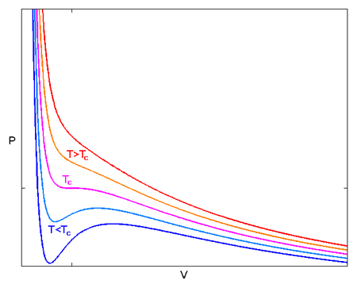
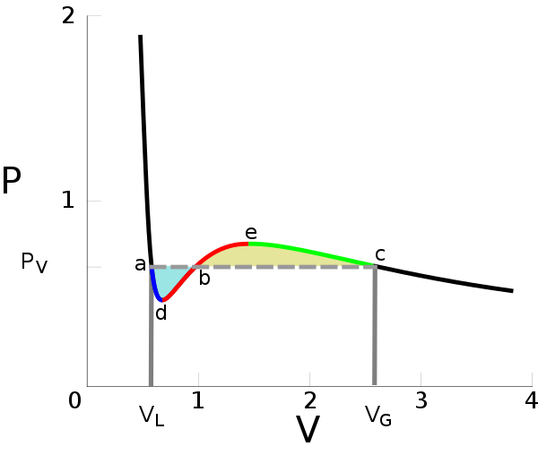
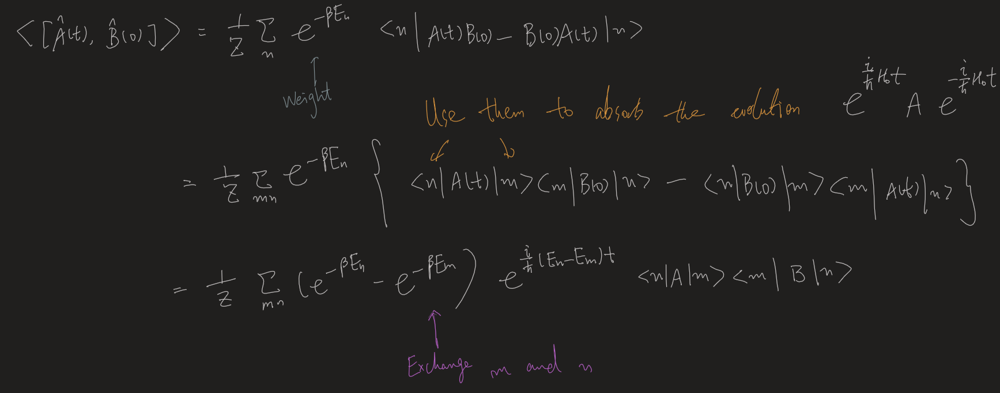
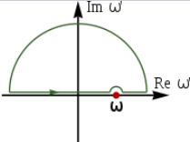

public:: true
type:: [[Course]]

- [[References]]
	-  Pathria
	-  Sachdev, Quantum phase transitions
	- Altland
	-
- Altland
  collapsed:: true
	- 3
		- Essentially, Integrations over fields are just discrete versions of [[Gaussian integral]].
		- Inverse matrix is replaced by kernel([[Green Function]])
	- 5.1
		- Turn [[Ising model]] into $\phi^4$ theory
			- $$\begin{aligned}
			  &H\left(\left\{\sigma_{i}\right\}_{i}\right)=-\left[\sum_{i j} \sigma_{i} J_{i j} \sigma_{j}+h \sum_{j} \sigma_{j}\right] \\
			  &Z=\Sigma e^{-\beta H}=\Sigma e^{\sigma^{T} K \sigma+\sigma^T h1} \quad K=\beta J \\
			  &\int d^{N} \psi e^{-\psi^{T} k^{-1} \psi}=x^{N / 2}(\operatorname{det} K)^{1 / 2} \\
			  &\text{Substitute }\tilde{\psi}=\psi-K \sigma \\
			  &I=\int d^{N} \tilde{\psi} e^{-(\widetilde{\psi}+k \sigma)^{T} k^{-1}(\tilde{\psi}+k \sigma)} \\
			  &=\int d^{N} \tilde{\psi} e^{-\tilde{\psi}^{T} k^{-1} \tilde{\psi}} e^{-2 \sigma^{T} \psi} e^{-\sigma^{T} k \sigma}
			  \end{aligned}$$
			- $e^{\sigma^TK\sigma+\sigma^T h1}=I\int d^{N} \tilde{\psi} e^{-\tilde{\psi}^{T} K^{-1} \tilde{\psi}} e^{-\sigma^{T} (2\psi+h1)}$
			- Sum over $\sigma$, we can obtain the partition function in an integral form.
			- $h1$ stands for a vector with all components being $h$
-
- [[Saddle point integration]]
  collapsed:: true
	- Example
		- Calculate the partition function of some [[Canonical ensemble]].
			- $Z=\int dE\ \Omega(E)\ e^{-\beta E}=\int dE\ e^{f(E)}$, 
			  where $f(E)=$
			- Expand the integral near the most probable energy:
- [[Effective Theory]]
  collapsed:: true
	- Divide the [[Degrees of freedom]] into high-energy group $X_h$ and a low-energy group $X_l$
	- Full [[Partition function]]: $Z=\sum\limits_{X_l}\sum\limits_{X_h}e^{-\beta E(X_l,X_h)}$
	-
	- We may first perform the high-energy sum, then we can obtain $E_{\text {eff }}\left(X_l\right):=-k_B T \ln \sum_{X_h} e^{-\beta E\left(x_1, x_n\right)}$.
		- Note that the result is exact. If we plug this back, we can restore the full partition function.
	- The high-energy part can be dealt with by [[Approximations]], eg. expansions.
	  That's why we choose to sum over the high-E ones, not the low-E ones.
	-
	- Example: [[Ising model ]] and connected diagrams
		- Trick. $e^{K \sigma_i \sigma_j}=\cosh K\left(1+\sigma_i \sigma_j \tanh K\right)$
			- This allows easy expansion of K.
		- $Z=\sum_{\left\{\sigma_i\right\}} \sum_{\langle i j\rangle}e^{K \sigma_i \sigma_j}=\sum_{\left\{\sigma_i\right\}} \sum_{\langle i j\rangle} \cosh K\left(1+\sigma_i \sigma_j \tanh K\right)\\=(\cosh K)^C \sum_{\langle i j\rangle} \left(1+\sigma_i \sigma_j \tanh K\right)$
		-
		- $\sum_{\langle i j\rangle} \left(1+\sigma_i \sigma_j \tanh K\right)$ can be expanded by order.
		- Note that the spins must pair to obtain nonzero results, since $\langle \sigma_i\rangle=0$.
		  So we must have connected diagrams(where each vertex is covered even times).
		-
		- Correlation functions
			- $\begin{aligned}\left\langle\sigma_i \sigma_j\right\rangle &=\frac{1}{Z} \sum_{\left\{\sigma_i\right\}} \sigma_i \sigma_j e^{\beta J \sum_{i, j} \sigma_i \sigma_j} \\ &=\frac{1}{Z} \sum_{\left\{\sigma_i\right\}} \sigma_i \sigma_j \prod_{\langle k l\rangle} \cosh K\left(1+\sigma_k \sigma_l\tanh K \right) \end{aligned}$
			- Open strings: 
		-
		- Linked-cluster theorem #card
		  card-last-interval:: 10
		  card-repeats:: 1
		  card-ease-factor:: 2.6
		  card-next-schedule:: 2022-12-14T06:08:58.154Z
		  card-last-reviewed:: 2022-12-04T06:08:58.154Z
		  card-last-score:: 5
			- $F=-kT\ln Z\propto \{Connected\ diagrams\}$
			- In calculating correlation functions, also only connected diagrams need to be considered.
	-
- [[Gaussian theory]]
  collapsed:: true
	- Summary #card
	  card-last-interval:: 24
	  card-repeats:: 2
	  card-ease-factor:: 2.7
	  card-next-schedule:: 2023-03-24T13:44:25.600Z
	  card-last-reviewed:: 2023-02-28T13:44:25.601Z
	  card-last-score:: 5
		- After Fourier transforming to momentum space, different momenta decouple. So the correlation functions are easy to evaluate.
	- $$F=\int d^D r\left[\frac{1}{2}(\nabla \phi)^2+\frac{r}{2} \phi^2\right]$$
	- [[Fourier Transformation]] to momentum space, $\phi(x)=\int \frac{d^{3 k}}{(2 a)^3} \tilde\phi(k) e^{i \vec{k} \cdot \vec{x}}$ 
	  collapsed:: true
		- Note that $\tilde{\phi}(k)=\tilde{\phi}^*(-k)$ to keep $\phi(x)$ real.
			- Actually $Re\ \tilde{\phi}(k):= \tilde{\Phi}_r(k)$ and $Im\ \tilde{\phi}(k) :=\tilde{\Phi}_i(k)$ and are two independent real fields.
			- Then $Re\ \tilde{\phi}(k)=Re\ \tilde{\phi}(-k)$, $Im\ \tilde{\phi}(k)=-Im\ \tilde{\phi}(-k)$.
			  So we may take that only the momenta with $k_x>0$ as independent.
		-
		- $\nabla \phi(x)=\int \frac{d^3 k}{(2 x)^3} \tilde{\phi}(k) \cdot i \vec{k} e^{i \vec{k} \cdot \vec{x}}$
		- $\int d^D x \cdot \frac{r}{2} \phi^2=\frac{1}{2} \int \frac{d^3 k}{(2 \pi)^3} \widetilde{\phi}(-k) \widetilde{\phi}(k) \cdot r$
	- Results
		- $$E[\tilde{\phi}]= \int \frac{d^3 k}{(2 \pi)^3} \tilde{\phi}(-k) \widetilde{\phi}(k)\frac 1 2 \left(k^2+r\right)=\frac{1}{2} \int \frac{d^3 k}{(2 \pi)^3}\left[\tilde{\Phi}_r^2(k)+\tilde{\Phi}_i^2(k)\right]\left(k^2+r\right)$$
		- $$\left\langle\tilde{\phi}_r^2(k)\right\rangle=\left\langle\tilde{\phi}_i^2(k)\right\rangle=\frac{1}{k^2+r}$$
		- $$\begin{aligned}
		  &\langle\tilde{\phi}(-k) \tilde{\phi}(k)\rangle=\left\langle\widetilde{\phi}_r^2(k)+\widetilde{\phi}_i^2(k)\right\rangle=\frac{2}{k^2+r} \\
		  &\langle\tilde{\phi}(k) \tilde{\Phi}(k)\rangle=0
		  \end{aligned}$$
- Methods for simulation
  collapsed:: true
	- Monte-Carlo method
		- Idea
			- Use randomized time-evolution to simulate ensemble average.
	- Wolff Algorithm
		- Idea #card
		  card-last-interval:: 67.2
		  card-repeats:: 3
		  card-ease-factor:: 2.8
		  card-next-schedule:: 2023-05-04T05:08:27.928Z
		  card-last-reviewed:: 2023-02-26T01:08:27.929Z
		  card-last-score:: 5
			- Flip a cluster of spins at a stroke to accelerate.
				- Specifically, form a cluster by try to activate adjacent parallel spins
			- 'Reality' of the algorithm is guaranteed by [[Detailed balance]].
				- Activation probability $p=\max \left\{1-e^{-2 k}, 0\right\}$
	- How to find the [[Critical point]]
		- Binder cumulant
			- $1-\frac {\lang m^4\rang}{3\lang m^2 \rang ^2}$
			- Distinguish between FM and PM phases.
	- Data collapsing
		- Physical quantities obey some universal scaling relations.
		- We may plot lots of data in one diagram. If they fall on a single curve (the universal function), then the criticality is justified.
- [[Mean-field theory]]
  collapsed:: true
	- Idea
		- Let $\sigma_i-\langle\sigma_i\rangle:=\delta_i$ be a small quantity. Ignore higher order terms.
		- Plug the result back to the model to obtain self-consistency equation.
	- Self-consistency: $\langle\delta_i\rangle=0$.
		- Note that in Ising model the spin can only be $\pm1$.
- [[Phase Transition]] and [[Criticality]]
  collapsed:: true
	- Criticality of Van der Waals gas #card
	  card-last-interval:: 67.2
	  card-repeats:: 3
	  card-ease-factor:: 2.8
	  card-next-schedule:: 2023-03-10T09:45:21.079Z
	  card-last-reviewed:: 2023-01-02T05:45:21.080Z
	  card-last-score:: 5
		- Equation $\left(p+\frac{a}{v^2}\right)(v-b)=R T$
			- 
			-
			- 
			- The images are taken from Wikipedia.
		- Note that the hollowed region where $\frac {dp}{dV}>0$ is **unphysical. **So the region shall actually correspond to a **gas-liquid transition.**
		- At $T_c$, the phase transition becomes continuous.
		- Critical equation→$\frac{d p}{d v}=0, \frac{d^2 p}{d v^2}=0$
	- Ising
		- [[Mean-field theory]] approach
			- Self consistency $m=\tanh [\beta(q J m+h)]$
	- Landau's theory
		- Use m as an order parameter.
		- $Z_2$ symmetry ⇒ Only even-order terms can survive.
		- $$\begin{aligned}
		  &F=F_0+r(T) m^2+u m^4 \\
		  &F=F_0+\frac{1}{2} a t m^2+\frac{1}{4} c m^4
		  \end{aligned}$$
			- The equilibrium minimizes F. We can obtain the critical point and the critical exponents.
	- [[Critical exponents]]
		- $\alpha$
			- $C_V \sim \begin{cases}t^{-\alpha}, & t \rightarrow 0^{+} \\ |t|^{-\alpha^{\prime}}, & t \rightarrow 0^{-}\end{cases}$
		- $\beta$
			- $m \sim|t|^\beta \quad t \rightarrow 0^{-}$
		- $\gamma$
			- $\chi_0=\left.\frac{\partial m}{\partial h}\right|_{h=0}=|t|^{-\gamma}$
			- Only for $t \to 0^+$
		- $\delta$
			- $t=0$(precise), $m \sim h^{1 / \delta}$
		- $\eta$
			- $\langle\psi(0) \psi(r)\rangle \propto r^{-d+2-\eta}$
		- $\nu$
			- Correlation length $\xi\sim t^{-\nu}$
	-
- [[Renormalization]] 
  collapsed:: true
	- Momentum shell
		- Thought of the approach #card
		  card-last-interval:: 67.2
		  card-repeats:: 3
		  card-ease-factor:: 2.8
		  card-next-schedule:: 2023-04-08T17:09:13.209Z
		  card-last-reviewed:: 2023-01-31T13:09:13.210Z
		  card-last-score:: 5
			- We integrate a bit of high-energy degrees of freedom, then examine how the system changes.
			  At the critical point, the system shall be **insensitive to rescaling**.
			- In this case, we make use of the momentum [[Cutoff]].
				- This is a bit strange, since the cutoff seems 'unphysical' to me. It is a device to make the integral convergent.
		-
		- Overall scheme #card
		  card-last-interval:: 10
		  card-repeats:: 2
		  card-ease-factor:: 2.7
		  card-next-schedule:: 2022-12-17T12:01:44.773Z
		  card-last-reviewed:: 2022-12-07T12:01:44.774Z
		  card-last-score:: 5
			- **Integrate** out large-energy d.o.f. 
			  $$\begin{aligned}
			  F_{\text {eff }}\left[\phi_<\right] &=-\ln \int D\left[\phi_>\right] e^{-F[\phi]} \\
			  &=-\ln \int D\left[\phi_{>}\right] e^{-\int d^D x\left[\frac{1}{2}(\nabla \phi)^2+\frac{r}{2}\phi^2+\frac{u}{4 !} \phi^4\right]}
			  \end{aligned}$$
			  Note that this is **exact**.
			- **Rescale** the coordinates to restore the former form(eg. same cutoff)
				- Require that the system keeps invariant and find proper scaling dimensions.
				- For example, $[\phi]=\frac{D-2}{2},[x]=-1$
			- Write the change under an infinitesimal change, thus obtaining the **RG equation** and find fixed points.
		-
		- Model: $F=\int d^D r\left[\frac{1}{2}(\nabla \phi)^2+\frac{r}{2} \phi^2+\frac{u}{4 !} \phi^4\right]$  Phi^4 theory.
		-
		- Step1. Integrate
		  collapsed:: true
			- For the free theory(u=0): Different momenta are decoupled.
				- $$E[\tilde{\phi}]= \int \frac{d^3 k}{(2 \pi)^3} \tilde{\phi}(-k) \widetilde{\phi}(k)\frac 1 2 \left(k^2+r\right)=\frac{1}{2} \int \frac{d^3 k}{(2 \pi)^3}\left[\tilde{\Phi}_r^2(k)+\tilde{\Phi}_i^2(k)\right]\left(k^2+r\right)$$
			- This motivates us to write $\phi=\phi_>+\phi_<$ , 
			  $$\begin{aligned}
			  &\phi_\alpha^<(x):=\int_0^{\Lambda / b} \frac{d^D k}{(2\pi)^D} \tilde{\phi}(k) e^{i k x} \\
			  &\phi_\alpha^{>}(x)=\int_{\Lambda / b}^{\Lambda} \frac{d^D k}{(2\pi)^D} \tilde{\phi}(k) e^{i k x}
			  \end{aligned}$$
				- Note that we take $b-1<<1$ here.
			- Then we have $$Z_>:=\int D\left[\phi_{>}\right] e^{-\int d^D x\left[\frac{1}{2}(\nabla \phi)^2+\frac{r}{2}\phi^2+\frac{u}{4 !} \phi^4\right]}\\=\int D\left[\phi_{>}\right] e^{\left.-\int d^D x\left\{\left[\frac{1}{2}\left(\nabla \phi_<\right)^2+\frac{1}{2} r \phi_<^2\right)\right]+\left[\frac{1}{2}\left(\nabla \phi_>\right)^2+\frac{1}{2} r \phi_{>}^2\right]+\frac{u}{4 !}\left(\phi_<+\phi_{>}\right)^4\right\}}\\=e^{-\int d^D x\left\{\left[\frac{1}{2}\left(\nabla \phi_<\right)^2+\frac{1}{2} r \phi_<^2\right)\right]}\int D\left[\phi_{>}\right] e^{\left.-\int d^D x\left\{\left[\frac{1}{2}\left(\nabla \phi_<\right)^2+\frac{1}{2} r \phi_<^2\right)\right]+\left[\frac{1}{2}\left(\nabla \phi_>\right)^2+\frac{1}{2} r \phi_{>}^2\right]+\frac{u}{4 !}\left(\phi_<+\phi_{>}\right)^4\right\}}$$
				- In the last line we can easily see that the Gaussian part of the low-energy is separated.
			- Thus, $${F_{eff}}\left[\phi_c\right]=\int d^D x\left[\frac{1}{2}\left(\vec{\nabla} \phi_<\right)^2+\frac{r}{2} \phi_{<}^2\right]-\ln Z_{>}-\ln \left\langle e^{-\int d^D x \cdot \frac{u}{4 !}\left(\phi_<+\phi_>\right)^4}\right\rangle_{z_{>}} .$$
				- The second term is a constant, which we don't care.
				- We always love the form of **expectation, **which allows us to eliminate vacuum graphs.
			-
			- Next task: Evaluate the high-momenta integral perturbatively.
				- Draw Feynman diagrams. Fix the coefficients manually.
				- Integrate in momentum space; easy to make approximations.
		- Step2. Rescale
		  collapsed:: true
			- $\tilde\Lambda=b\Lambda,\tilde x=x/b$ to have $\tilde\Lambda=\Lambda$
			- All other quantities rescale according to their dimensions
		- Step3. Write RG equation and find fix points
		  collapsed:: true
			- Trick: set $\epsilon=4-D$, expand wrt $\epsilon$
			-
			- Relevance of coupling constants #card
			  card-last-interval:: 67.2
			  card-repeats:: 3
			  card-ease-factor:: 2.8
			  card-next-schedule:: 2023-05-07T04:29:32.559Z
			  card-last-reviewed:: 2023-03-01T00:29:32.560Z
			  card-last-score:: 5
				- Thought: The irrelevant ones vanish in the rescaling process
				- Criteria: Scaling dimension
				- [g]>0 ⇒ Relevant
				  [g]=0 ⇒ Marginal
				  [g]<0 ⇒ Irrelevant
			-
			- Stability of the fix points #card
			  card-last-interval:: 28
			  card-repeats:: 3
			  card-ease-factor:: 2.8
			  card-next-schedule:: 2023-01-04T11:56:32.189Z
			  card-last-reviewed:: 2022-12-07T11:56:32.190Z
			  card-last-score:: 5
				- Essentially, when the system is a bit off the fix point, would it fall back to the fix point or drift away?
				-
				- Method: Examine the eigenvalues of the RG equation.
					- $\lambda>0$ -> Unstable
					- $\lambda<0$ -> Stable
		-
	- 1/N expansion
	- Position space
- [[Nonequilibrium]] statistics
  collapsed:: true
	- In equilibrium statistics, we don't know anything of the dynamics. In principle we only know the spectrum.
	- Here a lot more interesting things would emerge.
	- Diffusion
	  collapsed:: true
		- Fick's law #card
		  card-last-interval:: 16
		  card-repeats:: 2
		  card-ease-factor:: 2.7
		  card-next-schedule:: 2023-01-01T05:48:45.341Z
		  card-last-reviewed:: 2022-12-16T05:48:45.342Z
		  card-last-score:: 5
			- ((637e1fcc-f63b-4263-ae21-3f325af2890a))
		- Continuity equation
			- $\nabla \cdot \boldsymbol{j}(\boldsymbol{r}, t)+\frac{\partial n(\boldsymbol{r}, t)}{\partial t}=0$
	- [[Brownian motion]]
	  collapsed:: true
		- ((637e1ecc-4512-4afb-904b-baedb81808a6))
			- Formulation
			  collapsed:: true
				- Particle at x=0 when t=0
				- Walk for l each step at a random direction
				- The steps are uncorrelated
			- Summary #card
			  card-last-interval:: 67.2
			  card-repeats:: 3
			  card-ease-factor:: 2.8
			  card-next-schedule:: 2023-04-13T04:15:31.452Z
			  card-last-reviewed:: 2023-02-05T00:15:31.453Z
			  card-last-score:: 5
				- The distribution of the position tends to be Gaussian after a large number of jumps.
				- The average is zero, while the square deviation adds up at each step.
				  id:: 63b186e4-627f-4de6-adec-727488e67a6f
				- collapsed:: true
				  $$\begin{gathered}p(x) d x=\frac{d x}{\sqrt{ }(4 \pi D t)} \exp \left(-\frac{x^2}{4 D t}\right) \\ D=l^2 / 2 \tau^*\end{gathered}$$
					- D is the diffusion coefficient.
					- $\tau$ is the time for a single step
		- ((637e200d-781d-4108-a25a-782b8b561888))
			- Formulation
				- $M \frac{d v}{d t}=-\frac{v}{B}+\boldsymbol{F}(t) ; \quad \overline{\boldsymbol{F}(t)}=0$
					- F is a random force
					- B corresponds to viscosity
			- Summary #card
			  card-last-interval:: 24
			  card-repeats:: 2
			  card-ease-factor:: 2.7
			  card-next-schedule:: 2023-03-19T00:27:05.677Z
			  card-last-reviewed:: 2023-02-23T00:27:05.677Z
			  card-last-score:: 5
				- There are three possible operations: Multiply x or v; integrate t; take ensemble average.
				- When all these are useless, we can solve the ODE directly.
				- ((637e20b2-8778-42e0-aa87-a00cd31171f9))
				- ((637e20d9-4cb8-4aef-bd85-d419ff73e31c))
					- This needs solving the ODE.
	- ((637e2117-23ec-4369-8b80-8dc4c6e7c618)) Equation
		- We study an ensemble of particles and study how they evolve (and reach equilibrium)
		- Summary #card
		  card-last-interval:: 61.44
		  card-repeats:: 3
		  card-ease-factor:: 2.56
		  card-next-schedule:: 2023-03-15T10:57:47.145Z
		  card-last-reviewed:: 2023-01-13T00:57:47.146Z
		  card-last-score:: 5
			- Master equation
				- $$\frac{\partial f(x, t)}{\partial t}=\int_{-\infty}^{\infty}\left\{-f(x, t) W\left(x, x^{\prime}\right)+f\left(x^{\prime}, t\right) W\left(x^{\prime}, x\right)\right\} d x^{\prime}$$
				- Where W is the propagator
			- Assume that the propagator is nonzero only within a small range. Then we perform Taylor expansion to 2nd order.
			- Fokker-Planck equation
				- $$
				  \begin{gathered}
				  \frac{\partial f(x, t)}{\partial t}=-\frac{\partial}{\partial x}\left\{\mu_1(x) f(x, t)\right\}+\frac{1}{2} \frac{\partial^2}{\partial x^2}\left\{\mu_2(x) f(x, t)\right\} \\
				  \mu_1(x)=\int_{-\infty}^{\infty} \xi W(x ; \xi) d \xi=\frac{\langle\delta x\rangle}{\delta t}=\left\langle v_x\right\rangle \\
				  \mu_2(x)=\int_{-\infty}^{\infty} \xi^2 W(x ; \xi) d \xi=\frac{\left\langle(\delta x)^2\right\rangle}{\delta t}
				  \end{gathered}
				  $$
				-
		-
	- Fluctuation-Dissipation Theorem
	  collapsed:: true
		- Motivation
			- Dissipation is the response to external perturbations.
			- Fluctuation can also be viewed as perturbations to the system (by god).
		- Settings and Definitions
			- $\lang x\rang =0$ when the external field is zero.
			- Linear response function $\chi$
			  collapsed:: true
				- $$
				  \langle x(t)\rangle:=\int_{-\infty}^t d t^{\prime} h\left(t^{\prime}\right) \chi\left(t^{\prime}, t\right)
				  $$
				- By time-translation invariance, we may write it as $\chi(t-t')$
				- This only works for small $h(t)$
			- Correlation
			  collapsed:: true
				- $$
				  A_x(t):=\langle x(t) x(0)\rangle
				  $$
			- $$
			  \begin{aligned}
			  &A_x(\omega):=\int d t A_x(t) e^{-i \omega t} \\
			  &\chi(\omega):=\int d t x(t) e^{-i \omega t}
			  \end{aligned}
			  $$
			- Classical
				- $E=E_0(x)-h(t)x$
			- Quantum
				- $$
				  \hat{H}=\hat{H}_0-h(t) \hat{B}
				  $$
		- Summary #card
		  card-last-interval:: 61.44
		  card-repeats:: 3
		  card-ease-factor:: 2.56
		  card-next-schedule:: 2023-04-13T21:08:52.315Z
		  card-last-reviewed:: 2023-02-11T11:08:52.315Z
		  card-last-score:: 5
			- The imaginary part of (Fourier-transformed) linear response function is proportional to (Fourier-transformed) correlation function.
			- Classical version
			  collapsed:: true
				- $$
				  A_x(\omega)=\frac{2 k T}{\omega} \operatorname{Im} \chi(\omega)
				  $$
				- Proof
				  collapsed:: true
					- Consider the case where the field is $h_0 \theta (-t)$
					- Write 
					  $$
					  \langle x(t)\rangle=\int d x^{\prime} d x \ x^{\prime} P\left(x^{\prime}, t \mid x, 0\right) W(x, 0)
					  $$
						- $W(x,0)$ is the distribution at t=0. P is the Green function.
					- **Key point:** Invoke Boltzman distribution and $h<<1$ to perform expansions to relate $\langle x(t)\rangle$ with $A_x(t)$
						- $e^{-\beta\left(E_0(x)-h_0 x\right)} \simeq e^{-\beta E_0(x)}(1+\beta h_0 (x))$
						- Also note that $<x>=0$ at equilibrium.
					- On the other hand, $\langle x(t)\rangle$ can be related to linear response by def.
					- The theorem follows by comparison.
			- Quantum version
				- $$
				  \operatorname{Im} \chi(\omega)=\frac{1-e^{-\beta \omega}}{2} A_x(\omega)
				  $$
				- Proof
					- Write $\hat{\rho}(t)=\hat{\rho}_{e q}+\hat{\delta \rho}(t)$
					- Write the Heisenberg equation and discard second-order terms
					- Directly write out the solution $\delta\hat{\rho}(t)=\frac{i}{\hbar} \int_{-\infty}^t h\left(t^{\prime}\right) e^{-\frac{i}{\hbar} H_0\left(t-t^{\prime}\right)}\left[\hat{B}, \hat{\rho}_{e q}\right] e^{\frac{i}{\hbar} H_0\left(t-t^{\prime}\right)} d t^{\prime}$
					- Next, consider $\langle\hat{\delta A}(t)\rangle =\langle A(t)\rangle:=\operatorname{Tr}(\hat{A} \delta \hat{p})=\frac{i}{\hbar} \int_{-\infty}^t h\left(t^{\prime}\right) \operatorname{Tr}\left\{\left[\hat{A}(t), \hat{B}\left(t^{\prime}\right)\right] \hat{p}_{e q}\right\} d t$
						- Absorb the evolution into the operators.
					- Insert completeness relations to absorb $H_0$
						- 
					- The rest is very simple.
	- Kramers-Kronig relations
		- Summary #card
		  card-last-interval:: 24
		  card-repeats:: 2
		  card-ease-factor:: 2.7
		  card-next-schedule:: 2023-03-26T14:14:44.746Z
		  card-last-reviewed:: 2023-03-02T14:14:44.747Z
		  card-last-score:: 5
			- The real and imaginary parts of an analytic function aren't independent.
			- Mathematically
				- For a complex function analytic on the upper half-plane (and vanish rapidly enough at infinity), we have 
				  $$\chi(\omega)=\frac{1}{i \pi} \mathcal{P} \int_{-\infty}^{\infty} \frac{\chi\left(\omega^{\prime}\right)}{\omega^{\prime}-\omega} d \omega^{\prime}$$
					- P denotes the Cauchy principle value
					- This formula encloses both the real and imaginary part.
				- Equivalently, 
				  $$
				  \chi_1(\omega)=\frac{1}{\pi} \mathcal{P} \int_{-\infty}^{\infty} \frac{\chi_2\left(\omega^{\prime}\right)}{\omega^{\prime}-\omega} d \omega^{\prime} \\
				  \chi_2(\omega)=-\frac{1}{\pi} \mathcal{P} \int_{-\infty}^{\infty} \frac{\chi_1\left(\omega^{\prime}\right)}{\omega^{\prime}-\omega} d \omega^{\prime}
				  $$
					- $\chi(\omega)=\chi_1(\omega)+i \chi_2(\omega)$
				- Proof #card
				  card-last-interval:: 24
				  card-repeats:: 2
				  card-ease-factor:: 2.7
				  card-next-schedule:: 2023-03-04T11:23:55.567Z
				  card-last-reviewed:: 2023-02-08T11:23:55.567Z
				  card-last-score:: 5
					- 
					- The total is zero.
					- On the real line is the principle part.
					- The bump is half the residue.
			- Physically
				- The linear-response function often satisfy the condition.
- [[Quantum Phase Transitions]]
	- Basics
		- Setting
			- $H(g)=H_0+g H_1$, where $H_0$ and $H_1$ commute
			- Thus there may be a level-crossing / splitting at $g=g_c$.
		- Defs
		  collapsed:: true
			- Quantum phase transitions
				- ((63940007-697b-452b-a112-4ca2a6b53d5f))
					- This definition suits the zero temperature, where only the ground state accounts.
					- However, we need the description of nonzero temperatures
			- Second-order phase transition
				- ((63940062-91a3-4846-b259-720a2df5d8c9))
					- $\Delta \sim J\left|g-g_c\right|^{z v}$
				- ((6394286c-f118-4cc8-b890-7e38017f4459))
					- $\xi^{-1} \sim \Lambda\left|g-g_c\right|^v$
		- General analysis
		  collapsed:: true
			- Proposition. Inhomogeneity won't affect the universality class. #card
			  card-last-interval:: 24
			  card-repeats:: 2
			  card-ease-factor:: 2.7
			  card-next-schedule:: 2023-03-25T00:30:42.964Z
			  card-last-reviewed:: 2023-03-01T00:30:42.965Z
			  card-last-score:: 5
				- In short, we can always **rescale** the coordinates to eliminate the inhomogeneity.
				- eg. Inhomogeneity between space and time
					- $\mathcal L=K_1(\nabla \phi)^2+K_2\left(\partial_\tau \phi\right)^2+\frac{r}{2} \phi^2+\frac{y}{4} \phi^4$
					- $x \rightarrow \sqrt{K_1} x, \quad \tau \rightarrow \sqrt{K_2} \tau$
				- Q: Are there things, similar to [[Curvature]], that are unable to eliminate by coordinate transformations?
			- Compare the values of $\Delta$ and $k_B T$
				- ((63942988-c4ea-4da9-b66c-ff2bd4b2f692))
					- This is a diagram of crossovers, not phase transitions.
	- Quantum [[Ising model]]
	  collapsed:: true
		- $H_I=-J g \sum_i \hat{\sigma}_i^x-J \sum_{\langle i j\rangle} \hat{\sigma}_i^z \hat{\sigma}_j^z$
		- Argue that criticality exists
			- When $g<<0$: The spins shall be almost all up or all down.
				- $$\lim _{\left|x_i-x_j\right| \rightarrow \infty}\left\langle 0\left|\hat{\sigma}_i^z 
				   \hat{\sigma}_j^z\right| 0\right\rangle=m_0^2$$ 
				  correlated
			- When $g>>1$
				- The spins are all in the eigenstate of $\sigma_x$, that is, $|0\rangle=\prod_i|\rightarrow\rangle_i$
				- $\sigma_z$ are short-range correlated, i.e. $\left\langle 0\left|\hat{\sigma}_i^z \hat{\sigma}_j^z\right| 0\right\rangle \sim e^{-\left|x_i-x_j\right| / \xi}$
			- The transition between them cannot be analytical. So there shall be at least one critical point.
		- Summary
			- FM phase for small h
			- PM phase for large h
			- QCP is similar to 3D Ising
			-
	- [[Quantum Rotors]]
- [[Sign Problem]]
	- Primary version
		- When doing a path integral to the thermodynamic system, 
		  $$\langle O\rangle=\frac{1}{Z} \operatorname{Tr}\left(O e^{-\beta H}\right) \\ \approx \frac{1}{Z} \sum_{\left\{m_i\right\}}\left\langle m_0\left|e^{-\Delta_\tau H}\right| m_{L-1}\right\rangle \ldots\left\langle m_2\left|e^{-\Delta_\tau H}\right| m_1\right\rangle\left\langle m_1\left|e^{-\Delta_\tau H} O\right| m_0\right\rangle \\ =\frac{\sum_{\left\{m_i\right\}} w\left(\left\{m_i\right\}\right) O\left(\left\{m_i\right\}\right)}{\sum_{\left\{m_i\right\}} w\left(\left\{m_i\right\}\right)}$$
		- $w\left(\left\{m_i\right\}\right)$ might be negative, even complex. Also, Z might be very close to zero.
		- When sampling, a small error in the denominator might cause a huge error in $\lang O\rang$.
	- Examples
		- [[Berry Phase]]
			- Semi-classical setting, 
			  $H=\frac{1}{2 m}\left(\hat{\vec{p}}-\frac{e}{c} \vec{A}\right)^2+\hat{V}$  ->  
			  $L=\frac{1}{2} m \dot{\vec{x}}^2+\frac{e}{c} \vec{A} \cdot \dot{\vec{x}}-V(\vec{x})$
			- In the path integral $Z=\int D[x] e^{-\frac i \hbar S}$, the extra term would give a factor of $e^{-\frac i \hbar \oint \vec A \cdot d \vec x}$.
				- We can't eliminate the factor by Wick rotation.
			-
	- Criteria.
		- If all off-diagonal elements of H are real and **non-positive**, then there is no sign problem.
			- The minus sign in $e^{-\beta H}$ would flip non-positive to non-negative.
			-