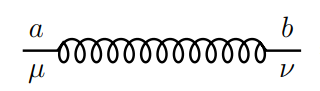
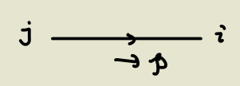
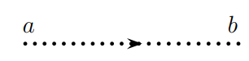
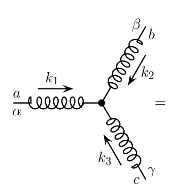
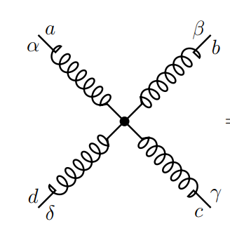
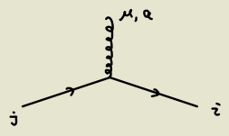
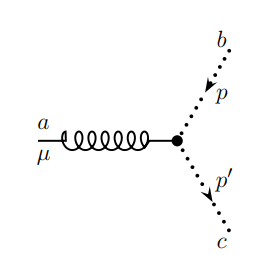

alias:: QCD

- # Strange Experimental Phenomena
  collapsed:: true
	- When hitting the proton with a electron, the scattering section of the electron behaves as if the proton is a hard particle. However, the proton is shattered into pieces rather than remaining as a whole.
	- Explanation
		- Obviously proton is a composite particle.
		- Strong interaction have [[Asymptotic Freedom]], that is, the coupling constant tends to zero as the momenta tends to infinity.
			- It is the opposite case for [[QED]].
		- Therefore, the electromagnetic interaction is 'hard' while the strong interaction is 'small'.
- # Setup
  collapsed:: true
	- collapsed:: true
	  $$
	  \mathcal{L}=\bar{\psi}(i \not D-m) \psi-\frac{1}{4}\left(F_{\mu \nu}^i\right)^2
	  $$
		- Explicitly,
		  $$\begin{aligned}
		  \mathcal{L} & =-\frac{1}{4}\left( F_{\mu \nu }^{a}\right)^{2} -\frac{1}{2\xi }\left( \partial ^{\mu } A_{\mu }^{a}\right)^{2} +\left( \partial ^{\mu }\overline{c^{a}}\right)\left( \delta ^{ac} \partial _{\mu } +gf^{abc} A_{\mu }^{b}\right) c^{c}\\
		   & +\overline{\psi }_{i}\left( \delta _{ij} i\not{\partial } + g\not{A}^{a} T_{ij}^{a} -m\delta _{ij}\right) \psi _{j}
		  \end{aligned}$$
			- The terms containing $g$ would be regarded as interactions.
			- The terms without $g$ are just decoupled fermions and gluons (similar to photons).
		- $$
		  F_{\mu \nu}^a=\partial_\mu A_\nu{ }^a-\partial_\nu A_\mu^a+g f^{a b c} A_\mu^b A_\nu^c
		  $$
		- Still a gauge theory for Fermions.
	- The gauge group is $SU(3)$.
	  collapsed:: true
		- Q: What's the difference between $ab$ and $ij$ indices?
		- Each $T^a$ is an element of the Lie algebra, i.e. $N \times N$ matrix.
		  Therefore $i,j$ are the **matrix indices**.
			- Each $i$ corresponds to a fermion specie, i.e. a component in the $N$-dimensional vector.
		- On the other hand, the Lie algebra is a vector space, which has a basis.
		  Therefore $a,b$ labels the **basis**.
			- Each $a$ corresponds to a gluon specie, i.e. a generator that 'glue' different fermions (different components of the $N$-dimensional vector) together.
	- ## [[Feynman rules]]
		- Propagators
			- Gluon
				- {:height 80, :width 239}
				- collapsed:: true
				  $$
				  \frac{-i \delta^{a b}}{k^2+i \varepsilon}\left(g^{\mu \nu}+(\xi-1) \frac{k^\mu k^\nu}{k^2+i \varepsilon}\right)
				  $$
					- Just like photon and different generators ($ab$ indices) cannot mix
			- Fermion (quark) propagator
			  collapsed:: true
				- {:height 96, :width 245}
				- collapsed:: true
				  $$
				  \frac{i (\not p +m)\delta^{i j}}{p^2-m^2+i \varepsilon}
				  $$
					- Just fermions and different flavors ($ij$ indices) cannot mix.
			- Ghost propagator
			  collapsed:: true
				- 
				- collapsed:: true
				  $$
				  \frac{i \delta^{a b}}{k^2+i \varepsilon}
				  $$
					- Similar to a massless (complex) scalar field and different generators cannot mix.
				-
		- Vertices
			- The 3-gluon and 4-gluon vertices both result from $g f^{abc} A^b_\mu A^c_\nu$ in $F_{\mu \nu}$.
			- Three-gluon
			  collapsed:: true
				- {:height 266, :width 225}
				- $$
				  -g f^{a b c}\left[g^{\alpha \beta}\left(k_1-k_2\right)^\gamma+g^{\beta \gamma}\left(k_2-k_3\right)^\alpha+g^{\gamma \alpha}\left(k_3-k_1\right)^\beta\right]
				  $$
			- Four-gluon
			  collapsed:: true
				- {:height 203, :width 192}
				- $$
				  -i g^2\left[\begin{array}{r}
				  f^{a b e} f^{c d e}\left(g^{\alpha \gamma} g^{\beta \delta}-g^{\alpha \delta} g^{\beta \gamma}\right) \\
				  +f^{a c e} f^{b d e}\left(g^{\alpha \beta} g^{\gamma \delta}-g^{\alpha \delta} g^{\gamma \beta}\right) \\
				  +f^{a d e} f^{b c e}\left(g^{\alpha \beta} g^{\delta \gamma}-g^{\alpha \gamma} g^{\delta \beta}\right)
				  \end{array}\right]
				  $$
			- Fermion-gluon interaction
			  collapsed:: true
				- {:height 130, :width 187}
				- $$
				  i g \gamma^\mu T_{i j}^q
				  $$
			- Gluon-ghost interaction
			  collapsed:: true
				- {:height 183, :width 167}
				- $$
				  g f^{a b c} p^{\prime \mu}
				  $$
					- Note that it only contains the momentum of the outgoing ghost,
-
-