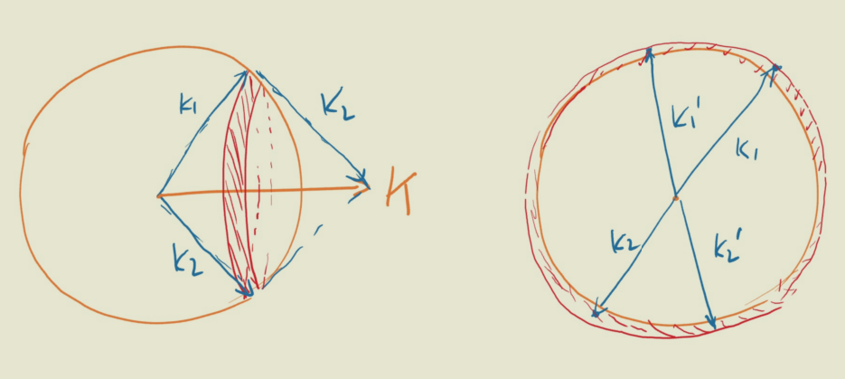

alias:: Superconductor

- # BCS Theory
	- Summary #card
		- Phonons intermediate an **attractive** interaction between electron.
		- Pairs of electrons with opposite momenta near the Fermi surface form cooper pairs.
		- Use $\langle c_{k,\sigma_1}c_{-k,\sigma_2} \rangle$ as the order parameter to perform the mean-field approximation.
			- It is fairly unusual, since the operator breaks particle number conservation as well as the $U(1)$ symmetry ($c_k \to e^{i\theta}c_k$).
				- Normally we would use something like $\langle c^\dagger c \rangle$.
			- Also we could use s-wave and p-wave to simplify the form of $H_{MF}$.
		- The following is pure routine:
		  Use the Bogoliubov transformation to diagonalize and find the spectrum;
		  Plug into the self-consistency equation to find the value of the order parameter.
			- The unusual thing is that particle modes and hole modes **mix** in the Bogoliubov transformation.
		- Formulae
			- $$H_{MF}=\sum _{k\alpha } (\varepsilon _{k} -\mu )c_{k\alpha }^{\dagger } c_{k\alpha }+\Delta \sum _{k} c_{-k,\downarrow }^{\dagger } c_{k,\uparrow }^{\dagger } +\Delta ^{*}\sum _{k} c_{k,\uparrow } c_{-k,\downarrow }$$
				- collapsed:: true
				  $$\Delta =-2V\sum _{k} \langle c_{k\uparrow } c_{-k\downarrow } \rangle $$
					- Note that due to the broken $U(1)$ symmetry, we can always take $\Delta$ to be real.
			- $$\begin{aligned}
			  \left(\begin{array}{ c }
			  \gamma _{k\uparrow }\\
			  \gamma _{-k\downarrow }^{\dagger }
			  \end{array}\right) & =\left(\begin{array}{ c c }
			  u_{k} & -v_{k}\\
			  v_{k} & u_{k}
			  \end{array}\right)\left(\begin{array}{ c }
			  c_{k\uparrow }\\
			  c_{-k\downarrow }^{\dagger }
			  \end{array}\right)\\
			  u_{k}^{2} +v_{k}^{2} & =1
			  \end{aligned}$$
			- $$\begin{aligned}
			  \lambda  & =\pm \sqrt{\xi {_{k}}^{2} +|\Delta |^{2}}, \quad E_k := \sqrt{\xi_{k}^{2} + |\Delta |^{2}} \\
			  u_{k} & =\sqrt{\frac{E_{k} +\xi _{k}}{2E_{k}}}\\
			  v_{k} & =\sqrt{\frac{E_{k} -\xi _{k}}{2E_{k}}}
			  \end{aligned}$$
	- # Effective Interaction
	  collapsed:: true
		- Result
		  collapsed:: true
			- $$H=\sum _{k\alpha }( \varepsilon _{k} -\mu ) c_{k\alpha }^{\dagger } c_{k\alpha } -V\sum _{kk'q}\sum _{\alpha \beta } c_{k+q,\alpha }^{\dagger } c_{k^{\prime } -q,\beta }^{\dagger } c_{k^{\prime } \beta } c_{k\alpha }$$
		- Start point
		  collapsed:: true
			- collapsed:: true
			  $$
			  H^{(2)} =\frac{1}{N}\sum _{kk^{\prime } q}| M_{q}| ^{2}\frac{-\omega _{q}}{\omega _{q}^{2} -( \epsilon _{k} -\epsilon _{k+q})^{2}} c_{k'+q}^{\dagger } c_{k^{\prime } -q}^{\dagger } c_{k^{\prime }} c_{k}
			  $$
				- Note that the strength is negative, so it is an **attractive** interaction!
				- See ((6454f1b7-ff0b-480d-8fa3-7795a4bcbc51)) for reference.
				  collapsed:: true
					- In short, this is the sum of two scattering processes (via a virtual phonon)
		- Approximations
		  collapsed:: true
			- All electron momenta ($k,k',k+q,k'-q$) must be on the Fermi surface.
			- $k+k'=0$
			  collapsed:: true
				- This is the dominant part of the scattering.
				- 
				  collapsed:: true
					- $k+k' \neq 0$ is illustrated by the first picture. The allowed region is only a narrow belt of the Fermi surface.
					- However, when $k+k'=0$, the whole Fermi surface is allowed!
			- Ignore the frequency dependence of the interaction strength
			  collapsed:: true
				- $$V(\vec{q} ,\omega )=\begin{cases}
				  -V_{0} , & \omega < \omega _{D}\\
				  0, & \omega  >\omega _{D}
				  \end{cases}$$
				- This is a crude approximation, but enough for our toy model to work!
	- # Mean-Field Approximation
	  collapsed:: true
		- > The most important question: What should be the order parameter?
		  The calculation is pure routine.
		- ## Order parameter
		  collapsed:: true
			- $$\Delta(k):=\langle c_{k,\alpha} c_{-k,\beta}\rangle$$
			- $\alpha,\beta$ are spin indices.
			- It corresponds to Cooper pairs!
		- ## Singlet (s-wave) and triplet (p-wave) pairing
		  collapsed:: true
			- Start point: The system should have spin-rotation invariance.
			- A pair of spin 1/2 particles would be a direct sum of two representations of $SU(2)$, namely the spin-0 part (singlet) and the spin-1 part (triplet)
			  collapsed:: true
				- Singlet:
				  collapsed:: true
				  $$\langle c_{k,\alpha} c_{-k,\beta}\rangle \propto \varepsilon_{\alpha \beta}$$
					- Proposition. $\Delta(k)=\Delta(-k)$
				- Triplet:
				  collapsed:: true
				  $$\langle c_{k,\alpha} c_{-k,\beta}\rangle \propto \vec u(k) \cdot \vec \sigma_{\alpha \beta}$$
					-
		- We shall only examine s-wave pairing here, i.e.
		  $$\langle c_{k\alpha } c_{k'\beta }\rangle \varpropto \delta _{k+k',0} \epsilon _{\alpha \beta }$$
		- ## Mean-Field Hamiltonian
		  collapsed:: true
			- Result
			  collapsed:: true
				- collapsed:: true
				  $$H_V=\Delta \sum _{k} c_{-k,\downarrow }^{\dagger } c_{k,\uparrow }^{\dagger } +\Delta ^{*}\sum _{k} c_{k,\uparrow } c_{-k,\downarrow }$$
					- collapsed:: true
					  $$\Delta =-2V\sum _{k} \langle c_{k\uparrow } c_{-k\downarrow } \rangle $$
						- Note that due to the broken $U(1)$ symmetry, we can always take $\Delta$ to be real.
					- $$H_{MF} =\sum _{k\alpha } (\varepsilon _{k} -\mu )c_{k\alpha }^{\dagger } c_{k\alpha } +H_{V}$$
					  Define $\xi_k=\varepsilon _{k} -\mu$ for convenience.
			- Derivation
			  collapsed:: true
				- \begin{aligned}
				  
				  H_{V} & =-V\sum _{kk'q}\sum _{\alpha \beta }\left\{c_{k^{\prime } -q,\beta }^{\dagger } c_{k+q,\alpha }^{\dagger }< c_{k\alpha } c_{k^{\prime } \beta }> +\left< c_{k^{\prime } -q,\beta }^{\dagger } c_{k+q,\alpha }^{\dagger }\right> c_{k\alpha } c_{k^{\prime } \beta }\right\}\\
				  \text{Observe} & =-V\sum _{kk'q}\sum _{\alpha \beta }\left\{c_{k^{\prime } -q,\beta }^{\dagger } c_{k+q,\alpha }^{\dagger }< c_{k\alpha } c_{k^{\prime } \beta }> +h.c.\right\}\\
				  \text{s-wave} & =-V\sum _{kk'q}\sum _{\alpha \beta }\left\{c_{k^{\prime } -q,\beta }^{\dagger } c_{k+q,\alpha }^{\dagger }< c_{k\alpha } c_{k^{\prime } \beta }> \delta _{k+k',0} \epsilon _{\beta \alpha } +h.c.\right\}\\
				   & =-V\sum _{kq}\sum _{\alpha }\left\{c_{-k -q,-\alpha }^{\dagger } c_{k+q,\alpha }^{\dagger }< c_{k\alpha } c_{-k,-\alpha }> +h.c.\right\}\\
				  \text{Change summation
				  - variables} & =-V\sum _{k\tilde{k}}\sum _{\alpha }\left\{c_{-\tilde{k} ,-\alpha }^{\dagger } c_{\tilde{k} ,\alpha }^{\dagger }< c_{k\alpha } c_{-k,-\alpha }> +h.c.\right\}\\
				  \text{Sum} \ \alpha \ \text{Explicitly} & =-V\sum _{k\tilde{k}}\left\{c_{-\tilde{k} ,\downarrow }^{\dagger } c_{\tilde{k} ,\uparrow }^{\dagger }< c_{k\uparrow } c_{-k\downarrow }> +c_{-\tilde{k} ,\uparrow }^{\dagger } c_{\tilde{k} ,\downarrow }^{\dagger }< c_{k\downarrow } c_{-k,\uparrow }> +h.c.\right\}\\
				  \text{Use anti-commutativity
				  - and change variables} & =-2V\sum _{k\tilde{k}}\left\{c_{-\tilde{k} ,\downarrow }^{\dagger } c_{\tilde{k} ,\uparrow }^{\dagger }< c_{k\uparrow } c_{-k\downarrow }> +h.c.\right\}\\
				  \text{Independent
				  - summations} & =-2V\left[\sum _{k}< c_{k\uparrow } c_{-k\downarrow }> \right]\sum _{\tilde{k}}\left\{c_{-\tilde{k} ,\downarrow }^{\dagger } c_{\tilde{k} ,\uparrow }^{\dagger } +h.c.\right\}
				  \end{aligned}
			-
		- ## Bogoliubov Transformation and Spectrum
		  collapsed:: true
			- Result
				- $$\begin{aligned}
				  \left(\begin{array}{ c }
				  \gamma _{k\uparrow }\\
				  \gamma _{-k\downarrow }^{\dagger }
				  \end{array}\right) & =\left(\begin{array}{ c c }
				  u_{k} & -v_{k}\\
				  v_{k} & u_{k}
				  \end{array}\right)\left(\begin{array}{ c }
				  c_{k\uparrow }\\
				  c_{-k\downarrow }^{\dagger }
				  \end{array}\right)\\
				  u_{k}^{2} +v_{k}^{2} & =1
				  \end{aligned}$$
				- $$\begin{aligned}
				  \lambda  & =\pm \sqrt{\xi {_{k}}^{2} +|\Delta |^{2}}\\
				  u_{k} & =\sqrt{\frac{E_{k} +\xi _{k}}{2E_{k}}}\\
				  v_{k} & =\sqrt{\frac{E_{k} -\xi _{k}}{2E_{k}}}
				  \end{aligned}$$
				-
			- Rewrite the Hamiltonian by matrices:
				- $$H_{MF} =\sum _{\xi }\left( c_{k\uparrow }^{\dagger } ,c_{-k\downarrow }\right)\left(\begin{array}{ c c }
				  \xi _{k} & -\Delta \\
				  -\Delta  & -\xi _{k}
				  \end{array}\right)\left(\begin{array}{ c }
				  c_{k\uparrow }\\
				  c_{-k\downarrow }^{\dagger }
				  \end{array}\right)$$
				- Note that the matrix is real and symmetric, so we can diagonalize it by an **orthogonal** matrix, which means the inverse is just the transpose.
				-
	- # Self-Consistency and $T_c$
		- Summary #card
		  card-last-interval:: 31.26
		  card-repeats:: 1
		  card-ease-factor:: 2.6
		  card-next-schedule:: 2023-06-26T06:24:20.011Z
		  card-last-reviewed:: 2023-05-26T00:24:20.011Z
		  card-last-score:: 5
			- Change to the Bogoliubov representation (where the Hamiltonian is diagonalized).
			- Start point:
			  $$\Delta :=-2V\sum _{k} \langle c_{k\uparrow } c_{-k\downarrow } \rangle \overset{!}{=} \Delta $$
			- Result:
			  $$
			  1  =V\sum _{k}\frac{1}{2E_{k}}\frac{e^{\beta E_{k}} -1}{e^{\beta E_{k}} +1}
			  $$
			- To obtain different limits, the common strategy is to change the summation into an integration (with a weight of density of states) and approximate by $N(\omega)=N_0$.
			- To obtain $T_c$, we consider $\lim_{\Delta \to 0^+}$.
		- Derivation
		  collapsed:: true
			- First rewrite the Hamiltonian as
			  $$\begin{aligned}
			  H_{MF} & =\sum _{k} E_{k}\left( \gamma _{k\uparrow }^{\dagger } \gamma _{k\uparrow } +\gamma _{k\downarrow }^{\dagger } \gamma _{k\downarrow }\right)
			  \end{aligned}$$
			- By Fermi-Dirac distribution, 
			  $$\left< \gamma _{k\uparrow }^{\dagger } \gamma _{k\uparrow }\right> =\frac{1}{e^{\beta E_{k}} +1} , \langle \gamma \gamma \rangle =\left< \gamma ^{\dagger } \gamma ^{\dagger }\right> =0$$
			- Plug into the consistency equation:
			  $$\begin{aligned}
			  \Delta  & =-V\sum _{k}< c_{k\uparrow } c_{-k\downarrow }> \\
			   & =-V\sum _{k}\left< \left( u_{k} \gamma _{k\uparrow } +v_{k} \gamma _{-k\downarrow }^{\dagger }\right)\left( -v_{k} \gamma _{k\uparrow }^{\dagger } +u_{k} \gamma _{-k\downarrow }\right)\right> \\
			   & =-V\sum _{k} u_{k} v_{k}\left\{\left< \gamma _{k\uparrow }^{\dagger } \gamma _{k\uparrow } +\gamma _{-k\downarrow }^{\dagger } \gamma _{-k\downarrow }\right> -1\right\}\\
			   & =-V\sum _{k}\frac{\Delta }{2E_{k}}\left\{\frac{2}{e^{\beta E_{k}} +1} -1\right\}\\
			   & =\Delta V\sum _{k}\frac{1}{2E_{k}}\frac{e^{\beta E_{k}} -1}{e^{\beta E_{k}} +1}
			  \end{aligned}$$
			- Therefore we obtain
			  $$
			  1  =V\sum _{k}\frac{1}{2E_{k}}\frac{e^{\beta E_{k}} -1}{e^{\beta E_{k}} +1}
			  $$
		- Zero temperature
			- Approximations
				- $N(\varepsilon)=N_0$, where $\varepsilon=E-E_F$.
				- $\omega_D \gg \Delta$
			- $$\begin{aligned}
			  1 & =V\sum _{k}\frac{1}{2E_{k}}\\
			   & =V\sum _{k}\frac{1}{2\sqrt{\xi {_{k}}^{2} +|\Delta |^{2}}}\\
			   & =V\int _{-\omega _{D}}^{\omega _{D}} d\varepsilon \ N( \varepsilon )\frac{1}{2\sqrt{\varepsilon ^{2} +|\Delta |^{2}}}\\
			   & \approx N_{0} V\int _{-\omega _{D}}^{\omega _{D}} d\varepsilon \ \frac{1}{2\sqrt{\varepsilon ^{2} +|\Delta |^{2}}}\\
			   & =N_{0} V\sinh^{-1}\left(\frac{\omega _{D}}{\Delta }\right)
			  \end{aligned}$$
			- Plug in $\omega_D \gg \Delta$:
			  $$\begin{aligned}
			  \sinh^{-1}\left(\frac{\omega _{D}}{\Delta }\right) & \approx \ln\left(\frac{2\omega _{D}}{\Delta }\right)\\
			  \Delta  & =\omega _{D}\exp\left\{-\frac{1}{N_{0} V}\right\}
			  \end{aligned}$$
			- Note that the dependence is highly sensitive on the **interaction strength** $V$ (not volume!).
		- Critical temperature
			- Idea #card
				- Critical point -> no nonzero solution for $\Delta$.
				- The strategy is to take $\lim_{\Delta \to 0^+}$ and solve for $\beta$.
			- Result
				- \begin{aligned}
				  k_{B} T_{c} & =\omega _{D}\exp\left\{-\frac{1}{N_{0} V}\right\}
				  \end{aligned}
			- \begin{aligned}
			  1 & =V\sum _{k}\frac{1}{2|\xi _{k} |}\frac{e^{\beta |\xi _{k} |} -1}{e^{\beta |\xi _{k} |} +1}\\
			   & =V\int _{-\omega _{D}}^{\omega _{D}} d\varepsilon \ N( \varepsilon )\frac{1}{2|\varepsilon |}\frac{e^{\beta |\varepsilon |} -1}{e^{\beta |\varepsilon |} +1}\\
			   & \approx N_{0} V\int _{0}^{\omega _{D}} d\varepsilon \frac{1}{|\varepsilon |} \ \frac{e^{\beta \varepsilon } -1}{e^{\beta \varepsilon } +1}
			  \end{aligned}
			- When $\beta \varepsilon \gg 1$: The integral can be approximated as $$\ln \varepsilon $$.
			  However the lower range is 0, so we should add a cutoff $kT_c$.
			- The consistency equation becomes
			  $$1=N_0 V \ln \frac {\omega_D} {kT_c}$$
			- Therefore we obtain the result:
			  \begin{aligned}
			  k_{B} T_{c} & =\omega _{D}\exp\left\{-\frac{1}{N_{0} V}\right\}
			  \end{aligned}
				- The precise expression is
				  $$\begin{aligned}
				  k_{B} T_{c} & \approx 1.13\omega _{D}\exp\left\{-\frac{1}{N_{0} V}\right\}
				  \end{aligned}$$
				  but the prefactor isn't so important, since we can't obtain $V$ very precisely.
				- However, we can compare $T_c$ and $\Delta$ to obtain a nontrivial relation -- and this can be a signature for BCS superconductors!