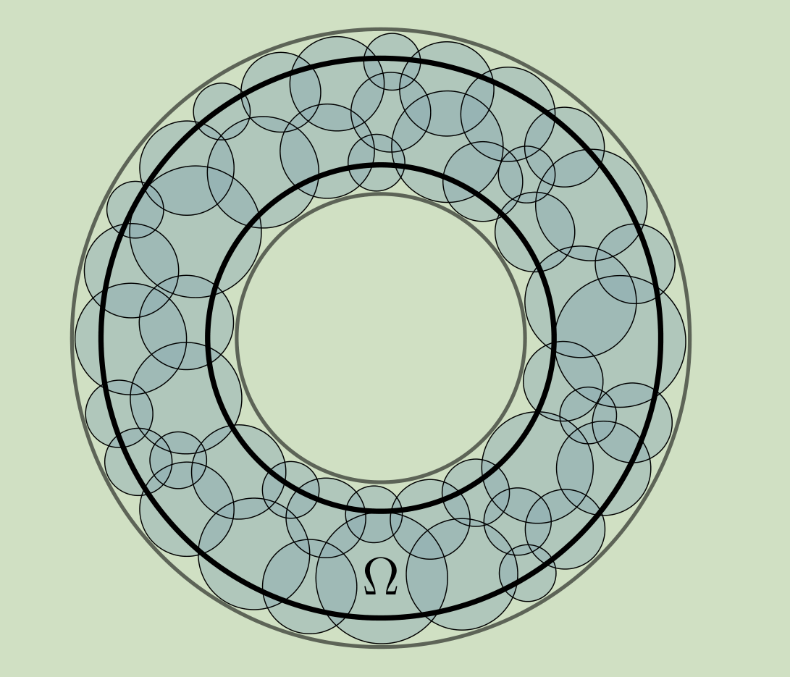
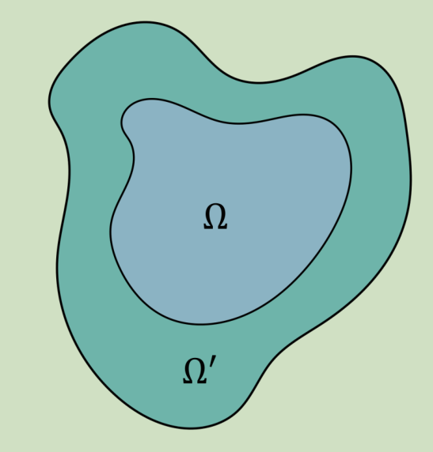

# Intuitions
collapsed:: true
	-
	-
- Notations
	- We only consider lattice systems here. The global Hilbert space $\mathcal H$ has is a tensor product of Hilbert spaces on each site, $V = \otimes_i V_i$.
	- $A$ is a subregion of the lattice
	- $O(A,G)$ is the algebra of symmetric operators with only support on $A$
		- $G$ is the symmetry group (with a specified unitary representation $T: G \to GL(V)$ on the Hilbert space).
			- For example, it can be the Ising symmetry group generated by
			  $$g = \prod_i Z_i$$
		- By symmetric operators, we mean operators commuting with every element in $G$
		- If $G$ is the trivial group, we abbreviate $O(A,G)$ as $O(A)$.
	- $O_f(A,G)$ is the algebra of fermionic symmetric operators with only support on $A$
		- Fermionic operators are generated by products of **even** numbers of creation and annihilation operators
			- For example, an operator $c_1 c_2 c_3 c^\dagger_5 + c_1 c_3$ has nontrivial support on the region $\{1,2,3,5\}$, with each number labeling a site
		- If $G$ is the trivial group, we abbreviate $O_f(A,G)$ as $O_f(A)$.
- # Poor man's operator algebra
	- #+BEGIN_TIP
	  Things here not only hold for lattice systems, but also for field theories (with slight adjustments).
	  #+END_TIP
	- Def. A quantum state (could be mixed!) is a map $\phi: O(A) \to \mathbb C$, satisfying some obvious properties.
		- Maps an operator to its expectation value
	- Theorem. For any state $\phi$, we can find a unique density operator $\rho_\phi$ such that
	  $$\forall K \in O_f(A), \quad \phi(K) = \operatorname{Tr}(\rho_\phi \cdot K)$$
	- Def. Trace of a quantum state
		- $$\operatorname{Tr}(\phi) := \phi(\mathbb I)$$
		  where $\mathbb I$ is the identity operator.
	-
	- Def. Partial trace of a quantum state
		- Suppose $B$ is a subregion of $A$. Then we have the inclusion map $i: O(B) \to O(A)$.
		- The partial trace $i^*$ is induced by $i$. Explicitly, it maps $\phi: O(A) \to \mathbb C$ to $\phi \circ i: O(B) \to \mathbb C$.
	-
	- In bosonic systems without symmetry, we know that the formulation of operator algebras is equivalent to density matrices.
	  background-color:: yellow
- # Prelude: Reduced density matrices in free-fermion systems
	- Ref. 0906.1663
	- Idea
		- First, we calculate all ground-state correlation functions with support only on region $A$
			- i.e. Expectation values of all operators in $O_f(A)$.
		- Then we try to find a density operator $\rho_A$ with support only on region $A$, which should reproduce the same expectation values for all operators in $O_f(A)$, i.e.
		  $$\forall K \in O_f(A), \quad \langle K \rangle = \operatorname{Tr}(\rho_A K)$$
	- It turned out we could find a unique $\rho_A$ in the form
	  $$
	  \rho_A=C \exp \left(-\sum_{i, j=1}^L h_{i, j} c_i^{\dagger} c_j\right)
	  $$
- # Why are fermions different from bosons?
	- Since we have Jordan-Wigner transformations, it seems that fermionic systems and bosonic systems could be mapped to each other.
	- The point is locality.
		- Fermionic systems and bosonic systems have different notions of locality.
			- By 'local' we mean 'having support on a bounded region'. But the notion of support is different.
			- For bosonic systems we resort to the tensor product structure of the Hilbert space.
			- For fermionic systems...
				- Allowed operators are linear combinations (and converging sums) of products of **even** numbers of creation and annihilation operators
					- Informally, allowed operators are 
					  $$K=\mathbb I + cc + c^\dagger c + c^\dagger c^\dagger + cccc + cccc^\dagger + ...$$
					  where we ignore the coefficients.
				- Each creation and annihilation operator is associated with a lattice site.
				  By 'having support on region $A$' we mean that some products contains some $c$ or $c^\dagger$, associated with a lattice site in $A$.
		- In dimensions $d \geq 2$, locality isn't preserved by JW transformation.
- # Info convex sets in terms of operator algebras
	- We only need to translate everything we know (merging techniques, isomorphism theorem, etc.) into the language of operator algebras.
- # Fermionic systems
	- Info convex sets should be easily defined for fermionic systems.
	- However, I expect that the results to be slightly different to the bosonic case because of fermion parity.
- # Nontrivial symmetry
	- I expect that when we consider $O(A,G)$ instead of $O(A)$, the effect is gauging the symmetry and information convex sets might become nontrivial.
	- ## Group representation's perspective
		- Consider the space $S \equiv V \otimes V^*$, which could be identified with the space of all linear operators.
			- Note that the set of density matrices is a subset (not a linear subspace) of $V \otimes V^*$.
		- The representation of $G$ on $S \equiv V \otimes V^*$ is $T \otimes T^*$, i.e. for a density matrix $\rho$
		  $$\rho \mapsto T(g) \rho T(g)^{\dagger}$$
			- $T \otimes T^*$ could be written as a sum of irreps,
			  $$T \otimes T^* = \bigoplus_i n_i \Gamma_i$$
		- If we require that all **operators** under consideration in are symmetric (commute with all symmetry elements), i.e. $T(g) K T(g)^{\dagger}=K$:
			- Essentially we are restricting to a linear subspace of $S$, which is a direct sum of trivial representations.
			  Denote this space as $S_G$.
		- If we require all **states** under consideration in are symmetric, i.e. $T(g) \rho T(g)^{\dagger}=\rho$:
			- Similarly, we are restricting to the direct sum of trivial representations.
			-
		- Proposition. Expectation values of symmetric operators fix a symmetric (mixed) state.
			- The whole Hilbert space is a direct sum of reps.
			- Since expectation values of general operators fix a general (mixed) state, restricting to a subspace doesn't make a difference.
	- Would the info convex set still be trivial even if we imposed the symmetry?
	  background-color:: red
		- Intuitively, there is a natural embedding $S_G \hookrightarrow S$.
		- However, the embedding forgets the symmetry structure!
	- ## Clues from Gauging
		- $Z_2$ is too special. I should investigate $Z_n$ for more general insights.
			- [[2012_Hung_Wan_String-Net Models with $Z_N$ Fusion Algebra]]
		- Ref. [[Levin-Gu Model]]
		- The notion of on-site symmetry (factorization of symmetry action) is important.
		- We should naturally restore some zero-flux condition.
	- ## Example: Trivial $Z_2$ SPT
		- Consider the Hamiltonian for the trivial $Z_2$ SPT
		  $$H_0 = - \sum_p \sigma^z_p$$
			- The symmetry group is $G=\{1,g\} \cong Z_2$, with $g=\prod_p \sigma^z_p$.
			- Obviously the ground state $|\psi\rangle$ is a product state.
		- ### TODOs
			- Definition. Pre-information convex set $\tilde \Sigma(\Omega)$ on a region $\Omega$
				- The ground state $|\psi\rangle$ is a map $O(\Omega) \to \mathbb C$, which is also a map $|\psi\rangle \langle\psi|: O(\Omega,G) \to \mathbb C$.
				- On each disk $b$ included in $\Omega$, we have a map ('symmetric' reduced density matrix) $|\psi\rangle \langle\psi|: O(b,G) \to \mathbb C$.
				- $\tilde \Sigma(\Omega)$ is the set of all states $\rho: O(\Omega) \to \mathbb C$ **locally indistinguishable** from $\psi$, which means $\rho$ gives rise to the same map $O(b,G) \to \mathbb C$ as $|\psi\rangle \langle\psi|$ on every disk $b$ contained in $\Omega$.
				- {:height 354, :width 356}
			- Step 1. Consider a disk-like region $A \cong D^2$. Calculate symmetric operator algebra $O(A,G)$
			- Step 2. Indistinguishable states on a disk
				- The ground state $|\psi\rangle$ is a map $O(A) \to \mathbb C$, which is also a map $|\psi\rangle \langle\psi|: O(A,G) \to \mathbb C$.
				- We want to know all such state $\rho: O(A) \to \mathbb C$, such that it gives rise to the same map $O(A,G) \to \mathbb C$ as $|\psi\rangle \langle\psi|$.
					- I'm not sure whether we should calculate **all** such $\rho$ or only **symmetric** $\rho$, i.e. those satisfying
					  background-color:: red
					  $$g \rho g^{-1} = \rho$$
			- Step 3. Locally indistinguishable states on an annulus $B$
				- We'd like to calculate $\tilde \Sigma(B)$.
				- Rephrase by the definition
					- The ground state $|\psi\rangle$ is a map $O(B) \to \mathbb C$, which is also a map $|\psi\rangle \langle\psi|: O(B,G) \to \mathbb C$.
					- On each disk $b$ included in the annulus $B$, we have a map ('symmetric' reduced density matrix) $|\psi\rangle \langle\psi|: O(b,G) \to \mathbb C$.
					- We want to know all such state $\rho: O(B) \to \mathbb C$, such that it gives rise to the same map $O(b,G) \to \mathbb C$ as $|\psi\rangle \langle\psi|$ on every disk $b$ contained in $B$.
						- I'm not sure whether we should calculate **all** such $\rho$ or only **symmetric** $\rho$, i.e. those satisfying
						  background-color:: red
						  $$g \rho g^{-1} = \rho$$
				- Argument: The set is one-element.
				  background-color:: red
					- From definition
						- On each disk, the symmetric operators fix the state to be a pure product state.
							- Each $\sigma_p^z$ is a symmetric operator. Also, we know that the expectation value of each $\sigma_z^p$ is 1.
						- Therefore, the merged state is also a pure product state.
					- It seems that as long as we can obtain a pure state on the disk, the merged ICS must be trivial.
					  background-color:: yellow
				- What if we somehow remove the symmetry generators from the algebra?
					- $\sigma^x$ and $\sigma^y$ must pop up in pairs, which is similar to the statement that anyons must appear in pairs.
					- However, is there a natural way to do so? Prohibit the 1-site elements?
					-
			- Step 4. Trace out the thin layer of boundary of $B$
				- Definition. Information convex set $\Sigma(\Omega)$ on a region $\Omega$
					- Denote a thickening of $\Omega$ as $\Omega'$, which means $\Omega'$ is 'growing' $\Omega$ out for a thin layer, without changing the topology.
						- {:height 286, :width 259}
					- $$\Sigma(\Omega):= \{\operatorname{Tr}_{\Omega'-\Omega} \rho \ \bigg|  \  \rho \in \tilde \Sigma(\Omega')\}$$
				- We want to know $\Sigma(B)$, which traces out boundary ambiguities.
					-
				-
		- #+BEGIN_TIP
		  For the ground state of toric code (with $G$ replaced by the trivial group), step 4 would reveal a simplex structure of $\Sigma(B)$, with each extreme point corresponding to an anyon type.
		  #+END_TIP
			-
		-