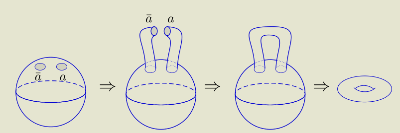
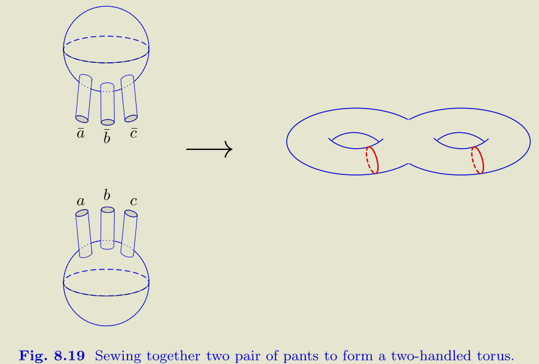

- [[References]]
	- D_Topological_Phase_1667264759596_0.pdf) 2018_Lan_A_Classification_of_(2+1)D_Topological_Phase
	- [[Simon's Topobook]]
	-  2022_Kong_Zhang_An invitation to topological orders and category
		- p62
- TODO Arrange it into a coherent story, rather than the scattered topics.
  :LOGBOOK:
  CLOCK: [2022-12-23 Fri 16:47:12]
  :END:
- Sources of refs
  collapsed:: true
	- ((63686777-c7eb-4f87-b83e-703f76ae06da))
	-
	- ((63686919-d1c8-41a8-b510-6f8b7290eb66)) Lots of refs about 3D toric code
	- This block is to be dissembled. #TODO
- # Thoughts and Problems
	- Metathoughts and central problems
	  collapsed:: true
		- ((63686458-bb43-4ca5-b0f2-e499f6154b6c))
		- Significance of Topo order #card
		  card-last-interval:: 10
		  card-repeats:: 2
		  card-ease-factor:: 2.7
		  card-next-schedule:: 2022-12-25T05:20:40.187Z
		  card-last-reviewed:: 2022-12-15T05:20:40.188Z
		  card-last-score:: 5
			- ((636864d8-05a7-440a-8fb4-0aa262aa340d))
			- ((63686518-f1bb-44e9-9fe3-a36d3e68b9c8))
			- ((63686663-a0be-4c76-a689-e4cf37982a71))
				- ((636866b4-a674-47ef-bc02-ec464e6209d0))
			-
		- What's the difference between the description by [[UMTC]] and [[2-category]]? #[[Open Problem]]
			- ((63aa62d4-a830-4de1-9845-879ed6ed65a1))
		- How to classify? Why [[Category]] gives a complete classification? #card
		  card-last-interval:: 10
		  card-repeats:: 2
		  card-ease-factor:: 2.22
		  card-next-schedule:: 2022-12-19T12:54:44.185Z
		  card-last-reviewed:: 2022-12-09T12:54:44.186Z
		  card-last-score:: 3
			- We've faced analogues problems before, eg. why linear algebra describes quantum mechanics.
			- But we already have the [[First Principle]] for topological orders, that is, underlying lattice models and quantum mechanics. Then we must prove, or at least argue, that the categorical way is equivalent to the old way.
			- Moreover, we shall demonstrate that the categorical way is better. Equivalently, why [[Set theory]] doesn't serve?
		-
	- Why we usually define the lattices by commuting pairs of projectors ($A_s,B_p$)?
		- Tentative: Topo orders are robust against local perturbations. So we may deform them in some ways; the form of commuting pairs are the simplest.
- # Definitions and topics
	- [[Topological skeleton]]
	- [[Stacking]]
	- [[Condensable algebra]]
	  card-last-score:: 5
	  card-repeats:: 1
	  card-next-schedule:: 2022-11-12T10:38:53.956Z
	  card-last-interval:: 10
	  card-ease-factor:: 2.6
	  card-last-reviewed:: 2022-11-02T10:38:53.958Z
	- [[Quantum Phase]]
	- [[Anomaly]]
	  collapsed:: true
		- Spatial fusion anomaly
		  collapsed:: true
			- The map ((636e0904-5e2d-47dc-a9ed-176adef844bd))
			  isn't an isomorphism.
			- ((636e0924-dfa2-40a2-a348-32df5e9a8646))
			  collapsed:: true
				- ((636e096d-3c08-4772-92f3-1cfd32b60dc9))
				-
	- [[Unique bulk principle]]
	- [[Lattice model]]
	  card-last-score:: 5
	  card-repeats:: 1
	  card-next-schedule:: 2022-11-23T04:09:57.924Z
	  card-last-interval:: 10
	  card-ease-factor:: 2.6
	  card-last-reviewed:: 2022-11-13T04:09:57.926Z
	- [[Topological excitation]]
	  id:: 636879d9-dfe3-4bdd-a078-587cc9c25350
	- [[Chiral central charge]]
	- Counting ground state degeneracy
	  collapsed:: true
		- General principle
		  collapsed:: true
			- On $S^2$, all anyons must fuse to vacuum, so $dim V=$ # Fusion paths to vacuum
			- Other surfaces can be obtained by [[Surgery]]. The principle is $a$ and $\bar a$ can be glued together.
			  collapsed:: true
				- 
				  collapsed:: true
					- Dim $V\left(T^2\right)=$ Number of particle types
				- 
				  collapsed:: true
					- Dim V{Two handled torus}=$\sum_{a b c} N_{a b c} N_{\bar{a} \bar{b} \bar{c}}$
	- ## Topo orders in low dimensions & Boundary and Domain Wall
	  collapsed:: true
		- ### 0D and 1D
		  collapsed:: true
			- Description of the [[Boundary]]
			  collapsed:: true
				- Boundaries of the [[Toric code]] #card
				  card-last-interval:: 24
				  card-repeats:: 2
				  card-ease-factor:: 2.7
				  card-next-schedule:: 2023-01-17T12:57:02.773Z
				  card-last-reviewed:: 2022-12-24T12:57:02.773Z
				  card-last-score:: 5
				  collapsed:: true
					- ((6376e089-fce4-4848-81c9-ba80dc22e8ff))
					  collapsed:: true
						- ((6376e0a2-267d-44b2-b4ce-07caab40cd56))
					- [[Smooth boundary]]
					  collapsed:: true
						- ((6376e003-91e9-4f72-b8b3-c3f649b36388))
						- ((6376e048-b064-4620-9051-da7a913415c6)) m can be annihilated by $$\sigma_x$$ on the boundary.
						-
						-
					- [[Rough boundary]]
					  collapsed:: true
						- ((6376e016-4480-4dcb-898f-460d62d7f0fb))
						- Similarly, simple excitations are 1 and M.
					- Do we lose information on the boundary, since e and 1 seems indistinguishable on the rough boundary? #card
					  card-last-interval:: 10
					  card-repeats:: 2
					  card-ease-factor:: 2.7
					  card-next-schedule:: 2022-12-18T02:06:43.018Z
					  card-last-reviewed:: 2022-12-08T02:06:43.019Z
					  card-last-score:: 5
					  collapsed:: true
						- NO.
						- We can use [[Braiding]] to reveal that the type of excitation exists in the bulk.
						  collapsed:: true
							- ((6376e2ef-953a-42f0-9245-45df8de79bf6))
							- ((6376e31a-a14e-46b3-b327-677c2cdfa16d))
						- Note that **there are no e present on the boundary**. We just used a string operator associated with e.
						  In other word, the existence of such nontrivial string operator reveals the type in the [[Bulk]].
					- ((637ad557-7f50-4769-bbd9-12670b94f740))
					  collapsed:: true
						- Somewhat analogous to 'inequivalent homotopies between two paths'.
			- Structures and properties
			  collapsed:: true
				- ((6376e3e8-d3ef-44b3-9d52-30e6d6c3f9eb))
				- [[Bulk-boundary relation]]
				  collapsed:: true
					- ((637ad78a-4267-428e-84b3-f93291247476))
			- 1D [[Domain Wall]]
			  collapsed:: true
				- Defs
				  collapsed:: true
					- [[Invertible]] domain walls
					  collapsed:: true
						- ((6396c8ae-1392-44c2-9548-289c962b426b))
						- $M \otimes_{\mathrm{D}} \mathrm{N}=\mathrm{C}_1, \quad \mathrm{~N} \boldsymbol{\otimes}_{\mathrm{C}} \mathrm{M}=\mathrm{D}_1$
						  collapsed:: true
							- Indeed, the inverse $\mathrm{N}$, if exists, must be the time-reversal $\overline{\mathrm{M}}$ by a general argument.
							- Quite strange. Another domain wall fuses D into C?
							  background-color:: red
				- [[Fusion]] of domain walls
				  collapsed:: true
					- ((6396c7da-7ad3-4b94-bec5-0391f39cd6ab))
					  collapsed:: true
						- If D is trivial this is just stacking. Otherwise, interesting things might happen.
						- ((6396c828-35e5-4c50-ac66-97596bf4c794)) $\mathcal{M} \otimes_{\mathcal{D}} \mathcal{N}$ only depends on the multi-fusion categories $\mathcal{M}, \mathcal{N}$, the braided fusion category $\mathcal{D}$ and the multi-fusion module structures of $\mathcal{M}, \mathcal{N}$ over $\mathcal{D}$.
						  collapsed:: true
							- In other words, it smooths out all details!
				- Move particle-like [[Topological excitation]] across the invertible domain wall #card
				  collapsed:: true
					- ((6396c9bd-f680-4a7d-b1e5-d9f8de7ae7ff))
					  collapsed:: true
						- The second step holds only when M is invertible.
					- Since we can also move anyons from C to D, $x \mapsto \phi(x)$ defines a **braided equivalence** $\phi: \mathcal{D} \rightarrow \mathcal{C}$.
					- Thus we have a **group homomorphism** from the group of braided autoequivalences of $\mathcal{C}$ (with composition) to the group of equivalence classes of invertible fusion $(\mathcal{C}, \mathcal{C})$-bimodules (domain walls) (with fusion).
					- ((6396cb2f-4bd5-4007-8a41-368b75419231))
					-
				- [[Folding trick]] #card
				  card-last-interval:: 10
				  card-repeats:: 2
				  card-ease-factor:: 2.7
				  card-next-schedule:: 2022-12-22T05:52:53.596Z
				  card-last-reviewed:: 2022-12-12T05:52:53.596Z
				  card-last-score:: 5
				  collapsed:: true
					- Exists in all dimensions.
					  collapsed:: true
						- ((637ad93c-b21f-446d-9d6c-54b25d5ddff7))
						- ((63a808b5-a9ee-4efa-92df-b58fc75e23d2))
					- Seems quite strange but interesting.
					- How can you fold a torus? Or just fold locally, not globally?
					- Intuitively, we have the following structures
					  collapsed:: true
						- Left [[bulk-to-boundary map]] $F: \mathcal{C} \rightarrow \mathcal{M}$ and the right one $G: \overline{\mathcal{D}} \rightarrow \mathcal{M}$. Note that D is a [[Time-reversed category]]
						- The total [[bulk-to-boundary map]] $F \boxtimes G: \mathcal{C} \boxtimes \overline{\mathcal{D}} \rightarrow \mathcal{M}$
				- [[Multi-fusion modules]]
				  collapsed:: true
					- Def #card
					  card-last-interval:: 10
					  card-repeats:: 1
					  card-ease-factor:: 2.36
					  card-next-schedule:: 2022-12-06T06:34:55.132Z
					  card-last-reviewed:: 2022-11-26T06:34:55.132Z
					  card-last-score:: 3
					  collapsed:: true
						- ((6396c42e-78cc-49aa-9862-fb85bef0c8d0)) Let $\mathcal{C}, \mathcal{D}$ be braided fusion categories.
						- (1) A (multi-)fusion left $\mathcal{C}$-module is a (multi-)fusion category $\mathcal{M}$ equipped with a braided functor $F: \mathcal{C} \rightarrow \mathfrak{Z}_1(\mathcal{M})$. It is called closed if $F$ is an equivalence.
						- (2) A (multi-)fusion right $\mathcal{D}$-module is a (multi-)fusion category $\mathcal{M}$ equipped with a braided functor $G: \overline{\mathcal{D}} \rightarrow \mathfrak{Z}_1(\mathcal{M})$. It is called closed if $G$ is an equivalence.
						- (3) A (multi-)fusion ( $(\mathcal{C}, \mathcal{D})$-bimodule is a (multi-)fusion category $\mathcal{M}$ equipped with braided functors $F: \mathcal{C} \rightarrow \mathfrak{Z}_1(\mathcal{M})$ and $G: \overline{\mathcal{D}} \rightarrow \mathfrak{Z}_1(\mathcal{M})$. It is called **closed** if $F \otimes G: \mathcal{C} \otimes \overline{\mathcal{D}} \rightarrow \mathfrak{Z}_1(\mathcal{M})$ is an **equivalence**.
						- A boundary with a bulk-to-boundary map as an action
				- Examples
				  collapsed:: true
					- The trivial domain wall
					  collapsed:: true
						- Obtained by restricting a topological order to a line
						- Topological skeleton: Same as $\mathcal C$
						- Fusion module: braided functor $\mathcal{C} \otimes \bar{C} \rightarrow \mathfrak Z_1(\mathcal{C})$,
						  collapsed:: true
							- This is quite interesting.
					- Anyon-permuting domain wall
					  collapsed:: true
						- For a braided autoequivalence $\phi: \mathcal{C} \rightarrow \mathcal{C}$, construct
						  collapsed:: true
						  $$
						  \mathcal{C} \otimes \overline{\mathcal{C}} \stackrel{\operatorname{id_{\mathcal C}} \otimes \phi}{\longrightarrow} \mathcal{C} \otimes \overline{\mathcal{C}} \rightarrow \mathfrak{Z}_1(\mathcal{C})
						  $$
							- Actually Deligne tensor products.
						- Intuitively, the anyons on the right side are permuted by $\phi$.
					- Gapped 1D domain walls in [[Toric code]]
					  collapsed:: true
						- ((6396cfd2-fc56-46df-9ec7-b97a3ddf7bd5))
						  collapsed:: true
							- A natural problem: How are we sure that they are the only examples? #Learning-TODO
						- Non-invertible ones
						  collapsed:: true
							- ((6396cfdd-67ea-4977-a4ab-4f34abe42fb9))
							  collapsed:: true
								- This notation suggests that the walls are viewed as fusions of the boundaries
								- Why noninvertible?
								  collapsed:: true
									- Intuitively, some bulk excitations can't be recovered if they come into the wall.
								-
							- We examine the first as an example.
							  collapsed:: true
								- Bulk-to-boundary map
								  collapsed:: true
									- The right one is $\mathbb{1}, m \mapsto \mathbb{1} \otimes \mathbb{1}, \quad e, f \mapsto \mathbb{1} \otimes E$.
									- Similar for the left one.
								- 4 excitations
								  collapsed:: true
									- $1\otimes 1, 1\otimes 1, E\otimes 1, E\otimes E$
							- Prop. The domain walls are indeed different. #card
							  collapsed:: true
							  card-last-interval:: 16
							  card-repeats:: 1
							  card-ease-factor:: 2.6
							  card-next-schedule:: 2023-01-01T05:44:14.413Z
							  card-last-reviewed:: 2022-12-16T05:44:14.414Z
							  card-last-score:: 5
								- First, what is 'different'?
								  collapsed:: true
									- There are no braided equivalences between them which preserves the bulk-to-boundary map.
								- In this case it is obvious; just examine the kernel of the bulk-to-boundary map.
						- Invertible ones #card
						  collapsed:: true
							- Trivial wall
							- Dislocation
							  collapsed:: true
								- ((6396d07b-023c-4673-b778-cc1e03d629db))
								  collapsed:: true
									- $B_p=\sigma_z^1 \sigma_z^2 \sigma_z^3 \sigma_x^4$ and $B_q=\sigma_z^5 \sigma_z^6 \sigma_z^7 \sigma_x^8$
									  collapsed:: true
										- Be careful that the last operator is $\sigma_x$.
										- This is reasonable to preserve commutativeness of operators.
									- Very interesting. But how do they come up with such construction?
								- 4 excitations
								  collapsed:: true
									- $\mathbb 1$, $X$ for $B_p=-1$, $Y$ for $B_q=-1$, $Z=X\otimes Y$
								- Fusion rules
								  collapsed:: true
									- $X \otimes X=Y \otimes Y=Z \otimes Z=\mathbb{1}, X \otimes Y=Y \otimes X=Z$
								- Bulk-to-wall map #card
								  collapsed:: true
									- Move m to the wall as usual. Become X on the same side.
									- Move e to the wall by $\sigma_z$. Become X **on the opposite side**.
								- Move particles across the domain wall #card
								  card-last-interval:: 12.82
								  card-repeats:: 1
								  card-ease-factor:: 2.6
								  card-next-schedule:: 2022-12-28T00:26:14.258Z
								  card-last-reviewed:: 2022-12-15T05:26:14.259Z
								  card-last-score:: 5
								  collapsed:: true
									- m is easily recovered by moving back to the same side.
									- We notice that $X$ becomes $e$ on the other side with an action of $\sigma_z^4$.
									  collapsed:: true
										- The interesting thing happens: **The anyon type flips when crossing the wall**!
										- ((6397d5cf-973b-4b7d-9ffd-56379c4d8b84))
							- Let's now stand a bit higher to look at the things.
							  collapsed:: true
								- These are the only two automorphisms of TC.
								  collapsed:: true
									- Somewhat analogous to [[Galois Theory]]? #Possibility
									  collapsed:: true
										- Can we define a fusion of the roots of a polynomial?
										- Seems that the fusion channels must be simple, since we don't have a natural definition of direct sums of numbers (except addition)
										- What if we view the extension as a linear  space spanned by the Irrs?
								- Non-invertible ones are the (noninvertible) endomorphisms.
						- [[Fusion rules]] of the domain walls #card
						  id:: 63a69765-9737-4e07-a68e-b2b4796aa6b2
						  collapsed:: true
							- ((6397d84a-bb0f-4e71-93b8-5077ea559ddb))
							- ((6397d8c8-261e-4b5e-8bb6-0dff22e5daec))
							  collapsed:: true
								- Intuitively it's very obvious: The exchange wall swaps rough and smooth.
								- What does the subscript of the deligne tensor mean? #card
								  collapsed:: true
									- A wall must have two sides. Here one side is vacuum and the other side is $\mathcal {TC}$.
									  collapsed:: true
										- The subscript denotes which **side** the wall fuses.
							- ((6397d8cf-5735-4cb5-a000-e3edcf67c3a6))
							  collapsed:: true
								- Any excitation can be annihilated either on the smooth boundary or the rough one.
							- More study on the double-smooth case
							  id:: 63a6b241-e48e-4d46-bd0f-1c3dd3bd9357
							  collapsed:: true
								- GSD=2. We may label the ground states by the eigenvalues of the X operators.
								  collapsed:: true
									- The trivial topological excitation $\mathbb{1}$ can be decomposed as the direct sum of simple ones $\mathbb{1}=\mathbb{1}_{+} \oplus \mathbb{1}_{-}$. where $X$ acts on $\mathbb{1}_{\pm}$as $\pm 1$.
								- [[Fusion rules]] #card
								  collapsed:: true
									- collapsed:: true
									  $$
									  \mathbb{1}_{\pm} \otimes \mathbb{1}_{\pm}=\mathbb{1}_{\pm} \text { 
									   and  } \mathbb{1}_{\pm} \otimes \mathbb{1}_{\mp}=0
									  $$
										- The latter equation means it is **physically forbidden**, because the eigenvalues of different X should be equal.
									- However, things are different when there are E particles present.
									  collapsed:: true
										- The eigenvalue of X would be flipped if it is moved across E.
										- ((63a6b38c-8315-4a50-85e6-4e2e8ac0e915))
										  collapsed:: true
											- $E_{+-}$ denotes '+ above, - below'
											-
								- It may be realized in 1D quantum [[Ising model]] without transverse field.
								  collapsed:: true
									- 2 ground states -> Up or down
									- Domain wall -> Spin flip, can't be created by  local operators
								- ((63a6b519-2881-4f66-be9e-c6dd8145efa2)) #Problem
								  collapsed:: true
									- There are 4 excitations in the double-smooth case, whereas only 2 in the direct sum of trivial 1D?
							- ((63a6b6ef-ebc7-4c73-877f-3d033dd3a732)) #Learning-TODO
							  collapsed:: true
								- Exercise.
							- ((63a6b6c7-8e25-47fa-9cbd-61623e55b44c)) #Learning-TODO
							  collapsed:: true
								- As an exercise.
				- [[Witt Equivalence]]
				-
			- [[Bulk-boundary relation]] in 1D
			  collapsed:: true
				- Intuition
				  collapsed:: true
					- ((63a7ff4b-4913-4400-89a3-fdac0537fa89))
					- The topo skeleton of $P$ is a multi-fusion category $\mathcal{P}$ and the category $\mathcal{X}$ of 0D boundaries of $P$ (i.e., the category of 0D topological orders living on the boundary of $P$ ) is finite semisimple.
					  id:: 63a7ff0a-d38d-4121-979f-efdc8919e726
					- A bulk excitation $a$ may be moved to the boundary, then the boundary becomes $a \odot x$. This defines a functor.
					  collapsed:: true
						- There should also be some consistency relations.
						- ( a fuse b ) move x = a move (b move x)
						- Identity -> Identity
				- Defs
				  collapsed:: true
					- Left P-module
					  collapsed:: true
						- ((63a7ffd1-db46-4cb3-83b4-553175d07b52))
						  collapsed:: true
							- Consistency
							  collapsed:: true
								- ((63a7ffe7-d2d6-48da-9e41-c790aea0b12d))
								  collapsed:: true
									- [[Pentagon Identity]] -> Move or fuse
									  collapsed:: true
										-
									- Triangle -> Identities
					- $\mathfrak Z_0(\chi)$
					  collapsed:: true
						- The category of C-linear functors from $\chi$ to itself.
				- ((63a8011a-825b-496e-9d97-12f9b9079ca2))
				- ((63a806b7-b4d8-4054-ab83-7af491bf5fb4)) (Boundary-bulk relation in 1D ). Suppose $\mathrm{P}$ is an anomaly-free 1D topological order. The category of 0D boundaries of $P$ is denoted by $\chi$.
				  collapsed:: true
				  (a) Moving bulk topological defects to boundaries induces a left $\mathcal{P}$-module structure on $\chi$.
				  (b) The monoidal functor $\mathcal{P} \rightarrow \mathfrak{Z}_0(\mathcal{X})$ induced by the module action is an equivalence.
					- Compare to the 2D case, central -> P-module structure, Z1 -> Z0.
					- But it is fundamentally different; no braiding structure here, only some fusions.
					- So would things be even more different on higher dimensions? Other strange structures to correspond? #[[Open Problem]]
					- Example. $\left(1_1\right)^{\oplus n}$ #Learning-TODO
					  collapsed:: true
						- Calculate the topo skeleton by bulk-boundary relation. Check it is consistent with 2D bulk-boundary relations (what's the bulk?).
						- Ref. ((63a80823-6531-4c07-8b1c-ab12e22095f7))
			- Application: Structure of [[Multi-Fusion Categories]]
			  collapsed:: true
				- Setting
				  collapsed:: true
					- 1D topo order P, GSD=n
					- $Bulk(P)$ is stable.
				- Physical intuition: Domain walls, topo sectors #card
				  collapsed:: true
					- Different ground states can't be smoothly connected
					  collapsed:: true
						- $\mathbb{1}_i \otimes \mathbb{1}_i=\mathbb{1}_i$ and $\mathbb{1}_i \otimes \mathbb{1}_j=0$ for $i \neq j$.
					- 0D [[Domain Wall]] between the same $P_i$ <-> 0D excitations
					  collapsed:: true
						- Denote the cat by $\mathcal{P}_{ii}$
					- 0D [[Domain Wall]] between different sectors can be selected out by fusing with identities in the sectors
					  collapsed:: true
						- ((63a962ae-57d2-41aa-9dbb-59ddc69a8aaf))
					- The perturbation can split the ground states into different sectors. However, the perturbation doesn't affect the bulk, so the sectors share the same bulk.
					  collapsed:: true
						- The [[Bulk-boundary relation]] implies $\mathfrak{Z}_1\left(\mathcal{P}_{i i}\right) \simeq \mathfrak{Z}_1(\mathcal{P})$
						- By the theorems, every $\mathcal{P}_{i i}$ is Morita equivalent to $\mathcal{P}$.
						- Consequently , $\mathcal{P}_{i j}$ is an invertible $\left(\mathcal{P}_{i i}, \mathcal{P}_{i j}\right)$-bimodule (Modules between Morita equivalent cats).
				- Summarized in ((63a963b9-9708-46a6-8806-a5486bd70ea2))
				- Example
				  collapsed:: true
					- Toric code, ((63a6b241-e48e-4d46-bd0f-1c3dd3bd9357))
					  collapsed:: true
						- GSD=2, correspond to 2 topological sectors (of X strings)
			- 0D [[Domain Wall]]
			  collapsed:: true
				- ((63a7fd8a-f025-435b-bc0a-ed93502e42c7))
				- ((63a7fde1-4b10-4a4a-b0fe-3654087f9194))
				  collapsed:: true
					- Anomaly-free 0D topo orders are simply quantum mechanic systems because there are no thermo limits.
					  collapsed:: true
						- The only nontrivial thing is the ground space. So the category of them is $Vec$.
					- Anomalous ones are more interesting, because they are excitations in some higher-dim topo orders.
				- Example of [[Toric code]]
				  collapsed:: true
					- ((63a944d2-6eab-4275-9cef-b5c2c2fbbbf3)) #Learning-TODO
					- Is the 0D wall between the same type of 1D walls trivial? #Learning-TODO
					  collapsed:: true
						- In other words, do we have 'invertible 0D walls'?
						- He seems not to consider such cases.
					- TC-Vacuum walls
					  collapsed:: true
						- Smooth-Smooth
						  collapsed:: true
							- ((63a943ed-676b-4924-8309-5907622d10bf)) #Learning-TODO
							  collapsed:: true
								- A real use of the [[Folding trick]]
						- Smooth-rough
						  collapsed:: true
							- ((63a812c6-3cb4-495f-a825-11c0099ae41b))
							- [[Research]]
							  collapsed:: true
								- Why can't we construct an exchange domain wall?
								  id:: 63a95397-11d4-4b80-8dca-11076fbdd0b6
					- TC-TC walls
					  collapsed:: true
						- Identity-Swap
						  collapsed:: true
							- ((63a812f4-ed38-4776-b113-a9efcdcf941d))
							  collapsed:: true
								- $Q:=\sigma_x^1 \sigma_y^2 \sigma_z^3 \sigma_z^4 \sigma_z^5$
							- Fusion of the domain walls #card
							  collapsed:: true
								- ((63a94538-8523-4da0-893f-7e7a7ed7aac3))
								- $Q_1 Q_2=A_{v_1} A_{v_2} B_p, \quad\left[Q_i, B_p\right]=0, \quad\left\{Q_i, A_{v_1}\right\}=\left\{Q_i, A_{v_2}\right\}=0,(i=1,2)$
								- $\chi_{\pm} \otimes \chi_{\pm}=\mathbb{1} \oplus f, \quad \chi_{\pm} \otimes \chi_{\mp}=e \oplus m$
								  collapsed:: true
									- Direct sum means that there are different sets of legitimate solutions.
									- The interesting part is that $A_v$ can't be simultaneously diagonalized with Q, so the eigenstates are superpositions of eigenstates of $A_v$.
									  collapsed:: true
										- However, $A_{v_1}A_{v_2}$ can. So there is some entanglement in the superposition.
								- Would the fusion depend on the details of the domain wall? #Problem
							- The picture is even richer.
							  collapsed:: true
								- We see the set $\left\{\mathbb{1}, e, m, f_{,} \chi_{+}, \chi_{-}\right\}$is closed under the fusion.
								- ((63a95152-92f4-4d6e-a7e5-378be61beccd))
								  collapsed:: true
									- When an e crosses the domain wall, it becomes m. The instanton is $\chi_{\pm} \otimes e \rightarrow m \otimes \chi_{\pm}$.
									- Formally this forms a [[G-crossed fusion category]] with a G-graded braiding.
									- ((63a9520a-ce11-4a9a-9b48-91cc11182c68))
							- Why 2 Hamiltonian? Why 2 excitations? #Problem
							  collapsed:: true
								- The eigenvalue is either +1 or -1. I think one shall be the vacuum and the other shall be the excitation.
								- Maybe it is regarded as 2 different domain walls (with different ground states)
					- In principle there are also others, but may be dealt with by the folding trick and stacking?
					  collapsed:: true
						- Seems some info are lost. For example, we no longer know whether a wall is invertible. #Problem
			- ((63a95644-d8a1-4133-ae26-4a0cff407548)) #card
			  collapsed:: true
				- Reminder. Strange argument; maybe try to understand in the future...
				- ((63a95652-7730-40fb-b3aa-bbbbff2241be))
			-
			- [[Morita equivalence]]
			- ## The picture is much richer now: Domain wall (x) of boundaries (P,Q) ...
			  collapsed:: true
				- ((63a80208-ad1f-4c9f-b9a4-f414b8d59157))
		-
		- [[Topological order in 3D]]
		-
-
- Models
	- [[Toric code]]
	  id:: 63687824-ea47-4b9b-89b5-c959a050e0dd
	- [[Quantum Double]]
	- [[Ising type]]
		-
	-
-
- Misc
  collapsed:: true
	- ((63687640-14d2-4c02-9c1f-9105886be788))
	- ((63687736-6cdf-4c0d-8207-b7f65aeacdac))
	- ((636ca87c-afe8-4cef-ad11-81c8a217dea7))
	  card-last-interval:: 16
	  card-repeats:: 2
	  card-ease-factor:: 2.46
	  card-next-schedule:: 2023-01-01T05:51:33.722Z
	  card-last-reviewed:: 2022-12-16T05:51:33.723Z
	  card-last-score:: 5
	   #card
		- In plain English, an excitation is an invariant subspace of the local operators, thus also an [[Representation]] of the algebra.
		- Here local operators shall be **Hermitian measurement operators**, not unitary evolution operators.
			- 'Topological' means 'invariant under deformations', i.e. invariant under observations at low-T limit.
		-
		- ((636ca9a0-3d78-4d74-bf19-0504b917f271))
			- ((636caaa6-7f7c-4d23-ae6d-9315b924fe8c))
				- ((636df841-1a73-490b-b95f-0a4071066f96))
			- Note: 'Generate' means generate the whole algebra by multiplication, scalar product and addition. Equivalent to 4 basis elements of a vector space.
			- ((636df84e-113e-4681-8261-8c549b217a8d))
				- ((636df97b-42a9-44c3-91b2-e22aa340f793))
			- The site seem to have 2 spins, which has 4-dim space.  The space of 4x4 hermitian matrices shall be 16-dim. Inconsistent? #Problem
				- What precisely are the 'local operators'?
					- One answer: Within a fixed range when taking the thermodynamic limit.
					- In lattice models, 'local' only means 'within a fixed range when taking the [[Thermodynamic limit]]. #card
					  id:: 63b29124-d69c-46e4-9973-32fc95c2ecad
						- Reminder.
		-
	- ((6371bad0-7623-4962-ab25-284cd68ea2e2))
	-
	- ((6371bb70-cf32-459d-a497-3a6ea2a07887))
	-
-
- Koushare lectures
  collapsed:: true
	- 2 Wen, Cartoon intro to topo order
		- A rough classification of quantum matters
			- Trivial
				- No low-energy excitations
				  eg. Topo order
			- Interesting
				- Some low-E excitations
				  eg. Superfluid
			- Messy
				- Lots of excitations
				  eg. Metal
		-
		- Note that topo degeneracy (i.e. robust against local perturbations) only emerges under [[Thermodynamic limit]].
		-
		- How to measure and distinguish seemingly trivial systems?
			- Put the models on different topologies. 
			  **Thus the name topo!**
				- Really a stroke of genius. Can we have more similar thoughts?  #Possibility
		-
		- String-net model: there can be three strings intersecting at a point, but no open ends.
			- Exactly the [[Fibonacci anyons]]: The fusion outcome of two strings can be another string or vacuum.
		-
		- How to systematically construct and classify all topo orders?  #[[Open Problem]]
	-
	- 10 Wang, Topo excitations
	  collapsed:: true
		- The spectrum of the Hamiltonian only concerns thermodynamics.
		  A lot more is hidden in the eigenstates. #Thoughts
		-
		- Theorem. Local excitation ⇒ Trivial braidings
			- Braiding is nonlocal, i.e. Homotopy invariant.
			- x can be created by some local $\hat O$, which commutes with the braiding(because of locality).
			- Thus: Braid x with y ⇔ Create x, then braid with y ⇔ Braid y with vacuum, then create x(commutativity)
		-
		- 3D [[Toric code]]
			- $H=-\sum_v A_v-\Sigma_p B_p$ 
			  $$\begin{array}{ll}
			  A_\nu:=\prod_{\partial v} \sigma_i^x & (4 个) \\
			  B_p:=\prod_{\partial p} \sigma_j^z & \text { (2个) }
			  \end{array}$$
			- Counting ground states
				- Traditional way: Counting constraints
					- Number of equations: $3L^3\ A_v=1$, $L^3 \ B_p=1$
					- 
					- $GSD=2^{3L^3-(3L^3+L^3)-1-(L^3-1)-3}=8$
				- Topological way
					- The fundamental group of our $T^3$ seems to be $Z_2\times Z_2 \times Z_2$. So the degeneracy is 8.
			- Excitations
				- $A_v=-1$. The familiar 'excitations at the end of a string'. 0D.
				- $B_p=-1$. **Very interesting!**
					- Since we have the constraint  
					  each unit cell must have an even number of flips.
					- **String-like excitation! 1-dimensional!**
					-
					- *The structure is much more complicated then 2D TC, since {{strings may be }}{{**knotted**}}**.**
						- In other words, the excitations can have nontrivial **topology. **** **is topology in the spacetime, while 3D TC can have nontrivial **spatial** topology.
			- Braiding
				- Familiar: Particle-Loop, Loop-Loop
				- Exercise. The braiding is homotopy invariant.
	-
	- Gu
		- Two basic classes of intrinsic topological phases
			- Chiral → With protected edge modes
			- Non-chiral → With gapped boundary
		- Double semion model
			- Exercise. Solve the model
		- Very interesting: Duality between Toric code and Ising
		  But only under high-energy limit?
	-
	- 16 Kong, Why topological orders
		- Plight: Now we have some good understandings of weakly-interacting systems,
		  but almost **NONE** for strongly-interacting ones(eg High-Tc superconductor).
			- Physicists developed all sorts of dirty tricks: EFT, Duality, Tensor network, DMRG, ...
			  But they only provide some unrigorous approximations.
		- It seems evident that [[Quantum Gravity]] is a many body problem, perhaps even strongly-interacting. But with current scarce understanding we aren't likely to do much.
		- **Fundamental problem:** Is there a 'new calculus' for (strongly-interacting) quantum many body systems? #Thoughts
		- Topological orders are the **simplest** quantum phases. So we expect to learn something from studying them.
		- Absence of geometry #Thoughts
			- To Einstein, gravity is geometry.
			- We may expect [[Quantum Gravity]] to be geometrical in some ways.
			-
			- QM is not quite geometrical now, so we don't have much intuition about it.
			- We also want a geometrical foundation for [[Quantum entanglement]].
			-
			- But first of all, **what is geometry?**
				- Kong: providing some sort of visualization or intuition. (Like ?)
		-
		- More is different. Infinite more is more different! #Thoughts
			- Some structures only exist in infinite-size limit.
			- Others don't exist even under the limit. We must have **true infinity**.
				- Holography: Subset(part) is in 1-1 correspondence with the whole.
				  eg $Z\sim2Z$
			- Concept: Transcendental inf-D structures.
				- Transcendental framework ⇒ Unimaginable power!   #Insight
				- Example. Galois theory, group representation theory
					- We used to analyze them case by case(eg. Existence of algebraic solution for a certain polynomial). But now we have a unified framework.
				-
				- $\mathbb C$ seems insufficient to 'measure' physical systems and their structures. We need new tools.
					- If we measure them by C, we obtain some extremely complex infinite-dimensional structures.
		-